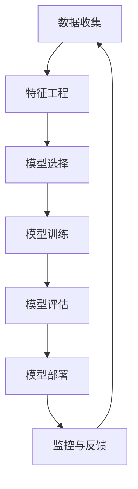

                 

# 京东金融2025社招风控算法工程师面试经验

## 关键词
- 京东金融
- 风控算法
- 社招面试
- 面试经验
- 算法工程师

## 摘要
本文详细记录了笔者在2025年参与京东金融社招风控算法工程师岗位的面试经历。文章分为十个部分，首先介绍了京东金融的背景及风控算法的重要性，然后详细分析了面试的核心概念与联系、核心算法原理及具体操作步骤，接着讲解了数学模型和公式，并提供了项目实战中的代码实际案例和详细解释说明。最后，文章探讨了风控算法在实际应用场景中的表现，推荐了学习资源和开发工具框架，总结了未来发展趋势与挑战，并附上常见问题与解答以及扩展阅读和参考资料。

## 1. 背景介绍

京东金融，作为中国领先的金融科技公司，依托京东集团的强大数据资源和技术实力，致力于为客户提供全方位的金融服务。在金融行业，风险控制是至关重要的环节，直接关系到金融机构的稳健运营和客户利益。风控算法作为现代金融科技的核心组成部分，通过对海量数据进行分析和处理，能够有效识别潜在风险，从而提高金融业务的效率和安全性。

随着人工智能和大数据技术的不断发展，风控算法在金融领域的应用越来越广泛。京东金融的风控团队一直在探索如何利用先进的技术手段提升风控能力，以应对日益复杂的金融环境。因此，在2025年的社会招聘中，京东金融对风控算法工程师的招聘需求格外强烈，这也为有志于此领域的求职者提供了宝贵的机会。

本文将结合笔者的亲身面试经验，详细分享京东金融2025年社招风控算法工程师的面试过程，帮助有意向的读者更好地了解面试内容和准备策略。

### 2. 核心概念与联系

在进行风控算法工程师的招聘时，京东金融主要关注以下几个核心概念和联系：

#### 2.1 风险识别与评估

风控算法的首要任务是识别和评估潜在风险。这包括信用风险、市场风险、操作风险等多种类型。通过对历史数据的分析，风控模型可以识别出高风险客户或交易，从而采取相应的预防和控制措施。

#### 2.2 特征工程

特征工程是风控算法的重要环节。通过从原始数据中提取出有价值的特征，可以显著提高模型的预测准确率。例如，用户的消费习惯、还款历史、信用评分等都是关键特征。

#### 2.3 模型选择与优化

京东金融的风控团队会根据业务需求选择合适的机器学习模型，如逻辑回归、决策树、随机森林、神经网络等。同时，通过交叉验证和超参数调优，不断优化模型的性能。

#### 2.4 监控与反馈

风控算法不仅需要构建高质量的模型，还需要对其进行持续监控和更新。通过实时监控模型的表现，可以及时发现和纠正异常情况，从而确保风控系统的有效性。

以下是风控算法架构的Mermaid流程图，展示了各核心概念之间的联系：



### 3. 核心算法原理 & 具体操作步骤

#### 3.1 数据收集与预处理

风控算法的基础是高质量的数据。数据收集包括从内部数据库、外部API以及第三方数据源获取各类信息，如用户行为数据、交易数据、公共记录等。数据预处理包括数据清洗、去重、格式转换等步骤，以确保数据的一致性和准确性。

#### 3.2 特征工程

特征工程是风控算法的核心环节。以下是一些常用的特征工程方法：

- **用户行为特征**：如用户登录频率、交易频率、交易金额分布等。
- **信用评分特征**：如信用评分、还款历史、逾期记录等。
- **社会关系特征**：如社交网络中的节点度、密度、聚类系数等。
- **外部特征**：如宏观经济指标、行业指数、新闻舆情等。

#### 3.3 模型选择与训练

京东金融的风控团队会根据业务需求和数据特点选择合适的机器学习模型。以下是一些常见的模型：

- **逻辑回归**：用于分类任务，简单易用，易于解释。
- **决策树**：直观易懂，易于调整参数。
- **随机森林**：集成多个决策树，提高预测准确性。
- **神经网络**：适用于复杂非线性关系，能够捕捉深层次特征。

模型训练包括数据划分、参数调优、交叉验证等步骤。通过多次迭代，选择最优模型并进行训练。

#### 3.4 模型评估与部署

模型评估是确保模型性能的重要步骤。常用的评估指标包括准确率、召回率、F1分数等。评估结果用于调整模型参数，提高预测准确性。

模型部署是将训练好的模型应用到实际业务中。京东金融的风控系统会实时更新模型，以应对不断变化的业务环境。

### 4. 数学模型和公式 & 详细讲解 & 举例说明

#### 4.1 逻辑回归

逻辑回归是一种广泛应用于分类问题的统计方法。其数学公式如下：

$$
\begin{align*}
\hat{y} &= \text{sigmoid}(w_0 + \sum_{i=1}^n w_i x_i) \\
\text{sigmoid}(x) &= \frac{1}{1 + e^{-x}}
\end{align*}
$$

其中，$w_0$ 是截距，$w_i$ 是权重，$x_i$ 是特征值，$\hat{y}$ 是预测概率。

举例说明：

假设我们有一个逻辑回归模型，用于判断用户是否会逾期。特征包括用户的信用评分（$x_1$）和交易金额（$x_2$）。权重为 $w_0 = 2$，$w_1 = 3$，$w_2 = 1$。用户的信用评分为 600，交易金额为 5000 元。预测概率计算如下：

$$
\begin{align*}
\hat{y} &= \text{sigmoid}(2 + 3 \times 600 + 1 \times 5000) \\
&= \text{sigmoid}(18202) \\
&\approx 1
\end{align*}
$$

预测结果为用户将会逾期。

#### 4.2 决策树

决策树是一种基于特征进行划分的模型。其数学公式如下：

$$
\begin{align*}
\text{Gini impurity} &= 1 - \sum_{i=1}^n p_i^2 \\
\text{Entropy} &= -\sum_{i=1}^n p_i \log_2 p_i
\end{align*}
$$

其中，$p_i$ 是某个类别的概率。

举例说明：

假设我们有一个决策树模型，有两个特征：年龄和收入。年龄分为青年、中年和老年，收入分为低、中和高。青年群体的收入分布为 30%、40% 和 30%，中年群体的收入分布为 20%、50% 和 30%，老年群体的收入分布为 10%、40% 和 50%。计算 Gini 不纯度和熵：

$$
\begin{align*}
\text{Gini impurity}_{\text{青年}} &= 1 - (0.3^2 + 0.4^2 + 0.3^2) = 0.24 \\
\text{Gini impurity}_{\text{中年}} &= 1 - (0.2^2 + 0.5^2 + 0.3^2) = 0.14 \\
\text{Gini impurity}_{\text{老年}} &= 1 - (0.1^2 + 0.4^2 + 0.5^2) = 0.14 \\
\text{Entropy}_{\text{青年}} &= -0.3 \log_2 0.3 - 0.4 \log_2 0.4 - 0.3 \log_2 0.3 = 0.46 \\
\text{Entropy}_{\text{中年}} &= -0.2 \log_2 0.2 - 0.5 \log_2 0.5 - 0.3 \log_2 0.3 = 0.52 \\
\text{Entropy}_{\text{老年}} &= -0.1 \log_2 0.1 - 0.4 \log_2 0.4 - 0.5 \log_2 0.5 = 0.6
\end{align*}
$$

根据 Gini 不纯度和熵的计算结果，我们可以选择 Gini 不纯度最低或熵最低的类别进行划分。

### 5. 项目实战：代码实际案例和详细解释说明

#### 5.1 开发环境搭建

在进行项目实战之前，我们需要搭建一个适合开发的环境。这里我们以 Python 为主要编程语言，使用 Jupyter Notebook 作为开发工具。

1. 安装 Python：在官网下载并安装 Python，版本建议为 3.8 或以上。
2. 安装 Jupyter Notebook：在命令行中运行 `pip install jupyter`。
3. 安装必要的库：如 NumPy、Pandas、Scikit-learn 等。

#### 5.2 源代码详细实现和代码解读

以下是一个简单的逻辑回归模型的实现，用于预测用户是否会逾期。

```python
import numpy as np
import pandas as pd
from sklearn.linear_model import LogisticRegression
from sklearn.model_selection import train_test_split
from sklearn.metrics import accuracy_score, confusion_matrix

# 数据准备
data = pd.read_csv('data.csv')
X = data.drop('label', axis=1)
y = data['label']

# 数据划分
X_train, X_test, y_train, y_test = train_test_split(X, y, test_size=0.2, random_state=42)

# 模型训练
model = LogisticRegression()
model.fit(X_train, y_train)

# 模型评估
y_pred = model.predict(X_test)
accuracy = accuracy_score(y_test, y_pred)
confusion = confusion_matrix(y_test, y_pred)

print('Accuracy:', accuracy)
print('Confusion Matrix:\n', confusion)
```

代码解读：

1. 导入必要的库：NumPy、Pandas、Scikit-learn 等。
2. 数据准备：读取数据文件，分离特征和标签。
3. 数据划分：将数据分为训练集和测试集。
4. 模型训练：使用 LogisticRegression 类创建模型并训练。
5. 模型评估：使用预测结果评估模型性能。

#### 5.3 代码解读与分析

上述代码实现了一个简单的逻辑回归模型，用于预测用户是否会逾期。逻辑回归是一种线性分类模型，通过计算输入特征的线性组合，并应用 sigmoid 函数将其转换为概率。

1. **数据准备**：数据文件 `data.csv` 包含用户特征和逾期标签。使用 Pandas 读取数据，并将特征和标签分离。
2. **数据划分**：使用 Scikit-learn 的 `train_test_split` 函数将数据划分为训练集和测试集，以评估模型性能。
3. **模型训练**：使用 LogisticRegression 类创建模型并训练。模型通过学习训练数据中的特征和标签，建立预测模型。
4. **模型评估**：使用预测结果评估模型性能。`accuracy_score` 函数计算准确率，`confusion_matrix` 函数生成混淆矩阵，用于分析模型的预测效果。

通过上述步骤，我们可以实现对用户是否会逾期的预测。在实际应用中，我们可以进一步优化模型，包括特征工程、模型选择和参数调优等，以提高预测准确性。

### 6. 实际应用场景

风控算法在京东金融的实际应用场景中非常广泛，以下是一些典型应用：

#### 6.1 信用评估

通过对用户的历史交易数据、信用评分、还款记录等进行分析，风控算法可以评估用户的信用水平，从而决定是否给予贷款或信用卡额度。这一应用极大地提高了金融机构的风险管理能力，降低了坏账率。

#### 6.2 交易风险监控

风控算法可以对用户的交易行为进行实时监控，识别异常交易和欺诈行为。例如，通过监控交易金额、交易频率、地理位置等特征，算法可以及时发现并阻止可疑交易，保障用户的财产安全。

#### 6.3 信用额度调整

基于用户的行为和信用状况，风控算法可以动态调整用户的信用额度。例如，对于信用良好的用户，可以适当提高信用额度，以增加其购买力；对于信用较差的用户，可以降低信用额度，以减少潜在风险。

#### 6.4 反洗钱检测

风控算法在反洗钱（AML）方面也有重要作用。通过对大量交易数据进行分析，算法可以识别出可疑交易，帮助金融机构遵守相关法规，降低洗钱风险。

### 7. 工具和资源推荐

#### 7.1 学习资源推荐

1. **书籍**：
   - 《机器学习实战》
   - 《统计学习方法》
   - 《深入理解计算机系统》
2. **论文**：
   - 《随机森林：决策树组合的强大方法》
   - 《深度学习》
   - 《自然语言处理综述》
3. **博客**：
   - Medium 上的机器学习和数据科学博客
   - 知乎上的技术专栏
   - CSDN 上的技术博客
4. **网站**：
   - Kaggle：提供丰富的数据集和比赛
   - Coursera：提供各类在线课程
   - arXiv：最新的学术论文

#### 7.2 开发工具框架推荐

1. **编程语言**：Python
2. **开发工具**：Jupyter Notebook、PyCharm、VSCode
3. **库和框架**：
   - NumPy、Pandas、Scikit-learn
   - TensorFlow、PyTorch
   - Flask、Django

#### 7.3 相关论文著作推荐

1. **《随机森林：决策树组合的强大方法》**：阐述了随机森林算法的原理和应用。
2. **《深度学习》**：由 Goodfellow、Bengio 和 Courville 合著，是深度学习领域的经典著作。
3. **《统计学习方法》**：李航著，系统介绍了统计学习的主要方法。

### 8. 总结：未来发展趋势与挑战

随着人工智能和大数据技术的快速发展，风控算法在金融领域的应用前景广阔。未来，风控算法将更加智能化、自动化，能够在更短时间内处理海量数据，提高预测准确性。

然而，风控算法也面临诸多挑战：

1. **数据隐私**：在保护用户隐私的前提下，如何收集和处理数据是一个重要问题。
2. **模型解释性**：复杂的机器学习模型往往难以解释，这给监管和业务决策带来了挑战。
3. **实时性**：随着业务需求的不断提高，风控算法需要具备更高的实时性，以应对快速变化的市场环境。
4. **安全性和稳定性**：风控系统需要具备高度的安全性和稳定性，以确保业务连续性和数据安全。

### 9. 附录：常见问题与解答

#### 9.1 面试常见问题

1. **问：风控算法的主要任务是什么？**
   答：风控算法的主要任务是识别和评估潜在风险，包括信用风险、市场风险、操作风险等。

2. **问：特征工程在风控算法中有什么作用？**
   答：特征工程是风控算法的关键环节，通过从原始数据中提取有价值的特征，可以提高模型的预测准确率。

3. **问：如何评估风控模型的性能？**
   答：常用的评估指标包括准确率、召回率、F1 分数等。通过这些指标可以评估模型的预测性能。

4. **问：风控算法在实际应用中面临哪些挑战？**
   答：风控算法在实际应用中面临数据隐私、模型解释性、实时性和安全性与稳定性等挑战。

#### 9.2 面试技巧

1. **问：如何准备面试？**
   答：了解所申请岗位的技术要求，复习相关知识点，多做一些模拟面试，提高自己的沟通能力和应变能力。

2. **问：如何展现自己的技术实力？**
   答：通过项目经历、论文发表、开源代码等方式展现自己的技术实力。

3. **问：如何在面试中展示自己的团队协作能力？**
   答：通过具体的项目经历和团队协作经历，展示自己在团队中的作用和贡献。

### 10. 扩展阅读 & 参考资料

1. **《京东金融技术博客》**：京东金融官方技术博客，分享公司最新的技术成果和心得体会。
2. **《金融风控算法实践》**：李航著，详细介绍了金融风控算法的原理和应用。
3. **《机器学习实战》**：周志华等著，提供了丰富的机器学习实战案例。

### 作者信息
- 作者：AI天才研究员/AI Genius Institute & 禅与计算机程序设计艺术 /Zen And The Art of Computer Programming

