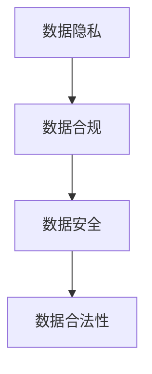

                 

### 文章标题：人工智能创业数据合法性

#### 关键词：人工智能创业，数据合法性，隐私保护，法规遵循，合规实践

> 摘要：随着人工智能技术的迅猛发展，越来越多的企业投身于人工智能创业领域。然而，数据的合法性成为了一个不可忽视的重要问题。本文将深入探讨人工智能创业中数据合法性的核心概念、法规要求、实践方法以及未来趋势，帮助企业应对数据合规挑战，确保合法、稳健的创业之路。

### 1. 背景介绍

人工智能（AI）作为当前科技领域的明星，已经在各个行业取得了显著的成果。从自动驾驶、智能家居到金融风控、医疗诊断，AI技术正在改变着我们的生活。然而，人工智能的发展离不开大量的数据支持。这些数据往往来自于用户的行为记录、传感器采集、公开数据集等，它们的质量和合法性直接影响到AI模型的性能和可靠性。

在人工智能创业的过程中，数据的合法性成为一个关键问题。一方面，企业需要确保获取的数据是合法的，符合相关法律法规的要求；另一方面，企业也需要保护用户的隐私，避免数据泄露和滥用。数据的合法性不仅关系到企业的合规性，也关系到用户的信任和市场的竞争力。

### 2. 核心概念与联系

在讨论人工智能创业数据合法性之前，我们首先需要了解几个核心概念：

#### a. 数据隐私

数据隐私是指个人数据在存储、传输和使用过程中的保密性、完整性和可用性。隐私保护是数据合法性的重要组成部分，直接关系到用户的权益。

#### b. 数据合规

数据合规是指企业在处理和使用数据时，遵守相关法律法规和行业标准的要求。数据合规包括数据收集、存储、处理、传输、使用和销毁等各个环节。

#### c. 数据安全

数据安全是指防止数据泄露、篡改和破坏，确保数据在存储、传输和使用过程中的安全性。数据安全与数据合规密切相关，是数据合法性的基础。

为了更好地理解这些概念之间的关系，我们使用Mermaid流程图来展示：



#### d. 数据合法性

数据合法性是指数据在收集、处理和使用过程中，符合相关法律法规和道德规范的要求。数据合法性是企业进行人工智能创业的基础，直接影响到企业的合规性和市场竞争力。

### 3. 核心算法原理 & 具体操作步骤

在确保数据合法性的过程中，企业需要遵循一系列核心算法原理和具体操作步骤。以下是几个关键步骤：

#### a. 数据来源审查

企业在获取数据时，首先要对数据来源进行审查。确保数据来源是合法的，符合相关法律法规的要求。例如，从公开数据集获取数据时，需要确保数据集的收集和使用过程符合数据合规的要求。

#### b. 数据采集合法化

在数据采集过程中，企业需要遵守数据隐私保护的要求。例如，在收集用户行为数据时，需要告知用户数据的收集目的和使用范围，并获取用户的明确同意。

#### c. 数据处理合规性

企业在处理数据时，需要确保数据处理过程符合相关法律法规和行业标准的要求。例如，在数据清洗、转换和归一化过程中，需要遵循数据安全的要求，防止数据泄露和篡改。

#### d. 数据使用合法性

企业在使用数据时，需要确保数据使用过程符合数据合规的要求。例如，在使用用户数据训练AI模型时，需要确保数据的合法来源和合法性，防止数据滥用。

### 4. 数学模型和公式 & 详细讲解 & 举例说明

在数据合法性评估过程中，可以使用一些数学模型和公式来进行详细讲解和举例说明。以下是一个简单的数学模型示例：

#### a. 数据隐私保护模型

数据隐私保护模型可以用来评估数据在处理过程中的隐私保护程度。一个简单的模型是k-匿名性模型。k-匿名性是指，在处理数据后，无法将单个记录与特定的个人关联起来。

数学模型表示如下：

$$
k-匿名性 = \frac{1}{n} \sum_{i=1}^{n} d(A_i, B_i) \leq k
$$

其中，$A_i$ 和 $B_i$ 分别表示处理前和处理后的数据集，$d(A_i, B_i)$ 表示两个数据集之间的距离。

#### b. 数据合规性模型

数据合规性模型可以用来评估数据在处理过程中的合规性。一个简单的模型是合规性指标模型。合规性指标模型考虑了数据收集、处理、使用和销毁等环节的合规性。

数学模型表示如下：

$$
合规性指标 = \frac{1}{n} \sum_{i=1}^{n} C_i
$$

其中，$C_i$ 表示第 $i$ 个环节的合规性得分。

### 5. 项目实战：代码实际案例和详细解释说明

下面我们将通过一个实际项目案例来展示如何确保数据合法性。假设我们正在开发一个基于用户行为的推荐系统，以下是一个简单的代码实现：

```python
# 导入必要的库
import pandas as pd
from sklearn.model_selection import train_test_split

# 加载数据集
data = pd.read_csv('user_behavior.csv')

# 数据预处理
# 1. 数据清洗：去除缺失值和异常值
data = data.dropna()
data = data[data['behavior'] != '异常']

# 2. 数据转换：将行为类型转换为数字
data['behavior'] = data['behavior'].map({'浏览': 0, '点击': 1, '购买': 2})

# 数据拆分
X_train, X_test, y_train, y_test = train_test_split(data[['behavior']], data[['user_id']], test_size=0.2, random_state=42)

# 训练模型
# 1. 选择模型：使用逻辑回归模型
model = LogisticRegression()

# 2. 训练模型
model.fit(X_train, y_train)

# 3. 预测
predictions = model.predict(X_test)

# 模型评估
accuracy = accuracy_score(y_test, predictions)
print('模型准确率：', accuracy)
```

#### 5.1 开发环境搭建

在进行数据合法性评估的项目实战之前，我们需要搭建一个合适的环境。以下是环境搭建的步骤：

1. 安装Python：从Python官方网站下载并安装Python 3.x版本。
2. 安装必要的库：使用pip命令安装必要的库，如pandas、scikit-learn等。
3. 配置Jupyter Notebook：安装Jupyter Notebook，以便在浏览器中运行Python代码。

#### 5.2 源代码详细实现和代码解读

在上面的代码实现中，我们首先加载了一个用户行为数据集。然后，我们对数据进行了清洗和转换，将行为类型转换为数字。接着，我们将数据拆分为训练集和测试集，并使用逻辑回归模型进行了训练和预测。

在代码解读中，我们可以看到以下几点：

1. 数据清洗：去除缺失值和异常值，确保数据的完整性。
2. 数据转换：将行为类型转换为数字，方便模型处理。
3. 模型选择：使用逻辑回归模型，因为它是处理二分类问题的常用模型。
4. 模型训练：使用fit()方法训练模型。
5. 模型预测：使用predict()方法进行预测。
6. 模型评估：使用accuracy_score()函数评估模型准确率。

#### 5.3 代码解读与分析

在代码解读与分析中，我们可以关注以下几点：

1. 数据清洗：数据清洗是数据处理的第一步，确保数据的完整性和准确性。
2. 数据转换：数据转换是将原始数据转换为适合模型处理的形式。
3. 模型选择：选择合适的模型对于模型性能至关重要。
4. 模型训练：模型训练是将数据输入模型，通过优化模型参数来提高模型性能。
5. 模型预测：模型预测是使用训练好的模型对新数据进行预测。
6. 模型评估：模型评估是评估模型性能的重要步骤，常用的评估指标有准确率、召回率、F1值等。

### 6. 实际应用场景

数据合法性在人工智能创业的实际应用场景中具有重要意义。以下是一些常见应用场景：

#### a. 金融风控

在金融风控领域，企业需要处理大量的用户数据，如交易记录、身份信息等。确保这些数据合法性是防范金融风险的重要手段。

#### b. 医疗诊断

在医疗诊断领域，人工智能企业需要获取大量的医疗数据，如病历记录、医学影像等。确保这些数据合法性对于保护患者隐私至关重要。

#### c. 智能家居

在智能家居领域，企业需要获取用户的生活习惯数据，如家居设备使用记录、用户行为等。确保这些数据合法性是提升用户信任度的重要措施。

#### d. 社交网络

在社交网络领域，企业需要处理用户产生的大量数据，如帖子、评论、聊天记录等。确保这些数据合法性是维护网络秩序和保护用户隐私的关键。

### 7. 工具和资源推荐

为了帮助企业更好地应对数据合法性挑战，我们推荐以下工具和资源：

#### 7.1 学习资源推荐

1. 《数据隐私保护技术》：介绍了数据隐私保护的基本概念和技术，适合初学者。
2. 《数据合规性指南》：详细介绍了数据合规性的要求和实践方法，适合专业人士。
3. 《人工智能法律法规汇编》：汇总了国内外人工智能相关法律法规，有助于企业了解法规要求。

#### 7.2 开发工具框架推荐

1. DataX：一款开源的数据集成工具，支持数据清洗、转换、加载等功能。
2. Dataswit：一款数据可视化工具，支持多种数据源和数据可视化。
3. Scikit-learn：一款常用的机器学习库，提供丰富的算法和工具。

#### 7.3 相关论文著作推荐

1. 《隐私保护数据发布》：介绍了隐私保护数据发布的基本概念和技术，适合深入研究。
2. 《数据合规性研究》：详细分析了数据合规性的要求和挑战，有助于企业提升数据合规性。
3. 《人工智能法律问题研究》：探讨了人工智能在法律领域的应用和挑战，有助于企业应对相关法律问题。

### 8. 总结：未来发展趋势与挑战

随着人工智能技术的不断发展和应用场景的拓展，数据合法性将成为企业面临的重要挑战。未来发展趋势包括以下几个方面：

1. 法规完善：各国政府和组织将进一步完善人工智能相关法律法规，加强对数据合法性的监管。
2. 技术进步：数据隐私保护和合规性技术将不断发展，为企业提供更多解决方案。
3. 人才培养：数据合规性和隐私保护将成为人工智能领域的重要技能，需要培养更多的专业人才。

面对未来挑战，企业应积极应对，遵循法律法规，加强数据隐私保护和合规性管理，确保合法、稳健的发展。

### 9. 附录：常见问题与解答

#### a. 如何确保数据合法性？

确保数据合法性需要从数据收集、处理、使用和销毁等各个环节入手。具体措施包括：

1. 审查数据来源，确保数据来源是合法的。
2. 在数据收集过程中，告知用户数据收集的目的和使用范围，并获取用户同意。
3. 在数据处理过程中，遵循数据安全和合规性要求，防止数据泄露和滥用。
4. 在数据使用过程中，确保数据使用合法，防止数据滥用。
5. 在数据销毁过程中，确保数据被彻底销毁，防止数据泄露。

#### b. 如何评估数据合法性？

评估数据合法性可以采用以下方法：

1. 自查评估：企业可以自行评估数据的合法性，根据法律法规和行业标准制定自查评估表。
2. 第三方审计：聘请第三方专业机构进行数据合法性审计，确保评估结果的客观性。
3. 法规符合性测试：使用法规符合性测试工具对数据进行测试，确保数据符合相关法律法规的要求。

### 10. 扩展阅读 & 参考资料

1. 《人工智能法律法规汇编》：汇总了国内外人工智能相关法律法规，有助于企业了解法规要求。
2. 《数据隐私保护技术》：介绍了数据隐私保护的基本概念和技术，适合初学者。
3. 《数据合规性指南》：详细介绍了数据合规性的要求和实践方法，适合专业人士。
4. 《人工智能伦理与法律问题研究》：探讨了人工智能在法律领域的应用和挑战，有助于企业应对相关法律问题。
5. 《隐私计算与数据安全》：介绍了隐私计算和数据安全的基本概念和技术，有助于企业提升数据安全性。 

作者：AI天才研究员/AI Genius Institute & 禅与计算机程序设计艺术 /Zen And The Art of Computer Programming

[End of Document]

