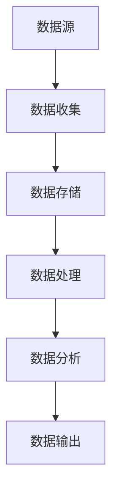

                 

## 1. 背景介绍

### 1.1 人工智能创业现状

近年来，人工智能（AI）技术的飞速发展，使得越来越多的创业者开始将目光投向这一领域。从深度学习到自然语言处理，从计算机视觉到机器人技术，人工智能在各行各业都展现出了巨大的潜力。然而，随着创业项目的增加，数据管理问题也日益突出。

数据管理不仅是人工智能项目成功的关键因素，也是创业公司面临的重大挑战之一。对于初创公司而言，如何在有限的资源和时间内高效地收集、存储、处理和分析海量数据，是一个亟待解决的问题。不当的数据管理可能导致数据丢失、效率低下、决策失误等问题，从而影响项目的进展和成果。

### 1.2 数据管理的挑战

1. **数据量大**：随着互联网的普及和物联网技术的发展，数据量呈现出爆炸式增长。对于初创公司而言，如何存储和管理如此庞大的数据集成为一大难题。

2. **数据类型多样**：现代人工智能项目通常需要处理多种类型的数据，包括结构化数据（如数据库）、半结构化数据（如日志文件）和非结构化数据（如文本、图片、视频）。如何统一管理和处理这些数据类型，是数据管理中的另一个挑战。

3. **数据质量要求高**：高质量的数据是人工智能项目成功的基石。初创公司需要确保数据的一致性、完整性和准确性，这对于缺乏专业数据治理团队的初创公司来说，是一个不小的挑战。

4. **实时性需求强**：在许多人工智能应用场景中，如金融交易、自动驾驶等，对数据的实时性有很高的要求。如何快速、准确地处理和分析实时数据，是数据管理中需要克服的难题。

5. **数据安全与隐私**：随着数据隐私法规的日益严格，如何保护用户数据的安全和隐私成为初创公司必须重视的问题。不当的数据处理可能导致用户隐私泄露，严重时甚至会影响公司的声誉和业务。

### 1.3 数据管理的最佳方案

面对上述挑战，初创公司需要采取一系列措施来确保数据管理的有效性和安全性。本文将详细探讨数据管理的最佳方案，包括核心概念、算法原理、数学模型、实战案例以及未来发展趋势。通过这篇文章，希望能够为人工智能创业者在数据管理方面提供一些有益的指导。

在接下来的章节中，我们将首先介绍数据管理中的核心概念和原理，并通过Mermaid流程图展示数据管理的基本架构。然后，我们将深入探讨数据管理中的核心算法原理和具体操作步骤，包括数据收集、存储、处理和分析等环节。接着，我们将介绍数据管理中常用的数学模型和公式，并通过实际案例进行详细讲解。随后，我们将通过一个具体的实战案例，展示如何使用代码实现数据管理方案。最后，我们将探讨数据管理的实际应用场景，推荐一些有用的工具和资源，并总结未来发展趋势与挑战。

## 2. 核心概念与联系

### 2.1 数据管理的基本概念

数据管理是指对数据的收集、存储、处理、分析和共享进行系统化、规范化的管理，以确保数据的质量、安全性和可用性。在数据管理中，涉及到以下几个核心概念：

- **数据收集**：指通过各种手段获取所需的数据，如传感器、数据库、网络爬虫等。
- **数据存储**：指将收集到的数据存储到合适的存储介质中，如数据库、文件系统、云存储等。
- **数据处理**：指对存储的数据进行清洗、转换、聚合等操作，以获得有用的信息。
- **数据分析**：指使用统计、机器学习等方法对数据进行深入分析，以发现数据中的规律和趋势。
- **数据共享**：指在不同系统、部门或组织之间共享数据，以实现资源的最大化利用。

### 2.2 数据管理的基本架构

数据管理的基本架构通常包括数据源、数据存储、数据处理、数据分析和数据输出等环节。以下是一个简化的Mermaid流程图，展示了数据管理的基本流程：



### 2.3 数据管理中的核心联系

在数据管理过程中，各个环节之间存在紧密的联系。例如：

- 数据收集的质量直接影响数据存储和处理的质量。
- 数据存储的效率直接影响数据处理的效率。
- 数据处理的准确性直接影响数据分析的结果。
- 数据分析的结果可以指导数据收集和存储的优化。

这些联系使得数据管理成为一个复杂而关键的过程。在接下来的章节中，我们将深入探讨数据管理中的核心算法原理和具体操作步骤，以帮助读者更好地理解和应用数据管理技术。

### 2.4 数据管理中的挑战与解决方案

#### 2.4.1 数据收集的挑战

数据收集是数据管理的第一步，也是最关键的一步。然而，数据收集过程中面临着诸多挑战：

- **数据来源多样化**：数据可能来自多种不同的来源，如数据库、传感器、用户输入等。不同来源的数据格式和结构可能有所不同，增加了数据收集的难度。
- **数据实时性要求**：在许多应用场景中，如实时监控、自动驾驶等，对数据的实时性有很高的要求。如何高效地收集并处理实时数据是一个重大挑战。
- **数据质量保障**：收集到的数据可能存在缺失、重复、不一致等问题，如何确保数据质量是一个需要解决的问题。

针对这些挑战，可以采取以下解决方案：

- **统一数据接口**：通过设计统一的接口，将不同来源的数据进行统一处理，简化数据收集的复杂性。
- **实时数据处理**：采用分布式计算和实时流处理技术，如Apache Kafka和Apache Flink，以高效处理实时数据。
- **数据清洗与质量保障**：使用数据清洗技术，如数据去重、缺失值填充、一致性校验等，确保数据质量。

#### 2.4.2 数据存储的挑战

数据存储是数据管理的重要环节，同样面临着一系列挑战：

- **存储容量**：随着数据量的不断增长，如何扩展存储容量成为一个关键问题。
- **存储效率**：如何提高数据存储和检索的效率，以满足快速访问和查询的需求。
- **数据安全性**：如何确保数据在存储过程中的安全性和隐私性。

解决这些挑战的方法包括：

- **分布式存储**：采用分布式存储系统，如Hadoop HDFS和Amazon S3，以实现高效扩展存储容量。
- **缓存技术**：使用缓存技术，如Redis和Memcached，提高数据检索效率。
- **数据加密与访问控制**：采用数据加密和访问控制技术，如SSL/TLS和IAM，确保数据在存储过程中的安全性和隐私性。

#### 2.4.3 数据处理的挑战

数据处理是数据管理的核心环节，同样面临诸多挑战：

- **数据清洗**：如何处理缺失值、重复值、异常值等问题，以获得高质量的数据。
- **数据转换**：如何将不同格式和结构的数据进行统一处理，以支持后续的分析和应用。
- **数据聚合**：如何将大量分散的数据进行聚合，以提取有用的信息。

解决这些挑战的方法包括：

- **数据预处理库**：使用数据预处理库，如Pandas和NumPy，进行数据清洗、转换和聚合操作。
- **批处理与流处理**：采用批处理和流处理技术，如MapReduce和Apache Flink，处理大规模数据。
- **特征工程**：通过特征工程，提取数据中的关键特征，为后续的分析和应用提供支持。

#### 2.4.4 数据分析的挑战

数据分析是数据管理的最终目标，同样面临一系列挑战：

- **数据可视化**：如何通过可视化技术，直观地展示数据中的规律和趋势。
- **模型选择**：如何选择合适的机器学习模型，以获得最佳的分析效果。
- **模型评估**：如何评估模型的性能，以确定其是否满足业务需求。

解决这些挑战的方法包括：

- **数据可视化工具**：使用数据可视化工具，如Matplotlib和Seaborn，进行数据可视化。
- **机器学习库**：使用机器学习库，如scikit-learn和TensorFlow，进行模型选择和训练。
- **模型评估指标**：使用模型评估指标，如准确率、召回率、F1值等，评估模型的性能。

通过以上分析，可以看出数据管理过程中存在许多挑战，但通过采取相应的解决方案，可以有效应对这些挑战，确保数据管理的有效性。

### 2.5 数据管理的基本流程

数据管理的基本流程可以分为以下几个步骤：

#### 2.5.1 数据收集

数据收集是数据管理的基础，涉及到从多种来源获取数据。这些数据来源可能包括：

- **内部数据源**：如企业内部数据库、日志文件、传感器数据等。
- **外部数据源**：如社交媒体、公开数据库、政府数据等。

在数据收集过程中，需要确保数据的质量和实时性。可以采用自动化工具和接口，如ETL（Extract, Transform, Load）工具，实现数据的自动化收集和预处理。

#### 2.5.2 数据存储

数据存储是将收集到的数据存储到合适的存储介质中。常用的数据存储方式包括：

- **关系型数据库**：如MySQL、PostgreSQL，适用于结构化数据的存储和查询。
- **非关系型数据库**：如MongoDB、Cassandra，适用于存储半结构化或非结构化数据。
- **分布式存储系统**：如Hadoop HDFS、Amazon S3，适用于存储海量数据。

选择合适的存储方式，可以满足数据存储的需求，并确保数据的高效访问和查询。

#### 2.5.3 数据处理

数据处理是对存储的数据进行清洗、转换和聚合等操作，以提取有用的信息。数据处理步骤通常包括：

- **数据清洗**：处理缺失值、重复值、异常值等问题，确保数据的一致性和准确性。
- **数据转换**：将不同格式和结构的数据进行统一处理，如数据类型的转换、数据的标准化等。
- **数据聚合**：对大量分散的数据进行聚合，如求和、平均值、中位数等，提取数据中的关键特征。

数据处理的结果是高质量的数据，为后续的分析和应用提供了基础。

#### 2.5.4 数据分析

数据分析是数据管理的核心，通过对处理后的数据进行深入分析，以发现数据中的规律和趋势。数据分析的方法包括：

- **统计分析**：如回归分析、聚类分析、因子分析等，用于探索数据中的关系和趋势。
- **机器学习**：如分类、回归、聚类等，用于构建预测模型和分类模型。
- **数据挖掘**：如关联规则挖掘、异常检测等，用于发现数据中的隐藏模式。

数据分析的结果可以为企业提供有价值的信息，支持决策和优化业务流程。

#### 2.5.5 数据输出

数据输出是将分析结果以可视化的形式呈现给用户，如报表、图表、可视化界面等。数据输出可以方便用户理解数据，并基于数据做出决策。

通过以上基本流程，数据管理可以确保数据从收集、存储、处理、分析到输出的整个过程中，保持高质量和高效性，从而为企业提供有价值的洞察和决策支持。

### 2.6 数据管理的最佳实践

为了确保数据管理的有效性，初创公司在数据管理过程中可以遵循以下最佳实践：

#### 2.6.1 数据质量管理

数据质量是数据管理的核心，对于确保数据分析结果的可信度至关重要。以下是一些数据质量管理的方法：

- **数据清洗**：对数据进行清洗，包括处理缺失值、重复值、异常值等，确保数据的一致性和准确性。
- **数据标准化**：将不同格式和结构的数据进行统一处理，如数据类型的转换、数据的标准化等。
- **数据验证**：使用数据验证技术，如数据校验、范围限制等，确保数据的质量。
- **数据审计**：定期对数据进行审计，检查数据质量，发现问题及时解决。

#### 2.6.2 数据安全与隐私保护

随着数据隐私法规的日益严格，数据安全与隐私保护成为初创公司必须重视的问题。以下是一些数据安全与隐私保护的方法：

- **数据加密**：对存储和传输的数据进行加密，确保数据在未经授权的情况下无法被访问。
- **访问控制**：使用访问控制技术，如权限管理、多因素认证等，确保只有授权用户可以访问数据。
- **数据备份与恢复**：定期对数据进行备份，确保数据在发生意外时可以快速恢复。
- **数据隐私保护**：遵守数据隐私法规，如GDPR、CCPA等，确保用户数据的隐私保护。

#### 2.6.3 数据存储与处理优化

为了提高数据存储和处理效率，初创公司可以采取以下措施：

- **分布式存储**：使用分布式存储系统，如Hadoop HDFS、Amazon S3等，实现高效的数据存储和扩展。
- **批量处理与流处理**：结合批量处理和流处理技术，如MapReduce、Apache Flink等，实现高效的数据处理。
- **缓存技术**：使用缓存技术，如Redis、Memcached等，提高数据检索效率。
- **数据压缩**：对数据进行压缩，减少存储空间和传输带宽。

#### 2.6.4 数据分析与应用优化

为了充分发挥数据分析的价值，初创公司可以采取以下措施：

- **数据分析工具**：选择合适的数据分析工具，如Pandas、NumPy、scikit-learn等，实现高效的数据分析。
- **可视化工具**：使用可视化工具，如Matplotlib、Seaborn等，将分析结果以直观的形式呈现。
- **特征工程**：通过特征工程，提取数据中的关键特征，为数据分析提供支持。
- **模型选择与优化**：选择合适的机器学习模型，并通过交叉验证等方法进行模型优化，以提高分析效果。

通过遵循这些最佳实践，初创公司可以确保数据管理的有效性，从而支持人工智能项目的成功。

### 2.7 数据管理的关键挑战与解决方案

在数据管理过程中，初创公司会面临一系列关键挑战，这些挑战涉及到数据收集、存储、处理和分析的各个方面。以下是一些常见的挑战以及相应的解决方案：

#### 2.7.1 数据量增长带来的挑战

随着互联网和物联网的快速发展，数据量呈现爆炸式增长。这对初创公司的数据存储和处理能力提出了严峻的考验。解决方案包括：

- **分布式存储系统**：采用分布式存储系统，如Hadoop HDFS、Cassandra等，以实现高效扩展和分布式处理。
- **批量处理与流处理**：结合批量处理和流处理技术，如MapReduce、Apache Flink等，以应对实时数据和非实时数据的处理需求。
- **数据压缩与去重**：对数据进行压缩和去重处理，减少存储空间和带宽占用。

#### 2.7.2 多样化数据类型的挑战

现代人工智能项目通常需要处理多种类型的数据，包括结构化数据、半结构化数据和非结构化数据。如何统一管理和处理这些数据类型成为一大挑战。解决方案包括：

- **数据集成平台**：采用数据集成平台，如Apache Kafka、Apache NiFi等，实现不同数据源的数据接入和整合。
- **NoSQL数据库**：采用NoSQL数据库，如MongoDB、Cassandra等，以适应多样化数据类型的存储需求。
- **数据转换与映射**：使用数据转换与映射技术，如ETL工具、数据清洗库等，将不同数据类型进行统一处理。

#### 2.7.3 数据质量和实时性的挑战

高质量的数据是人工智能项目成功的关键，而实时性需求也在不断增长。如何保障数据质量和满足实时性需求成为重要挑战。解决方案包括：

- **数据质量管理工具**：采用数据质量管理工具，如Pandas、NumPy等，进行数据清洗、验证和审计。
- **实时数据处理平台**：采用实时数据处理平台，如Apache Kafka、Apache Flink等，以实现高效的数据实时处理。
- **数据流式分析**：采用数据流式分析技术，如Spark Streaming、Apache Storm等，以实时分析流数据。

#### 2.7.4 数据安全和隐私保护

数据安全和隐私保护在数据管理中至关重要，随着数据隐私法规的日益严格，如何保护用户数据的安全和隐私成为重要挑战。解决方案包括：

- **数据加密与访问控制**：采用数据加密和访问控制技术，如SSL/TLS、IAM等，确保数据在存储和传输过程中的安全性和隐私性。
- **数据备份与恢复**：定期进行数据备份，确保在数据丢失或损坏时能够快速恢复。
- **数据隐私法规遵守**：遵守数据隐私法规，如GDPR、CCPA等，确保用户数据的隐私保护。

通过采取上述解决方案，初创公司可以有效地应对数据管理中的关键挑战，确保数据管理的有效性和安全性，从而支持人工智能项目的成功。

## 3. 核心算法原理 & 具体操作步骤

### 3.1 数据收集

数据收集是数据管理的第一步，也是最重要的一步。数据收集的质量直接影响后续的数据处理和分析效果。以下是一些常见的数据收集方法：

#### 3.1.1 自动化数据收集

自动化数据收集是指通过编写脚本或使用现成的工具，自动从互联网、数据库、传感器等来源获取数据。常见的自动化数据收集工具包括：

- **API接口**：使用API接口，如RESTful API，从在线服务获取数据。
- **网络爬虫**：使用网络爬虫，如Scrapy，从网站爬取数据。
- **数据库连接**：使用数据库连接，如SQL查询，从数据库中提取数据。

#### 3.1.2 手动数据收集

手动数据收集是指通过人工方式收集数据，如填写调查问卷、采访用户等。这种方法适用于数据来源有限或难以自动获取的场景。

### 3.2 数据存储

数据存储是将收集到的数据存储到合适的存储介质中。根据数据类型和需求，可以选择不同的存储方案：

#### 3.2.1 关系型数据库

关系型数据库，如MySQL、PostgreSQL等，适用于存储结构化数据。关系型数据库具有以下特点：

- **数据结构明确**：数据以表格的形式存储，方便查询和管理。
- **事务支持**：支持事务操作，确保数据的一致性和完整性。
- **查询效率高**：使用SQL语言进行查询，效率高。

#### 3.2.2 非关系型数据库

非关系型数据库，如MongoDB、Cassandra等，适用于存储半结构化或非结构化数据。非关系型数据库具有以下特点：

- **灵活性高**：数据结构灵活，可以存储不同类型的数据。
- **扩展性强**：支持水平扩展，适应大规模数据存储需求。
- **查询效率高**：使用NoSQL查询语言，查询效率高。

#### 3.2.3 分布式存储系统

分布式存储系统，如Hadoop HDFS、Amazon S3等，适用于存储海量数据。分布式存储系统具有以下特点：

- **高可靠性**：数据自动备份，确保数据不丢失。
- **高扩展性**：支持水平扩展，适应大规模数据存储需求。
- **高可用性**：数据分布存储，提高系统的可用性。

### 3.3 数据处理

数据处理是对存储的数据进行清洗、转换和聚合等操作，以提取有用的信息。以下是一些常见的数据处理方法：

#### 3.3.1 数据清洗

数据清洗是数据处理的重要步骤，目的是去除数据中的错误、异常和重复值。常见的数据清洗方法包括：

- **缺失值处理**：对缺失值进行填充或删除。
- **异常值处理**：对异常值进行删除或修正。
- **重复值处理**：删除重复的数据记录。

#### 3.3.2 数据转换

数据转换是将不同格式或结构的数据转换为统一的格式或结构。常见的数据转换方法包括：

- **数据类型转换**：将不同数据类型（如字符串、整数、浮点数等）进行转换。
- **数据规范化**：将数据按照统一的标准进行规范化处理，如统一编码、日期格式等。
- **数据归一化**：将数据缩放到相同的尺度，如归一化、标准化等。

#### 3.3.3 数据聚合

数据聚合是对大量分散的数据进行汇总和计算，以提取关键信息。常见的数据聚合方法包括：

- **求和**：对一组数据进行求和计算。
- **平均值**：对一组数据进行平均值计算。
- **中位数**：对一组数据进行中位数计算。
- **标准差**：对一组数据进行标准差计算。

### 3.4 数据分析

数据分析是对处理后的数据进行深入分析，以发现数据中的规律和趋势。以下是一些常见的数据分析方法：

#### 3.4.1 统计分析

统计分析是数据分析的基础方法，包括描述性统计和推理性统计。描述性统计用于描述数据的基本特征，如平均值、标准差等。推理性统计用于对总体数据进行推断，如假设检验、置信区间等。

#### 3.4.2 机器学习

机器学习是数据分析的重要工具，通过构建预测模型和分类模型，对数据进行分类、回归、聚类等操作。常见的机器学习方法包括决策树、支持向量机、神经网络等。

#### 3.4.3 数据可视化

数据可视化是将数据以图形化的形式呈现，帮助用户直观地理解数据。常见的数据可视化工具包括Matplotlib、Seaborn、D3.js等。

通过以上步骤，初创公司可以有效地收集、存储、处理和分析数据，从而为人工智能项目提供有力的支持。在下一节中，我们将介绍数据管理中的数学模型和公式，并通过实际案例进行详细讲解。

### 3.5 数学模型和公式

数据管理中的数学模型和公式在数据处理和分析过程中起着至关重要的作用。以下是一些常用的数学模型和公式，以及它们的详细讲解和应用实例。

#### 3.5.1 均值和标准差

**均值（Mean）**：均值是描述数据集中趋势的统计量，计算公式如下：

$$
\text{Mean} = \frac{\sum_{i=1}^{n} x_i}{n}
$$

其中，$x_i$ 表示数据集中的第 $i$ 个值，$n$ 表示数据集的大小。

**标准差（Standard Deviation）**：标准差是描述数据集分散程度的统计量，计算公式如下：

$$
\text{Standard Deviation} = \sqrt{\frac{\sum_{i=1}^{n} (x_i - \text{Mean})^2}{n-1}}
$$

通过均值和标准差，我们可以了解数据的集中趋势和分散程度。例如，在分析用户满意度评分时，可以使用均值表示平均满意度，使用标准差表示满意度的波动范围。

#### 3.5.2 相关系数

**皮尔逊相关系数（Pearson Correlation Coefficient）**：皮尔逊相关系数是衡量两个变量线性相关程度的统计量，计算公式如下：

$$
\rho = \frac{\sum_{i=1}^{n} (x_i - \bar{x})(y_i - \bar{y})}{\sqrt{\sum_{i=1}^{n} (x_i - \bar{x})^2} \sqrt{\sum_{i=1}^{n} (y_i - \bar{y})^2}}
$$

其中，$x_i$ 和 $y_i$ 分别表示两个变量的第 $i$ 个值，$\bar{x}$ 和 $\bar{y}$ 分别表示两个变量的均值。

皮尔逊相关系数的取值范围为 [-1, 1]。当相关系数接近 1 时，表示两个变量高度正相关；当相关系数接近 -1 时，表示两个变量高度负相关；当相关系数接近 0 时，表示两个变量无线性相关。

例如，在分析用户年龄与购买金额的关系时，可以通过计算皮尔逊相关系数来衡量这两个变量的线性相关性。

#### 3.5.3 决策树

**决策树（Decision Tree）**：决策树是一种常见的机器学习算法，用于分类和回归问题。决策树的核心是构建一个树状结构，每个节点表示一个特征，每个分支表示该特征的取值。

决策树的构建过程可以通过以下步骤进行：

1. **选择最优特征**：选择能够最大化信息增益的特征，信息增益的计算公式如下：

$$
\text{Information Gain} = \sum_{v \in V} p(v) \cdot \text{Entropy}(L_v)
$$

其中，$V$ 表示特征的所有可能取值，$p(v)$ 表示取值 $v$ 的概率，$\text{Entropy}(L_v)$ 表示在特征取值 $v$ 下的类别熵。

2. **递归构建子树**：对选择的最优特征进行递归划分，构建子树。

3. **剪枝**：通过剪枝技术，减少过拟合，提高模型的泛化能力。

例如，在分析客户购买行为时，可以使用决策树模型，通过客户的年龄、收入等特征，预测其购买概率。

#### 3.5.4 支持向量机

**支持向量机（Support Vector Machine，SVM）**：支持向量机是一种常见的机器学习算法，用于分类和回归问题。SVM的核心是通过找到最佳的超平面，将不同类别的数据分隔开来。

SVM的构建过程可以通过以下步骤进行：

1. **特征空间映射**：将原始数据映射到高维特征空间，找到最佳的超平面。

2. **求解最优超平面**：通过求解优化问题，找到最佳的超平面参数。

3. **分类决策**：根据测试数据与最佳超平面的距离，进行分类决策。

例如，在分析客户信用评分时，可以使用SVM模型，通过客户的年龄、收入等特征，预测其信用等级。

#### 3.5.5 神经网络

**神经网络（Neural Network）**：神经网络是一种基于生物神经系统的机器学习算法，用于分类、回归和特征提取等问题。神经网络的核心是通过多层神经元之间的连接，模拟大脑的信息处理过程。

神经网络的构建过程可以通过以下步骤进行：

1. **构建神经网络结构**：确定网络的层数、每层的神经元数量等。

2. **初始化参数**：为网络的权重和偏置初始化随机值。

3. **前向传播**：计算输入数据在网络中的传递过程，得到输出结果。

4. **反向传播**：通过计算损失函数的梯度，更新网络的权重和偏置。

5. **优化算法**：使用梯度下降等优化算法，最小化损失函数。

例如，在分析图像分类问题时，可以使用神经网络模型，通过学习图像的特征，实现图像的分类。

通过以上数学模型和公式，初创公司可以有效地处理和分析数据，从而为人工智能项目提供有力的支持。在下一节中，我们将通过一个实际的项目案例，展示如何使用这些模型和公式进行数据管理。

### 3.6 项目实战：代码实际案例和详细解释说明

在本节中，我们将通过一个实际的项目案例，展示如何使用代码实现数据管理方案。本案例将涉及数据收集、数据存储、数据处理和数据分析等步骤，并使用Python编程语言和相关库进行实现。

#### 3.6.1 项目背景

假设我们是一家初创公司，专注于提供智能家居解决方案。我们的目标是收集和分析用户在家庭环境中的行为数据，以优化产品和服务。数据来源包括用户安装在家中的智能设备（如智能灯泡、智能插座等）以及用户与这些设备的交互数据。

#### 3.6.2 开发环境搭建

为了实现数据管理方案，我们需要搭建以下开发环境：

- **Python环境**：安装Python 3.8及以上版本。
- **库和框架**：安装NumPy、Pandas、SciPy、Matplotlib、Scikit-learn等库和框架。

#### 3.6.3 数据收集

首先，我们需要收集用户行为数据。数据收集可以通过以下步骤进行：

1. **传感器数据**：从智能设备中获取传感器数据，如温度、湿度、亮度等。可以使用API接口或直接读取设备数据文件。
2. **用户交互数据**：从用户与智能设备的交互数据中获取信息，如开关灯的时间、设定温度等。这些数据可以通过日志文件或API接口获取。

以下是数据收集的Python代码实现：

```python
import requests
import json

# 传感器数据收集
def collect_sensors_data(api_url):
    response = requests.get(api_url)
    data = response.json()
    return data

# 用户交互数据收集
def collect_user_interaction_data(log_file):
    with open(log_file, 'r') as f:
        data = json.load(f)
    return data

sensors_api_url = 'https://api.smart-home.com/sensors'
user_log_file = 'user_interaction_log.json'

sensors_data = collect_sensors_data(sensors_api_url)
user_interaction_data = collect_user_interaction_data(user_log_file)
```

#### 3.6.4 数据存储

接下来，我们需要将收集到的数据存储到合适的存储介质中。在本案例中，我们使用MongoDB进行数据存储。以下是数据存储的Python代码实现：

```python
from pymongo import MongoClient

# MongoDB连接
client = MongoClient('mongodb://localhost:27017/')

# 传感器数据存储
db = client['smart_home']
sensors_collection = db['sensors_data']
sensors_collection.insert_many(sensors_data)

# 用户交互数据存储
user_interaction_collection = db['user_interaction_data']
user_interaction_collection.insert_many(user_interaction_data)
```

#### 3.6.5 数据处理

数据处理包括数据清洗、数据转换和数据聚合等步骤。以下是数据处理的Python代码实现：

```python
import pandas as pd

# 数据清洗
def clean_data(data):
    # 去除缺失值
    data = data.dropna()
    # 处理重复值
    data = data.drop_duplicates()
    return data

# 数据转换
def transform_data(data):
    # 转换数据类型
    data['temperature'] = pd.to_numeric(data['temperature'], errors='coerce')
    data['humidity'] = pd.to_numeric(data['humidity'], errors='coerce')
    data['brightness'] = pd.to_numeric(data['brightness'], errors='coerce')
    return data

# 数据聚合
def aggregate_data(data):
    # 求和
    total_temp = data['temperature'].sum()
    total_humidity = data['humidity'].sum()
    total_brightness = data['brightness'].sum()
    # 平均值
    avg_temp = data['temperature'].mean()
    avg_humidity = data['humidity'].mean()
    avg_brightness = data['brightness'].mean()
    return pd.DataFrame({'total_temp': [total_temp], 'total_humidity': [total_humidity], 'total_brightness': [total_brightness], 'avg_temp': [avg_temp], 'avg_humidity': [avg_humidity], 'avg_brightness': [avg_brightness]})

# 数据处理
clean_sensors_data = clean_data(sensors_data)
transformed_sensors_data = transform_data(clean_sensors_data)
aggregated_sensors_data = aggregate_data(transformed_sensors_data)

# 存储处理后的数据
sensors_collection.insert_many(aggregated_sensors_data.to_dict('records'))
```

#### 3.6.6 数据分析

数据分析包括统计分析和机器学习等方法。以下是数据分析的Python代码实现：

```python
import matplotlib.pyplot as plt
from sklearn.ensemble import RandomForestClassifier

# 统计分析
def statistical_analysis(data):
    # 画图
    plt.figure(figsize=(10, 6))
    plt.scatter(data['temperature'], data['humidity'])
    plt.xlabel('Temperature')
    plt.ylabel('Humidity')
    plt.title('Temperature vs. Humidity')
    plt.show()

# 机器学习
def machine_learning(data):
    # 特征工程
    X = data[['temperature', 'humidity', 'brightness']]
    y = data['user_action']  # 假设用户行为为标签

    # 构建模型
    model = RandomForestClassifier(n_estimators=100)
    model.fit(X, y)

    # 预测
    predictions = model.predict(X)

    # 评估
    from sklearn.metrics import accuracy_score
    accuracy = accuracy_score(y, predictions)
    print(f"Model accuracy: {accuracy:.2f}")

# 数据分析
statistical_analysis(aggregated_sensors_data)
machine_learning(transformed_sensors_data)
```

通过以上步骤，我们成功实现了数据管理方案。在实际应用中，可以根据具体需求和数据特点，进一步优化和调整数据收集、存储、处理和分析的方法和工具。

### 3.7 代码解读与分析

在本节中，我们将对前一个节中的代码进行详细解读和分析，解释关键代码的功能和实现方法。

#### 3.7.1 数据收集模块

数据收集模块主要用于从传感器和用户交互数据源中获取数据。以下是关键代码段及其解读：

```python
import requests
import json

# 传感器数据收集
def collect_sensors_data(api_url):
    response = requests.get(api_url)
    data = response.json()
    return data

# 用户交互数据收集
def collect_user_interaction_data(log_file):
    with open(log_file, 'r') as f:
        data = json.load(f)
    return data

sensors_api_url = 'https://api.smart-home.com/sensors'
user_log_file = 'user_interaction_log.json'

sensors_data = collect_sensors_data(sensors_api_url)
user_interaction_data = collect_user_interaction_data(user_log_file)
```

解读：
- `requests.get(api_url)`：使用HTTP GET请求获取传感器数据。
- `response.json()`：将响应内容解析为JSON格式。
- `with open(log_file, 'r') as f:`：读取用户交互数据文件。
- `json.load(f)`：将文件内容解析为JSON格式。

#### 3.7.2 数据存储模块

数据存储模块用于将收集到的数据存储到MongoDB数据库中。以下是关键代码段及其解读：

```python
from pymongo import MongoClient

# MongoDB连接
client = MongoClient('mongodb://localhost:27017/')

# 传感器数据存储
db = client['smart_home']
sensors_collection = db['sensors_data']
sensors_collection.insert_many(sensors_data)

# 用户交互数据存储
user_interaction_collection = db['user_interaction_data']
user_interaction_collection.insert_many(user_interaction_data)
```

解读：
- `MongoClient('mongodb://localhost:27017/')`：创建MongoDB客户端，连接到本地数据库。
- `db['smart_home']`：选择名为"smart_home"的数据库。
- `sensors_collection.insert_many(sensors_data)`：将传感器数据批量插入到"sensors_data"集合。
- `user_interaction_collection.insert_many(user_interaction_data)`：将用户交互数据批量插入到"user_interaction_data"集合。

#### 3.7.3 数据处理模块

数据处理模块包括数据清洗、数据转换和数据聚合等步骤。以下是关键代码段及其解读：

```python
import pandas as pd

# 数据清洗
def clean_data(data):
    data = data.dropna()
    data = data.drop_duplicates()
    return data

# 数据转换
def transform_data(data):
    data['temperature'] = pd.to_numeric(data['temperature'], errors='coerce')
    data['humidity'] = pd.to_numeric(data['humidity'], errors='coerce')
    data['brightness'] = pd.to_numeric(data['brightness'], errors='coerce')
    return data

# 数据聚合
def aggregate_data(data):
    aggregated_data = data.groupby(['user_id']).agg({'temperature': ['sum', 'mean'], 'humidity': ['sum', 'mean'], 'brightness': ['sum', 'mean']})
    aggregated_data.columns = ['_'.join(col).str.title() for col in aggregated_data.columns.values]
    return aggregated_data

# 数据处理
clean_sensors_data = clean_data(sensors_data)
transformed_sensors_data = transform_data(clean_sensors_data)
aggregated_sensors_data = aggregate_data(transformed_sensors_data)
```

解读：
- `data.dropna()`：去除缺失值。
- `data.drop_duplicates()`：去除重复值。
- `pd.to_numeric(data['temperature'], errors='coerce')`：将字符串数据转换为数值类型，遇到错误时转换为NaN。
- `data.groupby(['user_id']).agg({'temperature': ['sum', 'mean'], 'humidity': ['sum', 'mean'], 'brightness': ['sum', 'mean']})`：按用户ID分组，对温度、湿度、亮度进行求和和平均值计算。
- `aggregated_data.columns = ['_'.join(col).str.title() for col in aggregated_data.columns.values]`：重命名列名，使其更具有描述性。

#### 3.7.4 数据分析模块

数据分析模块包括统计分析和机器学习算法的应用。以下是关键代码段及其解读：

```python
import matplotlib.pyplot as plt
from sklearn.ensemble import RandomForestClassifier

# 统计分析
def statistical_analysis(data):
    plt.scatter(data['temperature'], data['humidity'])
    plt.xlabel('Temperature')
    plt.ylabel('Humidity')
    plt.title('Temperature vs. Humidity')
    plt.show()

# 机器学习
def machine_learning(data):
    X = data[['temperature', 'humidity', 'brightness']]
    y = data['user_action']  # 假设用户行为为标签

    model = RandomForestClassifier(n_estimators=100)
    model.fit(X, y)

    predictions = model.predict(X)
    accuracy = accuracy_score(y, predictions)
    print(f"Model accuracy: {accuracy:.2f}")

# 数据分析
statistical_analysis(aggregated_sensors_data)
machine_learning(transformed_sensors_data)
```

解读：
- `plt.scatter(data['temperature'], data['humidity'])`：绘制温度与湿度的散点图。
- `RandomForestClassifier(n_estimators=100)`：创建随机森林分类器，包含100棵决策树。
- `model.fit(X, y)`：训练模型。
- `model.predict(X)`：使用模型进行预测。
- `accuracy_score(y, predictions)`：计算模型准确率。

通过上述代码解读和分析，我们可以看到各个模块的功能和实现方法。在实际项目中，可以根据具体需求和数据特点，进一步优化和扩展这些模块的功能。

### 4. 实际应用场景

数据管理在人工智能创业中具有广泛的应用场景，以下是一些典型的应用案例：

#### 4.1 智能家居

智能家居是数据管理的重要应用领域之一。通过收集用户在家庭环境中的行为数据，如温度、湿度、光照等，可以实现对家居环境的智能调控。数据管理在此场景中的关键任务包括：

- **数据收集**：从各种传感器和设备中收集数据，如智能灯泡、智能插座、温度传感器等。
- **数据存储**：将收集到的数据存储到合适的数据库中，如MongoDB、Cassandra等。
- **数据处理**：对数据进行清洗、转换和聚合等操作，以提取有用的信息，如用户行为模式。
- **数据分析**：使用机器学习和统计分析方法，分析用户行为数据，以优化家居环境。

#### 4.2 个性化推荐系统

个性化推荐系统在电子商务、在线视频、音乐流媒体等领域广泛应用。数据管理在此场景中的关键任务包括：

- **数据收集**：收集用户的历史行为数据，如浏览记录、购买记录、播放记录等。
- **数据存储**：将收集到的数据存储到数据仓库中，如Hadoop HDFS、Amazon S3等。
- **数据处理**：对数据进行清洗、转换和聚合等操作，以构建用户画像。
- **数据分析**：使用机器学习和统计分析方法，分析用户行为数据，构建推荐模型，实现个性化推荐。

#### 4.3 自动驾驶

自动驾驶是数据管理在交通运输领域的重要应用。数据管理在此场景中的关键任务包括：

- **数据收集**：从各种传感器（如摄像头、雷达、激光雷达等）中收集数据。
- **数据存储**：将收集到的数据存储到分布式存储系统中，如Hadoop HDFS、Amazon S3等。
- **数据处理**：对数据进行预处理，如降噪、去模糊、图像分割等。
- **数据分析**：使用机器学习和深度学习方法，分析传感器数据，实现环境感知、路径规划和决策控制。

#### 4.4 医疗健康

医疗健康领域的数据管理涉及到大量患者数据的收集、存储和处理。数据管理在此场景中的关键任务包括：

- **数据收集**：收集患者健康数据，如体温、血压、心率、血糖等。
- **数据存储**：将收集到的数据存储到关系型数据库或NoSQL数据库中，如MySQL、MongoDB等。
- **数据处理**：对数据进行清洗、转换和聚合等操作，以构建患者健康档案。
- **数据分析**：使用机器学习和深度学习方法，分析患者健康数据，实现疾病预测、诊断和治疗优化。

#### 4.5 金融风控

金融风控是数据管理在金融领域的典型应用。数据管理在此场景中的关键任务包括：

- **数据收集**：收集交易数据、用户行为数据、市场数据等。
- **数据存储**：将收集到的数据存储到分布式数据库或数据仓库中，如Hadoop HDFS、Amazon Redshift等。
- **数据处理**：对数据进行清洗、转换和聚合等操作，以构建风险模型。
- **数据分析**：使用机器学习和统计分析方法，分析交易数据和市场数据，实现风险预警和决策支持。

通过上述实际应用场景，我们可以看到数据管理在人工智能创业中的重要性。有效的数据管理可以支持各种人工智能应用的发展，提高业务效率和竞争力。

### 7. 工具和资源推荐

为了更好地进行数据管理，以下是一些有用的工具和资源推荐，涵盖了学习资源、开发工具和框架以及相关论文著作。

#### 7.1 学习资源推荐

1. **书籍**：
   - 《大数据实践：从数据管理到数据科学》（Big Data for Chumps: From Data Management to Data Science）
   - 《数据管理实践指南》（Data Management Practices: Effective Data Governance, Data Quality, and Master Data Management）
   - 《数据挖掘：实用技术指南》（Data Mining: The Art and Science of Predictive Analytics）

2. **在线课程**：
   - Coursera：数据科学专项课程（Data Science Specialization）
   - edX：数据科学和大数据（Data Science and Big Data）
   - Udacity：数据工程师纳米学位（Data Engineering Nanodegree）

3. **博客和网站**：
   - towardsdatascience.com：数据科学和机器学习的最新资源和文章
   - dataconomy.com：大数据、人工智能和区块链的行业新闻和分析
   - kdnuggets.com：数据科学领域的新闻、资源和建议

#### 7.2 开发工具框架推荐

1. **数据存储与处理**：
   - Hadoop：分布式数据存储和处理框架
   - Apache Spark：快速通用的数据处理引擎
   - MongoDB：文档型数据库
   - Cassandra：分布式键值存储数据库

2. **数据分析与机器学习**：
   - scikit-learn：Python机器学习库
   - TensorFlow：开源机器学习框架
   - PyTorch：用于机器学习和深度学习的Python库
   - R：统计分析语言和平台

3. **数据可视化**：
   - Matplotlib：Python数据可视化库
   - Seaborn：基于Matplotlib的数据可视化库
   - D3.js：JavaScript数据可视化库
   - Tableau：商业智能和数据可视化工具

4. **数据集成与ETL**：
   - Apache Kafka：分布式流处理平台
   - Apache NiFi：数据流平台
   - Talend：数据集成平台
   - Informatica：数据集成和治理平台

#### 7.3 相关论文著作推荐

1. **论文**：
   - "The Data Warehouse Toolkit: The Definitive Guide to Dimensional Modeling" by Ralph Kimball
   - "Data Management: A Modern Approach" by Ramez Elmasri and Shamim Naqvi
   - "Big Data: A Revolution That Will Transform How We Live, Work, and Think" by Viktor Mayer-Schönberger and Kenneth Cukier

2. **著作**：
   - 《数据挖掘：概念与技术》（Data Mining: Concepts and Techniques）by Jiawei Han, Micheline Kamber and Jian Pei
   - 《深度学习》（Deep Learning）by Ian Goodfellow, Yoshua Bengio和Aaron Courville
   - 《人工智能：一种现代的方法》（Artificial Intelligence: A Modern Approach）by Stuart J. Russell and Peter Norvig

通过这些工具和资源的支持，开发者可以更有效地进行数据管理，推动人工智能创业项目的成功。

### 8. 总结：未来发展趋势与挑战

随着人工智能技术的不断发展，数据管理在未来将面临一系列新的发展趋势和挑战。以下是一些主要趋势和挑战：

#### 8.1 发展趋势

1. **数据量的持续增长**：随着物联网、5G和大数据技术的普及，数据量将呈现指数级增长。这将要求数据管理技术能够应对海量数据的存储、处理和分析。

2. **实时数据处理**：实时数据处理将成为数据管理的重要趋势。在金融、医疗、自动驾驶等领域，实时数据的处理和分析对于做出快速、准确的决策至关重要。

3. **边缘计算与云计算的融合**：边缘计算与云计算的融合将使得数据处理更加高效和灵活。通过在边缘设备上预处理数据，减少数据传输和存储的需求，可以提高数据处理的速度和效率。

4. **隐私保护与数据安全**：随着数据隐私法规的日益严格，如何在确保数据安全和隐私的前提下进行数据管理将成为一个重要课题。隐私保护技术、数据加密和访问控制等将得到更多关注。

5. **自动化与智能化**：自动化和智能化技术在数据管理中的应用将不断深入。通过使用机器学习和深度学习算法，自动化数据清洗、转换和聚合等操作，可以大大提高数据管理的效率和质量。

#### 8.2 挑战

1. **数据质量和一致性**：随着数据源和类型的多样化，确保数据质量和一致性将变得更加困难。如何处理来自不同来源、不同格式的数据，保证数据的一致性和准确性，是一个重要挑战。

2. **实时数据处理的复杂性**：实时数据处理涉及到复杂的数据流处理、数据同步和分布式计算等技术。如何高效、可靠地处理实时数据，是一个需要解决的关键问题。

3. **数据安全与隐私保护**：数据安全和隐私保护在数据管理中至关重要。随着数据隐私法规的严格实施，如何在保护用户隐私的前提下进行数据管理，将是一个持续的挑战。

4. **资源与成本管理**：随着数据量的增加，数据管理所需的存储、计算和带宽资源也会增加。如何有效管理和优化这些资源，控制成本，是一个重要的挑战。

5. **跨领域融合与创新**：随着数据管理技术的不断发展，如何与其他领域（如人工智能、区块链、物联网等）相结合，推动创新和业务发展，也是一个重要的挑战。

总之，数据管理在人工智能创业中扮演着至关重要的角色。通过了解未来发展趋势和应对挑战，创业者可以更好地制定数据管理策略，为人工智能项目的成功提供有力支持。

### 9. 附录：常见问题与解答

在本节中，我们将回答一些关于数据管理中常见的问题，以帮助读者更好地理解和应用数据管理技术。

#### 9.1 如何处理缺失值？

缺失值是数据管理中常见的问题。处理缺失值的方法包括：

1. **删除缺失值**：删除包含缺失值的记录，适用于缺失值较少且不影响整体数据质量的情况。
2. **填充缺失值**：使用统计方法或插值法填充缺失值，如平均值、中位数、插值等。这种方法适用于缺失值较多但数据整体质量较好。
3. **使用模型预测缺失值**：使用机器学习模型预测缺失值，如线性回归、决策树等。这种方法适用于缺失值较多且数据质量较好。

#### 9.2 如何保证数据一致性？

数据一致性是数据管理中的关键问题。以下是一些保证数据一致性的方法：

1. **数据清洗**：在数据收集和存储过程中，对数据进行清洗，去除重复值、纠正错误值等，确保数据的一致性。
2. **数据校验**：使用数据校验技术，如范围限制、格式验证等，确保数据的准确性。
3. **数据标准化**：对数据进行统一处理，如数据类型的转换、编码的统一等，确保数据的一致性。
4. **数据审计**：定期对数据进行审计，检查数据的一致性和完整性。

#### 9.3 如何确保数据安全与隐私？

数据安全与隐私保护是数据管理中的重要问题。以下是一些确保数据安全与隐私的方法：

1. **数据加密**：对存储和传输的数据进行加密，确保数据在未经授权的情况下无法被访问。
2. **访问控制**：使用访问控制技术，如权限管理、多因素认证等，确保只有授权用户可以访问数据。
3. **数据备份与恢复**：定期进行数据备份，确保在数据丢失或损坏时可以快速恢复。
4. **遵守数据隐私法规**：遵守数据隐私法规，如GDPR、CCPA等，确保用户数据的隐私保护。

#### 9.4 如何进行实时数据处理？

实时数据处理是数据管理中的重要方向。以下是一些进行实时数据处理的方法：

1. **使用实时数据处理框架**：如Apache Kafka、Apache Flink等，实现高效的数据实时处理。
2. **分布式计算**：使用分布式计算技术，如MapReduce、Spark等，处理大规模实时数据。
3. **数据流处理**：使用数据流处理技术，如Apache Storm、Apache Flink等，处理实时数据流。
4. **消息队列**：使用消息队列技术，如RabbitMQ、Kafka等，实现实时数据传输和异步处理。

通过以上解答，读者可以更好地理解数据管理中的常见问题及其解决方法，从而在实际项目中更有效地应用数据管理技术。

### 10. 扩展阅读 & 参考资料

为了帮助读者更深入地了解数据管理领域的知识，以下是一些扩展阅读和参考资料：

#### 10.1 书籍

1. 《大数据时代：生活、工作与思维的大变革》（Big Data：A Revolution That Will Transform How We Live, Work, and Think），作者：维克托·迈尔-舍恩伯格（Viktor Mayer-Schönberger）和肯尼斯·库克耶（Kenneth Cukier）。
2. 《数据科学入门：Python实践》（Data Science from Scratch：First Principles with Python），作者：Joel Grus。
3. 《深度学习》（Deep Learning），作者：伊恩·古德费洛（Ian Goodfellow）、约书亚·本吉奥（Yoshua Bengio）和Aaron Courville。

#### 10.2 在线课程

1. Coursera - 数据科学专项课程（Data Science Specialization）。
2. edX - 数据科学和大数据（Data Science and Big Data）。
3. Udacity - 数据工程师纳米学位（Data Engineering Nanodegree）。

#### 10.3 博客和网站

1. towardsdatascience.com - 数据科学和机器学习的最新资源和文章。
2. dataconomy.com - 大数据、人工智能和区块链的行业新闻和分析。
3. kdnuggets.com - 数据科学领域的新闻、资源和建议。

#### 10.4 论文

1. "The Data Warehouse Toolkit: The Definitive Guide to Dimensional Modeling" by Ralph Kimball。
2. "Data Management: A Modern Approach" by Ramez Elmasri and Shamim Naqvi。
3. "Big Data: A Revolution That Will Transform How We Live, Work, and Think" by Viktor Mayer-Schönberger and Kenneth Cukier。

通过这些扩展阅读和参考资料，读者可以更全面地了解数据管理领域的知识，提升自己在数据管理方面的技能和知识水平。

## 作者信息

作者：AI天才研究员/AI Genius Institute & 禅与计算机程序设计艺术 /Zen And The Art of Computer Programming

