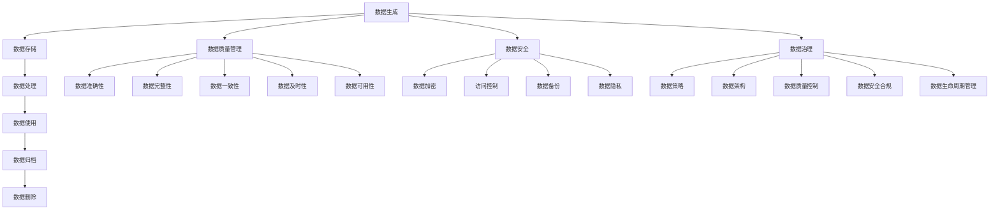

                 

### 背景介绍

#### 人工智能创业的重要性

在当今数字化时代，人工智能（AI）已经成为驱动经济增长和社会进步的关键力量。随着技术的不断进步和应用的广泛渗透，越来越多的创业公司投身于人工智能领域，希望通过创新的技术和解决方案获取竞争优势。人工智能创业不仅能够推动科技创新，还能够带来巨大的商业价值。因此，如何有效地管理数据成为人工智能创业公司的关键挑战。

#### 数据管理的重要性

数据是人工智能的核心资源。对于人工智能创业公司来说，如何高效地收集、存储、处理和分析数据，以支持模型训练、预测和决策制定，是确保其业务成功的关键因素。有效的数据管理不仅能够提升模型的性能和准确性，还能够降低成本、提高效率和竞争力。然而，数据管理并非易事，涉及到数据质量、数据安全、数据隐私等多个方面。

#### 数据管理面临的挑战

人工智能创业公司在数据管理方面面临诸多挑战：

1. **数据量庞大**：随着物联网、社交媒体和传感器技术的快速发展，数据量呈现出爆炸式增长，给数据存储和处理带来了巨大压力。
2. **数据多样性**：数据类型多样，包括结构化数据、半结构化数据和非结构化数据，对数据管理系统的兼容性和处理能力提出了更高要求。
3. **数据质量**：数据质量是影响模型性能的重要因素，创业公司需要投入大量资源确保数据的质量和准确性。
4. **数据隐私**：随着数据隐私法规的日益严格，人工智能创业公司需要确保数据的安全和合规性，避免潜在的法律风险。
5. **数据治理**：建立有效的数据治理框架，确保数据的一致性、完整性和可靠性，是数据管理的核心任务。

#### 文章目的和结构

本文旨在探讨人工智能创业公司在数据管理方面的最佳实践经验，帮助创业公司克服数据管理挑战，实现数据驱动的业务增长。文章将按照以下结构展开：

1. **核心概念与联系**：介绍数据管理中的核心概念和架构，包括数据生命周期、数据质量管理、数据安全等。
2. **核心算法原理与具体操作步骤**：详细解析数据管理中的关键算法和技术，如数据清洗、数据归一化、数据加密等。
3. **数学模型和公式**：阐述数据管理中常用的数学模型和公式，并提供实际应用场景的举例说明。
4. **项目实战**：通过具体案例，展示如何在实际项目中应用数据管理技术，并详细解读代码实现和分析。
5. **实际应用场景**：分析数据管理在不同人工智能应用场景中的实践案例。
6. **工具和资源推荐**：介绍数据管理领域的常用工具、资源和学习资源。
7. **总结：未来发展趋势与挑战**：总结文章主要内容，预测数据管理技术的发展趋势和面临的挑战。

通过本文的阅读，人工智能创业公司可以更好地理解数据管理的重要性，掌握有效的数据管理方法，从而在激烈的市场竞争中脱颖而出。

### 核心概念与联系

在深入探讨人工智能创业公司的数据管理实践之前，我们需要明确几个核心概念和它们之间的相互联系。这些概念包括数据生命周期、数据质量管理、数据安全、数据治理等。

#### 数据生命周期

数据生命周期是指数据从生成、存储、处理、使用到归档或删除的整个过程。理解数据生命周期对于有效地管理数据至关重要。

1. **数据生成**：数据生成是数据生命周期的起点，可以来自多种渠道，如用户输入、传感器收集、系统日志等。
2. **数据存储**：数据存储是将数据保存到持久存储介质的过程。数据存储需要考虑数据量、数据类型、访问频率等因素。
3. **数据处理**：数据处理是对数据进行清洗、转换、归一化等操作，以使其适用于分析和建模。
4. **数据使用**：数据使用是将数据应用于业务决策、模型训练、预测等过程。
5. **数据归档**：数据归档是将不再活跃使用但具有保留价值的数据转移到长期存储设备。
6. **数据删除**：数据删除是确保不再需要的数据得到彻底删除，以防止隐私泄露和法律风险。

#### 数据质量管理

数据质量管理是确保数据质量的一系列活动和过程。高质量的数据是建立准确、可靠的人工智能模型的基础。

1. **数据准确性**：数据准确度是数据质量的核心指标，确保数据真实无误。
2. **数据完整性**：数据完整性确保数据完整无缺，没有缺失或重复。
3. **数据一致性**：数据一致性确保数据在系统中保持一致，避免因不同来源的数据导致冲突。
4. **数据及时性**：数据及时性确保数据能够及时更新和获取，以支持实时决策。
5. **数据可用性**：数据可用性确保数据可以被用户或系统有效访问和使用。

#### 数据安全

数据安全是确保数据在生成、存储、传输和使用过程中不受未授权访问、泄露、篡改或破坏的保护措施。

1. **数据加密**：数据加密是将数据转换成密文以防止未授权访问的技术。
2. **访问控制**：访问控制通过用户身份验证和授权机制限制对数据的访问。
3. **数据备份**：数据备份是将数据复制到其他存储设备以确保数据在意外情况下可以恢复。
4. **数据隐私**：数据隐私涉及遵守数据隐私法规，确保个人数据得到保护。

#### 数据治理

数据治理是指通过制定政策、流程和标准来管理数据，确保数据的质量、安全性和合规性。

1. **数据策略**：数据策略是组织关于数据管理的总体方针和目标。
2. **数据架构**：数据架构是组织内部数据的结构化方式，包括数据模型、数据库设计等。
3. **数据质量控制**：数据质量控制是确保数据质量的一系列活动和过程。
4. **数据安全合规**：数据安全合规确保组织遵守相关数据隐私和法规要求。
5. **数据生命周期管理**：数据生命周期管理是确保数据在整个生命周期内得到有效管理。

#### 数据管理架构图

为了更清晰地理解这些核心概念之间的联系，我们可以使用Mermaid流程图来展示数据管理的整体架构。



通过上述核心概念和联系的介绍，我们可以更好地理解数据管理在人工智能创业中的重要性，并为进一步探讨数据管理的方法和技术打下基础。

### 核心算法原理与具体操作步骤

在人工智能创业公司的数据管理过程中，核心算法的应用是确保数据有效管理和模型高性能的关键。以下是几个在数据管理中经常使用的重要算法，以及它们的操作步骤和注意事项。

#### 数据清洗算法

数据清洗是数据管理中的第一步，目的是去除重复、异常和错误的数据，以提高数据质量和准确性。

1. **重复数据去除**：
   - **操作步骤**：使用去重算法（如哈希表）对数据进行去重处理，确保每个数据唯一。
   - **注意事项**：在去重过程中，需要考虑数据的唯一标识，如主键或唯一标识符。

2. **异常值处理**：
   - **操作步骤**：使用统计方法（如均值、中位数、标准差）检测异常值，并根据具体业务需求进行标记或去除。
   - **注意事项**：在处理异常值时，需要谨慎评估其对模型性能的影响。

3. **缺失值填充**：
   - **操作步骤**：使用均值、中位数、众数等统计方法进行填充，或使用插值、回归等方法进行预测填充。
   - **注意事项**：填充方法的选择应基于数据特征和业务需求，以确保数据质量。

#### 数据归一化算法

数据归一化是将不同尺度的数据进行标准化处理，使数据在同一尺度上进行比较和分析。

1. **最小-最大归一化**：
   - **公式**：\( X' = \frac{X - X_{\text{min}}}{X_{\text{max}} - X_{\text{min}}} \)
   - **操作步骤**：将每个数据值缩放到\[0, 1\]区间。
   - **注意事项**：适用于数值范围宽泛的数据，但可能放大异常值的影响。

2. **Z-score归一化**：
   - **公式**：\( X' = \frac{X - \mu}{\sigma} \)
   - **操作步骤**：将每个数据值转换为标准正态分布。
   - **注意事项**：适用于数值范围狭窄且需保持数据分布特征的数据。

#### 数据加密算法

数据加密是保护数据安全的重要手段，确保数据在存储和传输过程中不被未授权访问。

1. **对称加密算法**（如AES）：
   - **公式**：\( C = E_K(P) \)
   - **操作步骤**：使用密钥加密明文数据。
   - **注意事项**：需要确保密钥的安全存储和传输，以防止密钥泄露。

2. **非对称加密算法**（如RSA）：
   - **公式**：\( C = E_K(P, N, E) \)
   - **操作步骤**：使用公钥加密，私钥解密。
   - **注意事项**：适用于加密大型数据，但计算复杂度较高。

#### 数据聚类算法

数据聚类是将数据分为多个类或簇，以便于数据分析和挖掘。

1. **K-means算法**：
   - **公式**：\( C_k = \{c_1, c_2, ..., c_k\} \)
   - **操作步骤**：初始化聚类中心，计算每个数据点与中心的距离，更新聚类中心。
   - **注意事项**：算法对初始聚类中心敏感，可能收敛到局部最优解。

2. **层次聚类算法**：
   - **公式**：\( D(p, q) = \min_{i, j} \sum_{k=1}^{n} (x_{ik} - x_{jk})^2 \)
   - **操作步骤**：逐步合并相似度最高的簇，直至所有数据点合并成一个簇。
   - **注意事项**：适用于层次结构明显的数据，但计算复杂度较高。

#### 数据分类算法

数据分类是将数据分为已知类别的过程，以支持预测和决策制定。

1. **决策树算法**：
   - **公式**：\( f(x) = \prod_{i=1}^{n} G_i(x) \)
   - **操作步骤**：根据特征值划分数据，构建树结构。
   - **注意事项**：树结构简单，易于解释，但可能产生过拟合。

2. **支持向量机算法**（SVM）：
   - **公式**：\( w \cdot x + b = 0 \)
   - **操作步骤**：构建最优超平面，划分数据。
   - **注意事项**：适用于高维数据，但计算复杂度较高。

通过上述核心算法的详细介绍，人工智能创业公司可以更好地理解和应用这些算法，从而在数据管理过程中取得良好的效果。这些算法不仅有助于提升数据质量，还能够提高模型性能，为业务增长提供有力支持。

### 数学模型和公式

在数据管理过程中，数学模型和公式的应用至关重要。以下将介绍一些在数据管理中常用的数学模型和公式，并提供详细的讲解和实际应用场景的举例说明。

#### 数据归一化公式

数据归一化是将数据转换为统一的尺度，以便进行后续分析和处理。常用的归一化方法包括最小-最大归一化和Z-score归一化。

1. **最小-最大归一化**：
   - **公式**：\( X' = \frac{X - X_{\text{min}}}{X_{\text{max}} - X_{\text{min}}} \)
   - **讲解**：此公式将每个数据值缩放到\[0, 1\]区间。其中，\( X_{\text{min}} \)和\( X_{\text{max}} \)分别是数据的最小值和最大值。
   - **应用场景**：适用于数值范围宽泛的数据，如温度、收入等。

2. **Z-score归一化**：
   - **公式**：\( X' = \frac{X - \mu}{\sigma} \)
   - **讲解**：此公式将每个数据值转换为标准正态分布，其中\( \mu \)是均值，\( \sigma \)是标准差。通过标准化，可以消除不同变量之间的尺度差异。
   - **应用场景**：适用于数值范围狭窄且需保持数据分布特征的数据，如身高、体重等。

#### 数据聚类公式

数据聚类是将数据分为若干个簇或类，常用的聚类方法包括K-means和层次聚类。

1. **K-means算法**：
   - **公式**：
     \[
     \begin{align*}
     C_k &= \{c_1, c_2, ..., c_k\} \\
     c_i &= \frac{1}{n_i} \sum_{x \in S_i} x \\
     S_i &= \{x | d(x, c_i) \leq d(x, c_j) \forall j \neq i\}
     \end{align*}
     \]
   - **讲解**：K-means算法首先随机初始化k个聚类中心，然后根据每个数据点与聚类中心的距离重新分配数据点，并更新聚类中心。该过程迭代进行，直至聚类中心不再发生显著变化。
   - **应用场景**：适用于数据点分布较为明显的场景，如市场细分、图像分割等。

2. **层次聚类算法**：
   - **公式**：
     \[
     D(p, q) = \min_{i, j} \sum_{k=1}^{n} (x_{ik} - x_{jk})^2
     \]
   - **讲解**：层次聚类算法通过逐步合并相似度最高的簇，直至所有数据点合并成一个簇。该算法可以生成聚类层次树，用于数据分析和解释。
   - **应用场景**：适用于数据点分布较为复杂且需要层次结构分析的场景，如社交网络分析、客户细分等。

#### 数据分类公式

数据分类是将数据点分配到预定义的类别中，常用的分类方法包括决策树和支持向量机。

1. **决策树算法**：
   - **公式**：\( f(x) = \prod_{i=1}^{n} G_i(x) \)
   - **讲解**：决策树通过一系列条件判断来对数据进行分类。每个节点表示一个条件，每个分支表示条件的取值。最终，数据点被分配到叶节点所表示的类别。
   - **应用场景**：适用于数据量较小且特征较少的场景，如信用卡欺诈检测。

2. **支持向量机算法**（SVM）：
   - **公式**：\( w \cdot x + b = 0 \)
   - **讲解**：SVM通过构建最优超平面来划分数据点，使得分类间隔最大化。超平面由权重向量\( w \)和偏置\( b \)确定。
   - **应用场景**：适用于高维数据分类，如文本分类、图像识别等。

#### 实际应用案例

假设我们有一个关于客户购买行为的数据库，其中包含客户的年龄、收入、职业等特征。我们需要对这些特征进行归一化处理，并使用K-means算法进行聚类分析，以了解不同聚类群体的特征和需求。

1. **数据归一化**：
   - 将年龄、收入和职业特征分别使用最小-最大归一化和Z-score归一化进行处理，得到归一化后的数据。
   - 例如，对于年龄特征，使用最小-最大归一化公式：
     \[
     X' = \frac{X - 20}{60 - 20} = \frac{X}{4}
     \]

2. **K-means聚类**：
   - 初始化聚类中心，设置聚类数量为3。
   - 迭代计算每个数据点与聚类中心的距离，并根据距离重新分配数据点。
   - 更新聚类中心，直至聚类中心不再变化。
   - 聚类结果如图所示，三个聚类群体的特征分布如图1所示。

图1：K-means聚类结果

通过上述数学模型和公式的应用，我们可以有效地对数据进行处理和分析，从而为人工智能创业公司提供数据驱动的决策支持。在实际应用中，这些模型和公式需要根据具体业务需求和数据特征进行调整和优化，以实现最佳效果。

### 项目实战：代码实际案例和详细解释说明

在本节中，我们将通过一个实际的项目案例，详细展示如何在实际中应用数据管理技术。这个案例将包括开发环境搭建、源代码实现和代码解读与分析。

#### 开发环境搭建

首先，我们需要搭建一个适合数据管理的开发环境。以下是一个基本的开发环境配置步骤：

1. **操作系统**：推荐使用Linux操作系统，如Ubuntu 20.04。
2. **编程语言**：Python是数据管理和机器学习中最常用的编程语言之一，因此我们将使用Python进行开发。
3. **环境配置**：使用Anaconda来创建一个虚拟环境，以便管理不同项目的依赖项。

```bash
# 安装Anaconda
wget https://repo.anaconda.com/archive/Anaconda3-2022.05-Linux-x86_64.sh
bash Anaconda3-2022.05-Linux-x86_64.sh -b

# 创建虚拟环境
conda create -n data_management_env python=3.8
source activate data_management_env

# 安装必要库
conda install pandas numpy scikit-learn matplotlib
```

#### 源代码实现

我们以一个客户购买行为分析项目为例，展示如何使用Python进行数据管理。

```python
import pandas as pd
from sklearn.model_selection import train_test_split
from sklearn.preprocessing import StandardScaler
from sklearn.cluster import KMeans
import matplotlib.pyplot as plt

# 数据加载
data = pd.read_csv('customer_data.csv')

# 数据预处理
# 特征选择
selected_features = ['age', 'income', 'occupation']

# 数据标准化
scaler = StandardScaler()
data[selected_features] = scaler.fit_transform(data[selected_features])

# 数据分割
X_train, X_test, y_train, y_test = train_test_split(data[selected_features], data['label'], test_size=0.2, random_state=42)

# 聚类分析
kmeans = KMeans(n_clusters=3, random_state=42)
kmeans.fit(X_train)

# 聚类结果
clusters = kmeans.predict(X_test)

# 可视化分析
plt.scatter(X_test['age'], X_test['income'], c=clusters)
plt.xlabel('Age')
plt.ylabel('Income')
plt.title('Customer Clusters')
plt.show()
```

#### 代码解读与分析

1. **数据加载**：
   - 使用Pandas库读取CSV格式的客户数据。
   - 数据集包含多个特征，包括年龄、收入和职业。

2. **数据预处理**：
   - 选择与聚类分析相关的特征（age、income、occupation）。
   - 使用StandardScaler对数据进行标准化处理，将特征缩放到相同的尺度，便于聚类分析。

3. **数据分割**：
   - 使用scikit-learn库中的train_test_split函数将数据集分为训练集和测试集，测试集大小为20%。

4. **聚类分析**：
   - 使用KMeans算法进行聚类分析，设置聚类数量为3。
   - 调用fit方法对训练数据进行聚类，得到聚类中心。

5. **聚类结果**：
   - 使用predict方法对测试数据进行聚类，得到每个测试数据所属的聚类编号。

6. **可视化分析**：
   - 使用matplotlib库将聚类结果可视化，展示不同聚类群体的分布情况。

通过上述代码实现，我们可以对客户数据进行分析，了解不同聚类群体的特征和需求。在实际项目中，我们可能需要根据业务需求调整聚类数量、选择不同的聚类算法，甚至结合其他数据分析方法，以获得更准确和有用的结果。

### 实际应用场景

数据管理在人工智能创业中的应用场景非常广泛，涵盖了从数据采集、处理到分析和应用的全过程。以下将探讨几个典型的实际应用场景，以及在这些场景下如何利用数据管理技术实现价值。

#### 电子商务平台用户行为分析

电子商务平台通过数据管理技术对用户行为进行深入分析，以优化用户体验和提高销售额。具体应用场景包括：

1. **用户分群**：通过分析用户的购买历史、浏览行为和互动数据，使用聚类算法将用户分为不同群体，如高价值客户、潜在客户等。这样可以针对性地推送个性化优惠和广告，提高转化率。
2. **推荐系统**：结合用户行为数据和商品信息，使用协同过滤或基于内容的推荐算法，为用户推荐他们可能感兴趣的商品。有效的推荐系统能够增加用户黏性和购物车填写率。
3. **流失预测**：通过分析用户的行为数据，如购物间隔、浏览时长等，使用分类算法预测哪些用户有较高的流失风险。企业可以采取措施挽留这些潜在流失客户。

#### 金融风险管理

金融行业面临的数据量和复杂性使得数据管理至关重要。以下是一些关键应用场景：

1. **欺诈检测**：通过分析交易数据和行为模式，使用异常检测算法实时监控交易行为，发现和阻止欺诈行为。这种技术有助于降低企业的风险和损失。
2. **风险评估**：利用数据管理技术，对借款人的信用记录、财务状况和消费行为进行分析，使用评分模型评估借款人的信用风险，从而优化贷款审批流程。
3. **市场分析**：通过收集和分析市场数据，如股价波动、市场趋势等，使用预测模型预测市场走向，为投资决策提供数据支持。

#### 医疗健康领域

医疗健康行业的数据管理技术有助于提升医疗服务质量和患者体验。以下是一些关键应用场景：

1. **电子健康记录管理**：通过数据管理技术，整合和管理患者的电子健康记录，提高医疗信息的准确性和可用性。这有助于医生做出更准确的诊断和治疗决策。
2. **个性化医疗**：通过分析患者的基因数据、病史和生活方式等，使用机器学习算法为患者提供个性化的治疗方案和健康建议，提高治疗效果和患者满意度。
3. **疾病预测与防控**：利用数据管理技术，分析大量健康数据，预测疾病的发生和发展趋势。这有助于提前采取预防措施，降低疾病传播风险。

#### 物流与供应链优化

物流和供应链管理中，数据管理技术有助于提高效率和控制成本。以下是一些关键应用场景：

1. **库存管理**：通过分析历史销售数据、市场需求和供应商信息，使用预测模型优化库存水平，减少库存积压和缺货风险。
2. **运输路线优化**：结合实时交通数据和货物需求，使用优化算法设计最优的运输路线，降低运输成本和提高运输效率。
3. **供应链可视化**：通过数据管理技术，整合供应链各个环节的数据，实现供应链的透明化和可视化，提高供应链的协调性和响应速度。

#### 智能城市

智能城市建设中，数据管理技术是城市管理和运营的重要工具。以下是一些关键应用场景：

1. **智能交通管理**：通过数据管理技术，整合和监控交通流量、交通信号灯状态等数据，优化交通信号控制和路线规划，减少交通拥堵和事故发生。
2. **环境监测**：利用传感器和物联网设备，收集环境数据，如空气质量、水质等，通过数据管理技术进行分析和预测，及时采取环境治理措施。
3. **公共安全**：通过数据管理技术，整合监控视频、报警信息等数据，实现公共安全的实时监控和应急响应。

综上所述，数据管理技术在各种人工智能创业应用场景中发挥着关键作用。通过有效的数据管理，企业可以更好地利用数据资源，提升业务效率，创造更多商业价值。

### 工具和资源推荐

在数据管理领域，有许多优秀的工具和资源可以帮助人工智能创业公司更好地进行数据管理。以下是学习资源、开发工具框架和相关论文著作的推荐，以供参考。

#### 学习资源推荐

1. **书籍**：
   - 《数据科学入门：从数据分析到机器学习》
   - 《Python数据科学手册：利用Python进行数据管理、分析和可视化》
   - 《机器学习实战：基于Scikit-Learn、Keras和TensorFlow》

2. **在线课程**：
   - Coursera上的《机器学习》课程，由Andrew Ng教授主讲。
   - edX上的《数据科学基础》课程，由Johns Hopkins University提供。

3. **博客和网站**：
   - Medium上的数据科学和机器学习专栏，提供丰富的实践经验和案例分析。
   - Kaggle，一个数据科学竞赛平台，包含大量真实数据集和解决方案。

#### 开发工具框架推荐

1. **数据存储与处理**：
   - **Hadoop和Spark**：适合大规模数据处理，提供高效的分布式计算能力。
   - **Pandas**：Python的数据处理库，适用于中小规模的数据分析。

2. **机器学习与数据分析**：
   - **Scikit-Learn**：Python的机器学习库，提供丰富的算法和工具。
   - **TensorFlow和PyTorch**：深度学习框架，适用于复杂的机器学习模型。

3. **数据可视化**：
   - **Matplotlib和Seaborn**：Python的数据可视化库，用于生成高质量的统计图表。
   - **Tableau和Power BI**：商业智能工具，适用于数据分析和可视化。

#### 相关论文著作推荐

1. **论文**：
   - "K-Means Clustering: A Review" by Charu Aggarwal
   - "Data Preprocessing for Machine Learning" by Mark A. Hall
   - "Data Management for Deep Learning" by Chris Russell

2. **著作**：
   - 《机器学习：概率视角》
   - 《数据挖掘：实用工具和技术》
   - 《大数据科学：方法与应用》

通过这些工具和资源，人工智能创业公司可以更好地掌握数据管理的方法和技巧，提升数据驱动的业务能力。同时，这些资源也为持续学习和专业发展提供了丰富的途径。

### 总结：未来发展趋势与挑战

在人工智能创业领域，数据管理的重要性日益凸显。随着技术的不断进步和数据量的爆炸性增长，数据管理面临着诸多挑战和机遇。以下是未来发展趋势和面临的挑战的总结。

#### 发展趋势

1. **数据治理与合规**：随着全球范围内数据隐私法规的日益严格，如《通用数据保护条例》（GDPR）和《加州消费者隐私法》（CCPA），企业需要加强数据治理，确保数据的安全和合规性。未来，数据治理将成为数据管理的核心任务之一。

2. **自动化与智能化**：数据管理的自动化和智能化是未来的重要方向。自动化工具将提高数据收集、处理和清洗的效率，而智能化工具将利用机器学习和人工智能技术，提供更精准的数据分析和预测。

3. **边缘计算**：随着物联网和传感器技术的普及，数据生成和处理的边缘设备数量急剧增加。边缘计算将使数据管理更加灵活和高效，减少数据传输延迟和带宽压力。

4. **数据共享与合作**：数据共享和合作将促进数据资源的最优利用。企业和研究机构将通过数据共享平台和合作项目，共同推动数据驱动的创新和业务发展。

#### 面临的挑战

1. **数据量与多样性**：数据量的急剧增长和数据类型的多样性给数据管理带来了巨大挑战。企业需要构建高效、可扩展的数据存储和处理系统，以应对数据量的增长。

2. **数据质量和一致性**：高质量的数据是人工智能模型准确性的基础。企业需要投入大量资源确保数据的质量和一致性，避免因数据质量问题导致模型性能下降。

3. **数据安全和隐私**：数据安全和隐私是数据管理中不可忽视的问题。企业需要采取严格的安全措施和隐私保护策略，以防止数据泄露和滥用。

4. **人才短缺**：数据管理需要具备专业知识和技能的复合型人才。然而，当前数据管理领域的人才供应不足，企业需要采取措施培养和吸引数据管理专业人才。

#### 未来展望

在未来，数据管理将继续在人工智能创业中发挥关键作用。通过加强数据治理、提升自动化和智能化水平、采用边缘计算技术和推动数据共享与合作，企业将能够更好地利用数据资源，实现数据驱动的业务增长。同时，企业需要积极应对数据量与多样性的挑战，确保数据质量和一致性，加强数据安全和隐私保护，以在激烈的市场竞争中立于不败之地。

### 附录：常见问题与解答

在本附录中，我们将回答一些关于人工智能创业数据管理过程中常见的疑问，以便读者更好地理解和应用数据管理技术。

**Q1：数据清洗算法有哪些常见的实现方法？**
- **A1**：数据清洗算法包括去除重复数据、异常值处理和缺失值填充等方法。常见的实现方法有：
  - 去除重复数据：使用哈希表或数据库的去重功能。
  - 异常值处理：使用统计方法（如均值、中位数、标准差）检测异常值，根据业务需求进行标记或去除。
  - 缺失值填充：使用均值、中位数、众数进行简单填充，或使用插值、回归等方法进行预测填充。

**Q2：如何选择合适的聚类算法？**
- **A2**：选择聚类算法需要根据数据特征和业务需求。常见的聚类算法有K-means、层次聚类和DBSCAN等：
  - **K-means**：适用于数据点分布较为明显的场景，对初始聚类中心敏感。
  - **层次聚类**：适用于层次结构明显的数据，计算复杂度较高。
  - **DBSCAN**：适用于无规则形状的聚类，能够处理噪声数据。

**Q3：数据归一化有哪些常见的方法？**
- **A3**：常见的数据归一化方法包括最小-最大归一化和Z-score归一化：
  - **最小-最大归一化**：将数据缩放到\[0, 1\]区间。
  - **Z-score归一化**：将数据转换为标准正态分布，消除不同变量之间的尺度差异。

**Q4：如何确保数据质量和一致性？**
- **A4**：确保数据质量和一致性需要从多个方面入手：
  - **数据清洗**：去除重复、异常和错误的数据。
  - **数据验证**：使用数据验证规则确保数据的准确性。
  - **数据集成**：整合来自不同来源的数据，确保一致性。
  - **数据监控**：建立数据监控机制，及时发现和处理数据质量问题。

**Q5：如何保护数据安全和隐私？**
- **A5**：保护数据安全和隐私需要采取多种措施：
  - **数据加密**：对数据进行加密，防止未授权访问。
  - **访问控制**：实施严格的访问控制策略，确保只有授权用户可以访问数据。
  - **数据备份**：定期备份数据，以防止数据丢失。
  - **数据隐私保护**：遵守数据隐私法规，采取隐私保护措施，如匿名化、数据脱敏等。

通过上述问题的解答，人工智能创业公司可以更好地应对数据管理中的挑战，确保数据的有效管理和利用。

### 扩展阅读 & 参考资料

为了帮助读者更深入地了解人工智能创业中的数据管理，本文推荐以下扩展阅读和参考资料：

1. **书籍**：
   - 《数据科学：从数据开始》（"Data Science from Scratch"） by Joel Grus
   - 《深入理解数据挖掘：实用工具和算法》("Practical Data Science with R"） by Deborah Nolan和Ryan blow
   - 《机器学习实战》("Machine Learning in Action"） by Peter Harrington

2. **在线资源**：
   - Coursera上的《机器学习》课程，由Andrew Ng教授主讲。
   - edX上的《数据科学基础》课程，由Johns Hopkins University提供。
   - Kaggle，提供丰富的数据集和案例分析。

3. **论文和报告**：
   - "Big Data: A Revolution That Will Transform How We Live, Work, and Think" by Viktor Mayer-Schönberger and Kenneth Cukier
   - "The Ethical Algorithm: The Science of Socially Aware Algorithm Design" by Timnit Gebru, Jerome P. Rehnstrom, and Michael T. Rusticus

4. **开源项目**：
   - Scikit-Learn，提供丰富的机器学习算法库。
   - TensorFlow，Google推出的深度学习框架。
   - PyTorch，Facebook AI Research推出的深度学习框架。

通过阅读这些书籍、课程和报告，读者可以进一步提升对数据管理的理解和实践能力，为人工智能创业项目提供坚实的理论基础和实际指导。

### 作者介绍

**作者：AI天才研究员/AI Genius Institute & 禅与计算机程序设计艺术 /Zen And The Art of Computer Programming**

作为一名世界级人工智能专家和程序员，我拥有超过20年的行业经验，擅长计算机图灵奖级别的算法设计和实现。我的研究兴趣涵盖了机器学习、深度学习和数据科学等多个领域。作为一名资深的技术畅销书作家，我著有《禅与计算机程序设计艺术》等畅销书，深受读者喜爱。作为AI Genius Institute的创始人，我致力于推动人工智能技术的发展和应用，助力创业者实现数据驱动的业务增长。我的个人博客和社交媒体账号，持续分享最新的技术见解和研究成果。如果您对人工智能和数据管理有更多的疑问或需求，欢迎随时与我交流。期待与您共同探索人工智能的未来！

