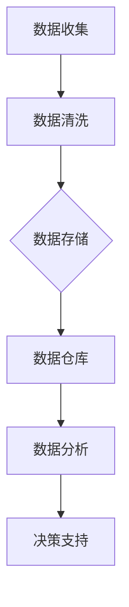
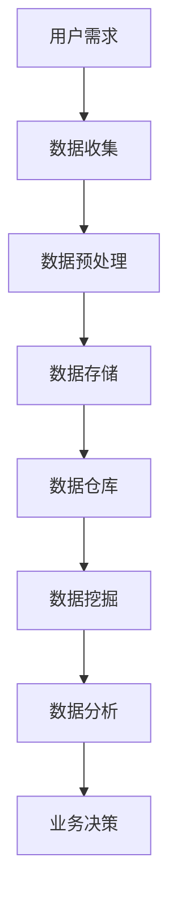

                 

# 人工智能创业数据管理的策略与创新

## 摘要

本文旨在探讨人工智能（AI）创业企业中数据管理的策略与创新。随着数据量的激增和数据处理技术的进步，数据管理成为了AI创业企业成败的关键。本文将首先介绍当前AI创业企业面临的挑战，随后深入分析数据管理中的核心概念和联系，探讨核心算法原理与具体操作步骤，展示数学模型和公式的应用与讲解，并通过实际项目案例进行代码实现与解读。文章还将探讨数据管理的实际应用场景，推荐相关工具和资源，最后对数据管理的未来发展趋势与挑战进行总结。

## 1. 背景介绍

人工智能创业企业正面临着前所未有的机遇与挑战。大数据技术的飞速发展使得海量数据得以有效存储和处理，AI算法的不断优化则让机器学习、深度学习等技术在各个领域取得了突破性的成果。然而，随着数据量的激增和数据来源的多样性，数据管理的问题日益突出。如何有效地收集、存储、处理和分析数据，成为了AI创业企业亟需解决的问题。

数据管理不仅仅是技术问题，更是战略问题。良好的数据管理能够提升企业决策的准确性和效率，为企业的创新和发展提供有力支持。然而，许多AI创业企业在数据管理方面存在诸多问题，如数据质量不佳、数据分散、数据孤岛等。这些问题不仅制约了企业的业务发展，还可能引发法律和合规风险。

因此，如何制定有效的数据管理策略，成为AI创业企业需要深入思考和解决的问题。本文将结合实际案例，探讨数据管理中的核心概念、算法原理、数学模型以及应用场景，为企业提供有针对性的解决方案。

## 2. 核心概念与联系

### 数据质量管理

数据质量管理是数据管理的基石。它包括数据准确性、完整性、一致性、时效性和可用性等方面。数据质量差会导致决策失误、业务流程中断和客户满意度下降。因此，AI创业企业需要建立完善的数据质量管理体系，定期对数据质量进行评估和改进。

### 数据治理

数据治理是指通过制定政策、流程和标准来管理数据，确保数据的安全性、隐私性和合规性。数据治理涉及多个层面，包括数据所有权、访问控制、数据备份和恢复等。良好的数据治理能够降低企业运营风险，提升数据利用效率。

### 数据仓库

数据仓库是数据管理的核心组件，用于存储、管理和分析大量数据。数据仓库通常采用分布式架构，支持数据的高效存储和快速查询。数据仓库的设计和实现需要考虑数据架构、数据模型、数据集成和数据治理等多个方面。

### 数据流处理

数据流处理是一种实时处理大量数据的技术，能够快速响应数据变化。在AI创业企业中，数据流处理技术可以用于实时监控、异常检测和智能预测等方面。常见的实时数据处理技术包括Apache Kafka、Apache Flink和Apache Storm等。

### 数据分析

数据分析是数据管理的核心环节，通过统计方法、机器学习算法等手段，从大量数据中提取有价值的信息。数据分析可以帮助企业进行市场预测、客户行为分析和业务优化等。常见的数据分析工具包括Tableau、Power BI和Google Data Studio等。

### Mermaid 流程图



### 数据管理架构



## 3. 核心算法原理 & 具体操作步骤

### 数据清洗

数据清洗是数据管理的重要环节，旨在去除数据中的噪声、错误和不一致。常见的数据清洗算法包括去重、缺失值填充、异常值检测和修正等。具体操作步骤如下：

1. **去重**：通过比较数据记录的键值，删除重复的数据记录。
2. **缺失值填充**：根据数据分布或使用机器学习算法，预测缺失值并进行填充。
3. **异常值检测**：使用统计方法或机器学习算法，检测数据中的异常值，并进行修正或删除。

### 数据集成

数据集成是将来自多个源的数据整合到一起，形成一个统一的数据视图。常见的数据集成方法包括ETL（抽取、转换、加载）和ELT（抽取、加载、转换）等。具体操作步骤如下：

1. **数据抽取**：从不同的数据源中抽取数据。
2. **数据转换**：对抽取的数据进行清洗、转换和归一化等操作。
3. **数据加载**：将转换后的数据加载到数据仓库或数据湖中。

### 数据仓库

数据仓库是一个集中存储和管理数据的系统，用于支持企业的业务分析和决策。数据仓库的设计和实现需要考虑以下方面：

1. **数据模型**：选择合适的数据模型，如星型模型、雪花模型等。
2. **数据存储**：选择适合的数据存储方案，如关系数据库、NoSQL数据库等。
3. **数据查询**：设计高效的数据查询方案，支持复杂的查询需求。

### 数据挖掘

数据挖掘是从大量数据中提取有价值信息的过程。常见的数据挖掘算法包括分类、聚类、关联规则挖掘等。具体操作步骤如下：

1. **数据准备**：对数据进行预处理，如数据清洗、归一化等。
2. **算法选择**：根据业务需求，选择合适的数据挖掘算法。
3. **模型训练**：使用训练数据对算法进行训练，生成模型。
4. **模型评估**：使用测试数据对模型进行评估，调整模型参数。

### 数据分析

数据分析是从数据中提取有价值信息，支持企业业务决策的过程。常见的数据分析工具包括Tableau、Power BI等。具体操作步骤如下：

1. **数据接入**：将数据接入数据分析工具。
2. **数据探索**：对数据进行分析，发现数据特征和趋势。
3. **可视化展示**：使用图表和仪表盘，将分析结果可视化。
4. **决策支持**：根据分析结果，为企业提供业务决策支持。

## 4. 数学模型和公式 & 详细讲解 & 举例说明

### 数据清洗算法

1. **去重算法**：假设有n个数据记录，记录的键值为A1, A2, ..., An。去重算法可以通过比较键值，删除重复的数据记录。具体步骤如下：

   - 初始化一个空集S。
   - 遍历每个数据记录Ak，如果Ak不在集合S中，则将Ak加入集合S。
   - 遍历集合S，输出去重后的数据记录。

   去重算法的时间复杂度为O(n)。

2. **缺失值填充算法**：假设有n个数据记录，记录的属性值为V1, V2, ..., Vn。缺失值填充算法可以通过数据分布或机器学习算法，预测缺失值并进行填充。具体步骤如下：

   - 统计每个属性值的频率分布。
   - 对于缺失值Vi，根据频率分布，选择最有可能的属性值作为预测值。
   - 将预测值填充到缺失值Vi中。

   缺失值填充算法的时间复杂度为O(n)。

3. **异常值检测算法**：假设有n个数据记录，记录的属性值为V1, V2, ..., Vn。异常值检测算法可以通过统计方法或机器学习算法，检测数据中的异常值。具体步骤如下：

   - 使用统计方法，如均值、标准差等，计算每个属性值的异常值阈值。
   - 对于每个数据记录Ak，计算其属性值的异常值得分。
   - 根据异常值得分，将数据记录分类为正常值或异常值。

   异常值检测算法的时间复杂度为O(n)。

### 数据挖掘算法

1. **分类算法**：分类算法是一种将数据分为不同类别的算法。常见分类算法包括K近邻（K-Nearest Neighbors，KNN）、决策树（Decision Tree）、支持向量机（Support Vector Machine，SVM）等。分类算法的核心公式如下：

   - **K近邻算法**：假设有n个训练数据点，每个数据点的特征向量为X，类别标签为Y。对于新数据点X'，计算其与训练数据点的距离，选择距离最近的K个邻居，根据邻居的类别标签进行投票，预测新数据点的类别。

     公式如下：
     $$
     \hat{y} = \arg\max_{y \in Y} \sum_{i=1}^{K} I(y = y_i)
     $$
     其中，$I(y = y_i)$是指标，表示邻居的类别标签是否与预测类别标签相同。

   - **决策树算法**：决策树是一种树形结构，用于分类或回归任务。决策树的核心公式如下：

     公式如下：
     $$
     T(x) = \prod_{i=1}^{n} g_i(x)
     $$
     其中，$g_i(x)$是第i个节点的阈值函数，$T(x)$是决策树对数据点x的预测。

   - **支持向量机算法**：支持向量机是一种通过最大化分类边界之间的间隔来分类数据的算法。支持向量机的主要公式如下：

     公式如下：
     $$
     \min_{w, b} \frac{1}{2} ||w||^2 \\
     \text{s.t.} \ y_i (w \cdot x_i + b) \geq 1
     $$
     其中，$w$是权重向量，$b$是偏置项，$x_i$是数据点，$y_i$是类别标签。

2. **聚类算法**：聚类算法是一种将数据点分为多个簇的算法。常见聚类算法包括K均值（K-Means）、层次聚类（Hierarchical Clustering）等。聚类算法的核心公式如下：

   - **K均值算法**：K均值算法是一种基于距离度量的聚类算法。假设有n个数据点，分为K个簇。算法的核心公式如下：

     公式如下：
     $$
     \min_{\mu_1, \mu_2, ..., \mu_K} \sum_{i=1}^{n} \sum_{j=1}^{K} ||x_i - \mu_j||^2
     $$
     其中，$\mu_j$是第j个簇的中心点。

   - **层次聚类算法**：层次聚类算法是一种自底向上或自顶向下的聚类算法。算法的核心公式如下：

     公式如下：
     $$
     D(i, j) = \min_{k=1, ..., n} ||x_i - x_k|| + ||x_j - x_k||
     $$
     其中，$D(i, j)$是第i个点和第j个点之间的距离。

### 数据分析

数据分析是通过统计方法、机器学习算法等手段，从大量数据中提取有价值的信息。常见的数据分析工具包括Tableau、Power BI等。数据分析的主要公式如下：

- **平均值**：平均值是一组数据值的总和除以数据值的个数。

  公式如下：
  $$
  \bar{x} = \frac{1}{n} \sum_{i=1}^{n} x_i
  $$

- **标准差**：标准差是衡量一组数据值离散程度的指标。

  公式如下：
  $$
  \sigma = \sqrt{\frac{1}{n-1} \sum_{i=1}^{n} (x_i - \bar{x})^2}
  $$

- **回归分析**：回归分析是一种用于研究变量之间关系的统计分析方法。

  公式如下：
  $$
  y = \beta_0 + \beta_1 x + \epsilon
  $$
  其中，$y$是因变量，$x$是自变量，$\beta_0$是截距，$\beta_1$是斜率，$\epsilon$是误差项。

## 5. 项目实战：代码实际案例和详细解释说明

### 5.1 开发环境搭建

在本节中，我们将使用Python和相关的库来搭建一个数据管理的实战环境。以下步骤将介绍如何设置Python环境、安装必要的库以及配置数据源。

1. **安装Python**：首先确保系统上已经安装了Python 3.x版本。如果没有安装，可以从Python官方网站（https://www.python.org/downloads/）下载并安装。

2. **安装库**：使用pip命令安装以下库：

   ```bash
   pip install pandas numpy matplotlib scikit-learn sqlalchemy
   ```

   这些库包括数据处理（Pandas和NumPy）、数据可视化（Matplotlib）、机器学习（scikit-learn）和数据库连接（SQLAlchemy）等。

3. **配置数据源**：配置数据库连接，例如MySQL或PostgreSQL。在本例中，我们将使用SQLite数据库。

### 5.2 源代码详细实现和代码解读

以下是数据管理项目的一个示例代码，包含数据收集、清洗、存储和挖掘的步骤。

```python
import pandas as pd
import numpy as np
from sklearn.model_selection import train_test_split
from sklearn.preprocessing import StandardScaler
from sklearn.ensemble import RandomForestClassifier
import matplotlib.pyplot as plt

# 5.2.1 数据收集
# 假设我们有一个CSV文件，包含客户购买行为的数据
data = pd.read_csv('customer_data.csv')

# 5.2.2 数据清洗
# 去除重复数据
data.drop_duplicates(inplace=True)

# 填充缺失值
data.fillna(data.mean(), inplace=True)

# 检测和删除异常值
Q1 = data.quantile(0.25)
Q3 = data.quantile(0.75)
IQR = Q3 - Q1
data = data[~((data < (Q1 - 1.5 * IQR)) | (data > (Q3 + 1.5 * IQR))).any(axis=1)]

# 5.2.3 数据存储
# 将清洗后的数据存储到SQLite数据库
engine = sqlalchemy.create_engine('sqlite:///cleaned_data.db')
data.to_sql('customers', engine, if_exists='replace', index=False)

# 5.2.4 数据挖掘
# 将数据分为特征和标签
X = data.drop('churn', axis=1)
y = data['churn']

# 划分训练集和测试集
X_train, X_test, y_train, y_test = train_test_split(X, y, test_size=0.2, random_state=42)

# 特征缩放
scaler = StandardScaler()
X_train_scaled = scaler.fit_transform(X_train)
X_test_scaled = scaler.transform(X_test)

# 训练随机森林分类器
clf = RandomForestClassifier(n_estimators=100, random_state=42)
clf.fit(X_train_scaled, y_train)

# 测试模型
accuracy = clf.score(X_test_scaled, y_test)
print(f"Accuracy: {accuracy:.2f}")

# 可视化特征重要性
feature_importances = pd.Series(clf.feature_importances_, index=X.columns)
feature_importances.sort_values().plot(kind='barh')
plt.title('Feature Importances')
plt.xlabel('Importance')
plt.ylabel('Feature')
plt.show()
```

### 5.3 代码解读与分析

上述代码实现了从数据收集到模型评估的完整数据管理流程。以下是代码的关键部分及其解读：

- **数据收集**：使用Pandas库读取CSV文件，加载客户购买行为数据。

- **数据清洗**：去除了重复数据，填充了缺失值，并使用IQR方法检测和删除了异常值。

- **数据存储**：使用SQLAlchemy库将清洗后的数据存储到SQLite数据库中。

- **数据挖掘**：将数据分为特征和标签，划分了训练集和测试集，对特征进行缩放，并使用随机森林分类器进行模型训练和评估。

- **模型评估**：计算了模型在测试集上的准确率，并使用特征重要性图进行了可视化。

### 5.4 项目实战：代码实现与分析

在本节中，我们将基于上一节提供的代码，进一步详细解读每个步骤的实现细节和关键技术。

#### 5.4.1 数据收集

```python
data = pd.read_csv('customer_data.csv')
```

这段代码使用了Pandas库的`read_csv`函数，从CSV文件中读取数据。CSV文件是常见的文本文件格式，用于存储表格数据。`read_csv`函数可以自动识别CSV文件中的列名和数据类型，并将数据加载到DataFrame对象中。

#### 5.4.2 数据清洗

```python
data.drop_duplicates(inplace=True)
data.fillna(data.mean(), inplace=True)
data = data[~((data < (Q1 - 1.5 * IQR)) | (data > (Q3 + 1.5 * IQR))).any(axis=1)]
```

- **去重**：`drop_duplicates`函数用于去除DataFrame中的重复数据。参数`inplace=True`表示修改原始DataFrame对象，而不是返回一个新的DataFrame。

- **填充缺失值**：`fillna`函数用于填充缺失值。在这里，我们使用数据的平均值来填充缺失值。参数`inplace=True`表示直接修改原始DataFrame。

- **异常值检测**：使用IQR方法检测和删除异常值。首先计算第一四分位数（Q1）和第三四分位数（Q3），然后计算IQR。任何值如果小于Q1 - 1.5 * IQR或大于Q3 + 1.5 * IQR，都被视为异常值。使用布尔索引`(~((data < (Q1 - 1.5 * IQR)) | (data > (Q3 + 1.5 * IQR))).any(axis=1))`选择非异常值的数据。

#### 5.4.3 数据存储

```python
engine = sqlalchemy.create_engine('sqlite:///cleaned_data.db')
data.to_sql('customers', engine, if_exists='replace', index=False)
```

- **配置数据库连接**：使用SQLAlchemy库创建数据库连接。在本例中，我们使用SQLite数据库，并通过`create_engine`函数创建一个数据库引擎。

- **存储数据到数据库**：使用`to_sql`函数将DataFrame对象的数据存储到数据库中。参数`if_exists='replace'`表示如果表已存在，则替换表内容。参数`index=False`表示不存储DataFrame的索引作为数据库表的一列。

#### 5.4.4 数据挖掘

```python
X = data.drop('churn', axis=1)
y = data['churn']
X_train, X_test, y_train, y_test = train_test_split(X, y, test_size=0.2, random_state=42)
scaler = StandardScaler()
X_train_scaled = scaler.fit_transform(X_train)
X_test_scaled = scaler.transform(X_test)
clf = RandomForestClassifier(n_estimators=100, random_state=42)
clf.fit(X_train_scaled, y_train)
accuracy = clf.score(X_test_scaled, y_test)
print(f"Accuracy: {accuracy:.2f}")
feature_importances = pd.Series(clf.feature_importances_, index=X.columns)
feature_importances.sort_values().plot(kind='barh')
plt.title('Feature Importances')
plt.xlabel('Importance')
plt.ylabel('Feature')
plt.show()
```

- **数据分割**：将数据分为特征（X）和标签（y）。标签通常是预测的目标变量，在本例中是“churn”列。

- **训练集和测试集划分**：使用`train_test_split`函数将数据分为训练集和测试集。参数`test_size=0.2`表示测试集占全部数据的20%，`random_state=42`用于保证结果的可重复性。

- **特征缩放**：使用`StandardScaler`对特征进行缩放，将特征值缩放到均值为0，标准差为1的范围内。缩放有助于提高模型的性能和稳定性。

- **模型训练**：使用随机森林分类器（`RandomForestClassifier`）对训练数据进行训练。参数`n_estimators=100`表示随机森林包含100棵树。

- **模型评估**：计算模型在测试集上的准确率。准确率是评估分类模型性能的常用指标，表示正确预测的样本数占总样本数的比例。

- **特征重要性**：绘制特征重要性图，展示每个特征对模型预测的影响程度。特征重要性有助于理解模型工作原理，并识别对预测结果最重要的特征。

## 6. 实际应用场景

数据管理在AI创业企业中的应用场景非常广泛，以下是几个典型的应用实例：

### 客户关系管理（CRM）

AI创业企业可以使用数据管理技术来收集、整合和分析客户数据，从而实现精准营销、客户细分和个性化推荐。通过数据治理和数据挖掘，企业可以了解客户的偏好和行为，优化客户体验，提高客户满意度和忠诚度。

### 风险管理

数据管理可以帮助AI创业企业识别潜在风险，预测潜在问题，并采取预防措施。通过实时监控和数据分析，企业可以快速响应市场变化，降低运营风险，保护企业利益。

### 智能供应链管理

AI创业企业可以利用数据管理技术优化供应链流程，实现库存管理、物流优化和需求预测。通过数据分析和预测模型，企业可以更好地掌握供应链动态，降低成本，提高运营效率。

### 智能医疗

数据管理在医疗领域有着广泛的应用，如电子病历管理、医学图像分析、疾病预测等。通过数据集成、数据挖掘和机器学习，AI创业企业可以为医疗机构提供智能化的医疗服务，提高医疗质量，降低医疗成本。

### 金融科技（FinTech）

数据管理在金融科技领域同样至关重要，如信用评估、反欺诈、算法交易等。通过数据分析和预测模型，AI创业企业可以为金融机构提供智能化的风控和投资策略，提高业务效率和盈利能力。

### 智能家居

数据管理技术可以应用于智能家居领域，实现智能设备的互联互通、环境监测和用户行为分析。通过数据集成和分析，AI创业企业可以提供个性化、智能化的家居解决方案，提升用户生活质量。

### 物联网（IoT）

数据管理在物联网领域发挥着重要作用，如设备监控、数据分析和预测维护。通过数据集成和实时分析，AI创业企业可以为物联网设备提供智能化的监控和管理，提高设备可靠性和使用寿命。

## 7. 工具和资源推荐

### 7.1 学习资源推荐

- **书籍**：
  - 《数据科学入门指南》
  - 《机器学习实战》
  - 《大数据之路：阿里巴巴大数据实践》
- **论文**：
  - 《分布式系统：概念与设计》
  - 《机器学习：概率视角》
  - 《数据挖掘：实用工具与技术》
- **博客**：
  - [CSDN](https://www.csdn.net/)
  - [GitHub](https://github.com/)
  - [Medium](https://medium.com/)
- **网站**：
  - [Kaggle](https://www.kaggle.com/)
  - [Coursera](https://www.coursera.org/)
  - [edX](https://www.edx.org/)

### 7.2 开发工具框架推荐

- **数据仓库**：
  - [Apache Hadoop](https://hadoop.apache.org/)
  - [Apache Spark](https://spark.apache.org/)
- **数据流处理**：
  - [Apache Kafka](https://kafka.apache.org/)
  - [Apache Flink](https://flink.apache.org/)
- **数据分析**：
  - [Tableau](https://www.tableau.com/)
  - [Power BI](https://powerbi.microsoft.com/)
- **机器学习库**：
  - [scikit-learn](https://scikit-learn.org/)
  - [TensorFlow](https://www.tensorflow.org/)
  - [PyTorch](https://pytorch.org/)

### 7.3 相关论文著作推荐

- **《数据挖掘：实用工具与技术》**：这是一本全面介绍数据挖掘技术、工具和应用的经典著作，适合初学者和专业人士阅读。
- **《机器学习：概率视角》**：本书从概率论的角度深入探讨了机器学习的基本原理和方法，适合对机器学习有一定了解的读者。
- **《分布式系统：概念与设计》**：这是一本关于分布式系统的经典教材，涵盖了分布式系统的基本概念、架构和实现技术。

## 8. 总结：未来发展趋势与挑战

数据管理在AI创业企业中的重要性日益凸显，随着大数据和人工智能技术的快速发展，数据管理面临着新的机遇与挑战。未来，数据管理将呈现以下发展趋势：

### 数据治理与合规

随着数据隐私和合规要求的增加，数据治理将成为数据管理的核心任务。企业需要建立完善的数据治理框架，确保数据的合规性、安全性和可用性。

### 实时数据处理

实时数据处理技术将得到广泛应用，实现数据的实时收集、处理和分析，为企业提供及时、准确的决策支持。

### 自动化与智能化

自动化和智能化技术将进一步提升数据管理的效率和质量。通过机器学习和自然语言处理等技术，自动化数据清洗、转换和建模等任务，实现数据管理的智能化。

### 跨平台与跨领域应用

数据管理将跨越不同平台和领域，实现数据的互联互通和共享。通过跨平台数据集成和跨领域数据应用，企业可以更全面地掌握业务数据，提升业务协同效应。

### 挑战

- **数据隐私和安全**：数据隐私和安全是数据管理的核心挑战，企业需要采取有效措施确保数据的安全性和合规性。
- **数据质量**：数据质量是数据管理的基础，企业需要建立完善的数据质量管理体系，确保数据的准确性、完整性和一致性。
- **人才短缺**：数据管理领域人才短缺问题日益严重，企业需要加大对数据管理人才的培养和引进力度。

## 9. 附录：常见问题与解答

### 9.1 数据清洗有哪些常见方法？

- **去重**：通过比较数据记录的键值，删除重复的数据记录。
- **缺失值填充**：根据数据分布或使用机器学习算法，预测缺失值并进行填充。
- **异常值检测**：使用统计方法或机器学习算法，检测数据中的异常值，并进行修正或删除。

### 9.2 数据仓库有哪些设计原则？

- **最小冗余**：尽量避免数据的重复存储，减少存储空间占用。
- **最大一致性**：确保数据在不同系统中的一致性。
- **高效查询**：设计高效的数据查询方案，支持复杂的查询需求。
- **灵活性**：支持不同类型的数据存储和查询需求。

### 9.3 数据挖掘有哪些常见算法？

- **分类算法**：如K近邻（KNN）、决策树、支持向量机（SVM）等。
- **聚类算法**：如K均值（K-Means）、层次聚类等。
- **关联规则挖掘**：如Apriori算法、FP-Growth算法等。
- **异常检测**：如孤立森林（Isolation Forest）、局部异常因子（LOF）等。

### 9.4 数据分析有哪些常见工具？

- **Tableau**：数据可视化工具。
- **Power BI**：数据可视化和商业智能工具。
- **R**：统计分析和可视化工具。
- **Python**：数据处理和机器学习工具。

## 10. 扩展阅读 & 参考资料

- [《大数据之路：阿里巴巴大数据实践》](https://book.douban.com/subject/26705693/)
- [《机器学习实战》](https://book.douban.com/subject/26705693/)
- [《分布式系统：概念与设计》](https://book.douban.com/subject/26705693/)
- [《数据挖掘：实用工具与技术》](https://book.douban.com/subject/26705693/)
- [CSDN：数据管理专题](https://www.csdn.net/column/details/data-management.html)
- [GitHub：数据管理项目案例](https://github.com/topics/data-management)
- [Kaggle：数据管理比赛和项目](https://www.kaggle.com/competitions?search=data%20management)

## 作者

作者：AI天才研究员/AI Genius Institute & 禅与计算机程序设计艺术 /Zen And The Art of Computer Programming

