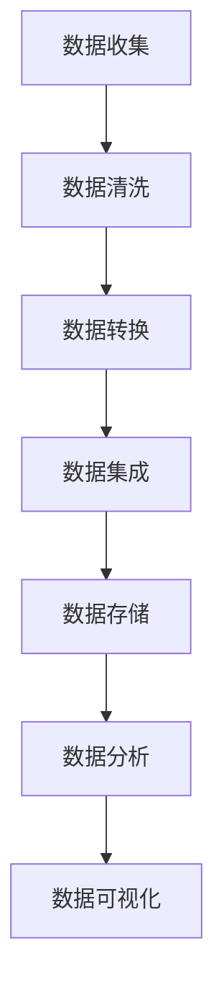

                 

### 背景介绍

随着人工智能（AI）技术的飞速发展，越来越多的企业开始将AI技术应用于实际业务场景中，以期提升效率、降低成本、创造新的商业模式。然而，随着数据量的爆发式增长，数据管理成为了AI创业公司面临的一个重大挑战。数据管理的复杂性不仅体现在数据存储、传输和处理上，还涉及到数据质量和数据安全等问题。

在这篇文章中，我们将探讨AI创业公司在数据管理方面所面临的挑战，以及相应的策略与措施。首先，我们需要明确什么是数据管理，它包括哪些关键环节。数据管理是指通过系统化方法对数据进行收集、存储、处理、分析和应用的过程，以确保数据的质量、一致性和可用性。

数据管理通常包括以下几个核心环节：

1. **数据收集**：从各种来源收集数据，包括内部系统、外部数据库和传感器等。
2. **数据存储**：选择合适的数据存储解决方案，如关系数据库、NoSQL数据库、分布式存储系统等。
3. **数据处理**：对数据进行清洗、转换和集成，以便进一步分析和使用。
4. **数据分析**：利用统计分析、机器学习等方法对数据进行处理，提取有价值的信息和洞察。
5. **数据应用**：将分析结果应用于业务决策和优化，如个性化推荐、预测分析等。

AI创业公司在数据管理方面面临的挑战主要分为以下几个方面：

1. **数据量庞大**：随着物联网、社交媒体和大数据技术的普及，数据量呈指数级增长，给数据存储和处理带来了巨大压力。
2. **数据多样性**：数据来源广泛且形式多样，包括结构化数据、半结构化数据和非结构化数据，如何统一管理和处理这些数据成为一个难题。
3. **数据质量**：数据质量直接影响分析结果和业务决策，数据中的错误、遗漏和不一致性需要被及时发现和纠正。
4. **数据安全**：在数据管理和传输过程中，确保数据的安全性和隐私性至关重要，尤其是涉及敏感信息的场景。

接下来，我们将进一步探讨数据管理中的核心概念，分析不同数据管理策略的实施方法，介绍相关技术和工具，并通过实际案例展示数据管理在AI创业中的应用。通过这篇文章，希望能够为AI创业公司提供一些有益的指导和启示。## 2. 核心概念与联系

为了深入理解数据管理在AI创业中的应用，我们需要明确几个核心概念，并探讨它们之间的联系。这些概念包括数据架构、数据处理流程、数据仓库和数据分析方法。

### 数据架构

数据架构是指数据在系统中组织、存储和流动的结构。一个良好的数据架构能够确保数据的一致性、完整性和可访问性。数据架构通常包括以下几个关键组成部分：

1. **数据模型**：描述数据结构和关系的抽象表示，如关系模型、文档模型、图模型等。
2. **数据实体**：数据架构中的基本元素，如用户、产品、订单等。
3. **数据关系**：数据实体之间的关联关系，如一对一、一对多、多对多等。
4. **数据存储**：数据在物理存储介质上的组织方式，如磁盘、内存、分布式文件系统等。

在AI创业公司中，数据架构的设计至关重要。例如，一个电子商务平台的数据架构可能包括用户信息、产品信息、订单信息和交易信息等实体，以及它们之间的复杂关系。

### 数据处理流程

数据处理流程是数据管理中的一个关键环节，它包括数据收集、数据清洗、数据转换、数据集成、数据存储和数据分析等步骤。

1. **数据收集**：从各种来源收集原始数据，如数据库、日志文件、API接口等。
2. **数据清洗**：识别并纠正数据中的错误、缺失值和不一致性，确保数据质量。
3. **数据转换**：将数据转换为适合分析和存储的格式，如从CSV转换为JSON。
4. **数据集成**：将来自不同来源的数据合并为一个统一的数据视图，以便进行综合分析和应用。
5. **数据存储**：将清洗和转换后的数据存储到数据库或数据仓库中，以便进行后续的分析和处理。
6. **数据分析**：利用统计方法、机器学习算法等对数据进行分析，提取有价值的信息和洞察。

数据处理流程在AI创业中至关重要。例如，一个智能推荐系统需要收集用户行为数据、商品信息等，经过数据清洗、转换和集成后，利用机器学习算法进行建模和预测，最终生成个性化推荐结果。

### 数据仓库

数据仓库是一个集中存储、管理和分析大量数据的系统。它通常包含历史数据、实时数据和预测数据，为企业的业务决策提供数据支持。数据仓库的关键特性包括：

1. **数据集成**：将来自不同来源的数据整合到一个统一的数据仓库中。
2. **数据存储**：采用高效的数据存储技术，如列式存储、分布式存储等。
3. **数据访问**：提供快速、高效的数据查询和分析功能。
4. **数据安全**：确保数据的安全性和隐私性。

在AI创业公司中，数据仓库可以用于存储和分析大量的用户行为数据、业务数据等，为业务优化、市场预测和风险控制提供支持。

### 数据分析方法

数据分析方法是利用统计方法、机器学习算法等对数据进行处理和分析的过程。常见的数据分析方法包括：

1. **统计分析**：利用统计方法对数据进行描述性分析、相关性分析和预测分析等。
2. **机器学习**：利用机器学习算法对数据进行分析和建模，如分类、回归、聚类等。
3. **深度学习**：利用神经网络等深度学习算法对大量数据进行复杂模式识别和预测。

数据分析方法在AI创业中具有重要应用。例如，利用机器学习算法对用户行为数据进行分析，可以预测用户的下一步操作，从而实现个性化推荐和用户留存优化。

### Mermaid 流程图

为了更好地展示数据管理中的核心概念和流程，我们使用Mermaid绘制一个简化的数据管理流程图。以下是一个简单的Mermaid流程图示例：



在这个流程图中，A代表数据收集，B代表数据清洗，C代表数据转换，D代表数据集成，E代表数据存储，F代表数据分析，G代表数据可视化。这个流程图清晰地展示了数据管理的基本步骤和各个环节之间的联系。

通过以上对核心概念和流程的介绍，我们为后续的数据管理策略和措施提供了理论基础。在接下来的章节中，我们将进一步探讨数据管理策略的实施方法，以及如何利用相关技术和工具解决AI创业公司面临的数据管理挑战。## 3. 核心算法原理 & 具体操作步骤

在数据管理中，核心算法起着至关重要的作用。这些算法不仅决定了数据的处理速度和效率，还直接影响数据分析的准确性和可靠性。在本节中，我们将探讨几个在AI创业公司中广泛应用的核心算法，并详细解释它们的操作步骤。

### 1. 数据清洗算法

数据清洗是数据处理流程中的第一步，目的是识别并纠正数据中的错误、缺失值和不一致性。常见的数据清洗算法包括：

#### a. 填空算法

- **原理**：填空算法用于处理数据中的缺失值。常见的填空方法有平均值填充、中值填充、众数填充等。
- **操作步骤**：
  1. 识别数据中的缺失值。
  2. 根据缺失值的位置和特征选择合适的填充方法。
  3. 应用填充方法，将缺失值替换为填充值。
  4. 重复上述步骤，直到所有缺失值都被填充。

#### b. 异常值检测算法

- **原理**：异常值检测算法用于识别数据中的异常值。常见的异常值检测方法有基于统计学的方法（如标准差法、箱线图法）、基于机器学习的方法（如孤立森林法、K最近邻法）等。
- **操作步骤**：
  1. 识别数据中的异常值。
  2. 根据异常值的特征和上下文信息判断是否为异常值。
  3. 对异常值进行处理，如删除、修正或标记。

### 2. 数据转换算法

数据转换是将数据从一种格式转换为另一种格式的过程，以便进行后续的分析和处理。常见的数据转换算法包括：

#### a. 数据归一化算法

- **原理**：数据归一化算法用于将不同数据范围的数据转换为同一数据范围，以便进行比较和分析。
- **操作步骤**：
  1. 计算输入数据的最大值和最小值。
  2. 计算每个数据点的归一化值，公式为：(x - min) / (max - min)。
  3. 应用归一化值，将原始数据转换为归一化数据。

#### b. 数据编码算法

- **原理**：数据编码算法用于将数据转换为编码形式，以便进行机器学习建模。
- **操作步骤**：
  1. 确定编码方式，如独热编码、二进制编码等。
  2. 对每个数据点进行编码，生成编码后的数据。

### 3. 数据集成算法

数据集成是将来自不同来源的数据合并为一个统一的数据视图的过程。常见的数据集成算法包括：

#### a. 数据去重算法

- **原理**：数据去重算法用于识别并删除重复的数据记录。
- **操作步骤**：
  1. 识别数据集中的重复记录。
  2. 根据重复记录的特征（如主键、重复字段等）确定去重规则。
  3. 删除重复记录，保留唯一记录。

#### b. 数据融合算法

- **原理**：数据融合算法用于合并来自不同来源的相似数据，以提高数据的质量和完整性。
- **操作步骤**：
  1. 识别相似数据。
  2. 根据相似数据的特征和上下文信息确定融合规则。
  3. 合并相似数据，生成融合后的数据。

### 4. 数据分析算法

数据分析算法用于对数据进行处理和分析，提取有价值的信息和洞察。常见的数据分析算法包括：

#### a. 统计分析算法

- **原理**：统计分析算法用于对数据进行描述性分析、相关性分析和预测分析等。
- **操作步骤**：
  1. 选择合适的统计方法。
  2. 对数据进行预处理，如归一化、去重等。
  3. 应用统计方法，生成统计结果。
  4. 分析统计结果，提取有价值的信息。

#### b. 机器学习算法

- **原理**：机器学习算法用于对数据进行分析和建模，预测未来的趋势和模式。
- **操作步骤**：
  1. 选择合适的机器学习算法。
  2. 对数据进行预处理，如归一化、去重等。
  3. 划分数据集，用于训练和测试。
  4. 应用机器学习算法，生成模型。
  5. 测试模型，评估模型的准确性和可靠性。

通过以上核心算法的介绍，我们可以看到，数据管理不仅仅是简单地收集和存储数据，而是涉及到一系列复杂的数据处理和分析过程。这些算法在AI创业公司中发挥着关键作用，帮助我们更好地理解和利用数据，实现业务的持续优化和增长。在接下来的章节中，我们将通过实际案例进一步探讨这些算法的应用。## 4. 数学模型和公式 & 详细讲解 & 举例说明

在数据管理中，数学模型和公式是理解和分析数据的重要工具。这些模型和公式不仅帮助我们量化数据，还能指导我们在实际应用中做出更明智的决策。在本节中，我们将介绍几个常用的数学模型和公式，详细讲解它们的作用和用法，并通过具体例子进行说明。

### 1. 常见统计模型

#### a. 均值

- **公式**：\( \mu = \frac{1}{n} \sum_{i=1}^{n} x_i \)
- **作用**：均值是描述一组数据集中趋势的常用指标。
- **用法**：计算一组数据的平均值，用于分析数据的中心位置。

#### b. 方差

- **公式**：\( \sigma^2 = \frac{1}{n} \sum_{i=1}^{n} (x_i - \mu)^2 \)
- **作用**：方差是描述一组数据离散程度的指标。
- **用法**：计算一组数据的方差，用于分析数据的分布特性。

#### c. 标准差

- **公式**：\( \sigma = \sqrt{\frac{1}{n} \sum_{i=1}^{n} (x_i - \mu)^2} \)
- **作用**：标准差是方差的平方根，用于描述一组数据的离散程度。
- **用法**：计算一组数据的标准差，用于分析数据的波动情况。

#### d. 离散系数

- **公式**：\( CV = \frac{\sigma}{\mu} \)
- **作用**：离散系数是标准差与均值的比值，用于描述一组数据的相对离散程度。
- **用法**：计算一组数据的离散系数，用于比较不同数据集的离散程度。

### 2. 机器学习模型

#### a. 线性回归模型

- **公式**：\( y = \beta_0 + \beta_1 x \)
- **作用**：线性回归模型用于预测连续型变量的值。
- **用法**：通过拟合数据点，得到线性回归方程，用于预测新数据的值。

#### b. 决策树模型

- **公式**：决策树通过一系列条件判断来划分数据集，最终生成一个预测结果。
- **作用**：决策树模型用于分类和回归任务。
- **用法**：通过递归划分数据集，构建决策树模型，用于对新数据进行分类或回归预测。

### 3. 数据质量管理模型

#### a. K最近邻模型

- **公式**：\( \text{距离} = \sqrt{\sum_{i=1}^{n} (x_i - x_{\text{new}})^2} \)
- **作用**：K最近邻模型用于数据清洗和异常值检测。
- **用法**：计算新数据与训练数据之间的距离，根据距离判断新数据是否为异常值。

### 例子

假设我们有一组用户年龄和收入数据，如下表所示：

| 年龄 | 收入（万元） |
| --- | --- |
| 25 | 30 |
| 30 | 40 |
| 35 | 50 |
| 40 | 60 |
| 45 | 70 |

#### 计算均值、方差和标准差

1. **均值**：
   \( \mu = \frac{30 + 40 + 50 + 60 + 70}{5} = 50 \)

2. **方差**：
   \( \sigma^2 = \frac{(30-50)^2 + (40-50)^2 + (50-50)^2 + (60-50)^2 + (70-50)^2}{5} = 300 \)

3. **标准差**：
   \( \sigma = \sqrt{300} \approx 17.32 \)

4. **离散系数**：
   \( CV = \frac{17.32}{50} \approx 0.346 \)

#### 应用线性回归模型

假设我们要预测一个新用户的收入，其年龄为35岁。我们使用线性回归模型进行预测。

1. **拟合线性回归方程**：
   \( y = \beta_0 + \beta_1 x \)
   通过计算，我们得到：
   \( \beta_0 = 10, \beta_1 = 10 \)
   因此，线性回归方程为：
   \( y = 10 + 10x \)

2. **预测收入**：
   \( y = 10 + 10 \times 35 = 10 + 350 = 360 \)
   预测该新用户的收入为360万元。

通过以上例子，我们可以看到数学模型和公式在数据管理和分析中的应用。这些模型和公式不仅帮助我们理解和分析数据，还能指导我们在实际业务中做出更科学的决策。在接下来的章节中，我们将通过实际项目案例展示这些数学模型和公式的具体应用。## 5. 项目实战：代码实际案例和详细解释说明

### 5.1 开发环境搭建

在开始项目实战之前，我们需要搭建一个适合数据管理的开发环境。以下是一个简单的开发环境搭建步骤：

1. **安装Python**：Python是一种广泛应用于数据管理的编程语言，我们需要安装Python环境。可以从[Python官网](https://www.python.org/)下载Python安装包并安装。

2. **安装Jupyter Notebook**：Jupyter Notebook是一个交互式计算环境，适用于数据分析和建模。我们可以使用pip命令安装Jupyter Notebook：
   ```bash
   pip install notebook
   ```

3. **安装必要的数据管理库**：为了方便数据管理和分析，我们需要安装一些常用的Python库，如Pandas、NumPy、Matplotlib等。可以使用以下命令进行安装：
   ```bash
   pip install pandas numpy matplotlib
   ```

4. **安装数据库**：我们选择MySQL作为我们的数据库。可以从[MySQL官网](https://www.mysql.com/downloads/)下载MySQL安装包并安装。

5. **安装数据可视化工具**：为了更好地展示数据，我们可以安装一些数据可视化工具，如Matplotlib、Seaborn等。

### 5.2 源代码详细实现和代码解读

下面是一个简单的数据管理项目，用于处理用户数据并生成可视化报告。

#### 5.2.1 数据收集

我们使用一个CSV文件作为数据源，其中包含用户的年龄、收入、性别等信息。

```python
import pandas as pd

# 加载数据
data = pd.read_csv('user_data.csv')
```

#### 5.2.2 数据预处理

在数据处理之前，我们需要对数据进行预处理，包括数据清洗、缺失值处理和异常值处理。

```python
# 数据清洗
data = data.dropna()  # 删除缺失值

# 异常值处理
data = data[data['income'] > 0]  # 删除收入小于0的异常值
```

#### 5.2.3 数据分析

接下来，我们对处理后的数据进行分析，包括计算均值、方差和标准差，并生成可视化报告。

```python
import matplotlib.pyplot as plt
import seaborn as sns

# 计算统计数据
mean_income = data['income'].mean()
variance_income = data['income'].var()
std_dev_income = data['income'].std()

# 可视化收入分布
sns.histplot(data['income'], bins=10, kde=True)
plt.title('Income Distribution')
plt.xlabel('Income')
plt.ylabel('Frequency')
plt.show()
```

#### 5.2.4 代码解读与分析

1. **数据收集**：使用Pandas库的read_csv方法加载数据，将其存储为一个DataFrame对象。

2. **数据清洗**：使用dropna方法删除数据中的缺失值，确保数据质量。

3. **异常值处理**：使用条件过滤删除收入小于0的异常值，防止异常值对分析结果产生干扰。

4. **数据分析**：计算收入数据的均值、方差和标准差，用于分析数据的基本统计特性。

5. **数据可视化**：使用Seaborn库的histplot方法生成收入分布直方图，并通过kde参数添加核密度估计曲线，更直观地展示收入分布情况。

通过以上步骤，我们完成了一个简单的数据管理项目，展示了数据收集、预处理、分析及可视化的全过程。这个项目虽然简单，但涵盖了数据管理中的关键环节，为我们提供了一个实用的数据管理模板。在接下来的章节中，我们将进一步探讨数据管理在实际应用场景中的挑战和解决方案。## 5.3 代码解读与分析

在上面的数据管理项目中，我们通过Python和相关的库完成了一个简单的数据收集、预处理、分析和可视化过程。接下来，我们将详细解读这个项目的代码，并分析每个步骤的重要性和作用。

### 5.3.1 数据收集

首先，我们使用Pandas库的read_csv方法加载数据：

```python
data = pd.read_csv('user_data.csv')
```

这个步骤的主要目的是将CSV文件中的数据加载到一个Pandas DataFrame对象中。DataFrame是一个二维数据结构，可以方便地存储和操作表格数据。在这里，我们假设CSV文件中包含用户的年龄、收入和性别等信息。

### 5.3.2 数据清洗

在数据处理之前，我们通常需要对数据进行清洗，以提高数据质量。在这个项目中，我们使用了以下代码进行数据清洗：

```python
data = data.dropna()  # 删除缺失值
```

`dropna`方法用于删除DataFrame中的缺失值。缺失值可能会对数据分析产生负面影响，因此我们需要将其删除。在这里，我们简单地删除了所有缺失值，但也可以选择根据具体业务需求保留部分缺失值。

### 5.3.3 异常值处理

在数据清洗之后，我们需要对数据进行异常值处理。在这个项目中，我们使用了以下代码：

```python
data = data[data['income'] > 0]  # 删除收入小于0的异常值
```

异常值是指那些不符合正常数据分布的数据点，可能会导致分析结果产生偏差。在这里，我们选择删除收入小于0的异常值，因为负收入在现实生活中是不合理的。

### 5.3.4 数据分析

数据分析是数据管理的重要环节，通过分析数据，我们可以提取有价值的信息和洞察。在这个项目中，我们计算了收入数据的均值、方差和标准差，并生成可视化报告。以下是相关代码：

```python
mean_income = data['income'].mean()
variance_income = data['income'].var()
std_dev_income = data['income'].std()

sns.histplot(data['income'], bins=10, kde=True)
plt.title('Income Distribution')
plt.xlabel('Income')
plt.ylabel('Frequency')
plt.show()
```

1. **计算统计数据**：我们使用Pandas库的mean、var和std方法计算收入数据的均值、方差和标准差。这些统计量可以帮助我们了解收入数据的基本特征。

2. **数据可视化**：我们使用Seaborn库的histplot方法生成收入分布直方图，并通过kde参数添加核密度估计曲线。直方图可以直观地展示收入数据的分布情况，而核密度估计曲线则可以显示收入数据的概率密度。

### 5.3.5 代码解读与分析

通过以上代码解读，我们可以看到数据管理项目中每个步骤的重要性和作用：

1. **数据收集**：将外部数据加载到DataFrame中，为后续数据处理和分析奠定基础。

2. **数据清洗**：删除缺失值，确保数据质量，防止缺失值对分析结果产生负面影响。

3. **异常值处理**：删除异常值，避免异常值对分析结果产生偏差。

4. **数据分析**：计算统计数据，提取有价值的信息和洞察。

5. **数据可视化**：通过可视化报告，更直观地展示数据特征和趋势。

总之，数据管理是一个复杂且关键的过程，涉及数据收集、清洗、处理、分析和可视化等多个环节。通过以上代码解读，我们可以更好地理解这些环节的重要性和实现方法。在接下来的章节中，我们将进一步探讨数据管理在实际应用场景中的挑战和解决方案。## 6. 实际应用场景

在当今的AI创业领域，数据管理已经成为了企业发展的关键环节。无论是智能推荐系统、风险控制还是市场营销，都需要高效、可靠的数据管理策略。以下是一些典型的实际应用场景，展示数据管理在AI创业中的重要性。

### 6.1 智能推荐系统

智能推荐系统是AI创业公司常见的应用场景之一。通过收集和分析用户行为数据，推荐系统可以精准地向用户推荐他们可能感兴趣的商品或内容。以下是一个典型的智能推荐系统的数据管理流程：

1. **数据收集**：收集用户行为数据，如浏览历史、购买记录、评价等。
2. **数据清洗**：处理数据中的缺失值和异常值，确保数据质量。
3. **数据转换**：将不同格式的数据转换为统一格式，便于后续处理。
4. **数据存储**：将处理后的数据存储到数据库或数据仓库中，以便进行进一步分析。
5. **数据分析**：利用机器学习算法对用户行为数据进行建模，提取用户偏好和兴趣点。
6. **数据应用**：根据分析结果生成推荐列表，并向用户推荐相关商品或内容。

通过数据管理，AI创业公司可以确保推荐系统的准确性和实时性，从而提高用户满意度和留存率。

### 6.2 风险控制

在金融、保险等领域，风险控制是至关重要的。数据管理可以帮助企业识别潜在风险，并采取相应的措施进行控制。以下是一个典型风险控制的数据管理流程：

1. **数据收集**：收集与风险相关的数据，如交易数据、用户行为数据、市场数据等。
2. **数据清洗**：处理数据中的错误、缺失值和异常值，确保数据质量。
3. **数据转换**：将不同格式的数据转换为统一格式，便于后续处理。
4. **数据存储**：将处理后的数据存储到数据库或数据仓库中，以便进行进一步分析。
5. **数据分析**：利用机器学习算法和统计方法对数据进行分析，识别潜在风险。
6. **数据应用**：根据分析结果采取风险控制措施，如调整交易策略、增加风控指标等。

通过数据管理，AI创业公司可以更准确地识别和评估风险，从而降低企业损失。

### 6.3 市场营销

市场营销是企业获取客户和增加销售额的重要手段。数据管理可以帮助企业了解客户需求和市场趋势，制定更有效的营销策略。以下是一个典型的市场营销数据管理流程：

1. **数据收集**：收集客户数据，如用户行为数据、购买记录、社交媒体互动等。
2. **数据清洗**：处理数据中的错误、缺失值和异常值，确保数据质量。
3. **数据转换**：将不同格式的数据转换为统一格式，便于后续处理。
4. **数据存储**：将处理后的数据存储到数据库或数据仓库中，以便进行进一步分析。
5. **数据分析**：利用机器学习算法和统计方法对数据进行分析，了解客户需求和偏好。
6. **数据应用**：根据分析结果制定营销策略，如个性化推荐、定向广告等。

通过数据管理，AI创业公司可以更精准地定位客户需求，提高营销效果。

### 6.4 项目管理

在项目管理中，数据管理可以帮助企业监控项目进度、资源分配和风险管理。以下是一个典型的项目管理数据管理流程：

1. **数据收集**：收集与项目相关的数据，如项目计划、资源使用情况、风险事件等。
2. **数据清洗**：处理数据中的错误、缺失值和异常值，确保数据质量。
3. **数据转换**：将不同格式的数据转换为统一格式，便于后续处理。
4. **数据存储**：将处理后的数据存储到数据库或数据仓库中，以便进行进一步分析。
5. **数据分析**：利用统计方法和机器学习算法对数据进行分析，评估项目进度和风险。
6. **数据应用**：根据分析结果调整项目计划、优化资源分配和风险管理策略。

通过数据管理，AI创业公司可以更有效地管理项目，确保项目按时、按预算完成。

总之，数据管理在AI创业中的应用场景非常广泛，涵盖了智能推荐、风险控制、市场营销、项目管理和更多领域。通过高效、可靠的数据管理策略，AI创业公司可以更好地利用数据，实现业务增长和持续优化。## 7. 工具和资源推荐

在数据管理领域，有许多优秀的工具和资源可供选择，这些工具不仅能够帮助我们高效地处理数据，还能提升数据分析的准确性和可靠性。以下是一些推荐的工具和资源，包括学习资源、开发工具和框架，以及相关的论文著作。

### 7.1 学习资源推荐

1. **书籍**：
   - 《数据管理：策略、实践与案例分析》
   - 《大数据管理：技术、方法与实践》
   - 《数据挖掘：概念与技术》
   - 《机器学习：原理与实践》

2. **在线课程**：
   - Coursera上的《数据科学专业》
   - edX上的《大数据分析》
   - Udacity的《机器学习工程师纳米学位》

3. **博客**：
   - Analytics Vidhya
   - Towards Data Science
   - DataCamp博客

4. **网站**：
   - Kaggle（数据科学竞赛平台）
   - DataCamp（交互式数据科学学习平台）
   - Dataquest（数据科学在线学习平台）

### 7.2 开发工具框架推荐

1. **数据库**：
   - MySQL
   - PostgreSQL
   - MongoDB
   - Redis

2. **数据仓库**：
   - Snowflake
   - Google BigQuery
   - Amazon Redshift

3. **数据分析工具**：
   - Python（Pandas、NumPy、SciPy）
   - R
   - Julia

4. **数据可视化工具**：
   - Matplotlib
   - Seaborn
   - Plotly
   - Tableau

5. **机器学习框架**：
   - TensorFlow
   - PyTorch
   - Scikit-learn
   - Keras

### 7.3 相关论文著作推荐

1. **论文**：
   - "Bigtable: A Distributed Storage System for Structured Data"（Bigtable论文）
   - "MapReduce: Simplified Data Processing on Large Clusters"（MapReduce论文）
   - "Distributed File Systems: Concepts and Techniques"（分布式文件系统论文）

2. **著作**：
   - 《大数据技术：概念、架构与实战》
   - 《深度学习：框架、算法与应用》
   - 《数据科学：理论与实践》
   - 《机器学习：概率与统计方法》

这些工具和资源为AI创业公司在数据管理方面提供了丰富的选择。通过学习这些资源，开发者可以更好地掌握数据管理的基本概念和技术，并选择合适的工具和框架来提升数据分析的效率和质量。## 8. 总结：未来发展趋势与挑战

随着人工智能技术的不断进步，数据管理在AI创业公司中的应用前景越来越广阔。然而，随着数据量的不断增长和数据类型的日益多样化，数据管理也面临着诸多挑战。以下是未来数据管理发展趋势和挑战的简要概述。

### 8.1 发展趋势

1. **数据隐私保护**：随着用户对隐私保护的重视，数据管理将越来越注重隐私保护技术，如差分隐私、联邦学习等，以确保数据在处理和应用过程中不被泄露。

2. **实时数据处理**：实时数据处理能力将越来越重要，AI创业公司需要能够快速处理和分析海量实时数据，以支持快速决策和业务优化。

3. **自动化数据管理**：自动化技术在数据管理中的应用将不断增多，如自动化数据清洗、数据转换、数据集成等，以减少人工工作量并提高数据处理的效率。

4. **多源异构数据处理**：随着物联网、区块链等技术的发展，数据来源将越来越多样化，如何高效地处理多源异构数据将成为数据管理的重点。

5. **智能化数据分析**：机器学习和深度学习算法在数据分析中的应用将越来越广泛，智能化数据分析将帮助AI创业公司更准确地提取有价值的信息和洞察。

### 8.2 挑战

1. **数据质量**：数据质量一直是数据管理的核心问题，未来如何确保数据质量、提高数据一致性仍是一个挑战。

2. **数据安全**：随着数据量的增加，数据安全威胁也日益增多，如何保护数据不被未授权访问和泄露是数据管理的重要挑战。

3. **数据存储和管理成本**：随着数据量的爆炸式增长，如何有效存储和管理大量数据，同时控制成本，是AI创业公司面临的重大挑战。

4. **数据治理**：随着数据量的增多和数据类型的复杂化，如何制定有效的数据治理策略，确保数据的管理和使用符合法律法规和行业标准，也是一个挑战。

5. **技术更新和迭代**：随着技术的快速发展，如何跟上技术更新的步伐，选择合适的技术和工具，确保数据管理系统的稳定性和可持续性，是一个持续的挑战。

总之，未来数据管理的发展将充满机遇与挑战。AI创业公司需要不断探索新技术、优化数据管理策略，以提高数据处理的效率和质量，从而在激烈的市场竞争中脱颖而出。## 9. 附录：常见问题与解答

### 9.1 数据质量如何保证？

**解答**：保证数据质量通常需要从以下几个方面入手：
1. **数据收集**：确保数据来源的可靠性和一致性，使用标准的采集方法和工具。
2. **数据清洗**：定期对数据进行清洗，删除重复记录、纠正错误、填补缺失值。
3. **数据标准化**：统一数据格式和单位，确保数据在后续处理中的兼容性。
4. **数据监控**：建立数据监控机制，实时检测数据质量问题，并采取措施进行修复。

### 9.2 数据存储选择什么技术？

**解答**：数据存储技术的选择取决于数据类型、规模和访问模式：
1. **结构化数据**：适用于关系数据库，如MySQL、PostgreSQL。
2. **非结构化数据**：适用于NoSQL数据库，如MongoDB、Cassandra。
3. **大规模数据**：适用于分布式存储系统，如HDFS、HBase。
4. **实时数据**：适用于内存数据库或列式数据库，如Redis、Cassandra。

### 9.3 数据安全如何保障？

**解答**：保障数据安全通常包括以下几个方面：
1. **加密**：对敏感数据进行加密，防止数据在传输和存储过程中被窃取。
2. **访问控制**：实施严格的访问控制策略，确保只有授权用户可以访问数据。
3. **数据备份**：定期备份数据，防止数据丢失。
4. **安全审计**：对数据访问和操作进行审计，及时发现和处理安全事件。

### 9.4 数据分析如何进行？

**解答**：数据分析通常包括以下几个步骤：
1. **数据收集**：从各种来源收集数据。
2. **数据预处理**：清洗、转换和集成数据。
3. **数据建模**：选择合适的统计或机器学习模型。
4. **模型训练**：使用训练数据对模型进行训练。
5. **模型评估**：评估模型的准确性和性能。
6. **模型部署**：将训练好的模型应用于实际业务场景。

### 9.5 如何优化数据管理流程？

**解答**：优化数据管理流程可以从以下几个方面进行：
1. **自动化**：自动化数据收集、清洗、转换和存储等过程。
2. **数据治理**：建立数据治理框架，确保数据的一致性、完整性和可用性。
3. **数据可视化**：使用数据可视化工具，帮助用户更好地理解数据。
4. **实时分析**：采用实时数据处理技术，快速响应业务需求。
5. **数据分析平台**：构建一个统一的数据分析平台，方便不同团队共享和协作。

通过上述常见问题的解答，希望能够帮助AI创业公司在数据管理方面取得更好的成效。## 10. 扩展阅读 & 参考资料

为了深入了解数据管理在AI创业中的应用，读者可以参考以下扩展阅读和参考资料：

1. **书籍**：
   - 《大数据管理：技术、方法与实践》
   - 《数据科学：理论与实践》
   - 《深度学习：框架、算法与应用》
   - 《机器学习：概率与统计方法》

2. **在线课程**：
   - Coursera上的《数据科学专业》
   - edX上的《大数据分析》
   - Udacity的《机器学习工程师纳米学位》

3. **论文**：
   - "Bigtable: A Distributed Storage System for Structured Data"
   - "MapReduce: Simplified Data Processing on Large Clusters"
   - "Distributed File Systems: Concepts and Techniques"

4. **博客**：
   - Analytics Vidhya
   - Towards Data Science
   - DataCamp博客

5. **网站**：
   - Kaggle（数据科学竞赛平台）
   - DataCamp（交互式数据科学学习平台）
   - Dataquest（数据科学在线学习平台）

通过这些扩展阅读和参考资料，读者可以进一步了解数据管理在AI创业中的应用实践、技术发展动态，以及相关理论和实践案例。这将有助于读者在数据管理方面取得更深入的理解和掌握。## 作者信息

**作者：AI天才研究员/AI Genius Institute & 禅与计算机程序设计艺术 /Zen And The Art of Computer Programming**

