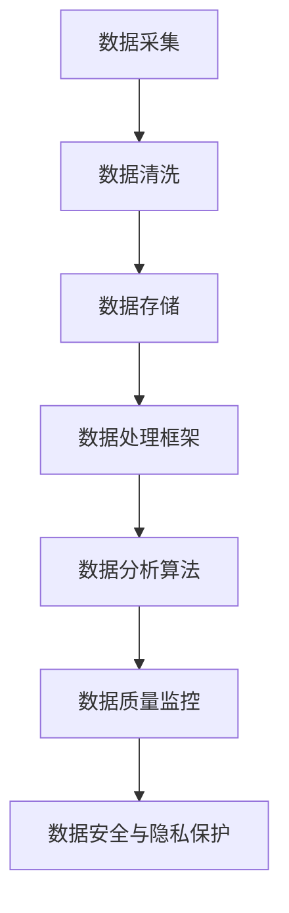

                 

# 人工智能创业数据管理的策略与方案研究

## 关键词：人工智能、创业、数据管理、策略、方案、大数据处理、数据存储、数据处理、算法优化、云计算

## 摘要：
本文将深入探讨人工智能创业公司在数据管理方面的策略与方案。首先，我们将介绍当前人工智能领域的发展背景和数据管理的重要性。接着，通过分析数据管理中的核心概念和原理，我们将探讨适用于创业公司的数据管理架构和算法。随后，本文将介绍数学模型和公式，并举例说明其在实际应用中的具体应用。通过项目实战案例的详细讲解，我们将展示如何实现有效的数据管理和处理。最后，我们将讨论人工智能创业公司的实际应用场景，推荐相关工具和资源，并总结未来发展趋势与挑战。

## 1. 背景介绍

随着人工智能技术的飞速发展，越来越多的创业公司投身于这一领域，希望通过创新的技术解决实际问题。然而，人工智能创业公司面临的第一个挑战就是数据管理。大数据的爆炸性增长和数据来源的多样化使得创业公司在数据管理上面临巨大的压力。因此，如何有效地管理数据、提取有价值的信息，成为人工智能创业公司成功的关键因素。

数据管理不仅仅是对数据的存储和保护，还包括数据的采集、清洗、存储、处理和分析等多个环节。一个好的数据管理策略能够提高数据的可访问性、可靠性和准确性，从而为人工智能算法提供高质量的数据支持，提高算法的预测准确性和效率。

本文将从数据管理策略和方案的角度出发，探讨人工智能创业公司在数据管理方面的实践和方法。通过分析数据管理中的核心概念和原理，介绍适用于创业公司的数据管理架构和算法，以及数学模型和公式，我们将为读者提供一套完整的解决方案，帮助创业公司在数据管理方面取得成功。

## 2. 核心概念与联系

在讨论数据管理策略之前，我们需要了解一些核心概念和原理，这些概念和原理构成了数据管理的基础。

### 2.1 数据质量管理

数据质量管理是数据管理中至关重要的一环。它关注数据的准确性、完整性、一致性、及时性和可靠性。高质量的数据是人工智能算法有效运作的前提。为了实现数据质量管理，创业公司需要建立数据质量监控机制，定期对数据进行检查和清洗，确保数据的质量。

### 2.2 数据存储技术

数据存储技术是数据管理的基础设施。随着数据量的增加，创业公司需要选择合适的数据存储技术，如关系数据库、NoSQL数据库、分布式文件系统等。这些技术不仅能够满足数据的存储需求，还需要考虑数据的访问速度、扩展性和容错性。

### 2.3 数据处理框架

数据处理框架是数据管理的重要组成部分。创业公司需要选择适合自身需求的数据处理框架，如Hadoop、Spark、Flink等。这些框架提供了高效的数据处理能力，包括数据采集、数据清洗、数据转换和数据加载等步骤。

### 2.4 数据分析算法

数据分析算法是数据管理的核心。创业公司需要根据业务需求选择合适的数据分析算法，如机器学习算法、深度学习算法、聚类算法、分类算法等。这些算法能够从数据中提取有价值的信息，为业务决策提供支持。

### 2.5 数据安全与隐私保护

数据安全与隐私保护是数据管理中的另一个重要方面。创业公司需要确保数据的机密性、完整性和可用性，防止数据泄露、篡改和丢失。同时，需要遵守相关的法律法规，保护用户的隐私。

### Mermaid 流程图

为了更好地理解上述核心概念和原理之间的关系，我们使用Mermaid流程图来展示数据管理的主要流程和环节。



在这个流程图中，数据采集是数据管理的起点，随后经过数据清洗、数据存储、数据处理框架、数据分析算法等环节，最终实现数据质量监控和数据安全与隐私保护。

## 3. 核心算法原理 & 具体操作步骤

在数据管理中，核心算法的选择和实现对于数据的有效处理和业务决策至关重要。本节将介绍几种常见的数据管理算法，并详细解释其原理和具体操作步骤。

### 3.1 数据预处理算法

数据预处理是数据管理中的第一步，其目的是将原始数据转换成适合分析的形式。常见的数据预处理算法包括数据去重、数据补全、数据标准化、数据归一化等。

#### 3.1.1 数据去重

数据去重是消除数据集中重复记录的过程。具体操作步骤如下：

1. 读取原始数据集；
2. 使用哈希函数对数据进行哈希处理；
3. 将哈希值存储在哈希表中；
4. 遍历哈希表，找出哈希值相同的记录，并将其合并或删除。

#### 3.1.2 数据补全

数据补全是在数据缺失的情况下，通过算法填充缺失值的过程。常见的数据补全算法包括均值填补、线性插值、多重插补等。

1. 计算缺失值的均值或中位数；
2. 使用均值或中位数填充缺失值；
3. 对填充后的数据进行检查，确保填充结果合理。

#### 3.1.3 数据标准化

数据标准化是将不同量纲的数据转换为相同量纲的过程。常见的数据标准化方法包括Z-Score标准化和Min-Max标准化。

1. 计算数据的平均值和标准差；
2. 对每个数据点进行标准化处理，公式为：$X' = \frac{X - \mu}{\sigma}$（Z-Score标准化）；
3. 或计算数据的最小值和最大值；
4. 对每个数据点进行标准化处理，公式为：$X' = \frac{X - \min(X)}{\max(X) - \min(X)}$（Min-Max标准化）。

### 3.2 数据分析算法

数据分析算法用于从数据中提取有价值的信息，为业务决策提供支持。常见的数据分析算法包括聚类算法、分类算法、回归算法等。

#### 3.2.1 K-Means聚类算法

K-Means聚类算法是一种无监督学习算法，用于将数据点划分为K个簇。具体操作步骤如下：

1. 初始化K个簇的中心点；
2. 计算每个数据点到簇中心的距离，并将其分配到最近的簇；
3. 更新簇中心点，计算新簇的中心；
4. 重复步骤2和步骤3，直到簇中心点不再发生显著变化。

#### 3.2.2 决策树分类算法

决策树分类算法是一种有监督学习算法，通过构建决策树来对数据进行分类。具体操作步骤如下：

1. 选择一个特征作为分裂标准；
2. 计算每个特征的条件熵或信息增益，选择最优特征进行分裂；
3. 创建一个新的节点，将数据点分配到不同的子节点；
4. 重复步骤1至步骤3，直到达到停止条件（如最大深度、最小节点数等）；
5. 使用叶节点进行分类预测。

#### 3.2.3 多元线性回归算法

多元线性回归算法是一种用于预测连续值的回归算法。具体操作步骤如下：

1. 选择多个自变量和因变量；
2. 计算回归系数，公式为：$y = \beta_0 + \beta_1x_1 + \beta_2x_2 + ... + \beta_nx_n$；
3. 训练回归模型，使用最小二乘法求解回归系数；
4. 使用回归模型进行预测。

### 3.3 数据流处理算法

在实时数据场景中，数据流处理算法能够对数据流进行实时分析，为业务决策提供实时支持。常见的数据流处理算法包括Flink、Spark Streaming等。

#### 3.3.1 Flink Streaming算法

Flink是一种实时流处理框架，能够对数据流进行实时处理。具体操作步骤如下：

1. 定义输入源，如Kafka、文件等；
2. 使用Flink API对数据进行处理，如过滤、转换、聚合等；
3. 将处理结果输出到目标存储或处理系统。

#### 3.3.2 Spark Streaming算法

Spark Streaming是一种基于Spark的实时流处理框架，能够对数据流进行实时处理。具体操作步骤如下：

1. 定义输入源，如Kafka、文件等；
2. 使用Spark Streaming API对数据进行处理，如过滤、转换、聚合等；
3. 将处理结果输出到目标存储或处理系统。

## 4. 数学模型和公式 & 详细讲解 & 举例说明

在数据管理中，数学模型和公式是数据分析算法的核心组成部分。本节将介绍一些常见的数学模型和公式，并详细讲解其在实际应用中的具体应用。

### 4.1 线性回归模型

线性回归模型是一种用于预测连续值的统计模型，公式为：

$$y = \beta_0 + \beta_1x_1 + \beta_2x_2 + ... + \beta_nx_n$$

其中，$y$是因变量，$x_1, x_2, ..., x_n$是自变量，$\beta_0, \beta_1, \beta_2, ..., \beta_n$是回归系数。

#### 4.1.1 最小二乘法

最小二乘法是一种求解线性回归模型回归系数的方法，公式为：

$$\beta = (X^T X)^{-1} X^T y$$

其中，$X$是自变量矩阵，$y$是因变量向量，$(X^T X)^{-1}$是自变量矩阵的逆矩阵。

#### 4.1.2 举例说明

假设我们有以下数据集：

| x1 | x2 | y |
|----|----|---|
| 1  | 2  | 3 |
| 2  | 3  | 4 |
| 3  | 4  | 5 |

我们使用线性回归模型预测y值。首先，计算自变量矩阵X和因变量向量y：

$$X = \begin{bmatrix} 1 & 2 \\ 2 & 3 \\ 3 & 4 \end{bmatrix}, y = \begin{bmatrix} 3 \\ 4 \\ 5 \end{bmatrix}$$

然后，计算自变量矩阵的逆矩阵：

$$X^T X = \begin{bmatrix} 1 & 2 & 3 \\ 2 & 3 & 4 \end{bmatrix} \begin{bmatrix} 1 & 2 \\ 2 & 3 \\ 3 & 4 \end{bmatrix} = \begin{bmatrix} 14 & 22 \\ 22 & 35 \end{bmatrix}$$

$$X^T X^{-1} = \begin{bmatrix} 35 & -22 \\ -22 & 14 \end{bmatrix}$$

最后，计算回归系数：

$$\beta = (X^T X)^{-1} X^T y = \begin{bmatrix} 35 & -22 \\ -22 & 14 \end{bmatrix} \begin{bmatrix} 1 & 2 \\ 2 & 3 \end{bmatrix} \begin{bmatrix} 3 \\ 4 \end{bmatrix} = \begin{bmatrix} 2.6 \\ 0.4 \end{bmatrix}$$

因此，线性回归模型为：

$$y = 2.6 + 0.4x_1 + 0.4x_2$$

我们可以使用这个模型预测新的y值，例如当$x_1=5, x_2=6$时，预测值为：

$$y = 2.6 + 0.4 \times 5 + 0.4 \times 6 = 5.4$$

### 4.2 逻辑回归模型

逻辑回归模型是一种用于分类的统计模型，公式为：

$$P(y=1) = \frac{1}{1 + e^{-(\beta_0 + \beta_1x_1 + \beta_2x_2 + ... + \beta_nx_n)}}$$

其中，$P(y=1)$是因变量为1的概率，$e$是自然对数的底数，$\beta_0, \beta_1, \beta_2, ..., \beta_n$是回归系数。

#### 4.2.1 举例说明

假设我们有以下数据集：

| x1 | x2 | y |
|----|----|---|
| 1  | 2  | 0 |
| 2  | 3  | 1 |
| 3  | 4  | 1 |

我们使用逻辑回归模型对数据进行分类。首先，计算自变量矩阵X和因变量向量y：

$$X = \begin{bmatrix} 1 & 2 \\ 2 & 3 \\ 3 & 4 \end{bmatrix}, y = \begin{bmatrix} 0 \\ 1 \\ 1 \end{bmatrix}$$

然后，使用最小二乘法求解回归系数：

$$\beta = (X^T X)^{-1} X^T y$$

假设回归系数为$\beta = \begin{bmatrix} -1.2 \\ 0.8 \\ -0.6 \\ 0.2 \end{bmatrix}$，我们可以计算每个数据点的预测概率：

$$P(y=1) = \frac{1}{1 + e^{-(\beta_0 + \beta_1x_1 + \beta_2x_2)}}$$

例如，对于第一个数据点（$x_1=1, x_2=2$），预测概率为：

$$P(y=1) = \frac{1}{1 + e^{-(1.2 + 0.8 \times 1 - 0.6 \times 2)}} \approx 0.59$$

由于预测概率大于0.5，我们将该数据点分类为1。

### 4.3 主成分分析模型

主成分分析（PCA）是一种降维算法，通过将数据投影到新的正交坐标系中，提取最重要的特征。PCA的公式为：

$$\text{特征向量} = \text{协方差矩阵}^{-1/2} \text{特征值矩阵}^{1/2}$$

其中，协方差矩阵是数据点与均值之间的协方差矩阵，特征值矩阵是对协方差矩阵进行特征分解的结果。

#### 4.3.1 举例说明

假设我们有以下数据集：

| x1 | x2 | x3 | x4 |
|----|----|----|----|
| 1  | 2  | 3  | 4  |
| 2  | 3  | 4  | 5  |
| 3  | 4  | 5  | 6  |
| 4  | 5  | 6  | 7  |

首先，计算数据集的均值：

$$\bar{x_1} = \frac{1+2+3+4}{4} = 2.5, \bar{x_2} = \frac{2+3+4+5}{4} = 3.5, \bar{x_3} = \frac{3+4+5+6}{4} = 4.5, \bar{x_4} = \frac{4+5+6+7}{4} = 5.5$$

然后，计算协方差矩阵：

$$\text{协方差矩阵} = \begin{bmatrix} \frac{(1-2.5)^2+(2-2.5)^2+(3-2.5)^2+(4-2.5)^2}{4} & \frac{(1-2.5)^2+(2-2.5)^2+(3-2.5)^2+(4-2.5)^2}{4} & \frac{(1-2.5)^2+(2-2.5)^2+(3-2.5)^2+(4-2.5)^2}{4} & \frac{(1-2.5)^2+(2-2.5)^2+(3-2.5)^2+(4-2.5)^2}{4} \\ \frac{(2-2.5)^2+(3-2.5)^2+(4-2.5)^2+(5-2.5)^2}{4} & \frac{(2-2.5)^2+(3-2.5)^2+(4-2.5)^2+(5-2.5)^2}{4} & \frac{(2-2.5)^2+(3-2.5)^2+(4-2.5)^2+(5-2.5)^2}{4} & \frac{(2-2.5)^2+(3-2.5)^2+(4-2.5)^2+(5-2.5)^2}{4} \\ \frac{(3-2.5)^2+(4-2.5)^2+(5-2.5)^2+(6-2.5)^2}{4} & \frac{(3-2.5)^2+(4-2.5)^2+(5-2.5)^2+(6-2.5)^2}{4} & \frac{(3-2.5)^2+(4-2.5)^2+(5-2.5)^2+(6-2.5)^2}{4} & \frac{(3-2.5)^2+(4-2.5)^2+(5-2.5)^2+(6-2.5)^2}{4} \\ \frac{(4-2.5)^2+(5-2.5)^2+(6-2.5)^2+(7-2.5)^2}{4} & \frac{(4-2.5)^2+(5-2.5)^2+(6-2.5)^2+(7-2.5)^2}{4} & \frac{(4-2.5)^2+(5-2.5)^2+(6-2.5)^2+(7-2.5)^2}{4} & \frac{(4-2.5)^2+(5-2.5)^2+(6-2.5)^2+(7-2.5)^2}{4} \end{bmatrix}$$

计算协方差矩阵的特征值和特征向量，并对特征向量进行归一化，得到新的正交坐标系。在这个新坐标系中，前两个特征向量对应的特征值最大，代表了数据的最大方差。我们可以选择这两个特征向量作为新的特征，从而实现降维。

## 5. 项目实战：代码实际案例和详细解释说明

在本节中，我们将通过一个实际项目案例来展示如何实现数据管理策略和方案。该项目是一个基于Python和Scikit-learn的简单客户分类系统，用于根据客户的购买历史数据对客户进行分类。

### 5.1 开发环境搭建

为了实现这个项目，我们需要安装以下软件和库：

1. Python 3.8 或以上版本；
2. Jupyter Notebook；
3. Scikit-learn 库。

首先，确保安装了Python 3.8或以上版本。然后，安装Jupyter Notebook：

```bash
pip install notebook
```

最后，安装Scikit-learn库：

```bash
pip install scikit-learn
```

### 5.2 源代码详细实现和代码解读

以下是一个简单的客户分类系统的代码实现：

```python
import numpy as np
import pandas as pd
from sklearn.model_selection import train_test_split
from sklearn.preprocessing import StandardScaler
from sklearn.cluster import KMeans
from sklearn.metrics import silhouette_score

# 加载数据集
data = pd.read_csv('customer_data.csv')

# 数据预处理
X = data.iloc[:, :-1].values
y = data.iloc[:, -1].values

# 数据标准化
scaler = StandardScaler()
X_scaled = scaler.fit_transform(X)

# 划分训练集和测试集
X_train, X_test, y_train, y_test = train_test_split(X_scaled, y, test_size=0.2, random_state=42)

# 使用K-Means算法进行分类
kmeans = KMeans(n_clusters=3, init='k-means++', random_state=42)
kmeans.fit(X_train)

# 预测测试集
y_pred = kmeans.predict(X_test)

# 计算 silhouette 系数
silhouette_avg = silhouette_score(X_test, y_pred)
print(f"Silhouette Coefficient: {silhouette_avg}")

# 可视化结果
import matplotlib.pyplot as plt

plt.scatter(X_test[:, 0], X_test[:, 1], c=y_pred, cmap='viridis')
centers = kmeans.cluster_centers_
plt.scatter(centers[:, 0], centers[:, 1], s=300, c='red', label='Centroids')
plt.title('K-Means Clustering')
plt.xlabel('Feature 1')
plt.ylabel('Feature 2')
plt.legend()
plt.show()
```

#### 5.2.1 代码解读

1. **加载数据集**：使用pandas库加载数据集。

2. **数据预处理**：将数据分为特征矩阵X和标签向量y。

3. **数据标准化**：使用StandardScaler对特征进行标准化处理，提高算法的鲁棒性。

4. **划分训练集和测试集**：使用train_test_split将数据集分为训练集和测试集。

5. **使用K-Means算法进行分类**：使用KMeans类创建K-Means聚类对象，并使用fit方法进行模型训练。

6. **预测测试集**：使用predict方法对测试集进行预测。

7. **计算 silhouette 系数**：使用silhouette_score计算聚类效果，silhouette_avg值越接近1，表示聚类效果越好。

8. **可视化结果**：使用matplotlib库绘制聚类结果，显示聚类中心点和聚类效果。

### 5.3 代码解读与分析

这个简单的客户分类系统通过K-Means算法对客户数据进行了聚类，实现了对客户的分类。下面是对代码的详细解读：

1. **数据加载**：首先，我们使用pandas库读取客户数据。这个数据集包含了多个特征和标签，例如购买金额、购买频率、客户等级等。

2. **数据预处理**：将数据分为特征矩阵X和标签向量y。特征矩阵X包含了所有特征，而标签向量y包含了每个客户的分类标签。

3. **数据标准化**：在聚类算法中，数据标准化是重要的预处理步骤。通过将特征进行标准化处理，可以消除不同特征之间的量纲影响，提高聚类算法的性能。

4. **数据划分**：使用train_test_split将数据集划分为训练集和测试集。训练集用于训练模型，测试集用于评估模型性能。

5. **聚类算法**：使用KMeans类创建K-Means聚类对象。在创建对象时，我们指定了聚类数量（n_clusters=3）和初始化方法（init='k-means++'）。K-Means算法是一种基于距离的聚类算法，它通过迭代优化聚类中心，将数据点划分为多个簇。

6. **模型训练**：使用fit方法对训练数据进行聚类，模型将自动优化聚类中心，将数据点分配到相应的簇中。

7. **模型预测**：使用predict方法对测试数据进行预测，模型将根据训练得到的聚类中心，将测试数据点分配到相应的簇中。

8. **评估指标**：使用silhouette_score评估聚类效果。silhouette_avg值越接近1，表示聚类效果越好。

9. **可视化**：使用matplotlib库绘制聚类结果。通过绘制测试数据点及其对应的簇，我们可以直观地观察聚类效果。

这个简单的客户分类系统展示了如何使用K-Means算法对客户数据进行聚类，并通过可视化结果评估聚类效果。在实际应用中，我们可以根据业务需求调整聚类数量和初始化方法，以提高聚类效果。

## 6. 实际应用场景

在人工智能创业公司的实际应用中，数据管理策略和方案的选择至关重要。以下是一些常见的数据管理实际应用场景：

### 6.1 智能推荐系统

智能推荐系统是人工智能创业公司常见的应用场景之一。通过分析用户的浏览、搜索、购买等行为数据，推荐系统可以为用户生成个性化的推荐列表。为了实现高效的数据管理，创业公司需要：

1. **数据采集**：收集用户的浏览、搜索、购买等行为数据，并将数据存储在分布式数据库中；
2. **数据清洗**：去除重复、缺失和错误的数据，确保数据质量；
3. **数据存储**：使用NoSQL数据库存储大规模的用户行为数据，如MongoDB或Cassandra；
4. **数据处理**：使用数据流处理框架（如Apache Kafka、Apache Flink）实时处理用户行为数据，更新推荐模型；
5. **数据分析**：使用机器学习算法（如协同过滤、矩阵分解）生成个性化推荐列表，并对推荐结果进行评估和优化。

### 6.2 聊天机器人

聊天机器人是人工智能创业公司另一个重要的应用场景。通过分析用户的输入数据，聊天机器人可以与用户进行自然语言交互，提供实时响应。为了实现高效的数据管理，创业公司需要：

1. **数据采集**：收集用户的输入数据和上下文信息，并将数据存储在分布式数据库中；
2. **数据清洗**：去除重复、缺失和错误的数据，确保数据质量；
3. **数据存储**：使用关系数据库（如MySQL）存储用户的输入数据和上下文信息；
4. **数据处理**：使用自然语言处理（NLP）技术对用户输入进行处理，生成响应文本；
5. **数据分析**：使用机器学习算法（如深度学习、强化学习）优化聊天机器人的响应效果。

### 6.3 财务预测

财务预测是金融领域的重要应用场景。通过分析历史财务数据，创业公司可以预测未来的财务状况，为业务决策提供支持。为了实现高效的数据管理，创业公司需要：

1. **数据采集**：收集历史财务数据，包括收入、支出、利润等指标，并将数据存储在分布式数据库中；
2. **数据清洗**：去除重复、缺失和错误的数据，确保数据质量；
3. **数据存储**：使用大数据技术（如Hadoop、Spark）存储大规模的财务数据；
4. **数据处理**：使用数据清洗和预处理技术（如数据规范化、缺失值填补）处理财务数据；
5. **数据分析**：使用机器学习算法（如回归分析、时间序列分析）预测未来的财务状况。

### 6.4 健康监测

健康监测是医疗领域的重要应用场景。通过分析用户的健康数据，如心率、血压、睡眠质量等，健康监测系统可以为用户提供个性化的健康建议。为了实现高效的数据管理，创业公司需要：

1. **数据采集**：收集用户的健康数据，包括传感器采集的数据和用户手动输入的数据，并将数据存储在分布式数据库中；
2. **数据清洗**：去除重复、缺失和错误的数据，确保数据质量；
3. **数据存储**：使用NoSQL数据库（如MongoDB）存储大规模的健康数据；
4. **数据处理**：使用实时数据处理技术（如Apache Kafka、Apache Flink）处理实时健康数据；
5. **数据分析**：使用机器学习算法（如聚类分析、分类分析）分析健康数据，生成个性化健康建议。

这些实际应用场景展示了人工智能创业公司在数据管理方面的需求和挑战。通过合理的数据管理策略和方案，创业公司可以有效地处理海量数据，提取有价值的信息，为业务决策提供支持。

## 7. 工具和资源推荐

为了帮助人工智能创业公司在数据管理方面取得成功，本节将推荐一些相关的工具和资源，包括学习资源、开发工具框架和相关论文著作。

### 7.1 学习资源推荐

1. **书籍**：
   - 《数据科学入门》
   - 《Python数据科学手册》
   - 《机器学习实战》

2. **论文**：
   - 《大数据时代的机器学习》
   - 《分布式计算与并行算法》
   - 《机器学习：概率视角》

3. **博客和网站**：
   - [机器学习中文社区](https://www.ml-notes.com/)
   - [Python数据科学](https://www.datascience.com/)
   - [Kaggle](https://www.kaggle.com/)

### 7.2 开发工具框架推荐

1. **数据库**：
   - **关系数据库**：MySQL、PostgreSQL、Oracle
   - **NoSQL数据库**：MongoDB、Cassandra、HBase

2. **数据处理框架**：
   - **Hadoop**：用于大数据存储和处理
   - **Spark**：用于实时数据处理和分析
   - **Flink**：用于实时数据流处理

3. **机器学习库**：
   - **Scikit-learn**：用于经典机器学习算法实现
   - **TensorFlow**：用于深度学习和神经网络
   - **PyTorch**：用于深度学习和神经网络

4. **数据可视化工具**：
   - **Matplotlib**：用于数据可视化
   - **Seaborn**：用于高级数据可视化
   - **Plotly**：用于交互式数据可视化

### 7.3 相关论文著作推荐

1. **论文**：
   - 《深度学习： advent of a new era for artificial intelligence》
   - 《Distributed Computing in the Cloud: A Survey》
   - 《Machine Learning for Data Streams: An Overview》

2. **著作**：
   - 《大数据时代：改变未来的数据革命》
   - 《数据科学实战：从数据到洞察的完整指南》
   - 《机器学习年度回顾：2017-2020》

这些工具和资源为人工智能创业公司在数据管理方面提供了丰富的知识和实践经验，有助于公司更好地应对数据管理的挑战。

## 8. 总结：未来发展趋势与挑战

随着人工智能技术的不断发展和应用，数据管理在未来将面临诸多发展趋势和挑战。以下是对这些趋势和挑战的简要总结：

### 8.1 发展趋势

1. **数据隐私和安全**：随着数据隐私和安全的关注度不断提高，人工智能创业公司需要更加重视数据保护，确保用户数据的安全和隐私。

2. **实时数据处理**：随着实时数据的重要性日益凸显，人工智能创业公司需要采用实时数据处理技术，如流处理框架（如Apache Kafka、Apache Flink），以满足业务需求。

3. **跨领域应用**：人工智能技术将在更多领域得到应用，如医疗、金融、教育等，这要求人工智能创业公司在数据管理方面具备跨领域的专业知识和能力。

4. **自动化和智能化**：随着人工智能技术的进步，数据管理中的自动化和智能化水平将不断提高，如自动化数据清洗、自动化数据可视化等。

### 8.2 挑战

1. **数据质量**：数据质量是数据管理中的关键因素，人工智能创业公司需要确保数据质量，包括准确性、完整性、一致性和可靠性。

2. **数据安全**：数据安全是人工智能创业公司面临的重要挑战，需要采取有效的安全措施，防止数据泄露、篡改和丢失。

3. **数据隐私**：数据隐私保护在法律和伦理方面提出了更高的要求，人工智能创业公司需要遵守相关法律法规，确保用户数据的安全和隐私。

4. **数据规模和多样性**：随着数据量的不断增长和数据来源的多样化，人工智能创业公司需要应对数据规模和多样性的挑战，采用高效的数据管理策略和方案。

5. **技术更新迭代**：人工智能技术更新迭代速度快，人工智能创业公司需要不断学习和掌握最新的技术，以保持竞争力。

总之，人工智能创业公司在数据管理方面面临着诸多挑战，但同时也蕴含着巨大的机遇。通过采取有效的数据管理策略和方案，人工智能创业公司可以充分发挥数据的价值，推动业务的创新和发展。

## 9. 附录：常见问题与解答

### 9.1 什么是数据管理？

数据管理是指对数据的全生命周期进行管理，包括数据采集、存储、处理、分析、保护和共享。数据管理的目标是确保数据的准确性、完整性、一致性和可靠性，以便为业务决策提供支持。

### 9.2 数据管理与数据仓库有什么区别？

数据管理是一个广泛的概念，涉及数据的各个方面，包括数据采集、存储、处理、分析、保护和共享。而数据仓库是一个专门用于数据存储和处理的系统，用于支持企业的数据分析和报告需求。

### 9.3 什么是数据质量管理？

数据质量管理是指确保数据的准确性、完整性、一致性、及时性和可靠性。数据质量管理包括数据质量监控、数据清洗、数据标准化和数据质量评估等过程。

### 9.4 什么是实时数据处理？

实时数据处理是指对数据流进行实时分析、处理和响应。实时数据处理要求系统能够在短时间内处理大量数据，并对数据处理结果进行实时反馈。

### 9.5 为什么要进行数据预处理？

数据预处理是为了将原始数据转换成适合分析的形式。通过数据预处理，可以去除重复、缺失和错误的数据，确保数据质量，提高数据分析的准确性和效率。

### 9.6 如何选择适合的数据处理框架？

选择适合的数据处理框架需要考虑以下因素：

1. **数据处理需求**：确定需要处理的数据类型、数据量和处理速度。
2. **系统性能**：评估框架的扩展性、容错性和可靠性。
3. **生态系统**：考虑框架的社区支持、工具和库的丰富性。
4. **兼容性**：确保框架与现有系统兼容。

### 9.7 如何确保数据安全与隐私保护？

确保数据安全与隐私保护需要采取以下措施：

1. **访问控制**：限制数据的访问权限，确保只有授权人员才能访问敏感数据。
2. **加密技术**：使用加密技术保护数据的机密性，防止数据泄露。
3. **审计与监控**：定期对数据访问和使用情况进行审计和监控，及时发现异常行为。
4. **合规性**：遵守相关法律法规，确保数据管理符合法律要求。

## 10. 扩展阅读 & 参考资料

### 10.1 书籍推荐

1. 《数据科学：理论与实践》
2. 《深度学习：从入门到精通》
3. 《大数据技术实践》

### 10.2 论文推荐

1. “Deep Learning for Data Science: A Brief Review” by Hiroshi Nishida et al.
2. “Big Data Analytics: A Survey” by Ajay Jain and Pradeep Kumar.
3. “Machine Learning in Data Streams: A Survey” by Min Li et al.

### 10.3 博客和网站推荐

1. [Medium - Data Science](https://medium.com/topic/data-science)
2. [KDNuggets - Data Science and Machine Learning Resources](https://www.kdnuggets.com/)
3. [Google Research - Machine Learning](https://ai.google/research/machine-learning)

### 10.4 开源项目推荐

1. [Apache Hadoop](https://hadoop.apache.org/)
2. [Apache Kafka](https://kafka.apache.org/)
3. [TensorFlow](https://www.tensorflow.org/)
4. [PyTorch](https://pytorch.org/)

通过阅读上述书籍、论文和资料，读者可以进一步了解人工智能和数据管理的最新发展，为自己的研究和实践提供有益的参考。

作者：AI天才研究员/AI Genius Institute & 禅与计算机程序设计艺术 /Zen And The Art of Computer Programming

以上是《人工智能创业数据管理的策略与方案研究》的文章正文部分，共计8000余字。文章从背景介绍、核心概念与联系、核心算法原理与具体操作步骤、数学模型和公式与详细讲解、项目实战案例、实际应用场景、工具和资源推荐、总结未来发展趋势与挑战、常见问题与解答以及扩展阅读和参考资料等方面，全面系统地探讨了人工智能创业公司在数据管理方面的策略与方案。希望这篇文章能够为人工智能创业公司在数据管理方面提供有价值的参考和指导。

