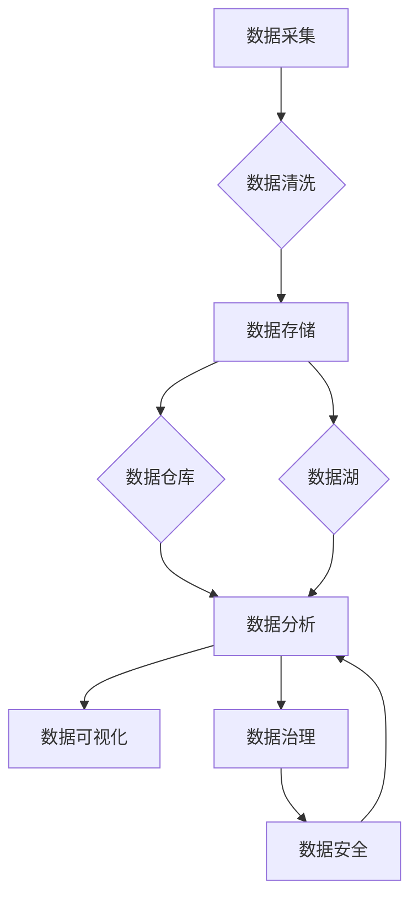

                 

# 人工智能创业数据管理的策略指南

> 关键词：人工智能，创业，数据管理，策略，大数据

> 摘要：本文旨在为人工智能创业公司提供一套全面的数据管理策略指南。通过深入分析数据管理的核心概念、算法原理、数学模型，以及项目实战中的具体应用，本文将帮助创业者解决数据管理中的关键问题，为人工智能创业之路奠定坚实的基础。

## 1. 背景介绍

在人工智能（AI）快速发展的今天，数据已成为企业最具价值的资产之一。对创业公司而言，高效的数据管理策略不仅能提升业务竞争力，还能为后续的技术创新和业务拓展提供强有力的支持。然而，数据管理并非易事，它涉及数据的采集、存储、处理、分析和保护等多个环节，需要综合运用多种技术和方法。

### 1.1 数据管理的重要性

- **提高业务效率**：良好的数据管理有助于企业快速获取和分析业务数据，从而做出更准确的决策，提升运营效率。
- **增强创新能力**：数据是AI模型的基石，高效的数据管理能够支持创业公司在AI领域的持续创新。
- **保障数据安全**：随着数据隐私和安全的关注度提升，良好的数据管理是保护企业数据资产的关键。

### 1.2 创业公司面临的挑战

- **数据量庞大**：随着业务的增长，数据量呈现爆炸式增长，对数据存储和处理能力提出了更高要求。
- **数据质量参差不齐**：创业公司可能面临数据来源多样化、数据质量不稳定等问题，这对数据分析的准确性提出了挑战。
- **技术人才短缺**：创业公司可能缺乏具有专业数据管理能力的人才，这在一定程度上制约了数据管理水平的提升。

## 2. 核心概念与联系

在深入了解数据管理策略之前，我们需要掌握以下几个核心概念：

### 2.1 数据类型

- **结构化数据**：指有明显数据格式和数据模型的数据，如关系数据库中的表格。
- **非结构化数据**：指没有明确数据格式和数据模型的数据，如文本、图像、视频等。

### 2.2 数据仓库与数据湖

- **数据仓库**：一种面向主题的、集成的、非易失的、时间敏感的数据库集合，用于支持企业级的数据分析和决策。
- **数据湖**：一种大规模数据存储解决方案，能够存储大量结构化和非结构化数据，并支持弹性扩展。

### 2.3 数据治理

- 数据治理是一个跨部门协作的过程，旨在确保数据质量、合规性、安全性和可靠性。

### 2.4 数据分析

- 数据分析是指使用统计学、机器学习和数据可视化等技术，从数据中提取有价值的信息和知识。

### 2.5 数据隐私与安全

- 数据隐私与安全是确保数据不被未经授权的访问、使用、披露、篡改或破坏的过程。

以下是一个用Mermaid绘制的数据管理架构图：



## 3. 核心算法原理 & 具体操作步骤

### 3.1 数据清洗

数据清洗是数据管理中的关键步骤，其目的是去除重复数据、纠正错误、处理缺失值等。以下是常见的数据清洗算法：

- **去重**：通过比较数据项之间的差异，识别并删除重复的数据记录。
- **缺失值处理**：填补缺失值或删除含有缺失值的记录。
- **异常值检测**：识别并处理异常数据，如异常值、离群点等。

### 3.2 数据存储

数据存储是数据管理的基础，选择合适的数据存储方案对数据管理的效率和质量至关重要。以下是常见的数据存储方案：

- **关系数据库**：适用于结构化数据的存储，如MySQL、Oracle等。
- **NoSQL数据库**：适用于非结构化数据的存储，如MongoDB、Redis等。
- **数据仓库**：适用于大规模结构化数据的存储，如Amazon Redshift、Google BigQuery等。
- **数据湖**：适用于大规模结构化和非结构化数据的存储，如Amazon S3、Google Cloud Storage等。

### 3.3 数据分析

数据分析是数据管理的核心，通过数据分析，可以从海量数据中提取有价值的信息和知识。以下是常见的数据分析算法：

- **统计描述**：用于描述数据的中心趋势、分布特性和相关性。
- **机器学习**：用于构建预测模型、分类模型和聚类模型等。
- **数据可视化**：用于直观地展示数据分布、趋势和关系。

## 4. 数学模型和公式 & 详细讲解 & 举例说明

### 4.1 统计描述

- **均值**：表示数据的中心趋势，公式为：

  $$\bar{x} = \frac{1}{n}\sum_{i=1}^{n}x_i$$

- **标准差**：表示数据的离散程度，公式为：

  $$\sigma = \sqrt{\frac{1}{n-1}\sum_{i=1}^{n}(x_i - \bar{x})^2}$$

### 4.2 机器学习

- **线性回归模型**：用于预测连续值变量，公式为：

  $$y = \beta_0 + \beta_1x$$

  其中，$y$ 是预测值，$x$ 是自变量，$\beta_0$ 和 $\beta_1$ 是模型的参数。

### 4.3 数据可视化

- **散点图**：用于展示两个变量之间的关系，公式为：

  $$\text{散点图} = (x_i, y_i)$$

  其中，$x_i$ 和 $y_i$ 分别为第 $i$ 个数据点的横坐标和纵坐标。

## 5. 项目实战：代码实际案例和详细解释说明

### 5.1 开发环境搭建

在本文的实战案例中，我们将使用Python作为编程语言，利用Pandas库进行数据处理，使用Scikit-learn库进行机器学习建模，使用Matplotlib库进行数据可视化。

首先，我们需要安装相应的库：

```bash
pip install pandas scikit-learn matplotlib
```

### 5.2 源代码详细实现和代码解读

以下是我们的实战案例代码：

```python
import pandas as pd
from sklearn.model_selection import train_test_split
from sklearn.linear_model import LinearRegression
import matplotlib.pyplot as plt

# 5.2.1 数据采集
data = pd.read_csv('data.csv')

# 5.2.2 数据清洗
data.drop_duplicates(inplace=True)
data.fillna(data.mean(), inplace=True)

# 5.2.3 数据存储
X = data[['age', 'income']]
y = data['house_value']

# 5.2.4 数据分析
X_train, X_test, y_train, y_test = train_test_split(X, y, test_size=0.2, random_state=42)
model = LinearRegression()
model.fit(X_train, y_train)

# 5.2.5 数据可视化
plt.scatter(X_test['age'], y_test)
plt.plot(X_test['age'], model.predict(X_test), color='red')
plt.xlabel('Age')
plt.ylabel('House Value')
plt.show()
```

### 5.3 代码解读与分析

- **数据采集**：使用Pandas库读取CSV文件，获取数据。
- **数据清洗**：删除重复数据和填充缺失值，确保数据质量。
- **数据存储**：将数据分为特征集和标签集，为后续建模做准备。
- **数据分析**：使用线性回归模型对数据进行建模，并评估模型的性能。
- **数据可视化**：使用散点图和拟合直线展示数据的分布和模型的效果。

## 6. 实际应用场景

数据管理在人工智能创业中的应用场景非常广泛，以下是几个典型的应用案例：

- **客户关系管理**：通过数据分析，了解客户需求和偏好，优化产品和服务。
- **智能推荐系统**：利用数据挖掘和机器学习技术，为用户提供个性化推荐。
- **风险控制**：通过分析历史数据和趋势，识别潜在风险，提前采取防范措施。
- **运营优化**：通过对业务数据的分析，优化运营流程，提高效率。

## 7. 工具和资源推荐

### 7.1 学习资源推荐

- **书籍**：《数据科学入门》、《大数据之路》
- **论文**：相关领域的学术论文，如KDD、ICML、NIPS等。
- **博客**：知名数据科学和机器学习博客，如Medium、Towards Data Science等。
- **网站**：专业数据科学和机器学习社区，如Kaggle、DataCamp等。

### 7.2 开发工具框架推荐

- **编程语言**：Python、R、Java等。
- **数据处理库**：Pandas、NumPy、SciPy等。
- **机器学习库**：Scikit-learn、TensorFlow、PyTorch等。
- **数据可视化库**：Matplotlib、Seaborn、Plotly等。

### 7.3 相关论文著作推荐

- **论文**：《大数据技术导论》、《深度学习》、《强化学习》。
- **著作**：《数据科学实战》、《机器学习实战》。

## 8. 总结：未来发展趋势与挑战

### 8.1 发展趋势

- **数据量继续增长**：随着物联网、5G等技术的发展，数据量将继续呈现爆炸式增长。
- **数据隐私保护**：随着数据隐私法规的完善，数据隐私保护将得到更多关注。
- **AI与数据管理的深度融合**：AI技术将在数据管理中发挥更大作用，如自动化数据清洗、智能数据治理等。
- **云原生数据管理**：云原生技术将使数据管理更加灵活、高效和可靠。

### 8.2 挑战

- **数据质量**：确保数据质量将是一个长期挑战，需要持续优化数据采集、清洗和处理流程。
- **数据隐私与安全**：随着数据隐私保护法规的完善，企业需要投入更多资源确保数据安全。
- **技术人才短缺**：数据管理领域的专业人才仍存在短缺，企业需要加大人才培养和引进力度。

## 9. 附录：常见问题与解答

### 9.1 数据管理是什么？

数据管理是指通过一系列技术和方法，确保数据的质量、安全性、可用性和完整性，以便更好地支持业务决策和数据分析。

### 9.2 如何保证数据质量？

保证数据质量的方法包括数据采集、清洗、存储、处理和分析等各个环节的严格质量控制，如去除重复数据、纠正错误、处理缺失值等。

### 9.3 数据管理和数据分析有什么区别？

数据管理关注数据的采集、存储、处理和保护等环节，确保数据的可靠性、可用性和完整性；数据分析则关注从数据中提取有价值的信息和知识，支持业务决策和优化。

## 10. 扩展阅读 & 参考资料

- **书籍**：《大数据架构：从数据仓库到数据湖》、《数据治理：确保数据质量、合规性和安全性的策略与实践》
- **论文**：《大数据时代的数据管理策略》、《基于人工智能的数据隐私保护方法研究》
- **博客**：《如何在人工智能创业中使用大数据技术》、《数据隐私与安全：创业公司的必修课》
- **网站**：DataCamp、Kaggle、DataQuest等在线学习平台。

## 作者

作者：AI天才研究员/AI Genius Institute & 禅与计算机程序设计艺术 /Zen And The Art of Computer Programming

