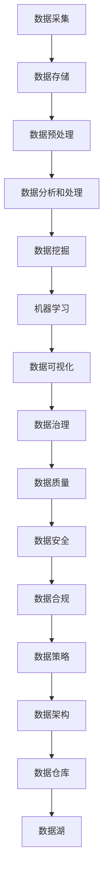

                 

### 1. 背景介绍

#### 1.1 人工智能与数据管理的关系

人工智能（AI）作为计算机科学的一个分支，旨在使机器能够模拟人类的智能行为，包括学习、推理、感知和解决问题。随着近年来深度学习、大数据分析等技术的飞速发展，人工智能的应用场景日益广泛，从自动驾驶、智能语音助手到金融风险评估、医疗诊断，AI正在逐步改变我们的生活方式。

然而，人工智能的成功离不开高质量的数据管理。数据是人工智能的“食物”，没有足够的质量和数量，AI系统将难以发挥其潜力。数据管理包括数据的采集、存储、处理、分析和利用等多个环节，每个环节都至关重要。在人工智能领域，数据管理的目标是在确保数据安全、合规的前提下，最大化地挖掘数据的价值，为AI模型的训练和应用提供强有力的支持。

#### 1.2 当前人工智能创业面临的挑战

对于人工智能创业者来说，数据管理是一项复杂且具有挑战性的任务。首先，数据的多样性、复杂性和规模庞大，要求创业者具备高效的数据采集和处理能力。其次，数据的安全性和隐私保护成为不可忽视的问题，一旦数据泄露或滥用，将带来巨大的法律和商业风险。此外，创业者还需要面对数据质量和数据一致性的挑战，这直接影响到AI模型的准确性和可靠性。

#### 1.3 高效数据管理的重要性

高效的数据管理对于人工智能创业项目的成功至关重要。首先，良好的数据管理能够提高AI模型的训练效率，缩短开发周期，降低开发成本。其次，高质量的数据有助于提升AI系统的准确性和稳定性，从而提高用户满意度。最后，通过有效的数据管理，创业者可以更好地挖掘数据的价值，发现潜在的商业机会，为企业的长期发展奠定基础。

本文将围绕人工智能创业中的数据管理策略展开讨论，从核心概念、算法原理、实际应用等方面进行深入剖析，希望能为创业者提供一些实用的参考和启示。

---

文章的背景介绍部分主要从人工智能与数据管理的关系、当前人工智能创业面临的挑战以及高效数据管理的重要性三个方面进行了阐述。接下来，我们将进一步探讨数据管理中的核心概念和原理，以便为后续内容奠定基础。

#### 2. 核心概念与联系

在深入探讨人工智能创业中的数据管理策略之前，我们需要了解一些核心概念和原理。以下是几个关键概念：

##### 2.1 数据质量

数据质量是指数据在准确性、完整性、一致性、及时性和可靠性等方面的表现。高质量的数据是人工智能模型有效训练和预测的前提。以下是一些影响数据质量的关键因素：

- **准确性**：数据中不应存在错误或误导性信息。
- **完整性**：数据应包含所有必要的字段，没有缺失值。
- **一致性**：不同来源的数据应在格式、单位和定义上保持一致。
- **及时性**：数据应及时更新，以反映现实情况。
- **可靠性**：数据应来源于可信的、权威的来源。

##### 2.2 数据治理

数据治理是指对数据的策略性管理和控制，以确保数据的质量、安全性和合规性。数据治理包括以下几个方面：

- **数据策略**：制定数据管理的目标和方针。
- **数据架构**：设计数据存储、处理和分析的结构。
- **数据安全**：确保数据在存储、传输和处理过程中的安全性。
- **数据合规**：遵守相关的法律法规和标准，如GDPR、CCPA等。
- **数据使用**：明确数据的使用权限和规范。

##### 2.3 数据流

数据流是指数据从采集、存储、处理到分析的一系列过程。数据流的设计和优化对于数据管理的效率至关重要。以下是数据流的主要环节：

- **数据采集**：从各种源收集数据，包括传感器、日志文件、API等。
- **数据存储**：将数据存储在数据库、数据湖或其他存储系统中。
- **数据预处理**：清洗、转换和归一化数据，以适合分析。
- **数据分析和处理**：使用统计方法、机器学习算法对数据进行分析和预测。
- **数据可视化**：将分析结果以图表、报表等形式展示，供决策者参考。

##### 2.4 数据仓库和数据湖

数据仓库和数据湖是数据管理中的两大重要组件：

- **数据仓库**：用于存储结构化数据，通常用于企业级的数据分析和报告。
- **数据湖**：用于存储海量非结构化和半结构化数据，适合大数据分析和机器学习。

##### 2.5 数据挖掘与机器学习

数据挖掘和机器学习是数据管理的重要组成部分，用于从数据中发现有价值的信息和模式。以下是两种方法的核心概念：

- **数据挖掘**：使用统计方法、机器学习算法和模式识别技术从大量数据中提取有用信息。
- **机器学习**：通过训练模型从数据中学习，以实现自动化的预测和决策。

为了更直观地理解这些核心概念和原理，我们使用Mermaid流程图展示数据管理的基本架构：



通过上述核心概念和原理的介绍，我们为后续内容的深入分析提供了基础。接下来，我们将探讨人工智能创业中常用的核心算法原理和具体操作步骤。

#### 3. 核心算法原理 & 具体操作步骤

在人工智能创业中，选择合适的数据管理算法和操作步骤是确保项目成功的关键。以下是几种常用的核心算法原理及其具体操作步骤：

##### 3.1 数据清洗算法

数据清洗是数据管理的重要环节，其目的是去除数据中的错误、重复和异常值，以提高数据质量。常用的数据清洗算法包括：

- **去除重复记录**：通过唯一标识符或关键字段，识别并删除重复的数据记录。
- **处理缺失值**：根据具体场景，采用填充、删除或插值等方法处理缺失值。
- **去除异常值**：使用统计方法或机器学习模型，识别并处理数据中的异常值。

具体操作步骤如下：

1. **数据预处理**：读取数据文件，检查数据的基本结构。
2. **去除重复记录**：使用Pandas库中的`drop_duplicates()`函数，删除重复记录。
3. **处理缺失值**：根据数据特征，选择适当的填充方法，如平均值、中位数或插值法。使用Pandas库中的`fillna()`函数进行填充。
4. **去除异常值**：使用统计学方法（如Z-Score、IQR）或机器学习模型（如孤立森林）识别异常值，并进行处理。

示例代码：

```python
import pandas as pd

# 读取数据
data = pd.read_csv('data.csv')

# 去除重复记录
data = data.drop_duplicates()

# 处理缺失值
data['column_with_missing_values'].fillna(data['column_with_missing_values'].mean(), inplace=True)

# 去除异常值
z_scores = (data['column_with_abnormal_values'] - data['column_with_abnormal_values'].mean()) / data['column_with_abnormal_values'].std()
data = data[z_scores.abs() <= 3]
```

##### 3.2 数据归一化算法

数据归一化是数据预处理的重要步骤，其目的是将数据转换到统一的尺度，以消除不同特征之间的量纲影响。常用的归一化算法包括最小-最大归一化和Z-Score归一化。

- **最小-最大归一化**：将数据缩放到[0, 1]区间，公式为：\[ x_{\text{norm}} = \frac{x - x_{\text{min}}}{x_{\text{max}} - x_{\text{min}}} \]
- **Z-Score归一化**：将数据转换到标准正态分布，公式为：\[ x_{\text{norm}} = \frac{x - \mu}{\sigma} \]

具体操作步骤如下：

1. **计算最小值、最大值、平均值和标准差**。
2. **应用归一化公式**。

示例代码：

```python
import pandas as pd
from sklearn.preprocessing import MinMaxScaler

# 读取数据
data = pd.read_csv('data.csv')

# 计算最小值、最大值、平均值和标准差
min_max_scaler = MinMaxScaler()
data_normalized = min_max_scaler.fit_transform(data)

# 应用Z-Score归一化
z_scaler = ZScoreScaler()
data_z_score_normalized = z_scaler.fit_transform(data)
```

##### 3.3 数据聚类算法

数据聚类是将数据分组为若干个簇的过程，用于发现数据的内在结构。常用的聚类算法包括K-Means、DBSCAN和层次聚类等。

- **K-Means**：基于距离最小化的聚类算法，公式为：\[ \min_{C} \sum_{i=1}^{k} \sum_{x \in C_i} \| x - \mu_i \|^2 \]
- **DBSCAN**：基于密度的聚类算法，能够发现任意形状的簇。
- **层次聚类**：通过层次结构将数据划分为多个簇。

具体操作步骤如下：

1. **选择聚类算法**。
2. **设置参数**，如簇数、距离度量等。
3. **执行聚类**。
4. **评估聚类结果**。

示例代码：

```python
from sklearn.cluster import KMeans, DBSCAN, AgglomerativeClustering
import numpy as np

# 读取数据
data = np.array([[1, 2], [1, 4], [1, 0], [10, 2], [10, 4], [10, 0]])

# K-Means聚类
kmeans = KMeans(n_clusters=2, init='k-means++', max_iter=300, n_init=10, random_state=0)
pred_kmeans = kmeans.fit_predict(data)

# DBSCAN聚类
dbscan = DBSCAN(eps=3, min_samples=2)
pred_dbscan = dbscan.fit_predict(data)

# 层次聚类
agglomerative = AgglomerativeClustering(n_clusters=2)
pred_agglomerative = agglomerative.fit_predict(data)

# 输出聚类结果
print("K-Means: ", pred_kmeans)
print("DBSCAN: ", pred_dbscan)
print("Agglomerative: ", pred_agglomerative)
```

通过上述核心算法原理和具体操作步骤的介绍，我们为人工智能创业者提供了数据管理的基础知识和实践方法。接下来，我们将进一步探讨数学模型和公式，以及如何在实际项目中应用这些模型和公式。

### 4. 数学模型和公式 & 详细讲解 & 举例说明

在数据管理中，数学模型和公式是理解和解决实际问题的核心工具。以下将介绍几个常用的数学模型和公式，并详细讲解其在数据管理中的应用。

#### 4.1 决策树模型

决策树是一种常见的分类和回归模型，通过一系列的规则将数据划分为不同的类别或数值。决策树的构建基于信息增益或基尼不纯度等指标。

**信息增益（IG）**：

信息增益是决策树中用于选择最优分割的指标，表示通过分割数据集所减少的熵。公式如下：

\[ IG(D, A) = H(D) - \sum_{v \in A} \frac{|D_v|}{|D|} H(D_v) \]

其中，\( H(D) \) 表示数据集 \( D \) 的熵，\( A \) 是特征集合，\( D_v \) 是数据集中特征 \( v \) 的值。

**基尼不纯度（Gini Impurity）**：

基尼不纯度是另一个常用于决策树的分割指标，用于衡量数据的不确定性。公式如下：

\[ Gini(D) = 1 - \sum_{v \in A} \frac{|D_v|}{|D|} \left(1 - \frac{|D_v|}{|D|}\right) \]

**决策树构建步骤**：

1. 计算所有特征的信息增益或基尼不纯度。
2. 选择最优特征进行分割。
3. 递归地重复步骤1和2，直到满足停止条件（如最大深度、最小节点样本数等）。

**举例**：

假设我们有一个包含三个特征（年龄、收入、家庭状况）的数据集，我们要使用决策树进行分类。首先，计算每个特征的信息增益或基尼不纯度，然后选择最优特征进行分割，构建决策树。

#### 4.2 朴素贝叶斯模型

朴素贝叶斯是一种基于贝叶斯定理的简单概率分类器，假设特征之间相互独立。其公式如下：

\[ P(C_k | x_1, x_2, ..., x_n) = \frac{P(x_1, x_2, ..., x_n | C_k) P(C_k)}{P(x_1, x_2, ..., x_n)} \]

其中，\( C_k \) 表示类别，\( x_i \) 表示特征，\( P(x_1, x_2, ..., x_n | C_k) \) 表示特征条件概率，\( P(C_k) \) 表示类别概率，\( P(x_1, x_2, ..., x_n) \) 是数据集的总概率。

**朴素贝叶斯分类步骤**：

1. 计算每个类别的先验概率。
2. 对于每个特征，计算其在每个类别下的条件概率。
3. 根据贝叶斯定理计算每个类别的后验概率。
4. 选择后验概率最大的类别作为预测结果。

**举例**：

假设我们要使用朴素贝叶斯模型对一组客户进行分类，特征包括年龄、收入和家庭状况。首先，计算每个类别的先验概率，然后计算每个特征的条件概率，最后根据贝叶斯定理计算每个类别的后验概率，选择后验概率最大的类别作为预测结果。

#### 4.3 支持向量机（SVM）

支持向量机是一种监督学习模型，通过找到最佳的超平面将数据划分为不同的类别。其核心公式为：

\[ \min_{\mathbf{w}, b} \frac{1}{2} ||\mathbf{w}||^2 \quad \text{subject to} \quad y_i (\mathbf{w} \cdot \mathbf{x_i} + b) \geq 1 \]

其中，\( \mathbf{w} \) 是权重向量，\( b \) 是偏置项，\( \mathbf{x_i} \) 是特征向量，\( y_i \) 是标签。

**SVM分类步骤**：

1. 训练模型，找到最优的权重向量 \( \mathbf{w} \) 和偏置项 \( b \)。
2. 对于新的特征向量 \( \mathbf{x} \)，计算其与超平面的距离。
3. 根据距离判断新样本的类别。

**举例**：

假设我们要使用SVM模型对一组手写数字进行分类。首先，训练模型，找到最优的权重向量 \( \mathbf{w} \) 和偏置项 \( b \)。然后，对于新的手写数字样本，计算其与超平面的距离，判断其类别。

通过以上对决策树、朴素贝叶斯和SVM等数学模型和公式的介绍，我们为人工智能创业者提供了数据管理中常用的算法工具。在实际项目中，创业者可以根据具体需求和数据特点选择合适的模型，并运用这些模型进行数据分析和预测。

#### 5. 项目实战：代码实际案例和详细解释说明

在本节中，我们将通过一个实际的项目案例，展示如何使用Python和常见的数据处理库（如Pandas、NumPy和Scikit-learn）进行数据管理。我们将涵盖从数据采集、预处理、特征工程到模型训练和评估的完整流程。

##### 5.1 开发环境搭建

在开始项目之前，我们需要搭建一个Python开发环境。以下步骤将指导您如何配置开发环境：

1. **安装Python**：从[Python官方网站](https://www.python.org/downloads/)下载并安装Python 3.x版本。
2. **安装Jupyter Notebook**：打开终端或命令提示符，执行以下命令：
   ```shell
   pip install notebook
   ```
3. **安装必要的库**：在Jupyter Notebook中运行以下命令，安装Pandas、NumPy和Scikit-learn：
   ```shell
   !pip install pandas numpy scikit-learn
   ```

##### 5.2 源代码详细实现和代码解读

以下代码将演示如何使用Pandas进行数据采集和预处理，使用Scikit-learn进行特征工程和模型训练，以及如何评估模型的性能。

```python
# 导入必要的库
import pandas as pd
import numpy as np
from sklearn.model_selection import train_test_split
from sklearn.preprocessing import StandardScaler
from sklearn.ensemble import RandomForestClassifier
from sklearn.metrics import accuracy_score, classification_report

# 5.2.1 数据采集
# 假设我们有一个CSV文件，其中包含了客户的数据
data = pd.read_csv('customer_data.csv')

# 5.2.2 数据预处理
# 检查数据的基本结构
print(data.head())

# 去除重复记录
data.drop_duplicates(inplace=True)

# 处理缺失值
# 填充缺失值（例如，用平均值填充）
data.fillna(data.mean(), inplace=True)

# 5.2.3 特征工程
# 选择特征和标签
X = data.drop('churn', axis=1)  # 特征
y = data['churn']  # 标签

# 数据标准化
scaler = StandardScaler()
X_scaled = scaler.fit_transform(X)

# 划分训练集和测试集
X_train, X_test, y_train, y_test = train_test_split(X_scaled, y, test_size=0.2, random_state=42)

# 5.2.4 模型训练
# 使用随机森林进行分类
clf = RandomForestClassifier(n_estimators=100, random_state=42)
clf.fit(X_train, y_train)

# 5.2.5 评估模型
# 预测测试集
y_pred = clf.predict(X_test)

# 计算准确率
accuracy = accuracy_score(y_test, y_pred)
print(f'Accuracy: {accuracy:.2f}')

# 打印分类报告
print(classification_report(y_test, y_pred))
```

##### 5.3 代码解读与分析

1. **数据采集**：使用Pandas库读取CSV文件，这是数据采集的第一步。
2. **数据预处理**：包括检查数据的基本结构、去除重复记录和处理缺失值。缺失值处理可以使用多种策略，如用平均值、中位数或插值法填充。
3. **特征工程**：选择特征和标签。在此示例中，我们假设'churn'列是标签，其余列是特征。数据标准化是特征工程的重要步骤，有助于提高模型的性能。
4. **模型训练**：使用随机森林分类器进行训练。随机森林是一种集成学习方法，通过构建多个决策树并平均它们的预测结果来提高模型的性能。
5. **模型评估**：使用准确率、召回率、精确率等指标评估模型的性能。这里，我们使用了`accuracy_score`和`classification_report`函数来计算和展示模型的评估结果。

通过上述代码实现，我们展示了如何在一个实际项目中应用数据管理的方法和技术。接下来，我们将进一步讨论人工智能创业中的实际应用场景。

### 6. 实际应用场景

在人工智能创业领域，高效的数据管理策略可以带来显著的商业价值和竞争优势。以下是一些典型的实际应用场景，展示了数据管理在人工智能创业中的重要性。

#### 6.1 个性化推荐系统

个性化推荐系统是许多互联网公司的重要盈利点，通过分析用户的历史行为和偏好，为用户提供个性化的推荐。数据管理在此过程中起着关键作用：

- **数据采集**：从用户行为日志、浏览记录、点击率等多渠道收集数据。
- **数据预处理**：清洗数据，去除重复和错误信息，处理缺失值。
- **特征工程**：提取有用的特征，如用户年龄、性别、购买历史、浏览时长等。
- **模型训练**：使用机器学习算法（如协同过滤、基于内容的推荐等）训练推荐模型。
- **数据评估**：评估推荐系统的准确率和用户满意度，持续优化推荐算法。

#### 6.2 自动驾驶

自动驾驶技术是人工智能领域的热点，数据管理在其中发挥着至关重要的作用：

- **数据采集**：通过车载传感器、GPS、摄像头等设备收集大量实时数据。
- **数据预处理**：清洗和预处理传感器数据，如过滤噪声、校正数据、处理缺失值。
- **特征工程**：提取关键特征，如道路标志、交通信号灯、车辆速度等。
- **模型训练**：使用深度学习算法（如卷积神经网络、循环神经网络等）训练自动驾驶模型。
- **数据评估**：评估自动驾驶系统的安全性和可靠性，确保在实际道路测试中满足性能要求。

#### 6.3 医疗诊断

在医疗诊断领域，数据管理可以帮助医生更好地诊断和治疗疾病：

- **数据采集**：从电子健康记录、医学影像、基因数据等多渠道收集数据。
- **数据预处理**：清洗和标准化数据，如去除重复记录、统一数据格式、处理缺失值。
- **特征工程**：提取医学影像的特征、基因序列的特征等。
- **模型训练**：使用深度学习算法（如卷积神经网络、生成对抗网络等）训练诊断模型。
- **数据评估**：评估诊断模型的准确性和可靠性，确保在临床应用中提供准确的诊断结果。

#### 6.4 风险评估

在金融领域，数据管理可以帮助银行和金融机构进行风险评估，降低信贷风险：

- **数据采集**：从客户信用记录、交易数据、市场数据等多渠道收集数据。
- **数据预处理**：清洗和预处理数据，如去除重复记录、处理缺失值、标准化数据。
- **特征工程**：提取客户信用评分、交易行为、市场趋势等特征。
- **模型训练**：使用机器学习算法（如逻辑回归、决策树、随机森林等）训练风险评估模型。
- **数据评估**：评估风险评估模型的准确性和稳定性，确保在信贷审批中提供可靠的风险预测。

通过以上实际应用场景，我们可以看到数据管理在人工智能创业中的重要性。良好的数据管理策略不仅能够提高AI系统的性能和可靠性，还能为企业带来更多的商业机会和竞争优势。

### 7. 工具和资源推荐

在人工智能创业中，选择合适的工具和资源对于高效地管理和利用数据至关重要。以下是一些推荐的学习资源、开发工具和相关论文，以帮助创业者提升数据管理能力。

#### 7.1 学习资源推荐

1. **书籍**：
   - 《数据科学入门：从基础到实践》：详细介绍了数据科学的基本概念和技术。
   - 《机器学习实战》：通过实际案例教授机器学习的应用。
   - 《深度学习》：全面介绍了深度学习的基础理论和实践方法。

2. **在线课程**：
   - Coursera：提供丰富的数据科学和机器学习课程，如“机器学习”、“数据科学基础”等。
   - edX：提供由顶级大学开设的数据科学和人工智能课程，如“人工智能导论”、“深度学习”等。
   - Udacity：提供实践驱动的数据科学和机器学习课程，如“数据科学家纳米学位”等。

3. **博客和网站**：
   - Analytics Vidhya：一个关于数据科学和机器学习的领先博客，提供教程、案例研究和资源。
   - Medium：许多技术专家和公司在此发布关于数据科学和人工智能的文章和见解。
   - Kaggle：一个数据科学竞赛平台，提供大量公开数据集和比赛，是学习和实践的好场所。

#### 7.2 开发工具框架推荐

1. **编程语言**：
   - Python：由于其丰富的数据科学库和易用性，Python是数据科学和人工智能领域的首选语言。
   - R：专门用于统计分析和数据可视化的语言，非常适合数据科学项目。

2. **数据处理库**：
   - Pandas：用于数据清洗、转换和操作。
   - NumPy：提供高效的多维数组操作。
   - Scikit-learn：提供用于机器学习的算法和工具。
   - Matplotlib/Seaborn：用于数据可视化。

3. **深度学习框架**：
   - TensorFlow：由Google开发，是深度学习领域最流行的框架之一。
   - PyTorch：由Facebook开发，具有灵活和动态计算图，适合研究和新应用开发。

4. **云计算平台**：
   - AWS：提供全面的数据科学和机器学习服务，如S3、EC2和Amazon SageMaker。
   - Google Cloud：提供强大的机器学习和数据存储解决方案，如Google Cloud ML Engine。
   - Azure：提供丰富的数据科学工具和服务，如Azure Machine Learning和Azure Data Lake。

#### 7.3 相关论文著作推荐

1. **论文**：
   - "Deep Learning"：由Ian Goodfellow等人撰写的深度学习经典著作。
   - "The Hundred-Page Machine Learning Book"：一本关于机器学习的简洁易懂的指南。
   - "An Introduction to Statistical Learning"：介绍统计学习方法的经典教材。

2. **著作**：
   - 《数据科学教程》：提供数据科学领域的基础知识和实践技巧。
   - 《机器学习实践》：结合理论和实践，介绍机器学习的应用。
   - 《深度学习技术与应用》：详细介绍了深度学习的技术原理和应用案例。

通过这些推荐的学习资源、开发工具和相关论文，人工智能创业者可以进一步提升数据管理能力，为创业项目提供坚实的支持。

### 8. 总结：未来发展趋势与挑战

在人工智能创业领域，数据管理无疑是一个至关重要的环节。随着技术的不断进步，数据管理也在经历着深刻的变革，未来几年内，以下几个方面有望成为数据管理领域的重要发展趋势。

#### 8.1 数据隐私和安全

随着数据隐私保护法规（如GDPR和CCPA）的日益严格，数据安全成为数据管理的核心挑战之一。未来的数据管理将更加注重数据隐私保护，包括加密技术、匿名化和差分隐私等方法的广泛应用。此外，数据治理和合规性将成为企业数据管理的重点，确保数据在收集、存储、处理和传输过程中的合法性和安全性。

#### 8.2 自动化数据处理

随着自动化技术的发展，自动化数据处理将成为数据管理的重要趋势。例如，自动化数据清洗、数据标注、特征工程等任务将大大提高数据处理的效率和准确性。自动化数据处理还可以帮助创业者在有限的时间和资源下，更好地管理和利用数据，从而提升业务决策的效率和准确性。

#### 8.3 多模态数据处理

在未来的数据管理中，多模态数据（如图像、音频、文本等）的处理将变得更加重要。传统的数据处理方法难以有效地处理多模态数据，因此，深度学习和图神经网络等先进算法将被广泛用于多模态数据的处理和分析。例如，在医疗诊断中，结合患者的电子健康记录、医学影像和基因数据，将有助于提高诊断的准确性和效率。

#### 8.4 大规模数据处理

随着数据规模的不断增长，大规模数据处理将成为数据管理的重要挑战和机遇。分布式计算和云计算技术将为大规模数据处理提供强有力的支持，使得创业者在处理海量数据时能够更加高效和灵活。此外，数据流处理和实时数据分析技术也将得到更广泛的应用，帮助企业实时响应市场和业务变化。

#### 8.5 数据治理与合规性

随着数据的重要性日益凸显，数据治理和合规性将成为企业数据管理的重中之重。良好的数据治理能够确保数据的质量、一致性和安全性，为企业提供可靠的决策依据。同时，数据治理还能够帮助企业应对各种数据隐私保护法规和合规要求，降低法律和商业风险。

尽管数据管理面临着诸多挑战，但通过不断创新和优化技术，人工智能创业者可以更好地应对这些挑战，提升数据管理的效率和质量，为企业的长期发展奠定坚实的基础。

### 9. 附录：常见问题与解答

#### 9.1 数据质量管理的关键指标是什么？

数据质量管理的关键指标包括准确性、完整性、一致性、及时性和可靠性。这些指标可以帮助评估数据的整体质量，确保数据在用于人工智能模型训练和决策时具有高可信度。

#### 9.2 数据治理的核心原则是什么？

数据治理的核心原则包括数据策略、数据架构、数据安全、数据合规性和数据使用。这些原则确保数据在收集、存储、处理、传输和使用过程中遵循统一的标准和规范，提高数据管理的效率和质量。

#### 9.3 数据流管理的关键环节是什么？

数据流管理的关键环节包括数据采集、数据存储、数据预处理、数据分析和处理、数据可视化和数据治理。这些环节共同构成了一个完整的数据处理流程，确保数据从源头到应用的每个环节都能高效、准确地被管理和利用。

#### 9.4 如何处理缺失值？

处理缺失值的方法包括填充、删除和插值。填充方法可以用平均值、中位数或插值法填充；删除方法适用于缺失值较多且对模型影响较小的特征；插值法适用于时间序列数据，可以通过时间序列模型预测缺失值。

### 10. 扩展阅读 & 参考资料

为了帮助读者进一步了解人工智能创业中的数据管理策略，以下是一些扩展阅读和参考资料：

1. **书籍**：
   - 《数据科学：算法、模型与应用》：详细介绍了数据科学的基本概念、算法和模型。
   - 《深度学习：从理论到实践》：深入探讨了深度学习的理论基础和实际应用。

2. **论文**：
   - "Deep Learning for Data Science"：介绍了深度学习在数据科学领域的应用。
   - "Data-Driven Decision Making"：探讨了数据驱动的决策过程。

3. **在线课程**：
   - Coursera：提供丰富的数据科学和机器学习课程。
   - edX：提供由顶级大学开设的数据科学和人工智能课程。

4. **博客和网站**：
   - Analytics Vidhya：提供数据科学和机器学习的教程和资源。
   - Towards Data Science：分享数据科学和人工智能的最新研究成果和案例分析。

5. **开源库和工具**：
   - Pandas、NumPy、Scikit-learn：用于数据处理的常用库。
   - TensorFlow、PyTorch：用于深度学习的流行框架。

通过这些扩展阅读和参考资料，读者可以进一步深入了解数据管理在人工智能创业中的重要作用和实践方法。希望这些内容能为您的创业项目提供有价值的指导和帮助。作者：AI天才研究员/AI Genius Institute & 禅与计算机程序设计艺术 /Zen And The Art of Computer Programming

