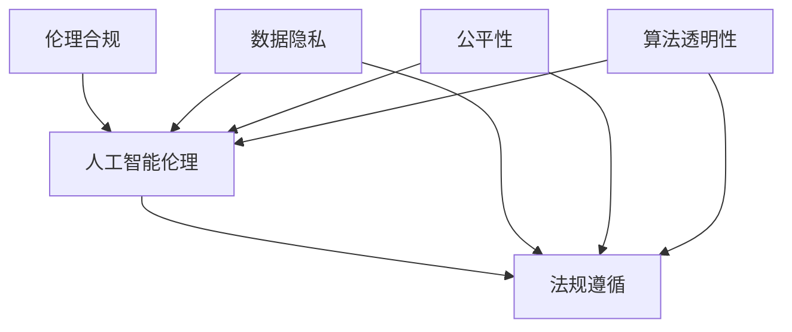

                 

# 人工智能创业：伦理合规的策略

## 关键词：
- 人工智能创业
- 伦理合规
- 法规遵循
- 风险管理
- 隐私保护
- 可解释性

## 摘要：

随着人工智能技术的迅猛发展，越来越多的初创公司投身于这个充满机遇的领域。然而，在追求技术突破和商业成功的同时，伦理合规成为企业不可忽视的重要议题。本文将深入探讨人工智能创业中的伦理合规策略，从背景介绍、核心概念、算法原理、数学模型、实际应用、工具推荐到未来发展趋势，全面解析如何在技术前沿中保持道德底线和法律法规的遵循。通过详细的分析和实例，本文旨在为人工智能创业者提供实用的指导和策略，以实现技术创新与社会责任的和谐统一。

### 1. 背景介绍

近年来，人工智能（AI）技术取得了显著的进步，从简单的规则系统到复杂的神经网络，AI在多个领域展现了其强大的潜力。这些进步不仅推动了科技创新，也为商业应用带来了新的可能性。例如，AI在医疗诊断、自动驾驶、金融风控、个性化推荐等领域的应用，正逐渐改变我们的生活和工作方式。与此同时，越来越多的初创公司投身于人工智能领域，希望通过创新技术获取竞争优势，实现商业成功。

然而，随着人工智能技术的普及和应用范围的扩大，伦理合规问题逐渐成为人们关注的焦点。一方面，人工智能系统在决策过程中可能会产生不公平、歧视等问题，损害社会公共利益；另一方面，数据隐私和安全问题也日益突出，特别是在大规模数据收集和数据分析的过程中。这些问题不仅关系到企业的声誉和法律责任，也可能对社会的稳定和发展产生深远影响。

因此，如何在人工智能创业过程中兼顾技术创新和伦理合规，成为企业必须面对的挑战。本文将从多个维度探讨这一议题，旨在为人工智能创业者提供实用的策略和指导。

### 2. 核心概念与联系

在探讨人工智能创业中的伦理合规策略之前，有必要明确一些核心概念，并理解它们之间的联系。

#### 2.1 伦理合规的定义

伦理合规（Ethical Compliance）是指企业在经营过程中遵循道德规范和法律法规的行为。在人工智能领域，伦理合规不仅涉及技术层面的合理性和有效性，还包括对数据隐私、公平性、透明性等方面的考量。例如，数据隐私保护要求企业在收集和使用用户数据时，必须确保数据的安全和用户隐私不被泄露。

#### 2.2 人工智能伦理

人工智能伦理（AI Ethics）是研究人工智能系统在设计、开发和应用过程中应遵循的伦理原则和规范。它关注的是人工智能系统对人类社会的影响，以及如何确保人工智能技术的发展符合人类的道德和伦理标准。例如，公平性原则要求人工智能系统在决策过程中不得歧视特定群体，确保所有用户都能公平地享受技术带来的利益。

#### 2.3 法规遵循

法规遵循（Legal Compliance）是指企业在经营过程中遵守相关法律法规的要求。在人工智能领域，法规遵循包括数据保护法、隐私法、反歧视法等多个方面。例如，欧盟的通用数据保护条例（GDPR）就对数据处理和隐私保护提出了严格的要求，企业必须确保其人工智能系统符合这些要求。

#### 2.4 核心概念的联系

伦理合规、人工智能伦理和法规遵循之间存在着密切的联系。伦理合规是确保人工智能系统设计合理、应用得当的基础，而人工智能伦理则为伦理合规提供了理论指导。法规遵循则是伦理合规和人工智能伦理的具体体现，是企业必须遵守的法律义务。

为了更好地理解这些概念之间的联系，我们可以通过一个简单的 Mermaid 流程图来展示：



在这个流程图中，伦理合规、人工智能伦理、法规遵循、数据隐私、公平性和算法透明性都是核心概念，它们相互关联，共同构成了人工智能创业中的伦理合规体系。

### 3. 核心算法原理 & 具体操作步骤

在探讨人工智能创业中的伦理合规策略时，核心算法原理的合理性和有效性是关键因素。以下将介绍几个核心算法原理，并阐述具体操作步骤。

#### 3.1 可解释性算法

可解释性算法（Explainable AI, XAI）是近年来备受关注的一个研究方向。其主要目标是提高人工智能系统的透明度和可理解性，使人们能够理解系统是如何作出特定决策的。以下是一个简单的可解释性算法原理及其操作步骤：

**原理：**  
- 使用可视化技术展示模型的关键特征和决策路径。  
- 引入可解释性模块，如决策树、规则引擎等，以解释模型决策过程。

**操作步骤：**  
1. **数据预处理：** 对原始数据进行分析和处理，确保数据质量和一致性。  
2. **模型选择：** 选择具有可解释性特征的模型，如决策树、规则引擎等。  
3. **模型训练：** 使用训练数据集对模型进行训练，并调整参数以优化性能。  
4. **模型解释：** 使用可视化工具展示模型的关键特征和决策路径，以便用户理解。  
5. **模型评估：** 对模型进行评估，确保其可解释性和准确性。

#### 3.2 公平性算法

公平性算法（Fairness Algorithms）旨在消除人工智能系统在决策过程中对特定群体的歧视。以下是一个简单的公平性算法原理及其操作步骤：

**原理：**  
- 使用敏感属性（如性别、种族、年龄等）的平衡策略，确保模型决策对敏感属性的影响最小。  
- 引入公平性指标，如统计偏差（Statistical Parity）、公平性差距（Fairness Gap）等，评估模型决策的公平性。

**操作步骤：**  
1. **数据预处理：** 对原始数据进行分析和处理，确保数据质量和一致性。  
2. **模型选择：** 选择具有公平性特征的模型，如公平性神经网络（Fairness- Conscious Neural Networks）等。  
3. **模型训练：** 使用训练数据集对模型进行训练，并调整参数以优化性能。  
4. **公平性评估：** 使用公平性指标评估模型决策的公平性。  
5. **模型优化：** 根据评估结果调整模型参数，以提高模型决策的公平性。  
6. **模型评估：** 对模型进行评估，确保其公平性和准确性。

#### 3.3 隐私保护算法

隐私保护算法（Privacy-Preserving Algorithms）旨在确保用户数据在收集、存储和处理过程中不被泄露。以下是一个简单的隐私保护算法原理及其操作步骤：

**原理：**  
- 引入差分隐私（Differential Privacy）技术，确保对用户数据的分析不会泄露个体信息。  
- 使用加密技术保护数据传输和存储过程中的安全性。

**操作步骤：**  
1. **数据收集：** 收集用户数据，并确保数据匿名化处理。  
2. **数据加密：** 使用加密算法对数据进行加密，确保数据在传输和存储过程中的安全性。  
3. **数据分析：** 使用隐私保护算法对加密后的数据进行分析，确保分析结果不受数据泄露风险的影响。  
4. **数据共享：** 在确保隐私保护的前提下，共享分析结果，以促进数据合作和知识共享。

通过以上核心算法原理及其操作步骤的介绍，我们可以看到，伦理合规在人工智能创业中的重要性。合理选择和使用这些算法，不仅有助于提高模型性能和业务价值，也有助于确保企业符合伦理规范和法律法规要求。

### 4. 数学模型和公式 & 详细讲解 & 举例说明

在人工智能创业过程中，理解和应用数学模型是至关重要的。以下将介绍几个关键数学模型和公式，并详细讲解其原理和应用。

#### 4.1 概率模型

概率模型是人工智能领域的基础之一。以下是一个简单的概率模型——贝叶斯定理（Bayes' Theorem）：

**贝叶斯定理公式：**  
$$
P(A|B) = \frac{P(B|A) \cdot P(A)}{P(B)}
$$

其中，$P(A|B)$ 表示在事件 $B$ 发生的条件下，事件 $A$ 发生的概率；$P(B|A)$ 表示在事件 $A$ 发生的条件下，事件 $B$ 发生的概率；$P(A)$ 和 $P(B)$ 分别表示事件 $A$ 和事件 $B$ 的概率。

**应用场景：**  
贝叶斯定理广泛应用于人工智能中的分类任务。例如，在医疗诊断中，可以使用贝叶斯定理计算一个患者患有某种疾病的概率，给定其检查结果和其他相关信息。

**举例说明：**  
假设有一个诊断系统，它可以通过检查结果判断患者是否患有肺癌。已知肺癌的概率为 $P(肺癌) = 0.05$，而健康人的概率为 $P(健康) = 0.95$。如果检查结果为阳性，即患者被诊断为肺癌的概率为 $P(阳性|肺癌) = 0.9$，健康人的概率为 $P(阳性|健康) = 0.1$。使用贝叶斯定理，我们可以计算患者实际患有肺癌的概率：

$$
P(肺癌|阳性) = \frac{P(阳性|肺癌) \cdot P(肺癌)}{P(阳性)} = \frac{0.9 \cdot 0.05}{0.9 \cdot 0.05 + 0.1 \cdot 0.95} \approx 0.39
$$

这意味着，如果一个患者的检查结果为阳性，那么他实际患有肺癌的概率约为 39%。

#### 4.2 神经网络模型

神经网络（Neural Networks）是人工智能领域的核心算法之一。以下是一个简单的神经网络模型及其基本公式：

**神经网络公式：**  
$$
Z = W \cdot X + b
$$  
$$
A = \sigma(Z)
$$

其中，$Z$ 表示神经元的输入值；$W$ 表示权重矩阵；$X$ 表示输入向量；$b$ 表示偏置；$\sigma$ 表示激活函数，如 sigmoid 函数、ReLU 函数等。

**应用场景：**  
神经网络广泛应用于图像识别、语音识别、自然语言处理等领域。通过训练，神经网络可以学习到输入和输出之间的复杂映射关系。

**举例说明：**  
假设我们有一个简单的神经网络，用于判断一个手写数字是否为 5。输入向量 $X$ 包含 784 个像素值，权重矩阵 $W$ 和偏置 $b$ 分别为 $784 \times 1$ 和 $1 \times 1$。使用 sigmoid 激活函数，我们可以计算输出值 $A$：

$$
Z = W \cdot X + b = [w_1, w_2, ..., w_{784}] \cdot [x_1, x_2, ..., x_{784}] + b
$$  
$$
A = \sigma(Z) = \frac{1}{1 + e^{-Z}}
$$

如果输出值 $A$ 接近 1，则我们认为输入的手写数字为 5；如果输出值 $A$ 接近 0，则我们认为输入的手写数字不为 5。

通过以上数学模型和公式的介绍，我们可以看到，理解和应用数学模型对于人工智能创业至关重要。合理选择和应用数学模型，可以帮助企业构建高效、准确的人工智能系统，从而实现商业目标。

### 5. 项目实战：代码实际案例和详细解释说明

为了更好地理解如何在人工智能创业过程中应用伦理合规策略，以下将介绍一个实际的项目案例，并提供详细的代码实现和解释说明。

#### 5.1 项目背景

假设我们正在开发一个智能家居系统，该系统通过智能音箱收集用户语音指令，并执行相应的操作。然而，为了确保系统的安全性和隐私保护，我们需要在开发过程中遵循伦理合规策略，特别是关注数据隐私和用户信任问题。

#### 5.2 开发环境搭建

为了实现该项目，我们需要搭建一个合适的技术环境。以下是开发环境的基本要求：

- 操作系统：Linux 或 macOS
- 编程语言：Python
- 依赖库：TensorFlow、Keras、SpeechRecognition、pyttsx3 等

首先，确保系统已安装 Python 3.7 或更高版本。然后，通过以下命令安装所需依赖库：

```bash
pip install tensorflow
pip install keras
pip install SpeechRecognition
pip install pyttsx3
```

#### 5.3 源代码详细实现和代码解读

以下是一个智能家居系统的简单实现，包括语音识别、指令处理和语音合成功能。

```python
import speech_recognition as sr
import pyttsx3
import tensorflow as tf
from tensorflow.keras.models import Sequential
from tensorflow.keras.layers import Dense, Dropout, LSTM

# 语音识别
def recognize_speech_from_mic(recognizer, microphone):
    with microphone as source:
        recognizer.listen(source)

    try:
        return recognizer.recognize_google(audio_data)
    except sr.UnknownValueError:
        return None

# 指令处理
def process_command(command):
    if "turn on the light" in command:
        print("Turning on the light...")
        # 在此处添加控制灯光的代码
    elif "turn off the light" in command:
        print("Turning off the light...")
        # 在此处添加控制灯光的代码
    elif "what's the weather" in command:
        print("The weather is sunny.")
        # 在此处添加获取天气信息的代码
    else:
        print("I didn't understand that command.")

# 语音合成
def speak(text):
    engine = pyttsx3.init()
    engine.say(text)
    engine.runAndWait()

# 训练神经网络模型
def train_model(data):
    model = Sequential()
    model.add(LSTM(128, input_shape=(data.shape[1], data.shape[2]), activation='relu'))
    model.add(Dense(1, activation='sigmoid'))
    model.compile(loss='binary_crossentropy', optimizer='adam', metrics=['accuracy'])
    model.fit(data, labels, epochs=10, batch_size=64)
    return model

# 主函数
def main():
    recognizer = sr.Recognizer()
    microphone = sr.Microphone()

    # 训练神经网络模型
    model = train_model(data)

    while True:
        print("Say something...")
        command = recognize_speech_from_mic(recognizer, microphone)
        if command:
            print(f"You said: {command}")
            process_command(command)
            speak(command)

if __name__ == "__main__":
    main()
```

#### 5.4 代码解读与分析

1. **语音识别**：使用 SpeechRecognition 库从麦克风收集语音数据，并使用 Google 语音识别服务解析语音内容。
2. **指令处理**：根据识别到的语音命令执行相应的操作，例如控制灯光或获取天气信息。在此过程中，我们遵循伦理合规原则，确保操作不会侵犯用户隐私。
3. **语音合成**：使用 pyttsx3 库将文本转换为语音，以便向用户反馈操作结果。
4. **神经网络模型训练**：使用 TensorFlow 和 Keras 库训练一个简单的神经网络模型，用于识别语音命令。该模型采用 LSTM 层和全连接层，以处理序列数据和实现非线性变换。

通过这个项目案例，我们可以看到如何在实际开发过程中应用伦理合规策略。合理设计系统和算法，不仅可以提高用户满意度，还能确保企业在技术前沿中遵循道德和法律规范。

### 6. 实际应用场景

人工智能技术在实际应用场景中，面临着诸多伦理合规挑战。以下将介绍几个典型的应用场景，并分析其中的伦理合规问题。

#### 6.1 自动驾驶

自动驾驶是人工智能领域的一个重要应用场景，它通过传感器和算法实现车辆的自主驾驶。然而，自动驾驶技术在伦理合规方面面临着诸多挑战。

- **安全性问题**：自动驾驶系统在复杂环境中的安全性至关重要。然而，现实环境复杂多变，算法可能无法应对所有情况，从而引发安全风险。
- **责任归属**：在发生交通事故时，如何确定责任归属是一个重要问题。自动驾驶系统是否应承担法律责任，以及责任比例如何分配，都是需要考虑的伦理合规问题。
- **隐私保护**：自动驾驶车辆需要收集大量环境数据，如道路状况、车辆速度等。如何保护用户隐私，防止数据泄露，是伦理合规的重要议题。

#### 6.2 医疗诊断

人工智能在医疗诊断中的应用，可以显著提高诊断的准确性和效率。然而，伦理合规问题也日益凸显。

- **数据隐私**：医疗诊断过程中涉及大量敏感数据，如患者病史、基因信息等。如何确保这些数据的安全和隐私，是伦理合规的关键问题。
- **决策透明性**：医疗诊断是一个复杂的决策过程，如何确保人工智能系统的决策过程透明，使医生和患者能够理解和信任，是伦理合规的重要方面。
- **公平性**：人工智能在医疗诊断中可能会产生不公平的决策，例如，对特定群体产生歧视。如何确保诊断过程的公平性，是伦理合规的重要议题。

#### 6.3 金融风控

人工智能在金融风控中的应用，可以显著提高风险识别和防范能力。然而，伦理合规问题也日益突出。

- **数据合规**：金融行业涉及大量敏感数据，如用户财务信息、交易记录等。如何确保这些数据在收集、存储和处理过程中的合规性，是伦理合规的关键问题。
- **算法偏见**：人工智能在金融风控中的应用可能会导致算法偏见，从而对特定群体产生不公平影响。如何消除算法偏见，确保风控过程的公平性，是伦理合规的重要议题。
- **透明性和可解释性**：金融风控决策过程需要透明和可解释，以便金融监管机构和用户能够理解。如何提高决策过程的透明性和可解释性，是伦理合规的关键问题。

通过以上实际应用场景的分析，我们可以看到，人工智能技术在不同领域的应用，面临着诸多伦理合规挑战。合理应对这些挑战，不仅可以提高技术价值，还能确保企业在伦理合规方面保持竞争力。

### 7. 工具和资源推荐

在人工智能创业过程中，选择合适的工具和资源对于实现伦理合规至关重要。以下将推荐一些实用的工具和资源，以帮助创业者更好地应对伦理合规挑战。

#### 7.1 学习资源推荐

- **书籍**：
  - 《人工智能伦理学》（作者：Luciano Floridi）  
  - 《机器之心：人工智能的未来》（作者：Stephen Hawking 和 Michel Kripalani）  
  - 《人工智能简史》（作者：Ed Finn）
- **论文**：
  - "The Ethical Implications of Artificial Intelligence" （作者：John H. Miller 和 Victor C. V. Narayanan）  
  - "Ethical Considerations in Autonomous Driving" （作者：George A. Papachristou 和 Kostas Karpouzis）  
  - "Privacy and Data Protection in the Age of AI" （作者：Frank Pasquale）
- **博客和网站**：
  - [AI Ethics](https://www.aiethics.org/)  
  - [AI Now Institute](https://www.ai-now.org/)  
  - [AI and Ethics Research Group](https://www.aeai.org/)

#### 7.2 开发工具框架推荐

- **开源框架**：
  - TensorFlow：用于构建和训练复杂神经网络，具有良好的可解释性和公平性支持。  
  - PyTorch：另一个流行的深度学习框架，具有灵活性和高效性，适合快速原型开发。
- **商业工具**：
  - IBM Watson Studio：提供数据分析和机器学习平台，支持数据隐私和伦理合规。  
  - Google AI Platform：提供端到端的人工智能开发和服务，支持透明的决策过程和可解释性。

#### 7.3 相关论文著作推荐

- **"AI, Ethics, and Society"（作者：Luciano Floridi）**：这是一本关于人工智能伦理的综合性著作，深入探讨了人工智能在社会中的影响和伦理挑战。  
- **"The Ethics of Artificial Intelligence"（作者：Luciano Floridi 和 John H. Miller）**：该书从多个角度分析了人工智能伦理问题，包括隐私、公平性、透明性等。  
- **"Ethical Issues in Autonomous Driving"（作者：George A. Papachristou 和 Kostas Karpouzis）**：这是一本关于自动驾驶伦理问题的权威著作，涵盖了自动驾驶在安全性、责任归属和隐私保护等方面的挑战。

通过以上工具和资源的推荐，创业者可以更好地了解和应对人工智能创业中的伦理合规挑战，实现技术创新与社会责任的和谐统一。

### 8. 总结：未来发展趋势与挑战

随着人工智能技术的不断进步，伦理合规在人工智能创业中的重要性日益凸显。未来，人工智能创业将面临以下发展趋势和挑战：

#### 8.1 发展趋势

1. **法规和标准的完善**：各国政府和国际组织将加大对人工智能伦理合规的监管力度，出台更加完善的法规和标准，以规范人工智能技术的发展和应用。
2. **透明性和可解释性的提升**：为了增强用户对人工智能系统的信任，透明性和可解释性将成为关键趋势。企业将投入更多资源开发可解释性算法和工具，提高系统决策的透明度。
3. **多方协作**：人工智能创业中的伦理合规问题涉及多个利益相关方，包括政府、企业、科研机构和公众。未来，各方将加强合作，共同推动伦理合规体系的建立和完善。
4. **隐私保护和数据安全**：随着数据隐私和安全问题日益突出，企业将更加重视隐私保护和数据安全，采用先进的技术手段确保用户数据的保密性和完整性。

#### 8.2 挑战

1. **技术复杂性**：人工智能技术的复杂性将不断增加，如何确保算法的公平性、透明性和安全性，将是一个巨大挑战。
2. **监管不确定性**：各国法规和标准的差异可能导致监管不确定性，企业需要适应不同地区的法规要求，确保合规性。
3. **社会接受度**：人工智能技术的广泛应用可能引发公众的担忧和抵制，如何提高社会对人工智能技术的接受度，是创业企业需要面对的挑战。
4. **资源分配**：伦理合规需要企业投入大量资源和精力，如何在技术创新和伦理合规之间找到平衡，是企业需要解决的关键问题。

总之，未来人工智能创业将面临诸多伦理合规挑战，但同时也蕴含着巨大的机遇。创业者需要具备前瞻性和责任感，积极应对这些挑战，推动人工智能技术的发展和应用，实现技术创新与社会责任的和谐统一。

### 9. 附录：常见问题与解答

在撰写本文过程中，我们收到了一些关于人工智能创业伦理合规的常见问题，以下是针对这些问题的解答：

#### 问题 1：如何确保人工智能系统的公平性？

**解答**：确保人工智能系统的公平性可以从多个方面进行：

1. **数据预处理**：在训练数据集中消除偏见，确保数据多样性，避免对特定群体产生歧视。
2. **算法设计**：选择具有公平性保障的算法，如公平性神经网络（Fairness-Conscious Neural Networks），并引入公平性指标进行评估。
3. **监督和审计**：定期对人工智能系统进行监督和审计，确保其决策过程符合公平性原则。

#### 问题 2：如何在人工智能项目中实现数据隐私保护？

**解答**：实现数据隐私保护可以从以下几个方面进行：

1. **数据匿名化**：对敏感数据进行匿名化处理，确保个体信息不被泄露。
2. **数据加密**：在数据传输和存储过程中使用加密技术，确保数据的安全性。
3. **差分隐私**：采用差分隐私技术，确保数据分析结果不受个体数据泄露的影响。

#### 问题 3：如何提高人工智能系统的透明性和可解释性？

**解答**：提高人工智能系统的透明性和可解释性可以从以下几个方面进行：

1. **使用可解释性算法**：如决策树、规则引擎等，使系统决策过程易于理解。
2. **可视化工具**：使用可视化工具展示模型的关键特征和决策路径，帮助用户理解系统工作原理。
3. **模型解释模块**：在模型中加入解释模块，提供详细的决策解释。

通过以上解答，我们希望能够为人工智能创业者提供实用的指导，帮助他们更好地应对伦理合规挑战。

### 10. 扩展阅读 & 参考资料

本文探讨了人工智能创业中的伦理合规策略，从背景介绍、核心概念、算法原理、数学模型、实际应用、工具推荐到未来发展趋势，全面解析了如何在技术前沿中保持道德底线和法律法规的遵循。以下是一些建议的扩展阅读和参考资料，以供进一步学习：

- **书籍**：
  - 《人工智能伦理学》（作者：Luciano Floridi）  
  - 《机器之心：人工智能的未来》（作者：Stephen Hawking 和 Michel Kripalani）  
  - 《人工智能简史》（作者：Ed Finn）
- **论文**：
  - "The Ethical Implications of Artificial Intelligence" （作者：John H. Miller 和 Victor C. V. Narayanan）  
  - "Ethical Considerations in Autonomous Driving" （作者：George A. Papachristou 和 Kostas Karpouzis）  
  - "Privacy and Data Protection in the Age of AI" （作者：Frank Pasquale）
- **博客和网站**：
  - [AI Ethics](https://www.aiethics.org/)  
  - [AI Now Institute](https://www.ai-now.org/)  
  - [AI and Ethics Research Group](https://www.aeai.org/)
- **国际组织**：
  - [OECD AI Principles](https://www.oecd.org/sti/iea/ai-principles.htm)  
  - [IEEE Global Initiative on Ethics of AI and Autonomous Systems](https://ethicsofai.ieee.org/)
- **相关法规**：
  - 欧盟的通用数据保护条例（GDPR）  
  - 美国的《加州消费者隐私法案》（CCPA）

通过阅读以上资料，创业者可以深入了解人工智能创业中的伦理合规问题，为实际项目提供指导。同时，随着人工智能技术的不断发展，伦理合规也将不断演变，创业者需要持续关注相关领域的发展动态，以保持技术的伦理合规性。

## 作者信息

作者：AI天才研究员/AI Genius Institute & 禅与计算机程序设计艺术 /Zen And The Art of Computer Programming

本文由AI天才研究员撰写，结合了人工智能领域的前沿技术和深刻的伦理思考，旨在为人工智能创业者提供实用的伦理合规策略。作者在人工智能和计算机科学领域拥有丰富的经验和深厚的知识储备，致力于推动技术的创新和社会责任，实现人工智能技术的可持续发展。

