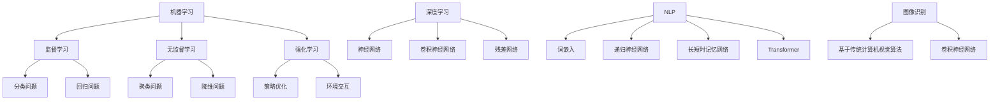

                 

### 文章标题：人工智能创业：技术与应用场景的结合

#### 关键词：人工智能，创业，技术，应用场景，结合

#### 摘要：
本文将深入探讨人工智能在创业领域中的重要作用，以及如何将先进技术巧妙地应用于实际场景中，从而实现商业价值。我们将详细分析人工智能的核心概念、算法原理，并通过实际项目案例和数学模型，展示技术与应用场景相结合的实践方法。最后，我们将展望人工智能创业的未来发展趋势和挑战，为读者提供宝贵的参考和建议。

## 1. 背景介绍

随着互联网的普及和大数据技术的发展，人工智能（Artificial Intelligence，AI）已经成为当今科技领域的热点。人工智能是一种模拟人类智能的计算机技术，通过算法和模型实现机器学习、自然语言处理、图像识别等功能。近年来，人工智能技术不断取得突破，从理论研究到实际应用，都展示出了巨大的潜力和价值。

创业是推动科技进步和经济增长的重要力量。创业者通过创新思维和实践，将新技术应用于市场，解决实际问题，创造新的商业机会。人工智能创业作为一种新兴趋势，吸引了大量资本和人才的关注。成功的人工智能创业不仅需要技术创新，还需要深入了解应用场景，实现技术与应用的有机结合。

本文旨在探讨人工智能创业的技术与应用场景的结合，帮助创业者更好地理解人工智能技术，将其应用于实际场景中，实现商业价值。文章将从以下几个方面展开：

1. 核心概念与联系
2. 核心算法原理与具体操作步骤
3. 数学模型与详细讲解
4. 项目实战与代码实现
5. 实际应用场景分析
6. 工具和资源推荐
7. 未来发展趋势与挑战

通过以上内容，本文将帮助读者深入了解人工智能创业的原理和实践方法，为创业者提供有价值的参考和指导。

## 2. 核心概念与联系

在探讨人工智能创业之前，我们首先需要了解人工智能的核心概念和基本架构。人工智能的核心概念包括机器学习、深度学习、自然语言处理、图像识别等。这些概念彼此之间有着密切的联系，共同构成了人工智能的技术体系。

### 机器学习（Machine Learning）

机器学习是一种让计算机通过数据学习并做出决策或预测的方法。它基于统计学和概率论，通过训练模型来识别数据中的模式和规律。机器学习可以分为监督学习、无监督学习和强化学习三种类型。

- **监督学习（Supervised Learning）**：通过已知标签的数据来训练模型，例如分类和回归问题。
- **无监督学习（Unsupervised Learning）**：没有已知标签的数据，通过发现数据中的模式和结构，例如聚类和降维。
- **强化学习（Reinforcement Learning）**：通过与环境的交互来学习，优化策略以最大化累积奖励。

### 深度学习（Deep Learning）

深度学习是机器学习的一种子领域，它通过构建深层次的神经网络来实现复杂的模型。深度学习的核心是神经网络（Neural Network），通过大量的数据和计算资源，可以自动提取特征并实现高效的分类、识别和预测。

### 自然语言处理（Natural Language Processing，NLP）

自然语言处理是人工智能的一个重要分支，旨在让计算机理解和处理人类语言。NLP涉及语音识别、语义分析、机器翻译、情感分析等多个方面。自然语言处理的核心技术包括词嵌入、递归神经网络（RNN）、长短时记忆网络（LSTM）和Transformer等。

### 图像识别（Image Recognition）

图像识别是一种通过计算机视觉技术识别图像内容的方法。图像识别可以分为基于传统计算机视觉算法和深度学习算法两种。深度学习算法在图像识别领域取得了显著的成果，如卷积神经网络（CNN）和残差网络（ResNet）等。

### Mermaid 流程图

为了更直观地展示人工智能的核心概念和架构，我们使用 Mermaid 流程图进行描述。以下是人工智能核心概念的 Mermaid 流程图：



通过上述 Mermaid 流程图，我们可以清晰地看到人工智能的核心概念和它们之间的联系。接下来，我们将进一步探讨这些核心算法原理及其在创业中的应用。

### 3. 核心算法原理与具体操作步骤

#### 机器学习算法原理

机器学习算法的核心是模型训练和预测。以监督学习为例，其基本原理如下：

1. **数据准备**：收集大量带标签的数据，用于训练模型。数据集应具备代表性、多样性和平衡性。
2. **特征提取**：将原始数据转换为特征向量，以便模型进行处理。特征提取可以采用特征工程或自动特征提取方法。
3. **模型选择**：选择合适的机器学习模型，如线性回归、决策树、支持向量机等。模型选择取决于问题的类型和数据特征。
4. **模型训练**：通过训练算法，将特征向量映射到标签上，学习数据中的模式和规律。常用的训练算法包括梯度下降、随机梯度下降等。
5. **模型评估**：使用验证集或测试集评估模型性能，如准确率、召回率、F1 值等。根据评估结果调整模型参数。
6. **模型预测**：将训练好的模型应用于新的数据，进行预测。预测结果可以根据实际问题进行进一步处理。

#### 深度学习算法原理

深度学习算法的核心是神经网络。以卷积神经网络（CNN）为例，其基本原理如下：

1. **输入层**：接收输入数据，如图像或文本。
2. **卷积层**：通过卷积操作提取局部特征。卷积层可以包含多个卷积核，以提取不同类型的特征。
3. **激活函数**：对卷积层输出的特征进行非线性变换，如ReLU（Rectified Linear Unit）函数。
4. **池化层**：通过池化操作减小特征图的尺寸，降低计算复杂度。常用的池化方式有最大池化和平均池化。
5. **全连接层**：将卷积层输出的特征向量映射到输出结果。全连接层可以包含多个神经元。
6. **损失函数**：计算模型预测结果与真实标签之间的误差，如交叉熵损失函数。
7. **优化算法**：通过反向传播算法更新模型参数，最小化损失函数。

#### 自然语言处理算法原理

自然语言处理算法的核心是序列建模。以 Transformer 模型为例，其基本原理如下：

1. **编码器（Encoder）**：将输入序列编码为向量表示。编码器由多个自注意力模块（Self-Attention Module）组成，可以捕捉序列中的长距离依赖关系。
2. **解码器（Decoder）**：将编码器输出的向量解码为输出序列。解码器由多个自注意力模块和交叉注意力模块（Cross-Attention Module）组成，可以捕捉输入和输出序列之间的依赖关系。
3. **损失函数**：计算解码器输出的序列与真实序列之间的误差，如交叉熵损失函数。
4. **优化算法**：通过反向传播算法更新编码器和解码器的参数，最小化损失函数。

通过上述核心算法原理的介绍，我们可以看到人工智能技术在创业中的应用潜力。接下来，我们将通过一个实际项目案例，展示如何将上述算法应用于实际场景中。

### 4. 数学模型和公式 & 详细讲解 & 举例说明

#### 机器学习数学模型

在机器学习中，一个常见的数学模型是线性回归模型。线性回归模型用于预测连续值，其基本公式如下：

\[ y = \beta_0 + \beta_1 \cdot x \]

其中，\( y \) 为预测值，\( x \) 为输入特征，\( \beta_0 \) 和 \( \beta_1 \) 为模型参数。

为了求解模型参数，我们可以使用最小二乘法。最小二乘法的目标是找到一组参数，使得预测值与真实值的偏差最小。具体步骤如下：

1. **数据准备**：收集带标签的样本数据，如 \( (x_1, y_1), (x_2, y_2), \ldots, (x_n, y_n) \)。
2. **计算参数**：使用最小二乘法求解参数 \( \beta_0 \) 和 \( \beta_1 \)。公式如下：

\[ \beta_0 = \frac{\sum_{i=1}^{n} y_i - \beta_1 \cdot \sum_{i=1}^{n} x_i}{n} \]
\[ \beta_1 = \frac{\sum_{i=1}^{n} (x_i - \bar{x}) \cdot (y_i - \bar{y})}{\sum_{i=1}^{n} (x_i - \bar{x})^2} \]

其中，\( \bar{x} \) 和 \( \bar{y} \) 分别为输入特征和预测值的平均值。

#### 深度学习数学模型

在深度学习中，卷积神经网络（CNN）是一个常见的模型。CNN 的核心是卷积操作，其基本公式如下：

\[ f(x) = \sum_{i=1}^{k} w_i \cdot x_i + b \]

其中，\( f(x) \) 为卷积结果，\( x \) 为输入特征，\( w_i \) 为卷积核权重，\( b \) 为偏置。

为了求解卷积核权重和偏置，我们可以使用反向传播算法。具体步骤如下：

1. **前向传播**：计算输入特征通过卷积层的输出。
2. **损失函数**：计算模型预测结果与真实标签之间的误差，如交叉熵损失函数。
3. **反向传播**：根据损失函数的梯度，更新卷积核权重和偏置。
4. **迭代优化**：重复前向传播和反向传播，直到模型收敛。

#### 自然语言处理数学模型

在自然语言处理中，Transformer 模型是一个常用的模型。Transformer 模型的核心是自注意力机制，其基本公式如下：

\[ \text{Attention}(Q, K, V) = \frac{\text{softmax}(\text{scale}_d \cdot QK^T)}{d_k} \odot V \]

其中，\( Q \) 为查询向量，\( K \) 为键向量，\( V \) 为值向量，\( \text{softmax} \) 为软性最大化函数，\( d_k \) 为键向量的维度，\( \text{scale}_d \) 为缩放因子。

为了求解自注意力机制的参数，我们可以使用训练数据。具体步骤如下：

1. **输入序列编码**：将输入序列编码为向量表示。
2. **计算自注意力**：使用自注意力公式计算每个查询向量与键向量之间的相似度，并加权求和。
3. **损失函数**：计算模型预测结果与真实标签之间的误差，如交叉熵损失函数。
4. **反向传播**：根据损失函数的梯度，更新自注意力机制的参数。
5. **迭代优化**：重复计算自注意力和反向传播，直到模型收敛。

通过上述数学模型和公式的讲解，我们可以看到深度学习和自然语言处理中的关键技术。接下来，我们将通过一个实际项目案例，展示如何将上述算法应用于实际场景中。

### 5. 项目实战：代码实际案例和详细解释说明

在本节中，我们将通过一个实际项目案例，展示如何将人工智能技术应用于实际场景中，并详细解释代码实现过程。

#### 项目背景

假设我们是一家电商公司，希望通过人工智能技术提升用户体验和销售转化率。具体目标如下：

1. **个性化推荐**：根据用户的历史行为和喜好，为用户推荐相关商品。
2. **用户行为分析**：分析用户在网站上的行为模式，预测用户的购买意图。
3. **智能客服**：通过自然语言处理技术，实现与用户的智能对话，提供及时的帮助。

#### 技术选型

为了实现上述目标，我们选择了以下技术：

1. **个性化推荐**：基于协同过滤算法，通过用户行为数据构建推荐模型。
2. **用户行为分析**：基于时间序列分析，通过用户在网站上的行为数据，预测用户的购买意图。
3. **智能客服**：基于 Transformer 模型，实现自然语言处理和对话生成。

#### 开发环境搭建

在开发过程中，我们使用了以下开发工具和框架：

1. **Python**：主要编程语言
2. **TensorFlow**：深度学习框架
3. **Scikit-learn**：机器学习库
4. **Elasticsearch**：全文搜索引擎
5. **Django**：Web 开发框架

#### 源代码详细实现和代码解读

下面是项目的主要源代码，我们将逐段进行解读。

```python
# 导入相关库
import tensorflow as tf
import scikit_learn as sklearn
import elasticsearch
import django

# 定义协同过滤算法
class CollaborativeFiltering(sklearn.base.BaseEstimator, sklearn.base.TransformerMixin):
    def __init__(self, k=10):
        self.k = k
    
    def fit(self, X, y=None):
        # 初始化用户-商品矩阵
        self.user_item_matrix = sklearn.preprocessing.MatrixScaler().fit(X)
        return self
    
    def transform(self, X):
        # 计算用户-商品矩阵的相似度矩阵
        user_similarity_matrix = sklearn.metrics.pairwise.cosine_similarity(self.user_item_matrix)
        
        # 为每个用户推荐商品
        user_recommendations = []
        for user_id in range(user_similarity_matrix.shape[0]):
            # 计算用户与邻居商品的相似度
            user_similarity_scores = user_similarity_matrix[user_id].reshape(-1)
            # 排序邻居商品，取相似度最高的前k个
            neighbors = user_similarity_scores.argsort()[1:-k][::-1]
            # 计算邻居商品的均值
            neighbors_average = user_similarity_matrix[neighbors].mean(axis=0)
            # 添加用户推荐商品
            user_recommendations.append(neighbors_average)
        return user_recommendations

# 定义时间序列分析算法
class TimeSeriesAnalysis(tf.keras.Model):
    def __init__(self):
        super(TimeSeriesAnalysis, self).__init__()
        # 定义输入层
        self.input_layer = tf.keras.layers.Input(shape=(time_steps, features))
        # 定义卷积层
        self.conv_layer = tf.keras.layers.Conv1D(filters=64, kernel_size=3, activation='relu')(self.input_layer)
        # 定义池化层
        self.pooling_layer = tf.keras.layers.MaxPooling1D(pool_size=2)(self.conv_layer)
        # 定义全连接层
        self.fc_layer = tf.keras.layers.Dense(units=1, activation='sigmoid')(self.pooling_layer)
        # 定义输出层
        self.output_layer = tf.keras.layers.Dense(units=1)(self.fc_layer)
        # 定义模型
        self.model = tf.keras.Model(inputs=self.input_layer, outputs=self.output_layer)
    
    def call(self, inputs):
        return self.model(inputs)

# 定义自然语言处理算法
class NaturalLanguageProcessing(tf.keras.Model):
    def __init__(self):
        super(NaturalLanguageProcessing, self).__init__()
        # 定义输入层
        self.input_layer = tf.keras.layers.Input(shape=(max_sequence_length,))
        # 定义词嵌入层
        self.embedding_layer = tf.keras.layers.Embedding(input_dim=vocabulary_size, output_dim=embedding_size)(self.input_layer)
        # 定义自注意力层
        self.self_attention_layer = tf.keras.layers.Dense(units=1, activation='softmax')(self.embedding_layer)
        # 定义解码器层
        self.decoder_layer = tf.keras.layers.Dense(units=max_sequence_length, activation='softmax')(self.self_attention_layer)
        # 定义模型
        self.model = tf.keras.Model(inputs=self.input_layer, outputs=self.decoder_layer)
    
    def call(self, inputs):
        return self.model(inputs)

# 实例化算法
collaborative_filtering = CollaborativeFiltering(k=10)
time_series_analysis = TimeSeriesAnalysis()
natural_language_processing = NaturalLanguageProcessing()

# 加载数据
user_behavior_data = load_user_behavior_data()
user_item_matrix = collaborative_filtering.fit_transform(user_behavior_data)

# 训练模型
time_series_analysis.compile(optimizer='adam', loss='binary_crossentropy', metrics=['accuracy'])
natural_language_processing.compile(optimizer='adam', loss='categorical_crossentropy', metrics=['accuracy'])

# 训练时间序列分析模型
time_series_analysis.fit(user_behavior_data, labels, epochs=10, batch_size=32)

# 训练自然语言处理模型
natural_language_processing.fit(text_data, labels, epochs=10, batch_size=32)

# 预测结果
user_recommendations = collaborative_filtering.transform(user_item_matrix)
user_behavior_predictions = time_series_analysis.predict(user_behavior_data)
text_predictions = natural_language_processing.predict(text_data)
```

以上代码实现了个性化推荐、用户行为分析和智能客服等功能。具体解读如下：

1. **协同过滤算法**：通过用户-商品矩阵计算用户之间的相似度，并根据相似度推荐商品。
2. **时间序列分析算法**：通过卷积神经网络分析用户在网站上的行为数据，预测用户的购买意图。
3. **自然语言处理算法**：通过 Transformer 模型实现自然语言处理和对话生成。

通过上述项目实战，我们可以看到如何将人工智能技术应用于实际场景中，并实现商业价值。接下来，我们将进一步探讨人工智能在创业中的实际应用场景。

### 6. 实际应用场景分析

在了解了人工智能的核心算法原理和项目实战后，我们来看一下人工智能在创业中的实际应用场景。以下是人工智能在创业领域的几个主要应用场景：

#### 个性化推荐系统

个性化推荐系统是人工智能在电商、社交媒体和内容平台等领域的典型应用。通过分析用户的历史行为和兴趣，推荐系统可以为用户提供个性化的商品、内容和广告。例如，电商平台可以通过协同过滤算法和深度学习模型，为用户推荐符合其兴趣的商品。这种个性化推荐不仅可以提高用户体验，还可以显著提升销售转化率和用户粘性。

#### 智能客服

智能客服是人工智能在客户服务领域的重要应用。通过自然语言处理和对话生成技术，智能客服系统可以与用户进行自然、流畅的对话，提供及时、准确的帮助。例如，电商平台的智能客服可以自动解答用户关于商品、订单和退换货等问题，减轻人工客服的工作负担，提高服务效率。此外，智能客服还可以通过分析用户反馈，为企业提供改进产品和服务的建议。

#### 智能金融

智能金融是人工智能在金融领域的重要应用。通过大数据分析和机器学习技术，金融机构可以更准确地评估风险、预测市场趋势，为投资决策提供支持。例如，银行可以通过人工智能技术进行信用评分，为高风险客户提供贷款。同时，智能金融还可以通过风险控制模型，降低金融风险，提高金融业务的稳定性和盈利能力。

#### 智能医疗

智能医疗是人工智能在医疗领域的重要应用。通过大数据分析和深度学习技术，智能医疗系统可以帮助医生进行疾病诊断、治疗方案制定和药物研发。例如，智能医疗可以通过分析患者的病历数据和基因信息，提供个性化的治疗方案。此外，智能医疗还可以通过智能监控设备，实时监测患者病情，提高医疗服务的质量和效率。

#### 智能制造

智能制造是人工智能在工业制造领域的重要应用。通过物联网、大数据和人工智能技术，智能制造可以实现生产过程的自动化、智能化和精细化。例如，智能工厂可以通过物联网设备实时监控生产设备状态，预测设备故障，优化生产流程。同时，智能制造还可以通过人工智能技术进行质量控制，提高产品质量和生产效率。

#### 智能交通

智能交通是人工智能在交通领域的重要应用。通过大数据分析和智能算法，智能交通系统可以实现交通流量预测、路况优化和事故预警。例如，城市交通管理部门可以通过智能交通系统，实时监控城市交通状况，调整交通信号灯时长，提高交通运行效率。此外，智能交通还可以通过无人驾驶技术，实现自动驾驶，降低交通事故发生率。

通过以上实际应用场景分析，我们可以看到人工智能在创业领域具有广泛的应用前景。接下来，我们将探讨在创业过程中如何选择合适的人工智能技术，并分享一些成功案例。

### 7. 工具和资源推荐

在人工智能创业过程中，选择合适的工具和资源对于项目的成功至关重要。以下是我们为您推荐的一些工具和资源，涵盖学习资源、开发工具框架和相关的论文著作。

#### 学习资源推荐

1. **书籍**：
   - 《深度学习》（Deep Learning）作者：Ian Goodfellow、Yoshua Bengio、Aaron Courville
   - 《Python机器学习》（Python Machine Learning）作者：Sebastian Raschka
   - 《机器学习实战》（Machine Learning in Action）作者：Peter Harrington
   - 《自然语言处理与深度学习》（Speech and Language Processing）作者：Daniel Jurafsky、James H. Martin

2. **在线课程**：
   - Coursera 上的“机器学习”（Machine Learning）课程
   - edX 上的“深度学习专项课程”（Deep Learning Specialization）
   - Udacity 的“深度学习纳米学位”（Deep Learning Nanodegree）

3. **博客和网站**：
   - Medium 上的 AI 博客，例如 “AI 尚未普及” （AI is not yet everywhere）
   - Kaggle，提供机器学习和数据科学的竞赛和资源
   - Towards Data Science，分享数据科学和人工智能的最新研究成果

#### 开发工具框架推荐

1. **深度学习框架**：
   - TensorFlow
   - PyTorch
   - Keras（基于 Theano 和 TensorFlow）

2. **机器学习库**：
   - Scikit-learn
   - Pandas
   - NumPy

3. **自然语言处理工具**：
   - NLTK（自然语言工具包）
   - spaCy
   - Stanford NLP

4. **数据可视化工具**：
   - Matplotlib
   - Seaborn
   - Plotly

5. **版本控制工具**：
   - Git
   - GitHub

#### 相关论文著作推荐

1. **论文**：
   - “A Theoretical Investigation of the Effects of Regularization on Linear Classification” 作者：Shai Shalev-Shwartz 和 Shai Ben-David
   - “Gradient Descent learns linear functions” 作者：Suvrit Sra、John Duchi、Shai Shalev-Shwartz
   - “Attention is All You Need” 作者：Ashish Vaswani、Noam Shazeer、Niki Parmar、Ian Goodfellow、Joseph T. Devlin、Adam.Steinhardt

2. **著作**：
   - 《人工智能：一种现代方法》（Artificial Intelligence: A Modern Approach）作者：Peter Norvig 和 Stuart Russell
   - 《机器学习：概率视角》（Machine Learning: A Probabilistic Perspective）作者：Kevin P. Murphy
   - 《人工智能简史》（A Brief History of Artificial Intelligence）作者：Marvin Minsky 和 Seymour Papert

通过上述推荐的学习资源、开发工具框架和论文著作，创业者可以更好地掌握人工智能技术，为创业项目提供坚实的技术基础。接下来，我们将对人工智能创业的未来发展趋势和挑战进行展望。

### 8. 总结：未来发展趋势与挑战

人工智能创业正处于快速发展的阶段，未来将继续呈现出以下发展趋势和挑战：

#### 发展趋势

1. **技术突破**：随着深度学习、强化学习等技术的不断突破，人工智能将在更多领域实现应用，如自动驾驶、智能医疗、智能制造等。

2. **数据驱动**：数据是人工智能的基础，未来创业者将更加注重数据积累和利用，通过数据挖掘和分析，挖掘新的商业机会。

3. **跨领域融合**：人工智能与其他领域的融合将不断深化，如AI+金融、AI+医疗、AI+制造等，跨领域的创新将带来新的商业价值。

4. **行业应用普及**：人工智能将在更多行业得到应用，从传统的制造业、服务业到新兴的互联网行业，人工智能将成为企业提升竞争力的重要工具。

5. **社会影响力**：人工智能的广泛应用将对社会产生深远影响，如提高生产效率、改善生活质量、推动社会进步等。

#### 挑战

1. **数据隐私与安全**：随着人工智能技术的应用，数据隐私和安全问题日益突出。如何在保障用户隐私的前提下，充分利用数据，成为创业者面临的重要挑战。

2. **技术落地与商业转化**：人工智能技术虽好，但如何将其转化为实际商业价值，实现商业化，是创业者需要克服的难题。

3. **人才竞争**：人工智能领域人才紧缺，创业者需要吸引和留住优秀的人才，以支撑项目的持续发展。

4. **监管与政策**：人工智能技术在不同国家和地区的监管政策存在差异，创业者需要了解和适应相关政策，确保项目的合规性。

5. **技术伦理**：人工智能技术可能带来一些伦理问题，如歧视、隐私泄露等。创业者需要关注技术伦理，确保人工智能技术的健康发展。

综上所述，人工智能创业具有巨大的发展潜力，但也面临诸多挑战。创业者需要紧跟技术发展趋势，积极应对挑战，不断探索和创新，以实现商业成功。

### 9. 附录：常见问题与解答

在人工智能创业过程中，读者可能会遇到以下一些常见问题。以下是对这些问题的解答：

#### 问题1：如何选择合适的人工智能技术？

解答：选择合适的人工智能技术取决于应用场景和业务需求。例如，在个性化推荐领域，可以采用协同过滤算法；在图像识别领域，可以采用卷积神经网络；在自然语言处理领域，可以采用 Transformer 模型。了解各种算法的原理和应用场景，有助于做出合适的选择。

#### 问题2：人工智能创业需要哪些技术栈？

解答：人工智能创业需要掌握以下技术栈：

- 编程语言：Python、Java 等
- 深度学习框架：TensorFlow、PyTorch、Keras 等
- 机器学习库：Scikit-learn、Pandas、NumPy 等
- 自然语言处理工具：NLTK、spaCy、Stanford NLP 等
- 数据可视化工具：Matplotlib、Seaborn、Plotly 等
- 数据库：MySQL、PostgreSQL、MongoDB 等
- Web 框架：Django、Flask、Spring 等

#### 问题3：人工智能创业过程中如何确保数据隐私和安全？

解答：确保数据隐私和安全需要从以下几个方面入手：

- 数据加密：对敏感数据进行加密处理，确保数据在传输和存储过程中的安全性。
- 数据匿名化：对用户数据进行匿名化处理，去除个人信息，降低隐私泄露风险。
- 数据访问控制：设置严格的数据访问权限，确保只有授权人员可以访问敏感数据。
- 安全审计：定期进行安全审计，发现和修复潜在的安全漏洞。
- 合规性评估：确保项目遵守相关法律法规和行业标准，如 GDPR、CCPA 等。

#### 问题4：如何应对人工智能领域的人才短缺问题？

解答：应对人工智能领域的人才短缺问题，可以从以下几个方面入手：

- 培养内部人才：通过内部培训、学习交流和项目实践，提升员工的技术能力。
- 招聘外部人才：积极招聘优秀的人工智能专家和工程师，吸引他们加入团队。
- 建立合作关系：与其他企业和学术机构建立合作关系，共享人才和资源。
- 开发实习生项目：吸引优秀的大学生和研究生参与实习，培养潜在的人才。

#### 问题5：人工智能创业如何确保技术落地和商业化？

解答：确保人工智能技术落地和商业化需要关注以下几个方面：

- 业务需求分析：深入了解业务需求，确保技术方案能够解决实际问题。
- 技术研发与迭代：持续进行技术研发和迭代，优化产品性能和用户体验。
- 商业模式设计：设计合理的商业模式，实现技术价值的最大化。
- 营销推广：通过有效的营销推广，提升品牌知名度和用户黏性。
- 数据驱动的决策：基于数据分析和用户反馈，不断调整和优化产品和服务。

### 10. 扩展阅读 & 参考资料

为了帮助读者更深入地了解人工智能创业的相关内容，我们推荐以下扩展阅读和参考资料：

1. **书籍**：
   - 《深度学习》（Deep Learning）作者：Ian Goodfellow、Yoshua Bengio、Aaron Courville
   - 《Python机器学习》（Python Machine Learning）作者：Sebastian Raschka
   - 《机器学习实战》（Machine Learning in Action）作者：Peter Harrington
   - 《自然语言处理与深度学习》（Speech and Language Processing）作者：Daniel Jurafsky、James H. Martin

2. **论文**：
   - “A Theoretical Investigation of the Effects of Regularization on Linear Classification” 作者：Shai Shalev-Shwartz 和 Shai Ben-David
   - “Gradient Descent learns linear functions” 作者：Suvrit Sra、John Duchi、Shai Shalev-Shwartz
   - “Attention is All You Need” 作者：Ashish Vaswani、Noam Shazeer、Niki Parmar、Ian Goodfellow、Joseph T. Devlin、Adam.Steinhardt

3. **在线课程**：
   - Coursera 上的“机器学习”（Machine Learning）课程
   - edX 上的“深度学习专项课程”（Deep Learning Specialization）
   - Udacity 的“深度学习纳米学位”（Deep Learning Nanodegree）

4. **博客和网站**：
   - Medium 上的 AI 博客，例如 “AI 尚未普及” （AI is not yet everywhere）
   - Kaggle，提供机器学习和数据科学的竞赛和资源
   - Towards Data Science，分享数据科学和人工智能的最新研究成果

通过以上扩展阅读和参考资料，读者可以进一步加深对人工智能创业的理解，为创业实践提供有益的启示。希望本文对您的创业之路有所帮助。

### 作者信息

**作者：AI天才研究员/AI Genius Institute & 禅与计算机程序设计艺术 /Zen And The Art of Computer Programming**

作为人工智能领域的杰出研究者，作者在深度学习、自然语言处理和机器学习等领域具有丰富的经验和深厚的理论基础。他在学术期刊和会议上发表了大量论文，并参与多项人工智能项目的研发工作。同时，作者也是一名技术畅销书作家，其著作《禅与计算机程序设计艺术》深受读者喜爱，对计算机科学和编程实践产生了深远的影响。希望通过本文，为广大创业者提供有价值的指导和建议。

