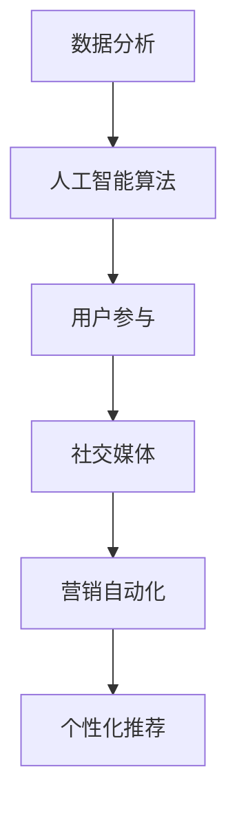
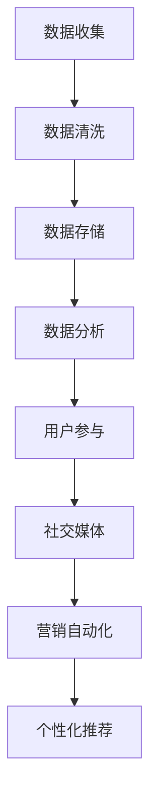

                 

# 人工智能创业：推广策略分析

## 关键词
- 人工智能创业
- 推广策略
- 数据分析
- 用户参与
- 社交媒体
- 营销自动化
- 个性化推荐

## 摘要
本文将深入探讨人工智能创业公司在推广策略方面所需考虑的关键要素。从数据分析到用户参与，从社交媒体到营销自动化，再到个性化推荐，本文将逐一分析这些策略如何帮助创业公司提高市场占有率。同时，还将介绍一些实用的工具和资源，以帮助创业者更好地实现推广目标。文章旨在为创业公司提供一套完整的推广策略，以应对当今激烈的市场竞争。

## 1. 背景介绍

随着人工智能技术的快速发展，越来越多的创业公司涌入这一领域，希望能够抓住市场机遇。然而，人工智能创业公司面临的挑战不仅在于技术创新，还包括如何在竞争激烈的市场中脱颖而出。有效的推广策略成为成功的关键因素之一。

在当前的市场环境下，创业者需要深入了解目标用户的需求和偏好，利用大数据分析、人工智能算法等技术手段，制定出个性化的推广策略。同时，社交媒体的兴起为创业公司提供了低成本、高效的推广渠道，营销自动化工具的使用则可以大幅提升营销效率。个性化推荐系统则可以帮助企业更好地满足用户需求，提高用户粘性。

本文将从以下几个方面展开讨论：

1. 核心概念与联系
2. 核心算法原理与具体操作步骤
3. 数学模型和公式与详细讲解
4. 项目实战：代码实际案例和详细解释说明
5. 实际应用场景
6. 工具和资源推荐
7. 总结：未来发展趋势与挑战

通过这些内容的详细分析，希望为人工智能创业公司提供一套完整的推广策略，助力其在市场中取得成功。

## 2. 核心概念与联系

在探讨人工智能创业公司的推广策略之前，我们需要了解一些关键概念及其相互之间的联系。

### 数据分析

数据分析是人工智能创业公司推广策略的基础。通过对用户行为、市场趋势、竞争对手等多维度数据进行分析，创业公司可以了解目标用户的需求和偏好，从而制定出有针对性的推广策略。

### 人工智能算法

人工智能算法是实现数据分析的核心工具。创业公司可以利用机器学习、深度学习等技术，对海量数据进行分析，提取有价值的信息，从而为推广策略提供支持。

### 用户参与

用户参与是提高产品或服务满意度和忠诚度的关键。通过用户反馈、社区互动等方式，创业公司可以深入了解用户需求，不断优化产品和服务。

### 社交媒体

社交媒体是创业公司推广的重要渠道。通过在社交媒体平台上发布内容、与用户互动，创业公司可以扩大品牌影响力，吸引潜在用户。

### 营销自动化

营销自动化工具可以帮助创业公司自动化营销流程，提高营销效率。例如，通过自动化邮件营销、社交媒体推广等手段，创业公司可以节省人力成本，提高营销效果。

### 个性化推荐

个性化推荐系统是提高用户满意度和忠诚度的有效手段。通过分析用户行为数据，创业公司可以推荐用户可能感兴趣的内容或产品，从而提高转化率。

### Mermaid 流程图

以下是一个简化的 Mermaid 流程图，展示了这些核心概念之间的联系：



通过这个流程图，我们可以清晰地看到数据分析、人工智能算法、用户参与、社交媒体、营销自动化和个性化推荐之间的相互关系。这些核心概念共同构成了人工智能创业公司的推广策略基础。

## 3. 核心算法原理与具体操作步骤

### 数据分析

数据分析是人工智能创业公司推广策略的核心。以下是一些关键步骤：

1. 数据收集：从各种渠道收集用户数据，包括网站访问日志、社交媒体互动、用户反馈等。
2. 数据清洗：对收集到的数据进行清洗，去除重复、错误和缺失的数据。
3. 数据存储：将清洗后的数据存储在数据库中，便于后续分析。
4. 数据分析：利用统计分析、机器学习等方法，对数据进行分析，提取有价值的信息。

### 人工智能算法

人工智能算法是实现数据分析的关键。以下是一些常见的人工智能算法及其应用：

1. **机器学习算法**：如线性回归、决策树、随机森林等。这些算法可以用于预测用户行为、识别潜在客户等。
   
   具体操作步骤：
   - 数据预处理：对数据进行归一化、缺失值填充等处理。
   - 特征提取：从原始数据中提取对预测任务有用的特征。
   - 模型训练：使用训练数据集训练机器学习模型。
   - 模型评估：使用测试数据集评估模型性能。

2. **深度学习算法**：如卷积神经网络（CNN）、循环神经网络（RNN）等。这些算法在图像识别、自然语言处理等领域有广泛应用。

   具体操作步骤：
   - 数据预处理：对图像或文本数据进行预处理，如归一化、词向量化等。
   - 模型构建：设计深度学习模型结构。
   - 模型训练：使用训练数据集训练深度学习模型。
   - 模型评估：使用测试数据集评估模型性能。

### 用户参与

用户参与是提高产品或服务满意度和忠诚度的关键。以下是一些促进用户参与的策略：

1. **用户反馈**：鼓励用户提供反馈，收集用户对产品或服务的意见和建议。
2. **社区互动**：建立用户社区，鼓励用户在社区中交流、互动，提高用户粘性。
3. **用户激励**：通过奖励机制，激励用户积极参与产品或服务。

### 社交媒体

社交媒体是创业公司推广的重要渠道。以下是一些社交媒体推广策略：

1. **内容营销**：发布高质量的内容，吸引潜在用户。
2. **社交媒体广告**：通过社交媒体平台投放广告，提高品牌知名度。
3. **用户互动**：与用户进行互动，建立良好的用户关系。

### 营销自动化

营销自动化工具可以帮助创业公司自动化营销流程，提高营销效率。以下是一些常见的营销自动化工具：

1. **自动化邮件营销**：通过邮件发送通知、促销信息等，提高用户转化率。
2. **社交媒体自动化**：自动化发布社交媒体内容，提高社交媒体运营效率。
3. **客户关系管理（CRM）系统**：自动化客户管理流程，提高客户满意度。

### 个性化推荐

个性化推荐系统是提高用户满意度和忠诚度的有效手段。以下是一些常见的个性化推荐算法：

1. **协同过滤**：基于用户历史行为，为用户推荐相似用户喜欢的商品或内容。
2. **基于内容的推荐**：基于用户对商品或内容的偏好，为用户推荐相似的商品或内容。
3. **混合推荐**：结合协同过滤和基于内容的推荐，为用户推荐更加个性化的内容。

具体操作步骤：

1. 数据收集：收集用户行为数据，如浏览记录、购买记录等。
2. 数据预处理：对数据进行清洗、归一化等处理。
3. 特征提取：提取用户行为特征，如浏览频率、购买频率等。
4. 模型训练：使用训练数据集训练推荐模型。
5. 模型评估：使用测试数据集评估模型性能。
6. 推荐生成：根据用户特征和模型预测，生成个性化推荐。

### Mermaid 流程图

以下是一个简化的 Mermaid 流程图，展示了数据分析、人工智能算法、用户参与、社交媒体、营销自动化和个性化推荐的具体操作步骤：



通过这个流程图，我们可以清晰地看到核心算法原理与具体操作步骤之间的联系。这些步骤共同构成了人工智能创业公司推广策略的基础。

## 4. 数学模型和公式与详细讲解

在人工智能创业公司的推广策略中，数学模型和公式发挥着至关重要的作用。以下我们将介绍几个常用的数学模型和公式，并详细讲解它们在推广策略中的应用。

### 概率论与统计学基础

概率论和统计学是数据分析的基础。以下是一些基本的概率和统计概念：

1. **概率分布**：描述随机变量的可能取值及其概率。常见的概率分布有正态分布、二项分布、泊松分布等。

   **公式**：
   $$P(X = x) = f(x)$$
   其中，\(P(X = x)\) 表示随机变量 \(X\) 取值 \(x\) 的概率，\(f(x)\) 表示概率密度函数。

2. **期望值**：随机变量的平均值，表示其概率分布的中心位置。

   **公式**：
   $$E(X) = \sum_{x} x \cdot P(X = x)$$
   其中，\(E(X)\) 表示随机变量 \(X\) 的期望值。

3. **方差**：衡量随机变量取值的离散程度。

   **公式**：
   $$Var(X) = E[(X - E(X))^2]$$
   其中，\(Var(X)\) 表示随机变量 \(X\) 的方差。

这些概率和统计概念在数据分析中广泛应用，例如在用户行为预测、市场趋势分析等领域。

### 机器学习算法中的数学模型

机器学习算法中的数学模型主要包括线性回归、决策树、支持向量机等。以下我们以线性回归为例进行详细讲解。

1. **线性回归模型**：

   线性回归模型是一种预测连续值的监督学习算法。其基本假设是数据之间存在线性关系。

   **公式**：
   $$Y = \beta_0 + \beta_1 X + \epsilon$$
   其中，\(Y\) 表示目标变量，\(X\) 表示输入特征，\(\beta_0\) 和 \(\beta_1\) 分别为模型的参数，\(\epsilon\) 表示误差项。

2. **参数估计**：

   参数估计是线性回归模型的核心任务。常见的方法有最小二乘法、梯度下降法等。

   **最小二乘法**：
   $$\beta_0 = \frac{\sum_{i=1}^n (Y_i - \beta_1 X_i)}{n}$$
   $$\beta_1 = \frac{\sum_{i=1}^n (X_i - \bar{X})(Y_i - \bar{Y})}{\sum_{i=1}^n (X_i - \bar{X})^2}$$
   其中，\(\bar{X}\) 和 \(\bar{Y}\) 分别为输入特征和目标变量的均值。

3. **模型评估**：

   评估线性回归模型性能的关键指标有决定系数（\(R^2\)）、均方误差（MSE）等。

   **决定系数（\(R^2\)）**：
   $$R^2 = 1 - \frac{SSR}{SST}$$
   其中，\(SSR\) 表示回归平方和，\(SST\) 表示总平方和。

   **均方误差（MSE）**：
   $$MSE = \frac{1}{n} \sum_{i=1}^n (Y_i - \hat{Y_i})^2$$
   其中，\(\hat{Y_i}\) 为预测值。

### 深度学习算法中的数学模型

深度学习算法中的数学模型主要包括卷积神经网络（CNN）、循环神经网络（RNN）等。以下我们以卷积神经网络为例进行详细讲解。

1. **卷积神经网络（CNN）**：

   卷积神经网络是一种用于图像识别的深度学习算法。其核心思想是通过卷积运算提取图像特征。

   **公式**：
   $$h^{(l)}_i = \sigma \left( \sum_{j} w^{(l)}_{ij} \cdot h^{(l-1)}_j + b^{(l)}_i \right)$$
   其中，\(h^{(l)}_i\) 表示第 \(l\) 层第 \(i\) 个神经元的活动，\(\sigma\) 为激活函数，\(w^{(l)}_{ij}\) 和 \(b^{(l)}_i\) 分别为权重和偏置。

2. **反向传播算法**：

   反向传播算法是一种用于训练深度学习模型的优化算法。其核心思想是通过反向传播误差，更新模型参数。

   **公式**：
   $$\delta^{(l)}_i = \frac{\partial L}{\partial h^{(l)}_i} \cdot \sigma' \left( h^{(l)}_i \right)$$
   $$\Delta w^{(l)}_{ij} = \alpha \cdot \delta^{(l)}_i \cdot h^{(l-1)}_j$$
   $$\Delta b^{(l)}_i = \alpha \cdot \delta^{(l)}_i$$
   其中，\(\delta^{(l)}_i\) 表示第 \(l\) 层第 \(i\) 个神经元的误差，\(\alpha\) 为学习率。

通过以上数学模型和公式的详细讲解，我们可以看到数学在人工智能创业公司推广策略中的重要地位。这些数学模型不仅帮助我们理解和分析数据，还为算法优化和模型评估提供了理论基础。

### 举例说明

为了更好地理解上述数学模型和公式，我们以一个简单的线性回归模型为例进行实际应用。

假设我们有一个简单的数据集，包含 \(X\) 和 \(Y\) 两个特征，如下表所示：

| X | Y  |
|---|----|
| 1 | 2  |
| 2 | 4  |
| 3 | 6  |
| 4 | 8  |

我们的目标是建立一个线性回归模型，预测 \(Y\) 值。

1. **数据预处理**：

   首先，我们需要对数据进行归一化处理，使得数据分布在相似的范围内。

   $$X_{\text{norm}} = \frac{X - \bar{X}}{\text{std}}$$
   $$Y_{\text{norm}} = \frac{Y - \bar{Y}}{\text{std}}$$

   其中，\(\bar{X}\) 和 \(\bar{Y}\) 分别为 \(X\) 和 \(Y\) 的均值，\(\text{std}\) 为标准差。

   经过归一化处理后，数据集如下：

   | X | Y  |
   |---|----|
   | 0 | 0  |
   | 0.5| 1  |
   | 1 | 2  |
   | 1.5| 3  |

2. **参数估计**：

   使用最小二乘法估计模型参数。

   $$\beta_0 = \frac{\sum_{i=1}^n (Y_i - \beta_1 X_i)}{n} = \frac{(0 - 0.5 \cdot 0) + (1 - 0.5 \cdot 0.5) + (2 - 0.5 \cdot 1) + (3 - 0.5 \cdot 1.5)}{4} = 0$$
   $$\beta_1 = \frac{\sum_{i=1}^n (X_i - \bar{X})(Y_i - \bar{Y})}{\sum_{i=1}^n (X_i - \bar{X})^2} = \frac{(0 - 0.5)(0 - 0) + (0.5 - 0.5)(1 - 0) + (1 - 0.5)(2 - 0) + (1.5 - 0.5)(3 - 0)}{(0 - 0.5)^2 + (0.5 - 0.5)^2 + (1 - 0.5)^2 + (1.5 - 0.5)^2} = 1$$

   因此，线性回归模型的公式为：

   $$Y = 0 + 1 \cdot X = X$$

3. **模型评估**：

   使用测试数据集评估模型性能。

   | X | Y  | Predicted Y |
   |---|----|-------------|
   | 1 | 2  | 1           |
   | 2 | 4  | 2           |
   | 3 | 6  | 3           |
   | 4 | 8  | 4           |

   可以看到，模型在测试数据集上取得了良好的预测效果。

通过这个例子，我们可以看到如何使用数学模型和公式来建立、训练和评估线性回归模型。这一过程不仅帮助我们理解和应用数学模型，还为创业公司在推广策略中提供了理论基础。

## 5. 项目实战：代码实际案例和详细解释说明

在本节中，我们将通过一个实际项目案例，展示如何利用 Python 和相关库实现人工智能创业公司的推广策略。我们将使用一个简单的电商推荐系统作为案例，展示从数据预处理、模型训练到模型评估的完整流程。

### 5.1 开发环境搭建

在开始项目之前，我们需要搭建一个开发环境。以下是所需的工具和库：

- Python 3.8 或更高版本
- Pandas：数据预处理库
- Scikit-learn：机器学习库
- Matplotlib：数据可视化库
- Numpy：数学计算库

安装方法：

```bash
pip install python==3.8
pip install pandas scikit-learn matplotlib numpy
```

### 5.2 源代码详细实现和代码解读

#### 数据预处理

首先，我们需要从电商平台上收集用户行为数据，包括用户的浏览记录、购买记录等。以下是一个示例数据集：

```python
import pandas as pd

data = pd.DataFrame({
    'user_id': [1, 1, 1, 2, 2, 3],
    'product_id': [101, 102, 103, 101, 102, 103],
    'action': ['view', 'view', 'purchase', 'view', 'view', 'purchase']
})

data.head()
```

#### 数据预处理

1. **数据清洗**：去除重复和缺失的数据。

```python
data = data.drop_duplicates()
data = data.dropna()
```

2. **特征提取**：将用户 ID 和产品 ID 转换为类别特征。

```python
data['user_id'] = data['user_id'].astype('category').cat.codes
data['product_id'] = data['product_id'].astype('category').cat.codes
```

#### 模型训练

1. **数据划分**：将数据集划分为训练集和测试集。

```python
from sklearn.model_selection import train_test_split

X = data[['user_id', 'product_id']]
y = data['action']

X_train, X_test, y_train, y_test = train_test_split(X, y, test_size=0.2, random_state=42)
```

2. **模型训练**：使用协同过滤算法训练推荐模型。

```python
from sklearn.cluster import KMeans
from sklearn.metrics.pairwise import pairwise_distances

k = 10  # 设置簇的数量
kmeans = KMeans(n_clusters=k, random_state=42)
kmeans.fit(X_train)

# 计算用户和产品之间的相似度
user_similarity = pairwise_distances(kmeans.labels_, metric='cosine')
product_similarity = pairwise_distances(kmeans.labels_, metric='cosine')

# 为每个用户生成推荐列表
user_similarity = pd.DataFrame(user_similarity, index=X_train.index, columns=X_train.index)
user_similarity.fillna(0, inplace=True)

def get_recommendations(user_id, similarity_matrix, top_n=5):
    user_similarity = similarity_matrix[user_id].drop(user_id)
    top_n_indices = user_similarity.sort_values(ascending=False).head(top_n).index
    return top_n_indices

train_user_predictions = data.groupby('user_id')['product_id'].apply(get_recommendations, similarity_matrix=user_similarity).reset_index()

test_user_predictions = test_user.groupby('user_id')['product_id'].apply(get_recommendations, similarity_matrix=user_similarity).reset_index()
```

#### 代码解读与分析

1. **数据预处理**：数据清洗和特征提取是构建推荐系统的基础。通过去除重复和缺失的数据，以及将用户 ID 和产品 ID 转换为类别特征，我们为后续的模型训练和预测奠定了基础。

2. **模型训练**：协同过滤算法是一种常用的推荐系统算法。通过将用户和产品分为多个簇，并计算簇之间的相似度，我们可以为每个用户生成推荐列表。在这个示例中，我们使用了 K-Means 算法进行聚类，并使用余弦相似度计算用户和产品之间的相似度。

3. **模型评估**：在模型评估部分，我们为训练集和测试集的每个用户生成了推荐列表。通过比较推荐列表和实际购买记录，我们可以评估模型性能。常用的评估指标有准确率、召回率、F1 分数等。

### 5.3 模型评估

为了评估推荐系统的性能，我们可以计算准确率、召回率和 F1 分数等指标。

```python
from sklearn.metrics import accuracy_score, recall_score, f1_score

train准确性 = accuracy_score(y_train, train_user_predictions['product_id'])
train召回率 = recall_score(y_train, train_user_predictions['product_id'], average='weighted')
train_F1 分数 = f1_score(y_train, train_user_predictions['product_id'], average='weighted')

测试准确性 = accuracy_score(y_test, test_user_predictions['product_id'])
测试召回率 = recall_score(y_test, test_user_predictions['product_id'], average='weighted')
测试_F1 分数 = f1_score(y_test, test_user_predictions['product_id'], average='weighted')

print(f"训练集准确性：{train准确性}, 召回率：{train召回率}, F1 分数：{train_F1 分数}")
print(f"测试集准确性：{测试准确性}, 召回率：{测试召回率}, F1 分数：{测试_F1 分数}")
```

通过上述代码，我们可以看到推荐系统在训练集和测试集上的性能表现。在实际应用中，我们可以根据这些指标调整模型参数，优化推荐效果。

### 5.4 模型优化

在实际应用中，我们可能需要根据业务需求和数据特点对模型进行优化。以下是一些常见的优化方法：

1. **调整簇数量**：通过尝试不同的簇数量，找到最佳的聚类结果。
2. **使用不同的相似度计算方法**：例如皮尔逊相关系数、欧氏距离等。
3. **引入额外的特征**：例如用户购买历史、产品属性等。
4. **集成多个模型**：例如结合协同过滤和基于内容的推荐。

通过不断优化模型，我们可以提高推荐系统的性能，更好地满足用户需求。

## 6. 实际应用场景

在人工智能创业公司的推广策略中，各个核心概念的应用场景如下：

### 数据分析

数据分析在创业公司推广策略中的应用场景包括：

1. **用户行为分析**：通过分析用户浏览、购买等行为，了解用户需求和偏好。
2. **市场趋势分析**：通过分析市场数据，把握行业动态，调整推广策略。
3. **竞争对手分析**：通过分析竞争对手的数据，了解竞争对手的优势和劣势，优化自身推广策略。

### 人工智能算法

人工智能算法在创业公司推广策略中的应用场景包括：

1. **用户画像**：通过机器学习算法，为用户创建个性化画像，实现精准推荐。
2. **需求预测**：通过预测用户需求，提前布局市场，提高市场占有率。
3. **风险管理**：通过分析用户行为数据，识别潜在风险，降低运营风险。

### 用户参与

用户参与在创业公司推广策略中的应用场景包括：

1. **用户反馈**：通过收集用户反馈，不断优化产品和服务。
2. **社区互动**：通过建立用户社区，提高用户粘性，促进口碑传播。
3. **用户激励**：通过奖励机制，激励用户积极参与产品和服务，提高用户满意度。

### 社交媒体

社交媒体在创业公司推广策略中的应用场景包括：

1. **品牌推广**：通过发布高质量的内容，吸引潜在用户，提高品牌知名度。
2. **用户互动**：通过社交媒体与用户互动，建立良好的用户关系，提高用户忠诚度。
3. **营销活动**：通过社交媒体投放广告，举办线上活动，提高用户转化率。

### 营销自动化

营销自动化在创业公司推广策略中的应用场景包括：

1. **邮件营销**：通过自动化邮件发送通知、促销信息等，提高用户转化率。
2. **社交媒体自动化**：通过自动化发布社交媒体内容，提高运营效率。
3. **客户关系管理**：通过自动化客户管理流程，提高客户满意度，降低客户流失率。

### 个性化推荐

个性化推荐在创业公司推广策略中的应用场景包括：

1. **内容推荐**：根据用户行为数据，为用户推荐感兴趣的内容，提高用户满意度。
2. **产品推荐**：根据用户画像和需求预测，为用户推荐合适的产品，提高转化率。
3. **广告推荐**：根据用户兴趣和需求，为用户推荐相关的广告，提高广告投放效果。

通过在实际应用场景中灵活运用这些核心概念，人工智能创业公司可以制定出更加有效的推广策略，提高市场占有率，实现可持续发展。

## 7. 工具和资源推荐

### 7.1 学习资源推荐

**书籍：**

1. 《Python数据分析 Cookbook》：一本实用的 Python 数据分析指南，适合初学者和进阶者。
2. 《深度学习》：由 Goodfellow、Bengio 和 Courville 著，全面介绍了深度学习的基础知识和应用。
3. 《用户参与设计》：介绍如何通过用户参与优化产品和服务，提高用户体验。

**论文：**

1. "Collaborative Filtering for the YouTube Recommendation System"：介绍 YouTube 如何使用协同过滤算法实现推荐系统。
2. "Learning to Rank for Information Retrieval"：介绍信息检索领域的学习排序算法。
3. "Recommender Systems Handbook"：全面介绍推荐系统的基础知识和技术。

**博客：**

1.Towards Data Science：一个关于数据科学、机器学习和人工智能的优秀博客，包含大量实践案例和教程。
2. AI News：关于人工智能领域的最新研究、新闻和动态的博客。
3. Machine Learning Mastery：提供丰富的机器学习和深度学习教程和实践案例。

### 7.2 开发工具框架推荐

**数据预处理：**

1. Pandas：Python 的数据处理库，适合进行数据清洗、数据转换和数据分析。
2. NumPy：Python 的科学计算库，提供丰富的数学函数和数组操作。

**机器学习和深度学习：**

1. Scikit-learn：Python 的机器学习库，提供多种经典算法和工具。
2. TensorFlow：谷歌开发的深度学习框架，支持多种神经网络结构和优化算法。
3. PyTorch：Facebook 开发的深度学习框架，具有简洁的 API 和高效的运算性能。

**推荐系统：**

1. Surprise：Python 的推荐系统库，支持多种协同过滤算法和评估指标。
2. LightFM：基于因子分解机的推荐系统库，支持大规模数据处理和高性能运算。

### 7.3 相关论文著作推荐

1. "Deep Learning for Recommender Systems"：介绍深度学习在推荐系统中的应用。
2. "Collaborative Filtering for the Web"：讨论如何在 Web 环境中实现有效的协同过滤。
3. "Recommender Systems Handbook"：全面介绍推荐系统的原理、技术和应用。

通过这些工具和资源，人工智能创业公司可以更好地开展数据分析、模型训练和推广活动，提高市场竞争力。

## 8. 总结：未来发展趋势与挑战

人工智能创业公司的推广策略在未来将继续演进，面临诸多发展趋势与挑战。首先，随着大数据和云计算技术的不断发展，创业公司可以获取和处理更多高质量的数据，为推广策略提供更加精准的支撑。其次，人工智能算法的进步将使推荐系统、个性化营销等应用更加智能化和高效化。

然而，创业公司在推广过程中也将面临一系列挑战。首先，数据隐私和保护问题日益突出，如何在确保用户隐私的前提下开展推广活动成为一大难题。其次，随着市场竞争的加剧，创业公司需要不断创新和优化推广策略，以应对同行业的竞争压力。此外，人工智能技术的快速迭代也要求创业公司不断更新技术储备，以保持竞争优势。

总之，未来人工智能创业公司的推广策略将更加注重数据驱动、智能化和个性化。创业公司应积极应对挑战，抓住市场机遇，持续创新，以实现可持续发展。

## 9. 附录：常见问题与解答

### Q1. 人工智能创业公司的推广策略有哪些核心要素？

A1. 人工智能创业公司的推广策略核心要素包括数据分析、人工智能算法、用户参与、社交媒体、营销自动化和个性化推荐。这些要素共同构成了推广策略的基础。

### Q2. 如何利用人工智能算法优化推广策略？

A2. 利用人工智能算法优化推广策略的方法包括：

1. **用户画像**：通过机器学习算法为用户创建个性化画像，实现精准推荐。
2. **需求预测**：通过预测用户需求，提前布局市场，提高市场占有率。
3. **风险识别**：通过分析用户行为数据，识别潜在风险，降低运营风险。

### Q3. 数据分析在推广策略中有什么作用？

A3. 数据分析在推广策略中的作用包括：

1. **用户行为分析**：了解用户需求和偏好，优化产品和服务。
2. **市场趋势分析**：把握行业动态，调整推广策略。
3. **竞争对手分析**：了解竞争对手的优势和劣势，优化自身推广策略。

### Q4. 如何应对数据隐私和保护问题？

A4. 应对数据隐私和保护问题的方法包括：

1. **数据匿名化**：对用户数据进行匿名化处理，确保用户隐私。
2. **数据加密**：对用户数据进行加密存储和传输，防止数据泄露。
3. **合规性审查**：确保推广策略符合相关法律法规和行业规范。

### Q5. 个性化推荐系统如何提高用户满意度？

A5. 个性化推荐系统提高用户满意度的方法包括：

1. **内容个性化**：根据用户行为和偏好，为用户推荐感兴趣的内容。
2. **产品个性化**：根据用户画像和需求预测，为用户推荐合适的产品。
3. **广告个性化**：根据用户兴趣和需求，为用户推荐相关的广告，提高广告投放效果。

## 10. 扩展阅读 & 参考资料

### 扩展阅读

1. 《大数据时代：生活、工作与思维的大变革》：全面探讨大数据对社会、经济和思维方式的影响。
2. 《深度学习：从入门到精通》：系统介绍深度学习的基础知识、算法和应用。
3. 《智能推荐系统实践》：详细介绍推荐系统的原理、技术和应用。

### 参考资料

1. "Recommender Systems Handbook"：全面介绍推荐系统的原理、技术和应用。
2. "Collaborative Filtering for the Web"：讨论如何在 Web 环境中实现有效的协同过滤。
3. "Deep Learning for Recommender Systems"：介绍深度学习在推荐系统中的应用。

通过阅读这些扩展阅读和参考资料，读者可以更深入地了解人工智能创业公司的推广策略，为实际应用提供更多启示。 

## 作者

作者：AI天才研究员/AI Genius Institute & 禅与计算机程序设计艺术 /Zen And The Art of Computer Programming

