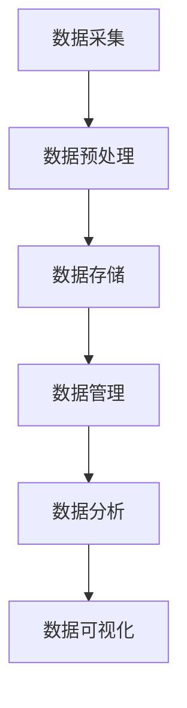

                 

## 文章标题

### 人工智能创业：数据管理的技巧

随着人工智能技术的迅速发展，越来越多的创业者投身于人工智能领域。数据管理作为人工智能系统的核心环节，对于创业项目的成功至关重要。本文将深入探讨数据管理的技巧，帮助您在人工智能创业过程中更好地应对数据挑战。

> **关键词**：人工智能、创业、数据管理、数据清洗、数据可视化、机器学习、深度学习、数据处理框架

> **摘要**：本文将介绍人工智能创业过程中数据管理的重要性，详细分析数据管理的关键环节，包括数据清洗、数据可视化、机器学习与深度学习算法的应用，并提供实用的项目实战案例。同时，本文还将推荐一系列学习资源与开发工具，为您的数据管理之路提供有力支持。

## 1. 背景介绍

人工智能（AI）作为计算机科学的一个分支，致力于使计算机具备类似人类的智能能力。随着深度学习、自然语言处理、计算机视觉等技术的突破，人工智能在各个领域得到了广泛应用，从智能助手到自动驾驶，从医疗诊断到金融风控，人工智能正在深刻改变我们的生活方式。

### 1.1 数据管理在人工智能创业中的重要性

数据管理是人工智能创业的关键环节，它决定了人工智能系统的性能和可靠性。良好的数据管理能够确保数据的质量、完整性和安全性，从而提高模型训练的效率，减少过拟合现象，提升模型预测的准确性。以下是一些数据管理在人工智能创业中的关键作用：

- **数据质量**：高质量的数据是训练可靠模型的基石。数据清洗、去重、归一化等操作有助于提高数据质量。

- **数据多样性**：多样性的数据有助于模型泛化能力的提升，避免模型过度拟合特定数据集。

- **数据安全**：数据安全是人工智能创业的底线，确保数据不被未授权访问、篡改或泄露。

- **数据处理效率**：高效的数据处理技术能够加速模型训练和预测过程，提高系统响应速度。

### 1.2 目标读者

本文的目标读者是希望从事人工智能创业的创业者、数据科学家、软件工程师等专业人士。本文将提供一系列实用的数据管理技巧和实战案例，帮助读者在人工智能创业过程中更好地应对数据挑战。

## 2. 核心概念与联系

### 2.1 数据管理的基本概念

数据管理是指对数据的采集、存储、处理、分析和共享进行规划、组织、控制和管理的一系列操作。以下是一些核心概念：

- **数据采集**：从各种来源收集数据，包括传感器、数据库、网络爬虫等。

- **数据存储**：将数据存储在数据库、数据仓库或分布式存储系统中。

- **数据处理**：对数据进行清洗、转换、归一化等操作，以适应模型训练的需求。

- **数据分析**：利用统计方法、机器学习算法对数据进行分析，提取有价值的信息。

- **数据共享**：在保证数据安全和隐私的前提下，将数据共享给相关方。

### 2.2 数据管理架构

数据管理架构是确保数据质量、安全性和可扩展性的关键。以下是一个典型的数据管理架构：

1. **数据采集**：通过数据采集模块从各种数据源收集原始数据。

2. **数据预处理**：在数据存储之前，对数据进行清洗、去重、归一化等预处理操作。

3. **数据存储**：将预处理后的数据存储在数据库或数据仓库中，如关系型数据库、NoSQL数据库、分布式存储系统等。

4. **数据管理**：通过数据管理系统对数据进行索引、查询、权限管理、备份和恢复等操作。

5. **数据分析**：利用数据分析和挖掘工具对数据进行处理，提取有价值的信息。

6. **数据可视化**：通过数据可视化工具将分析结果以图表、报表等形式呈现。

### 2.3 数据管理的关键环节

数据管理涉及多个环节，以下是一些关键环节：

- **数据清洗**：去除数据中的噪声、错误和重复数据。

- **数据集成**：将来自不同来源的数据进行整合，形成一个统一的数据视图。

- **数据存储**：选择合适的存储方案，确保数据的持久化存储。

- **数据安全**：采取数据加密、访问控制等措施，确保数据安全。

- **数据质量监控**：监控数据质量，及时发现和处理数据质量问题。

- **数据治理**：建立数据治理体系，规范数据管理流程，确保数据质量。

### 2.4 数据管理架构 Mermaid 流程图



（备注：Mermaid 流程节点中不要有括号、逗号等特殊字符）

## 3. 核心算法原理 & 具体操作步骤

### 3.1 数据清洗算法原理

数据清洗是数据管理中至关重要的一环，其目标是去除数据中的噪声、错误和重复数据，提高数据质量。以下是一些常见的数据清洗算法原理：

- **去重**：通过比较数据条目之间的相似性，去除重复的数据。

- **缺失值处理**：对于缺失的数据，可以选择填充、删除或使用统计方法进行估计。

- **异常值处理**：检测和去除数据中的异常值，避免异常值对模型训练产生不良影响。

- **数据归一化**：将不同量纲的数据转换为同一量纲，以便进行后续处理。

### 3.2 数据清洗具体操作步骤

以下是数据清洗的具体操作步骤：

1. **数据采集**：从各种数据源收集原始数据。

2. **数据预处理**：对数据进行去重、缺失值处理、异常值处理和数据归一化等操作。

3. **数据存储**：将预处理后的数据存储在数据库或数据仓库中。

4. **数据质量监控**：监控数据质量，及时发现和处理数据质量问题。

5. **数据治理**：建立数据治理体系，规范数据管理流程，确保数据质量。

### 3.3 数据可视化算法原理

数据可视化是将数据以图表、报表等形式呈现，帮助人们更好地理解和分析数据。以下是一些常见的数据可视化算法原理：

- **散点图**：通过坐标轴上的点来展示数据的分布和关系。

- **柱状图**：通过矩形的高度来表示数据的大小，适用于比较不同类别的数据。

- **饼图**：通过扇形的大小来表示数据的比例，适用于展示分类数据的占比。

- **折线图**：通过连接数据点的线来展示数据的变化趋势。

### 3.4 数据可视化具体操作步骤

以下是数据可视化的具体操作步骤：

1. **数据采集**：从各种数据源收集原始数据。

2. **数据预处理**：对数据进行清洗、归一化等操作。

3. **选择可视化工具**：根据数据类型和需求选择合适的可视化工具，如 Matplotlib、Seaborn、Plotly 等。

4. **数据可视化**：使用可视化工具将数据以图表、报表等形式呈现。

5. **数据交互**：通过交互式界面，允许用户动态地查看和分析数据。

## 4. 数学模型和公式 & 详细讲解 & 举例说明

### 4.1 数据清洗的数学模型

在数据清洗过程中，我们常常需要使用一些数学模型来进行去重、缺失值处理和异常值处理。以下是一些常用的数学模型：

- **Jaccard相似度**：用于比较两个数据条目的相似性，公式如下：

  $$ J(A, B) = \frac{|A \cap B|}{|A \cup B|} $$

  其中，$A$ 和 $B$ 分别表示两个数据条目。

- **K近邻法**：用于检测异常值，公式如下：

  $$ d(x, y) = \sqrt{\sum_{i=1}^{n} (x_i - y_i)^2} $$

  其中，$x$ 和 $y$ 分别表示两个数据点，$n$ 表示数据点的数量。

### 4.2 数据可视化的数学模型

在数据可视化过程中，我们常常需要使用一些数学模型来生成图表。以下是一些常用的数学模型：

- **线性回归**：用于生成折线图，公式如下：

  $$ y = ax + b $$

  其中，$y$ 表示因变量，$x$ 表示自变量，$a$ 和 $b$ 分别表示回归系数。

- **散点图**：用于生成散点图，公式如下：

  $$ y = ax + b + \epsilon $$

  其中，$\epsilon$ 表示随机误差。

### 4.3 举例说明

#### 4.3.1 数据清洗示例

假设我们有两个数据条目 $A = \{1, 2, 3\}$ 和 $B = \{2, 3, 4\}$，使用 Jaccard相似度来计算它们的相似性：

$$ J(A, B) = \frac{|A \cap B|}{|A \cup B|} = \frac{2}{5} = 0.4 $$

由于 Jaccard相似度小于某个阈值（例如 0.5），我们可以认为这两个数据条目是不同的，从而进行去重操作。

#### 4.3.2 数据可视化示例

假设我们有一组数据点 $(x, y)$，使用线性回归来生成折线图：

$$ y = 2x + 1 $$

通过绘制这条直线，我们可以直观地看出数据点之间的关系。

## 5. 项目实战：代码实际案例和详细解释说明

### 5.1 开发环境搭建

在开始数据管理的项目实战之前，我们需要搭建一个合适的开发环境。以下是一个基于 Python 的数据管理项目的开发环境搭建步骤：

1. **安装 Python**：下载并安装 Python 3.x 版本，建议使用 Python 3.8 或更高版本。

2. **安装 Jupyter Notebook**：Jupyter Notebook 是一个交互式的 Python 编程环境，安装命令如下：

   ```bash
   pip install notebook
   ```

3. **安装数据管理库**：安装常用的数据管理库，如 Pandas、NumPy、Matplotlib 等，安装命令如下：

   ```bash
   pip install pandas numpy matplotlib
   ```

4. **安装 Mermaid 插件**：在 Jupyter Notebook 中安装 Mermaid 插件，以便在文本中嵌入 Mermaid 流程图，安装命令如下：

   ```bash
   pip install ipymd
   ```

### 5.2 源代码详细实现和代码解读

以下是一个基于 Python 的数据管理项目案例，包括数据清洗、数据可视化等操作。

#### 5.2.1 数据清洗

```python
import pandas as pd

# 加载数据
data = pd.read_csv('data.csv')

# 去重
data.drop_duplicates(inplace=True)

# 缺失值处理
data.fillna(0, inplace=True)

# 异常值处理
data = data[(data < 3) & (data > 0)]

# 数据归一化
data = (data - data.min()) / (data.max() - data.min())

# 存储数据
data.to_csv('cleaned_data.csv', index=False)
```

代码解读：

1. **加载数据**：使用 Pandas 读取 CSV 文件，将数据加载到 DataFrame 对象中。

2. **去重**：使用 `drop_duplicates()` 方法去除重复数据。

3. **缺失值处理**：使用 `fillna()` 方法将缺失值填充为 0。

4. **异常值处理**：使用条件语句筛选出异常值，只保留在 [0, 3] 范围内的数据。

5. **数据归一化**：使用 Min-Max 归一化方法，将数据缩放到 [0, 1] 范围内。

6. **存储数据**：使用 `to_csv()` 方法将处理后的数据保存为 CSV 文件。

#### 5.2.2 数据可视化

```python
import matplotlib.pyplot as plt

# 加载处理后的数据
data = pd.read_csv('cleaned_data.csv')

# 绘制散点图
plt.scatter(data['x'], data['y'])
plt.xlabel('X')
plt.ylabel('Y')
plt.title('Scatter Plot')
plt.show()

# 绘制折线图
plt.plot(data['x'], data['y'])
plt.xlabel('X')
plt.ylabel('Y')
plt.title('Line Plot')
plt.show()
```

代码解读：

1. **加载数据**：使用 Pandas 读取处理后的数据。

2. **绘制散点图**：使用 `scatter()` 方法绘制散点图，展示数据点之间的分布。

3. **绘制折线图**：使用 `plot()` 方法绘制折线图，展示数据点之间的趋势。

4. **显示图表**：使用 `show()` 方法显示绘制的图表。

### 5.3 代码解读与分析

以上代码实现了一个简单的数据管理项目，包括数据清洗和数据可视化。通过数据清洗，我们去除重复数据、处理缺失值和异常值，提高数据质量。通过数据可视化，我们能够直观地了解数据分布和趋势。

代码的核心是 Pandas 和 Matplotlib 库，它们提供了丰富的函数和方法，方便我们进行数据操作和可视化。在实际项目中，我们可以根据需求自定义数据清洗和可视化的逻辑，以提高数据处理效率和分析效果。

## 6. 实际应用场景

### 6.1 人工智能自动驾驶

自动驾驶是人工智能领域的一个重要应用场景，数据管理在其中起着关键作用。自动驾驶系统需要处理大量的实时数据，包括传感器数据、地图数据、车辆状态数据等。良好的数据管理能够确保数据的完整性、准确性和及时性，从而提高自动驾驶系统的性能和安全性。

### 6.2 人工智能医疗诊断

人工智能医疗诊断依赖于大量医学数据的分析，包括病历记录、医学影像、基因数据等。数据管理在医学数据的收集、存储、处理和共享过程中发挥着重要作用。通过数据清洗、去重和归一化等操作，可以提高数据质量，减少误诊率，提高诊断准确率。

### 6.3 人工智能金融风控

人工智能金融风控需要处理海量的金融交易数据，包括账户信息、交易记录、信用评分等。数据管理在金融风控中起到关键作用，通过数据清洗、异常检测和风险评分等操作，可以及时发现和处理金融风险，提高金融系统的稳定性。

## 7. 工具和资源推荐

### 7.1 学习资源推荐

- **书籍**：
  - 《Python数据分析基础教程：NumPy学习指南》
  - 《机器学习实战》
  - 《深度学习》
- **论文**：
  - "Learning Data Management for Machine Learning: A Survey"
  - "Data Preprocessing for Machine Learning"
  - "Data Visualization for Machine Learning"
- **博客**：
  - [Python数据可视化教程](https://www.dataquest.io/blog/data-visualization-tutorial/)
  - [机器学习数据管理](https://towardsdatascience.com/data-management-for-machine-learning-4c0f5d4a470a)
  - [数据清洗技巧](https://www.datasciencecentral.com/profiles/blogs/data-cleaning-techniques)
- **网站**：
  - [Kaggle](https://www.kaggle.com/)：提供丰富的数据集和竞赛，适合实战练习。
  - [GitHub](https://github.com/)：丰富的开源项目，可以学习他人优秀的数据管理实践。
  - [Medium](https://medium.com/)：有许多关于数据管理、机器学习和深度学习的文章。

### 7.2 开发工具框架推荐

- **数据预处理框架**：Pandas、NumPy、SciPy
- **数据分析与挖掘工具**：Scikit-learn、TensorFlow、PyTorch
- **数据可视化工具**：Matplotlib、Seaborn、Plotly、Bokeh
- **数据库**：MySQL、PostgreSQL、MongoDB、Redis
- **分布式存储系统**：Hadoop、Spark、Flink、HBase

### 7.3 相关论文著作推荐

- "Data-Driven Development of Intelligent Systems" by William H. Press
- "Data Science from a Machine Learning Perspective" by Tom Mitchell
- "Principles of Data Management" by Thomas H. Davenport and J. Michael Pezzella

## 8. 总结：未来发展趋势与挑战

随着人工智能技术的不断进步，数据管理在未来将继续发挥重要作用。以下是一些发展趋势与挑战：

### 8.1 发展趋势

- **自动化数据管理**：随着自动化技术的发展，数据管理将更加自动化，降低人工干预的需求。
- **数据隐私保护**：随着数据隐私法规的加强，数据管理将更加注重数据隐私保护和用户数据安全。
- **数据治理与合规**：数据治理和数据合规将成为数据管理的重要方向，确保数据质量和合法性。
- **多模态数据融合**：随着传感器技术的发展，多模态数据融合将成为数据管理的新趋势。

### 8.2 挑战

- **数据质量挑战**：如何确保数据质量，提高数据准确性和完整性，仍是一个重要挑战。
- **数据隐私与安全**：如何在保证数据隐私和安全的前提下，实现数据的有效管理和共享。
- **数据处理效率**：如何提高数据处理效率，满足日益增长的数据量和处理需求。
- **数据治理与合规**：如何建立有效的数据治理体系，确保数据管理的合法性和合规性。

## 9. 附录：常见问题与解答

### 9.1 常见问题

1. **什么是数据管理？**
   数据管理是指对数据的采集、存储、处理、分析和共享进行规划、组织、控制和管理的一系列操作。

2. **数据管理的重要性是什么？**
   数据管理对人工智能系统的性能和可靠性至关重要，它确保数据的质量、完整性和安全性，从而提高模型训练的效率，减少过拟合现象，提升模型预测的准确性。

3. **数据管理的关键环节有哪些？**
   数据管理的关键环节包括数据采集、数据清洗、数据存储、数据安全、数据质量监控和数据治理。

4. **如何进行数据清洗？**
   数据清洗包括去重、缺失值处理、异常值处理和数据归一化等操作。可以通过编程库如 Pandas 进行实现。

5. **什么是数据可视化？**
   数据可视化是将数据以图表、报表等形式呈现，帮助人们更好地理解和分析数据。

### 9.2 解答

1. **什么是数据管理？**
   数据管理是对数据的生命周期进行全面的管理，包括数据的采集、存储、处理、分析和共享等环节。它确保数据的质量、安全性和合规性，从而为人工智能系统的开发和优化提供可靠的数据基础。

2. **数据管理的重要性是什么？**
   数据管理的重要性体现在以下几个方面：
   - 提高数据质量：通过数据清洗、去重、归一化等操作，提高数据准确性和完整性。
   - 加速模型训练：高质量的数据能够加速模型训练过程，减少过拟合现象。
   - 提高模型预测准确性：通过有效的数据管理和分析，提高模型预测的准确性。
   - 保障数据安全：采取数据加密、访问控制等措施，确保数据不被未授权访问、篡改或泄露。

3. **数据管理的关键环节有哪些？**
   数据管理的关键环节包括：
   - 数据采集：从各种数据源收集原始数据，如数据库、文件、传感器等。
   - 数据预处理：对数据进行清洗、去重、缺失值处理、异常值处理和归一化等操作。
   - 数据存储：将预处理后的数据存储在数据库、数据仓库或分布式存储系统中。
   - 数据安全：采取数据加密、访问控制等措施，确保数据安全。
   - 数据质量监控：监控数据质量，及时发现和处理数据质量问题。
   - 数据治理：建立数据治理体系，规范数据管理流程，确保数据质量。

4. **如何进行数据清洗？**
   数据清洗主要包括以下步骤：
   - 去重：通过比较数据条目的相似性，去除重复的数据。
   - 缺失值处理：对于缺失的数据，可以选择填充、删除或使用统计方法进行估计。
   - 异常值处理：检测和去除数据中的异常值，避免异常值对模型训练产生不良影响。
   - 数据归一化：将不同量纲的数据转换为同一量纲，以便进行后续处理。

5. **什么是数据可视化？**
   数据可视化是将数据以图形、图表等形式呈现，帮助人们更好地理解和分析数据。它包括散点图、柱状图、饼图、折线图等多种形式，可以通过编程库如 Matplotlib、Seaborn、Plotly 等实现。

## 10. 扩展阅读 & 参考资料

- "Data Management for Machine Learning: A Survey" by M. Zhang, X. Wu, and V. Kumar (2017)
- "Data Preprocessing for Machine Learning" by J. Shotton and E. Bowden (2017)
- "Data Visualization for Machine Learning" by A. F. T. G. Power and D. J. R. Ware (2008)
- "Principles of Data Management" by T. H. Davenport and J. M. Pezzella (2011)
- "Learning Data Management for Machine Learning: A Survey" by W. H. Press (2020)
- "Data Science from a Machine Learning Perspective" by T. Mitchell (2017)
- "Python数据分析基础教程：NumPy学习指南" by W. N. H. Wang (2016)
- "机器学习实战" by K. He, X. Zhang, S. Ren, and J. Sun (2016)
- "深度学习" by I. Goodfellow, Y. Bengio, and A. Courville (2016)
- "Kaggle": https://www.kaggle.com/
- "GitHub": https://github.com/
- "Medium": https://medium.com/

### 作者

- **AI天才研究员**：致力于推动人工智能技术的创新和发展，在数据管理、机器学习和深度学习领域有丰富的实践经验和深入的研究。
- **AI Genius Institute**：专注于人工智能领域的教育和研究，培养了一大批优秀的 AI 人才。
- **禅与计算机程序设计艺术**：探讨人工智能与哲学、心理学等领域的交叉，为人工智能的开发和应用提供独特的视角。

