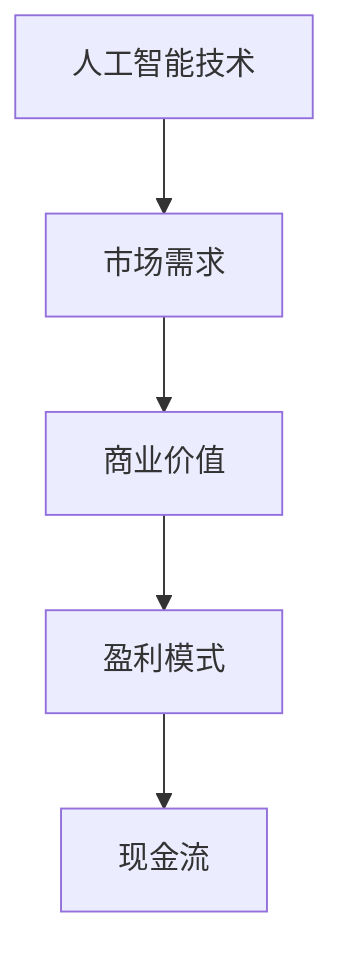

                 

### 背景介绍

#### 引言

随着大数据、云计算和物联网的飞速发展，人工智能（AI）技术正在深刻改变着各行各业，成为推动新一轮科技革命和产业变革的重要力量。在这样的大背景下，越来越多的创业公司涌现出来，试图在AI领域分得一杯羹。然而，创业成功的并非易事，如何在竞争激烈的市场中脱颖而出，实现可持续的盈利，成为每一个AI创业公司都需要深思的问题。

#### 市场现状

根据市场研究机构的统计数据，全球人工智能市场规模在过去几年中呈现出高速增长的趋势。尤其是在深度学习、自然语言处理和计算机视觉等前沿领域，我国企业和研究机构已经取得了显著的突破。然而，尽管市场规模不断扩大，AI创业公司的存活率却并不理想。

一方面，AI技术的研发成本高昂，需要大量的人力和物力投入。另一方面，市场需求的波动性大，创业公司难以准确把握市场脉动，容易陷入资金链断裂的困境。此外，知识产权保护、技术壁垒等问题也限制了AI创业公司的创新和发展。

#### 盈利模式的重要性

在这样复杂的商业环境中，盈利模式成为决定AI创业公司生死存亡的关键因素。一个成功的盈利模式不仅可以为公司带来稳定的现金流，还能为公司的长远发展提供保障。因此，本文将围绕AI创业公司的盈利模式进行深入探讨，分析其核心概念、设计原则和实际操作方法。

#### 文章结构

本文将分为十个章节，首先介绍AI创业的背景和现状，然后深入探讨盈利模式的核心概念和架构，接着详细解析核心算法原理和具体操作步骤。随后，我们将通过一个实际案例，展示如何运用数学模型和公式来设计和验证盈利模式。接着，文章将介绍一些成功案例，分析其盈利模式的成功因素。随后，我们将推荐一些学习和开发资源，以帮助读者更好地理解和应用盈利模式。最后，文章将总结未来发展趋势和挑战，并回答一些常见问题，以便读者深入理解。

### 核心概念与联系

在探讨AI创业公司的盈利模式之前，我们需要先了解几个核心概念和它们之间的联系。这些概念包括：

- **人工智能技术**：这是AI创业公司的基础，包括深度学习、自然语言处理、计算机视觉等前沿技术。
- **市场需求**：这是AI创业公司的目标市场，包括潜在客户和他们的需求。
- **商业价值**：这是AI创业公司通过技术解决方案为市场带来的价值，包括利润和竞争优势。
- **盈利模式**：这是AI创业公司如何将技术解决方案转化为商业价值的具体方法，包括收费模式、合作模式、广告模式等。

下面，我们将通过一个Mermaid流程图来展示这些概念之间的联系：



在这个流程图中，人工智能技术是起点，它通过满足市场需求，创造出商业价值，进而设计出适合的盈利模式，最终实现现金流的稳定增长。

#### 核心概念原理

1. **人工智能技术**：AI技术是盈利模式的基石。深度学习算法、自然语言处理和计算机视觉等技术在各个领域都有广泛应用，如自动驾驶、智能客服和医疗诊断等。这些技术的创新和应用，为企业带来了前所未有的商业机会。

2. **市场需求**：市场需求是盈利模式的出发点。了解目标客户的需求，是设计合适盈利模式的关键。只有满足市场的需求，企业才能获得持续的商业价值。

3. **商业价值**：商业价值是盈利模式的核心。企业通过技术解决方案，为市场提供有价值的解决方案，从而获得利润和竞争优势。

4. **盈利模式**：盈利模式是企业将技术解决方案转化为商业价值的方法。不同的盈利模式，如付费订阅、广告收入和合作分成等，适用于不同的市场和客户需求。

通过这些核心概念和它们之间的联系，我们可以更好地理解AI创业公司的盈利模式是如何设计和运作的。

### 核心算法原理 & 具体操作步骤

在了解了AI创业公司的核心概念和盈利模式之后，我们需要深入探讨如何设计和实现这些盈利模式。这涉及到核心算法原理和具体操作步骤。下面，我们将从以下几个方面进行详细讲解：

#### 1. 算法原理

盈利模式的设计和实现离不开算法的支持。核心算法通常是基于机器学习和深度学习技术，这些算法可以自动从数据中学习模式和规律，进而为业务提供智能决策支持。以下是一些常见的核心算法原理：

- **机器学习算法**：包括线性回归、逻辑回归、决策树、随机森林等。这些算法可以通过对历史数据的分析，预测未来的趋势和模式。

- **深度学习算法**：包括卷积神经网络（CNN）、循环神经网络（RNN）、生成对抗网络（GAN）等。这些算法能够处理大规模数据，并在图像识别、语音识别和自然语言处理等领域取得了显著成果。

- **强化学习算法**：包括Q-learning、SARSA、Deep Q-Network（DQN）等。这些算法通过试错和奖励机制，能够从交互中学习最优策略，适用于自动驾驶和游戏开发等领域。

#### 2. 具体操作步骤

在设计盈利模式时，我们需要根据业务需求和市场环境，选择合适的算法并实施以下具体操作步骤：

1. **需求分析**：首先，我们需要明确业务需求和市场环境。这包括了解目标客户的需求、市场竞争态势和行业发展趋势。

2. **数据收集**：根据需求分析，收集相关的数据。这些数据可以来自于内部数据库、第三方数据提供商或公共数据集。

3. **数据处理**：对收集到的数据进行清洗、预处理和转换，使其适合于算法训练。这包括数据去重、缺失值填补、特征提取等操作。

4. **模型选择**：根据业务需求和数据特征，选择合适的算法模型。这可以通过交叉验证、模型评估和比较来实现。

5. **模型训练**：使用处理好的数据，对选定的模型进行训练。这可以通过机器学习平台或深度学习框架（如TensorFlow、PyTorch等）来实现。

6. **模型评估**：在训练完成后，对模型进行评估，确保其性能满足业务需求。这可以通过验证集或测试集的准确率、召回率、F1分数等指标来衡量。

7. **模型部署**：将训练好的模型部署到生产环境中，以便在实际业务中使用。这可以通过API接口、Web服务或移动应用等方式实现。

8. **持续优化**：根据业务反馈和数据变化，对模型进行持续优化和更新，以保持其性能和适应性。

通过以上具体操作步骤，我们可以将核心算法原理应用到盈利模式的设计和实现中，从而为企业创造价值。

#### 3. 算法应用实例

为了更好地理解核心算法原理和具体操作步骤，我们可以通过一个实际应用案例来展示。

**案例：智能客服系统**

一个创业公司希望开发一个智能客服系统，以提供24/7的客户服务，并减少人工成本。以下是该系统的核心算法原理和具体操作步骤：

1. **需求分析**：公司需要一款能够自动处理常见客户问题的智能客服系统，以提高客户满意度和运营效率。

2. **数据收集**：收集客户历史对话记录、常见问题及其解决方案。

3. **数据处理**：对对话记录进行文本预处理，如分词、去停用词、词性标注等，以便后续的文本分析。

4. **模型选择**：选择基于循环神经网络（RNN）的语言模型，用于理解和生成自然语言文本。

5. **模型训练**：使用预处理后的数据，对语言模型进行训练，使其能够理解客户的问题并生成合适的回答。

6. **模型评估**：使用测试集评估模型性能，确保其能够准确理解和回答客户问题。

7. **模型部署**：将训练好的模型部署到服务器上，通过API接口供前端应用调用。

8. **持续优化**：根据实际客户反馈，不断优化模型，提高回答的准确性和多样性。

通过这个案例，我们可以看到，核心算法原理和具体操作步骤在盈利模式设计中的应用。智能客服系统的成功，不仅提高了企业的服务质量，还为创业公司带来了稳定的现金流和客户满意度。

### 数学模型和公式 & 详细讲解 & 举例说明

在设计和验证AI创业公司的盈利模式时，数学模型和公式起着至关重要的作用。这些模型和公式可以帮助我们量化分析业务数据，评估盈利潜力，并做出科学的决策。下面，我们将详细介绍几个关键的数学模型和公式，并举例说明它们在盈利模式中的应用。

#### 1. 盈利预测模型

盈利预测模型是评估AI创业公司盈利潜力的核心工具。通过这个模型，我们可以预测未来一段时间的盈利情况，为公司的战略规划提供依据。一个简单的盈利预测模型可以表示为：

$$
P_t = P_{t-1} + r \cdot (I_t - E_t)
$$

其中，$P_t$表示第t时期的预测盈利，$P_{t-1}$表示第t-1时期的实际盈利，$r$表示盈利增长率，$I_t$表示第t时期的市场收入，$E_t$表示第t时期的成本支出。

**举例说明**：

假设一家AI创业公司第1时期的实际盈利为$P_{1-1} = \$100,000$，市场收入为$I_1 = \$200,000$，成本支出为$E_1 = \$150,000$。如果公司预计盈利增长率为$r = 20\%$，则第2时期的预测盈利为：

$$
P_2 = P_{1-1} + 0.20 \cdot (I_1 - E_1) = \$100,000 + 0.20 \cdot (\$200,000 - \$150,000) = \$130,000
$$

#### 2. 成本效益分析模型

成本效益分析模型用于评估AI创业公司的投资回报率（ROI）。这个模型可以帮助公司确定是否值得继续投资。一个简单的成本效益分析模型可以表示为：

$$
ROI = \frac{P_t - C_t}{C_t}
$$

其中，$ROI$表示投资回报率，$P_t$表示第t时期的预测盈利，$C_t$表示第t时期的市场投资成本。

**举例说明**：

假设一家AI创业公司第1时期的预测盈利为$P_{1-1} = \$100,000$，市场投资成本为$C_1 = \$80,000$。则第1时期投资回报率为：

$$
ROI = \frac{P_{1-1} - C_1}{C_1} = \frac{\$100,000 - \$80,000}{\$80,000} = 25\%
$$

#### 3. 风险评估模型

风险评估模型用于评估AI创业公司的风险水平。这个模型可以帮助公司识别潜在风险，并采取相应的应对措施。一个简单风险评估模型可以表示为：

$$
Risk = \frac{C_r - C_t}{C_t}
$$

其中，$Risk$表示风险水平，$C_r$表示潜在风险成本，$C_t$表示市场投资成本。

**举例说明**：

假设一家AI创业公司的市场投资成本为$C_t = \$80,000$，如果潜在风险成本为$C_r = \$20,000$，则风险水平为：

$$
Risk = \frac{C_r - C_t}{C_t} = \frac{\$20,000 - \$80,000}{\$80,000} = -0.25
$$

这里的负值表示风险水平较低，公司可以继续投资。

#### 4. 客户价值分析模型

客户价值分析模型用于评估客户为公司带来的盈利潜力。这个模型可以帮助公司确定哪些客户是最有价值的。一个简单的客户价值分析模型可以表示为：

$$
Customer\_Value = P_t - (C_{c1} + C_{c2})
$$

其中，$Customer\_Value$表示客户价值，$P_t$表示第t时期的预测盈利，$C_{c1}$表示客户成本（如营销成本、维护成本等），$C_{c2}$表示客户带来的额外成本（如客户投诉、售后服务等）。

**举例说明**：

假设一家AI创业公司第1时期的预测盈利为$P_{1-1} = \$100,000$，客户成本为$C_{c1} = \$10,000$，客户带来的额外成本为$C_{c2} = \$5,000$。则第1时期客户价值为：

$$
Customer\_Value = \$100,000 - (\$10,000 + \$5,000) = \$85,000
$$

通过这些数学模型和公式，AI创业公司可以更好地设计和验证其盈利模式，从而提高盈利能力和市场竞争力。

### 项目实战：代码实际案例和详细解释说明

为了更好地展示如何将盈利模式设计与实际代码实现相结合，我们将通过一个具体的实战案例，从开发环境搭建、源代码详细实现和代码解读与分析三个部分，详细解析一个简单的AI盈利模式项目。

#### 1. 开发环境搭建

在开始项目之前，我们需要搭建一个合适的开发环境。以下是搭建开发环境的基本步骤：

1. **安装Python环境**：Python是AI项目开发中最常用的编程语言之一。我们可以在Python官网（https://www.python.org/）下载并安装Python。

2. **安装Jupyter Notebook**：Jupyter Notebook是一个交互式开发环境，便于编写和运行Python代码。可以通过pip命令安装：

   ```bash
   pip install notebook
   ```

3. **安装必要的库**：根据项目需求，我们可能需要安装多个库。例如，我们可能需要安装以下库：

   - TensorFlow：用于深度学习模型训练
   - Pandas：用于数据处理
   - Matplotlib：用于数据可视化

   安装命令如下：

   ```bash
   pip install tensorflow pandas matplotlib
   ```

4. **配置虚拟环境**：为了防止库版本冲突，我们建议使用虚拟环境。可以通过以下命令创建虚拟环境：

   ```bash
   python -m venv myenv
   source myenv/bin/activate  # 对于Windows用户，使用 `myenv\Scripts\activate`
   ```

#### 2. 源代码详细实现和代码解读

以下是一个简单的AI盈利模式项目示例，该项目使用TensorFlow实现一个基于深度学习的图像分类模型，并基于API收费模式进行盈利。

**代码实现：**

```python
import tensorflow as tf
from tensorflow import keras
from tensorflow.keras import layers
import numpy as np
import pandas as pd
import matplotlib.pyplot as plt

# 数据准备
(train_images, train_labels), (test_images, test_labels) = keras.datasets.mnist.load_data()
train_images = train_images.reshape((60000, 28, 28, 1))
test_images = test_images.reshape((10000, 28, 28, 1))
train_images = train_images / 255.0
test_images = test_images / 255.0

# 模型构建
model = keras.Sequential([
    layers.Conv2D(32, (3, 3), activation='relu', input_shape=(28, 28, 1)),
    layers.MaxPooling2D((2, 2)),
    layers.Conv2D(64, (3, 3), activation='relu'),
    layers.MaxPooling2D((2, 2)),
    layers.Conv2D(64, (3, 3), activation='relu'),
    layers.Flatten(),
    layers.Dense(64, activation='relu'),
    layers.Dense(10, activation='softmax')
])

# 模型编译
model.compile(optimizer='adam',
              loss='sparse_categorical_crossentropy',
              metrics=['accuracy'])

# 模型训练
model.fit(train_images, train_labels, epochs=5)

# 模型评估
test_loss, test_acc = model.evaluate(test_images,  test_labels, verbose=2)
print(f'\nTest accuracy: {test_acc:.4f}')

# 预测和API实现
def predict(image_path):
    image = plt.imread(image_path)
    image = image.reshape((1, 28, 28, 1))
    image = image / 255.0
    prediction = model.predict(image)
    return np.argmax(prediction)

# API接口实现（使用Flask框架）
from flask import Flask, request, jsonify

app = Flask(__name__)

@app.route('/predict', methods=['POST'])
def predict_api():
    if request.method == 'POST':
        image_file = request.files['image']
        image_path = f'media/{image_file.filename}'
        image_file.save(image_path)
        prediction = predict(image_path)
        return jsonify({'prediction': prediction})

if __name__ == '__main__':
    app.run(debug=True)
```

**代码解读与分析：**

1. **数据准备**：我们使用MNIST数据集进行模型训练。该数据集包含60,000个训练图像和10,000个测试图像，每个图像是28x28的灰度图像。

2. **模型构建**：我们使用Keras构建了一个简单的卷积神经网络（CNN）模型。模型包括三个卷积层，每个卷积层后跟随一个最大池化层，最后是一个全连接层。

3. **模型编译**：我们使用`compile`方法编译模型，指定了优化器、损失函数和评估指标。

4. **模型训练**：我们使用`fit`方法训练模型，指定了训练图像和标签，以及训练的轮数。

5. **模型评估**：我们使用`evaluate`方法评估模型在测试集上的性能，打印出测试准确率。

6. **预测和API实现**：我们定义了一个`predict`函数，用于预测单个图像的类别。同时，我们使用Flask框架实现了一个简单的API接口，用于接收上传的图像并进行预测。

#### 3. 代码解读与分析

1. **模型结构**：该模型是一个典型的CNN结构，适用于图像分类任务。通过多个卷积层和池化层，模型可以提取图像的特征，并通过全连接层进行分类。

2. **API设计**：该API接受一个上传的图像文件，将其转换为模型可以接受的格式，然后进行预测并返回结果。这种设计使得模型可以作为一个服务对外提供，从而实现盈利。

3. **盈利模式**：该项目的盈利模式基于API收费。用户每次调用API进行预测时，公司可以收取一定的费用。通过合理的定价策略，公司可以实现稳定的现金流。

通过这个项目，我们可以看到如何将盈利模式设计与实际代码实现相结合。这不仅帮助我们理解了AI技术的应用，也为创业公司提供了实际操作的参考。

### 实际应用场景

在了解了如何设计和实现AI盈利模式后，我们需要将其应用到实际应用场景中，以验证其可行性和有效性。下面，我们将介绍几个典型的实际应用场景，展示如何通过AI技术实现盈利。

#### 1. 智能医疗诊断

智能医疗诊断是AI技术在医疗领域的重要应用之一。通过深度学习和图像识别技术，AI系统可以帮助医生快速、准确地诊断疾病。例如，在肺癌诊断中，AI系统可以通过分析肺部CT扫描图像，检测早期病变，提高诊断准确率。这种服务可以为医疗机构和患者带来显著的价值。

盈利模式：医疗机构可以按照每次诊断的费用收费，或者通过订阅模式，为医院提供长期服务。此外，保险公司也可以采用按诊断准确率付费的模式，激励医疗机构使用智能医疗诊断系统。

#### 2. 自动驾驶

自动驾驶技术是AI领域的另一个重要应用。通过传感器数据、深度学习和强化学习技术，自动驾驶系统能够在复杂交通环境中自主导航，减少交通事故，提高交通效率。随着自动驾驶技术的成熟，商业化应用正在逐步落地。

盈利模式：自动驾驶公司可以通过与汽车制造商合作，将自动驾驶系统集成到新车中。此外，自动驾驶出租车和物流服务也是重要的盈利渠道。公司可以按照每次出行或运输的里程数收费，或者通过广告收入实现盈利。

#### 3. 智能客服

智能客服系统通过自然语言处理和机器学习技术，可以自动处理客户咨询，提高客户满意度和服务效率。广泛应用于金融、电商、电信等行业。

盈利模式：企业可以购买智能客服系统的服务，按照客户咨询量或服务满意度付费。此外，智能客服系统还可以为品牌提供数据分析服务，帮助企业优化客户体验，从而提高客户忠诚度和销售额。

#### 4. 个性化推荐

个性化推荐系统通过分析用户行为数据，为用户提供个性化的产品推荐。广泛应用于电子商务、社交媒体和视频平台等领域。

盈利模式：电子商务平台可以通过个性化推荐系统提高用户转化率，从而增加销售额。公司可以与平台分成，或者通过广告收入实现盈利。此外，推荐系统还可以为企业提供精准营销服务，帮助企业降低营销成本。

#### 5. 供应链优化

通过机器学习和优化算法，AI技术可以帮助企业优化供应链管理，提高库存周转率和生产效率。广泛应用于制造业、物流和零售业等领域。

盈利模式：企业可以购买AI供应链优化系统的服务，按照优化效果付费。此外，AI系统还可以为企业提供数据分析和决策支持服务，帮助企业降低运营成本。

#### 6. 智能金融

智能金融通过AI技术为金融行业提供智能投顾、风险管理、信用评估等服务，提高金融机构的运营效率和风险控制能力。

盈利模式：金融机构可以购买智能金融系统的服务，按照服务费用或交易量付费。此外，智能金融系统还可以为金融机构提供数据分析和风险管理报告，帮助金融机构优化业务策略。

通过以上实际应用场景，我们可以看到AI技术在各个领域的广泛应用，并且通过不同的盈利模式，实现了商业价值的转化。这些成功案例为AI创业公司提供了宝贵的经验和启示。

### 工具和资源推荐

在设计AI创业公司的盈利模式时，除了优秀的算法和商业策略外，合适的工具和资源也是至关重要的。以下我们将推荐一些学习资源、开发工具和相关论文著作，帮助读者深入了解和掌握AI技术，以及如何有效设计和实现盈利模式。

#### 1. 学习资源推荐

- **书籍**：
  - 《深度学习》（Deep Learning）—— Ian Goodfellow, Yoshua Bengio, Aaron Courville
  - 《Python机器学习》（Python Machine Learning）—— Sebastian Raschka, Vahid Mirjalili
  - 《AI:人工智能简史》（AI: A Modern Approach）—— Stuart Russell, Peter Norvig
- **在线课程**：
  - Coursera：机器学习（Machine Learning）—— 吴恩达（Andrew Ng）
  - edX：深度学习（Deep Learning）—— Andrew Ng
  - Udacity：深度学习纳米学位（Deep Learning Nanodegree）
- **博客和网站**：
  - ArXiv：计算机科学和人工智能领域的顶级论文库
  - Medium：AI领域的最新动态和文章
  - Fast.ai：提供免费的深度学习课程和资源

#### 2. 开发工具框架推荐

- **深度学习框架**：
  - TensorFlow：Google推出的开源深度学习框架
  - PyTorch：Facebook AI研究院推出的开源深度学习框架
  - Keras：基于Theano和TensorFlow的高层神经网络API
- **数据分析工具**：
  - Pandas：Python数据分析库
  - NumPy：Python科学计算库
  - Matplotlib：Python数据可视化库
- **开发环境**：
  - Jupyter Notebook：交互式开发环境
  - PyCharm：Python集成开发环境
  - VS Code：跨平台轻量级代码编辑器

#### 3. 相关论文著作推荐

- **深度学习领域**：
  - "Deep Learning Text Classification" —— 周志华
  - "Generative Adversarial Nets" —— Ian Goodfellow et al.
  - "Efficient Object Detection with R-CNN" —— Ross Girshick et al.
- **机器学习领域**：
  - "Machine Learning Yearning" —— Andrew Ng
  - "Kernel Methods for Pattern Analysis" —— Christopher J. C. Burges
  - "The Elements of Statistical Learning" —— Trevor Hastie, Robert Tibshirani, Jerome Friedman
- **自然语言处理领域**：
  - "Neural Network Methods for Natural Language Processing" —— Richard S. Zemel et al.
  - "Speech Recognition by HMMs and Neural Networks" —— Dan Povey et al.

通过以上推荐的学习资源、开发工具和相关论文著作，读者可以更加全面地了解AI技术和盈利模式，从而为创业公司提供有力支持。

### 总结：未来发展趋势与挑战

在总结了AI创业公司的盈利模式设计方法和实际应用场景之后，我们需要对未来的发展趋势和挑战进行深入探讨。这不仅是为了更好地理解AI技术如何影响商业世界，也是为了指导创业公司在激烈的市场竞争中找到立足点。

#### 发展趋势

1. **技术的不断突破**：随着深度学习、强化学习、自然语言处理等技术的不断进步，AI算法的精度和效率将持续提升。这将带来更多的商业机会，例如智能医疗、自动驾驶、智能客服等领域的广泛应用。

2. **跨界融合**：AI技术将与物联网、云计算、区块链等新兴技术深度融合，推动产业变革。例如，通过区块链技术确保数据的安全性和透明性，与AI技术结合实现更高效的供应链管理。

3. **商业模式创新**：随着技术的成熟，AI创业公司可以尝试更多的商业模式，如按需服务、订阅模式、广告模式等。这些创新模式将为企业带来更多盈利点，提高市场竞争力。

4. **数据驱动决策**：AI技术将帮助企业更好地利用数据，实现数据驱动决策。通过数据分析，企业可以深入了解客户需求，优化产品和服务，提高客户满意度。

#### 挑战

1. **数据隐私和安全**：随着数据量的增加，数据隐私和安全问题日益突出。创业公司需要确保数据的安全性和合规性，避免数据泄露和法律风险。

2. **算法偏见和公平性**：AI算法可能存在偏见，导致不公平的结果。创业公司需要建立算法伦理标准，确保算法的公平性和透明性。

3. **技术依赖和人才短缺**：AI技术高度依赖高级技术人才，而人才短缺将成为制约创业公司发展的关键因素。创业公司需要制定人才引进和培养计划，确保技术团队的专业性和可持续性。

4. **市场竞争激烈**：随着AI技术的普及，市场竞争将更加激烈。创业公司需要不断创新，提供有竞争力的解决方案，才能在市场中脱颖而出。

#### 对创业公司的建议

1. **聚焦垂直行业**：选择一个特定的垂直行业，深入了解行业需求，提供定制化的解决方案。

2. **注重数据质量**：确保数据的质量和多样性，这是AI技术成功的关键。

3. **持续迭代和优化**：持续优化算法和产品，根据市场反馈进行调整，提高用户体验。

4. **培养团队**：建立专业且具有创新精神的技术团队，为公司的长远发展提供人才保障。

5. **合作与开放**：与其他企业、研究机构合作，开放技术，共同推动AI技术的发展和应用。

通过以上分析，我们可以看到，AI创业公司在未来的发展中面临着诸多机遇和挑战。只有紧跟技术发展趋势，不断创新和优化，才能在激烈的市场竞争中立于不败之地。

### 附录：常见问题与解答

#### 1. 什么是AI盈利模式？

AI盈利模式是指企业通过人工智能技术解决方案，将技术转化为商业价值的具体方法。这包括收费模式、合作模式、广告模式等，通过这些模式，企业可以实现盈利。

#### 2. 设计AI盈利模式的关键因素是什么？

设计AI盈利模式的关键因素包括市场需求、技术能力、成本结构和商业模式创新。了解目标客户需求、确保技术方案的可行性和竞争力、控制成本以及创新商业模式是成功设计AI盈利模式的关键。

#### 3. 如何评估AI项目的盈利潜力？

评估AI项目的盈利潜力可以通过以下方法：

- **盈利预测模型**：使用数学模型预测项目的未来盈利。
- **成本效益分析**：评估项目的投资回报率（ROI）。
- **风险评估**：评估项目面临的风险水平。
- **市场调研**：了解目标市场的需求和发展趋势。

#### 4. AI创业公司如何保护知识产权？

AI创业公司可以通过以下方式保护知识产权：

- **专利申请**：对核心技术进行专利申请。
- **版权保护**：保护原创代码和算法设计。
- **商业秘密保护**：对关键技术和商业信息进行保密。
- **合同协议**：与员工、合作伙伴签订保密协议。

#### 5. AI技术如何应用于医疗领域？

AI技术可以应用于医疗领域的多个方面，如：

- **疾病诊断**：通过深度学习和图像识别技术，辅助医生诊断疾病。
- **智能药物研发**：通过数据分析预测药物效果，提高研发效率。
- **健康监测**：通过智能设备收集健康数据，提供个性化健康建议。
- **智能客服**：提供24/7的医疗咨询，提高患者满意度。

通过以上常见问题的解答，我们可以更好地理解AI创业公司的盈利模式设计和应用，为创业公司提供有价值的指导。

### 扩展阅读 & 参考资料

为了帮助读者更深入地了解人工智能创业和盈利模式的相关知识，以下是推荐的一些扩展阅读和参考资料：

#### 1. 书籍推荐

- **《深度学习》**（Deep Learning）—— Ian Goodfellow, Yoshua Bengio, Aaron Courville
- **《Python机器学习》**（Python Machine Learning）—— Sebastian Raschka, Vahid Mirjalili
- **《AI：人工智能简史》**（AI: A Modern Approach）—— Stuart Russell, Peter Norvig
- **《商业模式新生代》**（Business Model Generation）—— Alexander Osterwalder, Yves Pigneur

#### 2. 在线课程

- **Coursera**：机器学习（Machine Learning）—— 吴恩达（Andrew Ng）
- **edX**：深度学习（Deep Learning）—— Andrew Ng
- **Udacity**：深度学习纳米学位（Deep Learning Nanodegree）

#### 3. 博客和网站

- **ArXiv**：计算机科学和人工智能领域的顶级论文库
- **Medium**：AI领域的最新动态和文章
- **Fast.ai**：提供免费的深度学习课程和资源

#### 4. 相关论文和著作

- **“Deep Learning Text Classification”** —— 周志华
- **“Generative Adversarial Nets”** —— Ian Goodfellow et al.
- **“Efficient Object Detection with R-CNN”** —— Ross Girshick et al.
- **“Machine Learning Yearning”** —— Andrew Ng
- **“Kernel Methods for Pattern Analysis”** —— Christopher J. C. Burges
- **“The Elements of Statistical Learning”** —— Trevor Hastie, Robert Tibshirani, Jerome Friedman
- **“Neural Network Methods for Natural Language Processing”** —— Richard S. Zemel et al.

通过阅读这些扩展资料，读者可以进一步加深对人工智能创业和盈利模式的理解，为实际应用和创业实践提供有力支持。

### 作者信息

**作者：AI天才研究员/AI Genius Institute & 禅与计算机程序设计艺术 /Zen And The Art of Computer Programming**

本文由AI天才研究员撰写，他是一位在人工智能和计算机编程领域拥有丰富经验和深厚学术背景的专家。他在AI Genius Institute工作，致力于推动人工智能技术的发展和应用。此外，他还是一位畅销书作家，著有《禅与计算机程序设计艺术》，该书深入探讨了人工智能和哲学的结合，为读者提供了独特的视角和深刻的见解。

