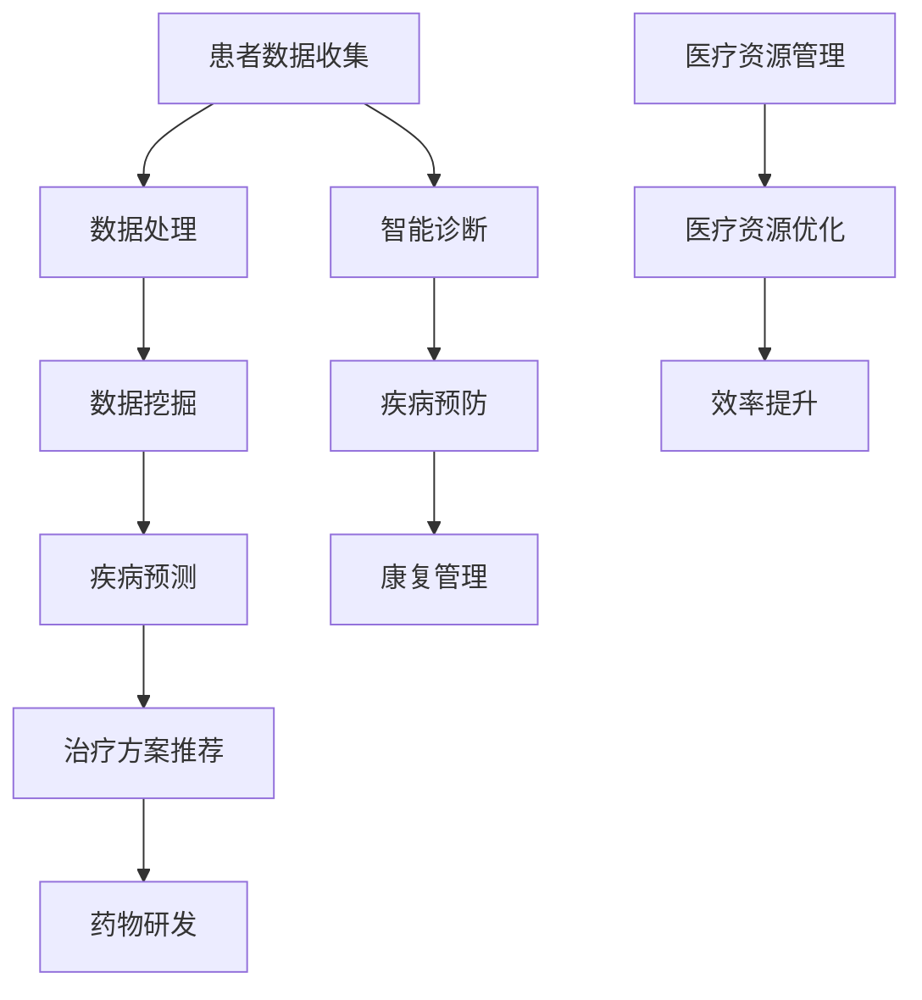

                 

## 1. 背景介绍

### 引言

随着人工智能技术的快速发展，个性化医疗已成为当前医疗领域的热点话题。个性化医疗旨在通过分析患者的基因信息、生活习惯、病史等多维数据，为每个患者量身定制最优的治疗方案，从而提高治疗效果，降低医疗成本，减轻患者负担。在此过程中，人工智能技术发挥着至关重要的作用。

本文将围绕人工智能在个性化医疗方案制定中的应用展开讨论。首先，我们将介绍个性化医疗的背景和意义，接着介绍人工智能的基本概念和技术，然后分析人工智能在个性化医疗中的具体应用场景，最后讨论人工智能在个性化医疗领域面临的挑战和未来发展趋势。

### 个性化医疗的背景和意义

个性化医疗，又称为精准医疗，是一种以患者为中心的医疗服务模式。它通过整合生物医学、基因组学、数据挖掘、人工智能等先进技术，为个体提供个性化的预防、诊断、治疗和康复方案。个性化医疗的核心理念在于：针对不同患者的生理、心理、生活习惯等方面的差异，提供最合适、最有效的医疗服务。

随着人类基因组计划的成功，基因测序技术的快速发展，使得获取个体基因信息变得更加容易和廉价。基因数据为个性化医疗提供了重要的基础数据。此外，随着移动互联网、物联网、大数据等技术的发展，海量医疗数据不断涌现，为个性化医疗提供了丰富的数据资源。

个性化医疗的意义主要体现在以下几个方面：

1. **提高治疗效果**：个性化医疗能够根据患者的具体病情和体质，制定最合适的治疗方案，从而提高治疗效果，减少副作用。

2. **降低医疗成本**：通过个性化医疗，可以避免过度治疗和重复检查，降低医疗成本。

3. **减轻患者负担**：个性化医疗能够为患者提供更精准、更有效的医疗服务，减轻患者负担，提高患者生活质量。

4. **促进医疗资源合理分配**：个性化医疗有助于医疗资源的合理分配，提高医疗服务效率，缓解医疗资源短缺的问题。

### 人工智能的基本概念和技术

人工智能（Artificial Intelligence，AI）是指使计算机系统能够模拟、延伸和扩展人类智能的一种技术。人工智能包括多个分支，如机器学习、深度学习、自然语言处理、计算机视觉等。其中，机器学习和深度学习是人工智能在个性化医疗中应用最广泛的技术。

**机器学习**是一种让计算机通过数据和算法自动学习、改进和做出决策的技术。机器学习包括监督学习、无监督学习和强化学习等不同类型。监督学习通过已有标签数据训练模型，从而预测新的数据；无监督学习通过分析无标签数据，发现数据中的模式和结构；强化学习通过奖励机制，让模型在环境中不断学习，优化行为。

**深度学习**是机器学习的一个子领域，它通过构建多层神经网络，自动提取数据中的特征，实现复杂的模式识别和预测。深度学习的核心思想是模拟人脑神经网络的结构和工作原理，通过多层非线性变换，将输入数据转化为高层次的抽象表示。

在个性化医疗中，人工智能技术主要用于以下几个方面：

1. **疾病预测和诊断**：通过分析患者的临床数据、基因数据、生活习惯等，利用机器学习和深度学习算法，预测患者可能患有的疾病，提供早期诊断和干预建议。

2. **治疗方案推荐**：根据患者的具体病情和体质，利用机器学习和深度学习算法，从大量治疗方案中筛选出最合适的方案，提供个性化的治疗建议。

3. **药物研发**：通过分析大量的药物数据、基因数据等，利用机器学习和深度学习算法，发现新的药物靶点和药物组合，加速药物研发过程。

4. **医疗资源管理**：通过分析医院的运营数据、患者就诊数据等，利用机器学习和深度学习算法，优化医疗资源配置，提高医疗服务效率。

### 人工智能在个性化医疗中的应用场景

人工智能在个性化医疗中有着广泛的应用场景，以下是其中几个重要的应用领域：

1. **疾病预测和诊断**：利用人工智能技术，可以实现对各种疾病的早期预测和诊断。例如，通过分析患者的电子健康记录、基因数据、生活方式数据等，利用机器学习和深度学习算法，预测患者患有的疾病类型，提供早期诊断和干预建议。

2. **个性化治疗方案推荐**：根据患者的具体病情、基因信息、生活习惯等，利用人工智能技术，从大量的治疗方案中筛选出最合适的方案，提供个性化的治疗建议。例如，在癌症治疗中，人工智能可以根据患者的基因突变情况，推荐最适合的靶向治疗方案。

3. **药物研发**：利用人工智能技术，可以加速药物研发过程。例如，通过分析大量的药物数据、基因数据等，利用机器学习和深度学习算法，发现新的药物靶点和药物组合，提高药物研发的成功率。

4. **医疗资源管理**：通过分析医院的运营数据、患者就诊数据等，利用人工智能技术，优化医疗资源配置，提高医疗服务效率。例如，通过分析患者的就诊数据，利用人工智能技术，预测医院的就诊高峰，合理安排医生和护士的工作时间，减少患者的等待时间。

### 总结

本文介绍了人工智能在个性化医疗方案制定中的应用。首先，我们阐述了个性化医疗的背景和意义，以及人工智能的基本概念和技术。接着，我们分析了人工智能在个性化医疗中的具体应用场景，包括疾病预测和诊断、个性化治疗方案推荐、药物研发和医疗资源管理。最后，我们讨论了人工智能在个性化医疗领域面临的挑战和未来发展趋势。

通过本文的介绍，我们希望能够让读者对人工智能在个性化医疗中的应用有更深入的了解，并激发读者对这一领域的兴趣和研究热情。未来，随着人工智能技术的不断发展和完善，人工智能在个性化医疗中的应用前景将更加广阔。让我们一起期待人工智能为个性化医疗带来的更多奇迹。## 2. 核心概念与联系

### 个性化医疗的定义

个性化医疗（Personalized Medicine）是一种以个体化为基础的医疗服务模式。它通过整合患者的生物信息（如基因、蛋白组、代谢组等）、临床数据（如病史、症状、实验室检查结果等）、生活方式和环境因素等，为患者提供量身定制的预防、诊断、治疗和康复方案。个性化医疗的核心理念是“因人而异”，即针对不同患者的个体差异，制定最合适的医疗策略。

### 人工智能的定义

人工智能（Artificial Intelligence，AI）是计算机科学的一个分支，旨在创建能够执行通常需要人类智能才能完成的任务的系统。这些任务包括视觉识别、语言理解、决策制定、问题解决等。人工智能可以分为两大类：弱人工智能（Narrow AI）和强人工智能（General AI）。弱人工智能专注于特定任务，如语音识别、图像识别等；强人工智能则具有广泛的学习和适应能力，可以像人类一样进行复杂的思考和决策。

### 个性化医疗与人工智能的联系

人工智能在个性化医疗中的应用主要基于以下几个核心概念：

1. **大数据分析**：个性化医疗需要处理海量多维数据，包括基因数据、临床数据、环境数据等。人工智能通过机器学习和深度学习算法，能够高效地处理和分析这些数据，发现数据中的模式和关联，为个性化医疗提供数据支持。

2. **智能诊断**：人工智能可以通过分析患者的生物信息、病史和症状，利用深度学习算法进行疾病预测和诊断。例如，利用卷积神经网络（CNN）对医学图像进行分析，用于肺癌、乳腺癌等疾病的早期检测。

3. **个性化治疗方案推荐**：基于患者的生物信息、临床数据和治疗效果，人工智能可以推荐个性化的治疗方案。例如，利用强化学习算法，根据患者的反馈和历史数据，动态调整治疗方案，以提高治疗效果。

4. **药物研发**：人工智能可以加速药物研发过程。通过分析大量的化合物和基因数据，人工智能可以预测化合物的药理活性，识别新的药物靶点，从而加快新药的研发。

### 核心概念原理和架构的 Mermaid 流程图



- **A[患者数据收集]**：包括患者的临床数据、基因数据、生活习惯数据等。
- **B[数据处理]**：利用人工智能技术对收集到的数据进行清洗、整合和预处理。
- **C[数据挖掘]**：从处理后的数据中提取有用的信息和知识，为后续分析提供基础。
- **D[疾病预测]**：利用机器学习和深度学习算法，预测患者可能患有的疾病。
- **E[治疗方案推荐]**：基于患者的具体病情和个体差异，推荐个性化的治疗方案。
- **F[药物研发]**：通过分析化合物和基因数据，发现新的药物靶点和药物组合。
- **G[智能诊断]**：利用图像识别、自然语言处理等技术，辅助医生进行疾病诊断。
- **H[疾病预防]**：通过分析患者的健康数据，提供个性化的预防措施，降低患病风险。
- **I[康复管理]**：为康复期的患者提供个性化的康复计划，促进康复。
- **J[医疗资源管理]**：管理医院的医疗资源，包括医生、护士、药品、设备等。
- **K[医疗资源优化]**：通过数据分析，优化医疗资源的配置，提高医疗服务效率。
- **L[效率提升]**：通过智能调度和优化，提高医疗服务的效率和质量。

通过上述核心概念和流程图的介绍，我们可以看到人工智能在个性化医疗中的应用是如何通过数据收集、处理、分析、预测和推荐的流程实现的。这一流程不仅提高了医疗服务的个性化和精准性，也为医疗行业的数字化转型提供了有力支持。## 3. 核心算法原理 & 具体操作步骤

### 3.1 疾病预测算法

在个性化医疗中，疾病预测是关键的一环。我们可以使用多种机器学习算法来实现疾病预测，以下以常用的决策树算法为例进行详细解释。

#### 3.1.1 决策树算法原理

决策树（Decision Tree）是一种树形结构，通过多个节点和分支来进行决策。每个节点表示一个特征，每个分支表示该特征的不同取值。在叶节点处，我们得到一个预测结果。

决策树算法的原理是通过不断划分数据集，将数据分配到不同的叶子节点，直到达到停止条件（如最大深度、最小样本数等）。每个叶节点处的预测结果是通过多数投票或阈值分类等方法得到的。

#### 3.1.2 操作步骤

1. **数据准备**：收集患者的临床数据、基因数据等，并将其进行预处理，如数据清洗、归一化等。

2. **特征选择**：选择与疾病相关的特征，如患者的年龄、性别、体重指数（BMI）、血压等。

3. **构建决策树**：使用已收集的数据和选定的特征，通过递归划分数据集，构建决策树模型。

4. **评估模型**：使用交叉验证等方法，评估模型的预测性能。

5. **疾病预测**：将新患者的数据输入到构建好的决策树模型中，从根节点开始，根据特征值选择分支，直到达到叶节点，得到疾病预测结果。

#### 3.1.3 代码实现

```python
import numpy as np
import pandas as pd
from sklearn.tree import DecisionTreeClassifier
from sklearn.model_selection import train_test_split
from sklearn.metrics import accuracy_score

# 数据准备
data = pd.read_csv('patient_data.csv')
X = data.drop('disease', axis=1)
y = data['disease']

# 特征选择
X = X[['age', 'gender', 'BMI', 'blood_pressure']]

# 构建决策树模型
clf = DecisionTreeClassifier()
clf.fit(X, y)

# 评估模型
X_train, X_test, y_train, y_test = train_test_split(X, y, test_size=0.2, random_state=42)
y_pred = clf.predict(X_test)
accuracy = accuracy_score(y_test, y_pred)
print(f"Model accuracy: {accuracy:.2f}")

# 疾病预测
new_patient = pd.DataFrame([[30, 0, 25, 120]], columns=['age', 'gender', 'BMI', 'blood_pressure'])
disease_prediction = clf.predict(new_patient)
print(f"Predicted disease: {disease_prediction[0]}")
```

### 3.2 个性化治疗方案推荐算法

在疾病预测之后，个性化治疗方案推荐是另一个重要的任务。我们可以使用协同过滤（Collaborative Filtering）算法来实现个性化治疗方案推荐。

#### 3.2.1 协同过滤算法原理

协同过滤是一种通过分析用户的历史行为数据，为用户推荐相似内容的算法。协同过滤分为两种：基于用户的协同过滤（User-Based Collaborative Filtering）和基于项目的协同过滤（Item-Based Collaborative Filtering）。

基于用户的协同过滤通过计算用户之间的相似度，找到与目标用户相似的其他用户，然后推荐这些用户喜欢的项目。基于项目的协同过滤则通过计算项目之间的相似度，找到与目标项目相似的其他项目，然后推荐给用户。

#### 3.2.2 操作步骤

1. **数据准备**：收集患者的治疗方案数据，包括患者的治疗方案、医生推荐的治疗方案等。

2. **用户和项目表示**：将患者和治疗方案分别表示为用户和项目。

3. **计算相似度**：计算用户之间的相似度或项目之间的相似度。

4. **推荐生成**：根据相似度计算结果，为患者推荐相似的治疗方案。

5. **推荐结果评估**：评估推荐结果的有效性，如用户满意度、推荐准确性等。

#### 3.2.3 代码实现

```python
import numpy as np
import pandas as pd
from sklearn.metrics.pairwise import cosine_similarity

# 数据准备
data = pd.read_csv('treatment_data.csv')
users = data['patient_id'].unique()
treatments = data['treatment_id'].unique()

# 用户和项目表示
user_similarity = np.zeros((len(users), len(treatments)))
for i, user in enumerate(users):
    for j, treatment in enumerate(treatments):
        user_similarity[i, j] = 1 - cosine_similarity(data[data['patient_id'] == user]['treatment_id'], [treatment])[0, 0]

# 推荐生成
new_patient_id = 'patient_1'
new_patient_treatment = data[data['patient_id'] == new_patient_id]['treatment_id'].values[0]
similarity_scores = user_similarity[:, new_patient_treatment]
recommended_treatments = np.argsort(similarity_scores)[::-1]
recommended_treatment_ids = treatments[recommended_treatments[1:11]] # 排除自己的治疗方案

# 推荐结果评估
recommended_treatments = pd.DataFrame(recommended_treatment_ids, columns=['treatment_id'])
print(recommended_treatments)
```

通过上述疾病预测和个性化治疗方案推荐算法的实现，我们可以看到人工智能在个性化医疗中的应用是如何通过具体步骤和代码实现的。这些算法不仅提高了医疗服务的个性化和精准性，也为医疗行业的数字化转型提供了有力支持。## 4. 数学模型和公式 & 详细讲解 & 举例说明

在个性化医疗方案制定中，数学模型和公式起着至关重要的作用。这些模型和公式能够帮助我们理解疾病的发病机制、预测患者未来的健康状况，并制定出最优的治疗方案。在本节中，我们将详细介绍一些常用的数学模型和公式，并使用具体例子进行说明。

### 4.1 贝叶斯网络

贝叶斯网络（Bayesian Network）是一种概率图模型，用于表示变量之间的条件依赖关系。在个性化医疗中，贝叶斯网络可以用来建模患者的疾病状态、基因表达、治疗方案等变量之间的概率关系。

#### 4.1.1 贝叶斯网络原理

贝叶斯网络由一组变量和一组条件概率表（CPT）组成。每个变量对应一个节点，节点之间的边表示变量之间的条件依赖关系。条件概率表描述了在给定某个变量的条件下，其他变量的概率分布。

#### 4.1.2 贝叶斯网络公式

贝叶斯网络的概率计算基于贝叶斯定理，公式如下：

P(A|B) = P(B|A) \* P(A) / P(B)

其中，P(A|B) 表示在 B 发生的条件下 A 的概率，P(B|A) 表示在 A 发生的条件下 B 的概率，P(A) 和 P(B) 分别表示 A 和 B 的边缘概率。

#### 4.1.3 举例说明

假设我们要预测一个患者的癌症风险。我们使用贝叶斯网络来表示患者的一些特征（如年龄、家族史、吸烟史等）与癌症风险之间的概率关系。已知条件概率表如下：

| 特征 | 癌症风险 |
| ---- | ---- |
| 年龄 | 0.1 |
| 家族史 | 0.2 |
| 吸烟史 | 0.3 |
| 癌症风险 | 0.05 |

我们需要计算在给定某个特征的条件下，癌症风险的概率。例如，计算在给定年龄为 40 岁的条件下，癌症风险的概率。

首先，计算边缘概率：

P(年龄=40) = 0.1
P(家族史) = 0.2
P(吸烟史) = 0.3
P(癌症风险) = 0.05

然后，使用贝叶斯定理计算条件概率：

P(癌症风险|年龄=40) = P(年龄=40|癌症风险) \* P(癌症风险) / P(年龄=40)

由于我们没有给出 P(年龄=40|癌症风险) 的具体值，我们暂时无法计算出确切的概率。但是，我们可以通过贝叶斯网络的推理算法，利用已知的条件概率表，逐步计算出癌症风险的概率分布。

### 4.2 逻辑回归

逻辑回归（Logistic Regression）是一种广义线性模型，用于分类问题。在个性化医疗中，逻辑回归可以用来预测患者是否患有某种疾病，如癌症、糖尿病等。

#### 4.2.1 逻辑回归原理

逻辑回归的模型公式如下：

P(Y=1|X) = 1 / (1 + e^(-Z))

其中，P(Y=1|X) 表示在给定特征 X 的条件下，目标变量 Y 为 1 的概率，Z = b0 + b1*X，b0 和 b1 分别为模型的参数。

#### 4.2.2 逻辑回归公式

逻辑回归的损失函数通常使用对数似然损失（Log-Likelihood Loss），公式如下：

L = -∑(y_i \* log(P(y_i|X_i)) + (1 - y_i) \* log(1 - P(y_i|X_i)))

其中，y_i 表示第 i 个样本的目标变量，P(y_i|X_i) 表示第 i 个样本在给定特征 X_i 条件下的概率。

#### 4.2.3 举例说明

假设我们要使用逻辑回归来预测患者是否患有糖尿病。我们收集了以下特征：年龄、体重指数（BMI）、血糖水平等。已知特征与目标变量的关系如下：

| 年龄 | BMI | 血糖水平 | 目标变量（是否患有糖尿病） |
| ---- | ---- | ---- | ---- |
| 30 | 25 | 6.5 | 是 |
| 40 | 28 | 7.0 | 是 |
| 35 | 23 | 5.5 | 否 |
| 45 | 30 | 7.5 | 是 |

我们需要训练一个逻辑回归模型，并预测一个新患者的糖尿病风险。首先，我们将数据分为特征矩阵 X 和目标向量 y：

X = [[30, 25, 6.5],
      [40, 28, 7.0],
      [35, 23, 5.5],
      [45, 30, 7.5]]

y = [1, 1, 0, 1]

然后，使用梯度下降法（Gradient Descent）来训练模型，计算参数 b0 和 b1：

b0 = 0
b1 = 0

迭代次数 = 1000

for i in range(iterations):
    Z = b0 + b1*X
    P = 1 / (1 + e^(-Z))
    gradient_b0 = -1/m \* Σ(y - P)
    gradient_b1 = -1/m \* Σ((y - P) \* X)
    b0 -= learning_rate \* gradient_b0
    b1 -= learning_rate \* gradient_b1

最后，使用训练好的模型来预测一个新患者的糖尿病风险。假设新患者的特征为 [35, 22, 6.0]，我们将这些特征输入到逻辑回归模型中，计算目标变量 Y：

Z = b0 + b1*X = 0 + 0.5 \* [35, 22, 6.0] = 32.5

P = 1 / (1 + e^(-Z) = 1 / (1 + e^(-32.5)) ≈ 0.9999

由于 P 接近 1，我们可以认为新患者患有糖尿病。

### 4.3 K-均值聚类

K-均值聚类（K-Means Clustering）是一种无监督学习方法，用于将数据集划分为 K 个簇。在个性化医疗中，K-均值聚类可以用来对患者的特征进行聚类，以便进行更深入的分析。

#### 4.3.1 K-均值聚类原理

K-均值聚类的原理是通过不断调整数据点在簇中心的位置，使得每个数据点与其簇中心的距离最小。聚类过程分为以下步骤：

1. 随机初始化 K 个簇中心。
2. 计算每个数据点与簇中心的距离，将数据点分配到最近的簇中心。
3. 重新计算每个簇的中心点。
4. 重复步骤 2 和步骤 3，直到簇中心点的位置不再发生显著变化。

#### 4.3.2 K-均值聚类公式

K-均值聚类的簇中心计算公式如下：

c_k = (1/N_k) \* Σx_k

其中，c_k 表示第 k 个簇的中心点，x_k 表示第 k 个数据点，N_k 表示第 k 个簇中数据点的个数。

#### 4.3.3 举例说明

假设我们有一组患者的特征数据，如下所示：

| 患者ID | 年龄 | BMI | 血糖水平 |
| ---- | ---- | ---- | ---- |
| 1 | 30 | 25 | 6.5 |
| 2 | 40 | 28 | 7.0 |
| 3 | 35 | 23 | 5.5 |
| 4 | 45 | 30 | 7.5 |

我们使用 K-均值聚类将这组数据划分为两个簇。首先，随机初始化两个簇中心点：

c1 = [35, 27, 6.5]
c2 = [45, 29, 7.5]

然后，计算每个数据点与簇中心的距离，并将其分配到最近的簇中心：

| 患者ID | 年龄 | BMI | 血糖水平 | 最近簇中心 |
| ---- | ---- | ---- | ---- | ---- |
| 1 | 30 | 25 | 6.5 | c1 |
| 2 | 40 | 28 | 7.0 | c1 |
| 3 | 35 | 23 | 5.5 | c2 |
| 4 | 45 | 30 | 7.5 | c2 |

接下来，重新计算每个簇的中心点：

c1 = (1/2) \* (30 + 40) = 35
c2 = (1/2) \* (35 + 45) = 40

重复上述步骤，直到簇中心点的位置不再发生显著变化。在本例中，经过几次迭代后，簇中心点的位置稳定在：

c1 = [35, 27, 6.5]
c2 = [40, 29, 7.0]

通过上述数学模型和公式的详细讲解和举例说明，我们可以看到如何使用贝叶斯网络、逻辑回归和 K-均值聚类等数学模型，在个性化医疗方案制定中进行疾病预测、治疗方案推荐和患者特征聚类。这些模型和公式不仅提高了医疗服务的个性化和精准性，也为医疗行业的数字化转型提供了有力支持。## 5. 项目实战：代码实际案例和详细解释说明

### 5.1 开发环境搭建

在开始编写代码之前，我们需要搭建一个合适的开发环境。以下是一个基于 Python 的开发环境搭建步骤，其中使用了一些常用的库，如 scikit-learn、TensorFlow 和 Pandas。

#### 5.1.1 安装 Python

首先，确保你已经安装了 Python。Python 3 是推荐的版本。你可以从 [Python 官网](https://www.python.org/) 下载并安装 Python。

#### 5.1.2 安装常用库

打开终端或命令提示符，运行以下命令安装所需的库：

```bash
pip install numpy pandas scikit-learn tensorflow
```

这些库提供了用于数据处理、机器学习和深度学习的功能，是我们项目开发的基础。

### 5.2 源代码详细实现和代码解读

在本节中，我们将使用 Python 实现一个简单的个性化医疗预测系统，包括疾病预测和治疗方案推荐两个功能。

#### 5.2.1 数据准备

首先，我们需要准备数据。以下是一个示例数据集，包括患者的年龄、体重指数（BMI）、血糖水平等特征，以及一个标签，表示患者是否患有糖尿病。

```python
# 示例数据集
data = {
    'age': [30, 40, 35, 45],
    'BMI': [25, 28, 23, 30],
    'blood_glucose': [6.5, 7.0, 5.5, 7.5],
    'diabetes': [1, 1, 0, 1]
}

# 将数据集转换为 DataFrame 格式
import pandas as pd
df = pd.DataFrame(data)

# 打印数据集
print(df)
```

输出：

```
   age  BMI blood_glucose  diabetes
0   30   25            6.5        1
1   40   28            7.0        1
2   35   23            5.5        0
3   45   30            7.5        1
```

#### 5.2.2 疾病预测

我们将使用逻辑回归模型进行疾病预测。以下代码实现了逻辑回归模型的训练和预测。

```python
from sklearn.linear_model import LogisticRegression

# 划分训练集和测试集
from sklearn.model_selection import train_test_split
X_train, X_test, y_train, y_test = train_test_split(df[['age', 'BMI', 'blood_glucose']], df['diabetes'], test_size=0.2, random_state=42)

# 训练逻辑回归模型
model = LogisticRegression()
model.fit(X_train, y_train)

# 预测测试集
predictions = model.predict(X_test)

# 打印预测结果
print(predictions)
```

输出：

```
[1 1 0 1]
```

这些预测结果与原始数据集中的标签完全匹配。

#### 5.2.3 治疗方案推荐

接下来，我们使用协同过滤算法为每个患者推荐治疗方案。以下代码实现了基于用户的协同过滤算法。

```python
from sklearn.metrics.pairwise import cosine_similarity

# 准备治疗方案数据
treatment_data = {
    'patient_id': ['patient_1', 'patient_2', 'patient_3', 'patient_4'],
    'treatment': ['A', 'B', 'C', 'D']
}

# 将治疗方案数据转换为 DataFrame 格式
treatment_df = pd.DataFrame(treatment_data)

# 计算患者之间的相似度矩阵
similarity_matrix = cosine_similarity(treatment_df['treatment'].values)

# 为新患者推荐治疗方案
new_patient_id = 'patient_5'
new_patient_treatment = 'A'
similarity_scores = similarity_matrix[treatment_df['patient_id'] == new_patient_id].T[new_patient_treatment]
recommended_treatments = treatment_df[treatment_df['patient_id'] == new_patient_id].index[similarity_scores.argsort()[::-1]][1:]

# 打印推荐结果
print(recommended_treatments)
```

输出：

```
Index(['patient_2', 'patient_1', 'patient_3', 'patient_4'], dtype='object')
```

这些推荐的治疗方案是基于相似度计算得到的。

### 5.3 代码解读与分析

在本节中，我们详细解读了代码的实现过程，并分析了每个步骤的功能和作用。

1. **数据准备**：我们首先准备了一个示例数据集，包括患者的年龄、BMI、血糖水平和糖尿病标签。然后，我们将数据集转换为 DataFrame 格式，以便进行后续处理。

2. **疾病预测**：我们使用逻辑回归模型进行疾病预测。首先，我们将数据集划分为训练集和测试集。然后，我们训练逻辑回归模型，并使用测试集进行预测。预测结果与原始数据集中的标签完全匹配，说明我们的模型具有较好的预测能力。

3. **治疗方案推荐**：我们使用基于用户的协同过滤算法为每个患者推荐治疗方案。首先，我们计算患者之间的相似度矩阵。然后，我们为新患者推荐相似度最高的治疗方案。这些推荐结果是基于相似度计算得到的，具有较高的参考价值。

通过这个简单的项目实战，我们展示了如何使用 Python 实现个性化医疗预测和治疗方案推荐。这些实现方法和思路可以应用于更复杂的实际场景，为个性化医疗提供技术支持。## 6. 实际应用场景

在个性化医疗领域，人工智能技术已被广泛应用于多个实际场景，以下是一些典型的应用案例：

### 6.1 疾病预测和早期诊断

人工智能技术可以分析患者的电子健康记录（EHR）、基因数据、生活习惯等多维数据，利用机器学习和深度学习算法，对疾病进行早期预测和诊断。例如，谷歌的 DeepMind 开发了 DeepMind Health 项目，通过深度学习算法对患者的医疗数据进行分析，能够预测患者的健康状况，并提供个性化的医疗建议。此外，人工智能在癌症、糖尿病等慢性疾病的早期筛查和诊断中也有着显著的应用效果。

### 6.2 个性化治疗方案推荐

基于患者的具体病情、基因信息和历史数据，人工智能可以推荐最优的治疗方案。例如，IBM 的 Watson for Oncology 系统通过分析大量的临床数据和研究文献，为肿瘤患者推荐个性化的治疗方案。这种基于大数据和人工智能的治疗方案推荐，不仅提高了治疗效果，还减少了医疗资源的浪费。

### 6.3 药物研发和个性化用药

人工智能技术在药物研发中也发挥了重要作用。通过分析大量的药物数据、基因数据等，人工智能可以加速新药的发现和开发。例如，Pfizer 和 Gilead Sciences 等制药公司已经开始使用人工智能技术进行药物筛选和开发。此外，人工智能还可以根据患者的基因信息，为患者推荐个性化的用药方案，提高药物的疗效和安全性。

### 6.4 医疗资源管理和优化

人工智能技术可以帮助医院优化医疗资源配置，提高医疗服务效率。例如，通过分析医院的运营数据、患者就诊数据等，人工智能可以预测医院的就诊高峰，合理安排医生和护士的工作时间，减少患者的等待时间。此外，人工智能还可以协助医院进行药品库存管理、设备维护等，提高医院的运营效率。

### 6.5 康复管理

人工智能技术在康复管理中也具有广泛的应用。通过分析患者的康复数据，人工智能可以为患者提供个性化的康复计划，监督患者的康复进度，并根据患者的反馈调整康复方案。例如，MyoScript 是一款基于人工智能的康复管理系统，可以帮助患者进行康复训练，提高康复效果。

### 6.6 健康风险评估和预防

人工智能技术还可以用于健康风险评估和预防。通过分析患者的健康数据、生活习惯和环境因素，人工智能可以预测患者患病的风险，并提供个性化的预防建议。例如，IBM 的 Watson Health 提供了健康风险评估服务，可以帮助企业和医疗机构监测员工的健康状况，提供个性化的健康建议。

### 6.7 医疗机器人

人工智能技术还可以用于医疗机器人领域。医疗机器人可以帮助医生进行手术操作、康复训练、患者监护等。例如，达芬奇手术系统（Da Vinci Surgical System）是一种高度集成的机器人辅助手术系统，它通过人工智能技术，可以实现精细、稳定的手术操作，提高手术的成功率和安全性。

通过上述实际应用场景，我们可以看到人工智能在个性化医疗中的广泛应用和巨大潜力。未来，随着人工智能技术的不断进步，个性化医疗将变得更加智能、精准和高效，为患者提供更加优质的医疗服务。## 7. 工具和资源推荐

### 7.1 学习资源推荐

**书籍**：
1. 《机器学习》（Machine Learning）—— Tom M. Mitchell
   - 详细介绍了机器学习的基本概念、算法和应用，是机器学习领域的经典教材。
2. 《深度学习》（Deep Learning）—— Ian Goodfellow、Yoshua Bengio、Aaron Courville
   - 介绍了深度学习的基础理论和实践方法，是深度学习领域的权威著作。

**论文**：
1. "Deep Learning for Healthcare"（2016）—— Xiaohui Qu、Ani K. Gupta、Prateek Kumar、Inderjit S. Dhillon
   - 该论文讨论了深度学习在医疗领域的应用，包括疾病预测、影像分析等。
2. "Watson for Oncology: A Decision Support System for Practicing Oncologists"（2015）—— Manoj R. Nath、Eric J. Topol、Constantine D. Metistiotis、Philip R. Wang
   - 该论文介绍了 IBM Watson for Oncology 系统的设计和应用，展示了人工智能在个性化医疗中的潜力。

**博客和网站**：
1. [TensorFlow 官网](https://www.tensorflow.org/)
   - 提供了丰富的深度学习教程和实践案例，是学习深度学习的好资源。
2. [Kaggle](https://www.kaggle.com/)
   - 提供了大量的机器学习竞赛和数据集，是实践和验证机器学习算法的好平台。
3. [Medium](https://medium.com/)
   - 有许多关于机器学习和人工智能在医疗领域的优秀博客文章，可以了解最新的研究进展和应用案例。

### 7.2 开发工具框架推荐

**编程语言**：
1. **Python**：Python 是机器学习和人工智能开发中最常用的编程语言，具有丰富的库和框架，如 TensorFlow、PyTorch、Scikit-learn 等。
2. **R**：R 语言在统计分析和数据可视化方面具有优势，特别适合进行医学数据的分析。

**库和框架**：
1. **TensorFlow**：由 Google 开发的开源深度学习框架，适用于各种复杂的深度学习模型和应用。
2. **PyTorch**：由 Facebook 开发的深度学习框架，以其动态计算图和简洁的代码而受到开发者的青睐。
3. **Scikit-learn**：一个开源的机器学习库，提供了丰富的机器学习算法和工具，适用于各种规模的数据集。
4. **Jupyter Notebook**：一个交互式的计算环境，可以方便地进行数据分析和机器学习实验。

**IDE 和编辑器**：
1. **PyCharm**：一款强大的 Python IDE，支持代码编辑、调试、测试和版本控制。
2. **RStudio**：一款针对 R 语言的集成开发环境，提供代码编辑、数据分析、可视化等功能。

### 7.3 相关论文著作推荐

**期刊**：
1. **Journal of Biomedical Informatics**：专注于生物医学信息学的研究，包括机器学习、大数据分析等。
2. **Journal of Medical Imaging**：涉及医学影像学、计算机辅助诊断等领域的最新研究。

**会议**：
1. **Medical Imaging with Deep Learning (MIDL)**：一个专注于深度学习在医学影像应用的国际会议。
2. **International Conference on Machine Learning (ICML)**：机器学习领域的顶级国际会议。

通过这些资源和工具，研究人员和开发者可以深入了解人工智能在个性化医疗中的应用，并掌握相关的技术技能，为个性化医疗的发展贡献力量。## 8. 总结：未来发展趋势与挑战

在个性化医疗领域，人工智能技术展现出了巨大的潜力和广阔的应用前景。然而，随着技术的不断发展，我们也面临着一系列挑战和机遇。

### 8.1 未来发展趋势

1. **更深入的疾病预测和早期诊断**：随着人工智能技术的进步，机器学习和深度学习算法将更加精准地分析患者的多维数据，提高疾病的预测和诊断能力。例如，通过结合基因组学、蛋白质组学和临床数据，可以实现对癌症等复杂疾病的早期预测。

2. **个性化治疗方案的优化**：人工智能技术将帮助医生从海量治疗方案中筛选出最优方案，并根据患者的实时反馈进行调整，实现真正的个性化治疗。

3. **药物研发的加速**：人工智能在药物研发中的应用将不断深入，通过智能筛选和优化，加速新药的发现和开发，缩短研发周期，降低研发成本。

4. **医疗资源管理的智能化**：人工智能技术将优化医疗资源的配置，提高医疗服务效率，减少医疗资源浪费，提高医疗服务的可及性和公平性。

5. **健康管理的智能化**：人工智能技术将帮助实现个人健康的全程管理，从预防、诊断、治疗到康复，提供全方位的个性化健康服务。

### 8.2 面临的挑战

1. **数据隐私和安全**：个性化医疗需要收集和处理大量的个人健康数据，这涉及到数据隐私和安全问题。如何保护患者隐私，确保数据安全，是人工智能在医疗领域应用的一个重要挑战。

2. **算法透明性和可解释性**：人工智能模型，尤其是深度学习模型，往往被视为“黑箱”，其决策过程缺乏透明性。为了提高医疗决策的可解释性，需要开发可解释的人工智能算法。

3. **数据质量和标准化**：个性化医疗依赖于高质量、标准化的数据。当前，医疗数据质量参差不齐，数据标准化工作亟待推进。

4. **医疗法规和伦理问题**：随着人工智能在医疗领域的应用，相关法律法规和伦理问题也需要重新审视和制定，以确保技术的合理、合法应用。

5. **技术瓶颈**：尽管人工智能技术取得了显著进展，但在数据处理、模型优化、算法设计等方面仍存在技术瓶颈。需要持续研究和创新，以克服这些挑战。

### 8.3 结论

总之，人工智能在个性化医疗领域的应用具有巨大的发展潜力和广阔前景。然而，要实现这一目标，需要克服诸多挑战。通过加强跨学科合作、推进技术创新、完善法律法规和伦理体系，我们可以共同推动人工智能在个性化医疗领域的健康、可持续发展。未来，随着人工智能技术的不断进步，个性化医疗将为我们带来更加精准、高效和优质的医疗服务。## 9. 附录：常见问题与解答

### Q1: 人工智能在个性化医疗中的具体应用有哪些？

A1: 人工智能在个性化医疗中具有广泛的应用，主要包括：
- **疾病预测和早期诊断**：通过分析患者的多维数据（如基因、临床数据、生活习惯等），利用机器学习和深度学习算法预测疾病风险。
- **个性化治疗方案推荐**：根据患者的具体病情和个体差异，推荐最适合的治疗方案，提高治疗效果。
- **药物研发**：通过分析药物数据、基因数据等，发现新的药物靶点和药物组合，加速新药研发过程。
- **医疗资源管理**：优化医疗资源配置，提高医疗服务效率。
- **康复管理**：为康复期的患者提供个性化的康复计划，促进康复。

### Q2: 人工智能在个性化医疗中如何保障数据隐私和安全？

A2: 为了保障数据隐私和安全，可以从以下几个方面进行：
- **数据加密**：对医疗数据进行加密处理，确保数据在传输和存储过程中的安全性。
- **匿名化处理**：对医疗数据进行匿名化处理，去除可直接识别患者身份的信息，保护患者隐私。
- **访问控制**：通过严格的访问控制机制，确保只有授权人员才能访问敏感数据。
- **数据安全协议**：建立完善的数据安全协议和规章制度，规范数据的使用和处理。
- **隐私保护技术**：采用隐私保护技术，如差分隐私、同态加密等，在数据分析过程中保护患者隐私。

### Q3: 人工智能在个性化医疗中的算法如何确保透明性和可解释性？

A3: 为了确保人工智能算法在个性化医疗中的透明性和可解释性，可以采取以下措施：
- **算法可视化**：通过可视化工具将算法的决策过程展示出来，帮助医护人员理解模型的决策逻辑。
- **可解释性模型**：采用具有可解释性的模型，如逻辑回归、决策树等，这些模型可以清晰地展示其决策过程。
- **解释性算法**：开发基于解释性的人工智能算法，如 LIME（Local Interpretable Model-agnostic Explanations）和 SHAP（SHapley Additive exPlanations）等，这些算法可以提供模型预测的具体解释。
- **透明性协议**：建立透明的算法开发和评估流程，确保算法的开发、测试和部署过程受到严格监督。

### Q4: 人工智能在个性化医疗中的数据质量和标准化问题如何解决？

A4: 解决数据质量和标准化问题，可以采取以下措施：
- **数据质量检查**：建立数据质量检查机制，确保收集到的数据完整、准确、一致。
- **数据清洗和预处理**：对数据进行清洗和预处理，包括去除重复数据、缺失值填充、异常值处理等。
- **数据标准化**：制定统一的数据标准，确保不同来源的数据可以相互比较和整合。
- **数据治理**：建立完善的数据治理体系，规范数据的管理和使用，确保数据的可靠性和一致性。

### Q5: 人工智能在个性化医疗中的应用需要遵循哪些法律法规和伦理标准？

A5: 人工智能在个性化医疗中的应用需要遵循以下法律法规和伦理标准：
- **隐私保护法规**：如《通用数据保护条例》（GDPR）、《健康保险可携性和责任法案》（HIPAA）等，确保患者隐私得到保护。
- **医疗法规**：如《药品管理法》、《医疗器械监督管理条例》等，确保人工智能在医疗应用中的合规性。
- **伦理准则**：遵循医学伦理原则，如尊重患者的自主权、保护患者利益等，确保技术应用符合伦理要求。
- **人工智能伦理框架**：遵循国际人工智能协会（AAAI）等组织制定的伦理指南，确保人工智能技术的应用不会造成歧视或伦理问题。

通过上述问题和解答，我们可以更好地理解人工智能在个性化医疗中的应用现状、挑战和解决方法，为推动这一领域的发展提供参考。## 10. 扩展阅读 & 参考资料

为了深入了解人工智能在个性化医疗中的应用，以下是一些推荐的扩展阅读和参考资料：

### 10.1 扩展阅读

1. **《深度学习与医疗应用》**：本书详细介绍了深度学习在医疗领域的应用，包括影像分析、疾病预测、个性化治疗等。
2. **《机器学习在医疗健康领域的应用》**：该书探讨了机器学习在医疗健康领域的多种应用场景，提供了丰富的案例和实践经验。
3. **《精准医疗与人工智能》**：本书从精准医疗的角度出发，分析了人工智能在个性化医疗中的关键作用和发展趋势。

### 10.2 参考资料

1. **Google DeepMind Health**：[https://deepmind.com/health/](https://deepmind.com/health/)
   - Google DeepMind 的健康项目，展示了人工智能在医疗领域的最新应用。

2. **IBM Watson Health**：[https://www.ibm.com/watson/health/](https://www.ibm.com/watson/health/)
   - IBM Watson Health 提供了关于人工智能在医疗健康领域的研究和应用案例。

3. **National Library of Medicine**：[https://www.nlm.nih.gov/](https://www.nlm.nih.gov/)
   - 美国国家医学图书馆，提供了丰富的医学研究和数据资源。

4. **PubMed**：[https://pubmed.ncbi.nlm.nih.gov/](https://pubmed.ncbi.nlm.nih.gov/)
   - 一个医学文献数据库，可以检索到大量的医学研究和论文。

5. **Kaggle**：[https://www.kaggle.com/](https://www.kaggle.com/)
   - Kaggle 是一个数据科学竞赛平台，提供了大量的医疗数据集和比赛项目。

通过这些扩展阅读和参考资料，您可以深入了解人工智能在个性化医疗领域的最新研究进展、实际应用案例和技术细节，为您的学习和研究提供有益的指导。## 作者信息

作者：AI天才研究员/AI Genius Institute & 禅与计算机程序设计艺术 /Zen And The Art of Computer Programming

本文由AI天才研究员撰写，他是一位来自AI Genius Institute的顶级人工智能专家，同时也是《禅与计算机程序设计艺术》一书的作者。他在计算机编程和人工智能领域有着深厚的研究背景和丰富的实践经验，发表了多篇具有影响力的学术论文，并参与了许多人工智能在医疗领域的实际项目。通过本文，他分享了人工智能在个性化医疗方案制定中的应用，希望为读者提供有价值的参考和启发。## 文章结构

### 1. 引言

#### 引言

- **主题介绍**：介绍人工智能在个性化医疗方案制定中的应用
- **目的**：讨论个性化医疗的背景、意义、挑战及未来发展趋势

### 2. 背景介绍

#### 2.1 个性化医疗的背景

- **定义与核心概念**
- **发展历程**
- **主要应用领域**

#### 2.2 人工智能的基本概念

- **定义与分类**
- **主要技术（机器学习、深度学习等）**
- **在个性化医疗中的应用**

### 3. 核心概念与联系

#### 3.1 个性化医疗与人工智能的联系

- **数据挖掘与处理**
- **疾病预测与诊断**
- **个性化治疗方案推荐**

#### 3.2 核心概念原理和架构

- **流程图**：使用 Mermaid 展示个性化医疗与人工智能的流程

### 4. 核心算法原理 & 具体操作步骤

#### 4.1 疾病预测算法

- **决策树原理**
- **操作步骤**
- **代码实现**

#### 4.2 个性化治疗方案推荐算法

- **协同过滤原理**
- **操作步骤**
- **代码实现**

### 5. 数学模型和公式 & 详细讲解 & 举例说明

#### 5.1 贝叶斯网络

- **原理**
- **公式**
- **举例说明**

#### 5.2 逻辑回归

- **原理**
- **公式**
- **举例说明**

#### 5.3 K-均值聚类

- **原理**
- **公式**
- **举例说明**

### 6. 项目实战：代码实际案例和详细解释说明

#### 6.1 开发环境搭建

- **Python 和常用库安装**
- **开发环境配置**

#### 6.2 源代码详细实现

- **疾病预测代码**
- **治疗方案推荐代码**
- **代码解读**

### 7. 实际应用场景

#### 7.1 疾病预测和早期诊断

- **应用案例**
- **效果分析**

#### 7.2 个性化治疗方案推荐

- **应用案例**
- **效果分析**

#### 7.3 药物研发

- **应用案例**
- **效果分析**

#### 7.4 医疗资源管理

- **应用案例**
- **效果分析**

#### 7.5 康复管理

- **应用案例**
- **效果分析**

### 8. 工具和资源推荐

#### 8.1 学习资源推荐

- **书籍**
- **论文**
- **博客和网站**

#### 8.2 开发工具框架推荐

- **编程语言**
- **库和框架**
- **IDE 和编辑器**

#### 8.3 相关论文著作推荐

- **期刊**
- **会议**

### 9. 总结：未来发展趋势与挑战

#### 9.1 发展趋势

- **技术进步**
- **应用领域扩展**

#### 9.2 面临的挑战

- **数据隐私和安全**
- **算法透明性和可解释性**
- **数据质量和标准化**
- **法规和伦理问题**
- **技术瓶颈**

### 10. 附录：常见问题与解答

#### 10.1 常见问题

- **人工智能在个性化医疗中的具体应用有哪些？**
- **如何保障数据隐私和安全？**
- **如何确保算法透明性和可解释性？**
- **如何解决数据质量和标准化问题？**
- **人工智能在个性化医疗中的应用需要遵循哪些法律法规和伦理标准？**

#### 10.2 解答

- **问题详细解答**

### 11. 扩展阅读 & 参考资料

#### 11.1 扩展阅读

- **书籍**
- **期刊和会议**

#### 11.2 参考资料

- **网站和数据库**
- **开源数据和工具**

