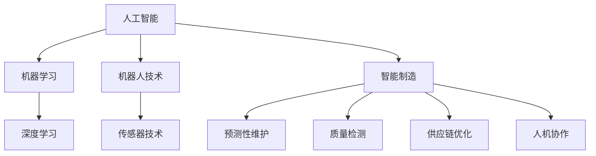

                 

# 人工智能在制造和自动化中的应用

> **关键词：** 人工智能、制造自动化、机器学习、机器人技术、智能制造、工业4.0、传感器技术

> **摘要：** 本文将探讨人工智能在制造和自动化中的应用，通过介绍核心概念、算法原理、数学模型、实战案例等，全面解析人工智能如何赋能制造业，提升生产效率和产品质量。文章还将分析实际应用场景，推荐相关工具和资源，并展望未来发展趋势与挑战。

## 1. 背景介绍

随着科技的快速发展，人工智能（AI）逐渐成为推动制造业变革的重要力量。传统的制造和自动化系统主要依赖于机械和电子技术，而人工智能的引入，使得制造过程更加智能化、自适应和灵活。人工智能在制造和自动化中的应用主要体现在以下几个方面：

- **智能制造**：通过人工智能技术，实现生产过程的自动化和智能化，提高生产效率和产品质量。

- **预测性维护**：利用机器学习算法，对设备进行实时监控和分析，预测设备故障，提前进行维护，减少停机时间和维护成本。

- **质量检测**：通过图像识别和自然语言处理等技术，对产品进行质量检测，提高产品质量和可靠性。

- **供应链优化**：利用人工智能算法，优化供应链管理，降低库存成本，提高供应链效率。

- **人机协作**：通过机器人技术，实现人与机器的协同工作，提高生产效率，降低劳动力成本。

## 2. 核心概念与联系

在探讨人工智能在制造和自动化中的应用之前，我们需要了解一些核心概念和它们之间的联系。以下是一个使用Mermaid绘制的流程图，展示了这些核心概念及其相互关系：



### 2.1 人工智能

人工智能是一门研究、开发用于模拟、延伸和扩展人的智能的理论、方法、技术及应用系统的学科。它包括多个子领域，如机器学习、深度学习、自然语言处理等。

### 2.2 机器学习

机器学习是人工智能的一个重要分支，通过使用算法，让计算机从数据中学习，自动改进和优化性能。常见的机器学习算法包括线性回归、决策树、神经网络等。

### 2.3 深度学习

深度学习是一种基于人工神经网络的机器学习技术，通过模拟人脑神经元之间的连接，实现复杂模式的识别和预测。深度学习在图像识别、语音识别等领域取得了显著成果。

### 2.4 机器人技术

机器人技术是指通过计算机科学、机械工程、电子工程等学科，研发出具有人类智能的机器人。机器人技术广泛应用于工业、医疗、家庭等领域。

### 2.5 传感器技术

传感器技术是指利用物理、化学、生物等原理，将各种非电学量转化为电学量，以便进行测量、检测和控制。传感器技术在智能制造、人机协作等领域发挥着重要作用。

### 2.6 智能制造

智能制造是一种基于人工智能、物联网、云计算等技术的制造模式，通过智能化、自适应和灵活的方式，实现生产过程的优化和升级。

### 2.7 预测性维护、质量检测、供应链优化、人机协作

这些概念都是智能制造的具体应用场景，通过人工智能技术，实现生产过程的自动化、智能化和高效化。

## 3. 核心算法原理 & 具体操作步骤

在了解核心概念后，我们接下来探讨人工智能在制造和自动化中的核心算法原理及其具体操作步骤。

### 3.1 机器学习算法

机器学习算法是人工智能的核心技术之一，以下是一些常见的机器学习算法及其应用场景：

- **线性回归**：用于预测连续值变量，如预测产量、销售额等。

- **决策树**：用于分类和回归任务，如产品分类、客户流失预测等。

- **支持向量机（SVM）**：用于分类任务，如垃圾邮件过滤、信用卡欺诈检测等。

- **神经网络**：用于复杂模式识别和预测，如图像识别、语音识别等。

具体操作步骤：

1. 数据预处理：对原始数据进行清洗、归一化等处理，以便于算法训练。

2. 算法选择：根据应用场景选择合适的算法。

3. 模型训练：使用训练数据对算法模型进行训练。

4. 模型评估：使用测试数据对模型性能进行评估。

5. 模型优化：根据评估结果对模型进行调整和优化。

### 3.2 深度学习算法

深度学习算法是机器学习的一个分支，具有强大的特征提取和模式识别能力。以下是一些常见的深度学习算法及其应用场景：

- **卷积神经网络（CNN）**：用于图像识别、目标检测等。

- **循环神经网络（RNN）**：用于序列数据处理，如时间序列预测、语音识别等。

- **生成对抗网络（GAN）**：用于生成逼真的图像、音频等。

具体操作步骤：

1. 数据预处理：对图像、音频等数据进行预处理，如归一化、裁剪、增强等。

2. 模型构建：根据应用场景构建深度学习模型。

3. 模型训练：使用训练数据进行模型训练。

4. 模型评估：使用测试数据进行模型评估。

5. 模型优化：根据评估结果对模型进行调整和优化。

### 3.3 机器人控制算法

机器人控制算法是机器人技术的核心，以下是一些常见的机器人控制算法及其应用场景：

- **PID控制**：用于位置、速度、加速度等控制任务。

- **模糊控制**：用于非线性、不确定系统的控制任务。

- **神经网络控制**：用于复杂系统的控制任务。

具体操作步骤：

1. 确定控制目标：根据应用场景确定控制目标，如位置、速度、加速度等。

2. 控制算法选择：根据控制目标和系统特性选择合适的控制算法。

3. 控制器设计：设计控制器，包括控制策略、参数调整等。

4. 控制器实现：实现控制器，包括硬件和软件设计。

5. 控制效果评估：对控制效果进行评估，如稳定性、响应速度等。

## 4. 数学模型和公式 & 详细讲解 & 举例说明

在人工智能算法中，数学模型和公式起着至关重要的作用。以下是一些常用的数学模型和公式及其详细讲解和举例说明：

### 4.1 线性回归

线性回归是一种用于预测连续值变量的机器学习算法，其数学模型如下：

$$y = \beta_0 + \beta_1x_1 + \beta_2x_2 + ... + \beta_nx_n + \epsilon$$

其中，$y$为预测值，$x_1, x_2, ..., x_n$为输入特征，$\beta_0, \beta_1, ..., \beta_n$为模型参数，$\epsilon$为误差项。

举例说明：

假设我们想要预测一家商店的月销售额（$y$）与广告支出（$x$）之间的关系，我们可以使用线性回归模型：

$$y = \beta_0 + \beta_1x + \epsilon$$

通过收集历史数据，我们可以估计模型参数$\beta_0$和$\beta_1$，从而预测未来的月销售额。

### 4.2 决策树

决策树是一种用于分类和回归任务的机器学习算法，其数学模型如下：

$$f(x) = \sum_{i=1}^{n} \beta_iI(A_i(x) = a_i)$$

其中，$f(x)$为预测值，$x$为输入特征，$A_i(x)$为第$i$个条件属性，$a_i$为条件属性的可能取值，$\beta_i$为模型参数。

举例说明：

假设我们要预测一个客户是否愿意购买我们的产品，我们可以使用决策树模型。首先，我们收集关于客户的信息，如年龄、收入、购买历史等，然后构建决策树模型，根据这些信息预测客户的购买意愿。

### 4.3 神经网络

神经网络是一种用于复杂模式识别和预测的机器学习算法，其数学模型如下：

$$f(x) = \sigma(\sum_{i=1}^{n} \beta_i \cdot \phi(x_i) + b)$$

其中，$f(x)$为预测值，$x$为输入特征，$\sigma$为激活函数，$\beta_i$为模型参数，$\phi(x_i)$为第$i$个神经元的活动函数，$b$为偏置。

举例说明：

假设我们要预测一家商店的月销售额（$y$）与广告支出（$x$）之间的关系，我们可以使用神经网络模型。首先，我们收集历史数据，包括销售额、广告支出等，然后构建神经网络模型，通过训练数据调整模型参数，从而预测未来的月销售额。

## 5. 项目实战：代码实际案例和详细解释说明

在本节中，我们将通过一个实际项目案例，展示如何使用人工智能技术实现智能制造。该项目旨在通过机器学习算法预测一家制造企业的生产产量，从而优化生产计划。

### 5.1 开发环境搭建

在开始项目之前，我们需要搭建一个合适的开发环境。以下是一个典型的开发环境搭建步骤：

1. 安装Python：Python是一种流行的编程语言，广泛应用于人工智能项目。

2. 安装Jupyter Notebook：Jupyter Notebook是一种交互式的Python开发环境，方便编写和调试代码。

3. 安装必要的库：安装用于数据预处理、机器学习算法和可视化等的库，如NumPy、Pandas、Scikit-learn、Matplotlib等。

### 5.2 源代码详细实现和代码解读

以下是一个简单的机器学习项目实现，用于预测制造企业的生产产量：

```python
# 导入必要的库
import numpy as np
import pandas as pd
from sklearn.model_selection import train_test_split
from sklearn.linear_model import LinearRegression
import matplotlib.pyplot as plt

# 读取数据
data = pd.read_csv('production_data.csv')
X = data[['advertising_expense']]
y = data['production_output']

# 数据预处理
X_train, X_test, y_train, y_test = train_test_split(X, y, test_size=0.2, random_state=42)

# 构建线性回归模型
model = LinearRegression()
model.fit(X_train, y_train)

# 模型评估
score = model.score(X_test, y_test)
print(f'Model accuracy: {score:.2f}')

# 预测未来产量
future_expense = np.array([[10000]])  # 假设未来广告支出为10000元
predicted_production = model.predict(future_expense)
print(f'Predicted production: {predicted_production[0]:.2f}')

# 可视化
plt.scatter(X_test, y_test, label='Test data')
plt.plot(X_test, model.predict(X_test), color='red', label='Predicted output')
plt.xlabel('Advertising expense')
plt.ylabel('Production output')
plt.legend()
plt.show()
```

代码解读：

1. 导入必要的库：首先，我们导入NumPy、Pandas、Scikit-learn和Matplotlib等库，用于数据预处理、模型训练和可视化。

2. 读取数据：从CSV文件中读取生产数据和广告支出数据。

3. 数据预处理：将数据分为训练集和测试集，以便于模型训练和评估。

4. 构建线性回归模型：使用Scikit-learn库的LinearRegression类构建线性回归模型。

5. 模型评估：使用测试集评估模型准确性。

6. 预测未来产量：根据训练好的模型预测未来广告支出下的生产产量。

7. 可视化：使用Matplotlib库将测试数据、实际产量和预测产量绘制在散点图上，以便于观察模型性能。

### 5.3 代码解读与分析

在这个项目中，我们使用了线性回归模型来预测生产产量。线性回归模型是一种简单的机器学习算法，适用于预测连续值变量。以下是对代码的详细解读和分析：

1. 数据预处理：数据预处理是机器学习项目的重要步骤。在本项目中，我们首先读取生产数据和广告支出数据，然后将其分为训练集和测试集。这样做的目的是为了评估模型的泛化能力。

2. 模型构建：我们使用Scikit-learn库的LinearRegression类构建线性回归模型。线性回归模型通过拟合一条直线来预测生产产量。模型的参数可以通过训练数据自动调整。

3. 模型评估：我们使用测试集评估模型的准确性。模型的准确性反映了模型对实际数据的预测能力。在本项目中，我们使用了评分函数`score`来计算模型的准确性。

4. 预测未来产量：我们使用训练好的模型预测未来广告支出下的生产产量。这个预测结果可以帮助企业制定生产计划，优化资源分配。

5. 可视化：我们使用Matplotlib库将测试数据、实际产量和预测产量绘制在散点图上。这个可视化结果可以帮助我们直观地了解模型的性能和预测效果。

## 6. 实际应用场景

人工智能在制造和自动化中的应用场景非常广泛，以下是一些典型的应用场景：

### 6.1 智能制造

智能制造是人工智能在制造和自动化中的核心应用场景之一。通过人工智能技术，可以实现生产过程的自动化和智能化，提高生产效率和产品质量。以下是一些智能制造的应用案例：

- **工业机器人**：在汽车制造、电子组装等领域，工业机器人已经广泛应用于生产线的自动化。通过人工智能技术，可以实现机器人的自主学习和优化，提高生产效率。

- **智能传感器**：智能传感器可以实时监测生产线上的设备状态、产品质量等参数，并通过人工智能算法进行分析和预测，实现预测性维护和故障预警。

- **智能物流**：通过人工智能技术，可以实现仓库内的自动化物流系统，如自动仓储、自动搬运等，提高物流效率，降低运营成本。

### 6.2 预测性维护

预测性维护是利用人工智能技术，通过实时监测和分析设备状态，预测设备故障，提前进行维护，减少停机时间和维护成本。以下是一些预测性维护的应用案例：

- **设备状态监测**：通过对设备进行实时监测，收集设备运行数据，如温度、压力、振动等，通过人工智能算法进行分析和预测，实现预测性维护。

- **故障预警**：通过对设备历史故障数据进行分析，建立故障预测模型，实时监测设备状态，预警潜在故障，提前进行维护。

### 6.3 质量检测

质量检测是利用人工智能技术，通过图像识别、自然语言处理等技术，对产品进行质量检测，提高产品质量和可靠性。以下是一些质量检测的应用案例：

- **图像识别**：通过图像识别技术，对生产过程中的产品进行实时检测，识别产品缺陷，如裂纹、气泡等。

- **自然语言处理**：通过自然语言处理技术，对产品说明书、用户评论等进行文本分析，识别产品质量问题，提高产品满意度。

### 6.4 供应链优化

供应链优化是利用人工智能技术，通过数据分析、优化算法等技术，优化供应链管理，降低库存成本，提高供应链效率。以下是一些供应链优化的应用案例：

- **需求预测**：通过对销售数据、市场趋势进行分析，预测未来市场需求，优化生产计划和库存管理。

- **物流优化**：通过优化运输路线、配送策略等，降低物流成本，提高物流效率。

### 6.5 人机协作

人机协作是利用人工智能技术，实现人与机器的协同工作，提高生产效率，降低劳动力成本。以下是一些人机协作的应用案例：

- **智能导引系统**：通过人工智能技术，实现机器人的自主导航和任务分配，实现人与机器的协同工作。

- **智能辅助系统**：通过人工智能技术，为人提供智能化的决策支持和辅助，提高人工作业效率。

## 7. 工具和资源推荐

### 7.1 学习资源推荐

以下是一些关于人工智能在制造和自动化中的应用的优质学习资源：

- **书籍**：
  - 《人工智能：一种现代的方法》
  - 《深度学习》
  - 《Python机器学习》
  - 《智能制造业：理论与实践》

- **论文**：
  - "Deep Learning for Manufacturing: A Survey"
  - "Machine Learning in Manufacturing: A Review"
  - "Artificial Intelligence in Manufacturing: A Framework for Analysis and Applications"

- **博客**：
  - Medium上的《深度学习在制造业中的应用》
  - 知乎上的《人工智能在制造业中的应用》
  - CSDN上的《人工智能与制造业：深度融合与创新发展》

- **网站**：
  - [IEEE Xplore](https://ieeexplore.ieee.org/)
  - [ACM Digital Library](https://dl.acm.org/)
  - [arXiv](https://arxiv.org/)

### 7.2 开发工具框架推荐

以下是一些用于人工智能在制造和自动化中的应用的开发工具和框架：

- **机器学习框架**：
  - TensorFlow
  - PyTorch
  - Keras

- **数据分析库**：
  - Pandas
  - NumPy
  - SciPy

- **数据可视化库**：
  - Matplotlib
  - Seaborn
  - Plotly

- **云计算平台**：
  - AWS
  - Azure
  - Google Cloud

- **工业物联网平台**：
  - Predix
  - MindSphere
  - ThingWorx

## 8. 总结：未来发展趋势与挑战

人工智能在制造和自动化中的应用前景广阔，但同时也面临一些挑战。以下是一些未来发展趋势和挑战：

### 8.1 发展趋势

- **智能制造**：随着人工智能技术的不断进步，智能制造将成为未来制造业的重要发展方向。通过人工智能技术，可以实现生产过程的全面智能化，提高生产效率和产品质量。

- **预测性维护**：预测性维护技术将得到广泛应用，通过实时监测和分析设备状态，实现设备故障的预测和预警，降低停机时间和维护成本。

- **人机协作**：随着机器人技术的不断发展，人机协作将得到广泛应用。通过人工智能技术，可以实现人与机器的协同工作，提高生产效率，降低劳动力成本。

- **数据驱动决策**：通过大数据和人工智能技术，企业可以实现数据驱动决策，优化生产计划、供应链管理和产品设计。

### 8.2 挑战

- **数据安全与隐私**：随着人工智能技术的广泛应用，数据安全和隐私问题日益突出。企业需要加强对数据的安全管理和隐私保护。

- **技术人才短缺**：人工智能技术发展迅速，但技术人才短缺问题日益严重。企业需要加大人才培养和引进力度，以应对技术挑战。

- **技术标准化**：人工智能技术在制造和自动化中的应用尚缺乏统一的技术标准和规范。需要制定相关标准和规范，促进技术健康发展。

- **法律法规**：人工智能技术在制造和自动化中的应用需要法律法规的支持和规范。需要加强对人工智能技术的监管，确保技术应用的安全性和合法性。

## 9. 附录：常见问题与解答

### 9.1 人工智能在制造和自动化中的应用有哪些优势？

- 提高生产效率和产品质量
- 实现预测性维护和故障预警
- 降低运营成本和资源浪费
- 提高供应链效率和响应速度
- 实现人机协作，降低劳动力成本

### 9.2 人工智能在制造和自动化中的应用有哪些挑战？

- 数据安全与隐私问题
- 技术人才短缺
- 技术标准化和法律法规问题
- 设备和系统的集成与兼容性
- 技术成熟度和可靠性问题

### 9.3 如何提高人工智能在制造和自动化中的应用效果？

- 加强数据管理和分析能力，提高数据质量
- 提高算法和模型的性能和精度
- 加强技术创新和研发投入
- 加强人才培养和引进，提高技术人才储备
- 加强跨学科合作，促进技术融合和创新

## 10. 扩展阅读 & 参考资料

以下是一些关于人工智能在制造和自动化中的应用的扩展阅读和参考资料：

- [《人工智能在制造业中的应用》白皮书](https://www.ai-manufacturing.org/white-paper)
- [《智能制造技术与应用》](https://www智能制造技术与应用.com)
- [《人工智能与工业互联网》](https://www.ai-industry.com/)
- [《人工智能在制造业中的应用研究》](https://www.ai-manufacturing-research.com/)
- [《人工智能与制造业深度融合》](https://www.ai-manufacturing-integration.com/)

