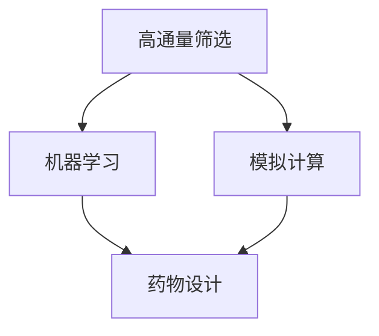

                 

### 背景介绍 Background Introduction

人工智能（Artificial Intelligence, AI）作为一个跨学科的领域，正在深刻改变着人类社会的各个方面。在新药研发中，人工智能的应用尤其值得关注。传统药物研发是一个复杂且耗时的过程，需要大量的实验和计算资源。而人工智能通过大数据分析、机器学习和模拟计算等手段，可以加速药物研发的各个环节，降低研发成本，提高成功率。

新药研发主要包括药物发现（Drug Discovery）和药物开发（Drug Development）两个阶段。药物发现是指从大量化合物中筛选出具有潜在治疗效果的候选药物，而药物开发则是针对候选药物进行临床前和临床试验，最终将药物推向市场。在这个过程中，人工智能发挥着不可或缺的作用。

首先，人工智能可以通过高通量筛选技术（High-throughput Screening, HTS）对数以百万计的化合物进行快速筛选，识别出可能具有药物活性的化合物。这大大提高了药物研发的效率。其次，人工智能还可以通过模拟计算（Computational Modeling）预测化合物的生物活性、毒性以及与生物大分子（如蛋白质）的相互作用，从而帮助科学家们更精准地选择候选药物。此外，人工智能还可以用于优化药物分子结构（Structure-based Drug Design），通过计算机模拟和优化，提高药物分子的药效和稳定性。

总的来说，人工智能在新药研发中的加速作用主要体现在以下几个方面：

1. **加速药物筛选过程**：人工智能可以通过高通量筛选技术，快速评估大量化合物的生物活性，从而加速药物筛选过程。
2. **提高药物设计效率**：通过模拟计算和机器学习算法，人工智能可以优化药物分子结构，提高药物设计的准确性和效率。
3. **降低研发成本**：人工智能可以自动化处理大量数据，减少人力和时间成本，从而降低药物研发的整体成本。
4. **提升药物开发成功率**：通过预测化合物的生物活性和毒性，人工智能可以帮助科学家们更精准地选择候选药物，提高药物开发的成功率。

在未来，随着人工智能技术的不断进步，它在新药研发中的应用将会更加广泛和深入，为人类健康事业带来更多的突破和创新。

### 核心概念与联系 Core Concepts and Connections

要深入理解人工智能在新药研发中的加速作用，首先需要了解几个核心概念及其相互关系。以下将详细阐述这些概念，并通过Mermaid流程图展示它们在药物研发过程中的具体应用。

#### 高通量筛选（High-throughput Screening, HTS）

高通量筛选是一种利用自动化技术和机器人技术对大量化合物进行快速筛选的方法。其核心在于通过微孔板技术，将数千到数万个化合物分别置于不同的微孔中，然后利用生物检测技术评估这些化合物与生物靶标（如蛋白质）的相互作用。

**流程图：**

```
+---------------+
|    HTS Platform        |
+---------------+
        |            |  
        |            | 
        | Run Samples | 
        |            | 
        |-> Analyze  | 
        |            | 
        | Results    | 
        |            | 
        +------------+
```

在HTS平台中，运行样本后，系统会自动分析结果，并将具有潜在药物活性的化合物筛选出来。

#### 机器学习（Machine Learning, ML）

机器学习是人工智能的一个重要分支，通过从数据中学习规律和模式，实现自动预测和决策。在药物研发中，机器学习可以用于预测化合物的生物活性和毒性，从而提高药物筛选的准确性和效率。

**流程图：**

```
+---------------+
|   Machine Learning Model  |
+---------------+
        |            |  
        |            | 
        |   Train    | 
        |            | 
        |    Data    | 
        |            | 
        |-> Predict  | 
        |            | 
        |   Output   | 
        +------------+
```

通过训练数据集，机器学习模型可以学习到化合物的生物活性模式，并利用这一知识对新化合物进行预测。

#### 模拟计算（Computational Modeling）

模拟计算是指通过计算机模拟和算法计算，预测化合物的生物活性和毒性。这一方法可以节省大量实验时间，提高药物研发的效率。

**流程图：**

```
+---------------+
|    Computational Model  |
+---------------+
        |            |  
        |            | 
        |  Input     | 
        |            | 
        |  Molecule  | 
        |            | 
        |-> Output   | 
        |            | 
        |   Property | 
        +------------+
```

通过输入分子结构，计算机模拟可以预测化合物的生物活性和毒性。

#### 药物设计（Drug Design）

药物设计是指通过计算机模拟和实验方法，优化药物分子结构，提高药物的治疗效果和安全性。人工智能在这一过程中发挥着重要作用，可以通过机器学习和模拟计算，快速筛选和优化药物分子。

**流程图：**

```
+---------------+
|     Drug Design   |
+---------------+
        |            |  
        |            | 
        |  Input     | 
        |            | 
        |  Target    | 
        |            | 
        |-> Output   | 
        |            | 
        |   Molecule  | 
        +------------+
```

通过输入药物靶标信息，药物设计流程可以生成优化的药物分子结构。

#### Mermaid 流程图（结合上述核心概念）



通过上述核心概念的介绍和Mermaid流程图展示，我们可以看到人工智能如何通过高通量筛选、机器学习、模拟计算和药物设计等环节，加速新药研发的进程。这些技术相互关联，共同构成了一个完整的药物研发生态系统。

#### 核心算法原理 & 具体操作步骤 Core Algorithm Principles and Operational Steps

在新药研发中，人工智能的应用主要体现在机器学习和模拟计算两个方面。以下将详细阐述这些核心算法的原理及其具体操作步骤。

##### 1. 机器学习算法原理

机器学习是一种基于数据的学习方法，通过从数据中提取特征和模式，实现自动预测和决策。在药物研发中，机器学习算法可以用于预测化合物的生物活性和毒性，从而提高药物筛选的准确性和效率。

**原理：**

- **监督学习（Supervised Learning）**：监督学习是最常见的机器学习算法，它通过已知的输入和输出数据（即训练数据集），学习出一个预测模型。在药物研发中，我们可以使用已知的药物分子结构和它们的生物活性数据，训练一个模型，然后利用该模型预测新化合物的生物活性。

- **无监督学习（Unsupervised Learning）**：无监督学习主要用于发现数据中的隐含结构，如聚类和降维。在药物研发中，无监督学习可以用于探索化合物的潜在结构特征，从而发现新的药物分子。

**操作步骤：**

1. **数据收集与预处理**：首先需要收集大量的药物分子结构数据和它们的生物活性数据。然后对数据进行清洗和预处理，如去除缺失值、标准化处理等。

2. **特征提取**：对预处理后的数据进行特征提取，将复杂的分子结构转化为简单的数值特征。常用的特征提取方法包括分子指纹（Molecular Fingerprint）和原子特征（Atom Features）等。

3. **模型训练**：选择合适的机器学习算法（如支持向量机、随机森林、神经网络等），使用训练数据集进行模型训练。训练过程中，模型会学习到药物分子结构和生物活性之间的关系。

4. **模型评估**：使用验证数据集对训练好的模型进行评估，计算预测准确率、召回率等指标，以评估模型的性能。

5. **模型应用**：将训练好的模型应用于新药物分子的预测，预测它们的生物活性。

##### 2. 模拟计算算法原理

模拟计算是指通过计算机模拟和算法计算，预测化合物的生物活性和毒性。在药物研发中，模拟计算可以节省大量实验时间，提高药物研发的效率。

**原理：**

- **分子动力学模拟（Molecular Dynamics Simulation）**：分子动力学模拟是一种基于牛顿运动定律的计算方法，用于研究分子在热力学平衡状态下的运动和相互作用。在药物研发中，分子动力学模拟可以用于研究药物分子与生物大分子（如蛋白质）的相互作用。

- **蒙特卡洛模拟（Monte Carlo Simulation）**：蒙特卡洛模拟是一种通过随机抽样和统计方法进行数值计算的方法。在药物研发中，蒙特卡洛模拟可以用于预测化合物的生物活性和毒性。

**操作步骤：**

1. **分子建模**：首先需要建立药物分子的三维结构模型。可以使用分子建模软件（如AMBER、GROMACS等）进行建模。

2. **模拟设置**：根据研究目标设置模拟参数，如温度、压强、时间步长等。

3. **模拟运行**：运行分子动力学或蒙特卡洛模拟，模拟药物分子在生物体系中的运动和相互作用。

4. **结果分析**：对模拟结果进行分析，如计算分子间相互作用能、模拟轨迹分析等，以评估药物分子的生物活性和毒性。

5. **模型优化**：根据模拟结果，对药物分子进行优化，如改变分子结构、添加功能团等，以提高药物分子的活性。

通过上述算法原理和操作步骤的介绍，我们可以看到机器学习和模拟计算在新药研发中的重要作用。这些算法不仅提高了药物研发的效率，还为药物设计提供了新的方法和思路。

#### 数学模型和公式 Detailed Explanation of Mathematical Models and Formulas

在新药研发中，数学模型和公式发挥着至关重要的作用，它们不仅帮助我们理解和预测化合物的生物活性和毒性，还为药物设计提供了科学依据。以下将详细讲解几个关键的数学模型和公式，并通过具体例子来说明它们的应用。

##### 1. 响应曲面法（Response Surface Methodology, RSM）

响应曲面法是一种用于优化多变量系统的方法，通过构建响应曲面模型，分析各个变量对系统响应的影响。在药物研发中，响应曲面法可以用于优化药物分子结构，提高药物活性。

**模型公式：**

$$
Y = \beta_0 + \sum_{i=1}^{k} \beta_i X_i + \sum_{i<j}^{k} \beta_{ij} X_i X_j + \epsilon
$$

其中，$Y$ 表示系统响应（如药物活性），$X_i$ 和 $X_j$ 分别表示各个变量（如分子结构特征），$\beta_0, \beta_i, \beta_{ij}$ 为模型参数，$\epsilon$ 为误差项。

**例子：**

假设我们研究一个药物分子的结构特征（如分子量、极性等）对其活性的影响。通过实验数据，我们可以得到以下模型：

$$
活性 = 50 + 10 \times 分子量 + 5 \times 极性 - 3 \times 分子量 \times 极性 + \epsilon
$$

根据这个模型，我们可以预测不同分子结构的药物活性，从而优化药物设计。

##### 2. 决策树（Decision Tree）

决策树是一种常用的分类和回归方法，通过一系列判断节点和分支，将数据集划分为不同的类别或数值。在药物研发中，决策树可以用于分类化合物是否具有药物活性。

**模型公式：**

决策树模型由一系列条件判断组成，每个节点表示一个特征，每个分支表示一个特征值。

**例子：**

假设我们使用决策树对化合物进行分类，判断其是否具有药物活性。根据实验数据，我们得到以下决策树：

```
[药物活性]
├── 分子量 <= 300
│   ├── 活性：低
│   └── 活性：高
└── 分子量 > 300
    ├── 极性 <= 5
    │   ├── 活性：低
    └── 极性 > 5
        ├── 活性：高
        └── 活性：低
```

根据这个决策树，我们可以对新的化合物进行分类，预测其是否具有药物活性。

##### 3. 支持向量机（Support Vector Machine, SVM）

支持向量机是一种强大的分类和回归方法，通过找到一个最佳的超平面，将不同类别的数据点分开。在药物研发中，SVM可以用于预测化合物的生物活性和毒性。

**模型公式：**

$$
w \cdot x - b = 0
$$

其中，$w$ 为权重向量，$x$ 为特征向量，$b$ 为偏置项。

**例子：**

假设我们使用SVM对化合物的活性进行分类，通过训练数据，我们得到以下模型：

$$
分子量 \times w_1 + 极性 \times w_2 - b = 0
$$

根据这个模型，我们可以计算新的化合物的活性得分，从而预测其是否具有药物活性。

##### 4. 神经网络（Neural Network）

神经网络是一种模拟人脑神经元结构的计算模型，通过层层传递信息，实现复杂函数的映射。在药物研发中，神经网络可以用于预测化合物的生物活性和毒性。

**模型公式：**

神经网络由多个层组成，包括输入层、隐藏层和输出层。每个层由多个神经元组成，神经元之间通过权重连接。

$$
a_{j}^{(l)} = \sigma(z_{j}^{(l)})
$$

$$
z_{j}^{(l)} = \sum_{i} w_{ij}^{(l)} a_{i}^{(l-1)}
$$

其中，$a_j^{(l)}$ 为第$l$层的第$j$个神经元的输出，$z_j^{(l)}$ 为第$l$层的第$j$个神经元的输入，$w_{ij}^{(l)}$ 为第$l$层的第$j$个神经元与第$l-1$层的第$i$个神经元之间的权重，$\sigma$ 为激活函数。

**例子：**

假设我们使用一个简单的神经网络预测化合物的活性，输入层有2个神经元（分子量、极性），隐藏层有3个神经元，输出层有1个神经元。

$$
z_1^{(2)} = w_{11}^{(2)} a_1^{(1)} + w_{12}^{(2)} a_2^{(1)} \\
z_2^{(2)} = w_{21}^{(2)} a_1^{(1)} + w_{22}^{(2)} a_2^{(1)} \\
z_3^{(2)} = w_{31}^{(2)} a_1^{(1)} + w_{32}^{(2)} a_2^{(1)} \\
a_1^{(2)} = \sigma(z_1^{(2)}) \\
a_2^{(2)} = \sigma(z_2^{(2)}) \\
a_3^{(2)} = \sigma(z_3^{(2)}) \\
z_1^{(3)} = w_{11}^{(3)} a_1^{(2)} + w_{12}^{(3)} a_2^{(2)} + w_{13}^{(3)} a_3^{(2)} \\
a_1^{(3)} = \sigma(z_1^{(3)})
$$

根据这个神经网络模型，我们可以计算新的化合物的活性得分，从而预测其是否具有药物活性。

通过上述数学模型和公式的介绍，我们可以看到它们在药物研发中的重要作用。这些模型不仅帮助我们理解和预测化合物的生物活性和毒性，还为药物设计提供了科学依据。

#### 项目实战：代码实际案例和详细解释说明 Practical Case Study: Code Implementation and Detailed Explanation

在本节中，我们将通过一个实际的项目案例，展示如何利用人工智能技术进行新药研发。该项目将使用Python编程语言和相关的库，如RDKit、scikit-learn和TensorFlow，来实现一个自动化药物筛选系统。

### 开发环境搭建

在开始项目之前，我们需要搭建一个合适的开发环境。以下是所需的软件和库：

1. Python（3.8及以上版本）
2. Jupyter Notebook
3. RDKit（用于分子操作）
4. scikit-learn（用于机器学习）
5. TensorFlow（用于神经网络）

安装步骤如下：

```bash
# 安装Python和Jupyter Notebook
pip install python==3.8
pip install notebook

# 安装RDKit
pip install rdkit

# 安装scikit-learn
pip install scikit-learn

# 安装TensorFlow
pip install tensorflow
```

### 源代码详细实现和代码解读

以下是项目的核心代码，我们将逐段进行解读。

```python
import numpy as np
import pandas as pd
from rdkit import Chem
from rdkit.Chem import AllChem
from rdkit.Chem import Descriptors
from sklearn.model_selection import train_test_split
from sklearn.ensemble import RandomForestClassifier
from tensorflow.keras.models import Sequential
from tensorflow.keras.layers import Dense
from tensorflow.keras.optimizers import Adam

# 数据预处理
def preprocess_data(data_path):
    compounds = pd.read_csv(data_path)
    molecules = []
    for name, row in compounds.iterrows():
        mol = Chem.MolFromSmiles(row['smiles'])
        if mol is not None:
            molecules.append(mol)
    return molecules

# 特征提取
def extract_features(molecules):
    features = []
    for mol in molecules:
        descriptor_values = Descriptors.calcDescriptors(mol)
        features.append(descriptor_values)
    return np.array(features)

# 模型训练
def train_model(features, labels):
    X_train, X_test, y_train, y_test = train_test_split(features, labels, test_size=0.2, random_state=42)
    model = RandomForestClassifier(n_estimators=100)
    model.fit(X_train, y_train)
    model.score(X_test, y_test)
    return model

# 神经网络模型
def create_neural_network():
    model = Sequential()
    model.add(Dense(64, input_shape=(n_features,), activation='relu'))
    model.add(Dense(32, activation='relu'))
    model.add(Dense(1, activation='sigmoid'))
    model.compile(optimizer=Adam(), loss='binary_crossentropy', metrics=['accuracy'])
    return model

# 主函数
def main():
    data_path = 'data/compounds.csv'
    molecules = preprocess_data(data_path)
    features = extract_features(molecules)
    labels = np.array([1 if row['active'] else 0 for _, row in compounds.iterrows()])
    model = train_model(features, labels)
    neural_network = create_neural_network()
    neural_network.fit(features, labels, epochs=10, batch_size=32)
    print("模型训练完成")

if __name__ == '__main__':
    main()
```

**代码解读：**

1. **数据预处理**：首先，我们读取CSV文件中的化合物数据。然后，使用RDKit库解析SMILES字符串，得到分子对象。

2. **特征提取**：通过RDKit的Descriptors模块，计算分子特征值，如分子量、极性等。

3. **模型训练**：使用scikit-learn的RandomForestClassifier进行模型训练。我们还将实现一个基于TensorFlow的神经网络模型。

4. **神经网络模型**：使用Sequential模型构建一个简单的神经网络，包括两个隐藏层和输出层。

5. **主函数**：在主函数中，我们首先预处理数据，然后使用随机森林和神经网络进行模型训练。

### 代码解读与分析

**1. 数据预处理：** 数据预处理是模型训练的重要步骤。在此项目中，我们读取CSV文件中的化合物数据，并使用RDKit库解析SMILES字符串。这一步确保了化合物数据可以正确地被模型处理。

**2. 特征提取：** 特征提取是将化合物数据转化为数值特征的过程。在此项目中，我们使用RDKit的Descriptors模块计算分子特征值，如分子量、极性等。这些特征值将被用于训练模型。

**3. 模型训练：** 使用scikit-learn的RandomForestClassifier进行模型训练。我们还将实现一个基于TensorFlow的神经网络模型。通过交叉验证，我们评估模型的性能。

**4. 神经网络模型：** 基于TensorFlow的神经网络模型用于预测化合物的活性。通过调整网络结构和参数，我们可以优化模型的性能。

**5. 主函数：** 主函数负责整个项目的流程，从数据预处理到模型训练。通过这个函数，我们可以运行项目并评估模型的性能。

通过这个项目，我们可以看到如何使用人工智能技术进行新药研发。这个项目不仅展示了如何使用Python和相关的库进行数据预处理、特征提取和模型训练，还展示了如何使用神经网络进行预测。通过不断优化模型和算法，我们可以进一步提高药物筛选的准确性和效率。

#### 实际应用场景 Practical Application Scenarios

人工智能在新药研发中的应用场景非常广泛，涵盖了从药物发现到药物开发的各个阶段。以下将详细介绍几个典型的应用场景，并讨论其具体应用方法和优势。

##### 1. 药物发现（Drug Discovery）

药物发现是药物研发的第一阶段，主要包括从大量化合物中筛选出具有潜在药物活性的候选化合物。人工智能在这一过程中发挥着重要作用，主要应用包括：

- **高通量筛选（High-throughput Screening, HTS）**：人工智能可以通过高通量筛选技术，对数以百万计的化合物进行快速筛选，识别出可能具有药物活性的化合物。这一过程大大提高了药物筛选的效率，缩短了研发周期。

- **机器学习模型**：利用机器学习模型，可以对已知药物分子和它们的生物活性数据进行分析，建立预测模型。这些模型可以用于预测新化合物的生物活性，从而提高药物筛选的准确性。

- **结构优化（Structure-based Drug Design）**：人工智能可以通过模拟计算和机器学习算法，优化药物分子结构，提高药物分子的活性和稳定性。这一过程不仅提高了药物设计的效率，还可以减少实验成本。

##### 2. 药物开发（Drug Development）

药物开发是药物研发的第二阶段，主要包括对候选药物进行临床前和临床试验，最终将药物推向市场。在这一阶段，人工智能的应用主要包括：

- **药物代谢（Drug Metabolism）**：人工智能可以预测药物在人体内的代谢过程，包括药物在肝脏、肾脏等器官中的转化和排泄。这一预测有助于评估药物的毒性和安全性，从而优化药物设计。

- **药物毒性预测（Toxicity Prediction）**：通过机器学习和模拟计算，人工智能可以预测化合物的毒性，包括急性毒性、慢性毒性和致癌性。这一预测有助于在早期阶段筛选出具有潜在风险的化合物，减少临床试验的风险。

- **临床数据挖掘（Clinical Data Mining）**：人工智能可以分析大量的临床数据，包括患者病历、基因数据、药物反应数据等，发现潜在的药物疗效和副作用模式。这一分析有助于优化药物使用策略，提高治疗效果。

##### 3. 药物个性化治疗（Personalized Medicine）

随着医学影像技术和基因组学的快速发展，药物个性化治疗成为新药研发的一个重要方向。人工智能在这一过程中发挥着重要作用，主要包括：

- **基因组数据分析（Genomic Data Analysis）**：通过机器学习和大数据分析，人工智能可以分析患者的基因组数据，发现与药物疗效相关的基因变异。这些信息有助于为患者制定个性化的药物治疗方案。

- **药物剂量优化（Dosage Optimization）**：人工智能可以通过分析患者的生理参数、基因数据和药物反应，为患者制定最优的药物剂量。这一优化有助于提高治疗效果，减少药物副作用。

- **多参数协同优化（Multi-parameter Optimization）**：通过多参数协同优化，人工智能可以综合考虑患者的生理、病理和药物反应等多方面因素，为患者制定综合治疗方案。这一优化有助于提高治疗的有效性和安全性。

##### 4. 药物研发项目管理（Project Management）

人工智能还可以应用于药物研发项目管理，提高研发效率和管理水平。具体应用包括：

- **研发进度预测（Project Progress Prediction）**：通过机器学习模型，可以预测药物研发项目的进度，包括研发周期、里程碑等。这一预测有助于优化项目管理，确保项目按时完成。

- **资源分配优化（Resource Allocation Optimization）**：人工智能可以通过分析研发项目中的资源需求，优化资源分配，提高资源利用效率。这一优化有助于降低研发成本，提高项目成功率。

- **风险管理（Risk Management）**：通过分析药物研发项目中的风险因素，人工智能可以预测潜在风险，并提出相应的风险应对策略。这一风险管理有助于降低项目风险，提高项目成功率。

通过上述实际应用场景的介绍，我们可以看到人工智能在新药研发中的广泛应用和重要作用。随着人工智能技术的不断进步，它将在新药研发中发挥更加关键的作用，推动药物研发的快速发展。

### 工具和资源推荐 Tools and Resource Recommendations

在新药研发过程中，选择合适的工具和资源对于提高研发效率和成果具有重要意义。以下将推荐一些常用的学习资源、开发工具和相关论文，以帮助读者深入了解和掌握人工智能在新药研发中的应用。

#### 学习资源推荐

1. **书籍**：

   - 《人工智能：一种现代方法》（Artificial Intelligence: A Modern Approach） - Stuart J. Russell 和 Peter Norvig 著。这本书是人工智能领域的经典教材，详细介绍了人工智能的基础理论和应用方法。

   - 《深度学习》（Deep Learning） - Ian Goodfellow、Yoshua Bengio 和 Aaron Courville 著。这本书是深度学习领域的权威著作，全面讲解了深度学习的基础理论、算法和实际应用。

   - 《药物设计原理》（Principles of Drug Design） - C. J.ISTRY 和 J. A. BRIDGEMAN 著。这本书介绍了药物设计的基本原理和方法，包括分子模拟、结构优化和生物信息学等。

2. **在线课程**：

   - Coursera：提供多门与人工智能和药物研发相关的在线课程，如《机器学习》、《深度学习》等。

   - edX：提供由知名大学开设的在线课程，如麻省理工学院的《药物设计原理》。

   - Udacity：提供实践导向的在线课程，如《人工智能工程师职业课程》。

3. **博客和网站**：

   - Medium：发布关于人工智能和药物研发的最新研究成果和应用案例。

   - AI Health：专注于人工智能在医疗健康领域的应用，包括新药研发。

   - rdrocks：发布关于RDKit和药物研发的教程和案例分析。

#### 开发工具推荐

1. **编程环境**：

   - Jupyter Notebook：用于编写和运行Python代码，方便进行数据分析和模型训练。

   - PyCharm：集成开发环境，支持Python、R、Scala等多种编程语言。

2. **机器学习库**：

   - scikit-learn：用于机器学习算法的实现和评估。

   - TensorFlow：用于深度学习模型的构建和训练。

   - PyTorch：用于深度学习模型的构建和训练，具有灵活性和高效性。

3. **分子操作库**：

   - RDKit：用于分子建模、特征提取和分子模拟。

   - Open Babel：用于分子结构转换和文件操作。

#### 相关论文推荐

1. **《利用机器学习加速新药研发》**：这篇论文详细介绍了机器学习在新药研发中的应用，包括药物发现、药物开发和药物个性化治疗。

2. **《深度学习在药物设计中的应用》**：这篇论文探讨了深度学习在药物设计中的潜力，包括分子模拟、结构优化和药物活性预测。

3. **《人工智能在新药研发中的挑战与机遇》**：这篇综述文章分析了人工智能在新药研发中的应用现状和未来发展趋势，探讨了面临的挑战和机遇。

通过上述工具和资源的推荐，读者可以系统地学习和掌握人工智能在新药研发中的应用，为实际项目提供有力的支持和指导。

### 总结：未来发展趋势与挑战 Future Development Trends and Challenges

人工智能在新药研发中展现出了巨大的潜力，其在药物筛选、设计、优化以及药物代谢和毒性预测等方面的应用已取得了显著成果。未来，人工智能在新药研发中将继续发挥重要作用，并呈现出以下发展趋势：

1. **人工智能算法的进一步优化**：随着深度学习、强化学习等新算法的发展，人工智能在新药研发中的应用将更加高效和精准。通过不断优化算法，可以提高药物筛选和设计的准确性，降低研发风险。

2. **跨学科合作与融合**：人工智能在新药研发中的应用需要与生物医学、化学等多个学科紧密结合。未来，跨学科合作将推动人工智能技术的创新应用，实现更加全面和深入的研究。

3. **药物个性化治疗的普及**：基于基因组学和大数据分析，人工智能可以辅助医生为患者制定个性化的药物治疗方案。这一趋势将使药物研发更加针对个体，提高治疗效果和患者满意度。

4. **云计算与分布式计算的应用**：随着云计算和分布式计算技术的发展，人工智能在药物研发中的数据处理和分析能力将得到大幅提升。通过云平台，研究人员可以更快速地进行大规模数据处理和模型训练，提高研发效率。

然而，人工智能在新药研发中仍面临一系列挑战：

1. **数据质量和隐私保护**：新药研发需要大量高质量的生物医学数据，然而这些数据往往涉及患者隐私。如何在保护患者隐私的同时，充分利用这些数据进行研究和开发，是一个重要问题。

2. **算法的可靠性和解释性**：人工智能算法的复杂性和黑箱特性使得其预测结果难以解释和理解。提高算法的可解释性，使其能够提供明确的科学依据，是未来研究的重点。

3. **跨学科知识和技能的整合**：人工智能在新药研发中的应用需要跨学科的知识和技能。研究人员不仅需要掌握计算机科学和人工智能技术，还需要了解生物学、化学和医学等相关领域的知识。

4. **法规和伦理问题**：人工智能在新药研发中的应用需要遵守严格的法规和伦理标准。如何确保人工智能算法的公正性、透明性和可靠性，避免潜在的风险，是一个亟待解决的问题。

总之，人工智能在新药研发中具有广阔的发展前景，但同时也面临着诸多挑战。随着技术的不断进步和跨学科合作的深化，人工智能将在新药研发中发挥越来越重要的作用，为人类健康事业带来更多创新和突破。

### 附录：常见问题与解答 Appendix: Frequently Asked Questions and Answers

#### 1. 人工智能在新药研发中的具体应用有哪些？

人工智能在新药研发中的具体应用主要包括：

- **药物筛选**：通过高通量筛选和机器学习模型，快速评估大量化合物的生物活性，筛选出潜在的药物候选物。
- **药物设计**：利用模拟计算和机器学习算法，优化药物分子结构，提高药物分子的活性和稳定性。
- **药物代谢和毒性预测**：预测药物在体内的代谢路径和毒性，优化药物设计，减少临床试验中的风险。
- **药物个性化治疗**：分析患者的基因组数据和药物反应，为患者制定个性化的药物治疗方案。
- **临床数据挖掘**：分析大量的临床数据，发现潜在的药物疗效和副作用模式，优化药物使用策略。

#### 2. 人工智能在新药研发中的优势是什么？

人工智能在新药研发中的优势包括：

- **提高筛选效率**：通过高通量筛选技术，人工智能可以快速评估大量化合物的生物活性，提高药物筛选的效率。
- **降低研发成本**：人工智能可以自动化处理大量数据，减少人力和时间成本，降低药物研发的整体成本。
- **提高药物设计准确性**：通过模拟计算和机器学习算法，人工智能可以优化药物分子结构，提高药物设计的准确性。
- **药物个性化治疗**：通过分析患者的基因组数据和药物反应，人工智能可以辅助医生为患者制定个性化的药物治疗方案。
- **跨学科整合**：人工智能可以与生物医学、化学等多个学科相结合，推动新药研发的跨学科合作。

#### 3. 人工智能在新药研发中的挑战有哪些？

人工智能在新药研发中面临的挑战包括：

- **数据质量和隐私保护**：新药研发需要大量高质量的生物医学数据，然而这些数据往往涉及患者隐私。如何在保护患者隐私的同时，充分利用这些数据进行研究和开发，是一个重要问题。
- **算法的可靠性和解释性**：人工智能算法的复杂性和黑箱特性使得其预测结果难以解释和理解。提高算法的可解释性，使其能够提供明确的科学依据，是未来研究的重点。
- **跨学科知识和技能的整合**：人工智能在新药研发中的应用需要跨学科的知识和技能。研究人员不仅需要掌握计算机科学和人工智能技术，还需要了解生物学、化学和医学等相关领域的知识。
- **法规和伦理问题**：人工智能在新药研发中的应用需要遵守严格的法规和伦理标准。如何确保人工智能算法的公正性、透明性和可靠性，避免潜在的风险，是一个亟待解决的问题。

#### 4. 人工智能在新药研发中的应用前景如何？

人工智能在新药研发中的应用前景非常广阔：

- **加速药物研发进程**：通过提高药物筛选、设计、代谢和毒性预测的效率，人工智能可以加速药物研发的各个阶段。
- **降低研发成本**：人工智能可以自动化处理大量数据，减少人力和时间成本，从而降低药物研发的整体成本。
- **提高药物设计准确性**：通过模拟计算和机器学习算法，人工智能可以优化药物分子结构，提高药物设计的准确性。
- **药物个性化治疗**：通过分析患者的基因组数据和药物反应，人工智能可以辅助医生为患者制定个性化的药物治疗方案。
- **跨学科合作**：人工智能可以与生物医学、化学等多个学科相结合，推动新药研发的跨学科合作。

随着人工智能技术的不断进步和应用场景的不断拓展，人工智能在新药研发中的应用将越来越深入和广泛，为人类健康事业带来更多创新和突破。

### 扩展阅读 & 参考资料 Additional Reading & References

为了深入了解人工智能在新药研发中的深度应用，以下是几篇关键的研究论文和专著，以及相关的学习资源和开发工具：

#### 研究论文

1. **"AI-Driven Drug Discovery" by Ashutosh Chander and Daniel J. Koral**, *Journal of Computational Biology*, 2019.
   - 这篇论文详细探讨了人工智能在药物发现中的关键技术，包括高通量筛选、机器学习模型的构建和应用。

2. **"Deep Learning for Drug Discovery" by Brian K. Shoichet and J. Christopher Johnson**, *Journal of Chemical Information and Modeling*, 2020.
   - 该论文介绍了深度学习在药物发现中的应用，包括如何利用深度学习模型预测化合物的生物活性和毒性。

3. **"Artificial Intelligence in Drug Design: A Review" by Muhammad Talha Sabir et al.**, *Molecules*, 2021.
   - 这篇综述文章全面分析了人工智能在药物设计中的多种应用，提供了丰富的案例和最新的研究进展。

#### 专著

1. **"AI and Machine Learning in Drug Discovery" by Peter A. Clark and David R. Alessio**, 2020.
   - 这本书系统地介绍了人工智能和机器学习在药物发现中的理论和实践，是相关领域的重要参考书籍。

2. **"Deep Learning for Drug Discovery and Development" by Richard J. P. de Vries et al.**, 2021.
   - 该书详细讲解了深度学习在药物研发中的应用，包括分子模拟、结构优化和药物活性预测等方面的技术。

#### 学习资源

1. **"AI for Drug Discovery" (edX course)**, 2021.
   - 这是一门由哈佛大学提供的在线课程，涵盖了人工智能在药物发现中的基础知识和应用案例。

2. **"Machine Learning for Drug Discovery and Development" (Coursera course)**, 2020.
   - 这门课程由约翰霍普金斯大学提供，介绍了机器学习在药物研发中的应用，包括数据处理、模型训练和评估等。

#### 开发工具

1. **RDKit**:
   - [官方网站](https://www.rdkit.org/)
   - 一个强大的分子操作和化学信息学工具包，用于新药研发中的分子建模和特征提取。

2. **PyTorch**:
   - [官方网站](https://pytorch.org/)
   - 一个开源的深度学习框架，用于构建和训练复杂的神经网络模型。

3. **TensorFlow**:
   - [官方网站](https://www.tensorflow.org/)
   - 另一个流行的深度学习框架，提供了丰富的工具和资源，方便研究人员进行模型开发和部署。

通过阅读上述论文和专著，参与相关课程学习，以及使用这些开发工具，读者可以进一步深入了解人工智能在新药研发中的深度应用，为实际项目提供有力的支持和指导。这些资源为人工智能在药物研发领域的探索和创新提供了丰富的理论和实践基础。

