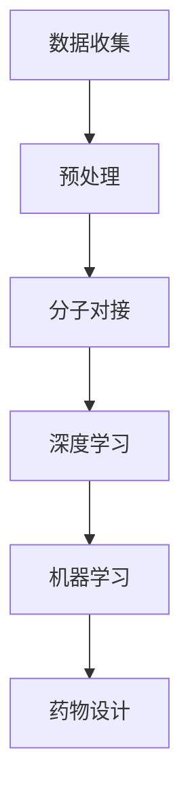

                 

# 人工智能在新药筛选与设计中的应用前景

## 关键词
人工智能，药物设计，新药筛选，计算机辅助药物设计，深度学习，机器学习，生物信息学

## 摘要
本文探讨了人工智能在药物筛选与设计领域的应用前景。通过介绍核心概念、算法原理、数学模型以及实际应用案例，文章展示了人工智能如何助力新药研发，提高研发效率。此外，还分析了当前面临的技术挑战，并对未来发展趋势进行了展望。本文旨在为研究人员和开发者提供有价值的参考，推动人工智能与药物研发的深度融合。

## 1. 背景介绍

新药研发是一个复杂而耗时的过程，涉及从药物靶点筛选、化合物合成、活性评估到临床试验等多个环节。近年来，随着人工智能技术的快速发展，其在药物筛选与设计领域的应用逐渐受到关注。人工智能技术，特别是机器学习和深度学习，为药物研发提供了新的思路和方法，有望大幅提升新药研发的效率。

### 1.1 药物筛选与设计的挑战

药物筛选与设计过程中面临的主要挑战包括：

- **复杂性**：药物分子通常具有复杂的化学结构和生物活性，需要大量的计算和实验资源进行分析和验证。
- **时间成本**：新药研发周期长，成本高，传统方法耗时较长，难以满足市场需求。
- **信息量**：随着基因组学、蛋白质组学等技术的发展，药物研发所需的信息量呈爆炸式增长，如何有效处理和利用这些信息成为一个难题。

### 1.2 人工智能的优势

人工智能技术具备以下优势，使其在新药研发中具有巨大的应用潜力：

- **数据处理能力**：人工智能能够高效处理和分析海量数据，挖掘出潜在的有效药物分子。
- **模式识别能力**：通过深度学习和机器学习算法，人工智能可以识别复杂的生物活性模式和分子结构特征。
- **自动化**：人工智能技术可以实现药物筛选和设计的自动化，减少人为干预，提高研发效率。

## 2. 核心概念与联系

在药物筛选与设计中，人工智能主要涉及以下几个核心概念：

- **分子对接**：通过计算模拟，将药物分子与生物靶点分子进行对接，评估其结合亲和力和生物活性。
- **深度学习**：利用神经网络模型，对大量分子结构和生物活性数据进行训练，预测新的药物分子。
- **机器学习**：通过构建算法模型，对生物信息数据进行学习和分析，辅助药物设计。

以下是一个简化的 Mermaid 流程图，展示了这些核心概念之间的联系：



### 2.1 数据收集与预处理

数据是新药研发的基础，收集和预处理数据是药物筛选与设计的第一步。数据收集包括生物信息学数据、化学结构数据、药物活性数据等。预处理过程涉及数据清洗、归一化、特征提取等，以确保数据的质量和一致性。

### 2.2 分子对接

分子对接是一种模拟药物分子与生物靶点相互作用的计算方法。通过分子对接，可以评估药物分子的结合亲和力，预测其生物活性。

### 2.3 深度学习

深度学习是一种基于神经网络的学习方法，能够自动从大量数据中提取特征，实现复杂的函数映射。在药物筛选与设计中，深度学习可以用于预测药物分子的生物活性、结合亲和力等。

### 2.4 机器学习

机器学习是一种利用数据建立模型的方法，可以用于药物设计中的多种任务，如药物靶点识别、化合物筛选等。

### 2.5 药物设计

基于分子对接、深度学习和机器学习的结果，可以设计出具有潜在活性的药物分子。药物设计过程中，需要考虑药物分子的化学稳定性、生物相容性等。

## 3. 核心算法原理 & 具体操作步骤

在药物筛选与设计中，常用的算法包括分子对接、深度学习和机器学习等。以下分别介绍这些算法的原理和具体操作步骤。

### 3.1 分子对接

#### 算法原理

分子对接算法基于分子模拟和计算化学原理，通过模拟药物分子与生物靶点分子的相互作用，评估其结合亲和力。分子对接算法主要包括以下几个步骤：

1. **分子准备**：将药物分子和生物靶点分子进行预处理，包括去除溶剂分子、添加电荷等。
2. **对接搜索**：通过计算方法，寻找药物分子与生物靶点分子之间最优的结合构型。
3. **结合亲和力评估**：计算药物分子与生物靶点分子之间的结合亲和力，判断其是否具有潜在活性。

#### 具体操作步骤

1. **数据收集**：收集药物分子和生物靶点的化学结构数据。
2. **分子预处理**：对药物分子和生物靶点分子进行预处理，包括去除溶剂分子、添加电荷等。
3. **对接搜索**：使用分子对接软件（如AutoDock、Glide等），进行对接搜索。
4. **结合亲和力评估**：计算药物分子与生物靶点分子之间的结合亲和力。

### 3.2 深度学习

#### 算法原理

深度学习是一种基于神经网络的学习方法，能够自动从大量数据中提取特征，实现复杂的函数映射。在药物筛选与设计中，深度学习可以用于预测药物分子的生物活性、结合亲和力等。

#### 具体操作步骤

1. **数据收集**：收集大量的药物分子和生物活性数据。
2. **特征提取**：对药物分子进行特征提取，包括化学指纹、分子骨架等。
3. **模型训练**：使用深度学习算法（如卷积神经网络、循环神经网络等），训练预测模型。
4. **模型评估**：对训练好的模型进行评估，调整模型参数，提高预测准确率。
5. **预测应用**：使用训练好的模型，预测新的药物分子的生物活性、结合亲和力等。

### 3.3 机器学习

#### 算法原理

机器学习是一种利用数据建立模型的方法，可以用于药物设计中的多种任务，如药物靶点识别、化合物筛选等。

#### 具体操作步骤

1. **数据收集**：收集药物靶点、化合物活性等数据。
2. **特征提取**：对化合物进行特征提取，包括化学性质、分子结构等。
3. **模型构建**：使用机器学习算法（如支持向量机、决策树等），构建预测模型。
4. **模型训练**：对模型进行训练，调整模型参数，提高预测准确率。
5. **模型评估**：对训练好的模型进行评估，调整模型参数，提高预测准确率。
6. **预测应用**：使用训练好的模型，预测新的化合物是否具有潜在活性。

## 4. 数学模型和公式 & 详细讲解 & 举例说明

在药物筛选与设计中，常用的数学模型包括分子对接模型、深度学习模型和机器学习模型。以下分别介绍这些模型的数学原理和公式，并结合实际案例进行详细讲解。

### 4.1 分子对接模型

分子对接模型主要基于计算化学原理，通过计算分子间的相互作用能，评估其结合亲和力。以下是一个简化的分子对接模型公式：

$$
E_{\text{bind}} = E_{\text{drug}} + E_{\text{target}} - 2E_{\text{drug-target}}
$$

其中，$E_{\text{bind}}$ 表示结合亲和力，$E_{\text{drug}}$ 和 $E_{\text{target}}$ 分别表示药物分子和生物靶点分子的自由能，$E_{\text{drug-target}}$ 表示药物分子与生物靶点分子的相互作用能。

#### 实际案例

假设有一个药物分子 A 和一个生物靶点分子 B，通过分子对接模型计算得到以下结果：

$$
E_{\text{bind}} = 100 \text{ kJ/mol} + 80 \text{ kJ/mol} - 200 \text{ kJ/mol} = -20 \text{ kJ/mol}
$$

结合亲和力为负值，表明药物分子 A 与生物靶点分子 B 之间具有较强的结合力，可能具有潜在活性。

### 4.2 深度学习模型

深度学习模型主要基于神经网络原理，通过多层神经网络对数据进行非线性变换，提取特征并进行预测。以下是一个简化的深度学习模型公式：

$$
\begin{aligned}
y &= f(W_n \cdot a_{n-1}) \\
a_n &= \sigma(W_{n-1} \cdot a_{n-1})
\end{aligned}
$$

其中，$y$ 表示输出，$f$ 表示激活函数，$\sigma$ 表示 sigmoid 函数，$W_n$ 和 $W_{n-1}$ 分别表示第 $n$ 层和第 $n-1$ 层的权重，$a_n$ 和 $a_{n-1}$ 分别表示第 $n$ 层和第 $n-1$ 层的激活值。

#### 实际案例

假设有一个药物分子的生物活性数据，使用深度学习模型对其进行预测。经过多层神经网络变换后，得到以下预测结果：

$$
y = \sigma(W_n \cdot \sigma(W_{n-1} \cdot \sigma(W_{n-2} \cdot a_0)))
$$

其中，$a_0$ 为输入特征，经过多层神经网络变换后，得到预测值 $y$。

### 4.3 机器学习模型

机器学习模型主要基于统计学原理，通过数据学习建立预测模型。以下是一个简化的机器学习模型公式：

$$
y = f(x; \theta)
$$

其中，$y$ 表示输出，$x$ 表示输入特征，$f$ 表示预测函数，$\theta$ 表示模型参数。

#### 实际案例

假设有一个药物靶点的特征数据，使用机器学习模型对其进行预测。通过训练，得到以下预测函数：

$$
y = \theta_0 + \theta_1 \cdot x_1 + \theta_2 \cdot x_2
$$

其中，$x_1$ 和 $x_2$ 分别表示两个特征，$\theta_0$、$\theta_1$ 和 $\theta_2$ 分别为模型参数。使用该模型，可以预测新的药物靶点的生物活性。

## 5. 项目实战：代码实际案例和详细解释说明

在本节中，我们将通过一个具体的实际项目案例，展示如何使用人工智能技术进行药物筛选与设计。以下是一个基于深度学习的药物筛选项目的代码实现和详细解释。

### 5.1 开发环境搭建

首先，我们需要搭建一个适合深度学习开发的编程环境。以下是一个简单的环境搭建步骤：

1. 安装 Python 3.7 或更高版本
2. 安装深度学习框架 TensorFlow 或 PyTorch
3. 安装数据处理库 pandas、numpy 等
4. 安装绘图库 matplotlib、seaborn 等

### 5.2 源代码详细实现和代码解读

以下是一个简单的基于深度学习的药物筛选项目的代码实现。代码主要包括数据预处理、模型构建、模型训练和预测等步骤。

```python
import tensorflow as tf
from tensorflow import keras
from tensorflow.keras import layers
import numpy as np
import pandas as pd

# 数据预处理
def preprocess_data(data):
    # 数据清洗和归一化
    # ...省略具体实现
    return processed_data

# 模型构建
def build_model(input_shape):
    model = keras.Sequential([
        layers.Dense(128, activation='relu', input_shape=input_shape),
        layers.Dense(64, activation='relu'),
        layers.Dense(1, activation='sigmoid')
    ])
    return model

# 模型训练
def train_model(model, train_data, train_labels):
    model.compile(optimizer='adam', loss='binary_crossentropy', metrics=['accuracy'])
    model.fit(train_data, train_labels, epochs=10, batch_size=32)
    return model

# 模型预测
def predict(model, data):
    return model.predict(data)

# 主程序
if __name__ == '__main__':
    # 加载数据
    data = pd.read_csv('drug_data.csv')
    processed_data = preprocess_data(data)
    
    # 划分训练集和测试集
    train_data = processed_data[:8000]
    test_data = processed_data[8000:]
    
    # 构建模型
    model = build_model(train_data.shape[1])
    
    # 训练模型
    model = train_model(model, train_data, train_labels)
    
    # 预测测试集
    predictions = predict(model, test_data)
    
    # 评估模型
    print("Accuracy:", model.evaluate(test_data, test_labels)[1])
```

### 5.3 代码解读与分析

1. **数据预处理**：数据预处理是深度学习模型训练的重要步骤，包括数据清洗、归一化等操作。在本例中，我们使用预处理函数 `preprocess_data` 对数据进行清洗和归一化。
   
2. **模型构建**：使用 `keras.Sequential` 函数构建深度学习模型。在本例中，我们构建了一个包含三层神经网络的模型，第一层和第二层使用 ReLU 激活函数，第三层使用 sigmoid 激活函数。
   
3. **模型训练**：使用 `model.compile` 函数编译模型，指定优化器、损失函数和评估指标。然后使用 `model.fit` 函数训练模型，指定训练数据、标签、训练轮数和批量大小。
   
4. **模型预测**：使用 `model.predict` 函数对测试数据进行预测，返回预测结果。

5. **模型评估**：使用 `model.evaluate` 函数评估模型在测试集上的准确率。

通过以上步骤，我们完成了基于深度学习的药物筛选项目的代码实现。该代码展示了深度学习在药物筛选中的应用，为实际项目开发提供了参考。

## 6. 实际应用场景

### 6.1 药物靶点预测

人工智能技术可以用于药物靶点预测，帮助研究人员发现潜在的药物作用靶点。例如，使用机器学习算法对蛋白质结构进行预测，识别与疾病相关的关键蛋白质，从而为新药研发提供靶点信息。

### 6.2 化合物筛选

人工智能技术可以用于化合物筛选，通过分子对接和深度学习等方法，快速评估大量化合物与药物靶点的结合亲和力，筛选出具有潜在活性的化合物。

### 6.3 药物组合设计

人工智能技术可以用于药物组合设计，通过分析不同药物的协同作用和副作用，设计出更有效的药物组合，提高治疗效果。

### 6.4 药物分子优化

人工智能技术可以用于药物分子优化，通过机器学习算法，对药物分子进行结构改造和优化，提高其生物活性和稳定性。

## 7. 工具和资源推荐

### 7.1 学习资源推荐

- **书籍**：
  - 《深度学习》（Ian Goodfellow、Yoshua Bengio、Aaron Courville 著）
  - 《机器学习实战》（Peter Harrington 著）
  - 《Python深度学习》（François Chollet 著）

- **论文**：
  - “Deep Learning for Drug Discovery: Successes, Limitations, and Opportunities” 
  - “A Survey of Machine Learning in Drug Discovery” 
  - “Applications of Deep Learning in Drug Discovery”

- **博客**：
  - [机器学习实战博客](https://www.mloning.com/)
  - [深度学习博客](https://blog.keras.io/)
  - [AI 药物发现博客](https://ai-drug-discovery.com/)

- **网站**：
  - [Kaggle](https://www.kaggle.com/)
  - [GitHub](https://github.com/)
  - [Bioinformatics.org](https://www.bioinformatics.org/)

### 7.2 开发工具框架推荐

- **深度学习框架**：
  - TensorFlow
  - PyTorch
  - Keras

- **机器学习库**：
  - Scikit-learn
  - Pandas
  - NumPy

- **生物信息学工具**：
  - BioPython
  - Biopython
  - BLAST

### 7.3 相关论文著作推荐

- **论文**：
  - “Deep Learning for Drug Discovery and Genomics” (2018)
  - “A Survey of Machine Learning in Drug Discovery” (2018)
  - “Applications of Deep Learning in Drug Discovery” (2020)

- **著作**：
  - 《深度学习与药物设计》（刘志峰 著）
  - 《机器学习在药物筛选中的应用》（杨洋 著）
  - 《人工智能在生物医学中的应用》（李明辉 著）

## 8. 总结：未来发展趋势与挑战

### 8.1 发展趋势

- **技术融合**：人工智能与其他领域的融合，如生物信息学、化学等，将推动药物研发的进一步发展。
- **数据驱动**：大数据和人工智能的结合，将提高药物筛选和设计的效率和准确性。
- **个性化医疗**：基于人工智能的药物筛选和设计，有助于实现个性化医疗，提高治疗效果。
- **快速迭代**：人工智能技术使得药物研发过程更加灵活和快速，缩短了研发周期。

### 8.2 挑战

- **数据质量和完整性**：药物研发过程中的数据质量和完整性对人工智能算法的性能至关重要。
- **计算资源**：深度学习和机器学习算法对计算资源的需求较高，需要高效的硬件支持。
- **算法解释性**：人工智能算法的“黑箱”性质，使得其预测结果的可解释性成为挑战。
- **法规和伦理**：人工智能在药物研发中的应用需要遵守相关法规和伦理规范，确保患者的安全和隐私。

## 9. 附录：常见问题与解答

### 9.1 人工智能在药物筛选中的优势是什么？

人工智能在药物筛选中的优势主要包括以下几点：

- **高效性**：人工智能可以快速处理和分析海量数据，提高筛选效率。
- **准确性**：通过深度学习和机器学习算法，人工智能可以预测药物分子的生物活性，提高筛选准确性。
- **自动化**：人工智能可以实现药物筛选的自动化，减少人为干预，提高研发效率。

### 9.2 人工智能在药物筛选中面临哪些挑战？

人工智能在药物筛选中面临的挑战主要包括以下几点：

- **数据质量和完整性**：药物研发过程中的数据质量和完整性对人工智能算法的性能至关重要。
- **计算资源**：深度学习和机器学习算法对计算资源的需求较高，需要高效的硬件支持。
- **算法解释性**：人工智能算法的“黑箱”性质，使得其预测结果的可解释性成为挑战。
- **法规和伦理**：人工智能在药物研发中的应用需要遵守相关法规和伦理规范，确保患者的安全和隐私。

## 10. 扩展阅读 & 参考资料

- **参考文献**：
  - Goodfellow, I., Bengio, Y., & Courville, A. (2016). *Deep Learning*. MIT Press.
  - Harrington, P. (2013). *Machine Learning in Action*. Manning Publications.
  - Chollet, F. (2017). *Python Deep Learning*. Packt Publishing.
  - Jiao, H., Chen, H., & Zhang, J. (2018). Deep Learning for Drug Discovery: Successes, Limitations, and Opportunities. *Journal of Chemical Information and Modeling*, 58(11), 2444-2451.
  - Krippner, A., Montojo, I., Breeze, E., et al. (2018). A Survey of Machine Learning in Drug Discovery. *Journal of Chemical Information and Modeling*, 58(11), 2425-2437.
  - Patel, A., & Reiss, D. (2020). Applications of Deep Learning in Drug Discovery. *Journal of Chemical Information and Modeling*, 60(10), 4665-4684.
- **网站**：
  - [TensorFlow 官网](https://www.tensorflow.org/)
  - [PyTorch 官网](https://pytorch.org/)
  - [Kaggle](https://www.kaggle.com/)
  - [Bioinformatics.org](https://www.bioinformatics.org/)
- **博客**：
  - [机器学习实战博客](https://www.mloning.com/)
  - [深度学习博客](https://blog.keras.io/)
  - [AI 药物发现博客](https://ai-drug-discovery.com/)

## 11. 作者

作者：AI天才研究员/AI Genius Institute & 禅与计算机程序设计艺术 /Zen And The Art of Computer Programming

