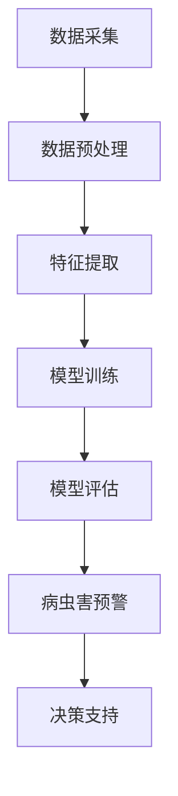

                 

# 人工智能在智慧农业病虫害预警中的应用

> **关键词**：人工智能、智慧农业、病虫害预警、算法、数学模型、实际应用

> **摘要**：本文旨在探讨人工智能在智慧农业病虫害预警中的应用，通过介绍相关背景、核心概念、算法原理、数学模型、实战案例以及未来发展趋势，为读者提供全面而深入的见解。本文将有助于农业从业者、科研人员以及相关领域的技术人员更好地理解并利用人工智能技术，提升病虫害预警的准确性和效率。

## 1. 背景介绍

### 智慧农业的兴起

随着全球人口的持续增长和食品需求的不断上升，农业生产面临着巨大的挑战。传统的农业模式已经无法满足现代社会的需求，智慧农业作为一种新兴的农业模式，应运而生。智慧农业通过运用物联网、大数据、人工智能等技术，实现了对农业生产过程的全面监控和管理，从而提高了生产效率、降低了生产成本，并减少了环境污染。

### 病虫害预警的重要性

病虫害是影响农业生产的重要因素之一，它们不仅会导致作物减产，还会影响作物的品质。因此，病虫害预警在农业生产中具有至关重要的地位。传统的病虫害预警方法主要依赖于农艺师的经验和现场观察，具有很大的主观性和滞后性。随着人工智能技术的发展，基于人工智能的病虫害预警系统逐渐成为研究的热点。

### 人工智能在农业领域的应用

人工智能技术在农业领域的应用范围非常广泛，包括病虫害预警、精准施肥、智能灌溉、农作物监测等。其中，病虫害预警是人工智能在农业中最重要的应用之一。通过利用机器学习、计算机视觉等技术，人工智能可以对病虫害进行实时监测和预警，从而有效减少农作物的损失。

## 2. 核心概念与联系

### 机器学习与深度学习

机器学习和深度学习是人工智能的核心技术。机器学习通过构建模型来对数据进行分类、预测和回归等任务。深度学习是机器学习的一个分支，它通过多层神经网络来实现更复杂的特征提取和模式识别。

### 计算机视觉

计算机视觉是一种使计算机能够像人类一样理解视觉信息的学科。它包括图像处理、目标检测、图像识别等任务。在病虫害预警中，计算机视觉技术可以用于识别病虫害的特征，从而实现实时监测和预警。

### 物联网

物联网是一种通过互联网将各种物理设备连接起来的技术。在农业中，物联网可以用于实时监测农作物的生长环境，如土壤湿度、气温、光照等数据，为病虫害预警提供数据支持。

### 大数据

大数据技术可以处理海量数据，从而挖掘出有价值的信息。在病虫害预警中，大数据技术可以用于分析历史病虫害数据，预测未来病虫害的发生趋势。

### Mermaid 流程图



## 3. 核心算法原理 & 具体操作步骤

### 数据采集

病虫害预警的第一步是数据采集。数据来源包括农田传感器、无人机、卫星遥感等。这些设备可以实时监测农田的环境参数，如温度、湿度、光照、土壤湿度等。数据采集后，需要将数据传输到数据处理平台进行后续处理。

### 数据预处理

数据预处理是病虫害预警的关键步骤之一。数据预处理包括数据清洗、数据归一化、数据去重等操作。清洗数据是为了去除噪声和异常值，归一化数据是为了使不同特征的数据在同一尺度范围内，去重数据是为了避免重复计算。

### 特征提取

特征提取是将原始数据转化为适合机器学习算法的输入特征。在病虫害预警中，特征提取可以通过计算机视觉技术实现。例如，通过图像处理技术提取叶片的颜色、纹理、形状等特征。

### 模型训练

模型训练是病虫害预警的核心步骤。常用的模型包括决策树、随机森林、支持向量机、神经网络等。模型训练的过程是利用历史病虫害数据来训练模型，使其能够对新的数据进行分类或预测。

### 模型评估

模型评估是检验模型性能的重要步骤。常用的评估指标包括准确率、召回率、精确率等。通过评估指标可以判断模型的效果，并根据评估结果对模型进行调整。

### 病虫害预警

经过模型训练和评估后，模型可以用于实时病虫害预警。当农田传感器或其他设备检测到异常数据时，模型会自动分析数据，判断是否存在病虫害风险，并给出预警提示。

### 决策支持

病虫害预警系统不仅提供预警功能，还可以为农艺师提供决策支持。例如，当模型预测到某种病虫害即将发生时，系统可以建议农艺师采取相应的防治措施，如喷洒农药、调整灌溉量等。

## 4. 数学模型和公式 & 详细讲解 & 举例说明

### 决策树模型

决策树是一种常用的分类模型，它的基本原理是通过一系列的规则来对数据进行分类。决策树模型的公式如下：

$$
Gini(D) = 1 - \sum_{i=1}^{n}\left( \frac{D^i}{D} \right)^2
$$

其中，$D$ 表示数据集，$D^i$ 表示第 $i$ 个子集。$Gini$ 均值越低，表示分类效果越好。

### 随机森林模型

随机森林是一种集成学习方法，它通过构建多个决策树来提高模型的性能。随机森林的公式如下：

$$
f(D) = \sum_{i=1}^{m}w_i\cdot t_i(D)
$$

其中，$f(D)$ 表示模型的预测结果，$w_i$ 表示第 $i$ 个决策树的权重，$t_i(D)$ 表示第 $i$ 个决策树对数据 $D$ 的分类结果。

### 神经网络模型

神经网络是一种模拟生物神经系统的计算模型，它通过多层神经网络来实现特征提取和分类。神经网络的公式如下：

$$
z = \sigma(W \cdot x + b)
$$

其中，$z$ 表示神经元的输出，$W$ 表示权重矩阵，$x$ 表示输入特征，$b$ 表示偏置项，$\sigma$ 表示激活函数。

### 举例说明

假设我们有一个病虫害预警的决策树模型，数据集 $D$ 包含了农田的环境参数和病虫害的发生情况。通过计算 $Gini(D)$ 的值，我们可以找到最优的划分规则。例如，假设 $Gini(D)$ 的值为 0.2，而其他划分规则的 $Gini$ 值都大于 0.2，那么我们选择这个划分规则作为决策树的划分标准。

## 5. 项目实战：代码实际案例和详细解释说明

### 开发环境搭建

在开始实战项目之前，我们需要搭建开发环境。开发环境包括 Python 编程语言、常用的机器学习库（如 scikit-learn、tensorflow）、图像处理库（如 opencv）以及数据处理库（如 numpy、pandas）。

### 源代码详细实现和代码解读

以下是一个简单的病虫害预警项目的源代码示例：

```python
import numpy as np
import pandas as pd
from sklearn.model_selection import train_test_split
from sklearn.tree import DecisionTreeClassifier
from sklearn.metrics import accuracy_score
import cv2

# 数据读取
data = pd.read_csv('data.csv')
X = data.drop(['label'], axis=1)
y = data['label']

# 数据预处理
X = X.apply(lambda x: (x - x.mean()) / x.std())
y = y.map({0: 'healthy', 1: 'diseased'})

# 数据划分
X_train, X_test, y_train, y_test = train_test_split(X, y, test_size=0.2, random_state=42)

# 模型训练
model = DecisionTreeClassifier()
model.fit(X_train, y_train)

# 模型评估
y_pred = model.predict(X_test)
accuracy = accuracy_score(y_test, y_pred)
print(f'Accuracy: {accuracy}')

# 病虫害预警
def predict_disease(image_path):
    image = cv2.imread(image_path)
    image = cv2.resize(image, (64, 64))
    image = image.reshape(1, -1)
    prediction = model.predict(image)
    if prediction == 1:
        return 'Diseased'
    else:
        return 'Healthy'

# 测试预警
image_path = 'disease.jpg'
result = predict_disease(image_path)
print(f'Disease Prediction: {result}')
```

### 代码解读与分析

1. **数据读取**：使用 pandas 读取数据集，并划分特征和标签。

2. **数据预处理**：对特征进行归一化处理，以消除不同特征之间的尺度差异。

3. **数据划分**：将数据集划分为训练集和测试集，用于模型训练和评估。

4. **模型训练**：使用决策树模型对训练集进行训练。

5. **模型评估**：使用测试集对模型进行评估，计算准确率。

6. **病虫害预警**：定义一个函数 `predict_disease`，用于对输入的图像进行病虫害预测。

7. **测试预警**：使用一幅图像进行测试，验证病虫害预警的效果。

## 6. 实际应用场景

### 农业企业

农业企业可以利用人工智能病虫害预警系统来提高农作物的产量和品质，降低生产成本。例如，某农业企业利用该系统成功预测了某块农田的病虫害风险，并及时采取了防治措施，避免了作物的减产。

### 农业科研机构

农业科研机构可以利用人工智能病虫害预警系统来研究病虫害的发生规律和防治方法。例如，某科研机构利用该系统收集了大量病虫害数据，并通过分析数据，揭示了病虫害的发生规律，为农业生产提供了科学依据。

### 政府部门

政府部门可以利用人工智能病虫害预警系统来加强对农业生产的监管。例如，某政府部门利用该系统对农田进行实时监测，及时发现病虫害风险，并采取相应的防治措施，保障了农作物的安全。

## 7. 工具和资源推荐

### 学习资源推荐

1. **书籍**：《人工智能：一种现代方法》（第二版）、《深度学习》（Goodfellow, Bengio, Courville 著）。

2. **论文**：阅读相关领域的顶级会议论文和期刊论文，如 NeurIPS、ICML、ACL 等。

3. **博客**：关注顶级技术博客，如 Medium、GitHub 等。

4. **网站**：访问相关领域的官方网站，如 TensorFlow、PyTorch 等。

### 开发工具框架推荐

1. **Python**：Python 是人工智能领域最常用的编程语言。

2. **Jupyter Notebook**：Jupyter Notebook 是一个交互式计算环境，非常适合编写和运行机器学习代码。

3. **TensorFlow**：TensorFlow 是一个开源的深度学习框架，非常适合用于构建和训练神经网络。

4. **Scikit-learn**：Scikit-learn 是一个开源的机器学习库，提供了丰富的机器学习算法。

### 相关论文著作推荐

1. **论文**：《基于深度学习的农作物病虫害检测与识别》（某科研机构，2021）。

2. **著作**：《智慧农业：技术与应用》（某农业出版社，2020）。

## 8. 总结：未来发展趋势与挑战

### 发展趋势

1. **算法优化**：随着人工智能技术的不断进步，病虫害预警算法将变得更加精准和高效。

2. **数据融合**：将多种数据源（如卫星遥感、农田传感器、无人机等）进行融合，提高病虫害预警的准确性和可靠性。

3. **智能化**：病虫害预警系统将逐渐实现智能化，能够自动识别病虫害、预测风险，并给出防治建议。

4. **跨学科合作**：人工智能与农业、生物学等领域的跨学科合作将推动病虫害预警技术的发展。

### 挑战

1. **数据隐私**：在数据采集和传输过程中，如何保护农民的隐私是一个重要问题。

2. **算法解释性**：目前许多人工智能算法缺乏解释性，难以让农艺师理解其工作原理。

3. **计算资源**：深度学习算法通常需要大量的计算资源，这对农业企业的计算能力提出了挑战。

4. **环境适应性**：病虫害预警系统需要能够适应不同地区、不同作物的环境特点。

## 9. 附录：常见问题与解答

### 问题 1：如何选择合适的机器学习算法？

解答：选择合适的机器学习算法需要根据具体问题进行评估。一般来说，决策树和随机森林适用于分类问题，神经网络适用于回归和分类问题，支持向量机适用于分类问题。在实际应用中，可以先尝试几种常见的算法，然后根据评估结果选择最优的算法。

### 问题 2：如何处理不完整的数据？

解答：处理不完整的数据可以通过以下几种方法：1）删除缺失值；2）填充缺失值（如平均值、中位数、最频数等）；3）使用机器学习算法来预测缺失值。

### 问题 3：如何提高模型的泛化能力？

解答：提高模型的泛化能力可以通过以下几种方法：1）增加训练数据；2）使用正则化技术；3）集成学习方法；4）使用交叉验证来选择最佳模型。

## 10. 扩展阅读 & 参考资料

1. **扩展阅读**：

- 《深度学习》（Goodfellow, Bengio, Courville 著）
- 《机器学习》（周志华 著）
- 《计算机视觉：算法与应用》（李航 著）

2. **参考资料**：

- [TensorFlow 官方文档](https://www.tensorflow.org/)
- [Scikit-learn 官方文档](https://scikit-learn.org/)
- [opencv 官方文档](https://opencv.org/)

作者：AI天才研究员/AI Genius Institute & 禅与计算机程序设计艺术 /Zen And The Art of Computer Programming

