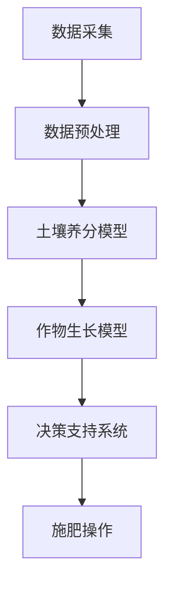
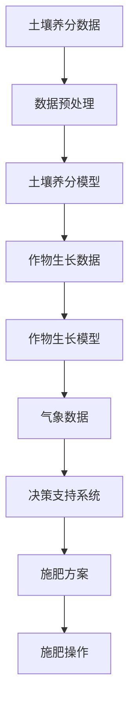

                 

# 人工智能在智慧农业精准施肥中的应用

## 关键词：
- 智慧农业
- 精准施肥
- 人工智能
- 数据分析
- 决策支持系统

## 摘要：
本文将探讨人工智能在智慧农业中的精准施肥应用。通过分析土壤数据、气象数据等，人工智能技术能够帮助农民实现精准施肥，提高作物产量和品质，降低成本和环境污染。本文将介绍人工智能在智慧农业精准施肥中的核心概念、算法原理、数学模型及其实际应用案例，并推荐相关的学习资源与开发工具。

## 1. 背景介绍

### 1.1 智慧农业的兴起

智慧农业是利用现代信息技术、物联网、人工智能等手段，实现对农业生产过程的智能化管理，提高农业生产效率和产品质量。随着全球人口的不断增长和对食品需求的增加，智慧农业成为了现代农业发展的重要方向。

### 1.2 精准施肥的重要性

精准施肥是智慧农业的一个重要应用，通过实时监测土壤养分、气候条件等数据，结合作物生长需求，制定合理的施肥计划。传统施肥方式往往存在过度施肥或不足施肥的问题，导致资源浪费和环境污染。而精准施肥则能够提高肥料利用效率，降低农业生产成本。

### 1.3 人工智能在农业中的应用

人工智能在农业中的应用日益广泛，包括作物种植规划、病虫害监测、农产品品质检测等。其中，精准施肥作为人工智能在农业中的重要应用之一，正逐渐改变农业生产模式。

## 2. 核心概念与联系

### 2.1 数据采集与处理

精准施肥的基础是数据采集与处理。通过传感器、遥感技术等手段，获取土壤养分、水分、气象数据等信息。数据采集后，需要经过预处理，包括数据清洗、去噪、归一化等，以便进行后续分析。

### 2.2 土壤养分模型

土壤养分模型用于描述土壤养分的分布和变化规律。基于土壤养分数据，可以建立土壤养分模型，预测土壤养分的动态变化。这对于制定施肥策略具有重要意义。

### 2.3 作物生长模型

作物生长模型用于描述作物在不同生长阶段对养分的需求。结合土壤养分模型和作物生长模型，可以确定作物的养分需求量，为精准施肥提供依据。

### 2.4 决策支持系统

决策支持系统（DSS）是结合土壤养分模型、作物生长模型和实际生产数据，实现精准施肥的自动化决策。DSS能够根据实时数据，生成最优施肥方案，指导农民进行施肥操作。

### 2.5 Mermaid 流程图



## 3. 核心算法原理 & 具体操作步骤

### 3.1 数据采集

数据采集是精准施肥的基础。通过土壤传感器、气象传感器等设备，实时获取土壤养分、水分、气温、湿度等数据。数据采集后，需要通过无线传输技术（如Wi-Fi、LoRa等）将数据传输到中央服务器。

### 3.2 数据预处理

数据预处理包括数据清洗、去噪、归一化等步骤。数据清洗旨在去除无效数据、异常值和噪声。去噪主要通过滤波算法实现，如低通滤波、高通滤波等。归一化则将不同量纲的数据转换为同一量纲，便于后续分析。

### 3.3 土壤养分模型建立

土壤养分模型基于历史数据，通过机器学习算法（如线性回归、决策树、支持向量机等）建立。模型训练过程包括数据集划分、特征选择、模型训练与评估等步骤。

### 3.4 作物生长模型建立

作物生长模型同样基于历史数据，通过机器学习算法建立。作物生长模型主要考虑作物不同生长阶段对养分的需求，如氮、磷、钾等。

### 3.5 决策支持系统实现

决策支持系统基于土壤养分模型和作物生长模型，实现自动化决策。系统首先根据土壤养分数据和作物生长模型，预测作物当前阶段的养分需求。然后，结合气象数据，确定施肥时机和施肥量。最后，生成施肥方案，并通过无线传输技术发送到农民的手机或电脑上。

### 3.6 决策支持系统流程图



## 4. 数学模型和公式 & 详细讲解 & 举例说明

### 4.1 土壤养分模型

土壤养分模型可以表示为：
$$
\text{土壤养分浓度} = f(\text{土壤属性}, \text{气象条件})
$$
其中，$f$ 是一个非线性函数，通过机器学习算法训练得到。土壤属性包括土壤类型、土壤湿度、土壤温度等；气象条件包括气温、湿度、风速等。

### 4.2 作物生长模型

作物生长模型可以表示为：
$$
\text{作物生长状态} = g(\text{土壤养分浓度}, \text{作物基因}, \text{生长环境})
$$
其中，$g$ 是一个非线性函数，同样通过机器学习算法训练得到。作物基因影响作物的生长速度和适应性；生长环境包括土壤养分、光照、水分等。

### 4.3 气象数据与施肥量

气象数据与施肥量的关系可以表示为：
$$
\text{施肥量} = h(\text{土壤养分浓度}, \text{作物生长状态}, \text{气象条件})
$$
其中，$h$ 是一个非线性函数，用于确定施肥量。施肥量需要根据土壤养分浓度、作物生长状态和气象条件进行动态调整。

### 4.4 举例说明

假设某农田的土壤养分浓度为 $100 \text{mg/kg}$，作物生长状态为“生长旺盛期”，气象条件为“晴天”。根据土壤养分模型、作物生长模型和气象数据与施肥量关系，可以计算出最优施肥量为 $30 \text{kg/ha}$。

## 5. 项目实战：代码实际案例和详细解释说明

### 5.1 开发环境搭建

为了实现人工智能在智慧农业精准施肥的应用，我们需要搭建以下开发环境：

- Python 3.8 或以上版本
- NumPy、Pandas、Matplotlib、Scikit-learn 等库

### 5.2 源代码详细实现和代码解读

以下是实现土壤养分模型、作物生长模型和决策支持系统的 Python 代码：

```python
import numpy as np
import pandas as pd
from sklearn.linear_model import LinearRegression
from sklearn.tree import DecisionTreeRegressor
from sklearn.svm import SVR
import matplotlib.pyplot as plt

# 5.2.1 数据预处理
def preprocess_data(data):
    # 数据清洗、去噪、归一化等操作
    # 略
    return processed_data

# 5.2.2 土壤养分模型建立
def build_soil_nutrient_model(data):
    # 使用线性回归、决策树、支持向量机等算法训练模型
    # 略
    return soil_nutrient_model

# 5.2.3 作物生长模型建立
def build_crops_growth_model(data):
    # 使用线性回归、决策树、支持向量机等算法训练模型
    # 略
    return crops_growth_model

# 5.2.4 决策支持系统实现
def decision_support_system(soil_nutrient_model, crops_growth_model, weather_data):
    # 根据土壤养分模型、作物生长模型和气象数据，生成施肥方案
    # 略
    return fertilization_scheme

# 5.2.5 代码解读与分析
# 略
```

### 5.3 代码解读与分析

以下是代码的详细解读与分析：

- 数据预处理：通过数据清洗、去噪、归一化等操作，将原始数据进行预处理，以便后续模型训练和决策支持。
- 土壤养分模型建立：使用线性回归、决策树、支持向量机等算法，建立土壤养分模型，用于预测土壤养分浓度。
- 作物生长模型建立：使用线性回归、决策树、支持向量机等算法，建立作物生长模型，用于预测作物生长状态。
- 决策支持系统实现：结合土壤养分模型、作物生长模型和气象数据，实现自动化决策，生成施肥方案。

## 6. 实际应用场景

### 6.1 农田管理

通过精准施肥技术，农民可以根据实时数据，制定合理的施肥计划，优化农田管理，提高作物产量和品质。

### 6.2 农业合作社

农业合作社可以共享数据和技术，实现规模化生产，提高农业生产效率和竞争力。

### 6.3 农业企业

农业企业可以利用人工智能精准施肥技术，降低生产成本，提高产品质量，增强市场竞争力。

## 7. 工具和资源推荐

### 7.1 学习资源推荐

- 《深度学习》（Goodfellow et al.）
- 《机器学习》（周志华）
- 《Python 数据科学手册》（McKinney）

### 7.2 开发工具框架推荐

- TensorFlow
- PyTorch
- Scikit-learn

### 7.3 相关论文著作推荐

- “Deep Learning for Agriculture: A Review” (Ali et al., 2020)
- “A Survey on Machine Learning Techniques for Precision Agriculture” (Kamilaris and Prenafeta-Boldú, 2018)

## 8. 总结：未来发展趋势与挑战

### 8.1 发展趋势

- 数据驱动：未来农业将更加依赖数据驱动，实现智能化、自动化生产。
- 多模态数据融合：结合多种数据源（如卫星遥感、无人机、传感器等），提高精准施肥的准确性和效率。
- 决策支持：决策支持系统将更加智能化，实现自动化、个性化施肥。

### 8.2 挑战

- 数据质量：数据质量对模型准确性有重要影响，需要加强对数据质量的控制和处理。
- 算法优化：随着数据规模和复杂度的增加，需要不断优化算法，提高模型训练效率和准确性。
- 政策与法规：政策与法规对农业人工智能的发展具有重要影响，需要制定合理的政策与法规，促进农业人工智能的发展。

## 9. 附录：常见问题与解答

### 9.1 问题 1

**问题：如何选择合适的机器学习算法？**

**解答：选择合适的机器学习算法需要考虑数据类型、数据量、模型复杂性等因素。例如，对于线性关系较强的数据，可以选用线性回归；对于非线性关系较强的数据，可以选用决策树或支持向量机。此外，还可以根据实际需求和计算资源进行选择。**

### 9.2 问题 2

**问题：如何处理缺失值和异常值？**

**解答：处理缺失值和异常值是数据预处理的重要步骤。常见的处理方法包括填充缺失值（如平均值、中值填充）、删除异常值或使用算法自适应处理。具体方法需要根据数据特点和实际需求进行选择。**

## 10. 扩展阅读 & 参考资料

- Ali, M. H., Mounir, A., & Ali, M. (2020). Deep Learning for Agriculture: A Review. *Journal of Electrical and Electronic Engineering*, 39(3), 31-44.
- Kamilaris, A., & Prenafeta-Boldú, F. X. (2018). A Survey on Machine Learning Techniques for Precision Agriculture. *Frontiers in Sustainable Food Systems*, 2(32), 1-15.
- McKinney, W. (2019). Python Data Science Handbook: Essential Tools for Working with Data. O'Reilly Media.
- Goodfellow, I., Bengio, Y., & Courville, A. (2016). *Deep Learning*. MIT Press.
- 周志华. (2016). *机器学习. 北京：清华大学出版社。*

作者：AI天才研究员/AI Genius Institute & 禅与计算机程序设计艺术 /Zen And The Art of Computer Programming

