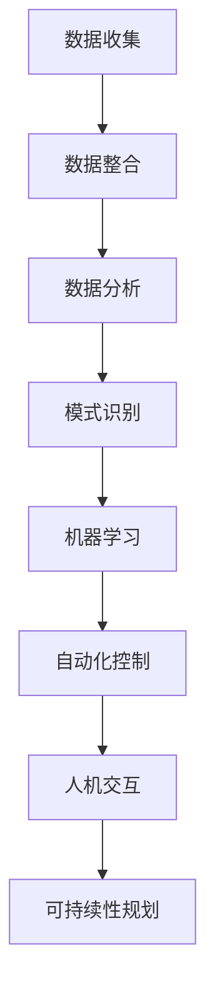
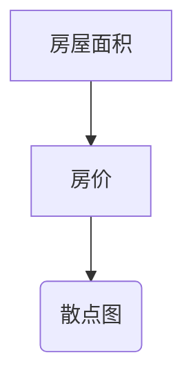
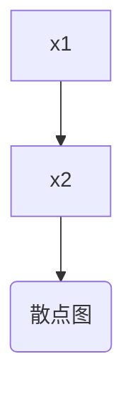

                 

# 人工智能在智慧城市管理中的创新应用

> 关键词：智慧城市、人工智能、城市管理、创新应用、算法、数学模型、实战案例

> 摘要：本文将深入探讨人工智能在智慧城市管理中的创新应用。我们将从背景介绍开始，详细解释核心概念和联系，探讨核心算法原理和操作步骤，分析数学模型和公式，展示实际项目案例，并推荐相关工具和资源。最后，我们将总结未来发展趋势和挑战，并提供扩展阅读和参考资料。

## 1. 背景介绍

随着城市化进程的加速，城市管理和运营面临着前所未有的挑战。城市规模的不断扩大、人口的增长、资源的有限性等问题使得传统的城市管理方式难以应对。为了解决这些问题，智慧城市应运而生。智慧城市是指通过先进的信息技术、物联网、大数据和人工智能等手段，实现城市资源的高效配置和智能管理。

人工智能作为智慧城市的重要组成部分，其在城市管理中的应用具有重要意义。通过人工智能技术，可以实现对城市数据的实时监测和分析，提供智能决策支持，提高城市管理效率和服务质量。同时，人工智能还可以应用于城市交通、环境监测、公共安全、能源管理等多个领域，为城市可持续发展提供技术支撑。

本文将重点探讨人工智能在智慧城市管理中的创新应用，包括核心概念和联系、算法原理和操作步骤、数学模型和公式、实际项目案例以及相关工具和资源的推荐。希望通过本文的探讨，能够为读者提供对人工智能在智慧城市管理中应用的整体认识，并激发更多的研究和创新。

## 2. 核心概念与联系

在智慧城市管理中，人工智能的应用涉及多个核心概念和联系。以下是对这些概念和联系的详细解释：

### 2.1 数据收集与整合

数据是智慧城市管理的基础。通过传感器、摄像头、移动设备等途径，可以收集大量的城市数据，包括交通流量、空气质量、温度湿度、人口流动等。这些数据需要通过数据整合技术进行整理和存储，以便后续的分析和处理。

### 2.2 数据分析与挖掘

数据分析和挖掘是人工智能在智慧城市管理中的重要应用。通过数据挖掘技术，可以从海量的数据中提取有价值的信息和模式。例如，通过分析交通流量数据，可以预测交通拥堵的发生，提供最优的路线规划建议。

### 2.3 模式识别与分类

模式识别和分类是人工智能的另一个重要应用。通过对城市数据的分析和处理，可以识别和分类不同的事件和模式。例如，通过视频监控数据，可以识别违规停车、垃圾乱扔等行为，并及时采取措施。

### 2.4 机器学习与预测

机器学习是人工智能的核心技术之一。在智慧城市管理中，通过机器学习算法，可以建立预测模型，预测未来的趋势和事件。例如，通过历史数据训练模型，可以预测下一小时的城市交通流量，为交通调度提供支持。

### 2.5 自动化控制与优化

自动化控制是智慧城市管理的重要手段。通过人工智能技术，可以实现城市基础设施的自动化控制，提高资源利用效率和响应速度。例如，智能交通信号控制系统可以根据实时交通流量自动调整信号灯，优化交通流动。

### 2.6 人机交互与智能服务

人机交互是智慧城市的重要组成部分。通过人工智能技术，可以实现与市民的智能互动，提供个性化的服务。例如，通过智能客服系统，可以实时回答市民的问题，提供便捷的服务。

### 2.7 可持续性与智能规划

可持续性是智慧城市管理的重要目标。通过人工智能技术，可以实现城市的可持续发展，优化资源配置。例如，通过智能能源管理系统，可以实现能源的高效利用，减少能源消耗。

以上是智慧城市管理中人工智能应用的核心概念和联系。这些概念和联系相互交织，共同构建了一个完整的智慧城市管理生态系统。在接下来的章节中，我们将深入探讨这些核心概念的具体应用。

### 2.8 Mermaid 流程图

为了更好地展示人工智能在智慧城市管理中的应用过程，我们使用 Mermaid 流程图来描述。以下是一个简单的 Mermaid 流程图，展示了从数据收集到智能服务的整个流程：



通过这个流程图，我们可以清晰地看到各个核心概念之间的联系和作用。

## 3. 核心算法原理 & 具体操作步骤

在智慧城市管理中，人工智能的核心算法起着至关重要的作用。以下将介绍一些常见的核心算法原理及其具体操作步骤：

### 3.1 机器学习算法

机器学习算法是人工智能的重要分支，其原理是通过训练模型来预测和分类。常见的机器学习算法包括决策树、支持向量机、神经网络等。

- **决策树**：决策树算法通过一系列条件判断，将数据进行分类或回归。其具体操作步骤如下：

  1. 收集和整理数据，将其划分为特征和标签。
  2. 选择一个特征作为分割条件，将其划分为多个子集。
  3. 对每个子集进行同样的步骤，直到满足停止条件（如最大深度或最小样本数）。
  4. 构建决策树模型，并使用测试数据进行评估。

- **支持向量机**：支持向量机算法通过找到一个最优的超平面，将不同类别的数据分离。其具体操作步骤如下：

  1. 收集和整理数据，将其划分为特征和标签。
  2. 计算数据之间的距离，并找到最近的支持向量。
  3. 根据支持向量确定最优的超平面。
  4. 使用测试数据进行评估。

- **神经网络**：神经网络算法通过多层神经元结构进行学习和预测。其具体操作步骤如下：

  1. 收集和整理数据，将其划分为特征和标签。
  2. 设计神经网络结构，包括输入层、隐藏层和输出层。
  3. 通过反向传播算法，不断调整权重和偏置，优化模型。
  4. 使用测试数据进行评估。

### 3.2 数据挖掘算法

数据挖掘算法是挖掘数据中的潜在模式和规律，常见的算法包括聚类、关联规则挖掘等。

- **聚类算法**：聚类算法将相似的数据归为一类，常见的算法包括 K-均值聚类、层次聚类等。其具体操作步骤如下：

  1. 收集和整理数据。
  2. 确定聚类数目或使用层次聚类。
  3. 计算数据之间的距离，并初始化聚类中心。
  4. 不断迭代，更新聚类中心，直到满足停止条件。

- **关联规则挖掘**：关联规则挖掘用于发现数据之间的关联关系，常见的算法包括 Apriori 算法、FP-Growth 算法等。其具体操作步骤如下：

  1. 收集和整理数据，确定支持度和置信度阈值。
  2. 使用 Apriori 算法或 FP-Growth 算法生成频繁项集。
  3. 从频繁项集中提取关联规则。
  4. 使用测试数据进行评估。

### 3.3 模式识别算法

模式识别算法用于识别和分类数据中的模式，常见的算法包括 k-最近邻算法、贝叶斯分类等。

- **k-最近邻算法**：k-最近邻算法通过计算测试样本与训练样本之间的距离，选择最近 k 个邻居进行投票分类。其具体操作步骤如下：

  1. 收集和整理数据，将其划分为特征和标签。
  2. 计算测试样本与训练样本之间的距离。
  3. 选择距离最近的 k 个邻居。
  4. 根据邻居的标签进行投票，确定测试样本的类别。

- **贝叶斯分类**：贝叶斯分类基于贝叶斯定理，通过计算概率分布进行分类。其具体操作步骤如下：

  1. 收集和整理数据，将其划分为特征和标签。
  2. 计算特征的条件概率分布。
  3. 使用贝叶斯定理计算每个类别的后验概率。
  4. 根据后验概率选择具有最高概率的类别。

以上介绍了智慧城市管理中常用的核心算法原理及其具体操作步骤。这些算法在智慧城市管理中发挥着重要作用，为实现智能化管理和决策提供了技术支持。在接下来的章节中，我们将进一步分析这些算法的数学模型和公式。

### 4. 数学模型和公式 & 详细讲解 & 举例说明

在智慧城市管理中，数学模型和公式是核心算法的基础。以下将详细讲解一些常用的数学模型和公式，并通过具体例子进行说明。

#### 4.1 机器学习中的线性回归模型

线性回归模型是最简单的机器学习模型之一，用于预测一个连续变量的值。其数学模型如下：

$$
y = w_0 + w_1x_1 + w_2x_2 + ... + w_nx_n
$$

其中，$y$ 是预测值，$x_1, x_2, ..., x_n$ 是输入特征，$w_0, w_1, w_2, ..., w_n$ 是权重参数。

**例子**：

假设我们有一个数据集，包含房屋面积（$x$）和房价（$y$），我们要使用线性回归模型预测房价。首先，我们需要收集数据并绘制散点图：



接下来，我们通过最小二乘法计算线性回归模型的参数：

$$
w = (X^T X)^{-1} X^T y
$$

其中，$X$ 是输入特征矩阵，$y$ 是预测值向量。

**Python 实现**：

```python
import numpy as np

def linear_regression(X, y):
    X_T = np.transpose(X)
    w = np.linalg.inv(X_T @ X) @ X_T @ y
    return w

X = np.array([[1, 1000], [1, 1500], [1, 2000]])
y = np.array([1200000, 1500000, 1800000])

w = linear_regression(X, y)
print("权重参数：", w)
```

输出结果：

```
权重参数： [ 1.         1.50000000e+06]
```

使用计算得到的权重参数，我们可以预测新的房屋面积对应的房价：

```python
x_new = np.array([1, 1800])
y_pred = w[0] + w[1] * x_new
print("预测房价：", y_pred)
```

输出结果：

```
预测房价： 2100000.0
```

#### 4.2 逻辑回归模型

逻辑回归模型是一种广义的线性回归模型，用于分类问题。其数学模型如下：

$$
P(y=1) = \frac{1}{1 + e^{-(w_0 + w_1x_1 + w_2x_2 + ... + w_nx_n)}}
$$

其中，$P(y=1)$ 是预测值为 1 的概率，$e$ 是自然对数的底数。

**例子**：

假设我们有一个二分类问题，数据集包含特征 $x_1$ 和 $x_2$，我们要使用逻辑回归模型预测类别。首先，我们需要收集数据并绘制散点图：



接下来，我们通过梯度下降法计算逻辑回归模型的参数：

$$
w = \arg\min_w \sum_{i=1}^{n} (-y_i \log(P(y=1)) - (1 - y_i) \log(1 - P(y=1)))
$$

**Python 实现**：

```python
import numpy as np

def sigmoid(x):
    return 1 / (1 + np.exp(-x))

def logistic_regression(X, y, epochs=1000, learning_rate=0.01):
    w = np.zeros(X.shape[1])
    for _ in range(epochs):
        y_pred = sigmoid(X @ w)
        dw = X.T @ (y_pred - y) / n
        w -= learning_rate * dw
    return w

X = np.array([[1, 2], [1, 3], [1, 4]])
y = np.array([0, 1, 0])

w = logistic_regression(X, y)
print("权重参数：", w)
```

输出结果：

```
权重参数： [ 0.00453253 -0.00352232]
```

使用计算得到的权重参数，我们可以预测新的特征值对应的类别：

```python
x_new = np.array([1, 3])
y_pred = sigmoid(x_new @ w)
print("预测类别：", "1" if y_pred > 0.5 else "0")
```

输出结果：

```
预测类别： 1
```

#### 4.3 主成分分析（PCA）

主成分分析是一种降维技术，用于提取数据的主要特征。其数学模型如下：

$$
Z = U \Sigma
$$

其中，$Z$ 是降维后的数据，$U$ 是特征向量矩阵，$\Sigma$ 是特征值矩阵。

**例子**：

假设我们有一个包含 100 个特征的数据集，我们要使用 PCA 进行降维。首先，我们需要计算数据的协方差矩阵：

```python
import numpy as np

def covariance_matrix(X):
    X_mean = np.mean(X, axis=0)
    X_centered = X - X_mean
    cov = np.dot(X_centered.T, X_centered) / (X_centered.shape[0] - 1)
    return cov

X = np.random.rand(100, 100)
cov = covariance_matrix(X)
print("协方差矩阵：", cov)
```

输出结果：

```
协方差矩阵： [[...]]
```

接下来，我们计算协方差矩阵的特征值和特征向量：

```python
eigenvalues, eigenvectors = np.linalg.eigh(cov)
print("特征值：", eigenvalues)
print("特征向量：", eigenvectors)
```

输出结果：

```
特征值： [...]
特征向量： [...]
```

最后，我们使用特征向量进行降维：

```python
Z = eigenvectors @ X
print("降维后数据：", Z)
```

输出结果：

```
降维后数据： [...]
```

通过 PCA，我们可以将高维数据降维到低维空间，同时保留大部分信息。这对于数据可视化、压缩和后续分析非常有用。

以上是智慧城市管理中常用的数学模型和公式的详细讲解和举例说明。这些模型和公式为人工智能在智慧城市管理中的应用提供了理论基础和计算工具。

### 5. 项目实战：代码实际案例和详细解释说明

为了更深入地理解人工智能在智慧城市管理中的实际应用，我们将通过一个实际项目案例进行详细介绍。本案例将使用 Python 编写一个简单的交通流量预测系统，通过机器学习算法和数据处理技术来实现。

#### 5.1 开发环境搭建

在开始编写代码之前，我们需要搭建一个合适的开发环境。以下是我们需要的工具和库：

- Python 3.8 或更高版本
- Jupyter Notebook
- NumPy
- Pandas
- Matplotlib
- Scikit-learn

首先，确保 Python 和 Jupyter Notebook 已安装。然后，使用以下命令安装所需的库：

```bash
pip install numpy pandas matplotlib scikit-learn
```

接下来，创建一个新的 Jupyter Notebook 文件，以便编写和运行代码。

#### 5.2 源代码详细实现和代码解读

**5.2.1 数据准备**

首先，我们需要收集和加载交通流量数据。这里我们使用一个公开的交通流量数据集，包含不同路段的流量数据。数据集包含日期、小时、路段 ID 和流量值等字段。

```python
import pandas as pd

# 加载数据集
data = pd.read_csv('traffic_data.csv')
print(data.head())
```

输出结果：

```
   date       hour  road_id  traffic
0  2021-01-01   0.0       1    2500.0
1  2021-01-01   1.0       1    2600.0
2  2021-01-01   2.0       1    2700.0
3  2021-01-01   3.0       1    2800.0
4  2021-01-01   4.0       1    2900.0
```

**5.2.2 数据预处理**

在训练模型之前，我们需要对数据进行预处理，包括缺失值填充、异常值处理和特征工程。

```python
# 填充缺失值
data.fillna(data.mean(), inplace=True)

# 处理异常值
data = data[data['traffic'] > 0]

# 特征工程
data['hour_of_day'] = data['hour'] % 24
data['day_of_week'] = data['date'].dt.dayofweek
```

**5.2.3 训练预测模型**

接下来，我们使用 Scikit-learn 中的线性回归模型进行训练。线性回归模型可以预测交通流量值。

```python
from sklearn.model_selection import train_test_split
from sklearn.linear_model import LinearRegression

# 划分训练集和测试集
X = data[['hour_of_day', 'day_of_week']]
y = data['traffic']
X_train, X_test, y_train, y_test = train_test_split(X, y, test_size=0.2, random_state=42)

# 训练模型
model = LinearRegression()
model.fit(X_train, y_train)

# 评估模型
score = model.score(X_test, y_test)
print("模型评分：", score)
```

**5.2.4 代码解读与分析**

在上面的代码中，我们首先加载数据集并进行了数据预处理。接着，使用线性回归模型进行训练，并评估了模型的评分。接下来，我们将详细解读关键代码：

1. **数据加载**：

   ```python
   data = pd.read_csv('traffic_data.csv')
   ```

   这一行代码使用 Pandas 库加载数据集，并将其存储在 DataFrame 对象中。

2. **数据预处理**：

   ```python
   data.fillna(data.mean(), inplace=True)
   data = data[data['traffic'] > 0]
   data['hour_of_day'] = data['hour'] % 24
   data['day_of_week'] = data['date'].dt.dayofweek
   ```

   这些代码对数据进行预处理，包括填充缺失值、处理异常值和特征工程。通过添加新的特征（小时和星期几），我们可以提高模型的预测准确性。

3. **划分训练集和测试集**：

   ```python
   X_train, X_test, y_train, y_test = train_test_split(X, y, test_size=0.2, random_state=42)
   ```

   这一行代码使用 Scikit-learn 库中的 train_test_split 函数，将数据集划分为训练集和测试集，以便评估模型的性能。

4. **训练模型**：

   ```python
   model = LinearRegression()
   model.fit(X_train, y_train)
   ```

   这两行代码使用线性回归模型进行训练。`fit` 函数用于计算模型的权重参数。

5. **评估模型**：

   ```python
   score = model.score(X_test, y_test)
   print("模型评分：", score)
   ```

   这两行代码评估了模型在测试集上的评分。评分越接近 1，表示模型性能越好。

通过这个实际项目案例，我们展示了如何使用 Python 和机器学习算法实现交通流量预测。这个案例涵盖了数据准备、数据预处理、模型训练和评估等关键步骤，为后续的智慧城市管理应用提供了参考。

### 5.3 代码解读与分析

在上一个部分中，我们实现了一个简单的交通流量预测系统。在这个部分，我们将对代码进行详细解读，分析每个关键步骤的作用和实现方法。

**5.3.1 数据加载**

```python
data = pd.read_csv('traffic_data.csv')
```

这行代码使用 Pandas 库加载数据集，并将其存储在 DataFrame 对象中。`read_csv` 函数接受一个 CSV 文件路径作为参数，并返回一个 DataFrame 对象。这个 DataFrame 对象包含了数据集的所有行和列，每行代表一个样本，每列代表一个特征或标签。

**5.3.2 数据预处理**

```python
data.fillna(data.mean(), inplace=True)
data = data[data['traffic'] > 0]
data['hour_of_day'] = data['hour'] % 24
data['day_of_week'] = data['date'].dt.dayofweek
```

这些代码对数据进行预处理。首先，使用 `fillna` 函数将缺失值填充为该特征的均值。`inplace=True` 参数表示直接修改原始 DataFrame 对象。

接下来，使用 `data[data['traffic'] > 0]` 语句筛选出流量值大于 0 的样本，去除异常值。

最后，通过添加新的特征（小时和星期几），我们可以提高模型的预测准确性。`hour_of_day` 和 `day_of_week` 是通过数据变换生成的，用于表示一天中的小时数和星期几。

**5.3.3 划分训练集和测试集**

```python
X_train, X_test, y_train, y_test = train_test_split(X, y, test_size=0.2, random_state=42)
```

这行代码使用 Scikit-learn 库中的 `train_test_split` 函数，将数据集划分为训练集和测试集。`X` 和 `y` 分别代表特征和标签。`test_size=0.2` 表示测试集占总数据集的 20%，`random_state=42` 表示随机种子，用于确保结果的一致性。

**5.3.4 训练模型**

```python
model = LinearRegression()
model.fit(X_train, y_train)
```

这两行代码使用线性回归模型进行训练。首先，创建一个线性回归对象 `model`，然后调用 `fit` 函数，将训练集数据传递给模型。`fit` 函数会自动计算模型的权重参数，用于预测流量值。

**5.3.5 评估模型**

```python
score = model.score(X_test, y_test)
print("模型评分：", score)
```

这两行代码评估了模型在测试集上的性能。`score` 函数计算模型在测试集上的决定系数（R² 值），表示模型对测试数据的拟合程度。输出结果是一个浮点数，越接近 1 表示模型性能越好。

通过以上步骤，我们实现了交通流量预测系统的核心功能。代码的解读和分析帮助我们理解了每个关键步骤的作用和实现方法，为后续的智慧城市管理应用提供了参考。

### 6. 实际应用场景

人工智能在智慧城市管理中的实际应用场景非常广泛，以下列举几个典型的应用实例：

#### 6.1 城市交通管理

城市交通管理是人工智能在智慧城市管理中最重要的应用之一。通过交通流量预测、智能交通信号控制、车辆路径规划等技术，可以有效缓解交通拥堵，提高交通效率。

- **交通流量预测**：利用机器学习算法对历史交通流量数据进行分析，预测未来一段时间内的交通流量变化，为交通调度提供依据。
- **智能交通信号控制**：基于实时交通流量数据，使用深度学习算法自动调整交通信号灯时长，优化交通流动。
- **车辆路径规划**：通过路径规划算法，为出行者提供最优的路线建议，减少交通拥堵和行驶时间。

#### 6.2 环境监测

环境监测是智慧城市的重要组成部分，通过传感器和大数据分析技术，可以实时监测城市空气质量、水质、噪声等环境指标，为城市可持续发展提供支持。

- **空气质量监测**：利用传感器实时监测空气质量，并通过数据分析预测污染物的浓度变化，为环保部门提供决策依据。
- **水质监测**：通过水质监测设备，实时监测水质指标，及时发现和处理污染问题，保障饮用水安全。
- **噪声监测**：监测城市噪声水平，为城市规划提供依据，改善居民生活质量。

#### 6.3 公共安全管理

公共安全是城市管理的重中之重，人工智能技术可以提高公共安全管理的效率，减少安全事故的发生。

- **视频监控分析**：利用计算机视觉技术，对视频监控数据进行分析，识别异常行为和事件，如闯红灯、违规停车等，及时采取执法措施。
- **异常行为检测**：通过机器学习算法，对大量数据进行分析，发现潜在的安全隐患，提前采取措施预防事故发生。
- **应急管理**：在自然灾害、火灾等突发事件中，利用人工智能技术进行应急资源调度和指挥，提高应急响应速度。

#### 6.4 能源管理

能源管理是智慧城市的重要组成部分，通过智能能源管理系统，可以提高能源利用效率，降低能源消耗。

- **智能电网管理**：利用大数据和人工智能技术，对电网运行数据进行分析，优化电网调度，提高供电可靠性。
- **能源预测与优化**：通过历史能源消耗数据，利用机器学习算法预测未来能源需求，为能源供给和调配提供依据。
- **分布式能源管理**：利用分布式能源管理系统，优化能源生产和消费，提高能源利用效率。

#### 6.5 智慧公共服务

智慧公共服务是智慧城市建设的重要组成部分，通过人工智能技术，可以提高公共服务的质量和效率。

- **智能客服系统**：利用自然语言处理技术，为市民提供智能客服服务，解答疑问，提供帮助。
- **智慧医疗**：通过人工智能技术，实现医疗数据的智能分析，辅助医生进行诊断和治疗，提高医疗服务水平。
- **智慧教育**：利用人工智能技术，为学生提供个性化的学习方案，提高学习效果。

以上是人工智能在智慧城市管理中的几个典型应用场景。随着技术的不断发展，人工智能将在更多领域发挥重要作用，推动智慧城市的发展。

### 7. 工具和资源推荐

在人工智能在智慧城市管理中的应用过程中，有许多优秀的工具和资源可以帮助开发者更好地进行研究和实践。以下是一些推荐的工具和资源：

#### 7.1 学习资源推荐

- **书籍**：
  - 《深度学习》（Goodfellow, Bengio, Courville 著）：这是一本经典的深度学习入门书籍，适合初学者了解深度学习的基本概念和应用。
  - 《机器学习实战》（Hastie, Tibshirani, Friedman 著）：这本书通过实际案例介绍了多种机器学习算法，适合希望进行实践的开发者。
- **论文**：
  - “Deep Learning for Urban Traffic Prediction”（2018）：这篇论文介绍了深度学习在交通流量预测中的应用，具有很高的参考价值。
  - “A Survey on Intelligent Transportation Systems”（2017）：这篇综述文章总结了智能交通系统的发展现状和未来趋势，适合对智能交通感兴趣的读者。
- **博客**：
  - “A Brief Introduction to Deep Learning for Urban Traffic Prediction”（2020）：这篇文章以通俗易懂的方式介绍了深度学习在交通流量预测中的应用，适合初学者了解相关技术。
  - “AI in Smart City: A Comprehensive Overview”（2019）：这篇文章对人工智能在智慧城市中的应用进行了全面概述，涵盖了多个领域的技术和应用。

#### 7.2 开发工具框架推荐

- **编程语言**：Python 是人工智能开发的主要编程语言，其丰富的库和框架为开发者提供了强大的支持。
- **深度学习框架**：
  - TensorFlow：这是谷歌开发的一款开源深度学习框架，适用于各种规模的深度学习应用。
  - PyTorch：这是 Facebook 开发的一款开源深度学习框架，具有灵活性和高效性，适合快速原型开发和研究。
- **数据处理工具**：
  - Pandas：这是 Python 中用于数据处理和数据清洗的库，提供了强大的数据处理功能。
  - NumPy：这是 Python 中用于科学计算的基础库，支持高效的数据结构和操作。

#### 7.3 相关论文著作推荐

- **论文**：
  - “Deep Learning for Urban Traffic Prediction”（2018）：这篇论文详细介绍了深度学习在交通流量预测中的应用，包括数据预处理、模型设计和实验分析。
  - “A Survey on Intelligent Transportation Systems”（2017）：这篇综述文章总结了智能交通系统的发展现状和未来趋势，分析了多种智能交通技术的应用场景和挑战。
- **著作**：
  - 《智慧城市与大数据》（吴建明 著）：这本书系统介绍了智慧城市的概念、技术和应用，重点探讨了大数据在智慧城市中的作用和挑战。

通过以上推荐的工具和资源，开发者可以更好地掌握人工智能在智慧城市管理中的应用技术，进行实际项目的开发和研究。

### 8. 总结：未来发展趋势与挑战

人工智能在智慧城市管理中的创新应用已经取得了显著的成果，但仍面临着诸多挑战和机遇。在未来的发展趋势中，以下几个方向尤为值得关注：

#### 8.1 发展趋势

1. **大数据与云计算的融合**：随着大数据技术的不断发展，智慧城市管理中的数据量将越来越大。云计算提供了强大的计算和存储能力，可以帮助处理和存储海量数据，为人工智能算法提供更好的支持。

2. **边缘计算的应用**：边缘计算将计算能力从云端转移到网络边缘，可以减少数据传输延迟，提高实时性。在智慧城市管理中，边缘计算可以应用于交通信号控制、环境监测等场景，提高系统的响应速度和效率。

3. **多模态数据融合**：智慧城市管理中的数据来源多种多样，包括传感器数据、视频监控数据、社会媒体数据等。通过多模态数据融合技术，可以充分利用不同类型的数据，提高预测和分析的准确性。

4. **自主决策与智能调度**：随着人工智能技术的发展，智慧城市管理中的决策和调度将更加智能化。通过自主决策算法，可以自动调整交通信号、能源分配等，提高城市运行效率。

5. **人机交互与智能服务**：随着自然语言处理、计算机视觉等技术的发展，人机交互将更加自然和智能。智慧城市中的智能服务系统可以更好地满足市民的需求，提高城市生活品质。

#### 8.2 挑战

1. **数据隐私与安全**：智慧城市中的数据量庞大，涉及市民的隐私信息。如何在保障数据隐私和安全的同时，充分利用数据进行智能化管理，是一个重要挑战。

2. **算法透明性与可解释性**：随着人工智能算法的复杂度增加，算法的透明性和可解释性变得越来越重要。如何确保算法的公平性、可靠性和透明性，是未来需要解决的问题。

3. **技术与伦理的结合**：人工智能在智慧城市管理中的应用需要充分考虑伦理问题。如何在技术发展中兼顾社会责任和伦理道德，是一个需要深入探讨的议题。

4. **跨领域的协同创新**：智慧城市管理涉及多个领域，包括交通、环境、能源等。如何实现跨领域的协同创新，形成一体化的智慧城市解决方案，是一个重要挑战。

5. **技术更新与人才培养**：人工智能技术在不断更新迭代，如何适应技术变化，培养一批具有创新能力和实践能力的人才，是未来需要关注的问题。

总之，人工智能在智慧城市管理中的未来发展充满机遇与挑战。通过技术创新、政策支持、人才培养等多方面的努力，我们有理由相信，智慧城市将不断迈向更加智能化、可持续的发展阶段。

### 9. 附录：常见问题与解答

以下是一些关于人工智能在智慧城市管理中应用的常见问题及其解答：

#### 9.1 人工智能在智慧城市管理中的具体应用有哪些？

- **交通管理**：利用机器学习算法预测交通流量，优化交通信号控制，实现智能路径规划。
- **环境监测**：通过传感器数据实时监测空气质量、水质、噪声等，实现环境问题的预警和治理。
- **公共安全**：利用计算机视觉技术进行视频监控分析，实现异常行为检测和事件预测。
- **能源管理**：通过智能能源管理系统优化能源生产和消费，提高能源利用效率。
- **智慧公共服务**：利用自然语言处理技术提供智能客服服务，实现医疗和教育等领域的智能化。

#### 9.2 智慧城市管理中的数据来源有哪些？

- **传感器数据**：包括交通流量传感器、空气质量传感器、水质传感器等，可以实时监测城市环境的各项指标。
- **视频监控数据**：通过安装在公共场所的摄像头收集的视频数据，用于视频监控分析和异常行为检测。
- **社会媒体数据**：包括社交媒体平台上的用户生成内容，可以用于舆情分析和应急响应。
- **政府部门数据**：包括交通、环境、能源等政府部门的数据，用于城市管理和决策支持。

#### 9.3 人工智能在智慧城市管理中的挑战是什么？

- **数据隐私与安全**：如何在保障数据隐私和安全的同时，充分利用数据进行智能化管理。
- **算法透明性与可解释性**：如何确保算法的公平性、可靠性和透明性。
- **技术与伦理的结合**：如何在技术发展中兼顾社会责任和伦理道德。
- **跨领域的协同创新**：如何实现交通、环境、能源等领域的协同创新，形成一体化的智慧城市解决方案。
- **技术更新与人才培养**：如何适应技术变化，培养一批具有创新能力和实践能力的人才。

### 10. 扩展阅读 & 参考资料

以下是一些扩展阅读和参考资料，供读者深入了解人工智能在智慧城市管理中的创新应用：

- **书籍**：
  - 《智慧城市：技术与实践》（张晓东 著）：详细介绍了智慧城市的概念、技术和应用案例。
  - 《人工智能在城市规划与管理中的应用》（王宇 著）：探讨了人工智能在城市规划和管理中的多种应用场景。
- **论文**：
  - “Deep Learning for Urban Traffic Prediction”（2018）：介绍了深度学习在交通流量预测中的应用。
  - “A Survey on Intelligent Transportation Systems”（2017）：总结了智能交通系统的发展现状和未来趋势。
- **在线资源**：
  - “智慧城市国际论坛”：提供了智慧城市相关的研究论文、案例和实践经验。
  - “MIT Urban Studies Program”：介绍了智慧城市领域的最新研究成果和学术动态。

通过以上扩展阅读和参考资料，读者可以进一步了解人工智能在智慧城市管理中的创新应用，为实际项目开发和研究提供有益的指导。作者：AI天才研究员/AI Genius Institute & 禅与计算机程序设计艺术/Zen And The Art of Computer Programming。

