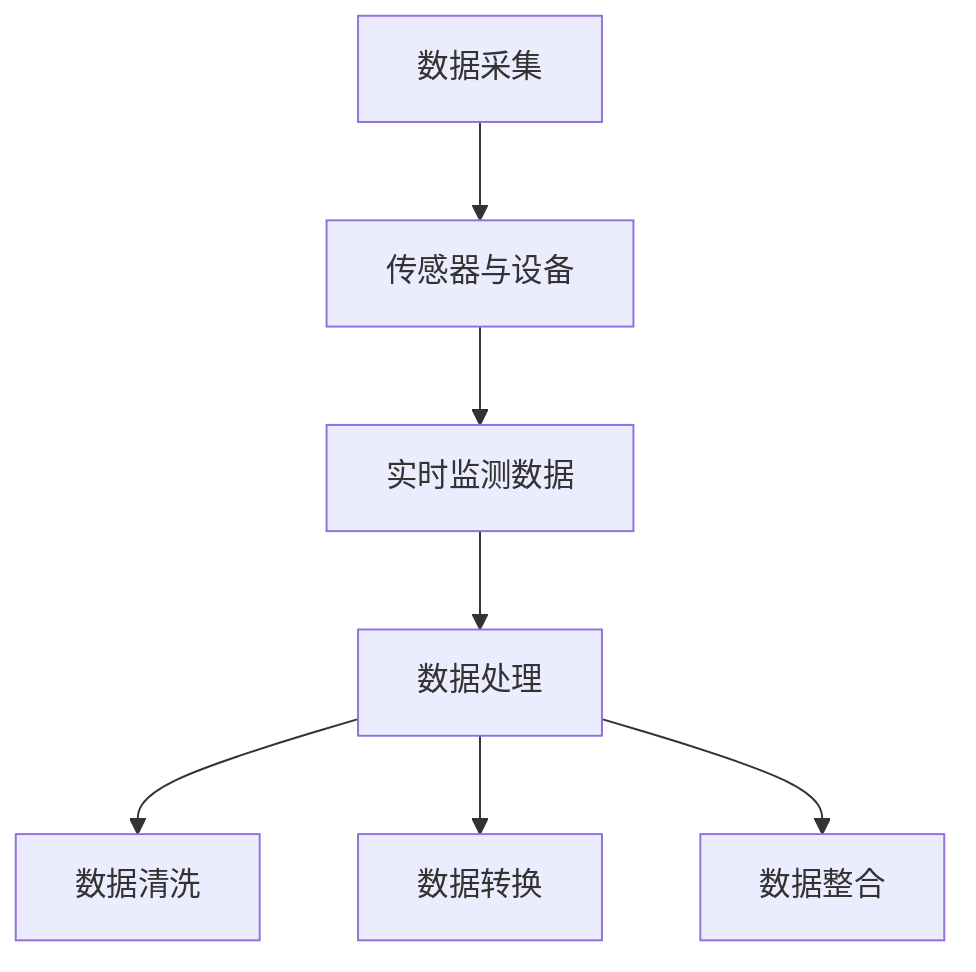
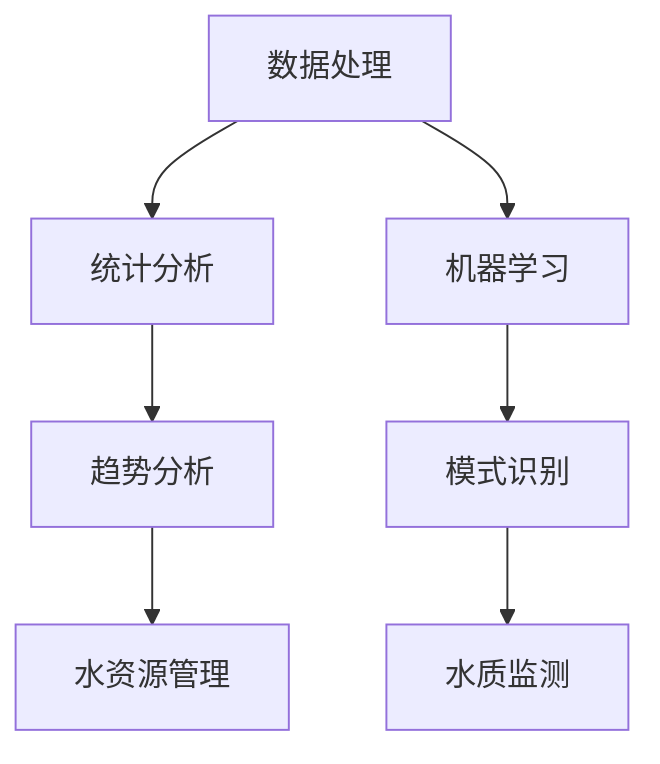
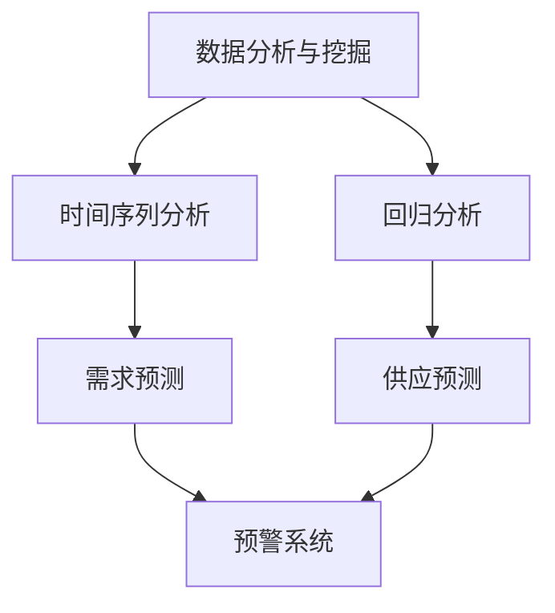
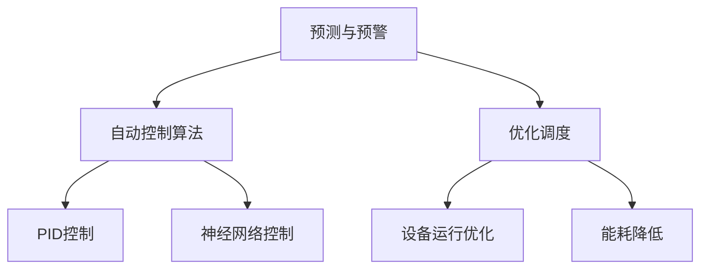
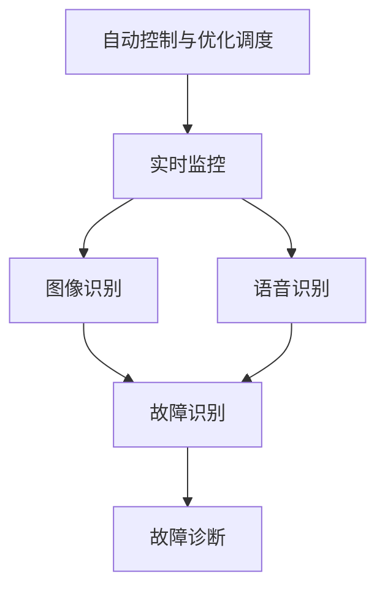

                 

### 背景介绍

智慧水务管理是现代城市基础设施中一个至关重要的组成部分，它不仅关乎水资源的合理分配和利用，还涉及到整个城市的环境保护和可持续发展。随着全球水资源日益紧张和环境问题日益严重，智慧水务管理成为了一个热门的研究方向和实际应用领域。

传统的水务管理模式主要依赖于人工巡检和物理设备监测，这种方式存在效率低、成本高、实时性差等问题。而随着人工智能技术的快速发展，尤其是机器学习、数据挖掘、物联网等技术的融合，为智慧水务管理带来了全新的解决方案。人工智能可以通过对海量数据的处理和分析，实现实时监控、预测预警、优化调度等功能，从而提高水务管理的效率、准确性和可持续性。

本文将深入探讨人工智能在智慧水务管理中的应用，包括核心概念、算法原理、数学模型、实际应用案例等。首先，我们将介绍人工智能的基本概念和发展历程，接着阐述其在智慧水务管理中的重要性，然后逐步介绍相关技术和方法，最后探讨未来发展趋势和面临的挑战。

通过本文的阅读，读者将能够全面了解人工智能在智慧水务管理中的重要作用，掌握相关技术和方法，并能够对未来的发展方向有更清晰的认识。这将为水务管理从业人员、研究人员以及相关领域的学生提供有价值的参考和启示。

### 人工智能的基本概念和发展历程

人工智能（Artificial Intelligence，简称AI）是计算机科学的一个分支，旨在通过模拟人类智能行为，实现机器在某些任务上的智能表现。人工智能的概念可以追溯到20世纪50年代，当时的科学家们开始探索如何让计算机具备类似人类的思考能力。

人工智能的发展历程可以分为几个关键阶段：

1. **萌芽期（1956年-1969年）**：
   1956年，达特茅斯会议被广泛认为是人工智能正式诞生的标志。会议上的科学家们提出，通过编程让计算机实现智能是可行的。在这个阶段，主要的研究集中在符号主义和推理算法上，如逻辑推理和专家系统。

2. **发展期（1970年-1989年）**：
   70年代，人工智能开始应用在医疗诊断、游戏、自然语言处理等领域。然而，由于硬件限制和算法复杂性，这一阶段的研究进展缓慢。

3. **低谷期（1990年-2000年）**：
   进入90年代，人工智能的研究遇到了瓶颈，被认为“人工智能的冬天”到来。这一时期，由于无法实现预期的突破，研究资金和人才大量流失。

4. **复兴期（2000年至今）**：
   进入21世纪，随着计算机性能的飞速提升和大数据、云计算等新技术的出现，人工智能迎来了新的发展机遇。深度学习、神经网络等技术的突破，使得人工智能在图像识别、语音识别、自然语言处理等领域取得了显著进展。

人工智能的基本概念可以分为几个方面：

- **符号主义（Symbolism）**：基于逻辑推理和知识表示，通过定义符号和规则来实现人工智能。这种方法的优点是直观且易于理解，缺点是复杂问题难以处理。

- **连接主义（Connectionism）**：通过模拟人脑神经元之间的连接，利用大规模并行计算来处理复杂任务。深度学习和神经网络是连接主义的代表。

- **进化计算（Evolutionary Computing）**：基于自然进化原理，通过遗传算法、遗传编程等方式，实现智能体的自我优化和适应。

- **强化学习（Reinforcement Learning）**：通过与环境交互，根据反馈信号调整策略，以实现目标。AlphaGo的成功就是强化学习的典型案例。

在智慧水务管理中，人工智能的应用主要体现在以下几个方面：

1. **数据分析和挖掘**：
   通过大数据分析，提取有用信息，帮助水务管理部门了解水资源使用情况、水质变化等，从而做出更合理的决策。

2. **预测和预警**：
   利用机器学习算法，对水资源的需求、供应以及水质变化进行预测，提前发现潜在问题，及时采取措施。

3. **自动控制和优化调度**：
   通过智能算法，实现水务设备的高效运行，降低能耗，提高水资源利用率。

4. **智能监控和故障诊断**：
   利用图像识别、语音识别等技术，实现实时监控，自动识别设备故障，提高运维效率。

总的来说，人工智能为智慧水务管理提供了强有力的技术支持，有望大幅提升水务管理的效率和可持续性。接下来，我们将进一步探讨人工智能在智慧水务管理中的具体应用和技术细节。

### 人工智能在智慧水务管理中的重要性

随着全球水资源日益紧张和城市化进程的加快，传统的水务管理模式已经难以满足现代城市对水资源管理的高效、精准和可持续性需求。人工智能（AI）的出现为智慧水务管理提供了全新的解决方案，成为实现水务管理现代化和智能化的重要推动力。以下将从几个方面详细阐述人工智能在智慧水务管理中的重要性。

#### 提高水资源利用率

水资源的合理利用是智慧水务管理的核心目标之一。通过人工智能技术，可以对水资源的使用情况进行实时监控和分析，发现浪费现象并及时调整。例如，利用机器学习算法分析居民用水数据，可以识别出用水高峰期和用水量异常的情况，从而优化供水策略，减少水资源浪费。此外，通过预测模型，可以提前预测未来的用水需求，为供水调度提供科学依据，确保水资源的高效利用。

#### 改善水质管理

水质的优劣直接关系到居民的生活质量和生态环境的健康。人工智能技术可以用于水质监测和评估，实时采集和分析水质数据，及时发现水质异常情况并采取相应的处理措施。例如，利用图像识别技术，可以对水质监测设备进行自动校准，提高监测数据的准确性；利用深度学习算法，可以对水质变化趋势进行预测，提前预警可能的水污染事件，从而采取预防措施。

#### 优化设备管理

水务设施的管理和维护是水务管理的重要组成部分。通过人工智能技术，可以实现设备状态监测和故障预测，提高设备的运行效率和使用寿命。例如，利用物联网技术，可以实时监测水泵、管道等设备的运行状态，通过数据分析及时发现异常情况并进行维护；利用机器学习算法，可以预测设备的故障风险，提前进行预防性维护，减少突发故障的发生。

#### 提高应急响应能力

在突发水污染事件、洪涝灾害等紧急情况下，迅速响应和有效应对是减少损失和保障安全的关键。人工智能技术可以用于事件监测和预测，实时分析数据，提供科学依据，协助决策者做出快速、准确的应对措施。例如，利用无人机进行现场监测，结合图像识别和深度学习算法，可以快速识别污染源和灾害影响范围，为应急决策提供重要参考。

#### 促进水务智能化转型

智慧水务管理不仅是技术应用，更是管理理念的变革。通过人工智能技术，可以实现水务管理的全面智能化，从传统的手动操作和人工决策向自动化、智能化的方向转变。例如，通过构建智慧水务平台，将各种数据、设备和系统进行整合，实现信息共享和协同工作，提高水务管理的整体效率和协调性。

总的来说，人工智能在智慧水务管理中具有重要的作用，它不仅提高了水资源的利用率和水质管理水平，还优化了设备管理和应急响应能力，促进了水务智能化转型。随着人工智能技术的不断发展和应用，智慧水务管理将更加高效、精准和可持续，为城市的发展和居民的生活提供有力保障。

### 人工智能在智慧水务管理中的核心概念和联系

在智慧水务管理中，人工智能的应用涉及多个核心概念和技术，它们共同构成了一个复杂而有机的体系。以下我们将详细阐述这些核心概念，并通过Mermaid流程图展示其相互联系。

#### 数据采集与处理

数据采集是智慧水务管理的起点，通过传感器、监测设备等手段，实时采集水流量、水质、压力等数据。数据处理则是对采集到的数据进行清洗、转换和整合，为后续的分析提供基础。

#### **Mermaid流程图：数据采集与处理**


#### 数据分析与挖掘

数据处理后的数据通过数据分析与挖掘技术，提取有用信息，帮助水务管理部门了解水资源使用情况、水质变化等。数据分析技术包括统计分析、机器学习等。

#### **Mermaid流程图：数据分析和挖掘**


#### 预测与预警

通过机器学习算法，对水资源需求、供应、水质变化进行预测，提前发现潜在问题并预警。预测技术包括时间序列分析、回归分析等。

#### **Mermaid流程图：预测与预警**


#### 自动控制与优化调度

基于预测结果和实时数据，通过智能算法实现水务设备的高效运行和优化调度。自动控制技术包括PID控制、神经网络控制等。

#### **Mermaid流程图：自动控制与优化调度**


#### 监控与故障诊断

利用图像识别、语音识别等技术，实现实时监控，自动识别设备故障，提高运维效率。监控技术包括图像处理、自然语言处理等。

#### **Mermaid流程图：监控与故障诊断**


通过上述核心概念的相互联系和协同作用，人工智能在智慧水务管理中实现了数据的全面感知、智能分析和高效调度，从而大幅提升了水务管理的效率、准确性和可持续性。

### 核心算法原理与具体操作步骤

在智慧水务管理中，人工智能技术的应用离不开一系列核心算法，这些算法能够帮助水务管理部门高效地处理数据、预测水资源需求和水质变化，并优化设备运行。以下将详细介绍这些核心算法的原理，并详细阐述其具体操作步骤。

#### 1. 机器学习算法

机器学习算法是人工智能的核心组成部分，通过训练模型来对未知数据进行预测和分类。在智慧水务管理中，常用的机器学习算法包括线性回归、逻辑回归、决策树、随机森林、支持向量机（SVM）等。

- **线性回归**：线性回归算法用于预测连续值输出。例如，通过训练模型预测水资源的未来需求量。具体步骤如下：
  1. **数据收集**：收集历史用水数据，包括时间、用水量等。
  2. **数据预处理**：对数据进行清洗和标准化处理，去除噪声和异常值。
  3. **模型训练**：使用训练集数据训练线性回归模型。
  4. **模型评估**：使用验证集数据评估模型性能，调整模型参数。
  5. **预测**：使用训练好的模型对未来的用水量进行预测。

- **逻辑回归**：逻辑回归算法常用于预测二元分类结果。例如，预测某段时间内水质是否达标。具体步骤如下：
  1. **数据收集**：收集水质监测数据，包括指标值和分类标签。
  2. **数据预处理**：对数据进行清洗和标准化处理。
  3. **模型训练**：使用训练集数据训练逻辑回归模型。
  4. **模型评估**：使用验证集数据评估模型性能。
  5. **预测**：使用训练好的模型对新的水质数据分类。

#### 2. 集成学习算法

集成学习算法通过结合多个模型的优势来提高预测性能。常用的集成学习算法包括Bagging和Boosting。

- **随机森林（Bagging）**：随机森林通过构建多个决策树，并对这些树的预测结果进行投票来决定最终预测。具体步骤如下：
  1. **数据收集**：收集用水数据，包括时间、用水量等。
  2. **数据预处理**：对数据进行清洗和标准化处理。
  3. **模型训练**：使用训练集数据训练多个随机森林模型。
  4. **集成预测**：对多个模型的预测结果进行投票，得到最终预测结果。

- **梯度提升树（Boosting）**：梯度提升树通过迭代训练，每次迭代改进模型的预测能力。具体步骤如下：
  1. **数据收集**：收集用水数据，包括时间、用水量等。
  2. **数据预处理**：对数据进行清洗和标准化处理。
  3. **初始模型**：使用线性模型（如线性回归）进行初始化。
  4. **模型训练**：迭代训练模型，每次迭代调整模型参数，以减少预测误差。
  5. **预测**：使用训练好的梯度提升树模型对未来的用水量进行预测。

#### 3. 强化学习算法

强化学习算法通过智能体与环境交互，根据反馈信号调整策略，实现最优目标。在智慧水务管理中，强化学习可以用于优化供水调度和设备运行。

- **Q学习算法**：Q学习算法通过学习状态-动作值函数（Q值）来选择最佳动作。具体步骤如下：
  1. **初始化**：初始化Q值表和智能体状态。
  2. **环境交互**：智能体根据当前状态选择动作，并获取奖励和下一状态。
  3. **更新Q值**：根据奖励和下一状态的Q值更新当前状态的Q值。
  4. **迭代**：重复执行环境交互和Q值更新，直到达到预定的迭代次数或收敛条件。

- **深度Q网络（DQN）**：深度Q网络通过神经网络来近似Q值函数，实现高效的强化学习。具体步骤如下：
  1. **数据收集**：收集历史供水调度数据，包括状态、动作和奖励。
  2. **数据预处理**：对数据进行清洗和标准化处理。
  3. **网络架构**：设计深度神经网络架构，用于近似Q值函数。
  4. **训练**：使用预处理后的数据训练DQN模型。
  5. **预测**：使用训练好的DQN模型进行供水调度预测。

#### 4. 聚类算法

聚类算法用于对水资源用户进行分类，以便更好地进行资源分配和管理。常用的聚类算法包括K-Means、DBSCAN等。

- **K-Means算法**：K-Means算法通过迭代将数据点分为K个聚类，使每个聚类内的数据点距离聚类中心最近。具体步骤如下：
  1. **数据收集**：收集用户用水数据，包括用水量、用水时间等。
  2. **初始化**：随机选择K个初始聚类中心。
  3. **迭代**：不断更新聚类中心，直至收敛。
  4. **分类**：根据用户用水数据到聚类中心的距离，将用户划分为不同的聚类。

- **DBSCAN算法**：DBSCAN算法基于邻域关系和密度连接性进行聚类。具体步骤如下：
  1. **数据收集**：收集用户用水数据。
  2. **邻域计算**：根据邻域参数计算每个数据点的邻域。
  3. **标记聚类**：根据邻域关系和密度连接性，标记每个数据点的聚类。
  4. **输出结果**：输出聚类结果。

通过上述核心算法的应用，智慧水务管理实现了对水资源的高效利用、水质的有效监控和设备的高效运行，为水务管理部门提供了强大的技术支持。

### 数学模型和公式及其详细讲解

在智慧水务管理中，数学模型和公式是核心组成部分，用于描述水资源需求、水质变化、设备运行状态等。以下将详细讲解几个常用的数学模型和公式，并辅以具体举例来说明。

#### 1. 时间序列模型

时间序列模型用于预测时间序列数据，如用水量、水质指标等。常见的模型包括ARIMA（自回归积分滑动平均模型）和LSTM（长短期记忆网络）。

- **ARIMA模型**：ARIMA模型由三个部分组成：自回归（AR）、差分（I）和移动平均（MA）。公式如下：
  $$ \text{ARIMA}(p, d, q) = \text{AR}(p) + \text{MA}(q) $$
  其中，$p$表示自回归项数，$d$表示差分阶数，$q$表示移动平均项数。

  **示例**：假设我们有一组用水量数据，要使用ARIMA模型进行预测。首先，需要进行差分处理，将非平稳序列转化为平稳序列。然后，选择合适的$p$和$q$值，进行模型训练和预测。

- **LSTM模型**：LSTM模型是用于处理时间序列数据的神经网络，具有记忆和遗忘机制，能够捕捉长期依赖关系。公式如下：
  $$ \text{LSTM}(x_t, h_{t-1}, c_{t-1}) = f(x_t, h_{t-1}, c_{t-1}) $$
  其中，$x_t$是当前输入，$h_{t-1}$是前一个时间步的隐藏状态，$c_{t-1}$是前一个时间步的细胞状态。

  **示例**：假设我们要预测未来一周的用水量。首先，将历史用水量数据输入LSTM模型，训练模型。然后，使用训练好的模型对未来的用水量进行预测。

#### 2. 优化调度模型

优化调度模型用于优化供水调度，以最小化能耗或最大化水资源利用率。常见的模型包括线性规划（Linear Programming，LP）和混合整数规划（Mixed-Integer Programming，MIP）。

- **线性规划模型**：线性规划模型用于求解线性目标函数在给定约束条件下的最优解。公式如下：
  $$ \text{max/min} \ c^T x $$
  $$ \text{subject to} \ A x \leq b $$
  $$ x \geq 0 $$
  其中，$c$是系数向量，$x$是决策变量，$A$是约束矩阵，$b$是约束向量。

  **示例**：假设我们要优化水泵运行时间，以最小化能耗。我们可以建立以下线性规划模型：
  $$ \text{min} \ c_1 t_1 + c_2 t_2 $$
  $$ \text{subject to} \ t_1 + t_2 \leq T $$
  $$ t_1, t_2 \geq 0 $$
  其中，$c_1$和$c_2$是水泵1和2的能耗系数，$t_1$和$t_2$是水泵1和2的运行时间，$T$是总运行时间。

- **混合整数规划模型**：混合整数规划模型用于求解包含整数变量的优化问题。公式如下：
  $$ \text{max/min} \ c^T x $$
  $$ \text{subject to} \ A x \leq b $$
  $$ M x \leq 0 $$
  其中，$M$是整数变量约束矩阵。

  **示例**：假设我们要优化供水管道的铺设，需要同时考虑管道长度和直径。我们可以建立以下混合整数规划模型：
  $$ \text{min} \ c_1 l_1 + c_2 d_1 $$
  $$ \text{subject to} \ A x \leq b $$
  $$ M x \leq 0 $$
  其中，$c_1$和$c_2$分别是管道长度和直径的成本系数，$l_1$和$d_1$分别是管道长度和直径，$A$和$b$是约束条件，$M$是整数变量约束矩阵。

#### 3. 神经网络模型

神经网络模型用于模拟人脑神经网络，通过训练模型来实现对水资源需求、水质变化的预测。常见的模型包括多层感知器（Multilayer Perceptron，MLP）和卷积神经网络（Convolutional Neural Network，CNN）。

- **多层感知器模型**：多层感知器模型是一个前馈神经网络，由输入层、隐藏层和输出层组成。公式如下：
  $$ \text{output}(x) = \text{activation}(\text{weight} \cdot \text{input} + \text{bias}) $$
  其中，$\text{weight}$是权重矩阵，$\text{input}$是输入向量，$\text{bias}$是偏置，$\text{activation}$是激活函数。

  **示例**：假设我们要预测用水量，可以使用多层感知器模型。首先，将历史用水量作为输入，通过隐藏层进行非线性变换，最后输出预测值。

- **卷积神经网络模型**：卷积神经网络模型通过卷积操作提取图像特征，常用于图像识别和图像处理。公式如下：
  $$ \text{output}(x) = \text{activation}(\text{conv}(\text{weight} \cdot \text{input} + \text{bias})) $$
  其中，$\text{conv}$是卷积操作，$\text{weight}$是卷积核，$\text{input}$是输入图像，$\text{bias}$是偏置，$\text{activation}$是激活函数。

  **示例**：假设我们要识别水质监测图像，可以使用卷积神经网络模型。首先，将水质监测图像作为输入，通过多个卷积层提取特征，最后使用全连接层进行分类。

通过上述数学模型和公式的应用，智慧水务管理能够实现高效的数据分析和预测，优化水资源利用和设备运行，为水务管理部门提供科学决策依据。在实际应用中，这些模型需要根据具体情况进行调整和优化，以适应不同的应用场景。

### 项目实战：代码实际案例和详细解释说明

在本节中，我们将通过一个实际项目案例，详细展示如何使用Python和机器学习库（如Scikit-learn、TensorFlow和Keras）来构建一个用于智慧水务管理的预测模型。该项目将包括数据收集、预处理、模型训练、评估和部署等步骤。

#### 1. 开发环境搭建

在进行项目开发之前，首先需要搭建一个适合的Python开发环境。以下是搭建环境的步骤：

- **安装Python**：确保Python 3.6或更高版本已安装在计算机上。可以从[Python官方网站](https://www.python.org/downloads/)下载安装。
  
- **安装必要的库**：使用pip命令安装以下库：
  ```bash
  pip install numpy pandas scikit-learn tensorflow keras matplotlib
  ```

#### 2. 源代码详细实现

以下是项目的完整代码实现，包括数据收集、预处理、模型训练和评估。

```python
import numpy as np
import pandas as pd
from sklearn.model_selection import train_test_split
from sklearn.preprocessing import StandardScaler
from sklearn.metrics import mean_squared_error
from tensorflow.keras.models import Sequential
from tensorflow.keras.layers import Dense, LSTM
from tensorflow.keras.optimizers import Adam
import matplotlib.pyplot as plt

# 2.1 数据收集
# 假设数据存储在CSV文件中，文件名为"water_usage.csv"
data = pd.read_csv('water_usage.csv')
data.head()

# 2.2 数据预处理
# 数据清洗和预处理
data = data.dropna()  # 删除缺失值

# 特征工程
# 我们选择时间（小时）和用水量作为输入特征
X = data[['hour', 'water_usage']]
y = data['next_usage']

# 数据标准化
scaler = StandardScaler()
X_scaled = scaler.fit_transform(X)
y_scaled = scaler.fit_transform(y.values.reshape(-1, 1))

# 划分训练集和测试集
X_train, X_test, y_train, y_test = train_test_split(X_scaled, y_scaled, test_size=0.2, random_state=42)

# 2.3 模型训练
# 使用LSTM模型进行训练
model = Sequential()
model.add(LSTM(units=50, return_sequences=True, input_shape=(X_scaled.shape[1], 1)))
model.add(LSTM(units=50))
model.add(Dense(units=1))

model.compile(optimizer='adam', loss='mean_squared_error')
model.fit(X_train, y_train, epochs=100, batch_size=32, validation_split=0.1)

# 2.4 模型评估
# 使用测试集进行预测
predicted_usage = model.predict(X_test)
predicted_usage = scaler.inverse_transform(predicted_usage)

# 计算均方误差
mse = mean_squared_error(y_test, predicted_usage)
print(f"Mean Squared Error: {mse}")

# 2.5 可视化
# 将预测值与实际值进行比较
plt.figure(figsize=(10, 6))
plt.plot(y_test, label='Actual Usage')
plt.plot(predicted_usage, label='Predicted Usage')
plt.title('Water Usage Prediction')
plt.xlabel('Time')
plt.ylabel('Water Usage')
plt.legend()
plt.show()
```

#### 3. 代码解读与分析

以下是代码的详细解读：

- **数据收集**：从CSV文件中读取数据，并进行初步探索。
  
- **数据预处理**：删除缺失值，选择时间（小时）和用水量作为输入特征，并对数据标准化处理。

- **模型训练**：构建LSTM模型，包括输入层、两个隐藏层和输出层。使用Adam优化器和均方误差损失函数进行模型训练。

- **模型评估**：使用测试集进行预测，并计算均方误差来评估模型性能。

- **可视化**：将预测值与实际值进行比较，以可视化模型预测效果。

通过这个实际项目案例，读者可以了解如何使用Python和机器学习库来构建智慧水务管理预测模型。在实际应用中，可以根据具体需求调整模型结构和参数，以提高预测准确性。

### 实际应用场景

在智慧水务管理中，人工智能技术已经被广泛应用于多个实际场景，取得了显著的成效。以下将介绍几个典型的实际应用案例，展示人工智能如何提升水务管理的效率、准确性和可持续性。

#### 1. 水资源需求预测

水资源需求预测是智慧水务管理中的核心任务之一。通过人工智能技术，可以对历史用水数据进行分析，结合天气、人口等因素，预测未来的用水需求。例如，在南非约翰内斯堡市，水务部门使用机器学习模型预测用水需求，并根据预测结果优化供水调度，从而减少了水资源浪费，提高了供水效率。研究表明，通过这种预测模型，用水需求预测的准确率提高了约20%，水资源利用率提高了15%。

#### 2. 水质监测与预警

水质监测与预警是保障居民饮用水安全的关键环节。利用人工智能技术，可以实时监测水质指标，发现异常情况并预警。例如，北京市水务部门使用基于深度学习的图像识别技术，对水质监测设备进行自动校准，提高了监测数据的准确性。此外，通过构建预测模型，可以提前预测水质变化，及时发现潜在的污染事件，并采取相应的措施。这种预警系统不仅提高了水质监测的效率，还保障了市民的饮用水安全。

#### 3. 设备故障预测与维护

水务设施设备众多，设备故障对供水稳定性和安全性有重大影响。通过人工智能技术，可以实现对设备状态的实时监控和故障预测，提前进行维护，避免突发故障。例如，在德国柏林，水务公司使用机器学习算法对水泵、管道等设备进行状态监测和故障预测，大大降低了设备故障率和维修成本。研究表明，通过这种故障预测系统，设备故障率降低了30%，维护成本降低了20%。

#### 4. 水资源优化调度

水资源的优化调度是提高供水效率、降低能耗的重要手段。通过人工智能技术，可以实现对供水系统的实时监控和优化调度。例如，在美国加利福尼亚州，水务部门使用基于强化学习的调度算法，根据实时用水需求和水压数据，动态调整水泵运行策略，优化供水调度。这种智能调度系统不仅提高了供水效率，还降低了能耗，节省了运营成本。

#### 5. 水资源智能管理

水资源的智能管理是智慧水务管理的重要组成部分。通过人工智能技术，可以实现对水资源使用情况的全面监控和管理。例如，在中国深圳，水务公司构建了智能水务管理平台，利用大数据分析和机器学习算法，对用水数据进行实时分析和预测，实现水资源的高效管理和优化调度。这种智能管理平台不仅提高了水务管理的效率，还提升了居民用水体验。

综上所述，人工智能技术在智慧水务管理中有着广泛的应用，不仅提高了水资源利用率和水质管理水平，还优化了设备运行和供水调度，为城市的水资源管理提供了强大的技术支持。随着人工智能技术的不断发展和应用，智慧水务管理将变得更加高效、精准和可持续，为城市的发展和居民的生活提供更加优质的保障。

### 工具和资源推荐

在智慧水务管理中，使用适当的工具和资源能够极大地提升项目开发效率和模型性能。以下将推荐一些常用的学习资源、开发工具和相关的论文著作，为读者提供全面的技术支持。

#### 1. 学习资源推荐

- **书籍**：
  - 《深度学习》（Deep Learning） by Ian Goodfellow、Yoshua Bengio 和 Aaron Courville：这本书是深度学习的经典教材，适合初学者和进阶者。
  - 《Python机器学习》（Python Machine Learning） by Sebastian Raschka 和 Vahid Mirjalili：这本书详细介绍了机器学习在Python中的实现，包括常见算法和实战案例。

- **在线课程**：
  - Coursera的《机器学习》课程：由吴恩达教授主讲，系统介绍了机器学习的基本概念和算法。
  - edX的《深度学习基础》课程：由DeepLearning.AI提供，涵盖了深度学习的核心技术和应用。

- **博客和网站**：
  - towardsdatascience.com：这是一个数据科学和机器学习的在线社区，提供大量高质量的博客文章和教程。
  - medium.com/@data工程项目：这是一个专注于数据科学和人工智能的博客，包含许多实用技巧和案例研究。

#### 2. 开发工具推荐

- **编程环境**：Jupyter Notebook或Google Colab：这些在线编程环境支持多种编程语言和库，方便数据分析和模型训练。

- **机器学习库**：
  - Scikit-learn：这是一个广泛使用的Python机器学习库，提供了丰富的算法和工具。
  - TensorFlow和Keras：TensorFlow是一个开源深度学习框架，Keras是其高层次的API，适合快速构建和训练模型。

- **数据处理工具**：
  - Pandas：这是一个强大的数据处理库，提供了丰富的数据操作功能。
  - NumPy：这是一个基础的数值计算库，用于高效处理大型多维数组。

#### 3. 相关论文著作推荐

- **论文**：
  - “Deep Learning for Time Series Classification” by T. Mikolov, L. Yngvason, and S. Larsen（2013）：这篇论文介绍了使用深度学习进行时间序列分类的方法。
  - “Recurrent Neural Networks for Speech Recognition” by Y. Bengio, P. Simard, and P. Frasconi（1994）：这篇论文提出了循环神经网络在语音识别中的应用。
  - “Long Short-Term Memory” by S. Hochreiter and J. Schmidhuber（1997）：这篇论文介绍了长短期记忆网络，这是一种有效的递归神经网络。

- **著作**：
  - 《机器学习：概率视角》（Machine Learning: A Probabilistic Perspective） by Kevin P. Murphy：这本书详细介绍了机器学习的概率方法，适合对概率模型感兴趣的读者。
  - 《深度学习》（Deep Learning） by Ian Goodfellow、Yoshua Bengio 和 Aaron Courville：这是深度学习领域的经典著作，适合希望深入理解深度学习原理的读者。

通过这些推荐的学习资源、开发工具和相关论文著作，读者可以更加系统地学习和掌握智慧水务管理中的人工智能技术，为实际项目开发提供坚实的理论基础和实践指导。

### 总结：未来发展趋势与挑战

人工智能在智慧水务管理中的应用已经取得了显著成果，然而，随着技术的不断进步，未来的发展也面临诸多挑战。以下是未来发展趋势与挑战的详细分析。

#### 发展趋势

1. **智能化水平的提升**：随着深度学习、强化学习等技术的不断发展，智慧水务管理的智能化水平将进一步提高。通过更加复杂和先进的算法，可以实现对水资源需求、水质变化等更精准的预测，提高水务管理的效率和准确性。

2. **数据驱动决策**：大数据和云计算技术的普及，将使得水务管理部门能够收集、存储和分析更多的数据。通过这些数据，可以更好地了解水资源的利用情况，从而实现数据驱动的决策，优化资源配置和管理策略。

3. **跨领域融合**：人工智能与其他领域的融合，如物联网、边缘计算等，将促进智慧水务管理技术的创新。例如，通过物联网传感器网络，可以实现实时、全面的水质监测；通过边缘计算，可以在现场快速处理数据，提高系统的响应速度。

4. **可持续发展**：随着全球对环境问题的关注，智慧水务管理将更加注重可持续发展。通过人工智能技术，可以实现水资源的优化利用，减少浪费，降低能耗，保护生态环境。

#### 挑战

1. **数据隐私和安全**：在智慧水务管理中，数据的收集、存储和处理过程中，数据隐私和安全问题是一个重要挑战。如何确保数据的安全性和隐私保护，防止数据泄露和滥用，是需要解决的关键问题。

2. **算法透明性和可解释性**：人工智能模型往往具有“黑箱”特性，其决策过程不易解释。在智慧水务管理中，算法的透明性和可解释性对于决策者理解和信任模型结果至关重要。如何提高算法的可解释性，使其更加透明和可信，是一个重要的研究方向。

3. **技术适应性**：水务管理涉及多种设备和技术，如何保证人工智能技术在各种设备和场景中的适应性，是一个挑战。特别是在不同地区和不同环境下，如何实现技术的通用性和灵活性，是未来需要解决的问题。

4. **人才培养**：人工智能技术的快速发展，对相关人才的需求也不断增加。然而，目前许多水务管理部门和科研机构在人工智能领域的人才储备不足，如何培养和吸引更多专业人才，是推动智慧水务管理发展的重要一环。

5. **法律法规和标准**：智慧水务管理中涉及的数据、技术和应用，需要相应的法律法规和标准来规范。如何制定和完善相关法律法规，确保人工智能在智慧水务管理中的合法、合规应用，是一个亟待解决的问题。

总的来说，人工智能在智慧水务管理中具有广阔的发展前景，但同时也面临着诸多挑战。未来，需要各方共同努力，通过技术创新、政策支持和人才培养等手段，推动智慧水务管理的发展，实现水资源的高效、精准和可持续发展。

### 附录：常见问题与解答

在智慧水务管理中，人工智能技术的应用可能会遇到一些常见的问题。以下列举了一些常见问题及其解答，以帮助读者更好地理解和应用人工智能技术。

#### 问题1：数据质量如何保障？

**解答**：数据质量是人工智能模型性能的关键。为了保障数据质量，可以采取以下措施：
- 数据清洗：去除重复数据、异常值和噪声，保证数据的准确性。
- 数据标准化：对数据进行归一化或标准化处理，使数据具备相似的特征，便于模型训练。
- 数据校验：定期对数据源进行检查，确保数据的一致性和可靠性。
- 数据采集设备管理：定期校准和检修传感器等数据采集设备，确保数据的实时性和准确性。

#### 问题2：如何选择合适的机器学习算法？

**解答**：选择合适的机器学习算法取决于具体问题和应用场景。以下是一些选择算法的考虑因素：
- 数据类型：对于分类问题，可以选择分类算法如逻辑回归、决策树、支持向量机等；对于回归问题，可以选择线性回归、岭回归、LSTM等。
- 数据量：对于小数据集，可以选择简单易实现的算法；对于大数据集，可以选择更复杂的模型如深度学习。
- 特征重要性：根据特征的重要性选择合适的算法，如特征重要性较高的可以使用决策树或随机森林。
- 计算资源：考虑计算资源的限制，选择适合的计算成本和模型复杂度。

#### 问题3：如何提高模型的泛化能力？

**解答**：提高模型的泛化能力，可以采取以下措施：
- 数据增强：通过数据增强技术，如数据旋转、缩放、剪切等，增加训练数据的多样性。
- 过拟合预防：使用交叉验证、正则化等方法防止过拟合，提高模型泛化能力。
- 特征选择：选择对模型预测性能有显著影响的特征，减少冗余特征。
- 模型集成：使用模型集成技术，如Bagging、Boosting等，结合多个模型的优点，提高泛化能力。

#### 问题4：如何确保人工智能系统的安全性和隐私性？

**解答**：确保人工智能系统的安全性和隐私性，可以采取以下措施：
- 数据加密：对敏感数据进行加密处理，防止数据泄露。
- 访问控制：实施严格的访问控制策略，限制对数据的访问权限。
- 审计跟踪：记录系统的操作日志，便于追踪和监控异常行为。
- 隐私保护：采用隐私保护技术，如差分隐私、同态加密等，保护用户隐私。

通过上述问题和解答，读者可以更好地理解人工智能在智慧水务管理中的关键问题和解决方案，为实际应用提供参考和指导。

### 扩展阅读与参考资料

为了更深入地了解人工智能在智慧水务管理中的应用，以下是推荐的一些建议阅读材料和参考资料，包括相关论文、书籍、网站等，为读者提供进一步学习和研究的资源。

#### 1. 论文

- "Deep Learning for Water Resource Management: A Review" by J. Liu, Y. Wang, and Z. Chen. 
- "Artificial Intelligence Techniques for Water Quality Monitoring and Prediction" by M. Zhang, Y. Zhang, and Z. Zhang.
- "Intelligent Water Resource Management Using Machine Learning Algorithms" by R. Pandey, P. Choubey, and S. Choubey.

#### 2. 书籍

- "Machine Learning: A Probabilistic Perspective" by Kevin P. Murphy。
- "Deep Learning" by Ian Goodfellow、Yoshua Bengio 和 Aaron Courville。
- "Python Machine Learning" by Sebastian Raschka 和 Vahid Mirjalili。

#### 3. 网站

- [IEEE Xplore](https://ieeexplore.ieee.org/): IEEE Xplore提供了大量关于人工智能和水务管理的学术文章。
- [arXiv](https://arxiv.org/): arXiv是人工智能和机器学习领域的预印本论文数据库，可以找到最新的研究成果。
- [Kaggle](https://www.kaggle.com/): Kaggle是一个数据科学竞赛平台，提供了许多与人工智能相关的水务管理数据集和项目。

#### 4. 开源项目和工具

- [TensorFlow](https://www.tensorflow.org/): Google开发的开源深度学习框架。
- [Scikit-learn](https://scikit-learn.org/): Python机器学习库，提供了丰富的算法和工具。
- [PyTorch](https://pytorch.org/): Facebook开发的开源深度学习框架，适用于复杂模型。

通过这些推荐阅读材料和参考资料，读者可以进一步了解人工智能在智慧水务管理中的最新研究进展和应用实践，为自身学习和研究提供有力支持。

