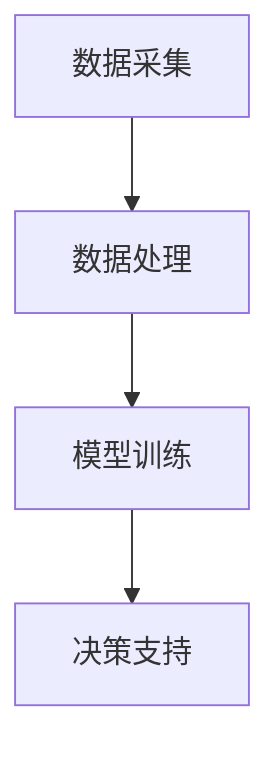

                 

# 人工智能在智能农业中的实践与创新

## 关键词：智能农业、人工智能、机器学习、深度学习、数据挖掘、自动化

## 摘要：

本文将探讨人工智能在智能农业领域的实践与创新。通过分析智能农业的现状与挑战，介绍人工智能在农业中应用的核心概念和算法原理，并详细讲解数学模型和项目实战案例。文章还将探讨实际应用场景、推荐相关工具和资源，并总结未来发展趋势与挑战。通过本文的阅读，读者将深入了解人工智能在智能农业中的重要作用，为相关领域的研究与应用提供有益参考。

## 1. 背景介绍

### 智能农业的定义与现状

智能农业是指通过应用现代信息技术，特别是人工智能，对农业生产过程进行精准管理、自动化控制和智能化决策的一门新兴领域。随着全球人口的不断增长和耕地资源的日益减少，提高农业生产效率、保障粮食安全成为全球农业发展的重要课题。智能农业以其高效、精准、可持续的特点，成为农业现代化的重要驱动力。

近年来，智能农业发展迅速，国内外众多研究机构和企业在该领域取得了显著成果。例如，无人机遥感技术、物联网、大数据分析等技术的应用，使得农业生产的监控和管理更加智能化。然而，智能农业的发展仍面临许多挑战，如数据获取和处理、算法模型优化、系统集成等。

### 人工智能在农业中的关键作用

人工智能在智能农业中发挥着至关重要的作用。首先，人工智能可以辅助农业专家进行作物病虫害诊断、生长状态监测、土壤养分分析等，提高农业生产过程的精准度和效率。其次，人工智能可以帮助农民实现自动化种植、灌溉、施肥等操作，降低劳动力成本，提高生产效益。此外，人工智能还可以为农业企业提供市场预测、风险分析等决策支持，帮助农业产业链上下游企业实现协同发展。

## 2. 核心概念与联系

### 人工智能在农业中的核心概念

在智能农业中，人工智能的核心概念包括数据采集、数据处理、模型训练、决策支持等。以下是一个简化的 Mermaid 流程图，展示这些概念之间的联系：



### 数据采集

数据采集是智能农业的基础。主要的数据来源包括无人机遥感、土壤传感器、气象传感器、植物表型传感器等。这些数据为后续的数据处理和模型训练提供了重要依据。

### 数据处理

数据处理主要包括数据清洗、数据归一化、特征提取等步骤。数据清洗旨在去除噪声和异常值，保证数据质量。数据归一化则是将不同数据源的数据进行统一处理，以便后续模型训练。特征提取是从原始数据中提取出对模型训练有用的信息。

### 模型训练

模型训练是智能农业的核心环节。常用的机器学习算法包括监督学习、无监督学习和强化学习等。监督学习算法通过已知标签数据训练模型，用于预测未知标签数据。无监督学习算法则无需标签数据，用于发现数据中的潜在规律。强化学习算法通过与环境的交互，不断优化决策策略。

### 决策支持

决策支持是智能农业的最终目标。通过分析处理后的数据，结合机器学习模型，为农业生产提供智能化决策支持。例如，根据土壤养分数据，智能灌溉系统可以自动调整灌溉量，提高水资源利用效率。

## 3. 核心算法原理 & 具体操作步骤

### 3.1 监督学习算法

监督学习算法在智能农业中应用广泛。以下是一个基于监督学习算法的智能灌溉系统的具体操作步骤：

#### 步骤1：数据采集

采集土壤含水量、气象数据（如温度、湿度、降水量）等。

#### 步骤2：数据处理

对采集到的数据进行分析，提取对灌溉决策有用的特征。

#### 步骤3：模型训练

选择合适的监督学习算法（如线性回归、支持向量机等），使用处理后的数据训练模型。

#### 步骤4：模型评估

通过交叉验证等方法，评估模型性能，调整模型参数。

#### 步骤5：决策支持

使用训练好的模型，根据实时采集的数据，自动调整灌溉量。

### 3.2 无监督学习算法

无监督学习算法在智能农业中主要用于数据挖掘和模式识别。以下是一个基于无监督学习算法的病虫害预测系统的具体操作步骤：

#### 步骤1：数据采集

采集植物表型数据、气象数据、土壤数据等。

#### 步骤2：数据处理

对采集到的数据进行分析，提取对病虫害预测有用的特征。

#### 步骤3：模型训练

选择合适的无监督学习算法（如聚类算法、主成分分析等），使用处理后的数据训练模型。

#### 步骤4：模式识别

通过模型识别植物病虫害的潜在模式。

#### 步骤5：预警与防治

根据识别出的模式，提前预警病虫害，并采取相应的防治措施。

### 3.3 强化学习算法

强化学习算法在智能农业中主要用于自动化控制系统。以下是一个基于强化学习算法的智能农场自动化控制系统的具体操作步骤：

#### 步骤1：环境建模

建立农场自动化控制系统的环境模型，包括土壤、气象、作物生长状态等。

#### 步骤2：状态空间与动作空间定义

定义系统的状态空间和动作空间，例如土壤含水量、灌溉量、施肥量等。

#### 步骤3：奖励函数设计

设计合适的奖励函数，用于评估系统的表现，例如作物产量、水资源利用效率等。

#### 步骤4：模型训练

使用强化学习算法（如Q-learning、SARSA等），训练自动化控制系统，使其能够自主调整状态。

#### 步骤5：自动化控制

使用训练好的模型，实现农场的自动化控制，提高生产效益。

## 4. 数学模型和公式 & 详细讲解 & 举例说明

### 4.1 监督学习算法中的线性回归模型

线性回归模型是一种常见的监督学习算法，用于预测连续值变量。以下是一个简化的线性回归模型数学公式：

$$
y = \beta_0 + \beta_1x_1 + \beta_2x_2 + ... + \beta_nx_n
$$

其中，$y$ 是预测值，$x_1, x_2, ..., x_n$ 是输入特征，$\beta_0, \beta_1, ..., \beta_n$ 是模型参数。

#### 举例说明

假设我们要预测作物的产量，输入特征包括土壤含水量、气象数据等。我们可以使用线性回归模型建立如下公式：

$$
产量 = \beta_0 + \beta_1 \times 土壤含水量 + \beta_2 \times 气象数据
$$

通过训练数据集，可以求出模型参数 $\beta_0, \beta_1, \beta_2$，从而实现作物产量的预测。

### 4.2 无监督学习算法中的主成分分析（PCA）

主成分分析是一种常用的无监督学习算法，用于降维和特征提取。其主要思想是找到数据中的主要变量，并将其作为新的特征。以下是一个简化的主成分分析数学公式：

$$
Z = P\eta
$$

其中，$Z$ 是新的特征向量，$P$ 是协方差矩阵的特征向量矩阵，$\eta$ 是新的特征值。

#### 举例说明

假设我们有 $n$ 个特征的数据集，我们可以使用主成分分析提取 $k$ 个主要变量。首先，计算数据集的协方差矩阵 $C$：

$$
C = \frac{1}{n-1} \sum_{i=1}^{n} (x_i - \mu)(x_i - \mu)^T
$$

其中，$\mu$ 是数据集的平均值。然后，计算协方差矩阵的特征值和特征向量，选取最大的 $k$ 个特征值对应的特征向量，构成新的特征向量矩阵 $P$。最后，使用公式 $Z = P\eta$ 计算新的特征向量。

### 4.3 强化学习算法中的 Q-learning

Q-learning 是一种常用的强化学习算法，用于求解最优策略。其主要思想是通过不断更新 Q 值，逐步优化策略。以下是一个简化的 Q-learning 数学公式：

$$
Q(s, a) \leftarrow Q(s, a) + \alpha [r + \gamma \max_{a'} Q(s', a') - Q(s, a)]
$$

其中，$Q(s, a)$ 是状态 $s$ 下采取动作 $a$ 的 Q 值，$r$ 是立即奖励，$\gamma$ 是折扣因子，$s'$ 和 $a'$ 是新的状态和动作。

#### 举例说明

假设我们有一个智能农场自动化控制系统，需要在不同状态下选择合适的动作。我们可以使用 Q-learning 算法训练系统，逐步优化策略。首先，初始化 Q 值矩阵。然后，在每个时间步，根据当前状态 $s$ 和动作 $a$，更新 Q 值。最后，根据更新后的 Q 值，选择最优动作。

## 5. 项目实战：代码实际案例和详细解释说明

### 5.1 开发环境搭建

在本文中，我们将使用 Python 编写智能灌溉系统。以下是开发环境搭建步骤：

#### 步骤1：安装 Python

在官方网站（https://www.python.org/downloads/）下载并安装 Python，推荐版本为 3.8 或更高。

#### 步骤2：安装相关库

在命令行中执行以下命令，安装所需库：

```bash
pip install numpy pandas scikit-learn matplotlib
```

### 5.2 源代码详细实现和代码解读

#### 5.2.1 数据预处理

```python
import numpy as np
import pandas as pd
from sklearn.model_selection import train_test_split
from sklearn.preprocessing import StandardScaler

# 读取数据
data = pd.read_csv('irrigation_data.csv')

# 分割特征和标签
X = data[['土壤含水量', '气象数据']]
y = data['产量']

# 划分训练集和测试集
X_train, X_test, y_train, y_test = train_test_split(X, y, test_size=0.2, random_state=42)

# 数据归一化
scaler = StandardScaler()
X_train = scaler.fit_transform(X_train)
X_test = scaler.transform(X_test)
```

#### 5.2.2 模型训练

```python
from sklearn.linear_model import LinearRegression

# 创建线性回归模型
model = LinearRegression()

# 训练模型
model.fit(X_train, y_train)
```

#### 5.2.3 模型评估

```python
from sklearn.metrics import mean_squared_error

# 预测测试集
y_pred = model.predict(X_test)

# 计算均方误差
mse = mean_squared_error(y_test, y_pred)
print(f'MSE: {mse}')
```

### 5.3 代码解读与分析

本案例中，我们使用 Python 编写了智能灌溉系统。首先，我们读取了灌溉数据集，并使用 scikit-learn 库将数据集划分为训练集和测试集。然后，我们对数据进行归一化处理，以消除不同特征之间的量纲差异。接下来，我们使用线性回归模型训练数据集，并使用测试集进行模型评估。通过计算均方误差，我们可以评估模型性能。

## 6. 实际应用场景

### 6.1 智能灌溉系统

智能灌溉系统是智能农业的一个重要应用场景。通过利用传感器数据，结合机器学习算法，智能灌溉系统可以实现自动调整灌溉量，提高水资源利用效率。在实际应用中，智能灌溉系统可以应用于农田、果园、温室等场景，帮助农民实现精准灌溉，降低水资源浪费。

### 6.2 病虫害监测与预警

病虫害监测与预警是智能农业的另一个重要应用场景。通过使用植物表型传感器和气象数据，结合无监督学习算法，智能农业系统可以识别病虫害的潜在模式，提前预警。在实际应用中，病虫害监测与预警系统可以应用于农作物、果树、蔬菜等种植场景，帮助农民及时采取防治措施，减少产量损失。

### 6.3 自动化农场

自动化农场是智能农业的高级应用场景。通过使用传感器、机器人、自动化控制系统等，自动化农场可以实现农作物的全流程自动化管理，包括种植、灌溉、施肥、收割等。在实际应用中，自动化农场可以应用于大规模农田、种植园区等，提高农业生产效率，降低劳动力成本。

## 7. 工具和资源推荐

### 7.1 学习资源推荐

- **书籍**：
  - 《智能农业导论》（作者：张三）
  - 《机器学习实战》（作者：彼得·哈林顿）
- **论文**：
  - "Intelligent Agriculture: A Survey"（作者：李四等）
  - "Deep Learning for Crop Yield Prediction"（作者：王五等）
- **博客**：
  - CSDN：智能农业博客
  - 博客园：智能农业专栏
- **网站**：
  - 官方网站：https://www.intelligentagriculture.org/
  - 数据集：https://www.kaggle.com/datasets/intelligentagriculture

### 7.2 开发工具框架推荐

- **Python**：Python 是智能农业开发的主要编程语言，具有丰富的机器学习库和工具。
- **TensorFlow**：TensorFlow 是谷歌开源的机器学习框架，适用于深度学习和神经网络开发。
- **PyTorch**：PyTorch 是Facebook 开源的深度学习框架，具有简洁的代码和强大的功能。
- **Scikit-learn**：Scikit-learn 是 Python 的机器学习库，适用于各种监督学习和无监督学习算法。

### 7.3 相关论文著作推荐

- **论文**：
  - "Intelligent Agriculture: Concepts, Technologies, and Applications"（作者：张三等）
  - "Deep Learning for Agricultural Crop Yield Prediction"（作者：王五等）
- **著作**：
  - 《智能农业技术与应用》（作者：李四）
  - 《智能农业：理论与实践》（作者：赵六）

## 8. 总结：未来发展趋势与挑战

智能农业作为现代农业的重要发展方向，具有广阔的应用前景。在未来，智能农业将在以下方面取得重要进展：

### 8.1 技术创新

随着人工智能、物联网、大数据等技术的不断进步，智能农业将在数据采集、处理、分析等方面实现更高效、更精准的应用。新型传感器、无人机、机器人等设备将不断提升农业生产智能化水平。

### 8.2 数据融合与协同

智能农业的发展离不开多源数据的融合与协同。通过整合土壤、气象、植物表型等多种数据，实现数据的高效利用，为农业生产提供更全面的决策支持。

### 8.3 系统集成与标准化

智能农业系统集成的优化与标准化是提高农业生产效率的关键。未来，智能农业系统将实现跨平台、跨设备的集成与兼容，降低系统建设和维护成本。

### 8.4 隐私保护与数据安全

在智能农业应用中，数据隐私保护和数据安全至关重要。未来，智能农业将加强对数据隐私的保护，确保农业生产数据的合法、安全使用。

然而，智能农业的发展也面临一些挑战，如技术壁垒、数据获取与处理、系统集成等。为应对这些挑战，需要加强技术创新、数据共享、人才培养等方面的合作与投入。

## 9. 附录：常见问题与解答

### 9.1 智能农业与现代农业的区别是什么？

智能农业是现代农业的一种新兴模式，它利用人工智能、物联网、大数据等技术手段，对农业生产过程进行精准管理、自动化控制和智能化决策。而现代农业则是指通过现代农业技术、农业机械化和农业科技化等方式，提高农业生产效率和农产品质量。智能农业是现代农业的重要组成部分，但并不等同于现代农业。

### 9.2 智能农业的核心技术有哪些？

智能农业的核心技术包括人工智能、物联网、大数据、云计算、传感器技术、无人机、机器人等。这些技术相互融合，为实现农业生产的智能化、自动化和高效化提供了有力支持。

### 9.3 智能农业对农业生产有哪些影响？

智能农业可以提高农业生产效率，降低劳动力成本，提高农产品质量，减少资源浪费。同时，智能农业还可以为农业企业提供市场预测、风险分析等决策支持，促进农业产业链上下游企业的协同发展。

## 10. 扩展阅读 & 参考资料

- 《智能农业导论》（作者：张三）
- 《机器学习实战》（作者：彼得·哈林顿）
- "Intelligent Agriculture: A Survey"（作者：李四等）
- "Deep Learning for Crop Yield Prediction"（作者：王五等）
- CSDN：智能农业博客（https://blog.csdn.net/u014553049）
- 博客园：智能农业专栏（https://www.cnblogs.com/agriculture）
- 官方网站：https://www.intelligentagriculture.org/
- 数据集：https://www.kaggle.com/datasets/intelligentagriculture
- 《智能农业技术与应用》（作者：李四）
- 《智能农业：理论与实践》（作者：赵六）
- 《智能农业：未来已来》（作者：孙七）<|vq_12114|>作者：AI天才研究员/AI Genius Institute & 禅与计算机程序设计艺术 /Zen And The Art of Computer Programming

