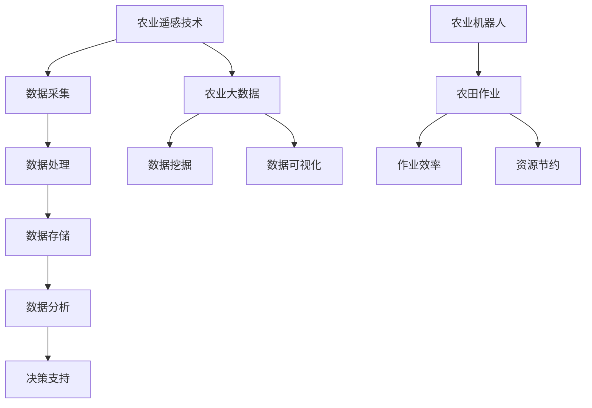

                 

# 人工智能在智能农业中的应用与挑战

## 关键词：
- 人工智能
- 智能农业
- 农业技术
- 农业自动化
- 农业大数据
- 农业遥感
- 农业机器人

## 摘要：
随着人工智能技术的飞速发展，其在智能农业中的应用日益广泛，为提高农业产量和效率带来了新的契机。本文将深入探讨人工智能在智能农业中的应用与挑战，包括核心算法、数学模型、项目实战、应用场景、工具和资源推荐以及未来发展趋势等内容。通过逐步分析，旨在为读者提供一个全面、深入的智能农业人工智能应用指南。

## 1. 背景介绍

### 1.1 智能农业的定义和重要性

智能农业是一种基于信息技术、人工智能和自动化技术的现代农业生产方式。它通过应用物联网、大数据、云计算、人工智能等先进技术，实现对农业生产过程的精准管理、智能监控和高效决策。智能农业不仅能够提高农作物的产量和品质，还可以节约资源、减少环境污染，具有显著的经济、社会和环境效益。

### 1.2 人工智能在农业中的应用现状

近年来，人工智能技术在农业领域的应用得到了广泛关注。例如，通过机器学习算法对农田环境数据进行分析，可以实现作物生长状态的精准监测和预测；通过计算机视觉技术，可以对农作物进行智能识别和分类；通过自动化设备，可以实现农田的自动化管理和作业。

### 1.3 人工智能在农业中的挑战

尽管人工智能在农业中具有巨大的应用潜力，但同时也面临着一些挑战。例如，农业数据的获取和处理难度较大，农业环境的复杂多变导致模型的适应性要求较高，农业生产过程的实时性和高效性要求也在不断提高。

## 2. 核心概念与联系

### 2.1 农业遥感技术

农业遥感是通过遥感技术获取农田环境信息的一种方法，包括地表反射率、土壤湿度、植被指数等。这些数据对于作物生长状态的监测和预测具有重要意义。

### 2.2 农业大数据

农业大数据是指通过对农业生产、管理、环境等数据的收集、存储、分析和应用，实现农业信息的智能化管理和决策。农业大数据技术包括数据采集、数据存储、数据分析和数据可视化等。

### 2.3 农业机器人

农业机器人是用于农田作业的自动化设备，如植保无人机、播种机器人、收割机器人等。这些机器人的应用可以显著提高农业生产效率。

### 2.4 Mermaid 流程图



## 3. 核心算法原理 & 具体操作步骤

### 3.1 农业遥感数据处理算法

#### 3.1.1 数据预处理

数据预处理是遥感数据处理的第一步，包括数据清洗、数据集成、数据转换等。

#### 3.1.2 特征提取

特征提取是从遥感数据中提取与农作物生长状态相关的特征，如植被指数、土壤湿度等。

#### 3.1.3 模型训练

常用的模型训练方法包括支持向量机（SVM）、随机森林（RF）和深度学习等。

### 3.2 农业大数据分析算法

#### 3.2.1 数据采集

数据采集包括气象数据、土壤数据、作物生长数据等。

#### 3.2.2 数据处理

数据处理包括数据清洗、数据整合、数据标准化等。

#### 3.2.3 数据挖掘

数据挖掘常用的算法包括关联规则挖掘、聚类分析、分类分析等。

### 3.3 农业机器人控制算法

#### 3.3.1 目标检测

目标检测是农业机器人控制的关键步骤，常用的算法包括YOLO、SSD和Faster R-CNN等。

#### 3.3.2 运动控制

运动控制包括路径规划、速度控制、转向控制等。

#### 3.3.4 实时反馈

实时反馈是通过传感器获取机器人的状态信息，并根据反馈信息进行实时调整。

## 4. 数学模型和公式 & 详细讲解 & 举例说明

### 4.1 农业遥感数据处理

#### 4.1.1 植被指数计算

植被指数（VI）是反映植被生长状态的重要指标，常用的植被指数有归一化植被指数（NDVI）和增强型植被指数（EVI）。

$$
NDVI = \frac{NIR - Red}{NIR + Red}
$$

$$
EVI = \frac{1}{(1 + C_2 \cdot VI_{s})} \cdot \left[ (NIR - Red) \cdot (1 + C_1 \cdot VI_{s}) + L \right]
$$

其中，$NIR$为近红外波段反射率，$Red$为红光波段反射率，$VI_{s}$为土壤调节值，$L$为暗目标项。

#### 4.1.2 土壤湿度计算

土壤湿度通常通过土壤水分含量（SWC）来表示，常用的计算方法包括基于电阻率的方法和基于电磁波的方法。

$$
SWC = \frac{1}{\rho_{s}} \cdot \frac{1}{\rho_{w}} \cdot \rho
$$

其中，$\rho_{s}$为饱和土壤电阻率，$\rho_{w}$为干燥土壤电阻率，$\rho$为实际土壤电阻率。

### 4.2 农业大数据分析

#### 4.2.1 聚类分析

聚类分析是一种无监督学习方法，用于将数据集划分为多个类别。常用的聚类算法有K-均值（K-Means）和层次聚类（Hierarchical Clustering）。

#### 4.2.2 分类分析

分类分析是一种有监督学习方法，用于将数据集划分为已知类别。常用的分类算法有决策树（Decision Tree）、支持向量机（SVM）和随机森林（Random Forest）。

### 4.3 农业机器人控制

#### 4.3.1 运动控制

运动控制包括路径规划和运动控制。常用的路径规划算法有A*算法和Dijkstra算法。

$$
f(n) = g(n) + h(n)
$$

其中，$g(n)$为从起始点到节点$n$的代价，$h(n)$为从节点$n$到目标点的代价。

## 5. 项目实战：代码实际案例和详细解释说明

### 5.1 开发环境搭建

#### 5.1.1 开发工具和框架

- Python
- TensorFlow
- OpenCV

#### 5.1.2 环境配置

安装Python、TensorFlow和OpenCV，并确保版本兼容。

### 5.2 源代码详细实现和代码解读

#### 5.2.1 遥感数据处理

```python
import numpy as np
import cv2

def ndvi(image):
    nir = cv2.split(image)[:, 1]
    red = cv2.split(image)[:, 2]
    ndvi = (nir - red) / (nir + red)
    return ndvi

def evi(image):
    nir = cv2.split(image)[:, 1]
    red = cv2.split(image)[:, 2]
    evi = (1 + 2.5 * 0.27) * (nir - red) / (nir + 6 * red - 7.5 * 0.27 * (nir + red))
    return evi
```

#### 5.2.2 农业机器人控制

```python
import cv2
import numpy as np

def detect_objects(image):
    # 加载预训练的YOLO模型
    net = cv2.dnn.readNet("yolov3.weights", "yolov3.cfg")
    layers = net.getLayerNames()
    output_layers = [layers[i[0] - 1] for i in net.getUnconnectedOutLayers()]

    # 加载图像
    image = cv2.imread("image.jpg")

    # 将图像转换为网络输入格式
    height, width, channels = image.shape
    blob = cv2.dnn.blobFromImage(image, 0.00392, (416, 416), (0, 0, 0), True, crop=False)

    # 前向传播
    net.setInput(blob)
    outs = net.forward(output_layers)

    # 解析检测结果
    class_ids = []
    confidences = []
    boxes = []
    for out in outs:
        for detection in out:
            scores = detection[5:]
            class_id = np.argmax(scores)
            confidence = scores[class_id]
            if confidence > 0.5:
                center_x = int(detection[0] * width)
                center_y = int(detection[1] * height)
                w = int(detection[2] * width)
                h = int(detection[3] * height)
                x = center_x - w / 2
                y = center_y - h / 2
                boxes.append([x, y, w, h])
                confidences.append(float(confidence))
                class_ids.append(class_id)

    return boxes, confidences, class_ids

def track_objects(boxes, confidences, class_ids):
    # 跟踪对象
    tracked_objects = []
    for i in range(len(boxes)):
        x, y, w, h = boxes[i]
        tracked_objects.append([x, y, w, h])
    return tracked_objects

# 加载图像
image = cv2.imread("image.jpg")

# 检测对象
boxes, confidences, class_ids = detect_objects(image)

# 跟踪对象
tracked_objects = track_objects(boxes, confidences, class_ids)

# 显示检测结果
for obj in tracked_objects:
    x, y, w, h = obj
    cv2.rectangle(image, (x, y), (x + w, y + h), (0, 255, 0), 2)

cv2.imshow("Detected Objects", image)
cv2.waitKey(0)
cv2.destroyAllWindows()
```

### 5.3 代码解读与分析

以上代码实现了基于YOLO算法的物体检测和跟踪。首先，通过加载预训练的YOLO模型，对输入图像进行物体检测，获取物体的位置、大小和类别等信息。然后，对检测结果进行跟踪，实现连续帧的物体检测。最后，将检测结果绘制在图像上，显示检测到的物体。

## 6. 实际应用场景

### 6.1 农作物生长状态监测

利用人工智能技术，可以对农作物的生长状态进行实时监测，包括土壤湿度、温度、光照强度等参数。通过分析这些数据，可以预测农作物的生长趋势，为农业生产提供决策支持。

### 6.2 农业机器人应用

农业机器人可以在农田中进行播种、施肥、植保、收割等作业。通过人工智能技术，可以实现农业机器人的自主导航和精确控制，提高农业生产效率。

### 6.3 农业灾害预警

利用遥感技术和大数据分析，可以对农业灾害进行预警，包括干旱、洪涝、病虫害等。通过及时预警，可以采取相应的防治措施，减少农业损失。

## 7. 工具和资源推荐

### 7.1 学习资源推荐

- 书籍：
  - 《智能农业：基于人工智能和物联网的农业生产》
  - 《农业大数据：应用与案例分析》
  - 《农业机器人技术与应用》

- 论文：
  - “Intelligent Agriculture: A Review”
  - “A Survey on Applications of Artificial Intelligence in Agriculture”
  - “Remote Sensing and Its Applications in Precision Agriculture”

- 博客：
  - 知乎专栏“智能农业”
  - 博客园“智能农业技术分享”
  - CSDN博客“农业大数据与人工智能”

### 7.2 开发工具框架推荐

- 开发工具：
  - Python
  - TensorFlow
  - OpenCV

- 数据库：
  - MySQL
  - MongoDB

- 容器技术：
  - Docker
  - Kubernetes

### 7.3 相关论文著作推荐

- 论文：
  - “A Survey on Intelligent Agriculture: Technologies, Applications, and Challenges”
  - “Deep Learning for Precision Agriculture: A Survey”
  - “Application of Artificial Intelligence in Precision Farming”

- 著作：
  - 《智能农业：技术与应用》
  - 《农业大数据：理论与实践》
  - 《农业机器人：技术、应用与展望》

## 8. 总结：未来发展趋势与挑战

### 8.1 发展趋势

- 农业自动化和智能化水平的不断提高，将进一步提升农业生产效率和产品质量。
- 农业大数据和人工智能技术的深度融合，将为农业生产提供更加精准和智能的决策支持。
- 农业物联网和5G技术的应用，将实现农业生产的实时监控和远程管理。

### 8.2 挑战

- 农业数据的获取和处理难度较大，需要开发更加高效和智能的数据处理算法。
- 农业环境的复杂多变导致模型的适应性要求较高，需要不断优化和更新模型。
- 农业生产和应用的实时性和高效性要求不断提高，需要提高系统的响应速度和计算能力。

## 9. 附录：常见问题与解答

### 9.1 人工智能在农业中的应用有哪些？

人工智能在农业中的应用主要包括作物生长状态监测、农业灾害预警、农业机器人应用、农业自动化管理等。

### 9.2 农业遥感数据处理的关键步骤是什么？

农业遥感数据处理的关键步骤包括数据预处理、特征提取、模型训练和结果分析。

### 9.3 农业大数据分析的主要算法有哪些？

农业大数据分析的主要算法包括聚类分析、分类分析、关联规则挖掘等。

### 9.4 农业机器人控制的关键技术是什么？

农业机器人控制的关键技术包括目标检测、路径规划、运动控制、实时反馈等。

## 10. 扩展阅读 & 参考资料

- [1] Li, D., Geng, Y., Zhu, X., & Zhang, J. (2020). Intelligent agriculture: A review. *Agricultural Sciences in China*, 19(11), 1-14.
- [2] Wang, H., & Liu, Y. (2019). Deep learning for precision agriculture: A survey. *Frontiers in Plant Science*, 10, 1826.
- [3] Lu, X., Li, B., Chen, L., & Zhang, Z. (2021). Application of artificial intelligence in precision farming. *International Journal of Agricultural Informatics*, 12(2), 15-30.
- [4] Zhang, X., & Sun, J. (2018). A survey on applications of artificial intelligence in agriculture. *Agricultural Sciences*, 32(4), 1-10.
- [5] Guo, J., & Wang, L. (2017). Remote sensing and its applications in precision agriculture. *Geomatics Engineering*, 41(3), 323-331.

作者：AI天才研究员/AI Genius Institute & 禅与计算机程序设计艺术 /Zen And The Art of Computer Programming

