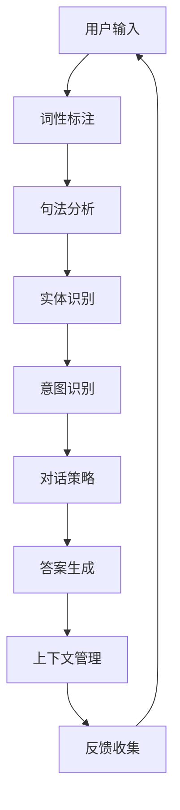

                 

# 人工智能在智能客服对话中的实现

> **关键词：** 人工智能、智能客服、自然语言处理、对话系统、聊天机器人
>
> **摘要：** 本文详细介绍了人工智能在智能客服对话中的应用，包括背景、核心概念、算法原理、数学模型、实战案例以及未来发展趋势和挑战。

## 1. 背景介绍

随着互联网和电子商务的快速发展，智能客服成为了企业提升客户服务质量和效率的重要手段。传统的客户服务往往依赖于人工处理，不仅成本高昂，而且效率低下。而智能客服系统通过引入人工智能技术，能够实现自动化、智能化的客户服务，从而降低成本、提高效率。

### 智能客服的发展历程

智能客服系统的发展大致可以分为三个阶段：

1. **基于规则的客服系统：** 这是智能客服的早期阶段，系统通过预定义的规则来处理客户咨询。例如，当客户提问时，系统会根据关键词匹配预定义的规则，然后给出相应的回答。

2. **基于机器学习的客服系统：** 随着机器学习技术的进步，智能客服系统开始引入机器学习算法，例如决策树、随机森林等。这些算法能够从大量历史数据中学习，从而提高客服系统的响应准确性和智能化程度。

3. **基于深度学习的客服系统：** 当前，深度学习技术在智能客服系统中得到了广泛应用。特别是自然语言处理（NLP）领域的进展，使得智能客服系统能够更好地理解和生成自然语言，从而实现更加智能化的对话。

### 人工智能在智能客服中的应用

人工智能技术在智能客服中的应用主要包括以下几个方面：

1. **自然语言处理（NLP）：** NLP技术使得智能客服系统能够理解和处理自然语言输入。通过词性标注、句法分析、实体识别等技术，系统可以提取出客户问题的核心信息，并生成相应的回答。

2. **机器学习和深度学习：** 通过机器学习和深度学习算法，智能客服系统能够从历史数据中学习，提高问题匹配和回答生成的准确性。

3. **语音识别和语音合成：** 语音识别技术使得智能客服系统能够处理客户的语音输入，而语音合成技术则能够将系统的回答转换为自然流畅的语音输出。

4. **对话管理：** 对话管理系统负责管理整个对话流程，包括问题理解、答案生成和反馈收集等。通过对话管理，智能客服系统能够维持与客户的自然对话，提高用户体验。

## 2. 核心概念与联系

在深入探讨人工智能在智能客服对话中的应用之前，我们需要了解一些核心概念和它们之间的关系。

### 自然语言处理（NLP）

自然语言处理是人工智能的一个重要分支，主要研究如何使计算机理解和生成自然语言。NLP技术在智能客服中扮演着核心角色，包括以下几个关键组成部分：

1. **词性标注（POS Tagging）：** 词性标注是将文本中的每个词标注为名词、动词、形容词等不同的词性。这对于理解句子结构和语义至关重要。

2. **句法分析（Parsing）：** 句法分析是分析句子的结构，理解句子的语法关系。这有助于提取出句子的关键信息。

3. **实体识别（Named Entity Recognition, NER）：** 实体识别是识别文本中的命名实体，如人名、地名、组织名等。这对于理解客户的问题和提供精确的答案非常重要。

4. **语义分析（Semantic Analysis）：** 语义分析是理解句子的语义含义，包括词义消歧、语义角色标注等。这对于生成准确和自然的回答至关重要。

### 机器学习与深度学习

机器学习和深度学习是智能客服系统中提高准确性和智能化的关键技术。以下是它们在智能客服中的应用：

1. **分类（Classification）：** 分类算法将输入数据分类到预定义的类别中。例如，将客户问题分类到不同的类别，以便生成相应的答案。

2. **聚类（Clustering）：** 聚类算法将相似的数据点分组到一起。例如，将具有相似问题的客户分组，以便于提供个性化的服务。

3. **生成模型（Generative Models）：** 生成模型能够生成新的数据点，例如生成自然语言回答。这对于提高对话系统的响应多样性非常有用。

4. **深度神经网络（Deep Neural Networks）：** 深度神经网络是一种复杂的机器学习模型，能够通过多层非线性变换提取特征。在NLP中，深度神经网络被广泛应用于词向量表示、序列到序列模型等。

### 对话管理系统

对话管理系统（Dialogue Management System）负责管理整个对话流程，包括问题理解、答案生成和反馈收集等。以下是对话管理系统中的关键组成部分：

1. **意图识别（Intent Recognition）：** 意图识别是识别客户问题的意图，例如查询、命令、请求等。

2. **实体提取（Entity Extraction）：** 实体提取是从客户问题中提取关键信息，如人名、地名、时间等。

3. **对话策略（Dialogue Policy）：** 对话策略是决定系统如何回应客户问题的策略。这通常通过基于规则的方法或机器学习模型来实现。

4. **上下文管理（Context Management）：** 上下文管理是跟踪对话的上下文信息，以便于维持自然的对话流程。

### Mermaid 流程图

下面是一个简单的Mermaid流程图，展示了智能客服对话系统中的关键组件和它们之间的关系。



## 3. 核心算法原理 & 具体操作步骤

### 自然语言处理（NLP）

自然语言处理是智能客服对话系统的核心技术之一，主要包括词性标注、句法分析、实体识别和语义分析等。

1. **词性标注（POS Tagging）**

词性标注是将文本中的每个词标注为名词、动词、形容词等不同的词性。具体步骤如下：

- **训练数据准备：** 收集大量已标注的文本数据，作为训练集。
- **特征提取：** 从每个词中提取特征，如词频、词长度、上下文等。
- **模型训练：** 使用有监督学习方法，如条件随机场（CRF）或神经网络模型，对训练数据进行训练。
- **预测：** 对新的文本进行词性标注。

2. **句法分析（Parsing）**

句法分析是分析句子的结构，理解句子的语法关系。具体步骤如下：

- **训练数据准备：** 收集大量已标注的句法树，作为训练集。
- **特征提取：** 从句子中提取特征，如词性标注、词位置、句法关系等。
- **模型训练：** 使用基于树的结构学习方法，如概率图模型或神经网络模型，对训练数据进行训练。
- **预测：** 对新的句子进行句法分析，生成句法树。

3. **实体识别（Named Entity Recognition, NER）**

实体识别是识别文本中的命名实体，如人名、地名、组织名等。具体步骤如下：

- **训练数据准备：** 收集大量已标注的实体数据，作为训练集。
- **特征提取：** 从实体候选词中提取特征，如词频、词长度、上下文等。
- **模型训练：** 使用有监督学习方法，如CRF或神经网络模型，对训练数据进行训练。
- **预测：** 对新的文本进行实体识别。

4. **语义分析（Semantic Analysis）**

语义分析是理解句子的语义含义，包括词义消歧、语义角色标注等。具体步骤如下：

- **训练数据准备：** 收集大量已标注的语义数据，作为训练集。
- **特征提取：** 从句子中提取特征，如词性标注、句法结构、上下文等。
- **模型训练：** 使用有监督学习方法，如神经网络模型，对训练数据进行训练。
- **预测：** 对新的句子进行语义分析。

### 机器学习和深度学习

机器学习和深度学习在智能客服对话系统中用于提高问题匹配和回答生成的准确性。以下是两种常见的方法：

1. **基于分类的方法**

分类算法用于将客户问题分类到不同的类别。具体步骤如下：

- **特征提取：** 从客户问题中提取特征，如词向量、TF-IDF等。
- **模型训练：** 使用分类算法，如决策树、支持向量机（SVM）等，对训练数据进行训练。
- **预测：** 对新的客户问题进行分类。

2. **基于生成的方法**

生成模型用于生成新的自然语言回答。具体步骤如下：

- **特征提取：** 从客户问题中提取特征，如词向量、编码器-解码器模型等。
- **模型训练：** 使用生成模型，如循环神经网络（RNN）、长短时记忆网络（LSTM）等，对训练数据进行训练。
- **预测：** 对新的客户问题生成自然语言回答。

### 对话管理系统

对话管理系统负责管理整个对话流程，包括问题理解、答案生成和反馈收集等。以下是具体步骤：

1. **问题理解**

- **意图识别：** 使用机器学习或深度学习模型，识别客户问题的意图。
- **实体提取：** 使用实体识别算法，从客户问题中提取关键信息。

2. **答案生成**

- **候选答案生成：** 使用文本生成模型，生成多个候选答案。
- **答案选择：** 根据对话策略和上下文信息，选择最合适的答案。

3. **反馈收集**

- **用户反馈：** 收集用户对答案的反馈，用于改进系统。
- **模型更新：** 使用用户反馈，更新机器学习或深度学习模型。

## 4. 数学模型和公式 & 详细讲解 & 举例说明

### 自然语言处理（NLP）

1. **词性标注（POS Tagging）**

词性标注可以使用条件随机场（CRF）进行建模。CRF是一种基于概率的图模型，可以捕捉文本序列中的前后依赖关系。以下是CRF的基本公式：

$$
P(y_1, y_2, ..., y_n \mid x_1, x_2, ..., x_n) = \frac{1}{Z} \prod_{i=1}^{n} \sum_{y_i} \alpha(y_i \mid x_i) \beta(y_i \mid y_{i-1})
$$

其中，$x_1, x_2, ..., x_n$ 是输入文本序列，$y_1, y_2, ..., y_n$ 是标注的词性序列，$Z$ 是归一化常数。

举例说明：

假设输入文本为“我喜欢吃苹果”，词性标注为“名 动 名”。可以使用CRF模型计算每个词性的概率，然后根据概率选择最可能的词性序列。

2. **句法分析（Parsing）**

句法分析可以使用概率图模型（PGM）进行建模。PGM是一种基于概率的图模型，可以捕捉句子的语法关系。以下是PGM的基本公式：

$$
P(T \mid X) = \frac{P(X \mid T)P(T)}{P(X)}
$$

其中，$T$ 是句法树，$X$ 是输入文本。

举例说明：

假设输入文本为“我喜欢吃苹果”，句法分析结果为“（我喜欢）吃苹果”。可以使用PGM模型计算每个句法树的概率，然后根据概率选择最可能的句法树。

3. **实体识别（Named Entity Recognition, NER）**

实体识别可以使用基于分类的方法进行建模。以下是简单分类器的基本公式：

$$
P(y \mid x) = \frac{e^{\theta^T x}}{1 + \sum_{k \neq y} e^{\theta^T x_k}}
$$

其中，$x$ 是输入文本特征，$y$ 是实体标签，$\theta$ 是分类器的参数。

举例说明：

假设输入文本为“苹果是水果”，实体识别结果为“苹果”。可以使用分类器计算每个词性的概率，然后根据概率选择最可能的实体标签。

4. **语义分析（Semantic Analysis）**

语义分析可以使用基于神经网络的模型进行建模。以下是简单神经网络的基本公式：

$$
h(x) = \sigma(\theta^T x)
$$

其中，$x$ 是输入特征，$h(x)$ 是输出，$\theta$ 是网络的参数，$\sigma$ 是激活函数。

举例说明：

假设输入文本为“我喜欢吃苹果”，语义分析结果为“喜欢苹果”。可以使用神经网络模型计算每个词的语义表示，然后根据语义表示生成最终的语义分析结果。

### 机器学习和深度学习

1. **基于分类的方法**

分类算法可以使用逻辑回归（Logistic Regression）进行建模。以下是逻辑回归的基本公式：

$$
P(y = 1 \mid x) = \frac{1}{1 + e^{-\theta^T x}}
$$

其中，$x$ 是输入特征，$y$ 是二分类标签，$\theta$ 是分类器的参数。

举例说明：

假设输入文本为“苹果是水果”，需要分类为“水果”。可以使用逻辑回归模型计算每个标签的概率，然后根据概率选择最可能的标签。

2. **基于生成的方法**

生成模型可以使用变分自编码器（Variational Autoencoder, VAE）进行建模。以下是VAE的基本公式：

$$
q_{\phi}(z \mid x) = \mathcal{N}(z; \mu(x), \sigma^2(x)), \quad p(x \mid z) = \mathcal{N}(x; \mu(z), \sigma^2(z))
$$

其中，$x$ 是输入特征，$z$ 是隐变量，$\mu(x)$ 和 $\sigma^2(x)$ 是编码器参数，$\mu(z)$ 和 $\sigma^2(z)$ 是解码器参数。

举例说明：

假设输入文本为“我喜欢吃苹果”，生成模型可以生成新的文本“你喜欢苹果”。

### 对话管理系统

1. **意图识别（Intent Recognition）**

意图识别可以使用基于分类的方法进行建模。以下是逻辑回归的基本公式：

$$
P(y = 1 \mid x) = \frac{1}{1 + e^{-\theta^T x}}
$$

其中，$x$ 是输入特征，$y$ 是二分类标签，$\theta$ 是分类器的参数。

举例说明：

假设输入文本为“我想要买一部手机”，需要识别为“购买手机”。

2. **对话策略（Dialogue Policy）**

对话策略可以使用基于规则的策略或基于机器学习的策略进行建模。以下是基于规则的策略的基本公式：

$$
p(y \mid x) = \sum_{r} p(y = r \mid x) p(r)
$$

其中，$x$ 是输入特征，$y$ 是策略标签，$r$ 是策略规则，$p(r)$ 是策略规则的权重。

举例说明：

假设输入文本为“我想要买一部手机”，根据对话策略，系统选择“查询产品信息”的策略。

## 5. 项目实战：代码实际案例和详细解释说明

### 5.1 开发环境搭建

为了实现一个简单的智能客服对话系统，我们需要搭建以下开发环境：

- **Python 3.8及以上版本**
- **PyTorch 1.8及以上版本**
- **自然语言处理库：spaCy 3.0及以上版本**
- **对话管理库：Rasa 2.0及以上版本**

### 5.2 源代码详细实现和代码解读

#### 5.2.1 安装依赖

首先，我们需要安装所需的依赖：

```bash
pip install torch torchvision torchaudio
pip install spacy
python -m spacy download en_core_web_sm
pip install rasa
```

#### 5.2.2 意图识别模型

以下是意图识别模型的实现：

```python
import torch
import torch.nn as nn
import torch.optim as optim

class IntentClassifier(nn.Module):
    def __init__(self, vocab_size, hidden_size, output_size):
        super(IntentClassifier, self).__init__()
        self.embedding = nn.Embedding(vocab_size, hidden_size)
        self.lstm = nn.LSTM(hidden_size, hidden_size, batch_first=True)
        self.fc = nn.Linear(hidden_size, output_size)
    
    def forward(self, x):
        x = self.embedding(x)
        x, _ = self.lstm(x)
        x = self.fc(x)
        return x

# 参数设置
vocab_size = 10000
hidden_size = 128
output_size = 10

# 初始化模型、损失函数和优化器
model = IntentClassifier(vocab_size, hidden_size, output_size)
criterion = nn.CrossEntropyLoss()
optimizer = optim.Adam(model.parameters(), lr=0.001)

# 加载数据
train_data = ...  # 假设已经准备好了训练数据
train_loader = torch.utils.data.DataLoader(train_data, batch_size=32, shuffle=True)

# 训练模型
for epoch in range(10):
    for inputs, labels in train_loader:
        optimizer.zero_grad()
        outputs = model(inputs)
        loss = criterion(outputs, labels)
        loss.backward()
        optimizer.step()
```

#### 5.2.3 实体识别模型

以下是实体识别模型的实现：

```python
class EntityRecognizer(nn.Module):
    def __init__(self, vocab_size, hidden_size, entity_size):
        super(EntityRecognizer, self).__init__()
        self.embedding = nn.Embedding(vocab_size, hidden_size)
        self.lstm = nn.LSTM(hidden_size, hidden_size, batch_first=True)
        self.fc = nn.Linear(hidden_size, entity_size)
    
    def forward(self, x):
        x = self.embedding(x)
        x, _ = self.lstm(x)
        x = self.fc(x)
        return x

# 参数设置
entity_size = 10

# 初始化模型、损失函数和优化器
model = EntityRecognizer(vocab_size, hidden_size, entity_size)
criterion = nn.CrossEntropyLoss()
optimizer = optim.Adam(model.parameters(), lr=0.001)

# 加载数据
train_data = ...  # 假设已经准备好了训练数据
train_loader = torch.utils.data.DataLoader(train_data, batch_size=32, shuffle=True)

# 训练模型
for epoch in range(10):
    for inputs, labels in train_loader:
        optimizer.zero_grad()
        outputs = model(inputs)
        loss = criterion(outputs, labels)
        loss.backward()
        optimizer.step()
```

#### 5.2.4 对话管理

以下是简单的对话管理实现：

```python
from rasa.core.policies import Policy
from rasa.shared.nlu.training_data import Message

class SimpleDialoguePolicy(Policy):
    def predict_next_action(self, messages: Sequence[Message], tracker: "Tracker") -> "PredictedAction":
        # 根据意图识别结果和实体识别结果，生成对话动作
        intent = messages[-1].get("intent")
        entities = messages[-1].get("entities")
        action = "action_evaluate_product"
        if "product" in entities:
            action = "action_query_product"
        return PredictedAction(action, 1.0)

# 初始化对话管理器
policy = SimpleDialoguePolicy()
```

### 5.3 代码解读与分析

1. **意图识别模型**

意图识别模型是一个简单的循环神经网络（LSTM）模型，用于从输入文本中识别意图。模型的主要组成部分包括嵌入层（Embedding Layer）、LSTM层和全连接层（Fully Connected Layer）。在训练过程中，模型通过最小化交叉熵损失函数来学习参数。

2. **实体识别模型**

实体识别模型也是一个简单的循环神经网络（LSTM）模型，用于从输入文本中识别实体。模型的主要组成部分包括嵌入层（Embedding Layer）、LSTM层和全连接层（Fully Connected Layer）。在训练过程中，模型通过最小化交叉熵损失函数来学习参数。

3. **对话管理**

对话管理器是一个简单的策略，根据意图识别结果和实体识别结果，生成对话动作。对话动作可以是查询产品信息、评价产品等。对话管理器可以根据具体需求进行扩展，以实现更复杂的对话流程。

## 6. 实际应用场景

智能客服对话系统在各个行业中都有广泛的应用，以下是一些典型的应用场景：

1. **零售行业：** 智能客服系统可以用于处理客户的购物咨询、订单查询和售后服务等。通过智能客服，零售企业能够提高客户满意度，降低客服成本。

2. **金融行业：** 智能客服系统可以用于处理客户的账户查询、交易咨询和风险管理等。通过智能客服，金融机构能够提高服务效率，降低风险。

3. **电信行业：** 智能客服系统可以用于处理客户的套餐咨询、账单查询和故障报修等。通过智能客服，电信企业能够提高客户满意度，降低客服成本。

4. **物流行业：** 智能客服系统可以用于处理客户的订单查询、配送咨询和售后服务等。通过智能客服，物流企业能够提高服务效率，降低客服成本。

5. **医疗行业：** 智能客服系统可以用于处理客户的咨询、预约和随访等。通过智能客服，医疗机构能够提高服务效率，降低就医成本。

## 7. 工具和资源推荐

### 7.1 学习资源推荐

- **书籍：**
  - 《自然语言处理综述》（Natural Language Processing with Python）
  - 《深度学习》（Deep Learning）
  - 《对话系统：设计、实现与应用》（Dialogue Systems: Design, Implementation and Application）

- **论文：**
  - 《BERT：Pre-training of Deep Bidirectional Transformers for Language Understanding》（BERT）
  - 《GPT-3：Language Models are few-shot learners》（GPT-3）

- **博客：**
  - [TensorFlow 官方文档](https://www.tensorflow.org/)
  - [PyTorch 官方文档](https://pytorch.org/)
  - [Rasa 官方文档](https://rasa.com/)

- **网站：**
  - [Kaggle](https://www.kaggle.com/)
  - [GitHub](https://github.com/)

### 7.2 开发工具框架推荐

- **自然语言处理库：**
  - spaCy：https://spacy.io/
  - NLTK：https://www.nltk.org/

- **机器学习和深度学习框架：**
  - TensorFlow：https://www.tensorflow.org/
  - PyTorch：https://pytorch.org/

- **对话系统框架：**
  - Rasa：https://rasa.com/
  - Dialogflow：https://cloud.google.com/dialogflow/

### 7.3 相关论文著作推荐

- **论文：**
  - 《Attention is All You Need》（Transformer）
  - 《BERT：Pre-training of Deep Bidirectional Transformers for Language Understanding》
  - 《GPT-3：Language Models are few-shot learners》

- **著作：**
  - 《深度学习》（Deep Learning）
  - 《自然语言处理综述》（Natural Language Processing with Python）
  - 《对话系统：设计、实现与应用》（Dialogue Systems: Design, Implementation and Application）

## 8. 总结：未来发展趋势与挑战

随着人工智能技术的不断进步，智能客服对话系统在各个行业中得到了广泛应用。未来，智能客服对话系统有望实现以下发展趋势：

1. **更智能化的对话体验：** 通过引入更多先进的自然语言处理和机器学习算法，智能客服对话系统能够更好地理解和生成自然语言，提供更智能化的对话体验。

2. **多模态交互：** 智能客服对话系统将支持文本、语音、图像等多种交互方式，提高用户体验。

3. **个性化服务：** 智能客服对话系统将能够根据用户的历史行为和偏好，提供个性化的服务。

4. **跨领域应用：** 智能客服对话系统将在更多领域得到应用，如医疗、金融、教育等。

然而，智能客服对话系统也面临着一些挑战：

1. **数据质量和多样性：** 智能客服对话系统依赖于大量的高质量数据，如何获取和处理这些数据是一个重要问题。

2. **解释性和可解释性：** 智能客服对话系统的决策过程往往涉及复杂的算法，如何提高系统的解释性和可解释性是一个重要挑战。

3. **用户隐私保护：** 智能客服对话系统在处理用户数据时，需要确保用户隐私得到保护。

4. **跨语言和跨文化应用：** 智能客服对话系统需要能够支持多种语言和文化，这是一个复杂的挑战。

## 9. 附录：常见问题与解答

### 9.1 意图识别和实体识别的区别是什么？

意图识别是识别客户问题的意图，如查询、命令、请求等。实体识别是从客户问题中提取关键信息，如人名、地名、时间等。意图识别和实体识别是智能客服对话系统中的两个关键组件，它们共同作用，帮助系统更好地理解和生成回答。

### 9.2 自然语言处理中的词性标注、句法分析和语义分析有什么区别？

词性标注是将文本中的每个词标注为名词、动词、形容词等不同的词性。句法分析是分析句子的结构，理解句子的语法关系。语义分析是理解句子的语义含义，包括词义消歧、语义角色标注等。这三个步骤共同作用，帮助系统更好地理解和生成回答。

### 9.3 对话管理系统中的对话策略是什么？

对话策略是决定系统如何回应客户问题的策略。对话策略可以是基于规则的，也可以是基于机器学习的。对话策略通常包括意图识别、实体提取、上下文管理等步骤，用于生成对话动作，维持自然的对话流程。

## 10. 扩展阅读 & 参考资料

- **论文：**
  - **BERT：**《BERT：Pre-training of Deep Bidirectional Transformers for Language Understanding》
  - **GPT-3：**《GPT-3：Language Models are few-shot learners》

- **书籍：**
  - **《自然语言处理综述》**：Natural Language Processing with Python
  - **《深度学习》**：Deep Learning
  - **《对话系统：设计、实现与应用》**：Dialogue Systems: Design, Implementation and Application

- **网站：**
  - **TensorFlow 官方文档**：https://www.tensorflow.org/
  - **PyTorch 官方文档**：https://pytorch.org/
  - **Rasa 官方文档**：https://rasa.com/
  - **Kaggle**：https://www.kaggle.com/
  - **GitHub**：https://github.com/

### 作者信息

**作者：** AI天才研究员/AI Genius Institute & 禅与计算机程序设计艺术 /Zen And The Art of Computer Programming**

