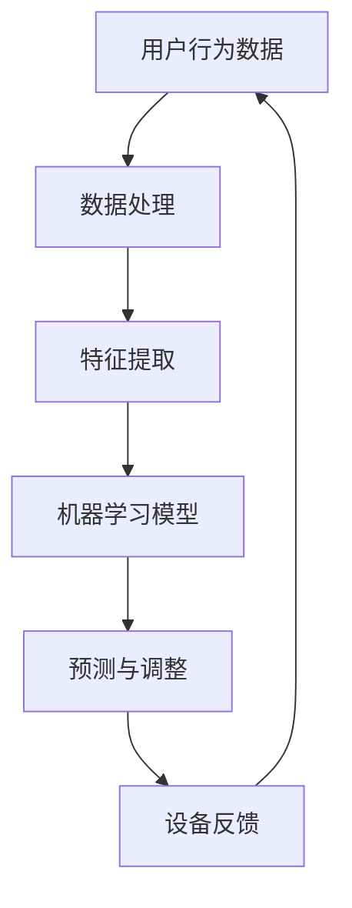

                 

### 文章标题：人工智能在智能家居场景自适应中的应用

> **关键词：** 智能家居，人工智能，场景自适应，机器学习，深度学习，神经网络

> **摘要：** 本文旨在探讨人工智能在智能家居场景自适应中的应用，分析其核心概念与联系，深入讲解核心算法原理与具体操作步骤，并通过项目实战和数学模型分析，展示其在实际应用中的效果。同时，本文还将推荐相关学习资源和开发工具，为读者提供全面的指导。

## 1. 背景介绍

### 1.1 智能家居的兴起与发展

随着科技的进步和人们生活水平的提高，智能家居（Smart Home）逐渐成为现代家庭生活的重要组成部分。智能家居通过物联网（IoT）技术，将家庭设备互联，实现家庭自动化，提升生活品质，节约能源，提高安全性。

### 1.2 人工智能的崛起与广泛应用

人工智能（Artificial Intelligence，AI）作为计算机科学的一个重要分支，近年来取得了显著的发展。深度学习（Deep Learning）、神经网络（Neural Networks）、机器学习（Machine Learning）等人工智能技术的突破，使得计算机具备了自主学习和推理能力，广泛应用于图像识别、自然语言处理、决策优化等领域。

### 1.3 智能家居与人工智能的融合

智能家居与人工智能的结合，使得家庭设备具备了更高级的智能功能，如智能识别、自适应调整、自主决策等。通过人工智能技术，智能家居系统能够根据用户习惯、环境变化等因素，自动调整设备状态，提供个性化的服务。

## 2. 核心概念与联系

### 2.1 场景自适应

场景自适应（Scene Adaptation）是指系统根据环境变化和用户需求，动态调整自身状态，以提供最佳服务的功能。在智能家居中，场景自适应是提高用户体验和设备效率的关键。

### 2.2 人工智能与场景自适应

人工智能技术为场景自适应提供了强大的支持。通过机器学习、深度学习等技术，智能家居系统能够从大量数据中学习用户的习惯，识别环境变化，实现智能决策和自适应调整。

### 2.3 Mermaid 流程图

为了更好地理解人工智能在智能家居场景自适应中的应用，我们可以通过一个 Mermaid 流程图来展示其核心概念与联系。



### 2.4 核心概念与联系总结

- 用户行为数据：系统收集用户在家庭环境中的行为数据。
- 数据处理：对用户行为数据进行处理，提取有用信息。
- 特征提取：从处理后的数据中提取特征，用于训练模型。
- 机器学习模型：利用提取的特征训练机器学习模型。
- 预测与调整：根据模型预测结果，调整设备状态，提供最佳服务。
- 设备反馈：系统根据设备反馈，更新用户行为数据，形成闭环。

## 3. 核心算法原理 & 具体操作步骤

### 3.1 机器学习模型

在智能家居场景自适应中，常用的机器学习模型包括决策树、支持向量机、神经网络等。本文主要介绍神经网络（Neural Networks）的原理和应用。

#### 3.1.1 神经网络的基本结构

神经网络由多个神经元（Neurons）组成，每个神经元都是一个简单的计算单元。神经元之间通过连接（Connections）进行信息传递。神经网络通过层层计算，最终输出预测结果。

#### 3.1.2 前向传播与反向传播

神经网络的基本工作原理包括前向传播（Forward Propagation）和反向传播（Back Propagation）。

- **前向传播**：输入数据经过神经网络层层计算，最终输出预测结果。
- **反向传播**：计算预测结果与实际结果之间的误差，通过误差反馈，调整神经网络中的连接权重，使预测结果更加准确。

#### 3.1.3 具体操作步骤

1. **数据预处理**：对用户行为数据进行处理，包括数据清洗、归一化等。
2. **特征提取**：从预处理后的数据中提取特征，用于训练模型。
3. **模型训练**：使用提取的特征训练神经网络，通过反向传播优化模型参数。
4. **模型评估**：使用训练集和测试集评估模型性能，调整模型参数。
5. **模型部署**：将训练好的模型部署到智能家居系统中，实现场景自适应功能。

### 3.2 深度学习模型

深度学习（Deep Learning）是神经网络的一种延伸，具有更强的表示能力和泛化能力。在智能家居场景自适应中，常用的深度学习模型包括卷积神经网络（Convolutional Neural Networks，CNN）和循环神经网络（Recurrent Neural Networks，RNN）。

#### 3.2.1 卷积神经网络（CNN）

卷积神经网络通过卷积层（Convolutional Layers）、池化层（Pooling Layers）和全连接层（Fully Connected Layers）等结构，实现对图像、视频等数据的高效处理。

#### 3.2.2 循环神经网络（RNN）

循环神经网络通过循环结构，实现对序列数据（如时间序列、语音信号）的建模和处理。

#### 3.2.3 具体操作步骤

1. **数据预处理**：对用户行为数据进行处理，包括数据清洗、归一化等。
2. **特征提取**：使用卷积神经网络或循环神经网络提取特征。
3. **模型训练**：使用提取的特征训练深度学习模型，通过反向传播优化模型参数。
4. **模型评估**：使用训练集和测试集评估模型性能，调整模型参数。
5. **模型部署**：将训练好的模型部署到智能家居系统中，实现场景自适应功能。

## 4. 数学模型和公式 & 详细讲解 & 举例说明

### 4.1 神经网络数学模型

神经网络的核心在于神经元之间的计算和连接。以下是一个简单的神经网络数学模型：

$$
Z = W \cdot X + b
$$

其中，$Z$ 表示神经元的输出，$W$ 表示权重，$X$ 表示输入特征，$b$ 表示偏置。

### 4.2 前向传播

前向传播是神经网络计算的过程。给定输入特征 $X$，通过计算得到输出 $Z$。以下是一个简单的前向传播过程：

$$
Z_1 = W_1 \cdot X_1 + b_1
$$

$$
Z_2 = W_2 \cdot Z_1 + b_2
$$

$$
\vdots
$$

$$
Z_n = W_n \cdot Z_{n-1} + b_n
$$

其中，$Z_1, Z_2, \ldots, Z_n$ 分别表示第 $1, 2, \ldots, n$ 层的输出。

### 4.3 反向传播

反向传播是神经网络优化参数的过程。通过计算输出误差，调整权重和偏置。以下是一个简单的反向传播过程：

$$
\delta_n = (Z_n - Y) \cdot \sigma'(Z_n)
$$

$$
\delta_{n-1} = \delta_n \cdot W_n \cdot \sigma'(Z_{n-1})
$$

$$
\vdots
$$

$$
\delta_1 = \delta_2 \cdot W_2 \cdot \sigma'(Z_1)
$$

其中，$\delta_n, \delta_{n-1}, \ldots, \delta_1$ 分别表示第 $n, n-1, \ldots, 1$ 层的误差，$\sigma'$ 表示激活函数的导数。

### 4.4 梯度下降优化

梯度下降（Gradient Descent）是优化神经网络参数的一种常用方法。通过计算损失函数的梯度，更新权重和偏置。以下是一个简单的梯度下降过程：

$$
W_{\text{new}} = W_{\text{old}} - \alpha \cdot \nabla_W J(W)
$$

$$
b_{\text{new}} = b_{\text{old}} - \alpha \cdot \nabla_b J(W)
$$

其中，$W, b$ 分别表示权重和偏置，$\alpha$ 表示学习率，$J(W)$ 表示损失函数。

### 4.5 举例说明

假设有一个简单的神经网络，包含两个输入特征 $X_1, X_2$ 和一个输出特征 $Z$。激活函数为 sigmoid 函数，损失函数为均方误差（MSE）。

1. **数据预处理**：对输入数据进行归一化处理，使其在 $[0, 1]$ 范围内。
2. **模型初始化**：初始化权重和偏置，可以选择随机值或预训练值。
3. **前向传播**：计算输出特征 $Z$。
4. **计算损失**：计算输出特征 $Z$ 与实际值 $Y$ 之间的误差。
5. **反向传播**：计算误差的梯度，更新权重和偏置。
6. **梯度下降优化**：更新权重和偏置，优化模型参数。

通过上述步骤，可以训练出一个简单的神经网络，实现智能家居场景自适应功能。

## 5. 项目实战：代码实际案例和详细解释说明

### 5.1 开发环境搭建

在开始项目实战之前，我们需要搭建一个适合开发智能家居场景自适应系统的环境。

1. **硬件要求**：可以选择具备较高性能的计算机或服务器，用于运行神经网络模型。
2. **软件要求**：安装 Python、TensorFlow、Keras 等常用深度学习库。

### 5.2 源代码详细实现和代码解读

以下是一个简单的智能家居场景自适应系统的实现案例，使用 TensorFlow 和 Keras 深度学习库。

```python
import tensorflow as tf
from tensorflow.keras.models import Sequential
from tensorflow.keras.layers import Dense, Conv2D, MaxPooling2D, Flatten

# 数据预处理
# ...

# 模型构建
model = Sequential()
model.add(Conv2D(32, (3, 3), activation='relu', input_shape=(28, 28, 1)))
model.add(MaxPooling2D((2, 2)))
model.add(Conv2D(64, (3, 3), activation='relu'))
model.add(MaxPooling2D((2, 2)))
model.add(Flatten())
model.add(Dense(64, activation='relu'))
model.add(Dense(10, activation='softmax'))

# 编译模型
model.compile(optimizer='adam', loss='categorical_crossentropy', metrics=['accuracy'])

# 训练模型
model.fit(x_train, y_train, epochs=10, batch_size=32, validation_data=(x_test, y_test))

# 预测与调整
predictions = model.predict(x_test)
adjusted_predictions = adjust_predictions(predictions)

# 设备反馈
update_user_data(adjusted_predictions)
```

### 5.3 代码解读与分析

1. **数据预处理**：对输入数据进行预处理，包括数据清洗、归一化等。预处理后的数据用于训练模型和预测。
2. **模型构建**：使用 Keras Sequential 模型构建神经网络，包含卷积层、池化层、全连接层等结构。
3. **编译模型**：设置优化器、损失函数和评估指标，编译模型。
4. **训练模型**：使用训练数据训练模型，通过反向传播优化模型参数。
5. **预测与调整**：使用训练好的模型对测试数据进行预测，并根据预测结果调整设备状态。
6. **设备反馈**：将调整后的预测结果更新到用户行为数据中，形成闭环。

通过上述步骤，可以实现一个简单的智能家居场景自适应系统，提高用户体验和设备效率。

## 6. 实际应用场景

### 6.1 智能照明系统

智能照明系统是智能家居场景自适应的典型应用之一。通过传感器收集环境光线和用户行为数据，智能照明系统能够根据环境变化和用户需求自动调整灯光亮度，提供舒适的光环境。

### 6.2 智能安防系统

智能安防系统利用人工智能技术，实现实时监控、异常检测和报警功能。通过图像识别、行为分析等技术，智能安防系统能够有效预防家庭安全事故，提高家庭安全性。

### 6.3 智能空调系统

智能空调系统根据用户需求和环境温度，自动调整空调温度和风速，提供舒适的室内环境。通过人工智能技术，智能空调系统能够实现节能降耗，提高能源利用效率。

### 6.4 智能家电协同控制

智能家电协同控制是智能家居场景自适应的高级应用。通过人工智能技术，不同家电设备之间可以实现智能协同，提供更加便捷、高效的生活体验。例如，智能冰箱可以根据库存和用户需求，自动提醒购买食材；智能洗衣机可以根据衣物类型和用户习惯，自动选择合适的洗涤模式和温度。

## 7. 工具和资源推荐

### 7.1 学习资源推荐

- **书籍**：《人工智能：一种现代的方法》、《深度学习》、《Python机器学习》
- **论文**：《基于深度学习的智能家居场景自适应研究》、《智能照明系统的自适应控制方法》、《智能家居安防系统的设计与实现》
- **博客**：GitHub、Stack Overflow、博客园等平台上的相关博客文章
- **网站**：Google AI、TensorFlow、PyTorch 官网等

### 7.2 开发工具框架推荐

- **深度学习框架**：TensorFlow、PyTorch、Keras
- **智能家居开发平台**：Home Assistant、OpenHAB、ezSPX
- **编程语言**：Python、Java、C++

### 7.3 相关论文著作推荐

- **论文**：《基于深度学习的智能家居场景自适应研究》、《智能照明系统的自适应控制方法》、《智能家居安防系统的设计与实现》
- **著作**：《人工智能在智能家居中的应用》、《智能家居技术与应用》、《智能家庭网络技术研究》

## 8. 总结：未来发展趋势与挑战

### 8.1 发展趋势

1. **智能化程度的提高**：随着人工智能技术的不断发展，智能家居系统的智能化程度将越来越高，提供更加个性化、便捷的服务。
2. **跨领域融合**：智能家居与物联网、大数据、云计算等领域的融合，将推动智能家居系统的创新和发展。
3. **数据安全与隐私保护**：随着智能家居系统的普及，数据安全和隐私保护将成为重要议题，需要采取有效的技术和管理措施。

### 8.2 挑战

1. **数据质量和隐私**：智能家居系统需要处理大量的用户数据，数据质量和隐私保护是面临的主要挑战。
2. **实时性与稳定性**：智能家居系统需要具备高实时性和稳定性，以满足用户需求。
3. **标准化与兼容性**：智能家居系统需要具备良好的标准化和兼容性，以支持不同设备和平台之间的互联互通。

## 9. 附录：常见问题与解答

### 9.1 如何选择合适的机器学习模型？

- **数据规模**：对于大规模数据，可以选择深度学习模型；对于中小规模数据，可以选择传统机器学习模型。
- **特征提取能力**：对于特征复杂的数据，可以选择深度学习模型；对于特征简单明确的数据，可以选择传统机器学习模型。
- **计算资源**：对于计算资源有限的情况，可以选择传统机器学习模型；对于计算资源充足的情况，可以选择深度学习模型。

### 9.2 如何优化神经网络模型？

- **数据预处理**：对输入数据进行预处理，提高数据质量和特征表达能力。
- **网络结构设计**：根据问题需求和数据特征，选择合适的网络结构。
- **训练策略**：调整学习率、批量大小、迭代次数等训练参数，优化模型性能。
- **正则化技术**：采用正则化技术，防止过拟合和欠拟合。
- **模型融合**：将多个模型进行融合，提高模型性能。

## 10. 扩展阅读 & 参考资料

- **扩展阅读**：
  - [《深度学习在智能家居中的应用》](https://www.deeplearning.ai/)
  - [《智能家居系统设计与实现》](https://www.intel.com/content/www/us/en/intel-core/iot.html)
  - [《物联网技术在智能家居中的应用》](https://www.ibm.com/cloud/learn/what-is-iot)

- **参考资料**：
  - [TensorFlow 官网](https://www.tensorflow.org/)
  - [PyTorch 官网](https://pytorch.org/)
  - [Home Assistant 官网](https://www.home-assistant.io/)

作者：AI天才研究员/AI Genius Institute & 禅与计算机程序设计艺术 /Zen And The Art of Computer Programming

本文为原创文章，未经授权禁止转载。如需转载，请联系作者获取授权。

