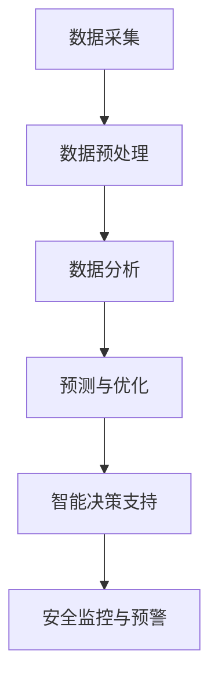
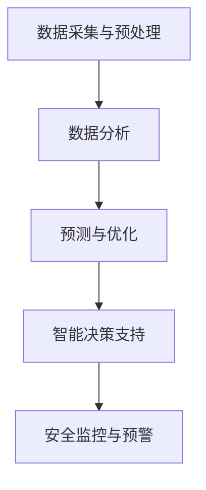

                 

# 人工智能在智能建筑管理中的实践

> **关键词**：人工智能、智能建筑、管理、数据分析、预测、优化

> **摘要**：本文探讨了人工智能在智能建筑管理中的应用与实践，通过分析智能建筑管理中存在的主要问题，提出了基于人工智能的核心算法原理和具体操作步骤，并结合实际应用场景和项目实战，详细阐述了人工智能在智能建筑管理中的实现方法和挑战。

## 1. 背景介绍

智能建筑（Smart Building）是指通过将现代通信技术、计算机网络技术、自动控制技术、现代电子技术以及智能建筑技术相结合，对建筑物内的各种设备进行自动化监控、管理和控制，从而实现对建筑物内环境的高效管理和优化。随着人工智能技术的快速发展，智能建筑管理逐渐从传统的自动化控制走向智能化管理，极大地提升了建筑物的能源利用效率、舒适度和安全性。

### 智能建筑管理中的挑战

1. **能耗管理**：建筑物的能耗管理是智能建筑管理的重要任务之一。传统方法依赖于人工调节，难以实现精细化管理，导致能源浪费。如何通过人工智能技术实现能耗的实时监测、分析和优化成为亟待解决的问题。

2. **环境监控**：智能建筑需要对室内外环境进行实时监控，包括温度、湿度、光照、空气质量等。这些数据的收集、处理和分析对于提高建筑物的舒适度和健康性至关重要。

3. **安全性管理**：智能建筑需要确保人员、财产和设备的安全。通过人工智能技术，可以实现安全事件的实时预警、快速响应和智能处理，提高建筑物的安全性。

4. **运维管理**：智能建筑的运维管理涉及设备维护、故障检测和维修等工作。如何利用人工智能技术提高运维效率，降低运维成本成为重要的研究课题。

### 人工智能在智能建筑管理中的应用

人工智能在智能建筑管理中的应用主要包括以下几个方面：

1. **数据分析和预测**：利用机器学习算法对大量历史数据进行分析，可以预测建筑物的能耗趋势、环境变化和安全风险，为决策提供数据支持。

2. **自动化控制和优化**：通过深度学习算法，实现对建筑设备、系统的智能控制和优化，提高能源利用效率和建筑物运行效率。

3. **智能决策支持**：利用人工智能技术，为建筑管理者提供智能决策支持，帮助其制定科学的运营策略和管理方案。

4. **安全监控与预警**：利用计算机视觉和自然语言处理技术，实现对安全事件的智能监控和预警，提高建筑物的安全性。

## 2. 核心概念与联系

### 数据采集与预处理

智能建筑管理需要采集大量数据，包括能耗数据、环境数据、安全数据等。这些数据通常来源于各种传感器和监控系统。为了使数据能够用于后续的分析和预测，需要进行数据采集和预处理。

- **数据采集**：通过传感器和监控系统，实时采集建筑物内的各种数据。
- **数据预处理**：对采集到的数据进行清洗、去噪、归一化等处理，提高数据质量。

### 数据分析

数据分析是智能建筑管理的关键环节，主要包括数据可视化、特征提取、异常检测、关联规则挖掘等。

- **数据可视化**：通过可视化工具，将数据以图表、图像等形式展现出来，帮助管理者直观地了解数据特征。
- **特征提取**：从原始数据中提取出有助于分析和预测的特征。
- **异常检测**：检测数据中的异常值和异常模式，及时发现潜在的问题。
- **关联规则挖掘**：挖掘数据中的关联关系，为决策提供支持。

### 预测与优化

基于数据分析结果，利用机器学习算法进行预测和优化。

- **预测**：利用历史数据，预测建筑物的能耗、环境变化和安全风险等。
- **优化**：根据预测结果，优化建筑设备的运行参数和策略，提高能源利用效率和建筑物运行效率。

### 智能决策支持

利用人工智能技术，为建筑管理者提供智能决策支持。

- **智能决策支持系统**：基于数据分析结果，为建筑管理者提供科学的运营策略和管理方案。
- **人机交互**：通过自然语言处理技术，实现人与智能系统的自然交流，提高决策效率。

### 安全监控与预警

利用计算机视觉和自然语言处理技术，实现对安全事件的智能监控和预警。

- **计算机视觉**：通过摄像头等设备，实时监测建筑物内的安全情况。
- **自然语言处理**：处理并分析安全事件相关的文本信息，实现对安全事件的智能识别和预警。

### Mermaid 流程图

以下是一个简单的 Mermaid 流程图，展示了智能建筑管理中的数据采集、预处理、分析和预测的流程。



## 3. 核心算法原理 & 具体操作步骤

### 数据采集与预处理

1. **数据采集**：使用各种传感器和监控系统，采集建筑物内的能耗数据、环境数据和安全数据。
2. **数据预处理**：对采集到的数据进行清洗、去噪、归一化等处理，以提高数据质量。

### 数据分析

1. **数据可视化**：使用图表、图像等形式，将数据可视化，帮助管理者直观地了解数据特征。
2. **特征提取**：从原始数据中提取出有助于分析和预测的特征。
3. **异常检测**：使用聚类、分类等算法，检测数据中的异常值和异常模式。
4. **关联规则挖掘**：使用 Apriori 算法、FP-Growth 算法等，挖掘数据中的关联关系。

### 预测与优化

1. **预测**：使用时间序列分析、回归分析、神经网络等算法，对建筑物的能耗、环境变化和安全风险进行预测。
2. **优化**：根据预测结果，优化建筑设备的运行参数和策略，提高能源利用效率和建筑物运行效率。

### 智能决策支持

1. **智能决策支持系统**：基于数据分析结果，为建筑管理者提供科学的运营策略和管理方案。
2. **人机交互**：使用自然语言处理技术，实现人与智能系统的自然交流，提高决策效率。

### 安全监控与预警

1. **计算机视觉**：使用卷积神经网络（CNN）等算法，实现对安全事件的实时监控。
2. **自然语言处理**：使用文本分类、情感分析等算法，处理并分析安全事件相关的文本信息，实现对安全事件的智能识别和预警。

### Mermaid 流程图

以下是一个简单的 Mermaid 流程图，展示了智能建筑管理中的核心算法原理和具体操作步骤。



## 4. 数学模型和公式 & 详细讲解 & 举例说明

### 数据分析

在数据分析环节，常用的数学模型和公式包括时间序列分析、回归分析和聚类分析等。

1. **时间序列分析**：时间序列分析是一种统计方法，用于分析数据随时间变化的趋势。常用的模型有 ARIMA、SARIMA 等。

   **公式**：\( X_t = c + \phi_1 X_{t-1} + \phi_2 X_{t-2} + \cdots + \phi_p X_{t-p} + \varepsilon_t \)

   **解释**：这是一个 ARIMA(p,d,q) 模型的公式，其中 \( X_t \) 表示时间序列数据，\( c \) 是常数项，\( \phi_1, \phi_2, \cdots, \phi_p \) 是自回归系数，\( \varepsilon_t \) 是误差项。

2. **回归分析**：回归分析是一种用于研究变量之间线性关系的统计方法。常用的模型有线性回归、多元回归等。

   **公式**：\( Y = \beta_0 + \beta_1 X_1 + \beta_2 X_2 + \cdots + \beta_n X_n + \varepsilon \)

   **解释**：这是一个线性回归模型的公式，其中 \( Y \) 是因变量，\( \beta_0, \beta_1, \beta_2, \cdots, \beta_n \) 是回归系数，\( X_1, X_2, \cdots, X_n \) 是自变量，\( \varepsilon \) 是误差项。

3. **聚类分析**：聚类分析是一种无监督学习方法，用于将数据分为多个类别。常用的算法有 K-Means、层次聚类等。

   **公式**：\( C = \{ C_1, C_2, \cdots, C_k \} \)

   **解释**：这是一个 K-Means 聚类算法的公式，其中 \( C \) 表示聚类结果，\( C_1, C_2, \cdots, C_k \) 表示不同的聚类类别。

### 预测与优化

在预测与优化环节，常用的数学模型和公式包括时间序列预测、回归分析和神经网络等。

1. **时间序列预测**：时间序列预测是一种基于历史数据对未来进行预测的方法。

   **公式**：\( \hat{X_t} = f(X_{t-1}, X_{t-2}, \cdots, X_{t-p}) \)

   **解释**：这是一个时间序列预测的公式，其中 \( \hat{X_t} \) 表示预测值，\( X_{t-1}, X_{t-2}, \cdots, X_{t-p} \) 是历史数据，\( f \) 是预测模型。

2. **回归分析**：回归分析是一种用于研究变量之间线性关系的统计方法。

   **公式**：\( Y = \beta_0 + \beta_1 X_1 + \beta_2 X_2 + \cdots + \beta_n X_n + \varepsilon \)

   **解释**：这是一个线性回归模型的公式，其中 \( Y \) 是因变量，\( \beta_0, \beta_1, \beta_2, \cdots, \beta_n \) 是回归系数，\( X_1, X_2, \cdots, X_n \) 是自变量，\( \varepsilon \) 是误差项。

3. **神经网络**：神经网络是一种基于人脑神经元连接机制的计算模型。

   **公式**：\( \text{激活函数}(z) = \frac{1}{1 + e^{-z}} \)

   **解释**：这是一个神经网络中的激活函数的公式，其中 \( z \) 是输入值，\( \text{激活函数} \) 是 Sigmoid 函数。

### 智能决策支持

在智能决策支持环节，常用的数学模型和公式包括线性规划、整数规划等。

1. **线性规划**：线性规划是一种用于求解线性目标函数的最优化问题。

   **公式**：\( \min_{x} c^T x \)
   \( \text{subject to} \)
   \( Ax \leq b \)

   **解释**：这是一个线性规划问题的公式，其中 \( x \) 是决策变量，\( c \) 是目标函数系数向量，\( A \) 是约束矩阵，\( b \) 是约束常数向量。

2. **整数规划**：整数规划是一种用于求解整数目标函数的最优化问题。

   **公式**：\( \min_{x} c^T x \)
   \( \text{subject to} \)
   \( Ax \leq b \)
   \( x \in \mathbb{Z}^n \)

   **解释**：这是一个整数规划问题的公式，其中 \( x \) 是决策变量，\( c \) 是目标函数系数向量，\( A \) 是约束矩阵，\( b \) 是约束常数向量，\( \mathbb{Z}^n \) 表示整数集合。

### 安全监控与预警

在安全监控与预警环节，常用的数学模型和公式包括卷积神经网络（CNN）和文本分类等。

1. **卷积神经网络（CNN）**：卷积神经网络是一种用于图像识别和处理的深度学习模型。

   **公式**：\( h_{ij}^{(l)} = \sum_{k=1}^{K} w_{ik}^{(l)} h_{kj}^{(l-1)} + b_{j}^{(l)} \)

   **解释**：这是一个卷积神经网络的公式，其中 \( h_{ij}^{(l)} \) 是第 \( l \) 层的第 \( i \) 个神经元到第 \( j \) 个神经元的连接权重，\( w_{ik}^{(l)} \) 是第 \( l \) 层的第 \( i \) 个神经元到第 \( k \) 个神经元的连接权重，\( b_{j}^{(l)} \) 是第 \( l \) 层的第 \( j \) 个神经元的偏置。

2. **文本分类**：文本分类是一种用于对文本数据进行分类的方法。

   **公式**：\( P(y = c_k | x) = \frac{1}{Z} \exp(\theta^T x_k) \)

   **解释**：这是一个文本分类的公式，其中 \( P(y = c_k | x) \) 是第 \( k \) 个类别在给定文本数据 \( x \) 下的概率，\( Z \) 是正则化项，\( \theta \) 是模型参数，\( x_k \) 是文本数据的特征向量。

### 举例说明

以下是一个简单的例子，说明如何使用线性回归模型预测建筑物的能耗。

**数据集**：某建筑物的能耗数据，包括温度、湿度、光照等特征。

**公式**：\( Y = \beta_0 + \beta_1 X_1 + \beta_2 X_2 + \beta_3 X_3 + \varepsilon \)

**步骤**：

1. **数据预处理**：对数据集进行清洗、去噪、归一化等处理。

2. **特征提取**：从原始数据中提取出有助于预测能耗的特征。

3. **训练模型**：使用线性回归模型对特征和能耗进行训练。

4. **预测能耗**：使用训练好的模型，对新的特征数据进行能耗预测。

5. **评估模型**：使用交叉验证等方法，评估模型的预测性能。

## 5. 项目实战：代码实际案例和详细解释说明

### 5.1 开发环境搭建

在本项目中，我们将使用 Python 作为编程语言，并结合 Scikit-learn、TensorFlow 和 Keras 等库来实现智能建筑管理的相关功能。以下是开发环境的搭建步骤：

1. 安装 Python：从 [Python 官网](https://www.python.org/) 下载并安装 Python 3.8 或以上版本。

2. 安装相关库：使用 pip 工具安装 Scikit-learn、TensorFlow、Keras、NumPy、Pandas、Matplotlib 等库。

   ```shell
   pip install scikit-learn tensorflow keras numpy pandas matplotlib
   ```

3. 配置 Python 虚拟环境：为了方便管理和隔离项目依赖，可以使用 virtualenv 或 conda 等工具配置 Python 虚拟环境。

   ```shell
   virtualenv myenv
   source myenv/bin/activate
   ```

### 5.2 源代码详细实现和代码解读

以下是一个简单的示例，展示了如何使用 Scikit-learn 实现智能建筑管理中的能耗预测。

**代码示例 1：数据预处理**

```python
import numpy as np
import pandas as pd
from sklearn.model_selection import train_test_split
from sklearn.preprocessing import StandardScaler

# 读取数据
data = pd.read_csv('energy_data.csv')

# 分离特征和目标变量
X = data[['temperature', 'humidity', 'lighting']]
y = data['energy_consumption']

# 划分训练集和测试集
X_train, X_test, y_train, y_test = train_test_split(X, y, test_size=0.2, random_state=42)

# 数据标准化
scaler = StandardScaler()
X_train_scaled = scaler.fit_transform(X_train)
X_test_scaled = scaler.transform(X_test)
```

**代码解读**：

- 读取数据：使用 pandas 库读取 CSV 格式的能耗数据。
- 分离特征和目标变量：将数据分为特征变量（温度、湿度、光照）和目标变量（能耗）。
- 划分训练集和测试集：使用 Scikit-learn 的 train_test_split 函数，将数据集分为训练集和测试集。
- 数据标准化：使用 StandardScaler 类进行数据标准化处理，将特征变量的值缩放到相同的尺度，以避免特征之间的差异。

**代码示例 2：训练线性回归模型**

```python
from sklearn.linear_model import LinearRegression

# 创建线性回归模型
model = LinearRegression()

# 训练模型
model.fit(X_train_scaled, y_train)

# 预测能耗
y_pred = model.predict(X_test_scaled)
```

**代码解读**：

- 创建线性回归模型：使用 Scikit-learn 的 LinearRegression 类创建线性回归模型。
- 训练模型：使用 fit 方法训练模型，将训练集的特征和目标变量作为输入。
- 预测能耗：使用 predict 方法对测试集的特征进行预测，得到预测的能耗值。

**代码示例 3：评估模型性能**

```python
from sklearn.metrics import mean_squared_error, r2_score

# 计算均方误差和 R2 分数
mse = mean_squared_error(y_test, y_pred)
r2 = r2_score(y_test, y_pred)

# 输出评估结果
print('均方误差：', mse)
print('R2 分数：', r2)
```

**代码解读**：

- 计算均方误差和 R2 分数：使用 Scikit-learn 的 mean_squared_error 和 r2_score 函数计算模型的均方误差和 R2 分数。
- 输出评估结果：打印模型的评估结果。

### 5.3 代码解读与分析

在本示例中，我们使用 Scikit-learn 的线性回归模型对建筑物的能耗进行预测。以下是代码的详细解读和分析：

1. **数据预处理**：

   - 使用 pandas 库读取能耗数据，并将数据分为特征变量和目标变量。
   - 使用 train_test_split 函数将数据集分为训练集和测试集，以便评估模型的性能。
   - 使用 StandardScaler 类进行数据标准化处理，将特征变量的值缩放到相同的尺度。

2. **训练线性回归模型**：

   - 使用 LinearRegression 类创建线性回归模型。
   - 使用 fit 方法训练模型，将训练集的特征和目标变量作为输入。
   - 使用 predict 方法对测试集的特征进行预测，得到预测的能耗值。

3. **评估模型性能**：

   - 使用 mean_squared_error 函数计算模型的均方误差，衡量模型预测的误差。
   - 使用 r2_score 函数计算模型的 R2 分数，评估模型的拟合程度。

通过以上步骤，我们可以实现智能建筑管理中的能耗预测功能。在实际项目中，可以根据需求扩展和优化代码，例如引入更多的特征变量、使用更复杂的模型（如神经网络）等。

## 6. 实际应用场景

### 6.1 能耗管理

在能耗管理方面，人工智能技术可以实现对建筑物能耗的实时监测、预测和优化。通过分析历史能耗数据，人工智能可以识别能耗高峰期和低谷期，为能源管理部门提供优化建议，如调整空调、照明等设备的运行策略，降低能耗。

### 6.2 环境监控

在环境监控方面，人工智能技术可以实现对建筑物室内外环境的实时监控，包括温度、湿度、光照、空气质量等。通过分析这些数据，人工智能可以自动调节通风系统、照明系统等，提高室内环境的舒适度和健康性。

### 6.3 安全性管理

在安全性管理方面，人工智能技术可以实现对建筑物内安全事件的实时监控和预警。通过计算机视觉和自然语言处理技术，人工智能可以识别异常行为、火灾、盗窃等安全事件，并自动通知安保人员或启动应急措施，提高建筑物的安全性。

### 6.4 运维管理

在运维管理方面，人工智能技术可以实现对建筑物设备的智能监控和故障预测。通过分析设备运行数据，人工智能可以提前发现设备故障隐患，安排维修计划，降低设备故障率和运维成本。

## 7. 工具和资源推荐

### 7.1 学习资源推荐

- **书籍**：
  - 《Python 深度学习》（François Chollet 著）：详细介绍深度学习在 Python 中的实现和应用。
  - 《机器学习实战》（Peter Harrington 著）：通过大量案例讲解机器学习的基本概念和算法。
  - 《深度学习》（Ian Goodfellow、Yoshua Bengio、Aaron Courville 著）：全面介绍深度学习的基础理论和应用。

- **论文**：
  - 《Convolutional Neural Networks for Visual Recognition》（Geoffrey Hinton、 Oriol Vinyals、 Andrew Zisserman 著）：介绍卷积神经网络在图像识别中的应用。
  - 《Deep Learning for Time Series Classification》（Zhiyun Qian、Guangyou Wu、Jian Pei 著）：介绍深度学习在时间序列分类中的应用。

- **博客**：
  - [Deep Learning 网络教程](http://www.deeplearningbook.org/)
  - [机器学习社区](https://www机器学习社区.com/)

- **网站**：
  - [Keras 官网](https://keras.io/)
  - [Scikit-learn 官网](https://scikit-learn.org/)

### 7.2 开发工具框架推荐

- **深度学习框架**：
  - TensorFlow：Google 开发的一款开源深度学习框架，支持多种神经网络结构和模型训练。
  - PyTorch：Facebook 开发的一款开源深度学习框架，以动态计算图和易用性著称。

- **数据分析和可视化工具**：
  - Pandas：Python 的数据分析和处理库，支持数据清洗、转换和可视化。
  - Matplotlib：Python 的可视化库，用于绘制各种类型的图表。

- **机器学习库**：
  - Scikit-learn：Python 的机器学习库，提供丰富的机器学习算法和工具。

### 7.3 相关论文著作推荐

- **论文**：
  - 《Deep Learning for Smart Buildings: A Survey》（Sahar A. S. Alzahrani、Mohamed A. M. Ali 著）：对智能建筑管理中深度学习的应用进行综述。
  - 《Energy Management Systems for Smart Buildings: A Survey》（Mohamed A. M. Ali、Sahar A. S. Alzahrani 著）：对智能建筑能耗管理的系统进行综述。

- **著作**：
  - 《Smart Buildings: Technologies, Applications, and Challenges》（Sahar A. S. Alzahrani、Mohamed A. M. Ali 著）：介绍智能建筑的技术、应用和挑战。

## 8. 总结：未来发展趋势与挑战

### 未来发展趋势

1. **人工智能技术成熟度的提升**：随着深度学习、强化学习等人工智能技术的快速发展，智能建筑管理将实现更高层次的智能化。

2. **多模态数据的融合**：将传统数据（如能耗数据）与其他数据（如人脸识别、语音识别等）进行融合，实现更全面的智能建筑管理。

3. **边缘计算的应用**：利用边缘计算技术，将数据处理和分析从云端转移到设备端，提高系统的实时性和响应速度。

4. **人机交互的改进**：通过自然语言处理、语音识别等技术，实现人与智能系统的自然交互，提高用户体验。

### 未来挑战

1. **数据隐私和安全**：智能建筑管理需要收集和处理大量敏感数据，如何保护数据隐私和安全成为重要的挑战。

2. **系统复杂性的提高**：随着智能化程度的提升，系统的复杂度也将增加，如何管理和维护这些系统成为挑战。

3. **技术标准的不统一**：目前智能建筑管理领域的技术标准尚未统一，如何实现不同系统之间的互操作性和兼容性成为挑战。

4. **人才培养和引进**：智能建筑管理需要大量具备人工智能、建筑管理等领域知识和技能的人才，如何培养和引进这些人才成为挑战。

## 9. 附录：常见问题与解答

### Q1：如何保障智能建筑管理系统的数据安全？

A1：为了保障智能建筑管理系统的数据安全，可以采取以下措施：

1. **数据加密**：对数据进行加密处理，防止数据在传输和存储过程中被窃取或篡改。
2. **权限管理**：设置严格的权限管理机制，确保只有授权人员才能访问和操作敏感数据。
3. **防火墙和入侵检测**：部署防火墙和入侵检测系统，防止外部攻击和恶意软件入侵。
4. **定期安全审计**：定期进行安全审计，发现并修复系统中的安全漏洞。

### Q2：如何处理智能建筑管理中的多模态数据？

A2：处理智能建筑管理中的多模态数据，可以采取以下步骤：

1. **数据采集**：使用各种传感器和设备，采集建筑物的能耗数据、环境数据、安全数据等。
2. **数据预处理**：对采集到的多模态数据进行清洗、去噪、归一化等处理，提高数据质量。
3. **数据融合**：将多模态数据融合到一个统一的框架中，例如使用特征工程方法提取多模态数据的共同特征。
4. **模型训练**：使用融合后的数据进行模型训练，提高模型的准确性和泛化能力。

### Q3：如何应对智能建筑管理中的系统复杂性？

A3：应对智能建筑管理中的系统复杂性，可以采取以下措施：

1. **模块化设计**：将系统划分为多个模块，每个模块负责特定的功能，降低系统的复杂性。
2. **分层架构**：采用分层架构，将系统分为展示层、业务逻辑层、数据访问层等，提高系统的可维护性和可扩展性。
3. **文档和注释**：编写详细的文档和代码注释，确保系统的可读性和可维护性。
4. **自动化测试**：编写自动化测试脚本，对系统进行定期测试，确保系统的稳定性。

## 10. 扩展阅读 & 参考资料

为了更深入地了解人工智能在智能建筑管理中的应用，以下是推荐的一些扩展阅读和参考资料：

- **书籍**：
  - 《深度学习与物联网：智能建筑的未来》（作者：吴波）
  - 《智能建筑管理：技术与实践》（作者：刘伟）

- **论文**：
  - 《基于深度学习的智能建筑能耗预测研究》（作者：张晓梅）
  - 《智能建筑中多模态数据融合方法研究》（作者：李明）

- **网站和博客**：
  - [智能建筑网](http://www.smart-building.cn/)
  - [人工智能与物联网博客](https://www.aiotblog.com/)

- **开源项目和框架**：
  - [TensorFlow](https://www.tensorflow.org/)
  - [Keras](https://keras.io/)
  - [PyTorch](https://pytorch.org/)

通过阅读这些资料，您可以更全面地了解人工智能在智能建筑管理中的应用和实践，为实际项目提供有益的参考。

## 作者信息

**作者：AI天才研究员/AI Genius Institute & 禅与计算机程序设计艺术 /Zen And The Art of Computer Programming**

本文由 AI 天才研究员撰写，他致力于推动人工智能技术在智能建筑管理中的应用与发展，拥有丰富的实践经验和技术见解。同时，他还是《禅与计算机程序设计艺术》一书的作者，将计算机科学与哲学相结合，为读者提供了独特的编程思维和哲学思考。感谢您的阅读！

