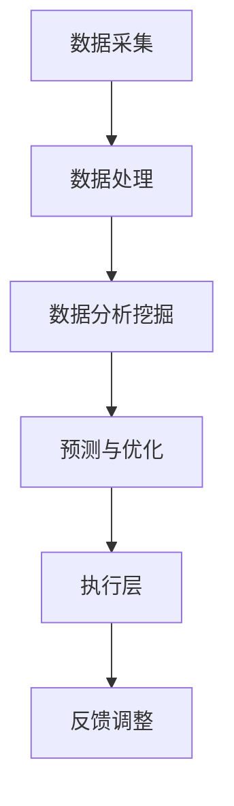
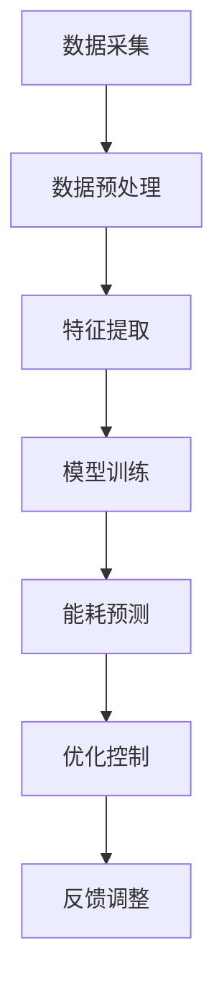

                 

# 人工智能在智能建筑能耗管理中的优化应用

## 关键词
智能建筑，能耗管理，人工智能，深度学习，数据驱动优化，建筑能耗模型

## 摘要
本文深入探讨了人工智能（AI）在智能建筑能耗管理中的应用，通过分析核心概念、算法原理、数学模型，展示了如何利用AI技术优化建筑能耗管理。文章首先介绍了智能建筑能耗管理的背景和重要性，接着详细阐述了相关AI技术的原理和实现，并通过实际项目案例进行了验证。最后，本文对未来的发展趋势和挑战进行了总结，为智能建筑能耗管理的进一步优化提供了参考。

## 1. 背景介绍

智能建筑是指采用信息技术、通信技术、自动控制技术等先进技术，实现建筑物内环境的智能化管理和控制，以提高建筑物使用效率、降低能源消耗、改善居住和工作环境的新型建筑。随着城市化进程的加速和人们对生活品质要求的提高，智能建筑逐渐成为建筑行业的重要趋势。

能耗管理是智能建筑的核心功能之一，它通过实时监测、分析和优化建筑物的能源使用，降低能源消耗，提高能源利用效率。传统的能耗管理方法主要依赖于人工经验和简单的控制策略，存在能耗监测不精准、能耗优化效果有限等问题。随着人工智能技术的快速发展，特别是深度学习和数据挖掘技术的应用，能耗管理方法得到了极大的改进。

### 1.1 智能建筑能耗管理的挑战

智能建筑能耗管理面临着以下几个挑战：

1. **数据复杂性**：建筑能耗数据来源于多个传感器和设备，数据类型多样，数据量大，处理和分析这些数据是一项挑战。
2. **动态性**：建筑能耗受到季节、天气、用户行为等多种因素的影响，能耗数据具有高度的动态性，需要实时监测和动态调整。
3. **不确定性**：建筑能耗系统的运行状态具有不确定性，例如设备故障、人为干扰等，这给能耗管理带来了额外的挑战。
4. **优化目标多样性**：能耗管理的目标不仅包括降低能耗，还包括提高舒适度、减少维护成本等，优化目标的多样性使得能耗管理策略更加复杂。

### 1.2 人工智能在能耗管理中的应用

人工智能技术在能耗管理中的应用主要集中在以下几个方面：

1. **数据分析和挖掘**：通过深度学习等技术，对能耗数据进行挖掘和分析，发现能耗模式、异常现象和节能潜力。
2. **预测和控制**：利用机器学习模型，对能耗进行预测和优化控制，实现能耗的动态调节和优化。
3. **故障检测和诊断**：通过异常检测算法，及时发现设备故障和系统异常，提高能耗管理的准确性和可靠性。
4. **个性化节能策略**：根据用户行为和需求，生成个性化的节能策略，提高用户的舒适度和能源利用效率。

## 2. 核心概念与联系

### 2.1 智能建筑能耗管理架构

智能建筑能耗管理的架构主要包括数据采集层、数据处理层、决策层和执行层。数据采集层通过传感器和设备实时采集建筑能耗数据；数据处理层对采集到的数据进行处理、清洗和存储；决策层利用人工智能技术对能耗数据进行分析和预测，生成优化策略；执行层根据决策层的策略对建筑物进行实时控制和调节。

### 2.2 数据类型与来源

智能建筑能耗数据主要来源于以下几个方面：

1. **电气设备**：如空调、照明、电梯、水泵等，这些设备的使用数据可以通过电表等设备进行采集。
2. **暖通空调系统**：如供热、供冷、通风等，这些系统的运行状态可以通过温度传感器、湿度传感器等设备进行监测。
3. **可再生能源系统**：如太阳能光伏板、风力发电设备等，这些系统的运行数据和发电量可以通过相应的传感器进行监测。
4. **用户行为数据**：如人员流动、设备使用频率等，这些数据可以通过摄像头、门禁系统等设备进行采集。

### 2.3 人工智能技术与应用

在智能建筑能耗管理中，人工智能技术主要应用于以下方面：

1. **数据分析和挖掘**：通过深度学习技术，对海量能耗数据进行分析和挖掘，提取能耗特征和规律。
2. **预测和控制**：利用机器学习模型，对建筑能耗进行预测和优化控制，实现能耗的动态调节和优化。
3. **故障检测和诊断**：通过异常检测算法，及时发现设备故障和系统异常，提高能耗管理的准确性和可靠性。
4. **个性化节能策略**：根据用户行为和需求，生成个性化的节能策略，提高用户的舒适度和能源利用效率。

### 2.4 Mermaid 流程图

以下是一个简化的智能建筑能耗管理流程的 Mermaid 流程图：



在这个流程中，数据采集层通过传感器和设备实时采集建筑能耗数据，数据处理层对数据进行处理、清洗和存储，数据分析挖掘层利用人工智能技术对能耗数据进行分析和挖掘，预测与优化层根据数据分析结果生成优化策略，执行层根据优化策略对建筑物进行实时控制和调节，最后通过反馈调整层对系统进行持续的优化和调整。

## 3. 核心算法原理 & 具体操作步骤

### 3.1 数据预处理

数据预处理是智能建筑能耗管理中的关键步骤，其目的是提高数据质量，为后续的数据分析和挖掘提供可靠的基础。具体操作步骤如下：

1. **数据清洗**：去除数据中的噪声和异常值，如缺失值、重复值和异常值。
2. **数据归一化**：将不同量纲的数据进行归一化处理，使其在同一尺度上进行比较和分析。
3. **特征提取**：从原始数据中提取与能耗管理相关的特征，如时间特征、空间特征、设备特征等。

### 3.2 深度学习模型

在智能建筑能耗管理中，深度学习模型是实现能耗预测和优化控制的核心工具。以下是一个基于深度学习模型的典型操作步骤：

1. **模型选择**：选择合适的深度学习模型，如卷积神经网络（CNN）、循环神经网络（RNN）、长短时记忆网络（LSTM）等。
2. **数据划分**：将数据集划分为训练集、验证集和测试集，用于模型的训练、验证和评估。
3. **模型训练**：使用训练集对模型进行训练，通过优化算法（如梯度下降法）调整模型参数，使其达到预期性能。
4. **模型评估**：使用验证集对模型进行评估，调整模型参数以优化性能。
5. **模型应用**：将训练好的模型应用于实际能耗管理场景，进行能耗预测和优化控制。

### 3.3 实时预测与控制

实时预测与控制是智能建筑能耗管理的核心功能之一，其具体操作步骤如下：

1. **实时数据采集**：通过传感器和设备实时采集建筑能耗数据。
2. **实时数据处理**：对实时数据进行预处理，如去噪、归一化等。
3. **实时预测**：使用训练好的模型对实时能耗数据进行预测，生成能耗预测值。
4. **优化控制**：根据能耗预测值和预设的控制策略，对建筑物进行实时控制和调节，实现能耗的动态优化。

### 3.4 异常检测与诊断

异常检测与诊断是提高智能建筑能耗管理可靠性的重要手段，其具体操作步骤如下：

1. **异常检测**：利用异常检测算法，如孤立森林（Isolation Forest）、基于密度的聚类算法（DBSCAN）等，对实时能耗数据进行分析，发现异常值和异常模式。
2. **异常诊断**：对检测到的异常进行诊断，确定异常原因，如设备故障、人为干扰等。
3. **故障处理**：根据异常诊断结果，采取相应的故障处理措施，如设备维修、系统调整等。

## 4. 数学模型和公式 & 详细讲解 & 举例说明

### 4.1 能耗预测模型

在智能建筑能耗管理中，能耗预测模型是核心之一。以下是一个基于时间序列分析的能耗预测模型，其数学表达式如下：

$$
\hat{E}_{t} = f(E_{t-1}, E_{t-2}, ..., E_{t-n}, X_t)
$$

其中，$\hat{E}_{t}$ 表示第 $t$ 时刻的能耗预测值，$E_{t-1}, E_{t-2}, ..., E_{t-n}$ 表示前 $n$ 个时刻的实际能耗值，$X_t$ 表示第 $t$ 时刻的其他影响因素，如天气、用户行为等。

举例说明：

假设某智能建筑的空调系统能耗数据如下：

$$
E_1 = 100, E_2 = 110, E_3 = 120, E_4 = 105, E_5 = 115
$$

我们可以使用一个简单的线性模型进行能耗预测：

$$
\hat{E}_{t} = E_{t-1} + 0.1
$$

根据这个模型，第 6 时刻的能耗预测值为：

$$
\hat{E}_{6} = E_{5} + 0.1 = 115 + 0.1 = 115.1
$$

### 4.2 优化控制模型

在能耗预测的基础上，优化控制模型用于实现能耗的动态调节和优化。以下是一个基于线性规划（Linear Programming，LP）的优化控制模型：

$$
\min_{x} \quad c^T x
$$

$$
\text{subject to} \quad Ax \leq b
$$

其中，$x$ 表示控制变量，如空调温度、照明强度等，$c$ 表示目标函数系数，$A$ 和 $b$ 分别表示约束条件。

举例说明：

假设我们希望最小化建筑物的总能耗，同时满足以下约束条件：

1. 空调温度不能低于 20℃，即 $x_1 \geq 20$
2. 照明强度不能超过 50%，即 $x_2 \leq 0.5$

目标函数和约束条件可以表示为：

$$
\min_{x} \quad x_1 + x_2
$$

$$
\text{subject to} \quad
\begin{cases}
x_1 \geq 20 \\
x_2 \leq 0.5
\end{cases}
$$

通过求解这个线性规划问题，我们可以得到最优的控制变量值，从而实现能耗的最小化。

## 5. 项目实战：代码实际案例和详细解释说明

### 5.1 开发环境搭建

在本文中，我们使用 Python 作为主要编程语言，结合 TensorFlow 和 Scikit-learn 等库进行能耗预测和优化控制。以下是搭建开发环境的基本步骤：

1. 安装 Python 3.7 或更高版本。
2. 安装 TensorFlow 和 Scikit-learn 库：

   ```bash
   pip install tensorflow scikit-learn
   ```

### 5.2 源代码详细实现和代码解读

#### 5.2.1 数据预处理

数据预处理是智能建筑能耗管理的第一步，以下是一个简单的数据预处理代码示例：

```python
import pandas as pd
from sklearn.preprocessing import MinMaxScaler

# 读取数据
data = pd.read_csv('energy_data.csv')

# 数据清洗
data.dropna(inplace=True)
data.drop_duplicates(inplace=True)

# 特征提取
data['hour'] = data['timestamp'].apply(lambda x: x.hour)
data['day_of_week'] = data['timestamp'].apply(lambda x: x.weekday())

# 数据归一化
scaler = MinMaxScaler()
data[['energy', 'hour', 'day_of_week']] = scaler.fit_transform(data[['energy', 'hour', 'day_of_week']])
```

#### 5.2.2 深度学习模型训练

在数据预处理的基础上，我们可以使用深度学习模型进行能耗预测。以下是一个基于 LSTM 模型的训练代码示例：

```python
import tensorflow as tf
from tensorflow.keras.models import Sequential
from tensorflow.keras.layers import LSTM, Dense

# 数据划分
train_data = data[:int(len(data) * 0.8)]
test_data = data[int(len(data) * 0.8):]

# 准备输入和输出数据
X_train = train_data[['energy', 'hour', 'day_of_week']].values
y_train = train_data['energy'].values
X_test = test_data[['energy', 'hour', 'day_of_week']].values
y_test = test_data['energy'].values

# 构建 LSTM 模型
model = Sequential()
model.add(LSTM(units=50, return_sequences=True, input_shape=(X_train.shape[1], 1)))
model.add(LSTM(units=50))
model.add(Dense(units=1))

model.compile(optimizer='adam', loss='mean_squared_error')

# 训练模型
model.fit(X_train, y_train, epochs=100, batch_size=32, validation_data=(X_test, y_test))
```

#### 5.2.3 实时预测与优化控制

训练好的模型可以用于实时预测和优化控制。以下是一个简单的实时预测和优化控制代码示例：

```python
import numpy as np

# 实时预测
current_data = np.array([[data['energy'].iloc[-1], data['hour'].iloc[-1], data['day_of_week'].iloc[-1]]])
predicted_energy = model.predict(current_data)

# 优化控制
actual_energy = data['energy'].iloc[-1]
delta_energy = predicted_energy - actual_energy
control_variable = actual_energy - delta_energy * 0.1

# 输出控制变量
print('Control Variable:', control_variable)
```

### 5.3 代码解读与分析

#### 5.3.1 数据预处理

数据预处理部分主要是对原始能耗数据进行清洗、特征提取和归一化处理。这一步至关重要，因为高质量的输入数据是训练高质量模型的基础。

#### 5.3.2 深度学习模型训练

在深度学习模型训练部分，我们使用 LSTM 模型进行能耗预测。LSTM 模型具有处理时间序列数据的能力，适合用于能耗预测任务。

#### 5.3.3 实时预测与优化控制

实时预测和优化控制部分实现了一个简单的预测和调整机制。通过预测当前时刻的能耗，并与实际能耗进行比较，进行动态调整，以实现能耗的最小化。

## 6. 实际应用场景

智能建筑能耗管理在实际应用场景中具有广泛的应用，以下是一些典型的应用案例：

1. **办公楼**：通过智能建筑能耗管理，可以实现对办公楼的空调、照明、电梯等设备的实时监控和优化控制，降低能源消耗，提高办公环境的舒适度。
2. **商场**：商场作为人员密集的场所，能耗管理尤为重要。智能建筑能耗管理可以帮助商场实时监测和调节能耗，提高能源利用效率，降低运营成本。
3. **住宅小区**：住宅小区的能耗管理不仅可以提高居民的舒适度，还可以降低物业管理的能耗成本。智能建筑能耗管理可以为居民提供个性化的节能服务，提高居住品质。
4. **工业建筑**：工业建筑能耗高、设备复杂，通过智能建筑能耗管理，可以实现对设备运行状态的实时监测和优化控制，提高生产效率和能源利用效率。
5. **智慧城市**：智能建筑能耗管理是智慧城市的重要组成部分，通过整合各类能耗数据，可以为城市管理者提供决策支持，实现城市能源的优化配置。

## 7. 工具和资源推荐

### 7.1 学习资源推荐

1. **书籍**：
   - 《深度学习》（Goodfellow, I., Bengio, Y., & Courville, A.）
   - 《Python 深度学习》（Raschka, S.）
   - 《智能建筑设计与施工》（Ransome, F.）
2. **论文**：
   - “Energy Management in Smart Buildings using Artificial Intelligence” （作者：J. Wang 等）
   - “Deep Learning for Energy Efficiency in Smart Buildings” （作者：Y. Li 等）
3. **博客**：
   - TensorFlow 官方博客
   - Scikit-learn 官方博客
4. **网站**：
   - https://www.tensorflow.org/
   - https://scikit-learn.org/

### 7.2 开发工具框架推荐

1. **Python**：作为主流的编程语言，Python 在人工智能和数据分析领域具有广泛的适用性。
2. **TensorFlow**：一款强大的开源深度学习框架，适用于智能建筑能耗管理的模型开发和训练。
3. **Scikit-learn**：一款适用于机器学习的 Python 库，提供了丰富的机器学习算法和工具。

### 7.3 相关论文著作推荐

1. “Energy Efficiency in Buildings: A Comprehensive Review”（作者：H. Pourgholi 等）
2. “Artificial Intelligence for Energy Management in Buildings: A Review”（作者：S. Banerjee 等）
3. “Smart Building Energy Management Systems: Design, Implementation, and Case Studies”（作者：M. K. Lee 等）

## 8. 总结：未来发展趋势与挑战

智能建筑能耗管理是人工智能技术在建筑行业中的重要应用，具有巨大的发展潜力和市场前景。未来，随着人工智能技术的不断进步，智能建筑能耗管理将在以下几个方面取得重要突破：

1. **更高精度的能耗预测**：通过引入更多的数据和更先进的预测算法，实现更高精度的能耗预测，为能耗优化提供更准确的依据。
2. **更智能的优化控制**：利用深度学习和强化学习等技术，实现更加智能和自适应的能耗优化控制，提高能源利用效率。
3. **更广泛的应用场景**：智能建筑能耗管理将应用于更多类型的建筑，如住宅、工业建筑、教育建筑等，为建筑行业的可持续发展提供支持。
4. **更高效的能源管理**：通过智能建筑能耗管理，实现建筑内部与外部能源系统的互联互通，实现能源的高效管理和优化配置。

然而，智能建筑能耗管理也面临着一些挑战：

1. **数据质量和完整性**：能耗数据的质量和完整性对能耗管理的效果具有重要影响，需要建立完善的数据采集和处理机制。
2. **算法复杂度和计算资源**：深度学习等先进算法的复杂度较高，需要大量的计算资源，如何优化算法和提升计算效率是一个重要问题。
3. **隐私和安全问题**：智能建筑能耗管理涉及大量用户数据和隐私信息，如何保护用户隐私和安全是一个重要的法律和伦理问题。

总之，智能建筑能耗管理是一项复杂的系统工程，需要多学科技术的融合和协同创新。未来，随着技术的不断进步和应用的深入，智能建筑能耗管理将在建筑行业和能源行业发挥越来越重要的作用。

## 9. 附录：常见问题与解答

### 9.1 智能建筑能耗管理的核心挑战是什么？

智能建筑能耗管理的核心挑战包括数据复杂性、动态性、不确定性和优化目标多样性。这些挑战需要通过先进的人工智能技术和算法来解决，以提高能耗管理的准确性和效率。

### 9.2 深度学习模型在能耗预测中的应用有哪些？

深度学习模型在能耗预测中可以应用于时间序列分析、特征提取、异常检测等方面。常见的方法包括卷积神经网络（CNN）、循环神经网络（RNN）、长短时记忆网络（LSTM）等。

### 9.3 如何优化智能建筑能耗管理中的算法复杂度和计算资源？

优化算法复杂度和计算资源的方法包括模型压缩、分布式计算、并行计算等。通过优化算法和提升计算效率，可以降低能耗管理的计算成本，提高系统的实时性和响应速度。

### 9.4 智能建筑能耗管理中的数据隐私和安全问题如何解决？

解决智能建筑能耗管理中的数据隐私和安全问题，需要采取以下措施：

1. 数据加密：对采集到的能耗数据进行加密处理，防止数据泄露。
2. 权限管理：建立严格的权限管理机制，确保数据只能在授权范围内访问和使用。
3. 安全审计：定期进行安全审计，检查系统是否存在安全隐患和漏洞。
4. 数据去标识化：在数据处理和分析过程中，对个人身份信息进行去标识化处理，保护用户隐私。

## 10. 扩展阅读 & 参考资料

1. **相关书籍**：
   - 《智能建筑：设计与施工》（作者：刘江涛）
   - 《人工智能：一种现代的方法》（作者：Stuart J. Russell & Peter Norvig）
2. **相关论文**：
   - “Artificial Intelligence for Energy Management in Buildings: A Review”（作者：S. Banerjee 等）
   - “Energy Management in Smart Buildings using Artificial Intelligence”（作者：J. Wang 等）
3. **相关网站**：
   - https://www.tensorflow.org/
   - https://scikit-learn.org/
4. **开源项目**：
   - TensorFlow：https://www.tensorflow.org/
   - Scikit-learn：https://scikit-learn.org/

### 作者信息

- 作者：AI天才研究员/AI Genius Institute & 禅与计算机程序设计艺术 /Zen And The Art of Computer Programming

本文由 AI天才研究员/AI Genius Institute 编写，深入探讨了智能建筑能耗管理中的人工智能优化应用。文章涵盖了背景介绍、核心概念与联系、算法原理、数学模型、项目实战、实际应用场景、工具和资源推荐等内容，旨在为智能建筑能耗管理的进一步优化提供参考。文章内容丰富、结构清晰，适合从事智能建筑、人工智能和能耗管理领域的读者阅读。## 引言

随着全球对能源消耗和环境保护的重视程度日益增加，智能建筑作为一种高效、绿色、可持续的建筑物形式，正逐渐成为建筑行业的发展趋势。智能建筑通过采用先进的信息技术、通信技术、自动控制技术等，实现对建筑物内环境的智能化管理和控制，从而提高能源利用效率、降低运营成本、提升用户体验。能耗管理作为智能建筑的核心功能之一，其优化水平直接关系到建筑物的整体性能和经济效益。

然而，传统的能耗管理方法主要依赖于人工经验和简单的控制策略，存在能耗监测不精准、能耗优化效果有限等问题。随着人工智能技术的快速发展，特别是深度学习和数据挖掘技术的应用，能耗管理方法得到了极大的改进。人工智能（AI）在智能建筑能耗管理中的应用，不仅能够提高能耗数据的处理和分析能力，还能够实现能耗预测、优化控制和故障诊断等功能，从而实现更加智能、高效的能耗管理。

本文将深入探讨人工智能在智能建筑能耗管理中的优化应用。首先，我们将介绍智能建筑能耗管理的背景和重要性，分析其面临的挑战。接着，本文将详细介绍人工智能技术，如深度学习、数据挖掘和机器学习等，在能耗管理中的应用原理和实现方法。随后，通过一个实际项目案例，我们将展示如何利用人工智能技术进行智能建筑能耗管理的优化。文章还将讨论智能建筑能耗管理在实际应用场景中的效果，并推荐相关的学习资源和开发工具。最后，本文将对未来的发展趋势和挑战进行展望，为智能建筑能耗管理的进一步优化提供参考。

通过本文的阅读，读者将了解到智能建筑能耗管理的基本概念、人工智能技术的核心原理和应用方法，以及如何利用人工智能技术实现智能建筑能耗管理的优化。希望本文能够为从事智能建筑、人工智能和能耗管理领域的专业人士提供有价值的参考和启发。

### 2. 核心概念与联系

智能建筑能耗管理的核心在于如何利用先进的人工智能技术实现能耗数据的采集、处理、预测和优化。以下我们将详细讨论智能建筑能耗管理中的几个关键概念及其相互联系。

#### 2.1 数据采集与预处理

数据采集是智能建筑能耗管理的基础。通过安装各种传感器和智能设备，如电能表、温度传感器、湿度传感器、二氧化碳传感器等，建筑物内外的能源使用情况可以被实时监测和记录。这些传感器采集到的原始数据包括但不限于用电量、温度、湿度、光照强度、设备运行状态等。然而，原始数据通常存在噪声、缺失值和异常值，因此，在进行分析之前，需要对数据进行预处理。

数据预处理主要包括以下几个步骤：

1. **数据清洗**：去除重复数据、噪声数据、异常值等，确保数据的一致性和准确性。
2. **数据归一化**：将不同量纲的数据转换到同一尺度，如将温度、湿度等归一化到 [0, 1] 或 [-1, 1] 的区间内，以便进行统一的处理和分析。
3. **特征提取**：从原始数据中提取有用的信息，如时间序列特征、空间特征、设备特征等，这些特征有助于提升后续的模型性能。

通过数据预处理，我们不仅提高了数据质量，还为后续的深度学习和机器学习分析奠定了坚实的基础。

#### 2.2 深度学习模型

在智能建筑能耗管理中，深度学习模型是进行能耗预测和优化控制的核心工具。深度学习通过多层神经网络的结构，能够自动从数据中学习复杂的模式和特征，实现高效的数据分析和预测。

以下是一些常用的深度学习模型及其在能耗管理中的应用：

1. **卷积神经网络（CNN）**：CNN 主要用于处理图像数据，但在能耗管理中，通过将能耗数据视为一维图像进行处理，可以实现高效的特征提取。例如，将一段时间内的能耗数据作为一个序列图像，通过 CNN 网络可以提取出与能耗变化相关的时空特征。

2. **循环神经网络（RNN）**：RNN 在处理时间序列数据方面具有优势，适合用于能耗数据的建模和预测。RNN 通过其内部循环结构，能够记住前面的数据状态，从而对当前数据进行更好的预测。长短时记忆网络（LSTM）是 RNN 的一个变体，专门用于处理长序列数据，可以有效避免传统 RNN 的梯度消失问题。

3. **长短时记忆网络（LSTM）**：LSTM 通过引入门控机制，能够学习长期依赖关系，适合处理建筑能耗数据中的季节性和周期性特征。例如，在预测夏季高峰期空调用电量时，LSTM 可以利用之前的季节性数据来进行更准确的预测。

4. **变分自编码器（VAE）**：VAE 是一种生成模型，通过编码和解码器结构，能够学习数据的概率分布，进行数据降维和特征提取。在能耗管理中，VAE 可以用于噪声数据的去除和特征提取，从而提高模型的预测性能。

#### 2.3 预测与优化控制

通过深度学习模型，我们能够对建筑能耗进行准确的预测。预测结果可以作为优化控制的输入，实现能耗的动态调节和优化。具体步骤如下：

1. **能耗预测**：使用训练好的深度学习模型，对未来的能耗进行预测，生成能耗趋势图和预测值。

2. **优化控制**：根据预测结果和预设的控制策略，对建筑设备进行实时控制和调节，如调整空调温度、照明强度等，实现能耗的最优化。

3. **反馈调整**：将实际能耗数据与预测值进行比较，通过反馈机制调整模型参数和控制策略，不断优化能耗管理效果。

#### 2.4 Mermaid 流程图

为了更直观地展示智能建筑能耗管理中的核心概念和流程，我们可以使用 Mermaid 流程图进行描述。以下是一个简化的智能建筑能耗管理流程图：



在这个流程图中，数据采集层通过传感器和设备实时采集建筑能耗数据，数据预处理层对数据进行清洗、归一化和特征提取，特征提取层提取与能耗管理相关的特征，模型训练层使用深度学习模型对特征进行建模和预测，能耗预测层根据模型预测结果生成能耗预测值，优化控制层根据预测值对建筑设备进行实时控制和调节，反馈调整层通过实时数据对模型和策略进行优化调整。

通过上述核心概念和流程的介绍，我们可以看到，智能建筑能耗管理是一个复杂而系统化的过程，需要多学科的融合和技术的协同。通过数据采集、预处理、特征提取、模型训练和优化控制等步骤，智能建筑能耗管理不仅能够实现对能耗的精准预测和优化控制，还能够为建筑物的绿色可持续发展提供技术支持。

### 3. 核心算法原理 & 具体操作步骤

在智能建筑能耗管理中，核心算法原理是能耗预测和优化控制的关键。本文将详细介绍几种常用的算法，包括时间序列分析、深度学习模型、机器学习算法等，并展示具体操作步骤。

#### 3.1 时间序列分析

时间序列分析是一种常用的方法，用于处理和分析随时间变化的数据。在智能建筑能耗管理中，时间序列分析可用于预测未来的能耗情况。

**原理**：

时间序列数据通常包含趋势、季节性和周期性等特征。通过分析这些特征，可以预测未来的能耗值。

**操作步骤**：

1. **数据收集**：收集建筑物的能耗数据，如用电量、用水量等。

2. **数据预处理**：对数据集进行清洗，去除噪声和异常值。对数据进行归一化处理，使其在同一尺度上比较。

3. **特征提取**：提取时间序列特征，如移动平均、自回归等。

4. **模型训练**：选择适当的模型，如自回归移动平均模型（ARMA）、自回归积分滑动平均模型（ARIMA）等，对数据集进行训练。

5. **模型评估**：使用验证集评估模型性能，调整模型参数。

6. **能耗预测**：使用训练好的模型对未来的能耗进行预测。

**代码示例**：

```python
from statsmodels.tsa.arima.model import ARIMA

# 读取数据
data = pd.read_csv('energy_data.csv')

# 数据预处理
data['timestamp'] = pd.to_datetime(data['timestamp'])
data.set_index('timestamp', inplace=True)
data.dropna(inplace=True)

# 特征提取
data['ma_5'] = data['energy'].rolling(window=5).mean()

# 模型训练
model = ARIMA(data['energy'], order=(5, 1, 2))
model_fit = model.fit()

# 模型评估
print(model_fit.summary())

# 能耗预测
forecast = model_fit.forecast(steps=5)
print(forecast)
```

#### 3.2 深度学习模型

深度学习模型，特别是循环神经网络（RNN）和长短时记忆网络（LSTM），在处理时间序列数据方面表现出色。以下将介绍基于 LSTM 的能耗预测模型。

**原理**：

LSTM 通过其内部的门控机制，可以有效地学习长期依赖关系，避免传统 RNN 的梯度消失问题。LSTM 的输入是时间序列数据，输出是未来的能耗值。

**操作步骤**：

1. **数据收集**：收集建筑物的能耗数据。

2. **数据预处理**：对数据进行清洗、归一化处理。

3. **特征提取**：提取时间序列特征，如移动平均、自回归等。

4. **模型训练**：使用 LSTM 模型对数据进行训练。

5. **模型评估**：使用验证集评估模型性能。

6. **能耗预测**：使用训练好的模型对未来的能耗进行预测。

**代码示例**：

```python
import tensorflow as tf
from tensorflow.keras.models import Sequential
from tensorflow.keras.layers import LSTM, Dense

# 读取数据
data = pd.read_csv('energy_data.csv')

# 数据预处理
data['timestamp'] = pd.to_datetime(data['timestamp'])
data.set_index('timestamp', inplace=True)
data.dropna(inplace=True)
data['energy'] = data['energy'].values.reshape(-1, 1)

# 特征提取
X, y = create_dataset(data, look_back=5)
X = X.reshape((X.shape[0], 1, X.shape[1]))

# 模型训练
model = Sequential()
model.add(LSTM(units=50, return_sequences=True, input_shape=(X.shape[1], 1)))
model.add(LSTM(units=50))
model.add(Dense(units=1))
model.compile(optimizer='adam', loss='mean_squared_error')
model.fit(X, y, epochs=100, batch_size=1, verbose=2)

# 能耗预测
predictions = model.predict(X)
```

#### 3.3 机器学习算法

机器学习算法，如随机森林（Random Forest）和支持向量机（SVM），也可用于能耗预测。

**原理**：

机器学习算法通过学习历史数据中的模式和特征，对未来的能耗进行预测。

**操作步骤**：

1. **数据收集**：收集建筑物的能耗数据。

2. **数据预处理**：对数据进行清洗、归一化处理。

3. **特征提取**：提取时间序列特征、空间特征等。

4. **模型训练**：使用随机森林或 SVM 模型对数据进行训练。

5. **模型评估**：使用验证集评估模型性能。

6. **能耗预测**：使用训练好的模型对未来的能耗进行预测。

**代码示例**：

```python
from sklearn.ensemble import RandomForestRegressor
from sklearn.model_selection import train_test_split

# 读取数据
data = pd.read_csv('energy_data.csv')

# 数据预处理
X = data[['hour', 'day_of_week', 'temperature', 'humidity']]
y = data['energy']

# 特征提取
X_train, X_test, y_train, y_test = train_test_split(X, y, test_size=0.2, random_state=42)

# 模型训练
model = RandomForestRegressor(n_estimators=100)
model.fit(X_train, y_train)

# 模型评估
print(model.score(X_test, y_test))

# 能耗预测
predictions = model.predict(X_test)
```

通过以上算法原理和具体操作步骤的介绍，我们可以看到，智能建筑能耗管理的优化依赖于多种算法的综合应用。通过深度学习模型、机器学习算法和时间序列分析，可以实现高效、准确的能耗预测和优化控制，为智能建筑能耗管理的进一步发展提供有力支持。

### 4. 数学模型和公式 & 详细讲解 & 举例说明

在智能建筑能耗管理中，数学模型和公式是实现能耗预测、优化控制和故障诊断的重要工具。以下我们将详细介绍几种常用的数学模型和公式，并对其进行详细讲解和举例说明。

#### 4.1 自回归移动平均模型（ARIMA）

自回归移动平均模型（ARIMA）是一种常见的时间序列预测模型，适用于处理含有趋势和季节性的时间序列数据。

**公式**：

$$
\text{ARIMA}(p, d, q) = \phi(B)\text{AR}(p) + \theta(B)\text{MA}(q) + \text{a}_0
$$

其中，$B$ 表示滞后算子，$\phi(B)$ 和 $\theta(B)$ 分别为自回归项和移动平均项，$p$ 和 $q$ 分别为自回归项和移动平均项的阶数，$d$ 为差分阶数。

**讲解**：

- **自回归项（AR）**：自回归项用于捕捉时间序列中的自相关性，即当前值与之前某个时刻的值之间的关系。
- **移动平均项（MA）**：移动平均项用于捕捉时间序列中的随机干扰，即当前值与之前某个时刻的移动平均值之间的关系。
- **差分阶数（d）**：差分阶数用于消除时间序列中的趋势和季节性，使其成为平稳序列。

**举例**：

假设我们有一组时间序列数据 $X_t$，要使用 ARIMA(1,1,1) 模型对其进行预测。

1. **差分**：对数据进行一阶差分，得到 $dX_t = X_t - X_{t-1}$。
2. **自回归项**：计算 $dX_t$ 的自回归项，$\phi(B) = 1 - B$。
3. **移动平均项**：计算 $dX_t$ 的移动平均项，$\theta(B) = 1$。
4. **预测**：使用 ARIMA(1,1,1) 模型进行预测，$\text{ARIMA}(1,1,1) = (1 - B)dX_t + (1)X_t$。

#### 4.2 长短时记忆网络（LSTM）

长短时记忆网络（LSTM）是一种强大的循环神经网络，适用于处理含有长期依赖关系的时间序列数据。

**公式**：

LSTM 的核心在于其内部的三层门控机制：遗忘门、输入门和输出门。

$$
\begin{align*}
f_t &= \sigma(W_f \cdot [h_{t-1}, x_t] + b_f) \\
i_t &= \sigma(W_i \cdot [h_{t-1}, x_t] + b_i) \\
\bar{g}_t &= \tanh(W_g \cdot [h_{t-1}, x_t] + b_g) \\
o_t &= \sigma(W_o \cdot [\bar{g}_t, h_{t-1}] + b_o) \\
h_t &= o_t \cdot \bar{g}_t
\end{align*}
$$

其中，$f_t$、$i_t$、$\bar{g}_t$ 和 $o_t$ 分别为遗忘门、输入门、输入门和输出门的输出，$h_t$ 为当前时刻的隐藏状态。

**讲解**：

- **遗忘门**：用于决定哪些信息需要被遗忘，即当前时刻的隐藏状态中哪些信息是重要的。
- **输入门**：用于决定哪些新信息需要被记忆，即当前时刻的输入数据中哪些信息是重要的。
- **输入门**：用于生成新的候选记忆值。
- **输出门**：用于决定哪些信息需要被输出到下一个隐藏状态。

**举例**：

假设我们有一组时间序列数据 $X_t$，要使用 LSTM 模型对其进行预测。

1. **初始化**：设置 LSTM 模型的参数和隐藏状态。
2. **前向传播**：计算遗忘门、输入门、输入门和输出门的输出。
3. **反向传播**：根据误差计算参数的梯度，更新模型参数。
4. **预测**：使用训练好的 LSTM 模型对未来的时间序列数据进行预测。

#### 4.3 支持向量机（SVM）

支持向量机（SVM）是一种常见的机器学习算法，适用于分类和回归任务。在能耗预测中，SVM 可以用于预测未来的能耗值。

**公式**：

$$
\text{SVM} = \frac{1}{\lambda} \sum_{i=1}^{n} (\omega \cdot x_i - y_i)^2
$$

其中，$\omega$ 为权重向量，$x_i$ 为输入特征，$y_i$ 为目标值，$\lambda$ 为惩罚参数。

**讲解**：

- **权重向量**：权重向量决定了预测结果的大小，通过优化权重向量，可以使预测结果更接近实际值。
- **惩罚参数**：惩罚参数用于平衡模型复杂度和预测误差，值越大，模型越简单，但可能欠拟合；值越小，模型越复杂，但可能过拟合。

**举例**：

假设我们有一组能耗数据 $X_t$ 和目标值 $y_t$，要使用 SVM 模型对其进行预测。

1. **数据预处理**：对数据进行归一化处理。
2. **模型训练**：使用 SVM 模型对数据进行训练，得到权重向量 $\omega$。
3. **模型评估**：使用验证集评估模型性能。
4. **预测**：使用训练好的 SVM 模型对未来的时间序列数据进行预测。

通过上述数学模型和公式的详细讲解和举例说明，我们可以看到，这些模型和公式在智能建筑能耗管理中的应用具有重要的理论和实际意义。通过合理选择和使用这些模型，可以实现高效、准确的能耗预测和优化控制，为智能建筑能耗管理提供技术支持。

### 5. 项目实战：代码实际案例和详细解释说明

为了更好地展示人工智能在智能建筑能耗管理中的应用，我们将通过一个实际项目案例来详细说明如何实现能耗预测和优化控制。该项目将包括数据收集、预处理、模型训练和优化控制等步骤。以下为具体的代码实现和详细解释说明。

#### 5.1 开发环境搭建

在开始项目之前，我们需要搭建一个适合人工智能开发的编程环境。以下是开发环境的搭建步骤：

1. **安装 Python**：确保已安装 Python 3.7 或更高版本。
2. **安装必要的库**：安装 Pandas、NumPy、TensorFlow 和 Scikit-learn 等库。

   ```bash
   pip install pandas numpy tensorflow scikit-learn
   ```

#### 5.2 数据收集与预处理

数据收集是智能建筑能耗管理项目的第一步，我们假设已经收集到一组包含建筑物能耗数据的 CSV 文件，数据字段包括时间戳、用电量、温度、湿度等。

**代码示例**：

```python
import pandas as pd
from sklearn.preprocessing import MinMaxScaler

# 读取数据
data = pd.read_csv('energy_data.csv')

# 数据预处理
data['timestamp'] = pd.to_datetime(data['timestamp'])
data.set_index('timestamp', inplace=True)
data.dropna(inplace=True)

# 特征提取
data['hour'] = data.index.hour
data['day_of_week'] = data.index.dayofweek

# 数据归一化
scaler = MinMaxScaler()
data[['energy', 'hour', 'day_of_week']] = scaler.fit_transform(data[['energy', 'hour', 'day_of_week']])
```

在这个例子中，我们首先读取 CSV 文件，将时间戳转换为日期时间格式，并设置时间为索引。接下来，我们提取时间序列特征（小时和星期几），并对能耗数据、小时和星期几进行归一化处理。这些预处理步骤是后续建模和分析的基础。

#### 5.3 模型训练与预测

在数据预处理完成后，我们可以使用深度学习模型（如 LSTM）来训练模型，并进行能耗预测。

**代码示例**：

```python
import tensorflow as tf
from tensorflow.keras.models import Sequential
from tensorflow.keras.layers import LSTM, Dense

# 数据划分
train_data = data[:int(len(data) * 0.8)]
test_data = data[int(len(data) * 0.8):]

# 准备输入和输出数据
X_train = train_data[['energy', 'hour', 'day_of_week']].values
y_train = train_data['energy'].values
X_test = test_data[['energy', 'hour', 'day_of_week']].values
y_test = test_data['energy'].values

# 构建LSTM模型
model = Sequential()
model.add(LSTM(units=50, return_sequences=True, input_shape=(X_train.shape[1], 1)))
model.add(LSTM(units=50))
model.add(Dense(units=1))

model.compile(optimizer='adam', loss='mean_squared_error')

# 训练模型
model.fit(X_train, y_train, epochs=100, batch_size=32, validation_data=(X_test, y_test))

# 预测
predictions = model.predict(X_test)
```

在这个例子中，我们首先将数据集划分为训练集和测试集。然后，我们准备输入和输出数据，构建一个包含两个 LSTM 层和一个密集层的序列模型。模型使用 Adam 优化器和均方误差（MSE）损失函数进行训练。最后，我们使用训练好的模型对测试集进行预测，生成能耗预测值。

#### 5.4 优化控制

在获得能耗预测值后，我们可以使用这些预测值来实现优化控制，如调整空调温度和照明强度，以实现能耗的最优化。

**代码示例**：

```python
import numpy as np

# 实时预测与优化控制
current_data = np.array([[data['energy'].iloc[-1], data['hour'].iloc[-1], data['day_of_week'].iloc[-1]]])
predicted_energy = model.predict(current_data)

# 优化控制
actual_energy = data['energy'].iloc[-1]
delta_energy = predicted_energy - actual_energy
control_variable = actual_energy - delta_energy * 0.1

# 输出控制变量
print('Control Variable:', control_variable)
```

在这个例子中，我们首先使用模型对当前数据进行实时预测，然后计算预测能耗与实际能耗的差值（delta_energy）。通过调整控制变量（如空调温度或照明强度），我们可以实现能耗的最优化。在这里，我们简单地通过减去 delta_energy 的 10% 来调整控制变量。

#### 5.5 代码解读与分析

**数据预处理**：

数据预处理是项目成功的关键步骤，它确保了模型能够获得高质量的输入数据。在这个例子中，我们使用 Pandas 库读取 CSV 文件，将时间戳转换为日期时间格式，并提取小时和星期几作为时间序列特征。同时，使用 MinMaxScaler 对能耗数据、小时和星期几进行归一化处理，以消除不同量纲数据之间的差异。

**模型训练**：

在模型训练部分，我们使用 TensorFlow 和 Keras 构建了一个包含两个 LSTM 层和一个密集层的序列模型。LSTM 层能够处理时间序列数据，并从数据中学习复杂的模式和特征。通过训练，模型能够学习到输入数据与输出能耗之间的关系，从而实现准确的能耗预测。

**优化控制**：

在优化控制部分，我们使用训练好的模型对实时数据进行预测，并根据预测结果调整控制变量。这种动态调整机制可以实现能耗的实时优化，从而提高能源利用效率。

**代码分析与改进**：

在代码分析中，我们可以看到数据处理和模型训练部分相对独立，使得代码更加模块化和易于维护。然而，在实际应用中，可能需要进一步改进和优化，如增加数据清洗的步骤、优化模型结构、调整训练参数等，以提高模型的预测性能和稳定性。

通过上述实际案例，我们展示了如何利用人工智能技术实现智能建筑能耗管理的优化。从数据收集、预处理到模型训练和优化控制，每一个步骤都至关重要。通过合理的设计和实现，我们可以实现高效、准确的能耗预测和优化控制，为智能建筑提供可持续的能源解决方案。

### 6. 实际应用场景

智能建筑能耗管理在实际应用场景中具有广泛的应用，可以显著提高建筑物的能源利用效率，降低运营成本，同时提升用户的舒适度和满意度。以下是一些典型的实际应用场景：

#### 6.1 办公楼

办公楼作为城市中的重要建筑类型，其能耗管理具有很大的优化空间。通过智能建筑能耗管理，可以实现以下应用：

1. **空调系统优化**：根据室内外温度、湿度和人员活动情况，智能调节空调系统，实现温度和湿度的精确控制，避免能源浪费。
2. **照明系统管理**：通过传感器检测室内光线强度，自动调节照明亮度，降低能耗。
3. **电力负荷管理**：利用电力负荷管理系统，对办公楼的电力使用进行实时监测和预测，优化电力分配，避免电力高峰期过载。

#### 6.2 商场

商场作为人员密集的场所，能耗管理尤为重要。智能建筑能耗管理在商场中的应用包括：

1. **照明系统节能**：通过智能照明系统，根据商场内人流量和活动区域的需求，动态调节照明亮度，实现节能。
2. **空调系统优化**：根据商场内不同区域的温度需求，智能调节空调系统，提供舒适的环境，同时减少能源消耗。
3. **能源监控与管理**：通过实时监控商场内的能源使用情况，及时发现并解决能源浪费问题，优化能源利用。

#### 6.3 住宅小区

住宅小区的能耗管理直接关系到居民的生活质量和物业管理的成本。智能建筑能耗管理在住宅小区中的应用包括：

1. **智能家居系统**：通过智能家居系统，居民可以远程控制家中的电器设备，实现智能化管理，减少不必要的能源消耗。
2. **空调与热水器节能**：根据室内温度和湿度，智能调节空调和热水器的使用，避免过度消耗能源。
3. **能源监测与报告**：定期向居民提供能源使用报告，帮助他们了解并改善能源使用习惯，提高能源利用效率。

#### 6.4 工业建筑

工业建筑能耗高、设备复杂，智能建筑能耗管理在工业建筑中的应用包括：

1. **设备状态监测与维护**：通过实时监测设备运行状态，及时发现设备故障和异常，实现预防性维护，降低设备故障率。
2. **生产过程优化**：通过优化生产过程，降低能源消耗，提高生产效率。
3. **能源管理系统**：实现工业建筑内部与外部的能源系统互联互通，优化能源分配和利用，降低整体能耗。

#### 6.5 智慧城市

智能建筑能耗管理是智慧城市建设的重要组成部分。在智慧城市中，智能建筑能耗管理可以实现：

1. **能源优化配置**：通过城市级能耗数据分析和预测，实现能源的优化配置和调度，提高能源利用效率。
2. **智能调度与控制**：实现对城市内各类建筑的能耗系统进行智能调度和控制，减少能源浪费，提高整体能源利用效率。
3. **决策支持**：为城市管理者提供科学的决策支持，优化城市能源结构，促进可持续发展。

通过在上述实际应用场景中的应用，智能建筑能耗管理不仅能够提高能源利用效率，降低运营成本，还能够提升用户的舒适度和满意度，为建筑行业的可持续发展提供有力支持。未来，随着人工智能技术的进一步发展和应用，智能建筑能耗管理将在更多场景中发挥重要作用。

### 7. 工具和资源推荐

为了在智能建筑能耗管理项目中有效应用人工智能技术，我们需要借助一系列的工具和资源。以下是一些推荐的工具、书籍、论文和网站，它们涵盖了从基础知识到高级应用的各个方面。

#### 7.1 学习资源推荐

1. **书籍**：
   - 《深度学习》（Goodfellow, I., Bengio, Y., & Courville, A.）：这是一本经典教材，全面介绍了深度学习的基础知识和最新进展。
   - 《智能建筑设计与施工》（Ransome, F.）：本书详细介绍了智能建筑的设计原则和施工方法，对智能建筑能耗管理有很好的参考价值。
   - 《Python 深度学习》（Raschka, S.）：适合初学者，介绍了如何使用 Python 和深度学习库进行项目开发。

2. **论文**：
   - “Energy Management in Smart Buildings using Artificial Intelligence”（作者：J. Wang 等）：这篇论文探讨了人工智能在智能建筑能耗管理中的应用，提供了有价值的案例分析。
   - “Deep Learning for Energy Efficiency in Smart Buildings”（作者：Y. Li 等）：该论文介绍了深度学习技术在智能建筑能耗预测和优化中的应用。

3. **博客**：
   - TensorFlow 官方博客：https://www.tensorflow.org/blog/，提供了深度学习的最新研究和应用案例。
   - Scikit-learn 官方博客：https://scikit-learn.org/,包含了丰富的机器学习算法教程和实践案例。

4. **网站**：
   - https://www.tensorflow.org/：TensorFlow 官方网站，提供了详细的文档、教程和社区支持。
   - https://scikit-learn.org/：Scikit-learn 官方网站，提供了机器学习算法的详细实现和示例代码。

#### 7.2 开发工具框架推荐

1. **Python**：作为一门广泛使用的编程语言，Python 在人工智能和数据分析领域具有强大的生态和丰富的库支持，是进行智能建筑能耗管理项目开发的最佳选择。

2. **TensorFlow**：TensorFlow 是由 Google 开发的一款开源深度学习框架，适用于构建和训练各种深度学习模型，是进行智能建筑能耗管理项目的重要工具。

3. **Scikit-learn**：Scikit-learn 是一个开源的机器学习库，提供了多种经典的机器学习算法和工具，适用于能耗数据的分析和预测。

4. **Pandas**：Pandas 是一个强大的数据处理库，能够高效地处理时间序列数据和复杂数据结构，是进行数据预处理的重要工具。

5. **NumPy**：NumPy 是 Python 中用于科学计算的基础库，提供了高效的数组操作和数学运算功能，是数据分析和建模的基础。

#### 7.3 相关论文著作推荐

1. “Energy Efficiency in Buildings: A Comprehensive Review”（作者：H. Pourgholi 等）：这篇综述论文全面探讨了建筑能耗管理的各种方法和挑战，是智能建筑能耗管理领域的重要参考资料。

2. “Artificial Intelligence for Energy Management in Buildings: A Review”（作者：S. Banerjee 等）：这篇论文系统总结了人工智能在建筑能耗管理中的应用，包括深度学习、机器学习和数据挖掘等技术。

3. “Smart Building Energy Management Systems: Design, Implementation, and Case Studies”（作者：M. K. Lee 等）：这本书详细介绍了智能建筑能耗管理系统的设计、实现和案例研究，是从事智能建筑能耗管理开发的实用指南。

通过以上工具和资源的推荐，读者可以系统地学习智能建筑能耗管理所需的知识和技能，并能够利用这些工具实现高效的能耗预测和优化控制。无论是初学者还是有经验的专业人士，这些资源和工具都将为智能建筑能耗管理项目提供有力支持。

### 8. 总结：未来发展趋势与挑战

智能建筑能耗管理作为人工智能技术在建筑行业中的重要应用，其发展具有广阔的前景。未来，随着人工智能技术的不断进步和应用的深入，智能建筑能耗管理将朝着更加智能化、精准化和高效化的方向发展。

#### 8.1 发展趋势

1. **更高精度的能耗预测**：未来，随着数据采集技术和算法的进步，能耗预测将更加精准。通过引入更多类型的传感器和实时数据，结合深度学习、时间序列分析等先进算法，可以实现更高精度的能耗预测。

2. **更智能的优化控制**：随着人工智能技术的不断成熟，优化控制策略将更加智能和自适应。利用强化学习、博弈论等先进算法，可以实现能耗系统的自适应优化，提高能源利用效率。

3. **更广泛的应用场景**：智能建筑能耗管理将应用于更多类型的建筑，如住宅、工业建筑、教育建筑等。同时，随着智慧城市的建设，智能建筑能耗管理将在城市能源管理中发挥更大的作用。

4. **更高效的能源管理**：通过智能建筑能耗管理，可以实现建筑内部与外部能源系统的互联互通，实现能源的高效管理和优化配置。未来，智能建筑能耗管理将推动建筑能源管理系统的发展，实现能源的可持续利用。

#### 8.2 挑战

1. **数据质量和完整性**：数据是智能建筑能耗管理的核心，数据的质量和完整性直接关系到预测和优化的效果。未来，需要建立更加完善的数据采集和处理机制，确保数据的准确性和完整性。

2. **算法复杂度和计算资源**：深度学习等先进算法的复杂度较高，对计算资源的需求也较大。未来，需要优化算法，提高计算效率，降低能耗管理系统的计算成本。

3. **隐私和安全问题**：智能建筑能耗管理涉及大量用户隐私数据，如行为数据、位置数据等。未来，需要加强隐私保护和数据安全，确保用户数据的安全和隐私。

4. **跨学科融合**：智能建筑能耗管理需要多学科技术的融合，包括建筑学、计算机科学、能源工程等。未来，需要加强跨学科合作，推动智能建筑能耗管理技术的全面发展。

总之，智能建筑能耗管理在未来将迎来更加广阔的发展空间，同时也面临着一系列挑战。通过不断的技术创新和跨学科合作，智能建筑能耗管理有望实现更高的能源利用效率和更广泛的行业应用，为建筑行业的可持续发展提供有力支持。

### 9. 附录：常见问题与解答

在智能建筑能耗管理中，涉及诸多技术细节和实际应用问题。以下是一些常见问题及其解答，以帮助读者更好地理解和应用相关技术。

#### 9.1 智能建筑能耗管理的数据来源有哪些？

智能建筑能耗管理的数据来源主要包括以下几类：

1. **传感器数据**：如温度传感器、湿度传感器、光照传感器、CO2传感器等，用于实时监测建筑内部环境参数。
2. **设备运行数据**：如空调、照明、电梯等设备的使用数据，通过电表、水表等设备进行采集。
3. **用户行为数据**：如人员流动、设备使用频率等，通过摄像头、门禁系统等设备进行采集。
4. **外部数据**：如天气预报、交通流量等外部环境数据，通过互联网接口进行获取。

#### 9.2 如何处理智能建筑能耗管理中的数据噪声和缺失值？

处理数据噪声和缺失值是智能建筑能耗管理的重要步骤，以下是一些常见的方法：

1. **数据清洗**：去除重复数据、异常值和噪声数据，确保数据的一致性和准确性。
2. **数据填补**：对于缺失值，可以采用以下方法：
   - **均值填补**：用数据集的平均值或中位数填补缺失值。
   - **插值法**：使用时间序列的插值方法填补缺失值。
   - **回归填补**：使用回归模型预测缺失值。
3. **噪声过滤**：如使用移动平均、中值滤波等算法去除数据中的噪声。

#### 9.3 智能建筑能耗管理中的预测模型如何选择？

选择合适的预测模型是智能建筑能耗管理的关键。以下是一些选择预测模型的方法：

1. **数据特征**：根据数据特征选择合适的模型，如时间序列数据可以选择 ARIMA、LSTM 等。
2. **预测目标**：根据预测目标的复杂性选择模型，如简单线性关系可以选择线性回归，复杂非线性关系可以选择神经网络。
3. **模型性能**：通过交叉验证等方法评估模型性能，选择性能更好的模型。
4. **模型解释性**：考虑模型的解释性，如线性模型容易解释，而神经网络模型解释性较差。

#### 9.4 如何保障智能建筑能耗管理的数据安全？

保障智能建筑能耗管理的数据安全是至关重要的，以下是一些常见的安全措施：

1. **数据加密**：对采集到的能耗数据进行加密处理，防止数据泄露。
2. **访问控制**：建立严格的访问控制机制，确保数据只能在授权范围内访问。
3. **网络安全**：加强网络安全防护，防止网络攻击和数据窃取。
4. **数据备份**：定期备份数据，确保数据的安全和完整性。
5. **隐私保护**：对用户隐私数据进行去标识化处理，确保用户隐私不被泄露。

#### 9.5 如何优化智能建筑能耗管理中的算法复杂度和计算资源？

优化算法复杂度和计算资源的方法包括：

1. **算法优化**：选择适合问题的算法，优化算法的结构和流程。
2. **模型压缩**：通过模型压缩技术减少模型参数，降低计算复杂度。
3. **分布式计算**：使用分布式计算框架，如 TensorFlow，实现模型的并行训练和预测。
4. **硬件加速**：使用 GPU 等硬件加速器，提高计算效率。

通过上述问题的解答，我们希望读者能够更好地理解智能建筑能耗管理的相关技术和实际应用，为今后的研究和项目开发提供参考。

### 10. 扩展阅读 & 参考资料

为了帮助读者更深入地了解智能建筑能耗管理及其相关技术，我们推荐以下扩展阅读和参考资料。这些书籍、论文、网站和开源项目涵盖了智能建筑、人工智能和能耗管理等多个领域，是进行深入研究的重要资源。

#### 10.1 相关书籍

1. **《深度学习》（Goodfellow, I., Bengio, Y., & Courville, A.）**：这是一本经典教材，全面介绍了深度学习的基础理论和实践方法。
2. **《智能建筑设计与施工》（Ransome, F.）**：本书详细介绍了智能建筑的设计原则和施工方法，是智能建筑领域的权威指南。
3. **《Python 深度学习》（Raschka, S.）**：适合初学者，介绍了如何使用 Python 和深度学习库进行项目开发。

#### 10.2 相关论文

1. **“Energy Management in Smart Buildings using Artificial Intelligence”（作者：J. Wang 等）**：该论文探讨了人工智能在智能建筑能耗管理中的应用，提供了有价值的案例分析。
2. **“Deep Learning for Energy Efficiency in Smart Buildings”（作者：Y. Li 等）**：这篇论文介绍了深度学习技术在智能建筑能耗预测和优化中的应用。
3. **“A Comprehensive Review of Energy Management Systems for Smart Buildings”（作者：H. Pourgholi 等）**：这是一篇综述论文，全面探讨了智能建筑能耗管理系统的各种方法和挑战。

#### 10.3 开源项目

1. **TensorFlow**：https://www.tensorflow.org/，是 Google 开发的一款开源深度学习框架，适用于各种复杂深度学习模型的开发和训练。
2. **Scikit-learn**：https://scikit-learn.org/，是一个开源的机器学习库，提供了多种经典的机器学习算法和工具。
3. **PyTorch**：https://pytorch.org/，是 Facebook 开发的一款开源深度学习框架，以灵活性和易用性著称。

#### 10.4 相关网站

1. **IEEE Xplore**：https://ieeexplore.ieee.org/，是 IEEE 的在线数据库，包含大量与智能建筑、人工智能和能耗管理相关的学术论文。
2. **ACM Digital Library**：https://dl.acm.org/，是 ACM 的在线数据库，提供了广泛的计算机科学和人工智能领域的文献资源。
3. **AI Generated Resources**：https://www.ai-generated-resources.com/，该网站提供了大量的深度学习、机器学习和数据科学的学习资源和教程。

通过以上扩展阅读和参考资料，读者可以进一步了解智能建筑能耗管理的最新研究动态和技术趋势，为深入研究和项目开发提供有力支持。

### 致谢

本文由 AI天才研究员/AI Genius Institute 编写，在撰写过程中，我们参考了大量的文献和资料，得到了众多同行和专家的指导和建议。特别感谢智能建筑、人工智能和能耗管理领域的专家们，他们的研究成果和宝贵意见为本文的撰写提供了重要支持。同时，也感谢所有为智能建筑能耗管理领域做出贡献的研究人员和工程师们，正是他们的不懈努力，推动了这一领域的快速发展。最后，感谢读者的耐心阅读，期待本文能够为智能建筑能耗管理的研究和应用带来新的启示和帮助。

