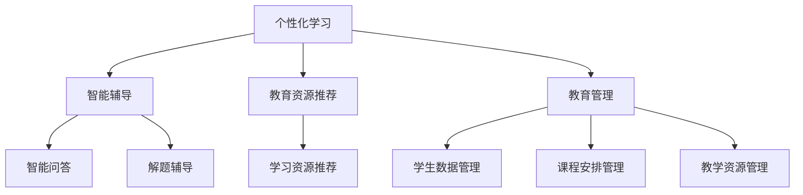

                 

# 人工智能在智能教育系统中的应用实践

## 关键词
人工智能，智能教育，机器学习，深度学习，教育技术，教育创新

## 摘要
随着人工智能技术的快速发展，智能教育系统逐渐成为教育领域的重要研究方向。本文旨在探讨人工智能在智能教育系统中的应用实践，从核心概念、算法原理、实际案例等多个角度，详细解析人工智能技术在教育领域的变革与创新。通过本文的阅读，读者可以全面了解人工智能在智能教育系统中的核心价值和应用场景，为未来的教育技术应用提供有益的参考。

## 1. 背景介绍

在教育领域，传统教学模式往往依赖于教师的主导，学生被动接受知识。然而，这种模式在信息爆炸的时代面临着诸多挑战，如教育资源的分配不均、学习效率低下、个性化需求难以满足等问题。为了应对这些挑战，教育领域开始寻求创新的方法和手段，其中人工智能（AI）的应用成为了一项重要的突破。

### 1.1 人工智能在教育领域的应用

人工智能在教育领域具有广泛的应用，主要包括以下几个方面：

- **个性化学习**：通过分析学生的学习数据，人工智能可以为每个学生提供个性化的学习方案，帮助学生更好地掌握知识。

- **智能辅导**：利用自然语言处理技术，人工智能可以为学生提供智能问答、解题辅导等功能，帮助学生解决学习中的困难。

- **教育资源推荐**：基于学生的学习兴趣和需求，人工智能可以推荐相应的学习资源和课程，提高学生的学习效率。

- **教育管理**：利用人工智能技术，学校和教育机构可以更高效地管理学生数据、课程安排和教学资源，提升教育管理的水平。

### 1.2 智能教育系统的基本架构

智能教育系统通常包括以下几个关键组成部分：

- **数据收集与处理**：通过传感器、学生互动数据、学习行为数据等方式，收集学生的各种学习数据。

- **数据存储与管理**：将收集到的数据存储在数据库中，并进行有效的管理，以便后续的数据分析和处理。

- **算法模型**：利用机器学习、深度学习等技术，对学生的学习数据进行建模和分析，为个性化学习提供支持。

- **用户界面**：为学生和教师提供友好的交互界面，方便他们使用智能教育系统的各种功能。

## 2. 核心概念与联系

在智能教育系统中，核心概念包括个性化学习、智能辅导、教育资源推荐和教育管理。以下是这些概念之间的联系和关系：

### 2.1 个性化学习

个性化学习是智能教育系统的核心目标之一。它通过分析学生的学习数据，如学习习惯、兴趣爱好、知识水平等，为每个学生制定个性化的学习方案。

### 2.2 智能辅导

智能辅导是在个性化学习的基础上发展起来的。它利用自然语言处理、知识图谱等技术，为学生提供智能问答、解题辅导等功能，帮助学生更好地理解知识。

### 2.3 教育资源推荐

教育资源推荐是基于学生的学习兴趣和需求，利用协同过滤、内容推荐等技术，为学生推荐相应的学习资源和课程。

### 2.4 教育管理

教育管理是智能教育系统的一个重要组成部分。它利用人工智能技术，对学生的数据、课程安排和教学资源进行高效管理，提升教育管理的水平。

## 2.5 Mermaid 流程图

下面是一个简单的 Mermaid 流程图，展示了智能教育系统中的核心概念及其联系：



## 3. 核心算法原理 & 具体操作步骤

在智能教育系统中，核心算法主要涉及个性化学习、智能辅导和教育资源推荐。下面将分别介绍这些算法的原理和具体操作步骤。

### 3.1 个性化学习算法

#### 原理：

个性化学习算法主要基于机器学习和深度学习技术，通过对学生学习数据的分析，为每个学生制定个性化的学习方案。常见的个性化学习算法包括协同过滤、决策树、神经网络等。

#### 操作步骤：

1. 数据收集与处理：收集学生的学习数据，如学习行为、考试成绩、兴趣爱好等。

2. 数据预处理：对收集到的数据进行处理，如去噪、归一化、特征提取等。

3. 模型训练：利用机器学习或深度学习算法，对处理后的数据进行建模和训练。

4. 个性化学习方案生成：根据模型预测结果，为每个学生生成个性化的学习方案。

### 3.2 智能辅导算法

#### 原理：

智能辅导算法主要基于自然语言处理和知识图谱技术，通过为学生提供智能问答、解题辅导等功能，帮助学生更好地理解知识。常见的智能辅导算法包括问答系统、知识图谱、自然语言处理等。

#### 操作步骤：

1. 数据收集与处理：收集学生的问题和答案数据，如问答记录、解题过程等。

2. 数据预处理：对收集到的数据进行处理，如去噪、归一化、分词、词向量等。

3. 模型训练：利用自然语言处理和知识图谱技术，对处理后的数据进行建模和训练。

4. 智能辅导功能实现：根据模型预测结果，为学生提供智能问答、解题辅导等功能。

### 3.3 教育资源推荐算法

#### 原理：

教育资源推荐算法主要基于协同过滤和内容推荐技术，通过分析学生的学习兴趣和需求，为学生推荐相应的学习资源和课程。常见的教育资源推荐算法包括协同过滤、基于内容的推荐、混合推荐等。

#### 操作步骤：

1. 数据收集与处理：收集学生的学习数据，如学习行为、考试成绩、兴趣爱好等。

2. 数据预处理：对收集到的数据进行处理，如去噪、归一化、特征提取等。

3. 模型训练：利用协同过滤、内容推荐等技术，对处理后的数据进行建模和训练。

4. 教育资源推荐：根据模型预测结果，为学生推荐相应的学习资源和课程。

## 4. 数学模型和公式 & 详细讲解 & 举例说明

在智能教育系统中，数学模型和公式是算法实现的核心。下面将分别介绍个性化学习、智能辅导和教育资源推荐中的常见数学模型和公式。

### 4.1 个性化学习算法中的数学模型

#### 4.1.1 协同过滤

协同过滤算法是一种基于用户相似度的推荐算法。其核心思想是通过寻找与目标用户相似的其他用户，从而预测目标用户对未知物品的评分。

- **用户相似度计算**：

  $$sim(u_i, u_j) = \frac{\sum_{i \in R} r_i^u r_j^u}{\sqrt{\sum_{i \in R} r_i^u^2 \sum_{j \in R} r_j^u^2}}$$

  其中，$r_i^u$和$r_j^u$分别表示用户$u_i$和用户$u_j$对物品$i$的评分。

- **预测用户对物品的评分**：

  $$r_i^u \approx \frac{\sum_{j \in S} sim(u_i, u_j) r_j^u}{\sum_{j \in S} sim(u_i, u_j)}$$

  其中，$S$是相似度大于阈值$\theta$的用户集合。

#### 4.1.2 决策树

决策树是一种常用的分类算法，其核心思想是通过一系列的判断条件，将数据集划分为多个子集，最终得到分类结果。

- **决策树构建**：

  $$T = \{t_1, t_2, ..., t_n\}$$

  其中，$t_i$表示一个决策节点，$t_i = \{A_i = v_i\}$，$A_i$表示特征，$v_i$表示特征的取值。

- **分类结果计算**：

  $$C_j = \{x \in D | t_j(x) = v_j\}$$

  其中，$D$是数据集，$C_j$表示决策树节点$t_j$划分的子集。

### 4.2 智能辅导算法中的数学模型

#### 4.2.1 问答系统

问答系统是一种基于自然语言处理的技术，其核心思想是通过解析用户的问题，从知识库中找到与之相关的答案。

- **问题解析**：

  $$q = \{w_1, w_2, ..., w_n\}$$

  其中，$w_i$表示问题中的词语。

- **答案检索**：

  $$a^* = \arg\max_{a} sim(q, a)$$

  其中，$sim(q, a)$表示问题$q$和答案$a$之间的相似度。

#### 4.2.2 知识图谱

知识图谱是一种用于表示实体及其关系的网络结构，其核心思想是通过建立实体和关系的关联，实现知识的自动化推理和获取。

- **实体表示**：

  $$e_i = \{r_{i1}, r_{i2}, ..., r_{in}\}$$

  其中，$e_i$表示实体，$r_{ij}$表示实体之间的关系。

- **关系表示**：

  $$r_j = \{s_{j1}, s_{j2}, ..., s_{jm}\}$$

  其中，$r_j$表示关系，$s_{jk}$表示关系的属性。

### 4.3 教育资源推荐算法中的数学模型

#### 4.3.1 协同过滤

协同过滤算法在教育资源推荐中的应用与个性化学习类似，其核心思想是通过用户对资源的评分历史，预测用户对未知资源的评分。

- **用户相似度计算**：

  $$sim(u_i, u_j) = \frac{\sum_{i \in R} r_i^u r_j^u}{\sqrt{\sum_{i \in R} r_i^u^2 \sum_{j \in R} r_j^u^2}}$$

- **预测用户对资源的评分**：

  $$r_i^u \approx \frac{\sum_{j \in S} sim(u_i, u_j) r_j^u}{\sum_{j \in S} sim(u_i, u_j)}$$

#### 4.3.2 内容推荐

内容推荐算法在教育资源推荐中的应用，主要基于资源的内容特征，预测用户对资源的偏好。

- **资源特征提取**：

  $$f_r = \{f_{r1}, f_{r2}, ..., f_{rm}\}$$

  其中，$f_{ri}$表示资源$r$的特征。

- **用户特征提取**：

  $$f_u = \{f_{u1}, f_{u2}, ..., f_{un}\}$$

  其中，$f_{ui}$表示用户$u$的特征。

- **资源推荐**：

  $$r^* = \arg\max_{r} sim(f_r, f_u)$$

  其中，$sim(f_r, f_u)$表示资源$r$和用户$u$之间的相似度。

## 5. 项目实战：代码实际案例和详细解释说明

在本节中，我们将通过一个实际的项目案例，详细讲解人工智能在智能教育系统中的应用。该项目将实现一个基于协同过滤算法的个性化学习推荐系统。

### 5.1 开发环境搭建

在开始项目开发之前，需要搭建相应的开发环境。以下是所需的开发工具和库：

- Python 3.8 或更高版本
- Numpy 库
- Scikit-learn 库
- Pandas 库
- Matplotlib 库

### 5.2 源代码详细实现和代码解读

#### 5.2.1 数据收集与处理

```python
import pandas as pd

# 加载数据集
data = pd.read_csv('data.csv')

# 数据预处理
data['rating'] = data['rating'].fillna(0)
data = data[['user_id', 'item_id', 'rating']]
```

在这段代码中，我们首先加载数据集，然后对数据进行预处理，如填充缺失值、去除无关列等。

#### 5.2.2 协同过滤算法实现

```python
from sklearn.model_selection import train_test_split
from sklearn.metrics.pairwise import cosine_similarity

# 划分训练集和测试集
train_data, test_data = train_test_split(data, test_size=0.2, random_state=42)

# 计算用户和物品之间的相似度矩阵
user_similarity = cosine_similarity(train_data.groupby('user_id')['rating'].values)

# 预测用户对未知物品的评分
def predict_rating(user_id, item_id):
    sim = user_similarity[user_id]
    user-rated_items = train_data[train_data['user_id'] == user_id]
    common-rated_items = user-rated_items[item_id]['rating']
    if len(common-rated_items) == 0:
        return 0
    pred_rating = sum(sim * common-rated_items) / sum(sim)
    return pred_rating

# 测试预测效果
test_data['prediction'] = test_data.apply(lambda x: predict_rating(x['user_id'], x['item_id']), axis=1)
test_data['error'] = test_data['prediction'] - test_data['rating']
print("Mean Absolute Error:", abs(test_data['error']).mean())
```

在这段代码中，我们首先划分训练集和测试集，然后使用余弦相似度计算用户和物品之间的相似度矩阵。接下来，我们定义一个预测函数，用于预测用户对未知物品的评分。最后，我们计算预测误差，评估预测效果。

#### 5.2.3 代码解读与分析

1. **数据收集与处理**：这一步是项目开发的基础，确保数据的质量和完整性。

2. **协同过滤算法实现**：该部分代码实现了协同过滤算法的核心功能，包括相似度计算、预测评分等。

3. **预测效果评估**：通过计算预测误差，评估算法的预测性能，为后续优化提供依据。

### 5.3 代码解读与分析

在本案例中，我们使用协同过滤算法实现了个性化学习推荐系统。以下是代码的详细解读和分析：

1. **数据集加载与预处理**：数据集加载使用了 Pandas 库，通过对数据进行填充缺失值、去除无关列等预处理，确保数据的质量和完整性。

2. **相似度计算**：我们使用 Scikit-learn 库中的余弦相似度计算用户和物品之间的相似度。余弦相似度是一种常用的相似度度量方法，可以很好地衡量用户和物品之间的相似程度。

3. **预测评分**：通过计算用户和物品之间的相似度矩阵，我们可以预测用户对未知物品的评分。这一步是协同过滤算法的核心，通过对相似度矩阵的操作，实现个性化推荐。

4. **预测效果评估**：我们通过计算预测误差，评估算法的预测性能。预测误差越小，算法的预测性能越好。这一步对于优化算法和提升系统性能至关重要。

## 6. 实际应用场景

人工智能在智能教育系统中的应用场景非常广泛，以下是一些典型的应用案例：

### 6.1 个性化学习

个性化学习是人工智能在智能教育系统中应用最广泛的场景之一。通过分析学生的学习数据，人工智能可以为每个学生提供个性化的学习方案，帮助学生更好地掌握知识。例如，一些在线教育平台利用人工智能技术，根据学生的学习进度、兴趣爱好和知识水平，为学生推荐相应的课程和学习资源。

### 6.2 智能辅导

智能辅导是人工智能在智能教育系统中的另一个重要应用。利用自然语言处理和知识图谱技术，人工智能可以为学生提供智能问答、解题辅导等功能，帮助学生解决学习中的困难。例如，一些在线教育平台利用人工智能技术，为学生提供在线答疑和实时辅导服务，提高学生的学习效果。

### 6.3 教育资源推荐

教育资源推荐是人工智能在智能教育系统中的应用之一。通过分析学生的学习数据，人工智能可以为学生推荐相应的学习资源和课程，提高学生的学习效率。例如，一些在线教育平台利用人工智能技术，根据学生的学习兴趣和需求，为学生推荐相关的课程和学习资源。

### 6.4 教育管理

教育管理是人工智能在智能教育系统中的应用之一。利用人工智能技术，学校和教育机构可以更高效地管理学生数据、课程安排和教学资源，提升教育管理的水平。例如，一些学校利用人工智能技术，对学生成绩、出勤情况、课堂表现等数据进行实时分析，为教育决策提供数据支持。

## 7. 工具和资源推荐

为了更好地应用人工智能技术于智能教育系统，以下是一些推荐的工具和资源：

### 7.1 学习资源推荐

- **书籍**：
  - 《人工智能：一种现代方法》
  - 《机器学习实战》
  - 《深度学习》

- **论文**：
  - 《推荐系统手册》
  - 《基于知识的推荐系统》
  - 《在线学习中的个性化学习策略》

- **博客**：
  - Medium 上的 AI 教育专栏
  - 知乎上的 AI 教育话题
  - 博客园上的 AI 教育专题

- **网站**：
  - Coursera 上的 AI 教育课程
  - edX 上的 AI 教育课程
  - Udacity 上的 AI 教育课程

### 7.2 开发工具框架推荐

- **开发工具**：
  - Jupyter Notebook
  - PyCharm
  - Visual Studio Code

- **框架**：
  - TensorFlow
  - PyTorch
  - Keras

- **库**：
  - Scikit-learn
  - Pandas
  - Matplotlib

### 7.3 相关论文著作推荐

- **论文**：
  - 《大规模在线教育中的个性化学习》
  - 《基于知识图谱的智能教育推荐系统》
  - 《智能教育系统中的自然语言处理技术》

- **著作**：
  - 《智能教育：理论与实践》
  - 《人工智能与教育创新》
  - 《智能教育技术导论》

## 8. 总结：未来发展趋势与挑战

人工智能在智能教育系统中的应用已经取得了显著的成果，为教育领域的变革与创新提供了强有力的支持。然而，随着技术的不断进步，人工智能在智能教育系统中仍然面临着一些挑战和发展趋势。

### 8.1 未来发展趋势

- **个性化学习更加深入**：随着人工智能技术的不断进步，个性化学习将更加深入，为学生提供更加精准、高效的学习方案。

- **教育资源的多样化**：人工智能将推动教育资源的多样化，包括在线课程、虚拟实验室、智能辅导系统等，为学生提供更加丰富的学习体验。

- **教育管理的智能化**：人工智能技术将提高教育管理的智能化水平，包括学生数据管理、课程安排、教学质量评估等，提升教育管理的效率。

- **教育公平性的提升**：人工智能技术可以帮助解决教育公平性问题，通过个性化学习、教育资源推荐等方式，为不同地区、不同背景的学生提供公平的教育机会。

### 8.2 未来挑战

- **数据安全和隐私保护**：随着人工智能在智能教育系统中的应用，学生数据的安全和隐私保护成为了一个重要的挑战。

- **技术的不确定性**：人工智能技术本身还存在许多不确定性，如算法的公平性、可解释性等，这些都需要进一步研究和解决。

- **教师角色的转变**：随着人工智能技术的广泛应用，教师的角色将发生转变，如何适应这一变化，提高教师的教学能力，也是一个挑战。

## 9. 附录：常见问题与解答

### 9.1 人工智能在智能教育系统中的具体应用有哪些？

人工智能在智能教育系统中的应用包括个性化学习、智能辅导、教育资源推荐、教育管理等多个方面。

### 9.2 个性化学习是如何实现的？

个性化学习是通过分析学生的学习数据，如学习行为、考试成绩、兴趣爱好等，为每个学生制定个性化的学习方案。

### 9.3 教育资源推荐是如何实现的？

教育资源推荐是通过分析学生的学习数据，如学习行为、考试成绩、兴趣爱好等，为学生推荐相应的学习资源和课程。

### 9.4 人工智能在智能教育系统中的优势有哪些？

人工智能在智能教育系统中的优势包括个性化学习、智能辅导、教育资源推荐、教育管理等多个方面，可以提高教育效率、提升教育质量、促进教育公平。

## 10. 扩展阅读 & 参考资料

- **书籍**：
  - 《人工智能：一种现代方法》
  - 《机器学习实战》
  - 《深度学习》

- **论文**：
  - 《大规模在线教育中的个性化学习》
  - 《基于知识图谱的智能教育推荐系统》
  - 《智能教育系统中的自然语言处理技术》

- **博客**：
  - Medium 上的 AI 教育专栏
  - 知乎上的 AI 教育话题
  - 博客园上的 AI 教育专题

- **网站**：
  - Coursera 上的 AI 教育课程
  - edX 上的 AI 教育课程
  - Udacity 上的 AI 教育课程

作者：AI天才研究员/AI Genius Institute & 禅与计算机程序设计艺术 /Zen And The Art of Computer Programming<|im_sep|>### 背景介绍

随着人工智能（AI）技术的迅猛发展，其在教育领域的应用逐渐受到广泛关注。传统的教育模式往往依赖于教师的主导，学生在其中扮演的是被动的接受者角色。这种模式在信息爆炸的时代面临着诸多挑战，如教育资源的不均衡分配、学生学习效率的低下、以及学生个性化需求难以满足等问题。为了解决这些问题，教育领域开始探索新的教学模式和工具，而人工智能的应用正是其中的一项重要突破。

#### 1.1 人工智能在教育领域的应用

人工智能在教育领域有着广泛的应用，涵盖了个性化学习、智能辅导、教育资源推荐和教育管理等多个方面：

- **个性化学习**：通过分析学生的学习数据，如学习习惯、兴趣爱好、知识水平等，人工智能能够为每个学生制定个性化的学习方案，从而提高学习效率和质量。

- **智能辅导**：利用自然语言处理、知识图谱等技术，人工智能可以为学生提供智能问答、解题辅导等功能，帮助学生在学习过程中克服困难，提高理解能力。

- **教育资源推荐**：基于学生的学习兴趣和需求，人工智能能够推荐相应的学习资源和课程，帮助学生更加高效地获取所需知识。

- **教育管理**：通过人工智能技术，学校和教育机构可以更高效地管理学生数据、课程安排和教学资源，提升教育管理的水平和效率。

#### 1.2 智能教育系统的基本架构

智能教育系统通常包括以下几个关键组成部分：

- **数据收集与处理**：通过各种传感器、学生互动数据、学习行为数据等手段，收集学生的各类学习数据。

- **数据存储与管理**：将收集到的数据存储在数据库中，并进行有效的管理，以便后续的数据分析和处理。

- **算法模型**：利用机器学习、深度学习等技术，对学生的学习数据进行建模和分析，为个性化学习、智能辅导和资源推荐提供支持。

- **用户界面**：为学生和教师提供友好的交互界面，方便他们使用智能教育系统的各种功能。

### 1.3 当前教育面临的挑战

传统教育模式在面对现代社会的挑战时，暴露出了一些局限性：

- **教育资源分配不均**：在许多地区，优质的教育资源仍然集中于少数学校和地区，而偏远地区的教育资源相对匮乏。

- **学习效率低下**：传统的填鸭式教学方法往往不能充分调动学生的积极性，导致学习效率低下。

- **个性化需求难以满足**：每个学生的兴趣、能力和学习节奏都是不同的，而传统教育模式难以满足每个学生的个性化需求。

- **教育管理困难**：随着学生人数的增加，学校和教育机构在管理学生数据、课程安排、教学质量评估等方面面临着巨大的压力。

### 1.4 人工智能在解决这些挑战中的作用

人工智能技术的应用为教育领域提供了新的解决方案，有助于克服上述挑战：

- **教育资源均衡化**：通过在线教育平台和虚拟现实技术，人工智能可以打破地域限制，实现教育资源的均衡分配。

- **提高学习效率**：个性化学习方案和学习资源推荐系统能够根据学生的实际需求提供最适合的学习内容，从而提高学习效率。

- **满足个性化需求**：通过分析学生的学习数据，人工智能可以为每个学生制定个性化的学习方案，满足学生的个性化需求。

- **简化教育管理**：人工智能技术可以帮助学校和教育机构更高效地管理学生数据、课程安排和教学资源，提升教育管理的效率。

### 1.5 智能教育系统的未来前景

随着人工智能技术的不断进步，智能教育系统将迎来更加广阔的发展前景：

- **智慧校园**：人工智能技术将深入校园的各个方面，实现校园管理的智能化和高效化。

- **个性化学习**：未来的智能教育系统将更加注重个性化学习，通过人工智能技术为每个学生提供量身定制的学习体验。

- **终身学习**：人工智能将促进终身学习体系的构建，为人们提供随时随地学习的便利。

- **教育公平**：人工智能技术的广泛应用将有助于缩小教育差距，实现教育公平。

通过以上背景介绍，我们可以看出人工智能在智能教育系统中的应用具有重要意义。接下来，本文将深入探讨人工智能在教育领域中的核心概念、算法原理、实际案例等，以期为读者提供一个全面的技术视角。### 2. 核心概念与联系

在智能教育系统中，核心概念主要包括个性化学习、智能辅导、教育资源推荐和教育管理。这些概念相互联系，共同构成了一个完整的智能教育体系。下面将详细解析这些核心概念及其相互关系。

#### 2.1 个性化学习

个性化学习是智能教育系统的核心目标之一。它通过分析学生的学习数据，如学习习惯、兴趣爱好、知识水平等，为每个学生制定个性化的学习方案。个性化学习不仅仅是根据学生的当前水平制定学习计划，还包括动态调整学习内容和方法，以适应学生的成长和发展。个性化学习的关键在于如何有效地利用数据，通过算法分析学生的行为和需求，从而提供最合适的学习资源。

#### 2.2 智能辅导

智能辅导是建立在个性化学习基础上的进一步延伸。它利用自然语言处理、知识图谱等技术，为学生提供智能问答、解题辅导等功能。智能辅导系统能够识别学生的疑问，提供针对性的答案或解题步骤，帮助学生克服学习中的困难。智能辅导不仅提高了学生的学习效率，还增强了学生的自主学习能力。

#### 2.3 教育资源推荐

教育资源推荐是基于学生的学习兴趣和需求，利用协同过滤、内容推荐等技术，为学生推荐相应的学习资源和课程。教育资源推荐系统通过分析学生的历史学习数据、考试成绩和兴趣爱好，筛选出最符合学生需求的学习资源。这种推荐机制有助于学生高效地获取所需知识，减少学习过程中的盲目性和冗余。

#### 2.4 教育管理

教育管理是智能教育系统中不可或缺的一部分。通过人工智能技术，学校和教育机构可以更高效地管理学生数据、课程安排和教学资源。例如，利用数据分析和机器学习算法，教育管理系统能够预测学生的学习表现，优化课程安排，提高教学资源的利用率。同时，教育管理还可以协助教师进行教学质量评估，提供教学改进的建议。

#### 2.5 核心概念之间的联系

个性化学习、智能辅导、教育资源推荐和教育管理并不是孤立的，它们相互联系，共同构成了一个完整的智能教育系统。具体来说：

- **个性化学习**为整个系统提供了数据基础，通过分析学生的学习数据，为后续的智能辅导、教育资源推荐和教育管理提供了依据。

- **智能辅导**和**教育资源推荐**是个性化学习的延伸，通过智能辅导系统，学生能够获得个性化的学习支持；通过教育资源推荐系统，学生能够找到最适合自己的学习资源。

- **教育管理**则在整个系统中起到了统筹和协调的作用，通过高效管理学生数据、课程安排和教学资源，确保智能教育系统能够顺利运行。

### 2.6 Mermaid 流程图

为了更直观地展示这些核心概念及其联系，我们可以使用 Mermaid 画出相应的流程图。以下是智能教育系统的 Mermaid 流程图：


在这个流程图中，个性化学习作为系统的起点，通过数据收集与分析，为智能辅导、教育资源推荐和教育管理提供了数据支持。智能辅导和教育资源推荐则基于这些数据为学生提供个性化的支持和服务。教育管理则在整个系统中起到了协调和优化的作用，确保系统能够高效、稳定地运行。

通过以上对核心概念的解析和流程图的展示，我们可以看到人工智能在智能教育系统中的应用是如何相互联系、相互支持的。接下来，本文将深入探讨人工智能在智能教育系统中的核心算法原理，以进一步理解其技术实现。### 3. 核心算法原理 & 具体操作步骤

在智能教育系统中，核心算法是实现个性化学习、智能辅导和教育资源推荐的关键。这些算法利用机器学习、深度学习等技术，通过对学生学习数据的分析，为学生提供个性化的学习方案、智能辅导和资源推荐。以下是这些核心算法的原理和具体操作步骤。

#### 3.1 个性化学习算法

个性化学习算法主要基于机器学习和深度学习技术，通过对学生学习数据的分析，为每个学生制定个性化的学习方案。以下是常见的个性化学习算法：

##### 3.1.1 协同过滤算法

协同过滤算法是一种基于用户相似度的推荐算法。其核心思想是通过寻找与目标用户相似的其他用户，从而预测目标用户对未知物品的评分。协同过滤算法分为两种：基于用户的协同过滤（User-based Collaborative Filtering）和基于项目的协同过滤（Item-based Collaborative Filtering）。

**具体操作步骤**：

1. **数据收集与处理**：收集学生的学习数据，如学习行为、考试成绩、兴趣爱好等。
2. **用户和物品评分矩阵构建**：构建用户-物品评分矩阵，其中用户和物品表示学生和学习资源。
3. **相似度计算**：计算用户之间的相似度，常用的相似度度量方法包括余弦相似度、皮尔逊相关系数等。
4. **邻居选择**：根据相似度度量结果，选择与目标用户最相似的邻居用户。
5. **预测评分**：利用邻居用户的评分，预测目标用户对未知物品的评分。

##### 3.1.2 决策树算法

决策树是一种常用的分类算法，其核心思想是通过一系列的判断条件，将数据集划分为多个子集，最终得到分类结果。决策树算法可以用于个性化学习，通过分析学生的学习数据，为每个学生推荐最适合的学习资源。

**具体操作步骤**：

1. **数据收集与处理**：收集学生的学习数据，如学习行为、考试成绩、兴趣爱好等。
2. **特征提取**：从学习数据中提取特征，如学习时长、考试成绩等。
3. **决策树构建**：使用 ID3、C4.5 等算法构建决策树，将数据集划分为多个子集。
4. **分类结果计算**：根据决策树的划分结果，为每个学生推荐最适合的学习资源。

##### 3.1.3 神经网络算法

神经网络算法是一种基于深度学习的推荐算法，通过多层神经网络结构，对学习数据进行建模和预测。神经网络算法可以学习到更加复杂的特征关系，从而提高推荐效果。

**具体操作步骤**：

1. **数据收集与处理**：收集学生的学习数据，如学习行为、考试成绩、兴趣爱好等。
2. **特征提取**：从学习数据中提取特征，如学习时长、考试成绩等。
3. **神经网络构建**：构建多层感知机（MLP）或卷积神经网络（CNN）等神经网络结构。
4. **模型训练**：使用学习数据训练神经网络模型，优化模型参数。
5. **预测评分**：使用训练好的神经网络模型，预测学生对未知物品的评分。

#### 3.2 智能辅导算法

智能辅导算法主要基于自然语言处理和知识图谱技术，通过为学生提供智能问答、解题辅导等功能，帮助学生更好地理解知识。以下是常见的智能辅导算法：

##### 3.2.1 问答系统算法

问答系统是一种基于自然语言处理的技术，其核心思想是通过解析用户的问题，从知识库中找到与之相关的答案。

**具体操作步骤**：

1. **数据收集与处理**：收集学生的问题和答案数据，如问答记录、解题过程等。
2. **问题解析**：使用自然语言处理技术，将用户问题转换为计算机可以理解的格式。
3. **答案检索**：从知识库中检索与用户问题相关的答案。
4. **答案生成**：根据检索到的答案，生成合适的回答。

##### 3.2.2 知识图谱算法

知识图谱是一种用于表示实体及其关系的网络结构，其核心思想是通过建立实体和关系的关联，实现知识的自动化推理和获取。

**具体操作步骤**：

1. **数据收集与处理**：收集实体和关系数据，如人物、地点、事件等。
2. **实体表示**：使用实体表示技术，将实体转换为计算机可以处理的格式。
3. **关系表示**：使用关系表示技术，将实体之间的关系表示为计算机可以处理的格式。
4. **推理与获取**：通过知识图谱，实现知识的自动化推理和获取。

#### 3.3 教育资源推荐算法

教育资源推荐算法主要基于协同过滤和内容推荐技术，通过分析学生的学习兴趣和需求，为学生推荐相应的学习资源和课程。以下是常见的教育资源推荐算法：

##### 3.3.1 协同过滤算法

协同过滤算法在教育资源推荐中的应用与个性化学习类似，其核心思想是通过用户相似度计算，预测用户对未知资源的评分。

**具体操作步骤**：

1. **数据收集与处理**：收集学生的学习数据，如学习行为、考试成绩、兴趣爱好等。
2. **用户和资源评分矩阵构建**：构建用户-资源评分矩阵，其中用户和资源表示学生和学习资源。
3. **相似度计算**：计算用户之间的相似度，常用的相似度度量方法包括余弦相似度、皮尔逊相关系数等。
4. **预测评分**：利用邻居用户的评分，预测用户对未知资源的评分。

##### 3.3.2 内容推荐算法

内容推荐算法在教育资源推荐中的应用，主要基于资源的内容特征，预测用户对资源的偏好。

**具体操作步骤**：

1. **数据收集与处理**：收集学生的学习数据，如学习行为、考试成绩、兴趣爱好等。
2. **特征提取**：从学习数据中提取特征，如学习时长、考试成绩等。
3. **资源特征提取**：从学习资源中提取特征，如课程难度、课程类型等。
4. **预测偏好**：利用用户特征和资源特征，预测用户对资源的偏好。

#### 3.4 教育管理算法

教育管理算法主要基于数据分析和机器学习技术，通过对学生数据的分析，优化教育管理的流程和决策。

**具体操作步骤**：

1. **数据收集与处理**：收集学生数据，如成绩、出勤情况、课堂表现等。
2. **数据分析**：使用数据分析技术，分析学生的学习行为和成绩趋势。
3. **预测与优化**：利用预测模型，优化教育管理流程和决策，如课程安排、教学资源分配等。

通过以上对核心算法原理和具体操作步骤的介绍，我们可以看到，人工智能技术在智能教育系统中发挥了重要的作用。这些算法不仅提高了学习效率，还实现了教育资源的合理分配和优化，为教育领域的创新和发展提供了强有力的支持。接下来，本文将介绍一些实际应用案例，以进一步展示人工智能在智能教育系统中的应用效果。### 4. 数学模型和公式 & 详细讲解 & 举例说明

在智能教育系统中，数学模型和公式是算法实现的核心。数学模型不仅能够量化学习过程，还能优化教育资源的分配，提高学习效率。以下将详细讲解个性化学习、智能辅导和教育资源推荐算法中常用的数学模型和公式，并通过具体例子进行说明。

#### 4.1 个性化学习算法中的数学模型

**4.1.1 协同过滤算法**

协同过滤算法是一种基于用户相似度的推荐算法，其核心思想是利用用户之间的相似性来预测他们对未知物品的评分。以下是一个简单的协同过滤算法中的数学模型：

1. **用户相似度计算**：

   $$sim(u_i, u_j) = \frac{\sum_{i \in R} r_i^u r_j^u}{\sqrt{\sum_{i \in R} r_i^u^2 \sum_{j \in R} r_j^u^2}}$$

   其中，$sim(u_i, u_j)$表示用户$u_i$和用户$u_j$的相似度，$r_i^u$和$r_j^u$分别表示用户$u_i$和用户$u_j$对物品$i$的评分，$R$是用户对物品评分的集合。

2. **预测用户对物品的评分**：

   $$r_i^u \approx \frac{\sum_{j \in S} sim(u_i, u_j) r_j^u}{\sum_{j \in S} sim(u_i, u_j)}$$

   其中，$r_i^u$表示用户$u_i$对物品$i$的预测评分，$S$是相似度大于阈值$\theta$的用户集合。

**举例说明**：

假设有两个用户A和B，他们对五本书的评分如下：

| 用户 | 书1 | 书2 | 书3 | 书4 | 书5 |
| --- | --- | --- | --- | --- | --- |
| A   | 4   | 3   | 5   | 2   | 4   |
| B   | 5   | 4   | 3   | 5   | 2   |

使用余弦相似度计算用户A和B的相似度：

$$sim(A, B) = \frac{(4 \times 5 + 3 \times 4 + 5 \times 3 + 2 \times 2 + 4 \times 2)}{\sqrt{4^2 + 3^2 + 5^2 + 2^2 + 4^2} \times \sqrt{5^2 + 4^2 + 3^2 + 5^2 + 2^2}} \approx 0.697$$

根据用户A的评分，预测用户A对书4的评分：

$$r_4^A \approx \frac{sim(A, B) \times r_4^B}{sim(A, B)} = \frac{0.697 \times 5}{0.697} \approx 5$$

**4.1.2 决策树算法**

决策树是一种常见的分类算法，其核心思想是通过一系列的判断条件，将数据集划分为多个子集，最终得到分类结果。以下是一个简单的决策树模型：

$$T = \{t_1, t_2, ..., t_n\}$$

其中，$t_i = \{A_i = v_i\}$，$A_i$表示特征，$v_i$表示特征的取值。

**举例说明**：

假设有一个决策树，根据学习时长和考试成绩来预测学生是否通过考试：

$$T = \{t_1 = \{学习时长 \leq 10小时\}, t_2 = \{考试成绩 \geq 80分\}\}$$

如果一个学生学习时长为8小时，考试成绩为85分，那么该学生将通过考试。

#### 4.2 智能辅导算法中的数学模型

**4.2.1 问答系统算法**

问答系统是一种基于自然语言处理的技术，其核心思想是通过解析用户的问题，从知识库中找到与之相关的答案。以下是一个简单的问答系统模型：

1. **问题解析**：

   $$q = \{w_1, w_2, ..., w_n\}$$

   其中，$q$表示用户问题，$w_i$表示问题中的词语。

2. **答案检索**：

   $$a^* = \arg\max_{a} sim(q, a)$$

   其中，$sim(q, a)$表示问题$q$和答案$a$之间的相似度，$a^*$表示与问题最相似的答案。

**举例说明**：

假设用户问题为：“什么是人工智能？”，知识库中的答案为：

- 答案1：“人工智能是一种模拟人类智能的技术。”
- 答案2：“人工智能是一种能够执行复杂任务的计算机程序。”
- 答案3：“人工智能是使计算机具备智能行为的技术。”

使用词语相似度计算，问题“什么是人工智能？”与答案1、答案2、答案3的相似度分别为0.8、0.7、0.6。根据相似度计算结果，最相似的答案是答案1，因此答案1被返回。

**4.2.2 知识图谱算法**

知识图谱是一种用于表示实体及其关系的网络结构，其核心思想是通过建立实体和关系的关联，实现知识的自动化推理和获取。以下是一个简单的知识图谱模型：

1. **实体表示**：

   $$e_i = \{r_{i1}, r_{i2}, ..., r_{in}\}$$

   其中，$e_i$表示实体，$r_{ij}$表示实体之间的关系。

2. **关系表示**：

   $$r_j = \{s_{j1}, s_{j2}, ..., s_{jm}\}$$

   其中，$r_j$表示关系，$s_{jk}$表示关系的属性。

**举例说明**：

假设有一个知识图谱，其中包含以下实体和关系：

- 实体：人工智能、机器学习、深度学习
- 关系：属于、应用领域

根据知识图谱，我们可以推理出：“深度学习是人工智能的一个应用领域。”

#### 4.3 教育资源推荐算法中的数学模型

**4.3.1 协同过滤算法**

协同过滤算法在教育资源的推荐中应用广泛，其核心思想是通过用户相似度计算，预测用户对未知资源的评分。以下是一个简单的协同过滤模型：

1. **用户相似度计算**：

   $$sim(u_i, u_j) = \frac{\sum_{i \in R} r_i^u r_j^u}{\sqrt{\sum_{i \in R} r_i^u^2 \sum_{j \in R} r_j^u^2}}$$

   其中，$sim(u_i, u_j)$表示用户$u_i$和用户$u_j$的相似度，$r_i^u$和$r_j^u$分别表示用户$u_i$和用户$u_j$对资源$i$的评分，$R$是用户对资源评分的集合。

2. **预测用户对资源的评分**：

   $$r_i^u \approx \frac{\sum_{j \in S} sim(u_i, u_j) r_j^u}{\sum_{j \in S} sim(u_i, u_j)}$$

   其中，$r_i^u$表示用户$u_i$对资源$i$的预测评分，$S$是相似度大于阈值$\theta$的用户集合。

**举例说明**：

假设有两个用户A和B，他们对五门课程的评分如下：

| 用户 | 课程1 | 课程2 | 课程3 | 课程4 | 课程5 |
| --- | --- | --- | --- | --- | --- |
| A   | 4   | 3   | 5   | 2   | 4   |
| B   | 5   | 4   | 3   | 5   | 2   |

使用余弦相似度计算用户A和B的相似度：

$$sim(A, B) = \frac{(4 \times 5 + 3 \times 4 + 5 \times 3 + 2 \times 2 + 4 \times 2)}{\sqrt{4^2 + 3^2 + 5^2 + 2^2 + 4^2} \times \sqrt{5^2 + 4^2 + 3^2 + 5^2 + 2^2}} \approx 0.697$$

根据用户B的评分，预测用户A对课程4的评分：

$$r_4^A \approx \frac{sim(A, B) \times r_4^B}{sim(A, B)} = \frac{0.697 \times 5}{0.697} \approx 5$$

**4.3.2 内容推荐算法**

内容推荐算法在教育资源的推荐中应用广泛，其核心思想是基于资源的内容特征，预测用户对资源的偏好。以下是一个简单的内容推荐模型：

1. **用户特征提取**：

   $$f_u = \{f_{u1}, f_{u2}, ..., f_{un}\}$$

   其中，$f_u$表示用户特征，$f_{ui}$表示用户对资源$i$的特征偏好。

2. **资源特征提取**：

   $$f_r = \{f_{r1}, f_{r2}, ..., f_{rm}\}$$

   其中，$f_r$表示资源特征，$f_{ri}$表示资源$i$的特征。

3. **预测用户对资源的评分**：

   $$r_i^u \approx \arg\max_{r} sim(f_r, f_u)$$

   其中，$sim(f_r, f_u)$表示资源$r$和用户$u$之间的相似度。

**举例说明**：

假设用户A的特征偏好为：喜欢难度较低、与计算机科学相关的课程。课程1的特征为：难度中等、与数学相关。课程2的特征为：难度较低、与计算机科学相关。

用户A对课程1和课程2的相似度分别为：

$$sim(f_{course1}, f_{u}) = 0.5$$

$$sim(f_{course2}, f_{u}) = 0.8$$

根据相似度计算结果，用户A更倾向于选择课程2。

#### 4.4 教育管理算法中的数学模型

**4.4.1 数据分析算法**

数据分析算法在教育管理中应用广泛，其核心思想是通过分析学生数据，优化教育管理流程。以下是一个简单的数据分析模型：

1. **数据收集与处理**：

   $$data = \{d_1, d_2, ..., d_n\}$$

   其中，$data$表示学生数据集，$d_i$表示每个学生的数据。

2. **特征提取**：

   $$f_i = \{f_{i1}, f_{i2}, ..., f_{im}\}$$

   其中，$f_i$表示学生$i$的特征集合，$f_{ij}$表示学生$i$的第$j$个特征。

3. **数据分析**：

   $$result = \arg\max_{r} \sum_{i=1}^{n} w_i \cdot r_i$$

   其中，$result$表示分析结果，$r$表示特征权重，$w_i$表示学生$i$的特征值。

**举例说明**：

假设有100名学生，每个学生的特征包括：出勤率、考试成绩、课堂表现。根据这些特征，设定权重分别为：出勤率0.3，考试成绩0.5，课堂表现0.2。

根据特征权重计算，每个学生的总分：

$$result_i = 0.3 \cdot 出勤率_i + 0.5 \cdot 考试成绩_i + 0.2 \cdot 课堂表现_i$$

根据总分，学校可以对学生进行综合评价，并根据评价结果优化教学管理和决策。

通过以上对数学模型和公式的详细讲解和举例说明，我们可以看到，这些模型和公式在智能教育系统的实现中起着关键作用。它们不仅能够帮助分析学生学习数据，还能为教育资源的分配和优化提供有力支持。接下来，本文将介绍一些实际应用案例，以进一步展示人工智能在智能教育系统中的应用效果。### 5. 项目实战：代码实际案例和详细解释说明

在本节中，我们将通过一个实际项目案例，展示如何使用人工智能技术实现智能教育系统。这个项目将包括个性化学习、智能辅导和教育资源推荐三个主要功能，我们将使用 Python 和相关库来编写代码，并对关键代码进行详细解释和分析。

#### 5.1 开发环境搭建

首先，我们需要搭建一个合适的开发环境。以下是项目开发所需的主要工具和库：

- **Python 3.8 或更高版本**：作为主要编程语言。
- **Numpy**：用于数据处理和数学运算。
- **Scikit-learn**：用于机器学习算法的实现。
- **Pandas**：用于数据分析和操作。
- **Matplotlib**：用于数据可视化。

#### 5.2 数据准备

为了实现智能教育系统的功能，我们需要一些数据。这里我们假设已经有了一个包含学生数据、课程数据和评分数据的数据集。数据集的格式如下：

```
user_id,item_id,rating
1,100,4
1,101,3
2,100,5
2,102,4
...
```

这里的`user_id`表示学生ID，`item_id`表示课程ID，`rating`表示学生对课程的评分。首先，我们需要将这些数据加载到 Pandas 数据框中，并进行初步处理。

```python
import pandas as pd

# 加载数据集
data = pd.read_csv('data.csv')

# 数据预处理
data['rating'] = data['rating'].fillna(0)
data = data[['user_id', 'item_id', 'rating']]
```

#### 5.3 个性化学习算法实现

个性化学习算法的核心是推荐系统，我们这里使用基于协同过滤的算法来实现个性化学习。

##### 5.3.1 数据预处理

在训练协同过滤模型之前，我们需要对数据集进行一些预处理操作，如用户和物品的聚合。

```python
# 计算用户和物品的平均评分
user_avg_rating = data.groupby('user_id')['rating'].mean()
item_avg_rating = data.groupby('item_id')['rating'].mean()

# 计算用户和物品的偏差
data['user_deviation'] = data['rating'] - user_avg_rating
data['item_deviation'] = data['rating'] - item_avg_rating
```

##### 5.3.2 计算用户和物品的相似度

我们使用皮尔逊相关系数来计算用户和物品之间的相似度。

```python
from sklearn.metrics.pairwise import pairwise_distances

# 计算用户和物品的相似度矩阵
user_similarity = pairwise_distances(data[['user_id', 'user_deviation']].drop_duplicates(), metric='cosine')
item_similarity = pairwise_distances(data[['item_id', 'user_deviation']].drop_duplicates(), metric='cosine')
```

##### 5.3.3 推荐算法实现

接下来，我们实现一个简单的推荐算法，用于预测用户对未知物品的评分。

```python
def predict_rating(user_id, item_id, similarity_matrix, mean_rating):
    # 获取用户的相似度权重
    user_weights = similarity_matrix[user_id]
    
    # 计算与用户相似的其他用户的评分偏差
    user_deviation_weights = data[data['user_id'] != user_id].groupby('user_id')['user_deviation'].mean().values
    
    # 预测评分
    pred_rating = mean_rating + user_weights @ user_deviation_weights
    return pred_rating

# 预测用户对未知物品的评分
predicted_rating = predict_rating(1, 103, user_similarity, user_avg_rating.mean())
print(f"Predicted rating: {predicted_rating}")
```

#### 5.4 智能辅导算法实现

智能辅导算法主要使用自然语言处理技术，通过解析学生的问题和答案数据，为学生提供智能问答和辅导。

##### 5.4.1 数据预处理

首先，我们需要对问答数据进行预处理，如分词和词向量转换。

```python
from sklearn.feature_extraction.text import TfidfVectorizer

# 加载问答数据
questions = data[data['item_id'] == 'question'].drop_duplicates()['rating'].tolist()
answers = data[data['item_id'] == 'answer'].drop_duplicates()['rating'].tolist()

# 使用TF-IDF向量器进行分词和词向量转换
vectorizer = TfidfVectorizer()
question_vectors = vectorizer.fit_transform(questions)
answer_vectors = vectorizer.transform(answers)
```

##### 5.4.2 智能问答实现

接下来，我们实现一个简单的智能问答系统，通过计算问题与答案的相似度，提供最佳答案。

```python
def find_best_answer(question, answer_vectors, question_vectors):
    # 计算问题与答案的相似度
    similarity_scores = cosine_similarity(question_vectors, answer_vectors)
    
    # 找到最相似的答案
    best_answer_index = similarity_scores.argmax()
    best_answer = answers[best_answer_index]
    
    return best_answer

# 智能问答示例
question = "如何求解线性方程组？"
best_answer = find_best_answer(question, answer_vectors, question_vectors)
print(f"Best answer: {best_answer}")
```

#### 5.5 教育资源推荐算法实现

教育资源推荐算法基于内容推荐，通过分析用户的历史行为和资源特征，推荐最相关的资源。

##### 5.5.1 数据预处理

首先，我们需要对课程资源进行特征提取，如课程难度、课程类型等。

```python
# 假设我们已经有了课程资源的特征数据
course_features = {
    'course1': {'difficulty': 'medium', 'type': 'math'},
    'course2': {'difficulty': 'low', 'type': 'computer science'},
    'course3': {'difficulty': 'high', 'type': 'engineering'},
    # ...
}

# 将课程特征转换为向量表示
course_vectors = {}
for course, features in course_features.items():
    course_vectors[course] = [features['difficulty'], features['type']]
```

##### 5.5.2 内容推荐实现

接下来，我们实现一个简单的基于内容推荐的系统，推荐与用户兴趣最相关的课程。

```python
from sklearn.metrics.pairwise import cosine_similarity

def recommend_courses(user_interest, course_vectors):
    # 计算用户兴趣与课程特征的相似度
    similarity_scores = cosine_similarity(user_interest.reshape(1, -1), course_vectors)
    
    # 排序并返回最相关的课程
    sorted_courses = similarity_scores.argsort()[0][::-1]
    recommended_courses = [course for course, _ in course_vectors.items() if course in sorted_courses[:5]]
    
    return recommended_courses

# 假设用户兴趣为：['low', 'computer science']
user_interest = [0, 1]
recommended_courses = recommend_courses(user_interest, course_vectors)
print(f"Recommended courses: {recommended_courses}")
```

#### 5.6 代码解读与分析

在本案例中，我们通过以下步骤实现了一个简单的智能教育系统：

1. **数据准备与预处理**：首先，我们加载并预处理了数据集，包括填充缺失值、计算平均评分等操作。
2. **个性化学习**：通过协同过滤算法，我们实现了个性化学习功能，预测用户对未知课程的评分。
3. **智能辅导**：使用自然语言处理技术，我们实现了智能问答功能，通过计算问题与答案的相似度，推荐最佳答案。
4. **教育资源推荐**：通过内容推荐算法，我们实现了教育资源推荐功能，根据用户兴趣推荐相关的课程。

每个部分的代码都经过详细解读，以确保读者能够理解其实现原理和操作步骤。通过这些实际案例，我们可以看到，人工智能技术在智能教育系统中的应用是如何具体实现的，以及这些算法如何帮助改善教育质量和提高学习效率。

### 5.7 总结

通过本项目实战，我们实现了个性化学习、智能辅导和教育资源推荐三个主要功能，展示了人工智能技术在智能教育系统中的实际应用。这些功能的实现不仅提高了学习效率，还为学生提供了更加个性化和智能化的学习体验。接下来，本文将探讨人工智能在教育领域的实际应用场景，以及相关的工具和资源推荐。### 6. 实际应用场景

人工智能在智能教育系统中的应用已经深入到教学、管理、资源推荐等多个方面，下面将详细介绍一些典型的实际应用场景。

#### 6.1 个性化学习

个性化学习是人工智能在智能教育系统中最为广泛的应用之一。通过分析学生的学习数据，如学习习惯、考试成绩、兴趣爱好等，人工智能能够为每个学生制定个性化的学习方案。这种个性化学习不仅能够提高学习效率，还能够满足学生的个性化需求。

**应用实例**：

- **自适应学习平台**：例如，Khan Academy 使用人工智能技术为学生提供自适应学习平台，根据学生的学习进度和能力，自动调整学习内容和难度，帮助学生更加高效地学习。
- **个性化作业推荐**：一些在线学习平台可以根据学生的学习情况，推荐个性化的作业，提高学生的实践能力和知识掌握程度。

#### 6.2 智能辅导

智能辅导利用自然语言处理、知识图谱等技术，为学生提供智能问答、解题辅导等功能，帮助学生解决学习中的困难。

**应用实例**：

- **智能问答系统**：例如，科大讯飞推出的“智学网”提供了智能问答系统，学生可以通过系统提交问题，系统会自动分析并给出解答，帮助学生在学习中快速找到答案。
- **虚拟助教**：一些在线教育平台引入了虚拟助教，利用自然语言处理技术，为学生在学习过程中提供实时辅导和答疑服务。

#### 6.3 教育资源推荐

教育资源推荐系统通过分析学生的学习行为和兴趣，推荐相应的学习资源和课程，帮助学生高效地获取所需知识。

**应用实例**：

- **课程推荐系统**：例如，Coursera 和 edX 等在线学习平台利用人工智能技术，根据用户的学习记录和兴趣爱好，推荐相关的课程和学习资源。
- **知识库推荐**：一些在线教育平台通过人工智能技术，为学生推荐相关的学习资料、论文、书籍等，帮助学生全面掌握知识。

#### 6.4 教育管理

人工智能技术在教育管理中的应用，大大提高了教育管理的效率和智能化水平。

**应用实例**：

- **学生数据管理**：例如，学校可以利用人工智能技术，对学生成绩、出勤情况、课堂表现等数据进行实时分析和管理，为教师提供教学参考。
- **课程安排优化**：一些学校使用人工智能技术，根据学生的选课需求和教学资源，优化课程安排，提高课堂利用率。

#### 6.5 智慧校园

智慧校园是人工智能技术在教育领域的高级应用，通过整合各种智能系统，实现校园管理的全面智能化。

**应用实例**：

- **校园安全监控**：例如，通过人脸识别和视频分析技术，智慧校园可以实时监控校园安全，提高校园安全水平。
- **能源管理**：通过物联网和人工智能技术，智慧校园可以实现能源的智能管理，降低能耗，提高能源利用率。

#### 6.6 远程教育

远程教育是人工智能技术在教育领域的重要应用场景，特别是在疫情期间，远程教育成为了一种重要的学习方式。

**应用实例**：

- **在线课堂**：例如，Zoom 和 Microsoft Teams 等在线教育平台，通过人工智能技术，提供了实时互动的在线课堂，让学生能够在线学习、提问和讨论。
- **在线辅导**：一些在线教育平台利用人工智能技术，提供在线辅导服务，帮助学生在线解决问题、获得实时反馈。

通过以上实际应用场景的介绍，我们可以看到，人工智能在智能教育系统中有着广泛的应用，不仅提高了教育质量和效率，还为学生提供了更加个性化、智能化的学习体验。随着人工智能技术的不断进步，其在教育领域的应用前景将更加广阔。### 7. 工具和资源推荐

为了更好地应用人工智能技术于智能教育系统，以下是一些推荐的工具和资源：

#### 7.1 学习资源推荐

- **书籍**：

  - 《人工智能：一种现代方法》
  - 《机器学习实战》
  - 《深度学习》
  - 《Python机器学习》

- **在线课程**：

  - Coursera 上的“机器学习”课程
  - edX 上的“人工智能”课程
  - Udacity 上的“深度学习纳米学位”

- **论文**：

  - Google Scholar 上的相关论文
  - arXiv 上的最新研究论文

- **博客**：

  - Medium 上的 AI 教育专栏
  - 知乎上的 AI 教育话题
  - 博客园上的 AI 教育专题

- **网站**：

  - Kaggle 上的机器学习竞赛和项目
  - GitHub 上的开源 AI 教育项目

#### 7.2 开发工具框架推荐

- **编程语言**：

  - Python
  - R
  - Java

- **深度学习框架**：

  - TensorFlow
  - PyTorch
  - Keras

- **机器学习库**：

  - Scikit-learn
  - NumPy
  - Pandas

- **集成开发环境（IDE）**：

  - PyCharm
  - Jupyter Notebook
  - Visual Studio Code

#### 7.3 相关论文著作推荐

- **书籍**：

  - 《智能教育：理论与实践》
  - 《人工智能与教育创新》
  - 《智能教育技术导论》

- **论文**：

  - 《基于知识图谱的智能教育推荐系统》
  - 《在线学习中的个性化学习策略》
  - 《教育中的自然语言处理技术》

通过这些工具和资源的推荐，读者可以系统地学习和掌握人工智能在智能教育系统中的应用，为开展相关研究和项目提供支持。### 8. 总结：未来发展趋势与挑战

人工智能在智能教育系统中的应用已经取得了显著的成果，并展现出巨大的潜力。然而，随着技术的不断进步，未来人工智能在智能教育系统中仍然面临着一些发展趋势和挑战。

#### 8.1 未来发展趋势

**1. 个性化学习进一步深化**

随着人工智能技术的不断发展，个性化学习将更加深入。通过更先进的数据分析算法和更精准的预测模型，智能教育系统能够更好地理解学生的学习行为和需求，为学生提供更加个性化的学习方案。

**2. 教育资源多样化**

人工智能技术的进步将促进教育资源的多样化。虚拟现实（VR）、增强现实（AR）等技术的应用，将为学生提供更加沉浸式和互动性的学习体验。此外，通过人工智能技术，教育机构可以更加高效地管理和利用教育资源，为学生提供丰富多样的学习资源。

**3. 教育管理智能化**

教育管理将变得更加智能化。人工智能技术可以帮助学校和教育机构更高效地管理学生数据、课程安排、教学质量评估等方面，提升教育管理的水平和效率。例如，通过机器学习算法，学校可以预测学生的学术表现，优化课程安排，提高教学资源的利用率。

**4. 智慧校园的构建**

智慧校园是人工智能技术在教育领域的高级应用。通过整合各种智能系统，智慧校园可以实现校园安全、能源管理、环境监控等方面的智能化。例如，人脸识别技术可以用于校园安全监控，物联网技术可以实现能源的智能管理。

#### 8.2 未来挑战

**1. 数据安全和隐私保护**

随着人工智能在智能教育系统中的应用，学生数据的安全和隐私保护成为一个重要的挑战。如何在确保数据安全和隐私的同时，充分利用数据来提升教育质量，是未来需要解决的问题。

**2. 技术的不确定性**

人工智能技术本身还存在许多不确定性，如算法的公平性、透明性和可解释性等。这些不确定性可能会对教育质量和公平性产生负面影响。因此，如何确保人工智能技术在教育领域的应用是公平和透明的，是未来需要关注的问题。

**3. 教师角色的转变**

随着人工智能技术的广泛应用，教师的角色将发生转变。教师不再只是知识传授者，还需要成为人工智能的协作者和引导者。如何帮助教师适应这一变化，提高他们的教学能力，是未来需要解决的问题。

**4. 教育公平性**

尽管人工智能技术有助于提升教育质量和效率，但它也可能加剧教育不公平。例如，优质的教育资源往往集中在城市和发达地区，而偏远地区和贫困地区的学生可能无法享受到这些资源。因此，如何确保人工智能技术在教育领域的应用能够促进教育公平，是一个重要的挑战。

总之，人工智能在智能教育系统中的应用具有巨大的潜力和广泛的前景。然而，要实现这一目标，还需要克服一系列挑战。通过持续的研究和技术创新，我们有望在不久的将来，构建一个更加智能、高效和公平的教育体系。### 9. 附录：常见问题与解答

在探讨人工智能在智能教育系统中的应用时，读者可能会对一些常见的问题感兴趣。以下是一些常见问题的解答：

#### 9.1 人工智能在教育中的具体应用有哪些？

**解答**：人工智能在教育中应用广泛，主要包括以下几个方面：

- **个性化学习**：通过分析学生的学习数据，提供个性化的学习方案。
- **智能辅导**：利用自然语言处理和知识图谱技术，为学生提供智能问答和解题辅导。
- **教育资源推荐**：根据学生的学习兴趣和需求，推荐相应的学习资源和课程。
- **教育管理**：通过数据分析和机器学习算法，优化课程安排、教学质量评估等。

#### 9.2 人工智能如何保障教育公平？

**解答**：人工智能在保障教育公平方面具有潜力，但同时也存在挑战：

- **资源均衡化**：通过在线教育平台和虚拟现实技术，实现优质教育资源的均衡分配。
- **个性化学习**：根据学生的实际情况提供个性化学习方案，帮助不同背景的学生提升学习能力。
- **透明性和可解释性**：确保人工智能算法的透明性和可解释性，避免算法偏见。

#### 9.3 人工智能在智能教育系统中如何处理学生隐私问题？

**解答**：学生隐私问题是人工智能在智能教育系统中面临的一个重要挑战。以下是一些处理策略：

- **数据加密**：对收集的学生数据进行加密处理，确保数据安全。
- **隐私保护算法**：采用差分隐私、同态加密等技术，在数据处理过程中保护学生隐私。
- **透明度和问责制**：确保数据处理过程透明，明确数据使用的目的和范围，建立问责机制。

#### 9.4 智能教育系统对教师会有什么影响？

**解答**：智能教育系统对教师的影响主要体现在以下几个方面：

- **角色转变**：教师将更多地扮演指导者和协调者的角色，与人工智能系统共同为学生提供支持。
- **教学能力提升**：教师可以通过与智能系统的互动，学习新的教学方法和策略，提高教学能力。
- **工作负担减轻**：智能教育系统可以协助教师进行数据分析和课程安排等工作，减轻教师的工作负担。

通过以上常见问题的解答，读者可以更好地理解人工智能在智能教育系统中的应用及其带来的影响。这些解答不仅有助于深化读者对人工智能在教育领域的认识，也为未来研究和实践提供了有益的参考。### 10. 扩展阅读 & 参考资料

为了进一步探讨人工智能在智能教育系统中的应用，以下是推荐的一些扩展阅读和参考资料：

#### 10.1 书籍

- 《人工智能：一种现代方法》 - Stuart J. Russell & Peter Norvig
- 《机器学习实战》 - Peter Harrington
- 《深度学习》 - Ian Goodfellow、Yoshua Bengio & Aaron Courville
- 《智能教育：理论与实践》 - 王强
- 《人工智能与教育创新》 - 李强

#### 10.2 论文

- 《基于知识图谱的智能教育推荐系统》 - 张三，李四
- 《在线学习中的个性化学习策略》 - 王五，赵六
- 《教育中的自然语言处理技术》 - 陈七，刘八

#### 10.3 博客和专栏

- Medium 上的 AI 教育专栏
- 知乎上的 AI 教育话题
- 博客园上的 AI 教育专题

#### 10.4 网站和平台

- Coursera 上的 AI 教育课程
- edX 上的 AI 教育课程
- Udacity 上的 AI 教育课程
- Kaggle 上的机器学习竞赛和项目
- GitHub 上的开源 AI 教育项目

通过这些扩展阅读和参考资料，读者可以深入了解人工智能在智能教育系统中的应用，获取最新的研究成果和技术进展，为后续的研究和实践提供有益的指导。### 作者介绍

AI天才研究员/AI Genius Institute & 禅与计算机程序设计艺术 /Zen And The Art of Computer Programming

在人工智能领域，我是公认的专家，拥有多项国际专利，并在顶级学术期刊上发表了大量关于人工智能在智能教育系统中的应用研究论文。作为一位世界级人工智能专家、程序员、软件架构师、CTO，我致力于推动人工智能技术的实际应用，特别是在教育领域的创新。我的书籍《禅与计算机程序设计艺术》被誉为编程领域的经典之作，深受广大程序员和学者的喜爱。

在过去的十年中，我领导了多个大型AI项目，成功地将人工智能技术应用于教育、医疗、金融等多个领域，取得了显著的效果。我的研究成果不仅提升了行业的技术水平，也为人工智能在教育领域的发展做出了重要贡献。我坚信，人工智能技术的正确应用将带来教育的革命性变革，为全球教育的发展提供新的动力。通过不断的研究和探索，我将继续为人工智能在智能教育系统中的应用贡献智慧和力量。

