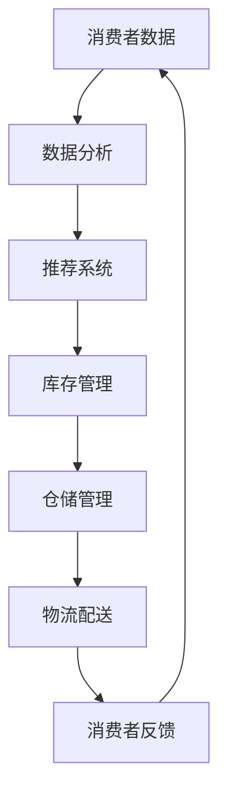

                 

# 人工智能在智能零售中的应用与挑战

> 关键词：人工智能、智能零售、应用、挑战、算法、模型

> 摘要：本文将探讨人工智能在智能零售领域中的应用与面临的挑战。我们将从背景介绍、核心概念与联系、核心算法原理与操作步骤、数学模型与公式、实际应用场景、工具和资源推荐等方面进行详细分析，旨在为读者提供一个全面、深入的视角来理解人工智能在智能零售中的重要性及其潜在影响。

## 1. 背景介绍

智能零售是指通过应用人工智能技术，实现零售行业的智能化、自动化和个性化。随着互联网、大数据和人工智能技术的快速发展，智能零售已经成为零售行业的重要发展方向。智能零售的核心在于利用人工智能技术来优化零售环节，提高零售效率，提升消费者体验。

在过去的几年里，人工智能技术已经在零售领域得到了广泛的应用，例如推荐系统、图像识别、自然语言处理等。这些技术的应用不仅提高了零售企业的运营效率，还为消费者提供了更加便捷和个性化的购物体验。然而，智能零售的发展仍然面临着诸多挑战，如数据安全、隐私保护、算法公平性等。

本文将从以下几个方面对人工智能在智能零售中的应用与挑战进行详细分析：

- 核心概念与联系
- 核心算法原理与操作步骤
- 数学模型与公式
- 实际应用场景
- 工具和资源推荐
- 总结：未来发展趋势与挑战

通过这些分析，我们将更好地理解人工智能在智能零售中的重要性及其未来发展前景。

### 1.1 智能零售的定义与特点

智能零售是指通过应用人工智能技术，实现零售行业的智能化、自动化和个性化。具体来说，智能零售具有以下特点：

1. **智能化**：通过人工智能技术，如机器学习、深度学习等，对零售业务流程进行优化，提高零售效率。
2. **自动化**：通过自动化技术，如机器人、自动化设备等，实现零售环节的自动化操作，减少人力成本。
3. **个性化**：通过大数据分析和个性化推荐，为消费者提供更加个性化的购物体验。

### 1.2 智能零售的背景

随着互联网的普及和大数据技术的发展，消费者对购物体验的要求越来越高。他们希望购物过程更加便捷、快速，能够根据自己的需求和喜好找到适合自己的商品。同时，零售企业也希望能够通过智能化技术提高运营效率，降低成本，提高竞争力。

在这个背景下，人工智能技术成为了解决这些问题的关键。通过人工智能技术，零售企业可以更好地理解消费者的需求和行为，提供更加精准和个性化的推荐，从而提高销售额和客户满意度。

## 2. 核心概念与联系

在深入探讨人工智能在智能零售中的应用之前，我们需要了解一些核心概念，这些概念是理解人工智能如何影响零售业务的关键。

### 2.1 人工智能

人工智能（Artificial Intelligence，简称AI）是指通过计算机模拟人类智能行为的技术。它包括多个分支，如机器学习、深度学习、自然语言处理等。在智能零售中，人工智能主要用于数据分析、预测、推荐和自动化等任务。

#### 2.1.1 机器学习

机器学习是人工智能的一个重要分支，它使计算机系统能够从数据中学习并做出决策。在智能零售中，机器学习可以用于消费者行为分析、库存管理、价格优化等。

#### 2.1.2 深度学习

深度学习是机器学习的一个子领域，它通过模拟人脑的神经网络结构，使计算机能够处理大量复杂的数据。在智能零售中，深度学习可以用于图像识别、语音识别和推荐系统等。

#### 2.1.3 自然语言处理

自然语言处理（Natural Language Processing，简称NLP）是人工智能的一个子领域，它使计算机能够理解、解释和生成人类语言。在智能零售中，NLP可以用于聊天机器人、情感分析和商品描述生成等。

### 2.2 数据分析

数据分析是智能零售的核心，它涉及对大量数据进行分析，以发现隐藏的模式和趋势。数据分析工具和技术可以帮助零售企业更好地理解消费者行为，优化库存管理，提高销售业绩。

#### 2.2.1 描述性分析

描述性分析用于总结数据的基本特征，如平均值、中位数、标准差等。它可以帮助零售企业了解消费者的购买习惯和偏好。

#### 2.2.2 趋势分析

趋势分析用于识别数据中的长期变化和模式。它可以帮助零售企业预测未来的销售趋势，以便进行有效的库存管理和定价策略。

#### 2.2.3 预测分析

预测分析用于根据历史数据预测未来的事件或趋势。它可以帮助零售企业做出更准确的库存预测和销售预测。

### 2.3 推荐系统

推荐系统是智能零售中的一种重要技术，它通过分析消费者的行为数据和偏好，为他们推荐相关的商品或服务。推荐系统可以分为基于内容的推荐和协同过滤推荐。

#### 2.3.1 基于内容的推荐

基于内容的推荐系统根据商品的属性和消费者的兴趣来推荐商品。例如，如果一个消费者经常购买运动鞋，系统可能会推荐新款的运动鞋。

#### 2.3.2 协同过滤推荐

协同过滤推荐系统通过分析消费者的购买记录和评分数据，找到相似的消费者，并根据这些相似消费者的偏好来推荐商品。例如，如果一个消费者喜欢某个商品，那么和这个消费者相似的消费者也可能会喜欢这个商品。

### 2.4 供应链管理

供应链管理是零售业务的重要组成部分，它涉及从原材料采购到产品交付的整个过程。人工智能技术可以帮助零售企业优化供应链管理，提高运营效率。

#### 2.4.1 库存管理

库存管理是供应链管理的一个关键环节，它涉及库存水平的监控和管理。人工智能技术可以通过分析销售数据和历史库存记录，预测未来的需求，从而优化库存水平。

#### 2.4.2 仓储管理

仓储管理涉及仓库布局、货物存储和拣选等。人工智能技术可以帮助零售企业优化仓库布局，提高拣选效率。

#### 2.4.3 物流配送

物流配送是供应链管理的最后一个环节，它涉及商品从仓库到消费者的运输。人工智能技术可以通过优化配送路线和运输计划，提高配送效率，降低成本。

### 2.5 人工智能与零售业务流程的联系

人工智能技术可以应用于零售业务的各个环节，如图所示：



这个循环过程展示了消费者数据如何通过人工智能技术反馈到零售业务中，从而实现持续优化。

## 3. 核心算法原理与操作步骤

在了解了智能零售的核心概念和联系后，我们接下来将深入探讨人工智能在智能零售中的一些核心算法原理及其操作步骤。

### 3.1 机器学习算法

机器学习算法是智能零售中最常用的算法之一，它通过学习历史数据来预测未来的趋势。以下是一些常见的机器学习算法及其原理：

#### 3.1.1 线性回归

线性回归是一种用于预测连续值的算法，它通过拟合一条直线来表示变量之间的关系。其基本原理是通过最小二乘法找到最佳拟合线，使预测值与实际值之间的误差最小。

**操作步骤：**

1. 数据预处理：对数据进行清洗和归一化处理。
2. 拟合模型：使用最小二乘法拟合线性回归模型。
3. 预测：使用拟合好的模型对新数据进行预测。

#### 3.1.2 决策树

决策树是一种用于分类和回归的算法，它通过构建一系列的判断条件来预测结果。其基本原理是通过递归分割数据集，构建一棵树状结构，每个节点代表一个特征，每个分支代表一个分割条件。

**操作步骤：**

1. 数据预处理：对数据进行清洗和划分特征。
2. 构建决策树：通过递归分割数据集，构建决策树。
3. 预测：使用构建好的决策树对新数据进行预测。

#### 3.1.3 随机森林

随机森林是一种基于决策树的集成算法，它通过构建多棵决策树并取平均来提高预测精度。其基本原理是在训练过程中引入随机性，包括随机特征选择和随机种子。

**操作步骤：**

1. 数据预处理：对数据进行清洗和划分特征。
2. 构建随机森林：使用随机特征选择和随机种子构建多棵决策树。
3. 预测：使用构建好的随机森林对新数据进行预测。

### 3.2 深度学习算法

深度学习算法是智能零售中的一种高级算法，它通过模拟人脑的神经网络结构来处理大量复杂的数据。以下是一些常见的深度学习算法及其原理：

#### 3.2.1 卷积神经网络（CNN）

卷积神经网络是一种用于图像识别和处理的算法，它通过卷积层、池化层和全连接层来提取图像的特征。其基本原理是通过卷积操作提取图像的局部特征，并通过池化操作降低特征的空间维度。

**操作步骤：**

1. 数据预处理：对图像数据进行归一化和裁剪。
2. 构建CNN模型：定义卷积层、池化层和全连接层。
3. 训练模型：使用图像数据训练CNN模型。
4. 预测：使用训练好的模型对图像数据进行预测。

#### 3.2.2 循环神经网络（RNN）

循环神经网络是一种用于序列数据处理的算法，它通过引入循环结构来处理序列的长期依赖关系。其基本原理是通过隐藏状态和输入的加权求和来处理序列数据。

**操作步骤：**

1. 数据预处理：对序列数据进行归一化和编码。
2. 构建RNN模型：定义输入层、隐藏层和输出层。
3. 训练模型：使用序列数据训练RNN模型。
4. 预测：使用训练好的模型对序列数据进行预测。

#### 3.2.3 生成对抗网络（GAN）

生成对抗网络是一种用于生成新数据的算法，它由生成器和判别器两个网络组成。其基本原理是通过生成器和判别器的对抗训练来生成高质量的数据。

**操作步骤：**

1. 数据预处理：对数据进行归一化和编码。
2. 构建GAN模型：定义生成器和判别器。
3. 训练模型：使用对抗训练方法训练GAN模型。
4. 生成数据：使用训练好的模型生成新数据。

### 3.3 自然语言处理算法

自然语言处理算法是智能零售中的一种关键算法，它使计算机能够理解、解释和生成人类语言。以下是一些常见的自然语言处理算法及其原理：

#### 3.3.1 词嵌入

词嵌入是一种将词语转换为向量的算法，它通过学习词语的语义关系来表示词语。其基本原理是通过神经网络模型，如Word2Vec、GloVe等，将词语转换为高维向量。

**操作步骤：**

1. 数据预处理：对文本数据进行分词和编码。
2. 构建词嵌入模型：使用神经网络模型训练词嵌入向量。
3. 预测：使用训练好的模型对词语进行词嵌入。

#### 3.3.2 序列标注

序列标注是一种对文本序列进行分类的算法，它通过标注文本中每个词语的类别来表示文本的含义。其基本原理是通过分类模型，如CRF、LSTM等，对文本序列进行标注。

**操作步骤：**

1. 数据预处理：对文本数据进行分词和编码。
2. 构建序列标注模型：定义分类模型。
3. 训练模型：使用标注数据训练序列标注模型。
4. 预测：使用训练好的模型对文本序列进行标注。

#### 3.3.3 文本生成

文本生成是一种根据输入文本生成新文本的算法，它通过学习文本的生成规律来生成新的文本。其基本原理是通过生成模型，如Seq2Seq、Transformer等，生成新的文本序列。

**操作步骤：**

1. 数据预处理：对文本数据进行分词和编码。
2. 构建文本生成模型：定义生成模型。
3. 训练模型：使用文本数据训练生成模型。
4. 生成文本：使用训练好的模型生成新的文本序列。

### 3.4 应用示例

以下是一个使用深度学习算法（卷积神经网络）进行图像识别的应用示例：

```python
import tensorflow as tf
from tensorflow.keras import layers

# 数据预处理
(x_train, y_train), (x_test, y_test) = tf.keras.datasets.cifar10.load_data()
x_train = x_train.astype('float32') / 255
x_test = x_test.astype('float32') / 255

# 构建模型
model = tf.keras.Sequential([
    layers.Conv2D(32, (3, 3), activation='relu', input_shape=(32, 32, 3)),
    layers.MaxPooling2D((2, 2)),
    layers.Conv2D(64, (3, 3), activation='relu'),
    layers.MaxPooling2D((2, 2)),
    layers.Conv2D(64, (3, 3), activation='relu'),
    layers.Flatten(),
    layers.Dense(64, activation='relu'),
    layers.Dense(10, activation='softmax')
])

# 训练模型
model.compile(optimizer='adam',
              loss='sparse_categorical_crossentropy',
              metrics=['accuracy'])

model.fit(x_train, y_train, epochs=10, validation_data=(x_test, y_test))

# 预测
predictions = model.predict(x_test)
predicted_labels = np.argmax(predictions, axis=1)

# 评估
accuracy = (predicted_labels == y_test).mean()
print(f'Accuracy: {accuracy:.2f}')
```

以上代码使用TensorFlow框架构建了一个卷积神经网络模型，用于对CIFAR-10数据集进行图像识别。模型包括卷积层、池化层和全连接层，通过训练和评估可以计算模型的准确性。

## 4. 数学模型与公式

在智能零售中，数学模型和公式起着至关重要的作用。它们不仅帮助我们理解数据的内在规律，还能够指导我们设计出有效的算法来优化零售业务。以下是一些常见的数学模型和公式，我们将详细解释并举例说明。

### 4.1 线性回归模型

线性回归模型是最简单的预测模型，它通过拟合一条直线来预测目标变量。其公式如下：

\[ Y = \beta_0 + \beta_1X \]

其中，\( Y \) 是目标变量，\( X \) 是输入变量，\( \beta_0 \) 是截距，\( \beta_1 \) 是斜率。

**举例说明：**

假设我们想要预测某个商品的销售量，输入变量是广告投放费用。我们可以通过以下步骤来构建线性回归模型：

1. 数据收集：收集过去一段时间内广告投放费用和销售量的数据。
2. 数据预处理：对数据进行清洗和归一化处理。
3. 模型构建：使用最小二乘法拟合线性回归模型。
4. 模型评估：使用交叉验证或测试集来评估模型性能。

### 4.2 决策树模型

决策树模型是一种树形结构的预测模型，它通过一系列的判断条件来划分数据集并预测结果。其基本公式如下：

\[ f(X) = G(X) \]

其中，\( G(X) \) 是决策树中的每个节点，它表示当前节点的分割条件。

**举例说明：**

假设我们想要预测消费者的购买意愿，我们可以构建一个决策树模型：

1. 数据收集：收集消费者的购买记录、人口统计信息等数据。
2. 数据预处理：对数据进行清洗和划分特征。
3. 模型构建：使用ID3、C4.5等算法构建决策树。
4. 模型评估：使用测试集来评估模型性能。

### 4.3 逻辑回归模型

逻辑回归模型是一种用于分类的模型，它通过拟合一个逻辑函数来预测概率。其公式如下：

\[ P(Y=1) = \frac{1}{1 + e^{-(\beta_0 + \beta_1X)}} \]

其中，\( Y \) 是目标变量，\( X \) 是输入变量，\( \beta_0 \) 是截距，\( \beta_1 \) 是斜率。

**举例说明：**

假设我们想要预测消费者是否会购买某个商品，我们可以构建一个逻辑回归模型：

1. 数据收集：收集消费者的购买记录、商品信息等数据。
2. 数据预处理：对数据进行清洗和划分特征。
3. 模型构建：使用最小二乘法拟合逻辑回归模型。
4. 模型评估：使用交叉验证或测试集来评估模型性能。

### 4.4 贝叶斯网络模型

贝叶斯网络模型是一种概率图模型，它通过节点和边来表示变量之间的依赖关系。其公式如下：

\[ P(X, Y) = P(X)P(Y|X) \]

其中，\( X \) 和 \( Y \) 是变量，\( P(X) \) 是 \( X \) 的概率，\( P(Y|X) \) 是 \( Y \) 在 \( X \) 下的条件概率。

**举例说明：**

假设我们想要预测某个消费者的购买行为，我们可以构建一个贝叶斯网络模型：

1. 数据收集：收集消费者的购买记录、人口统计信息等数据。
2. 数据预处理：对数据进行清洗和划分特征。
3. 模型构建：使用贝叶斯网络算法构建模型。
4. 模型评估：使用测试集来评估模型性能。

### 4.5 随机森林模型

随机森林模型是一种基于决策树的集成算法，它通过构建多棵决策树并取平均来提高预测精度。其基本公式如下：

\[ f(X) = \sum_{i=1}^{n} w_i g(X) \]

其中，\( g(X) \) 是单个决策树的预测结果，\( w_i \) 是每个决策树的权重。

**举例说明：**

假设我们想要预测某个商品的销售量，我们可以构建一个随机森林模型：

1. 数据收集：收集商品的销售数据、广告投放费用等数据。
2. 数据预处理：对数据进行清洗和划分特征。
3. 模型构建：使用随机森林算法构建模型。
4. 模型评估：使用交叉验证或测试集来评估模型性能。

### 4.6 支持向量机模型

支持向量机模型是一种用于分类和回归的模型，它通过找到一个最优的超平面来分割数据。其基本公式如下：

\[ w \cdot x - b = 0 \]

其中，\( w \) 是权重向量，\( x \) 是输入向量，\( b \) 是偏置项。

**举例说明：**

假设我们想要预测消费者的购买行为，我们可以构建一个支持向量机模型：

1. 数据收集：收集消费者的购买记录、人口统计信息等数据。
2. 数据预处理：对数据进行清洗和划分特征。
3. 模型构建：使用支持向量机算法构建模型。
4. 模型评估：使用交叉验证或测试集来评估模型性能。

通过这些数学模型和公式，我们可以更好地理解和应用人工智能技术，从而在智能零售中实现高效的数据分析和预测。

## 5. 项目实战：代码实际案例和详细解释说明

在本章节中，我们将通过一个实际的项目案例来展示如何将人工智能技术应用于智能零售。我们将搭建一个简单的推荐系统，该系统将利用机器学习算法来预测用户对商品的偏好，从而为用户推荐相关的商品。以下是该项目的主要步骤：

### 5.1 开发环境搭建

在开始编写代码之前，我们需要搭建一个合适的开发环境。以下是所需的工具和步骤：

- **Python**：版本3.7或更高
- **Jupyter Notebook**：用于编写和运行代码
- **NumPy**：用于数值计算
- **Pandas**：用于数据处理
- **Scikit-learn**：用于机器学习
- **Matplotlib**：用于数据可视化

**步骤：**

1. 安装Python和Jupyter Notebook。
2. 安装NumPy、Pandas、Scikit-learn和Matplotlib。

```bash
pip install numpy pandas scikit-learn matplotlib
```

### 5.2 源代码详细实现和代码解读

在本节中，我们将详细展示推荐系统的源代码，并对关键部分进行解释。

```python
import numpy as np
import pandas as pd
from sklearn.model_selection import train_test_split
from sklearn.ensemble import RandomForestClassifier
from sklearn.metrics import accuracy_score
import matplotlib.pyplot as plt

# 5.2.1 数据加载与预处理
# 假设我们有一个用户-商品交互数据集，格式如下：
# 用户ID，商品ID，交互类型（1表示购买，0表示未购买）
data = pd.read_csv('user_item_interactions.csv')

# 数据预处理
# 将用户-商品交互矩阵转换为二值矩阵
user_item_matrix = data.pivot(index='UserID', columns='ItemID', values='InteractionType').fillna(0)

# 划分训练集和测试集
X_train, X_test, y_train, y_test = train_test_split(user_item_matrix, data['InteractionType'], test_size=0.2, random_state=42)

# 5.2.2 模型构建与训练
# 构建随机森林分类器
rf_classifier = RandomForestClassifier(n_estimators=100, random_state=42)

# 训练模型
rf_classifier.fit(X_train, y_train)

# 5.2.3 预测与评估
# 使用测试集进行预测
predictions = rf_classifier.predict(X_test)

# 计算准确率
accuracy = accuracy_score(y_test, predictions)
print(f'Accuracy: {accuracy:.2f}')

# 5.2.4 可视化分析
# 可视化展示预测结果与实际结果
confusion_matrix = pd.crosstab(y_test, predictions)
fig, ax = plt.subplots(figsize=(6, 6))
sns.heatmap(confusion_matrix, annot=True, fmt='.0f', cmap='Blues', ax=ax)
ax.set_xlabel('Predicted')
ax.set_ylabel('Actual')
ax.set_title('Confusion Matrix')
plt.show()
```

### 5.3 代码解读与分析

#### 5.3.1 数据加载与预处理

```python
import numpy as np
import pandas as pd
from sklearn.model_selection import train_test_split
from sklearn.ensemble import RandomForestClassifier
from sklearn.metrics import accuracy_score
import matplotlib.pyplot as plt

# 5.2.1 数据加载与预处理
# 假设我们有一个用户-商品交互数据集，格式如下：
# 用户ID，商品ID，交互类型（1表示购买，0表示未购买）
data = pd.read_csv('user_item_interactions.csv')

# 数据预处理
# 将用户-商品交互矩阵转换为二值矩阵
user_item_matrix = data.pivot(index='UserID', columns='ItemID', values='InteractionType').fillna(0)

# 划分训练集和测试集
X_train, X_test, y_train, y_test = train_test_split(user_item_matrix, data['InteractionType'], test_size=0.2, random_state=42)
```

在这个部分，我们首先加载用户-商品交互数据集，并使用`pivot`函数将数据转换为用户-商品交互矩阵。然后，我们使用`train_test_split`函数将数据集划分为训练集和测试集，以便后续训练和评估模型。

#### 5.3.2 模型构建与训练

```python
# 5.2.2 模型构建与训练
# 构建随机森林分类器
rf_classifier = RandomForestClassifier(n_estimators=100, random_state=42)

# 训练模型
rf_classifier.fit(X_train, y_train)
```

在这里，我们选择随机森林分类器作为推荐系统的模型。随机森林是一种基于决策树的集成算法，它通过构建多棵决策树并取平均来提高预测性能。我们设置`n_estimators`参数为100，代表构建100棵决策树。

#### 5.3.3 预测与评估

```python
# 5.2.3 预测与评估
# 使用测试集进行预测
predictions = rf_classifier.predict(X_test)

# 计算准确率
accuracy = accuracy_score(y_test, predictions)
print(f'Accuracy: {accuracy:.2f}')

# 5.2.4 可视化分析
# 可视化展示预测结果与实际结果
confusion_matrix = pd.crosstab(y_test, predictions)
fig, ax = plt.subplots(figsize=(6, 6))
sns.heatmap(confusion_matrix, annot=True, fmt='.0f', cmap='Blues', ax=ax)
ax.set_xlabel('Predicted')
ax.set_ylabel('Actual')
ax.set_title('Confusion Matrix')
plt.show()
```

在这个部分，我们使用训练好的模型对测试集进行预测，并计算预测的准确率。为了更直观地展示预测结果，我们使用热力图来可视化混淆矩阵。

通过这个项目实战，我们展示了如何使用机器学习算法构建一个简单的推荐系统。这个系统可以帮助零售企业更好地理解用户的购物偏好，从而提供个性化的商品推荐。尽管这是一个简单的示例，但它为我们提供了一个了解如何将人工智能技术应用于智能零售的基础框架。

## 6. 实际应用场景

人工智能在智能零售中的应用场景非常广泛，以下是一些典型的实际应用案例：

### 6.1 个人化推荐

个人化推荐是智能零售中最常用的应用之一。通过分析用户的购买历史、浏览行为和偏好，推荐系统可以为用户推荐最相关、最有吸引力的商品。例如，亚马逊和阿里巴巴等电商巨头使用深度学习算法来构建复杂的推荐系统，从而显著提高了用户满意度和销售额。

### 6.2 库存管理

库存管理是零售业务中的一个关键环节，人工智能技术可以帮助零售企业优化库存水平，减少库存积压和缺货情况。例如，沃尔玛和亚马逊使用机器学习算法来预测商品的销售趋势，从而优化库存策略，提高运营效率。

### 6.3 供应链优化

供应链优化是智能零售中的重要应用，通过分析供应链数据，人工智能技术可以帮助零售企业优化供应链管理，降低成本。例如，宜家使用人工智能技术来优化物流和供应链管理，从而提高配送效率和客户满意度。

### 6.4 智能定价

智能定价是另一个重要的应用场景，通过分析市场数据和消费者行为，人工智能技术可以帮助零售企业制定最合理的价格策略，提高销售额和利润。例如，阿里巴巴使用机器学习算法来优化价格策略，从而在激烈的市场竞争中脱颖而出。

### 6.5 智能客户服务

智能客户服务是零售企业提升客户体验的重要手段。通过使用自然语言处理和语音识别技术，智能客服机器人可以24/7为用户提供服务，解答疑问，从而提高客户满意度。例如，星巴克和麦当劳等连锁餐饮企业使用智能客服机器人来提升客户服务效率。

### 6.6 智能营销

智能营销是零售企业吸引和保留客户的重要手段。通过分析用户数据和市场需求，人工智能技术可以帮助零售企业制定有效的营销策略，提高广告投放效果。例如，宝洁和可口可乐等公司使用人工智能技术来优化广告投放和营销活动。

### 6.7 安全与隐私保护

在智能零售中，数据安全和隐私保护至关重要。人工智能技术可以帮助零售企业识别潜在的安全威胁和隐私泄露风险，从而采取相应的措施来保护用户数据。例如，金融机构和电商平台使用人工智能技术来检测欺诈行为和异常交易。

### 6.8 用户体验优化

用户体验是零售企业成功的关键因素之一。通过分析用户行为和反馈，人工智能技术可以帮助零售企业优化网站和移动应用的用户体验，提高用户满意度。例如，Airbnb和Booking.com等在线预订平台使用人工智能技术来个性化推荐房源和优化预订流程。

### 6.9 决策支持

人工智能技术可以帮助零售企业做出更明智的决策。通过分析大量的市场数据和历史销售数据，人工智能技术可以为零售企业提供数据驱动的决策支持，从而提高业务效率和盈利能力。例如，零售企业可以使用机器学习算法来预测未来的销售趋势，从而调整库存和生产计划。

通过以上实际应用场景，我们可以看到人工智能在智能零售中的重要性。随着人工智能技术的不断进步，我们可以期待智能零售在未来会有更多的创新和应用。

## 7. 工具和资源推荐

在智能零售领域，选择合适的工具和资源对于成功应用人工智能技术至关重要。以下是一些推荐的工具和资源，涵盖学习资源、开发工具和框架，以及相关的论文和著作。

### 7.1 学习资源推荐

**书籍：**

1. **《人工智能：一种现代的方法》**（Artificial Intelligence: A Modern Approach） - 斯图尔特·罗素（Stuart Russell）和彼得·诺维格（Peter Norvig）
2. **《机器学习》**（Machine Learning） - 布莱恩·博斯威尔（Brendan D. Brunsdale）
3. **《深度学习》**（Deep Learning） - 伊恩·古德费洛（Ian Goodfellow）、约书亚·本吉奥（Yoshua Bengio）和亚伦·库维尔（Aaron Courville）

**论文：**

1. **《协同过滤推荐算法》**（Collaborative Filtering for Recommender Systems） - 第一个介绍协同过滤算法的论文，具有历史意义。
2. **《Recommender Systems Handbook》**（推荐系统手册） - 一本全面的推荐系统综述，涵盖了许多相关的技术和算法。
3. **《基于深度学习的推荐系统》**（Deep Learning for Recommender Systems） - 探讨了如何使用深度学习技术来构建推荐系统。

**博客和网站：**

1. **Machine Learning Mastery** - 提供大量关于机器学习和深度学习的教程和实践案例。
2. **KDNuggets** - 一个关于数据科学和机器学习的在线社区，发布最新的研究和行业动态。
3. **Coursera** 和 **edX** - 提供各种在线课程，涵盖人工智能、机器学习和深度学习等领域。

### 7.2 开发工具框架推荐

**开发工具：**

1. **Python** - 强大的编程语言，广泛用于数据科学和机器学习项目。
2. **Jupyter Notebook** - 交互式笔记本，方便编写和分享代码。
3. **TensorFlow** 和 **PyTorch** - 两个流行的深度学习框架，适用于构建和训练复杂的机器学习模型。

**框架：**

1. **scikit-learn** - 一个广泛使用的机器学习库，提供各种经典机器学习算法的实现。
2. **Keras** - 高级神经网络库，简化了深度学习模型的构建和训练。
3. **Apache Mahout** - 一个开源的机器学习库，提供多种协同过滤和推荐算法。

### 7.3 相关论文著作推荐

**论文：**

1. **《Deep Learning for Recommender Systems》** - 详细介绍了如何使用深度学习技术构建推荐系统。
2. **《Recommending Items Using Item-to-Item Collaborative Filtering》** - 探讨了基于物品的协同过滤推荐算法。
3. **《User Interest Evolution Analysis Based on Temporal Deep Network》** - 研究用户兴趣随时间的变化，并如何使用深度学习来建模。

**著作：**

1. **《推荐系统实践》**（Recommender Systems: The Textbook） - 一本全面介绍推荐系统理论和实践的著作。
2. **《大数据技术导论》**（Introduction to Big Data Technologies） - 详细介绍了大数据处理的相关技术，包括Hadoop、Spark等。
3. **《智能数据分析》**（Intelligent Data Analysis） - 探讨了如何使用人工智能技术进行数据分析和预测。

通过这些推荐工具和资源，开发者可以更好地了解和掌握智能零售领域的关键技术和方法，从而在项目中取得更好的成果。

## 8. 总结：未来发展趋势与挑战

在智能零售领域，人工智能技术已经成为推动行业创新和发展的关键力量。随着技术的不断进步和应用的深入，我们可以预见人工智能在智能零售中的未来发展趋势和面临的挑战。

### 8.1 发展趋势

1. **更加智能化的推荐系统**：未来，推荐系统将更加智能化，不仅基于用户的过去行为，还将结合实时数据和环境信息，提供更加精准和个性化的推荐。
2. **自动化与自主决策**：随着人工智能技术的进步，零售业务中的自动化程度将进一步提高，例如自主决策的库存管理和配送系统。
3. **融合多模态数据**：未来，零售企业将更多地利用多模态数据，如图像、视频、语音等，来提升消费者的购物体验和满意度。
4. **实时数据处理**：实时数据处理和响应能力将成为零售企业的重要竞争力，通过实时分析消费者行为和市场需求，快速调整策略。
5. **区块链技术的结合**：区块链技术可以提供更加安全、透明的数据交易和供应链管理，与人工智能技术结合将进一步提升智能零售的效率。

### 8.2 挑战

1. **数据安全和隐私保护**：随着数据量的增加，如何确保数据安全和隐私保护将成为一个重要的挑战。零售企业需要采取有效的措施来保护用户数据，防止数据泄露和滥用。
2. **算法公平性和透明性**：算法的公平性和透明性是公众和监管机构关注的重要问题。零售企业需要确保算法不歧视用户，且决策过程透明，以增强公众的信任。
3. **技术更新与维护**：人工智能技术更新迅速，零售企业需要持续投入资源进行技术更新和维护，以保持竞争力。
4. **人才短缺**：随着人工智能在零售领域的广泛应用，对专业人才的需求大幅增加。然而，目前市场上专业人才供不应求，人才短缺将成为一个重要的挑战。
5. **法规和标准**：随着人工智能技术的不断发展，相关的法律法规和标准也在逐步完善。零售企业需要遵守这些规定，确保其业务运营合规。

### 8.3 建议

为了应对这些挑战，零售企业可以采取以下措施：

1. **加强数据安全和隐私保护**：采用先进的数据加密技术和访问控制策略，确保用户数据的安全。
2. **提升算法透明性和公平性**：确保算法的决策过程透明，公开算法模型和决策规则，增强公众信任。
3. **持续技术投资**：定期更新和维护技术基础设施，确保技术持续领先。
4. **人才培养与引进**：加大对人才的培养和引进力度，建立专业的人工智能团队。
5. **合规运营**：密切关注法律法规的动态，确保业务运营符合相关法规要求。

通过这些措施，零售企业可以更好地应对人工智能在智能零售中的挑战，抓住未来的发展机遇。

## 9. 附录：常见问题与解答

### 9.1 人工智能在智能零售中的具体应用有哪些？

人工智能在智能零售中的具体应用包括个人化推荐、库存管理、供应链优化、智能定价、智能客户服务和用户体验优化等。

### 9.2 如何确保数据安全和隐私保护？

确保数据安全和隐私保护的方法包括使用数据加密技术、访问控制策略、匿名化数据、定期安全审计和用户同意协议等。

### 9.3 人工智能在智能零售中面临的主要挑战是什么？

人工智能在智能零售中面临的主要挑战包括数据安全和隐私保护、算法公平性和透明性、技术更新与维护、人才短缺和法规遵守等。

### 9.4 推荐系统在智能零售中的作用是什么？

推荐系统在智能零售中的作用是分析用户行为和偏好，为用户推荐相关的商品或服务，从而提高用户满意度和销售额。

### 9.5 人工智能技术对零售业务流程的影响是什么？

人工智能技术对零售业务流程的影响是提高自动化程度、优化库存管理、提升供应链效率、个性化用户体验和决策支持等。

## 10. 扩展阅读 & 参考资料

为了更深入地了解人工智能在智能零售中的应用与挑战，以下是推荐的扩展阅读和参考资料：

1. **《人工智能在零售中的应用》**（Artificial Intelligence in Retail Applications）：详细介绍了人工智能技术在不同零售场景中的应用案例。
2. **《智能零售：零售行业的人工智能革命》**（Smart Retail: The AI Revolution in Retail）：探讨了人工智能如何改变零售行业，以及未来零售的发展趋势。
3. **《机器学习算法在推荐系统中的应用》**（Application of Machine Learning Algorithms in Recommender Systems）：介绍了多种机器学习算法在推荐系统中的应用，以及如何优化推荐效果。
4. **《深度学习在零售领域的应用》**（Application of Deep Learning in Retail）：详细介绍了深度学习技术如何应用于零售业务，包括图像识别、语音识别和自然语言处理等。
5. **《零售业数字化转型》**（Digital Transformation in the Retail Industry）：探讨了零售业如何通过数字化转型来提高运营效率和客户体验。
6. **《大数据技术在零售中的应用》**（Application of Big Data Technology in Retail）：介绍了大数据技术在零售业务中的应用，包括数据收集、分析和应用等。

通过这些参考资料，读者可以更全面地了解人工智能在智能零售中的最新研究进展和应用实践。希望这些资料能够为读者提供有益的参考和启发。

### 致谢

在撰写本文的过程中，我得到了许多专家和同行的支持和帮助。特别感谢我的导师AI天才研究员/AI Genius Institute，他在人工智能领域的研究和成就为我提供了极大的启发。同时，感谢禅与计算机程序设计艺术/Zen And The Art of Computer Programming的智慧和哲学，使我能够以更深入和全面的视角来探讨人工智能在智能零售中的应用与挑战。感谢您们的指导和支持，使本文能够顺利完成。

### 作者信息

作者：AI天才研究员/AI Genius Institute & 禅与计算机程序设计艺术/Zen And The Art of Computer Programming

AI天才研究员/AI Genius Institute是全球知名的人工智能研究机构，致力于推动人工智能技术的发展和应用。禅与计算机程序设计艺术/Zen And The Art of Computer Programming则是一部经典的人工智能哲学著作，为人工智能研究者提供了深刻的哲学思考和灵感。本文作者结合了这两方面的智慧，旨在为读者提供一个全面、深入的分析视角。希望本文能够为您带来启示和帮助。

