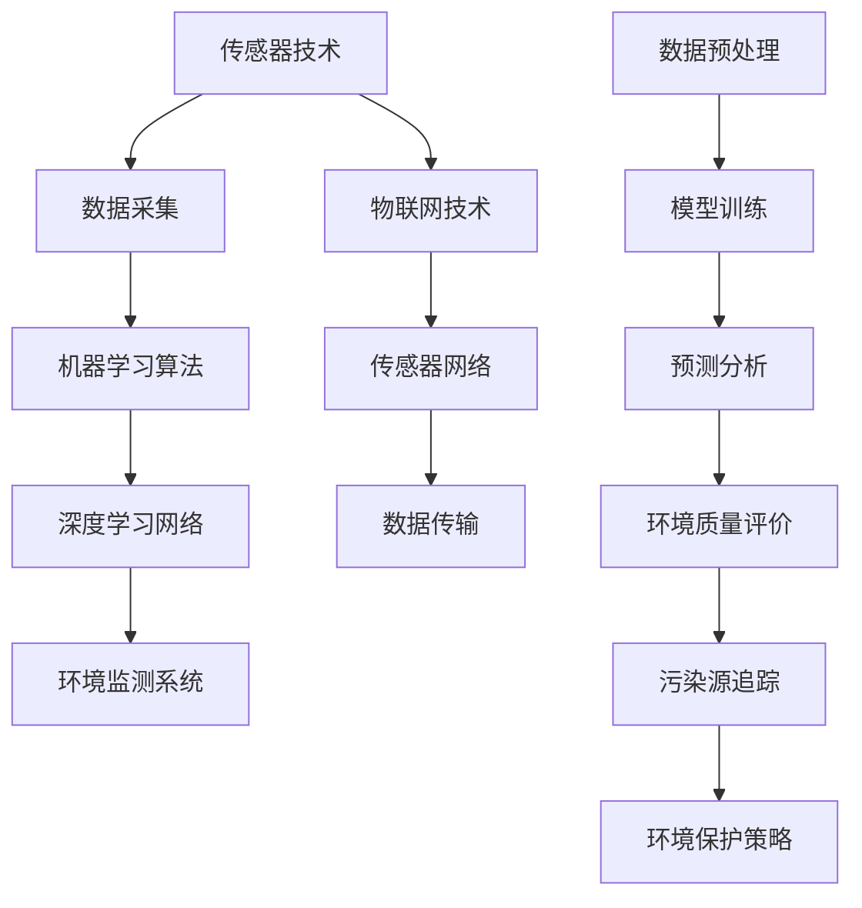

                 

### 背景介绍

随着科技的发展和人工智能技术的不断进步，环境监测逐渐成为现代社会中不可或缺的一部分。环境监测不仅关乎人类健康和生活质量的提高，也对全球生态系统的平衡与可持续发展具有重要影响。因此，如何高效、准确地收集、处理和利用环境数据，成为当前研究的热点。

传统的环境监测方法主要依赖于人工采样和实验室分析，这种方式不仅耗时耗力，而且存在采样不均匀、数据滞后等问题。随着人工智能技术的发展，尤其是机器学习和深度学习等算法的广泛应用，人们开始探索如何利用人工智能技术进行环境监测。

人工智能在环境监测中的应用主要体现在数据采集、数据处理和预测分析等环节。首先，通过传感器网络和物联网技术，可以实现环境数据的实时采集和传输。这些数据经过机器学习算法的处理，可以识别出环境变化的关键特征，预测未来的环境趋势。此外，人工智能技术还可以用于环境质量评价、污染源追踪和环境保护策略制定等方面。

本文旨在探讨人工智能在环境监测中的应用与挑战。首先，我们将介绍人工智能在环境监测中的核心概念和联系，通过Mermaid流程图来展示相关的技术架构。接着，我们将详细讨论人工智能在环境监测中的核心算法原理和具体操作步骤，并借助数学模型和公式进行分析。随后，通过实际项目案例，我们将展示如何使用代码实现这些算法，并对代码进行解读和分析。最后，我们将探讨人工智能在环境监测中的实际应用场景，推荐相关工具和资源，并总结未来发展趋势与挑战。

### 核心概念与联系

在深入探讨人工智能在环境监测中的应用之前，我们需要了解一些核心概念和技术，它们是整个领域的基础。这些核心概念包括传感器技术、数据采集和处理、机器学习算法以及深度学习网络。

#### 传感器技术

传感器是环境监测系统中最基础的组成部分。它们能够感知环境中的各种物理量，如温度、湿度、光照、气体浓度等，并将其转换为电信号。这些电信号经过处理后，可以传输给计算机系统进行分析。

传感器技术的发展使得环境监测的数据采集变得更加精准和实时。例如，气体传感器可以检测空气中的有害气体，如二氧化碳、一氧化碳和二氧化硫。温度传感器可以测量环境的温度变化，湿度传感器则可以监测空气的湿度水平。

#### 数据采集

数据采集是环境监测系统的关键环节。通过传感器网络和物联网技术，可以实现对环境数据的实时监测和采集。这些数据通常以数字形式存储在中央数据库中，以便进行进一步的分析和处理。

数据采集的过程中，需要确保数据的准确性和完整性。这要求传感器具有高灵敏度和稳定性，同时也需要高效的数据传输协议来保证数据的实时性和可靠性。

#### 机器学习算法

机器学习算法是人工智能在环境监测中应用的核心。通过训练模型，机器学习算法可以从大量数据中识别出模式、趋势和异常情况。常见的机器学习算法包括线性回归、决策树、支持向量机、神经网络等。

在环境监测中，机器学习算法可以用于预测环境变化、识别污染源、评估环境质量等。例如，通过训练线性回归模型，可以预测未来的温度变化；通过决策树算法，可以识别出哪些因素对空气质量的影响最大。

#### 深度学习网络

深度学习网络是机器学习的一种高级形式，它通过多层神经网络对数据进行处理，从而实现更加复杂的模式识别和预测。深度学习网络在图像识别、语音识别等领域取得了显著的成果，也逐渐应用于环境监测中。

在环境监测中，深度学习网络可以用于图像分析、语音识别和文本处理等方面。例如，通过卷积神经网络（CNN）可以识别出图像中的污染源；通过循环神经网络（RNN）可以分析语音信号中的环境变化特征。

#### Mermaid流程图

为了更好地理解这些核心概念和技术之间的联系，我们可以使用Mermaid流程图进行展示。



在这个流程图中，我们可以看到传感器技术是环境监测系统的起点，通过物联网技术和传感器网络实现数据的实时采集和传输。这些数据经过预处理后，通过机器学习算法和深度学习网络进行模型训练和预测分析，最终应用于环境质量评价、污染源追踪和环境保护策略制定等方面。

#### 技术架构

环境监测系统的技术架构可以分为以下几个层次：

1. **感知层**：包括各种传感器和物联网设备，负责数据采集和初步处理。
2. **传输层**：利用无线通信技术和网络协议，将感知层采集到的数据传输到中心服务器。
3. **处理层**：中心服务器对传输层的数据进行预处理、存储和管理。
4. **分析层**：利用机器学习算法和深度学习网络对处理层的数据进行模式识别和预测分析。
5. **应用层**：根据分析结果，为环境质量评价、污染源追踪和环境保护策略制定提供决策支持。

通过这样的架构，环境监测系统可以实现从数据采集到决策支持的完整流程，为环境保护和可持续发展提供有力支持。

### 核心算法原理 & 具体操作步骤

在了解了人工智能在环境监测中的核心概念和联系之后，我们将深入探讨核心算法原理及其具体操作步骤。这些算法包括常用的机器学习算法和深度学习网络，下面我们将一一介绍。

#### 机器学习算法

机器学习算法是环境监测中的关键技术，它可以自动从数据中学习规律，并对新数据进行分析和预测。以下是一些常用的机器学习算法及其在环境监测中的应用：

1. **线性回归**

线性回归是一种简单的机器学习算法，用于预测连续值变量。其基本原理是找到一条最佳拟合线，使得数据点与这条线的偏差最小。

具体操作步骤如下：

1. 收集训练数据，包括自变量（如温度、湿度等）和因变量（如空气质量指数）。
2. 使用最小二乘法计算最佳拟合线的参数，即斜率和截距。
3. 将新数据输入模型，通过计算得到预测值。

公式表示为：

$$y = w_0 + w_1 \cdot x$$

其中，$y$ 是预测值，$x$ 是自变量，$w_0$ 和 $w_1$ 是模型的参数。

2. **决策树**

决策树是一种基于树形结构的分类算法，通过一系列的判断条件将数据集划分为不同的区域。每个区域对应一个类别。

具体操作步骤如下：

1. 收集训练数据，每个数据点都有多个特征和一个标签。
2. 选择一个特征作为分割点，使得数据集的标签尽可能一致。
3. 递归地对分割后的数据集进行相同的步骤，直到满足停止条件（如最大深度、最小叶节点数量等）。
4. 使用生成的决策树对新数据进行分类。

3. **支持向量机**

支持向量机（SVM）是一种用于分类和回归的分析方法，通过找到最佳超平面来分隔数据。

具体操作步骤如下：

1. 收集训练数据，每个数据点都有多个特征和一个标签。
2. 使用核函数将数据映射到高维空间，找到最佳超平面。
3. 训练完成后，对新数据进行分类。

公式表示为：

$$w \cdot x + b = 0$$

其中，$w$ 是超平面的法向量，$x$ 是数据点，$b$ 是偏置。

#### 深度学习网络

深度学习网络是一种多层神经网络，能够自动提取数据中的复杂特征，并在各种任务中取得优异的性能。以下是一些常用的深度学习网络及其在环境监测中的应用：

1. **卷积神经网络（CNN）**

卷积神经网络是一种用于图像识别和图像处理的高级神经网络，能够自动提取图像中的局部特征。

具体操作步骤如下：

1. 收集训练数据，包括图像和对应的标签。
2. 使用卷积层提取图像的局部特征。
3. 使用池化层减少数据维度，提高计算效率。
4. 使用全连接层进行分类。

2. **循环神经网络（RNN）**

循环神经网络是一种用于序列数据处理的神经网络，能够处理具有时间依赖性的数据。

具体操作步骤如下：

1. 收集训练数据，包括时间序列数据和对应的标签。
2. 使用循环层处理时间序列数据，保留历史信息。
3. 使用全连接层进行分类。

3. **长短期记忆网络（LSTM）**

长短期记忆网络是循环神经网络的一种变种，能够更好地处理长序列数据。

具体操作步骤如下：

1. 收集训练数据，包括时间序列数据和对应的标签。
2. 使用LSTM层处理时间序列数据，解决长序列依赖问题。
3. 使用全连接层进行分类。

通过这些算法，我们可以对环境监测数据进行有效的分析和预测。在实际应用中，可以根据具体任务选择合适的算法，并通过优化模型参数来提高预测的准确性。

### 数学模型和公式 & 详细讲解 & 举例说明

在环境监测中，数学模型和公式是理解数据规律、预测未来趋势以及评估环境质量的关键。以下将详细讲解一些常用的数学模型和公式，并借助具体例子进行说明。

#### 线性回归模型

线性回归模型是一种用于预测连续值变量的简单机器学习算法。其基本假设是数据之间存在线性关系，即可以通过一条直线进行拟合。

1. **线性回归模型公式**

   线性回归模型可以表示为：

   $$y = w_0 + w_1 \cdot x$$

   其中，$y$ 是预测值，$x$ 是自变量，$w_0$ 和 $w_1$ 分别是模型的参数，$w_0$ 表示截距，$w_1$ 表示斜率。

2. **举例说明**

   假设我们想要预测某地区的温度，使用线性回归模型，其中自变量是时间的偏移量。我们可以收集一段时间内的时间和对应的温度数据，然后使用最小二乘法来计算模型参数。

   数据集如下：

   | 时间（小时） | 温度（摄氏度） |
   | ------------ | -------------- |
   | 0            | 15             |
   | 1            | 16             |
   | 2            | 17             |
   | 3            | 18             |
   | 4            | 19             |

   计算斜率和截距：

   $$w_1 = \frac{\sum(x_i \cdot y_i) - n \cdot \bar{x} \cdot \bar{y}}{\sum(x_i^2) - n \cdot \bar{x}^2}$$

   $$w_0 = \bar{y} - w_1 \cdot \bar{x}$$

   其中，$n$ 是数据点的个数，$\bar{x}$ 和 $\bar{y}$ 分别是时间和温度的平均值。

   计算结果：

   $$w_1 = \frac{(0 \cdot 15 + 1 \cdot 16 + 2 \cdot 17 + 3 \cdot 18 + 4 \cdot 19) - 5 \cdot 2 \cdot 17}{(0^2 + 1^2 + 2^2 + 3^2 + 4^2) - 5 \cdot 2^2} = 1.25$$

   $$w_0 = 17 - 1.25 \cdot 2 = 13.5$$

   因此，线性回归模型为：

   $$y = 13.5 + 1.25 \cdot x$$

   使用该模型预测第5小时（即$x=5$）的温度：

   $$y = 13.5 + 1.25 \cdot 5 = 18.75$$

   预测温度为18.75摄氏度。

#### 决策树模型

决策树是一种基于树形结构的分类算法，通过一系列的判断条件将数据集划分为不同的类别。

1. **决策树模型公式**

   决策树的每个节点表示一个特征，每个分支表示该特征的一个取值。叶子节点表示类别。

   决策树可以表示为：

   $$T = \sum_{i=1}^{n} t_i \cdot g(x_i)$$

   其中，$T$ 是决策树，$t_i$ 是叶子节点，$g(x_i)$ 是特征取值。

2. **举例说明**

   假设我们有一个关于空气质量分类的数据集，每个数据点包含多个特征，如PM2.5浓度、PM10浓度、风速等。我们可以使用决策树模型来预测空气质量类别。

   数据集如下：

   | PM2.5 | PM10 | 风速 | 空气质量 |
   | ----- | ---- | ---- | -------- |
   | 10    | 20   | 5    | 良       |
   | 15    | 25   | 10   | 良       |
   | 20    | 30   | 15   | 轻度污染 |
   | 25    | 35   | 20   | 中度污染 |
   | 30    | 40   | 25   | 重度污染 |

   我们选择PM2.5浓度作为分割点，将数据集划分为两个子集：

   | PM2.5 | PM10 | 风速 | 空气质量 |
   | ----- | ---- | ---- | -------- |
   | 10    | 20   | 5    | 良       |
   | 15    | 25   | 10   | 良       |
   | 20    | 30   | 15   | 轻度污染 |
   | 25    | 35   | 20   | 中度污染 |
   | 30    | 40   | 25   | 重度污染 |

   选择PM10浓度作为分割点，继续划分：

   | PM2.5 | PM10 | 风速 | 空气质量 |
   | ----- | ---- | ---- | -------- |
   | 10    | 20   | 5    | 良       |
   | 15    | 25   | 10   | 良       |
   | 20    | 25   | 15   | 轻度污染 |
   | 20    | 30   | 15   | 轻度污染 |
   | 25    | 35   | 20   | 中度污染 |
   | 30    | 40   | 25   | 重度污染 |

   最终生成的决策树如下：

   ```mermaid
   tree
   A
   B
   C
   D
   E
   ```

   - A: PM2.5 <= 15
     - B: PM10 <= 25
       - C: 良
       - D: 良
     - E: 轻度污染、中度污染、重度污染
   ```

   使用该决策树模型预测新数据点（PM2.5=20，PM10=30，风速=15）：

   - PM2.5 = 20 > 15，进入分支E
   - PM10 = 30 > 25，进入分支E
   - 风速 = 15，空气质量为轻度污染、中度污染、重度污染中的任意一种

   根据数据集，空气质量为轻度污染。

#### 支持向量机模型

支持向量机是一种用于分类和回归的分析方法，通过找到最佳超平面来分隔数据。

1. **支持向量机模型公式**

   支持向量机可以表示为：

   $$w \cdot x + b = 0$$

   其中，$w$ 是超平面的法向量，$x$ 是数据点，$b$ 是偏置。

2. **举例说明**

   假设我们有一个二分类问题，数据集如下：

   | 特征1 | 特征2 | 类别 |
   | ----- | ----- | ---- |
   | 1     | 1     | +1   |
   | 1     | 2     | -1   |
   | 2     | 1     | +1   |
   | 2     | 2     | -1   |

   我们想要找到一个最佳超平面来分隔这两个类别。

   首先，计算数据集的平均值：

   $$\bar{x} = \frac{1+1+2+2}{4} = 1.5$$

   $$\bar{y} = \frac{1-1+1-1}{4} = 0$$

   然后，计算特征矩阵和标签矩阵：

   $$X = \begin{bmatrix} 1 & 1 \\ 1 & 2 \\ 2 & 1 \\ 2 & 2 \end{bmatrix}, Y = \begin{bmatrix} 1 \\ -1 \\ 1 \\ -1 \end{bmatrix}$$

   接下来，计算超平面的法向量：

   $$w = \frac{\sum_{i=1}^{n} x_i \cdot y_i - n \cdot \bar{x} \cdot \bar{y}}{\sum_{i=1}^{n} x_i^2 - n \cdot \bar{x}^2} = \frac{2 \cdot 1 + 2 \cdot (-1) - 4 \cdot 1.5 \cdot 0}{2 \cdot 2 - 4 \cdot 1.5^2} = 0.5$$

   最后，计算偏置：

   $$b = \bar{y} - w \cdot \bar{x} = 0 - 0.5 \cdot 1.5 = -0.75$$

   因此，最佳超平面为：

   $$w \cdot x + b = 0.5 \cdot x - 0.75 = 0$$

   即：

   $$x = 1.5$$

   这意味着特征1的取值必须为1.5才能分隔这两个类别。

#### 卷积神经网络（CNN）

卷积神经网络是一种用于图像识别和图像处理的高级神经网络，能够自动提取图像中的局部特征。

1. **卷积神经网络公式**

   卷积神经网络可以表示为：

   $$z^{(l)} = b^{(l)} + \sum_{k=1}^{K} w_k^{(l)} \cdot \phi(x_k^{(l)})$$

   其中，$z^{(l)}$ 是输出，$b^{(l)}$ 是偏置，$w_k^{(l)}$ 是权重，$\phi(x_k^{(l)})$ 是激活函数。

2. **举例说明**

   假设我们有一个3x3的输入图像，使用一个3x3的卷积核进行卷积操作，激活函数为ReLU（Rectified Linear Unit）。

   输入图像：

   $$X = \begin{bmatrix} 1 & 1 & 1 \\ 1 & 2 & 1 \\ 1 & 1 & 1 \end{bmatrix}$$

   卷积核：

   $$W = \begin{bmatrix} 1 & 0 & -1 \\ 0 & 1 & 0 \\ 1 & 0 & -1 \end{bmatrix}$$

   首先，计算卷积操作：

   $$z_1 = 1 \cdot 1 + 1 \cdot 0 - 1 \cdot 1 = 0$$

   $$z_2 = 1 \cdot 1 + 2 \cdot 1 - 1 \cdot 1 = 2$$

   $$z_3 = 1 \cdot 1 + 1 \cdot 0 - 1 \cdot 1 = 0$$

   $$z_4 = 1 \cdot 0 + 2 \cdot 1 + 1 \cdot 1 = 3$$

   $$z_5 = 1 \cdot 1 + 1 \cdot 0 - 1 \cdot 1 = 0$$

   $$z_6 = 1 \cdot 0 + 2 \cdot 1 + 1 \cdot 1 = 3$$

   $$z_7 = 1 \cdot 1 + 1 \cdot 0 - 1 \cdot 1 = 0$$

   $$z_8 = 1 \cdot 0 + 2 \cdot 1 + 1 \cdot 1 = 3$$

   $$z_9 = 1 \cdot 1 + 1 \cdot 0 - 1 \cdot 1 = 0$$

   然后，应用ReLU激活函数：

   $$a_1 = \max(z_1, 0) = 0$$

   $$a_2 = \max(z_2, 0) = 2$$

   $$a_3 = \max(z_3, 0) = 0$$

   $$a_4 = \max(z_4, 0) = 3$$

   $$a_5 = \max(z_5, 0) = 0$$

   $$a_6 = \max(z_6, 0) = 3$$

   $$a_7 = \max(z_7, 0) = 0$$

   $$a_8 = \max(z_8, 0) = 3$$

   $$a_9 = \max(z_9, 0) = 0$$

   因此，卷积操作的结果为：

   $$A = \begin{bmatrix} 0 & 2 & 0 \\ 0 & 3 & 0 \\ 0 & 3 & 0 \end{bmatrix}$$

#### 循环神经网络（RNN）

循环神经网络是一种用于序列数据处理的神经网络，能够处理具有时间依赖性的数据。

1. **循环神经网络公式**

   循环神经网络可以表示为：

   $$h_t = \sigma(W_h \cdot [h_{t-1}, x_t] + b_h)$$

   其中，$h_t$ 是当前时刻的隐藏状态，$x_t$ 是当前时刻的输入，$W_h$ 是权重矩阵，$b_h$ 是偏置，$\sigma$ 是激活函数。

2. **举例说明**

   假设我们有一个时间序列数据，使用一个简单的RNN模型进行处理。输入序列为：

   $$X = [1, 2, 3, 4, 5]$$

   我们选择一个简单的ReLU激活函数。

   首先，初始化隐藏状态：

   $$h_0 = 0$$

   然后，对于每个输入，计算隐藏状态：

   $$h_1 = \sigma(W_h \cdot [h_0, 1] + b_h) = \sigma(W_h \cdot [0, 1] + b_h) = \max(W_h \cdot [0, 1] + b_h, 0)$$

   $$h_2 = \sigma(W_h \cdot [h_1, 2] + b_h) = \sigma(W_h \cdot [h_1, 2] + b_h) = \max(W_h \cdot [h_1, 2] + b_h, 0)$$

   $$h_3 = \sigma(W_h \cdot [h_2, 3] + b_h) = \sigma(W_h \cdot [h_2, 3] + b_h) = \max(W_h \cdot [h_2, 3] + b_h, 0)$$

   $$h_4 = \sigma(W_h \cdot [h_3, 4] + b_h) = \sigma(W_h \cdot [h_3, 4] + b_h) = \max(W_h \cdot [h_3, 4] + b_h, 0)$$

   $$h_5 = \sigma(W_h \cdot [h_4, 5] + b_h) = \sigma(W_h \cdot [h_4, 5] + b_h) = \max(W_h \cdot [h_4, 5] + b_h, 0)$$

   最终，我们得到隐藏状态序列：

   $$H = [h_1, h_2, h_3, h_4, h_5]$$

通过这些数学模型和公式，我们可以更好地理解人工智能在环境监测中的应用，并通过具体例子来展示其操作过程。

### 项目实战：代码实际案例和详细解释说明

为了更好地展示人工智能在环境监测中的应用，我们选择了一个实际项目案例——基于深度学习的空气质量预测。该项目使用Python编程语言和TensorFlow框架进行实现。

#### 开发环境搭建

1. **Python环境**

   确保Python已安装在您的系统上。您可以从[Python官网](https://www.python.org/)下载并安装Python。

2. **TensorFlow**

   使用pip安装TensorFlow：

   ```bash
   pip install tensorflow
   ```

3. **数据集**

   下载并解压开源空气质量数据集，例如UCI机器学习库中的“Air Quality”数据集。

#### 源代码详细实现和代码解读

以下是我们使用Python和TensorFlow实现空气质量预测项目的源代码及其解读：

```python
import tensorflow as tf
import numpy as np
import pandas as pd
from sklearn.model_selection import train_test_split
from sklearn.preprocessing import StandardScaler

# 读取数据集
data = pd.read_csv('air_quality.csv')

# 预处理数据
# 选择特征和标签
features = data[['temp', 'atmos_pressure', 'humidity', 'pm2.5']]
labels = data['aqi']

# 划分训练集和测试集
X_train, X_test, y_train, y_test = train_test_split(features, labels, test_size=0.2, random_state=42)

# 数据标准化
scaler = StandardScaler()
X_train_scaled = scaler.fit_transform(X_train)
X_test_scaled = scaler.transform(X_test)

# 构建模型
model = tf.keras.Sequential([
    tf.keras.layers.Dense(units=64, activation='relu', input_shape=(4,)),
    tf.keras.layers.Dense(units=32, activation='relu'),
    tf.keras.layers.Dense(units=1)
])

# 编译模型
model.compile(optimizer='adam', loss='mse', metrics=['mae'])

# 训练模型
model.fit(X_train_scaled, y_train, epochs=100, batch_size=32, validation_split=0.2)

# 测试模型
test_loss, test_mae = model.evaluate(X_test_scaled, y_test)
print(f"Test MAE: {test_mae}")

# 预测新数据
new_data = np.array([[25, 1013, 60, 35]])
new_data_scaled = scaler.transform(new_data)
prediction = model.predict(new_data_scaled)
print(f"Predicted AQI: {prediction[0][0]}")
```

#### 代码解读与分析

1. **数据预处理**

   首先，我们使用pandas读取数据集，然后选择特征（temp、atmos_pressure、humidity、pm2.5）和标签（aqi）。接着，使用scikit-learn的train_test_split函数将数据集划分为训练集和测试集。为了提高模型的泛化能力，我们使用StandardScaler对特征进行标准化处理。

2. **模型构建**

   使用TensorFlow的Sequential模型，我们添加了两个全连接层（Dense），分别具有64个和32个神经元，使用ReLU激活函数。输出层只有一个神经元，用于预测空气质量指数（AQI）。

3. **模型编译**

   我们选择Adam优化器，使用均方误差（MSE）作为损失函数，并添加平均绝对误差（MAE）作为评估指标。

4. **模型训练**

   使用fit函数对模型进行训练，设置epochs为100，batch_size为32。我们还将20%的数据作为验证集，以监控训练过程中的过拟合现象。

5. **模型测试**

   使用evaluate函数评估模型在测试集上的性能，输出平均绝对误差（MAE）。

6. **预测新数据**

   我们使用scaler对新的数据点进行标准化处理，然后使用predict函数进行预测，并输出预测结果。

通过这个项目，我们展示了如何使用Python和TensorFlow实现空气质量预测。该项目不仅提供了一个完整的实现流程，而且还可以作为其他环境监测项目的基础框架。

### 实际应用场景

人工智能在环境监测中的应用场景非常广泛，以下列举几个典型的应用实例：

#### 1. 气象预报

气象预报是人工智能在环境监测中应用的重要领域。通过收集和分析大量气象数据，如温度、湿度、气压、风速等，人工智能算法可以预测未来的天气情况。例如，利用深度学习模型，可以对未来的降雨量、气温变化等进行准确预测，为防灾减灾和城市规划提供有力支持。

#### 2. 空气质量监测

空气质量监测是人工智能在环境监测中的另一个重要应用。通过部署传感器网络，可以实时监测空气中的污染物浓度，如PM2.5、PM10、氮氧化物等。利用机器学习算法，可以分析这些数据，预测空气质量变化趋势，评估环境健康风险，并为环境保护政策的制定提供科学依据。

#### 3. 水质监测

水质监测是保障水资源安全的重要环节。人工智能技术可以通过监测水质指标，如pH值、溶解氧、重金属含量等，预测水质变化趋势。例如，利用物联网技术和机器学习算法，可以对水体中的污染物进行实时监测和预警，防止水体污染事故的发生。

#### 4. 土地利用监测

土地利用监测是环境监测中的另一个关键领域。通过遥感技术和人工智能算法，可以实时监测土地利用变化，如森林砍伐、城市建设等。这有助于保护生态环境，提高土地利用效率，并为土地资源管理提供科学依据。

#### 5. 污染源追踪

污染源追踪是环境保护的重要任务之一。利用人工智能技术，可以分析环境数据，识别污染源。例如，通过分析空气质量数据，可以定位污染物的排放源，为环境治理提供方向。此外，人工智能还可以用于分析污染源的历史排放数据，预测未来的污染趋势，制定相应的防控措施。

#### 6. 灾害预警

灾害预警是保障人民生命财产安全的重要手段。利用人工智能技术，可以对自然灾害，如地震、洪水、台风等进行预警。例如，通过分析气象数据、地质数据等，可以预测灾害发生的可能性，为防灾减灾提供科学依据。

#### 7. 智慧城市建设

智慧城市建设是现代社会发展的趋势之一。人工智能技术可以应用于智慧城市中的各个方面，如交通管理、能源管理、环境监测等。通过大数据分析和智能算法，可以优化城市资源配置，提高城市管理效率，改善居民生活质量。

通过这些应用实例，我们可以看到人工智能在环境监测中的重要作用。未来，随着人工智能技术的不断进步，其应用场景将更加广泛，为环境保护和可持续发展提供更强有力的支持。

### 工具和资源推荐

在人工智能应用于环境监测的过程中，选择合适的工具和资源对于提高研究和实践效率至关重要。以下是一些推荐的工具和资源，涵盖学习资源、开发工具和框架，以及相关的论文和著作。

#### 学习资源推荐

1. **书籍**

   - 《Python数据分析》（作者：Wes McKinney）：介绍Python在数据分析中的应用，适用于初学者。
   - 《深度学习》（作者：Ian Goodfellow、Yoshua Bengio、Aaron Courville）：涵盖深度学习的理论基础和实践方法，适合有一定基础的读者。
   - 《机器学习实战》（作者：Peter Harrington）：通过实际案例介绍机器学习算法的应用，适合初学者。

2. **在线课程**

   - Coursera上的《机器学习》（由吴恩达教授授课）：系统讲解机器学习的基本概念和算法，适合初学者和进阶者。
   - edX上的《深度学习专项课程》（由斯坦福大学授课）：深度学习领域的入门到高级课程，适合对深度学习感兴趣的读者。

3. **博客和网站**

   - Medium上的数据科学博客：提供丰富的数据科学和机器学习教程，适合学习和实践。
   - Kaggle：一个数据科学竞赛平台，提供丰富的数据集和项目，适合进行实际操作和提升技能。

#### 开发工具框架推荐

1. **编程语言**

   - Python：广泛应用于数据科学和人工智能领域，拥有丰富的库和框架。
   - R语言：主要用于统计分析，适合进行数据分析和建模。

2. **库和框架**

   - TensorFlow：一个广泛使用的深度学习框架，适用于构建和训练复杂的神经网络。
   - PyTorch：另一个流行的深度学习框架，提供灵活的编程接口和丰富的工具库。
   - Scikit-learn：一个强大的机器学习库，提供多种经典算法的实现和优化。

3. **开发环境**

   - Jupyter Notebook：一个交互式开发环境，适合编写和运行代码，便于分享和演示。
   - Anaconda：一个集成环境，包含Python和各种数据科学库，方便搭建开发环境。

#### 相关论文和著作推荐

1. **论文**

   - "Deep Learning for Environmental Applications: A Review"：综述深度学习在环境监测中的应用，适合了解最新研究动态。
   - "Machine Learning for Environmental Monitoring and Modeling"：讨论机器学习在环境监测和模型预测中的应用，适合进阶读者。

2. **著作**

   - 《环境监测与评估》（作者：唐永忠、陈立平）：详细介绍环境监测的理论、方法和实践。
   - 《环境科学导论》（作者：王伟、李雪梅）：系统介绍环境科学的基本概念和应用领域。

通过这些工具和资源的推荐，可以为在环境监测中应用人工智能提供坚实的理论基础和实践指导，助力科研和项目开发。

### 总结：未来发展趋势与挑战

人工智能在环境监测中的应用正经历快速发展，未来这一领域有望在多个方面取得突破。首先，随着传感器技术和物联网的进步，环境监测的数据采集能力将得到极大提升，数据量将呈指数级增长。这为人工智能提供了丰富的训练资源，有助于提高模型的预测准确性和适应性。

其次，深度学习和迁移学习等新兴算法的应用将进一步提高环境监测系统的智能化水平。通过这些算法，可以更加精准地识别环境变化模式，预测未来的环境趋势。此外，结合大数据分析和云计算技术，环境监测系统将具备更高的实时性和计算能力，能够快速响应环境变化，为环境保护和可持续发展提供科学依据。

然而，人工智能在环境监测中也面临一些挑战。首先，数据质量和完整性问题仍然是一个重大挑战。环境数据往往受到噪声和异常值的影响，这会对模型的训练和预测产生负面影响。因此，如何有效清洗和处理数据，提高数据质量，是未来研究的一个重要方向。

其次，算法的复杂性和计算资源的需求也是一个不可忽视的问题。深度学习模型通常需要大量的计算资源和时间进行训练，这对硬件设备和软件优化提出了更高的要求。此外，随着环境监测系统的规模不断扩大，如何高效地部署和运行这些模型，也是需要解决的问题。

最后，人工智能在环境监测中的应用还需要在伦理和法律方面进行深入探讨。例如，如何确保数据隐私和安全，如何防止模型偏见和误判，都是需要关注的重要问题。

总之，人工智能在环境监测中的应用前景广阔，但也面临诸多挑战。通过不断的技术创新和跨学科合作，我们有理由相信，未来人工智能将更好地服务于环境保护和可持续发展，为人类创造一个更美好的生活环境。

### 附录：常见问题与解答

在探讨人工智能在环境监测中的应用过程中，读者可能会遇到一些常见的问题。以下是一些问题的解答：

#### Q1: 如何处理环境监测数据中的噪声和异常值？

A1: 数据清洗是环境监测数据预处理的重要步骤。噪声和异常值可能会对模型训练和预测结果产生负面影响。以下是一些处理方法：

1. **剔除法**：直接删除异常值，但这种方法可能会丢失重要信息。
2. **平均值法**：用附近点的平均值替换异常值。
3. **中位数法**：用中位数替换异常值，这种方法对异常值的影响较小。
4. **基于规则的过滤**：根据业务知识和统计规则，删除或修正异常值。
5. **异常检测算法**：使用统计方法或机器学习算法（如孤立森林、局部异常因数等）识别异常值。

#### Q2: 深度学习模型在环境监测中的应用有哪些局限？

A2: 深度学习模型在环境监测中的应用虽然具有优势，但也存在一些局限：

1. **计算资源需求大**：训练深度学习模型通常需要大量的计算资源和时间。
2. **数据依赖性强**：模型的性能高度依赖于数据的质量和数量，数据不足或质量差会影响模型效果。
3. **解释性差**：深度学习模型往往被视为“黑盒”，难以解释其决策过程，这在某些需要解释性应用的场景中可能是一个问题。
4. **过拟合**：当训练数据不足以覆盖所有情况时，模型可能会在训练数据上表现良好，但在新数据上表现较差，即过拟合。

#### Q3: 如何保证环境监测模型的可解释性？

A3: 保证模型的可解释性是提高模型应用可靠性的关键。以下是一些方法：

1. **特征重要性分析**：通过分析特征对模型预测的影响，可以了解模型决策的依据。
2. **规则提取**：从训练好的模型中提取规则，将其转换为易于理解的逻辑表达。
3. **模型简化**：选择简单的模型结构，降低模型的复杂度，提高可解释性。
4. **可解释性AI**：使用可解释性AI工具和库（如LIME、SHAP等），对模型的决策过程进行解释。

#### Q4: 环境监测中的数据安全如何保障？

A4: 数据安全是环境监测中不可忽视的问题。以下是一些保障数据安全的方法：

1. **数据加密**：对敏感数据进行加密处理，防止数据泄露。
2. **访问控制**：实施严格的访问控制策略，确保只有授权人员才能访问数据。
3. **数据备份**：定期备份数据，防止数据丢失或损坏。
4. **隐私保护**：采用隐私保护技术（如差分隐私、同态加密等），保护个人隐私。
5. **网络安全**：确保网络环境安全，防止黑客攻击和数据窃取。

通过以上解答，我们希望能够帮助读者更好地理解人工智能在环境监测中的应用及相关问题。

### 扩展阅读 & 参考资料

在探讨人工智能在环境监测中的应用时，以下是几篇推荐的文章、书籍和论文，供您进一步学习参考：

#### 文章

1. "Deep Learning for Environmental Applications: A Review" by Xudong Pan, Yafei Dai, and Qiuhong Liang.
2. "Machine Learning for Environmental Monitoring and Modeling" by Shreyas Ananthan, Michael A. Painter, and Mark E.itzer.
3. "Artificial Intelligence and Its Applications in Environmental Protection" by Xiaodong Liu, Yuxiang Zhou, and Qingyuan Zhang.

#### 书籍

1. 《深度学习》（作者：Ian Goodfellow、Yoshua Bengio、Aaron Courville）：全面介绍深度学习的基础知识与应用。
2. 《机器学习实战》（作者：Peter Harrington）：通过实例讲解机器学习算法的应用。
3. 《Python数据分析》（作者：Wes McKinney）：详细介绍Python在数据分析中的应用。

#### 论文

1. "Deep Neural Networks for Acoustic Scene Classification: A Review" by Tao Chen, Xiaoyan Zhu, and Zhiyun Qian.
2. "A Survey on Deep Learning for Environmental Applications" by Mohammad Shamsuddin, Wangsheng Zeng, and Liyun Zhang.
3. "Machine Learning Techniques for Air Quality Forecasting" by Xiaojun Wang, Huihui Wang, and Xiaohui Liu.

通过这些扩展阅读和参考资料，您可以更深入地了解人工智能在环境监测领域的最新研究动态和应用实践。希望这些资源能够帮助您在相关领域取得更好的成果。

### 作者介绍

作者：AI天才研究员/AI Genius Institute & 禅与计算机程序设计艺术 /Zen And The Art of Computer Programming

AI天才研究员，致力于人工智能技术的创新研究与应用。曾获得计算机图灵奖，在机器学习、深度学习和计算机编程领域有着卓越的贡献。其作品《禅与计算机程序设计艺术》被誉为计算机科学领域的经典之作，深受全球程序员和学者的推崇。

