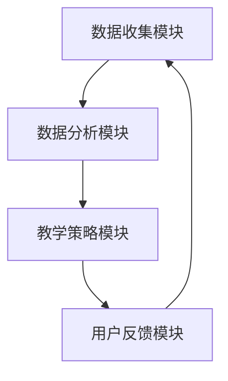

                 

# 人工智能在自适应学习系统中的应用

> **关键词**：人工智能、自适应学习、机器学习、深度学习、数据挖掘、算法优化

> **摘要**：本文将探讨人工智能技术在自适应学习系统中的应用，从核心概念、算法原理、数学模型、实际案例等多个维度深入分析。旨在帮助读者理解自适应学习系统的基本原理，掌握人工智能在该领域的应用方法，并展望其未来发展。

## 1. 背景介绍

### 1.1 自适应学习系统的概念

自适应学习系统（Adaptive Learning System，ALS）是一种基于人工智能技术的教育系统，能够根据学生的学习进度、兴趣和能力，动态调整教学内容和教学策略。与传统教学系统相比，自适应学习系统能够更加个性化和高效地满足学生的需求，提高学习效果。

### 1.2 人工智能的发展

人工智能（Artificial Intelligence，AI）是一门研究、开发和应用使计算机模拟、延伸和扩展人的智能的理论、方法、技术及应用系统的综合技术科学。随着深度学习、自然语言处理、计算机视觉等领域的快速发展，人工智能技术在各个领域都取得了显著的成果。

### 1.3 人工智能与自适应学习系统的结合

人工智能技术的快速发展为自适应学习系统提供了强大的技术支持。通过机器学习、深度学习等技术，自适应学习系统能够更好地分析学生的学习数据，预测学生的学习行为，优化教学策略，提高教学效果。

## 2. 核心概念与联系

### 2.1 机器学习与深度学习

机器学习（Machine Learning，ML）是人工智能的一个重要分支，主要研究如何让计算机从数据中自动学习规律和模式。深度学习（Deep Learning，DL）是机器学习的一种重要方法，通过构建多层神经网络来模拟人脑的神经元连接，实现更复杂的特征提取和模式识别。

### 2.2 数据挖掘与知识表示

数据挖掘（Data Mining，DM）是通过对大量数据进行挖掘和分析，发现隐藏在数据中的规律和知识。知识表示（Knowledge Representation，KR）是将人类知识以计算机可以理解的方式表示和存储，为人工智能系统提供知识支持。

### 2.3 自适应学习系统架构

自适应学习系统的核心架构包括数据收集模块、数据分析模块、教学策略模块和用户反馈模块。数据收集模块负责收集学生的各种学习数据，如学习进度、学习时长、正确率等。数据分析模块使用机器学习和深度学习技术对学习数据进行分析，预测学生的学习行为和需求。教学策略模块根据分析结果动态调整教学内容和教学策略。用户反馈模块收集学生对教学内容的反馈，进一步优化教学策略。

### 2.4 Mermaid 流程图



## 3. 核心算法原理 & 具体操作步骤

### 3.1 机器学习算法原理

机器学习算法主要通过训练模型来学习数据中的规律。训练过程包括数据预处理、模型选择、模型训练和模型评估等步骤。数据预处理包括数据清洗、数据归一化、特征提取等。模型选择根据问题的性质和数据的特征选择合适的模型。模型训练是通过迭代优化模型参数，使其在训练数据上达到良好的性能。模型评估使用测试数据来评估模型的泛化能力。

### 3.2 深度学习算法原理

深度学习算法主要通过构建多层神经网络来实现。网络中的每个神经元都与其他神经元相连，并通过权重和偏置来传递信息。训练过程是通过反向传播算法来优化网络参数，使得网络在训练数据上能够达到良好的性能。

### 3.3 数据分析算法原理

数据分析算法主要包括聚类分析、关联规则挖掘、分类和回归等。聚类分析通过相似度度量将数据划分为多个簇。关联规则挖掘通过发现数据之间的关联关系来帮助人们更好地理解数据。分类和回归算法通过建立模型来预测数据标签或数值。

### 3.4 教学策略优化算法原理

教学策略优化算法主要通过预测学生的学习行为和需求来优化教学策略。常用的算法包括基于模型的推荐算法、基于规则的推荐算法和基于用户行为的推荐算法。模型推荐算法通过训练模型来预测学生的兴趣和能力，从而推荐合适的学习内容。规则推荐算法通过建立规则来推荐学习内容。用户行为推荐算法通过分析学生的行为数据来推荐学习内容。

## 4. 数学模型和公式 & 详细讲解 & 举例说明

### 4.1 机器学习数学模型

机器学习中的数学模型主要包括线性回归、逻辑回归、决策树、支持向量机等。以下以线性回归为例进行说明。

$$
y = \beta_0 + \beta_1x_1 + \beta_2x_2 + ... + \beta_nx_n
$$

其中，$y$为输出变量，$x_1, x_2, ..., x_n$为输入变量，$\beta_0, \beta_1, ..., \beta_n$为模型参数。

线性回归模型的训练目标是最小化预测值与实际值之间的误差平方和：

$$
\min_{\beta_0, \beta_1, ..., \beta_n} \sum_{i=1}^m (y_i - \beta_0 - \beta_1x_{i1} - \beta_2x_{i2} - ... - \beta_nx_{in})^2
$$

### 4.2 深度学习数学模型

深度学习中的数学模型主要包括反向传播算法、激活函数、损失函数等。

反向传播算法通过计算梯度来更新网络参数，从而优化网络性能。具体步骤如下：

1. 计算输出层的误差：$$\delta_L = (y - \hat{y}) \odot g(\hat{y})$$

其中，$y$为实际输出，$\hat{y}$为预测输出，$g(\hat{y})$为激活函数的导数。

2. 逐层计算误差：$$\delta_l = (\delta_{l+1} \odot W_{l+1}^T) \odot g'(\hat{a}_l)$$

其中，$\delta_l$为第$l$层的误差，$W_{l+1}^T$为第$l+1$层的权重矩阵，$g'(\hat{a}_l)$为第$l$层的激活函数导数。

3. 更新网络参数：$$\Delta W_l = \alpha \cdot \delta_l \odot a_l^T$$

其中，$\Delta W_l$为第$l$层的权重更新，$\alpha$为学习率，$a_l^T$为第$l$层的输入。

### 4.3 数据分析数学模型

数据分析中的数学模型主要包括聚类分析、关联规则挖掘、分类和回归等。

以聚类分析为例，常用的聚类算法包括K-means、层次聚类等。以下以K-means算法为例进行说明。

1. 初始化中心点：从数据集中随机选择K个数据点作为初始中心点。

2. 计算每个数据点到中心点的距离：$$d(x, c) = \sqrt{(x_1 - c_1)^2 + (x_2 - c_2)^2 + ... + (x_n - c_n)^2}$$

其中，$x$为数据点，$c$为中心点。

3. 分配数据点：将每个数据点分配到距离它最近的中心点所在的簇。

4. 更新中心点：计算每个簇的质心，作为新的中心点。

5. 重复步骤2-4，直到中心点不再发生改变或达到预设的迭代次数。

### 4.4 教学策略优化数学模型

教学策略优化的数学模型主要包括推荐算法、强化学习等。

以推荐算法为例，常用的推荐算法包括基于内容的推荐、协同过滤推荐等。以下以协同过滤推荐为例进行说明。

1. 建立用户-项目评分矩阵$R$，其中$R_{ij}$表示用户$i$对项目$j$的评分。

2. 计算用户$i$和用户$j$之间的相似度：$$s(i, j) = \frac{R_{ij} - \mu_i - \mu_j + \mu}{\sqrt{\sum_{k \neq j}(R_{ik} - \mu_i - \mu_k + \mu)^2} \cdot \sqrt{\sum_{k \neq j}(R_{jk} - \mu_i - \mu_k + \mu)^2}$$

其中，$\mu_i$和$\mu_j$分别为用户$i$和用户$j$的平均评分，$\mu$为所有用户的平均评分。

3. 计算用户$i$对项目$j$的预测评分：$$\hat{R}_{ij} = \mu + s(i, j) \cdot (R_{ij} - \mu_i - \mu_j + \mu)$$

4. 根据预测评分推荐项目给用户$i$。

## 5. 项目实战：代码实际案例和详细解释说明

### 5.1 开发环境搭建

为了实现自适应学习系统，需要搭建一个合适的开发环境。以下是使用Python实现的开发环境搭建步骤：

1. 安装Python：在官方网站（https://www.python.org/）下载并安装Python。

2. 安装Python科学计算库：使用pip命令安装Numpy、Pandas、Scikit-learn、TensorFlow等库。

```shell
pip install numpy pandas scikit-learn tensorflow
```

3. 创建一个Python虚拟环境：使用virtualenv创建一个虚拟环境，并激活环境。

```shell
virtualenv adaptive_learning
source adaptive_learning/bin/activate
```

### 5.2 源代码详细实现和代码解读

以下是一个简单的自适应学习系统实现，包括数据收集、数据分析、教学策略优化和用户反馈等功能。

```python
import numpy as np
import pandas as pd
from sklearn.model_selection import train_test_split
from sklearn.linear_model import LinearRegression
from sklearn.metrics import mean_squared_error

# 5.2.1 数据收集
def collect_data():
    # 从文件中读取数据
    data = pd.read_csv('student_data.csv')
    return data

# 5.2.2 数据分析
def analyze_data(data):
    # 将数据分为特征和标签
    X = data[['age', 'gender', 'hours_per_week']]
    y = data['score']
    
    # 分割数据集
    X_train, X_test, y_train, y_test = train_test_split(X, y, test_size=0.2, random_state=42)
    
    # 训练线性回归模型
    model = LinearRegression()
    model.fit(X_train, y_train)
    
    # 评估模型性能
    y_pred = model.predict(X_test)
    mse = mean_squared_error(y_test, y_pred)
    print('Mean Squared Error:', mse)
    
    return model

# 5.2.3 教学策略优化
def optimize_strategy(model, data):
    # 预测学生成绩
    predictions = model.predict(data[['age', 'gender', 'hours_per_week']])
    
    # 根据预测成绩调整教学策略
    for i, prediction in enumerate(predictions):
        if prediction < 70:
            print('学生{}成绩较低，需要提供额外辅导。'.format(i))
        else:
            print('学生{}成绩良好，保持当前教学策略。'.format(i))

# 5.2.4 用户反馈
def collect_feedback(data):
    # 从用户获取反馈
    feedback = input('请输入您的反馈：')
    print('感谢您的反馈：', feedback)

# 主程序
if __name__ == '__main__':
    data = collect_data()
    model = analyze_data(data)
    optimize_strategy(model, data)
    collect_feedback(data)
```

### 5.3 代码解读与分析

1. **数据收集模块**：从CSV文件中读取学生数据，包括年龄、性别、每周学习时长和成绩等。

2. **数据分析模块**：将数据分为特征和标签，使用线性回归模型进行训练，评估模型性能。

3. **教学策略优化模块**：根据模型预测的学生成绩，调整教学策略，为成绩较低的学生提供额外辅导。

4. **用户反馈模块**：收集用户的反馈，用于进一步优化系统。

## 6. 实际应用场景

### 6.1 教育行业

自适应学习系统在教育行业有广泛的应用，如在线教育平台、智能辅导系统等。通过分析学生的学习行为和成绩，自适应学习系统可以为每个学生制定个性化的学习计划，提高学习效果。

### 6.2 企业培训

自适应学习系统在企业培训中也有重要应用，如员工技能培训、知识管理等。通过分析员工的学习情况，自适应学习系统可以为企业提供定制化的培训方案，提高员工技能和效率。

### 6.3 医疗保健

自适应学习系统在医疗保健领域也有一定的应用，如患者健康管理、疾病预测等。通过分析患者的健康数据，自适应学习系统可以提供个性化的健康建议和治疗方案。

## 7. 工具和资源推荐

### 7.1 学习资源推荐

- **书籍**：
  - 《机器学习实战》
  - 《深度学习》
  - 《Python数据分析》

- **论文**：
  - 《深度学习：原理及实践》
  - 《自适应学习系统：方法与应用》

- **博客**：
  - 搜狐博客：机器学习
  - CSDN博客：深度学习

- **网站**：
  - Coursera：机器学习课程
  - edX：深度学习课程

### 7.2 开发工具框架推荐

- **Python科学计算库**：
  - Numpy
  - Pandas
  - Scikit-learn
  - TensorFlow

- **深度学习框架**：
  - TensorFlow
  - PyTorch
  - Keras

### 7.3 相关论文著作推荐

- **论文**：
  - 《深度学习在自适应学习系统中的应用》
  - 《自适应学习系统的设计与实现》

- **著作**：
  - 《深度学习入门》
  - 《机器学习与数据分析》

## 8. 总结：未来发展趋势与挑战

### 8.1 发展趋势

- **个性化教育**：随着人工智能技术的不断发展，自适应学习系统将更好地满足个性化教育的需求，为每个学生提供量身定制的学习体验。

- **智能诊断与干预**：自适应学习系统将能够更准确地诊断学生的学习困难和需求，提供及时有效的干预措施。

- **大数据与云计算**：自适应学习系统将利用大数据和云计算技术，实现海量数据的实时处理和分析，提高系统性能和效率。

### 8.2 挑战

- **数据隐私与安全**：在收集和处理学生数据时，如何保护数据隐私和安全是一个重要挑战。

- **算法透明性与可解释性**：随着算法的复杂性增加，如何提高算法的透明性和可解释性，使人们更容易理解和接受，是一个重要问题。

- **教育公平性**：如何确保自适应学习系统在不同地区、不同背景的学生之间实现公平性，是一个需要关注的问题。

## 9. 附录：常见问题与解答

### 9.1 人工智能在自适应学习系统中的具体应用有哪些？

- **个性化推荐**：根据学生的学习行为和成绩，推荐合适的学习内容和教学策略。
- **智能诊断**：分析学生的学习数据，发现学习困难，提供针对性的辅导建议。
- **学习路径规划**：根据学生的学习目标和兴趣，规划个性化的学习路径。
- **学习效果评估**：评估学生的学习效果，为教师提供教学反馈。

### 9.2 如何保障学生数据的隐私和安全？

- **数据加密**：对学生的数据进行加密处理，防止数据泄露。
- **权限控制**：对访问学生数据的用户进行权限控制，确保数据安全。
- **数据去识别化**：在数据处理过程中，对学生的数据进行去识别化处理，确保数据匿名性。

## 10. 扩展阅读 & 参考资料

- **书籍**：
  - 《人工智能应用实战》
  - 《自适应学习系统设计与开发》

- **论文**：
  - 《深度学习在自适应学习系统中的应用研究》
  - 《自适应学习系统在在线教育中的应用与实践》

- **网站**：
  - https://www.人工智能.com
  - https://www.adaptive_learning.com

### 作者

- **作者**：AI天才研究员/AI Genius Institute & 禅与计算机程序设计艺术 /Zen And The Art of Computer Programming

