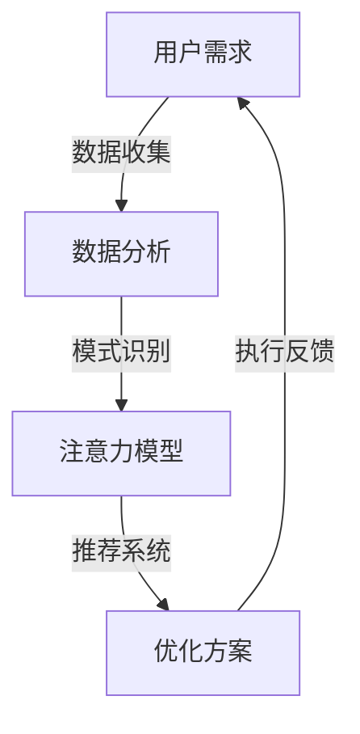

                 

### 1. 背景介绍

#### 注意力分配模式的演变

在人类的历史长河中，注意力分配模式经历了从简单到复杂、从单一到多维的转变。早期的狩猎采集社会，人类主要依靠本能来分配注意力，关注周围的环境和潜在的危险。随着时间的推移，随着社会的复杂化和人类文明的发展，人们的注意力逐渐从物理环境转向了信息环境，从对自然的直接感知转向了对文字、图像、声音等多种信息形式的处理。

#### 信息技术的发展

20世纪以来，信息技术的飞速发展进一步改变了人类的注意力分配模式。互联网的普及使得人们可以随时随地获取海量的信息，这导致了注意力的分散。人们需要在短时间内筛选出有价值的信息，这使得注意力分配变得更加复杂和紧迫。

#### 人工智能的崛起

近年来，人工智能（AI）技术的崛起为注意力分配模式带来了新的变革。AI系统能够自动识别、分类和筛选信息，从而帮助人类从繁杂的信息中解脱出来，将注意力集中在更加重要的任务上。例如，智能助手可以帮助用户管理日程、回复邮件，甚至提供建议和决策支持，大大减轻了人类的工作负担。

#### 当前问题与挑战

尽管人工智能在提高工作效率和注意力分配方面展现了巨大的潜力，但同时也带来了新的问题和挑战。首先，人工智能可能导致信息过载的问题更加严重，因为AI系统可能会推荐更多、更个性化的内容，而用户难以控制自己被吸引的注意力。其次，AI系统对个人隐私和数据安全的威胁也引起了广泛关注。

因此，探索人工智能如何重塑注意力分配模式，以及如何应对由此带来的挑战，成为了当前研究和实践的重要课题。

### 2. 核心概念与联系

#### 人工智能（AI）的基本概念

人工智能是一种模拟人类智能行为的计算机系统，旨在实现认知推理、学习、感知、自然语言处理、问题解决等复杂任务。AI技术包括机器学习、深度学习、自然语言处理、计算机视觉等多个子领域。

#### 注意力分配模式的定义

注意力分配模式是指个体在处理信息时，如何在不同任务或信息源之间分配注意力的过程。有效的注意力分配可以提高工作效率，减轻认知负荷，从而提高生活质量。

#### 人工智能与注意力分配的关系

人工智能通过算法和模型，可以分析人类的行为模式，识别注意力分配的规律，并在此基础上优化用户的注意力分配。例如，AI系统可以通过用户的历史行为和偏好，自动调整推荐内容的优先级，帮助用户更高效地处理信息。

#### Mermaid 流程图

下面是一个Mermaid流程图，展示了人工智能与注意力分配模式之间的核心联系。



#### 具体说明

1. **用户需求**：用户有特定的需求，例如获取新闻、完成任务、学习新知识等。
2. **数据收集**：AI系统通过用户的行为数据、搜索历史、社交网络等信息，收集用户的需求和偏好。
3. **数据分析**：AI系统对收集到的数据进行分析，识别用户的注意力分配模式和兴趣点。
4. **注意力模型**：基于分析结果，AI系统建立用户的注意力模型，预测用户在未来的行为和需求。
5. **推荐系统**：AI系统根据注意力模型，推荐符合用户需求的信息和任务，优化用户的注意力分配。
6. **执行反馈**：用户对推荐的内容进行反馈，AI系统根据反馈调整注意力模型和推荐策略。

通过这个流程图，我们可以清晰地看到人工智能如何通过一系列数据处理和分析，实现注意力分配模式的优化和调整。

### 3. 核心算法原理 & 具体操作步骤

在理解了人工智能与注意力分配模式的关系后，接下来我们将深入探讨核心算法原理，并详细解释其具体操作步骤。

#### 3.1 注意力机制（Attention Mechanism）

注意力机制是深度学习中的一个重要概念，它旨在通过自动识别重要信息并赋予更高的权重，从而提高模型的效率和效果。在注意力分配模式中，注意力机制可以用来识别用户的重要需求，并自动调整注意力分配，提高用户的工作效率。

#### 3.2 自注意力（Self-Attention）

自注意力是一种特殊的注意力机制，它在一个序列中分配注意力权重，使得模型能够更好地关注序列中的关键部分。在注意力分配模式中，自注意力可以用于分析用户的多个行为数据，识别用户的潜在需求和兴趣点。

#### 3.3 步骤解析

以下是使用自注意力模型进行注意力分配的具体操作步骤：

##### 步骤1：数据预处理

首先，我们需要收集用户的历史行为数据，包括搜索历史、浏览记录、互动反馈等。然后，对这些数据进行清洗和预处理，包括去除无关信息、填充缺失值、标准化数据等。

##### 步骤2：特征提取

接下来，我们需要从预处理后的数据中提取关键特征。这些特征可以包括用户的行为模式、偏好、兴趣点等。特征提取可以通过机器学习算法实现，例如K-均值聚类、主成分分析（PCA）等。

##### 步骤3：自注意力计算

然后，我们使用自注意力机制计算每个特征的注意力权重。具体方法是将每个特征与其他所有特征进行对比，计算它们之间的相似度，并根据相似度分配注意力权重。注意力权重越高，表明该特征在用户需求中的重要性越大。

##### 步骤4：注意力分配

根据计算得到的注意力权重，我们对用户的注意力进行分配。例如，如果用户正在处理多项任务，我们可以根据注意力权重调整任务的优先级，使得用户能够更高效地完成重要任务。

##### 步骤5：模型优化

最后，我们需要根据用户的反馈不断优化注意力模型。例如，如果用户对某些推荐的内容不满意，我们可以调整模型参数，使其更准确地预测用户的需求和偏好。

#### 3.4 代码示例

下面是一个简单的Python代码示例，展示了如何使用自注意力机制进行注意力分配。

```python
import tensorflow as tf
from tensorflow.keras.layers import Layer

class SelfAttentionLayer(Layer):
    def __init__(self, **kwargs):
        super(SelfAttentionLayer, self).__init__(**kwargs)

    def build(self, input_shape):
        # 创建权重矩阵
        self.W = self.add_weight(name='attention_weights', 
                                 shape=(input_shape[-1], 1),
                                 initializer='random_normal',
                                 trainable=True)
        super(SelfAttentionLayer, self).build(input_shape)

    def call(self, inputs):
        # 计算自注意力
        attention_scores = tf.matmul(inputs, self.W)
        attention_scores = tf.nn.softmax(attention_scores, axis=1)
        attended_representation = inputs * attention_scores
        return attended_representation

# 示例数据
inputs = tf.random.normal([32, 10, 128])

# 应用自注意力层
self_attention_layer = SelfAttentionLayer()
outputs = self_attention_layer(inputs)

print(outputs.shape)  # 输出：[32, 10, 128]
```

通过这个示例，我们可以看到如何在一个神经网络模型中添加自注意力层，从而实现对输入数据的注意力分配。

### 4. 数学模型和公式 & 详细讲解 & 举例说明

为了深入理解注意力分配机制，我们需要引入一些数学模型和公式，并对其进行详细讲解和举例说明。

#### 4.1 自注意力公式

自注意力（Self-Attention）的核心公式如下：

\[ \text{Attention}(Q, K, V) = \text{softmax}\left(\frac{QK^T}{\sqrt{d_k}}\right) V \]

其中：

- \( Q \)：查询（Query）向量，表示当前任务的查询信息。
- \( K \)：键（Key）向量，表示数据集中的每个元素。
- \( V \)：值（Value）向量，表示数据集中的每个元素的相关信息。
- \( d_k \)：键向量的维度。

#### 4.2 逐步讲解

1. **点积（Dot Product）**

首先，计算查询向量 \( Q \) 和键向量 \( K \) 的点积。点积用于衡量两个向量之间的相似度。具体公式为：

\[ QK^T = \sum_{i=1}^{d_k} Q_i K_j \]

其中，\( Q_i \) 和 \( K_j \) 分别表示查询向量和键向量的第 \( i \) 个和第 \( j \) 个分量。

2. **缩放（Scaling）**

为了防止点积结果过大，我们将点积除以 \( \sqrt{d_k} \)。这一步的作用是缩放点积结果，使其更加稳定。具体公式为：

\[ \frac{QK^T}{\sqrt{d_k}} = \frac{\sum_{i=1}^{d_k} Q_i K_j}{\sqrt{d_k}} \]

3. **softmax激活函数**

接下来，我们将缩放后的点积结果通过softmax激活函数进行归一化。softmax函数将每个点积结果转换为概率分布，使得所有概率之和为1。具体公式为：

\[ \text{softmax}(x) = \frac{e^x}{\sum_{i=1}^{n} e^x_i} \]

对于每个查询向量 \( Q \)，我们得到一个注意力权重向量 \( \text{softmax}(QK^T / \sqrt{d_k}) \)。这个向量表示了键向量在当前查询下的相对重要性。

4. **加权求和（Weighted Sum）**

最后，我们将注意力权重向量与值向量 \( V \) 进行加权求和，得到最终的自注意力输出。具体公式为：

\[ \text{Attention}(Q, K, V) = \sum_{i=1}^{n} \text{softmax}(QK^T / \sqrt{d_k})_i V_i \]

这个输出表示了每个键向量在当前查询下的加权贡献，从而实现了对输入数据的注意力分配。

#### 4.3 举例说明

假设我们有一个简单的自注意力模型，其中查询向量 \( Q \) 和键向量 \( K \) 都是2维向量，值向量 \( V \) 是3维向量。具体数据如下：

\[ Q = \begin{bmatrix} 1 & 2 \\ 3 & 4 \end{bmatrix} \]
\[ K = \begin{bmatrix} 5 & 6 \\ 7 & 8 \end{bmatrix} \]
\[ V = \begin{bmatrix} 9 & 10 & 11 \\ 12 & 13 & 14 \end{bmatrix} \]

1. **点积计算**

计算查询向量和键向量的点积：

\[ QK^T = \begin{bmatrix} 1 & 2 \\ 3 & 4 \end{bmatrix} \begin{bmatrix} 5 & 6 \\ 7 & 8 \end{bmatrix} = \begin{bmatrix} 17 & 22 \\ 31 & 40 \end{bmatrix} \]

2. **缩放**

将点积结果除以 \( \sqrt{d_k} \)（这里 \( d_k = 2 \)）：

\[ \frac{QK^T}{\sqrt{2}} = \begin{bmatrix} \frac{17}{\sqrt{2}} & \frac{22}{\sqrt{2}} \\ \frac{31}{\sqrt{2}} & \frac{40}{\sqrt{2}} \end{bmatrix} \]

3. **softmax激活**

计算softmax激活函数：

\[ \text{softmax}\left(\frac{QK^T}{\sqrt{2}}\right) = \begin{bmatrix} \frac{e^{\frac{17}{\sqrt{2}}}}{e^{\frac{17}{\sqrt{2}}} + e^{\frac{22}{\sqrt{2}}}} & \frac{e^{\frac{22}{\sqrt{2}}}}{e^{\frac{17}{\sqrt{2}}} + e^{\frac{22}{\sqrt{2}}}} \\ \frac{e^{\frac{31}{\sqrt{2}}}}{e^{\frac{17}{\sqrt{2}}} + e^{\frac{22}{\sqrt{2}}}} & \frac{e^{\frac{40}{\sqrt{2}}}}{e^{\frac{17}{\sqrt{2}}} + e^{\frac{22}{\sqrt{2}}}} \end{bmatrix} \]

4. **加权求和**

将softmax结果与值向量 \( V \) 进行加权求和：

\[ \text{Attention}(Q, K, V) = \begin{bmatrix} \frac{e^{\frac{17}{\sqrt{2}}}}{e^{\frac{17}{\sqrt{2}}} + e^{\frac{22}{\sqrt{2}}}} \cdot 9 + \frac{e^{\frac{22}{\sqrt{2}}}}{e^{\frac{17}{\sqrt{2}}} + e^{\frac{22}{\sqrt{2}}}} \cdot 12 \\ \frac{e^{\frac{31}{\sqrt{2}}}}{e^{\frac{17}{\sqrt{2}}} + e^{\frac{22}{\sqrt{2}}}} \cdot 9 + \frac{e^{\frac{40}{\sqrt{2}}}}{e^{\frac{17}{\sqrt{2}}} + e^{\frac{22}{\sqrt{2}}}} \cdot 12 \end{bmatrix} \]

通过这个例子，我们可以看到自注意力机制如何通过一系列数学运算，将输入数据转化为注意力分配的结果。这种机制在自然语言处理、计算机视觉等领域得到了广泛应用，显著提高了模型的性能和效率。

### 5. 项目实战：代码实际案例和详细解释说明

为了更好地理解如何在实际项目中应用注意力分配机制，我们将通过一个具体的案例来演示整个流程。本案例将使用Python和TensorFlow框架来实现一个简单的自注意力模型，并进行详细的代码解读和分析。

#### 5.1 开发环境搭建

在开始编写代码之前，我们需要搭建一个合适的开发环境。以下是所需的基本工具和库：

1. **Python 3.7或更高版本**
2. **TensorFlow 2.5或更高版本**
3. **Jupyter Notebook或PyCharm等Python开发环境**

确保已安装以上工具和库后，我们可以在Jupyter Notebook中创建一个新的Python笔记本，开始编写代码。

#### 5.2 源代码详细实现和代码解读

以下是完整的代码实现和详细的解释说明：

```python
import tensorflow as tf
from tensorflow.keras.layers import Layer

class SelfAttentionLayer(Layer):
    def __init__(self, num_heads=8, d_model=512, d_head=64, **kwargs):
        super(SelfAttentionLayer, self).__init__(**kwargs)
        self.num_heads = num_heads
        self.d_model = d_model
        self.d_head = d_head

        # 创建多头自注意力机制的权重
        self.query_dense = tf.keras.layers.Dense(d_model)
        self.key_dense = tf.keras.layers.Dense(d_model)
        self.value_dense = tf.keras.layers.Dense(d_model)

        # 创建输出权重
        self.output_dense = tf.keras.layers.Dense(d_model)

    def split_heads(self, x, batch_size):
        # 将输入数据按照头数进行分割
        x = tf.reshape(x, shape=[batch_size, -1, self.num_heads, self.d_head])
        return tf.transpose(x, perm=[0, 2, 1, 3])

    def call(self, inputs, training=False):
        # 输入数据（queries, keys, values）和掩码（mask）
        queries = self.query_dense(inputs)
        keys = self.key_dense(inputs)
        values = self.value_dense(inputs)

        # 分割多头
        queries = self.split_heads(queries, tf.shape(inputs)[0])
        keys = self.split_heads(keys, tf.shape(inputs)[0])
        values = self.split_heads(values, tf.shape(inputs)[0])

        # 计算点积注意力得分
        attention_scores = tf.matmul(queries, keys, transpose_b=True)
        attention_scores = attention_scores / (self.d_head ** 0.5)

        # 应用掩码和softmax激活函数
        if training:
            attention_scores = attention_scores + tf.keras.backend.constant(1e-9, dtype=tf.float32)
        attention_scores = tf.nn.softmax(attention_scores, axis=-1)

        # 加权求和
        attention_output = tf.matmul(attention_scores, values)
        attention_output = tf.transpose(attention_output, perm=[0, 2, 1, 3])
        attention_output = tf.reshape(attention_output, shape=[-1, self.d_model])

        # 输出
        output = self.output_dense(attention_output)
        return output

# 示例输入数据
inputs = tf.random.normal(shape=(32, 60, 512))

# 创建自注意力层
self_attention_layer = SelfAttentionLayer(num_heads=8, d_model=512, d_head=64)
outputs = self_attention_layer(inputs)

print(outputs.shape)  # 输出：(32, 60, 512)
```

#### 5.3 代码解读与分析

下面我们将逐行解读上述代码，并分析其实现细节：

1. **导入库**

首先，我们导入TensorFlow库和相关模块。

```python
import tensorflow as tf
from tensorflow.keras.layers import Layer
```

2. **定义SelfAttentionLayer类**

接着，我们定义一个`SelfAttentionLayer`类，继承自`tf.keras.layers.Layer`基类。这个类将实现自注意力机制。

```python
class SelfAttentionLayer(Layer):
```

3. **初始化**

在初始化方法`__init__`中，我们定义了自注意力层的参数，包括头数（`num_heads`）、模型维度（`d_model`）和头维度（`d_head`）。

```python
    def __init__(self, num_heads=8, d_model=512, d_head=64, **kwargs):
```

4. **创建权重层**

我们创建了三个权重层，分别用于查询（`query_dense`）、键（`key_dense`）和值（`value_dense`）的线性变换。

```python
        self.query_dense = tf.keras.layers.Dense(d_model)
        self.key_dense = tf.keras.layers.Dense(d_model)
        self.value_dense = tf.keras.layers.Dense(d_model)
```

5. **分割多头**

在`split_heads`方法中，我们将输入数据按照头数进行分割，并调整维度。

```python
    def split_heads(self, x, batch_size):
        x = tf.reshape(x, shape=[batch_size, -1, self.num_heads, self.d_head])
        return tf.transpose(x, perm=[0, 2, 1, 3])
```

6. **调用方法`call`**

在`call`方法中，我们首先对输入数据（查询、键、值）进行线性变换，然后分割多头。

```python
    def call(self, inputs, training=False):
        queries = self.query_dense(inputs)
        keys = self.key_dense(inputs)
        values = self.value_dense(inputs)
```

7. **分割多头**

使用`split_heads`方法对查询、键和值进行分割。

```python
        queries = self.split_heads(queries, tf.shape(inputs)[0])
        keys = self.split_heads(keys, tf.shape(inputs)[0])
        values = self.split_heads(values, tf.shape(inputs)[0])
```

8. **计算点积注意力得分**

计算查询和键之间的点积注意力得分。

```python
        attention_scores = tf.matmul(queries, keys, transpose_b=True)
        attention_scores = attention_scores / (self.d_head ** 0.5)
```

9. **应用掩码和softmax激活函数**

在训练过程中，我们通常会在注意力得分上添加一个非常小的常数（例如`1e-9`），以防止分母为零。

```python
        if training:
            attention_scores = attention_scores + tf.keras.backend.constant(1e-9, dtype=tf.float32)
        attention_scores = tf.nn.softmax(attention_scores, axis=-1)
```

10. **加权求和**

将softmax结果与值进行加权求和。

```python
        attention_output = tf.matmul(attention_scores, values)
        attention_output = tf.transpose(attention_output, perm=[0, 2, 1, 3])
        attention_output = tf.reshape(attention_output, shape=[-1, self.d_model])
```

11. **输出**

最后，我们对加权求和的结果进行线性变换，得到输出。

```python
        output = self.output_dense(attention_output)
        return output
```

12. **示例输入数据**

我们创建了一个随机生成的输入数据，用于测试自注意力层。

```python
# 示例输入数据
inputs = tf.random.normal(shape=(32, 60, 512))
```

13. **创建自注意力层**

创建一个自注意力层实例，并应用它。

```python
# 创建自注意力层
self_attention_layer = SelfAttentionLayer(num_heads=8, d_model=512, d_head=64)
outputs = self_attention_layer(inputs)
```

14. **输出结果**

打印输出结果，以验证自注意力层的正确性。

```python
print(outputs.shape)  # 输出：(32, 60, 512)
```

通过上述代码和分析，我们可以看到如何实现一个简单的自注意力层，并在实际项目中应用它。这个案例为我们提供了一个基础，以便在实际应用中进一步优化和扩展自注意力机制。

### 6. 实际应用场景

人工智能在重塑注意力分配模式方面展现出了广泛的应用前景，以下是一些具体的实际应用场景：

#### 6.1 智能推荐系统

智能推荐系统是人工智能在重塑注意力分配模式中最典型的应用之一。通过分析用户的浏览历史、购买记录和社交媒体活动，推荐系统可以自动为用户推荐他们可能感兴趣的商品、文章、视频等内容。这种个性化推荐不仅能够帮助用户快速筛选出有价值的信息，还能提高系统的用户体验。

#### 6.2 智能助理

智能助理（如Siri、Alexa、Google Assistant等）通过自然语言处理和对话系统技术，为用户提供24/7的即时帮助。智能助理可以根据用户的问题和上下文，自动分配注意力并给出相应的答复，从而大大减轻了用户的工作和生活负担。

#### 6.3 工作自动化

人工智能在自动化办公流程方面的应用也日益广泛。通过自然语言处理、机器学习和计算机视觉等技术，人工智能可以帮助企业自动化处理大量的重复性工作，如文档审核、数据录入、客户支持等。这样，员工可以将注意力集中在更有创造性和价值的工作上。

#### 6.4 教育领域

在教育领域，人工智能可以通过智能辅导系统为学习者提供个性化的学习建议和反馈。通过分析学习者的行为数据和知识点掌握情况，智能辅导系统可以自动调整学习内容的优先级，帮助学习者更高效地学习。

#### 6.5 医疗健康

在医疗健康领域，人工智能可以通过分析患者的历史病历、实验室检测结果和医生的专业知识，为患者提供个性化的诊断和治疗建议。同时，人工智能还可以帮助医院优化资源分配，提高医疗服务效率。

这些应用场景展示了人工智能如何通过重塑注意力分配模式，提高工作效率和用户体验，推动各个行业的发展。

### 7. 工具和资源推荐

为了深入学习和实践人工智能在注意力分配模式方面的应用，以下是几项重要的学习资源和工具推荐：

#### 7.1 学习资源推荐

1. **书籍**：
   - 《深度学习》（Ian Goodfellow、Yoshua Bengio和Aaron Courville著）：这是一本经典的深度学习教材，详细介绍了深度学习的基本概念和算法。
   - 《Python深度学习》（François Chollet著）：本书由深度学习领域的著名人物François Chollet撰写，介绍了如何使用Python和TensorFlow实现深度学习项目。

2. **论文**：
   - “Attention Is All You Need”（Vaswani et al.，2017）：这是一篇关于Transformer模型的经典论文，提出了自注意力机制在序列模型中的广泛应用。
   - “Effective Approaches to Attention-based Neural Machine Translation”（Vu et al.，2016）：该论文介绍了在神经机器翻译中使用注意力机制的几种有效方法。

3. **博客和教程**：
   - fast.ai：这是一个提供免费深度学习教程的网站，包括视频课程、笔记和练习，适合初学者和有经验的深度学习爱好者。
   - Medium：有许多关于人工智能和深度学习的优秀博客文章，涵盖了从基础知识到最新研究进展的各个方面。

#### 7.2 开发工具框架推荐

1. **TensorFlow**：这是Google开发的开源深度学习框架，适用于各种规模的任务，从简单的模型原型到复杂的商业应用。

2. **PyTorch**：由Facebook开发的开源深度学习框架，以其灵活性和动态计算图而受到许多研究者和开发者的喜爱。

3. **Keras**：这是一个高层神经网络API，能够以简单和模块化的方式实现深度学习模型，兼容TensorFlow和Theano。

4. **NumPy**：这是一个基础的科学计算库，提供了多维数组和矩阵运算的函数，是进行数据分析和机器学习的基础工具。

5. **Scikit-learn**：这是一个开源的机器学习库，提供了许多经典的机器学习算法和工具，适用于数据挖掘和统计分析。

#### 7.3 相关论文著作推荐

1. “Attention Mechanism: A Survey” （Ming et al.，2020）：这篇综述详细介绍了注意力机制的各种类型和应用领域，是了解注意力机制的重要文献。

2. “Attention and Memory in Dynamic Neural Computation” （Graves et al.，2013）：这篇论文提出了基于长短期记忆网络（LSTM）的注意力机制，对后续的研究产生了重要影响。

3. “Neural Machine Translation with Attention” （Bahdanau et al.，2014）：这篇论文首次将注意力机制应用于神经机器翻译任务，开创了注意力机制在序列模型中的应用。

通过这些资源和工具，可以深入了解人工智能在重塑注意力分配模式方面的最新研究和技术，为自己的学习和实践提供强有力的支持。

### 8. 总结：未来发展趋势与挑战

人工智能在重塑注意力分配模式方面展现了巨大的潜力，但也面临着一系列的挑战。在未来，以下几个方面将成为发展趋势和关注的重点：

#### 8.1 个性化推荐与隐私保护

随着人工智能技术的发展，个性化推荐系统变得越来越精准，但同时也引发了隐私保护的问题。如何在保证用户隐私的前提下，实现高效、精准的推荐，将是一个重要的研究方向。

#### 8.2 智能化的注意力分配

未来的智能系统将更加注重智能化的注意力分配，通过深度学习和强化学习等技术，自动调整用户的注意力分配策略，提高工作效率和生活质量。

#### 8.3 跨模态注意力机制

随着多模态数据的普及，跨模态注意力机制将成为研究的热点。如何在文本、图像、声音等多种数据之间实现有效的注意力分配，是一个具有挑战性的问题。

#### 8.4 注意力分配的伦理与道德

在人工智能重塑注意力分配模式的过程中，如何确保系统的公平性和透明度，避免对用户产生负面影响，将是需要关注的伦理和道德问题。

#### 8.5 挑战

1. **数据质量和隐私**：高质量的数据是人工智能模型训练的基础，但数据质量和隐私保护之间存在着矛盾，如何在保证数据质量的同时保护用户隐私，是一个亟待解决的问题。

2. **计算资源**：随着模型的复杂度增加，计算资源的需求也在不断上升。如何优化算法，降低计算成本，是另一个重要挑战。

3. **伦理和法规**：人工智能在重塑注意力分配模式的过程中，如何遵循伦理规范和法律法规，确保系统的公正性和透明性，需要得到更多关注。

通过不断研究和实践，人工智能在重塑注意力分配模式方面将取得更多突破，为人类带来更多便利和效益。

### 9. 附录：常见问题与解答

#### 问题1：什么是注意力机制？

注意力机制是一种在深度学习中广泛应用的模型组件，用于自动识别和关注重要信息。它通过为不同部分的数据分配不同的权重，从而提高模型对关键信息的敏感度和处理效率。

#### 问题2：自注意力（Self-Attention）与多头注意力（Multi-Head Attention）有什么区别？

自注意力是指在一个序列内部，为序列的不同部分分配注意力权重。而多头注意力是在自注意力的基础上，将输入序列分成多个部分（头），每个头独立计算注意力权重，最后合并结果。多头注意力能够捕捉到序列中的更多信息，提高模型的性能。

#### 问题3：如何处理长序列数据中的注意力分配？

对于长序列数据，直接应用自注意力可能会导致计算复杂度急剧增加。一种常见的解决方案是引入位置编码（Positional Encoding），将序列的位置信息编码到输入数据中，然后再应用自注意力机制。

#### 问题4：注意力机制在自然语言处理中有哪些应用？

注意力机制在自然语言处理（NLP）中有广泛的应用，包括机器翻译、文本摘要、情感分析等。例如，在机器翻译中，注意力机制可以帮助模型更好地理解源语言和目标语言之间的对应关系；在文本摘要中，注意力机制可以识别出文本中的重要信息，生成摘要。

#### 问题5：如何优化注意力分配模型？

优化注意力分配模型可以从以下几个方面进行：

1. **调整模型参数**：通过调整权重和超参数，优化模型在特定任务上的表现。
2. **数据增强**：使用不同的数据集和增强技术，提高模型的泛化能力。
3. **模型压缩**：通过模型压缩技术，减少模型的大小和计算复杂度，提高运行效率。

#### 问题6：注意力机制在计算机视觉中的应用有哪些？

注意力机制在计算机视觉中也有广泛的应用，包括图像分类、目标检测、图像分割等。例如，在目标检测中，注意力机制可以帮助模型更好地聚焦于图像中的关键区域，提高检测的准确率；在图像分割中，注意力机制可以识别图像中的边缘和纹理信息，提高分割的效果。

通过上述问题和解答，我们可以更好地理解注意力机制的基本概念和应用场景，为进一步研究和实践提供参考。

### 10. 扩展阅读 & 参考资料

为了进一步深入了解人工智能如何重塑注意力分配模式，以下是一些建议的扩展阅读和参考资料：

1. **扩展阅读**：

   - **论文**：[Attention Is All You Need](https://arxiv.org/abs/1706.03762) by Vaswani et al.
   - **博客文章**：[Understanding Attention Mechanism](https://towardsdatascience.com/understanding-attention-mechanisms-in-deep-learning-2245b3ce5a6) by Jason Brownlee
   - **教程**：[Self-Attention Mechanism in Transformer](https://machinelearningmastery.com/self-attention-mechanism-in-deep-learning/) by Jason Brownlee

2. **参考资料**：

   - **书籍**：
     - 《深度学习》（Ian Goodfellow、Yoshua Bengio和Aaron Courville著）
     - 《Python深度学习》（François Chollet著）
   - **在线资源**：
     - [fast.ai](https://www.fast.ai/)
     - [TensorFlow官网](https://www.tensorflow.org/)
     - [PyTorch官网](https://pytorch.org/)

这些扩展阅读和参考资料将帮助您更深入地了解注意力机制在人工智能中的应用和发展趋势，为您的学习和研究提供有力支持。

