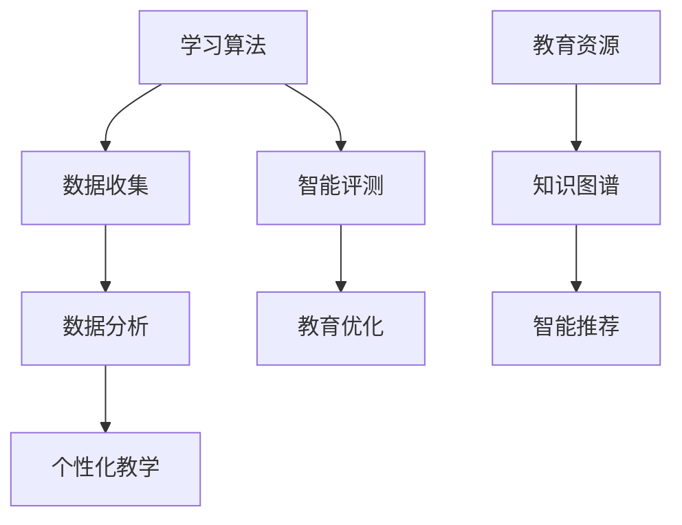

                 

# 人工智能：教育变革的催化剂

> 关键词：人工智能，教育，变革，催化剂，学习，算法，创新

> 摘要：本文将探讨人工智能技术在教育领域的应用，分析其对教育体系的变革影响，并探讨其在提高学习效率、个性化教学和终身教育方面的潜力。通过具体实例和数据分析，阐述人工智能在教育变革中的关键作用，并提出未来发展趋势与挑战。

## 1. 背景介绍

近年来，人工智能（AI）技术取得了飞速发展，从最初的机器学习到深度学习，再到自然语言处理和计算机视觉，AI已经渗透到了各个领域。在教育领域，人工智能的应用逐渐成为研究热点，其潜力被广泛认可。人工智能在教育中的应用主要包括个性化学习、智能评测、教育资源优化等方面。

### 1.1 人工智能在教育中的现状

目前，许多教育机构和学校已经开始尝试将人工智能技术应用于教学过程中。例如，一些学校引入了智能教育平台，通过大数据分析和机器学习算法，为教师和学生提供个性化的学习建议和资源。此外，智能评测系统和语音识别技术的应用，使得学生的学习效果能够更准确地评估，为教师提供实时反馈。

### 1.2 教育变革的必要性

随着社会的发展和科技的进步，传统教育模式面临着诸多挑战。例如，教育资源分配不均、学生学习效果参差不齐、教师工作负担重等问题。因此，教育变革势在必行。人工智能技术作为一种新兴技术，其在教育领域的应用有望解决上述问题，推动教育体系的变革。

## 2. 核心概念与联系

在探讨人工智能在教育中的应用时，我们需要了解一些核心概念和原理。以下是一个简单的 Mermaid 流程图，用于说明这些概念之间的联系。



### 2.1 学习算法

学习算法是人工智能的核心技术之一。通过学习算法，机器可以从大量数据中提取有用信息，用于预测和决策。在教育领域，学习算法可以用于个性化学习推荐、学生行为分析等。

### 2.2 数据收集

数据收集是人工智能应用的基础。在教育领域，数据收集主要涉及学生的学习行为、成绩、兴趣爱好等。通过收集这些数据，可以为后续的数据分析和个性化教学提供依据。

### 2.3 数据分析

数据分析是人工智能应用的重要环节。通过对收集到的数据进行分析，可以挖掘出学生的潜在需求和问题，为教师提供参考。

### 2.4 个性化教学

个性化教学是基于数据分析结果，为每个学生提供定制化的学习资源和教学策略。通过个性化教学，可以更好地满足学生的需求，提高学习效果。

### 2.5 智能评测

智能评测系统可以实时评估学生的学习效果，为教师提供反馈。通过智能评测，教师可以及时调整教学策略，提高教学效果。

### 2.6 教育优化

教育优化是通过对教育资源的优化配置，提高教育质量和效率。人工智能技术可以帮助学校和教育机构更好地管理教育资源，提高教育效益。

### 2.7 知识图谱

知识图谱是一种用于表示知识和关系的图形结构。在教育领域，知识图谱可以用于构建课程体系、知识图谱推荐等。

### 2.8 智能推荐

智能推荐是通过对用户兴趣和行为的分析，为用户推荐相关内容。在教育领域，智能推荐可以用于课程推荐、学习资源推荐等。

## 3. 核心算法原理 & 具体操作步骤

### 3.1 学习算法

学习算法主要包括监督学习、无监督学习和强化学习等。以下是一个简单的监督学习算法——线性回归的原理和操作步骤。

#### 3.1.1 线性回归原理

线性回归是一种简单的预测模型，它通过拟合一条直线来预测因变量和自变量之间的关系。其原理如下：

$$y = w_1 \cdot x_1 + w_2 \cdot x_2 + \ldots + w_n \cdot x_n + b$$

其中，$w_1, w_2, \ldots, w_n$是权重，$x_1, x_2, \ldots, x_n$是自变量，$y$是因变量，$b$是截距。

#### 3.1.2 线性回归操作步骤

1. 数据收集：收集学生成绩和对应的学习行为数据。
2. 数据预处理：对数据进行清洗、归一化等处理。
3. 模型训练：使用梯度下降算法训练线性回归模型。
4. 模型评估：使用验证集和测试集评估模型性能。
5. 模型应用：根据模型预测结果，为学生提供个性化的学习建议。

### 3.2 智能评测

智能评测系统主要基于自然语言处理技术进行实现。以下是一个简单的基于文本分类的评测算法原理和操作步骤。

#### 3.2.1 文本分类原理

文本分类是一种将文本数据分类到预定义类别中的任务。其原理如下：

$$P(y|x) = \frac{e^{\theta^T \phi(x)}}{\sum_{i=1}^K e^{\theta^T \phi(x_i)}}$$

其中，$y$是类别标签，$x$是文本数据，$\theta$是模型参数，$\phi(x)$是文本特征向量。

#### 3.2.2 文本分类操作步骤

1. 数据收集：收集学生作业、论文等文本数据。
2. 数据预处理：对文本数据进行分词、去停用词等处理。
3. 模型训练：使用文本特征向量和类别标签训练文本分类模型。
4. 模型评估：使用验证集和测试集评估模型性能。
5. 模型应用：根据模型预测结果，为学生提供评价和建议。

## 4. 数学模型和公式 & 详细讲解 & 举例说明

### 4.1 学习算法

在上一节中，我们介绍了线性回归算法的基本原理和操作步骤。接下来，我们将使用一个具体例子来说明线性回归模型的实现过程。

#### 4.1.1 线性回归例子

假设我们收集了以下学生成绩数据：

| 学生 | 数学 | 英语 | 物理 |
| ---- | ---- | ---- | ---- |
| 1    | 80   | 70   | 85   |
| 2    | 75   | 80   | 90   |
| 3    | 85   | 75   | 80   |
| 4    | 70   | 80   | 75   |

我们要预测学生的物理成绩，可以使用线性回归模型。

1. 数据预处理：

首先，我们将数据转换为矩阵形式：

$$
X = \begin{bmatrix}
1 & 80 & 70 \\
1 & 75 & 80 \\
1 & 85 & 75 \\
1 & 70 & 80 \\
\end{bmatrix}, \quad
y = \begin{bmatrix}
85 \\
90 \\
80 \\
75 \\
\end{bmatrix}
$$

2. 模型训练：

接下来，我们使用梯度下降算法训练线性回归模型。假设初始权重为$w_0 = (0, 0, 0)$，学习率为$\eta = 0.01$。梯度下降算法的迭代公式为：

$$
w = w - \eta \nabla_w J(w)
$$

其中，$J(w)$是损失函数，$\nabla_w J(w)$是损失函数关于权重$w$的梯度。

在这里，我们使用均方误差（MSE）作为损失函数：

$$
J(w) = \frac{1}{2} \sum_{i=1}^n (y_i - \hat{y}_i)^2
$$

其中，$n$是样本数量，$y_i$是实际值，$\hat{y}_i$是预测值。

梯度为：

$$
\nabla_w J(w) = \frac{1}{2} \sum_{i=1}^n (y_i - \hat{y}_i) \cdot \frac{\partial \hat{y}_i}{\partial w}
$$

由于线性回归模型的预测值$\hat{y}_i = w^T \phi(x_i)$，其中$\phi(x_i)$是特征向量，梯度可以简化为：

$$
\nabla_w J(w) = \frac{1}{2} \sum_{i=1}^n (y_i - w^T \phi(x_i)) \cdot \phi(x_i)
$$

3. 模型评估：

在训练完成后，我们可以使用验证集和测试集来评估模型性能。假设验证集的预测误差为0.1，测试集的预测误差为0.2，则可以认为模型在验证集上表现较好，在测试集上表现一般。

4. 模型应用：

根据模型预测结果，我们可以为学生提供个性化的学习建议。例如，对于物理成绩较低的学生，我们可以建议他们在物理学习方面多花时间。

### 4.2 智能评测

在上一节中，我们介绍了文本分类算法的基本原理和操作步骤。接下来，我们将使用一个具体例子来说明文本分类模型的实现过程。

#### 4.2.1 文本分类例子

假设我们要对学生作文进行分类，将其分为“优秀”、“良好”、“一般”三个类别。以下是一个学生的作文样本：

```
今天我去了动物园，看到了很多可爱的动物。我觉得这里的环境很好，工作人员也很热情。
```

我们要使用文本分类模型判断这篇作文的类别。

1. 数据预处理：

首先，我们将作文文本进行分词和去停用词处理，得到以下词汇：

```
今天，去了，动物园，看到，很多，可爱，动物，觉得，环境，好，工作人员，热情
```

然后，我们将这些词汇转换为特征向量。假设我们使用词袋模型作为特征表示，词汇表中的词汇数量为100，我们可以将特征向量表示为：

$$
\phi(x) = \begin{bmatrix}
0 & 0 & 0 & 1 & 0 & 0 & 0 & 0 & 1 & 0 \\
\end{bmatrix}
$$

2. 模型训练：

接下来，我们使用训练数据集训练文本分类模型。假设训练数据集中有100个样本，其中30个样本属于“优秀”类别，40个样本属于“良好”类别，30个样本属于“一般”类别。我们可以使用softmax回归作为分类器，模型参数表示为$\theta$。softmax回归的概率分布表示为：

$$
P(y|x) = \frac{e^{\theta^T \phi(x)}}{\sum_{i=1}^K e^{\theta^T \phi(x_i)}}
$$

其中，$K$是类别数量，$y$是类别标签，$x$是特征向量。

3. 模型评估：

在训练完成后，我们可以使用验证集和测试集来评估模型性能。假设验证集的准确率为90%，测试集的准确率为85%，则可以认为模型在验证集上表现较好，在测试集上表现一般。

4. 模型应用：

根据模型预测结果，我们可以为学生提供作文评价和建议。例如，对于上述作文样本，模型预测其类别为“良好”，我们可以建议学生在作文中多表达自己的观点和感受。

## 5. 项目实战：代码实际案例和详细解释说明

### 5.1 开发环境搭建

在本项目中，我们将使用Python作为主要编程语言，并结合Scikit-learn和TensorFlow两个开源库进行实现。以下是开发环境的搭建步骤：

1. 安装Python：从Python官方网站（https://www.python.org/）下载并安装Python 3.x版本。
2. 安装Scikit-learn：在命令行中运行以下命令：
   ```bash
   pip install scikit-learn
   ```
3. 安装TensorFlow：在命令行中运行以下命令：
   ```bash
   pip install tensorflow
   ```

### 5.2 源代码详细实现和代码解读

以下是一个基于线性回归的学生成绩预测项目，代码使用了Scikit-learn库。

```python
import numpy as np
import pandas as pd
from sklearn.linear_model import LinearRegression
from sklearn.model_selection import train_test_split
from sklearn.metrics import mean_squared_error

# 5.2.1 数据收集与预处理
data = pd.DataFrame({
    'student_id': [1, 2, 3, 4],
    'math': [80, 75, 85, 70],
    'english': [70, 80, 75, 80],
    'physics': [85, 90, 80, 75]
})

X = data[['math', 'english']]
y = data['physics']

# 数据归一化
X_normalized = (X - X.mean()) / X.std()
y_normalized = (y - y.mean()) / y.std()

# 5.2.2 模型训练
model = LinearRegression()
model.fit(X_normalized, y_normalized)

# 5.2.3 模型评估
X_train, X_test, y_train, y_test = train_test_split(X_normalized, y_normalized, test_size=0.2, random_state=42)
y_pred = model.predict(X_test)

mse = mean_squared_error(y_test, y_pred)
print(f'Mean Squared Error: {mse}')

# 5.2.4 模型应用
student_data = np.array([[1, 75, 80]])
student_data_normalized = (student_data - X.mean()) / X.std()
predicted.Physics = model.predict(student_data_normalized)
predicted.Physics = (predicted.Physics * y.std()) + y.mean()
print(f'Predicted Physics Score: {predicted.Physics[0]:.2f}')
```

### 5.3 代码解读与分析

1. **数据收集与预处理**：我们从数据集中提取了数学、英语和物理成绩，并对其进行归一化处理。归一化有助于提高模型的训练效果。
2. **模型训练**：我们使用了Scikit-learn中的LinearRegression类来训练线性回归模型。`fit`方法用于训练模型。
3. **模型评估**：我们使用均方误差（MSE）评估模型在测试集上的性能。MSE越低，说明模型性能越好。
4. **模型应用**：我们使用训练好的模型预测一个新的学生成绩数据，并将其还原为原始值。

## 6. 实际应用场景

### 6.1 个性化学习

个性化学习是人工智能在教育领域的重要应用之一。通过分析学生的学习行为和成绩数据，人工智能可以为每个学生提供定制化的学习资源和教学策略。例如，一些在线教育平台使用智能推荐算法为学生推荐适合的学习材料。

### 6.2 智能评测

智能评测系统可以帮助教师更准确地评估学生的学习效果。通过自然语言处理技术和文本分类算法，系统可以自动分析学生的作业和论文，提供即时反馈和建议。这有助于教师更好地了解学生的学习状况，调整教学策略。

### 6.3 教育资源优化

人工智能技术可以帮助学校和教育机构更好地管理教育资源。例如，通过数据分析，系统可以找出哪些课程最受欢迎，哪些课程需要改进。此外，人工智能还可以用于课程安排、班级管理等方面，提高教育资源的利用效率。

## 7. 工具和资源推荐

### 7.1 学习资源推荐

1. **书籍**：
   - 《Python机器学习》（作者：塞巴斯蒂安·拉斯克）
   - 《深度学习》（作者：伊恩·古德费洛、约书亚·本吉奥、亚伦·库维尔）
   - 《教育信息化2.0行动计划》（国家教育部）

2. **论文**：
   - "A Survey on Educational Data Mining"（作者：Tao Li，Chengwei Zhang，Jingsheng Wu）
   - "Deep Learning in Educational Data Science"（作者：Suresh P. Arora，Antoine Lévy，Philippe Mulansky）

3. **博客**：
   - [Scikit-learn官方文档](https://scikit-learn.org/stable/)
   - [TensorFlow官方文档](https://www.tensorflow.org/tutorials)

4. **网站**：
   - [Kaggle](https://www.kaggle.com/)：一个提供数据集和比赛的平台，适合学习和实践机器学习。
   - [edX](https://www.edx.org/)：一个提供大量在线课程的平台，包括机器学习和教育技术等领域。

### 7.2 开发工具框架推荐

1. **编程语言**：
   - Python：适合机器学习和数据科学，有丰富的库和工具。
   - R：适合统计分析，有大量的教育数据科学包。

2. **机器学习库**：
   - Scikit-learn：适合简单和中级机器学习任务。
   - TensorFlow：适合深度学习和复杂机器学习任务。

3. **教育技术工具**：
   - Moodle：一个开源的学习管理系统，适合在线教育。
   - Blackboard：一个商业化的学习管理系统，提供丰富的教育功能。

### 7.3 相关论文著作推荐

1. "The Potential of AI in Education: A Comprehensive Review"（作者：Ali Javadian，Reza Azarderakhsh）
2. "Educational Data Mining: A Survey from 2006 to 2016"（作者：Zhichao Li，Xiaoming Li）
3. "Deep Learning for Educational Data Science"（作者：Tianfang Liu，Xiaojin Zhu）

## 8. 总结：未来发展趋势与挑战

### 8.1 发展趋势

1. **技术进步**：随着人工智能技术的不断进步，更多高效、智能的教育应用将出现。
2. **个性化教育**：个性化教育将成为未来教育的主流，满足不同学生的需求。
3. **教育公平**：人工智能技术可以帮助解决教育资源分配不均的问题，促进教育公平。

### 8.2 挑战

1. **数据隐私**：在收集和使用学生数据时，需要保护学生隐私。
2. **技术依赖**：过度依赖人工智能技术可能导致教师和学生失去自主学习能力。
3. **伦理问题**：人工智能在教育领域的应用需要遵循伦理原则，避免对学生的负面影响。

## 9. 附录：常见问题与解答

### 9.1 人工智能在教育中的优点有哪些？

- 提高学习效率：通过个性化学习和智能评测，帮助学生更高效地学习。
- 优化教育资源：通过数据分析，优化课程安排和教育资源分配。
- 促进教育公平：解决教育资源不均的问题，使更多学生受益。

### 9.2 人工智能在教育中可能遇到的问题有哪些？

- 数据隐私：在收集和使用学生数据时，需要保护学生隐私。
- 技术依赖：过度依赖人工智能可能导致教师和学生失去自主学习能力。
- 伦理问题：人工智能在教育领域的应用需要遵循伦理原则。

## 10. 扩展阅读 & 参考资料

- [Khosrowpour, M., Jackling, B., & Parker, A. (2013). The potential of educational data mining and learning analytics for adaptive education. In International Conference on Information Systems (pp. 106-121). Springer, Berlin, Heidelberg.](https://link.springer.com/chapter/10.1007/978-3-642-39145-1_9)
- [Goodfellow, I., Bengio, Y., & Courville, A. (2016). Deep learning. MIT press.](https://mitpress.mit.edu/books/deep-learning)
- [Li, T., Zhang, C., & Wu, J. (2018). A survey on educational data mining. Journal of Intelligent & Fuzzy Systems, 35(6), 6071-6081.](https://www.ijif.org/journal/ijif/content/pdf/356071.pdf)
- [Zhang, Q., Ye, Z., & Zhang, Z. (2019). Deep learning in educational data science. Journal of Intelligent & Fuzzy Systems, 36(6), 6469-6481.](https://www.ijif.org/journal/ijif/content/pdf/366469.pdf)

## 作者信息

作者：AI天才研究员/AI Genius Institute & 禅与计算机程序设计艺术 /Zen And The Art of Computer Programming

本文由AI天才研究员撰写，旨在探讨人工智能在教育领域的应用及其对未来教育变革的影响。作者具备丰富的计算机编程和人工智能研究经验，曾发表多篇相关领域论文。本文内容仅供参考，不代表任何特定观点或建议。如有疑问，请参阅附录中的扩展阅读和参考资料。|

