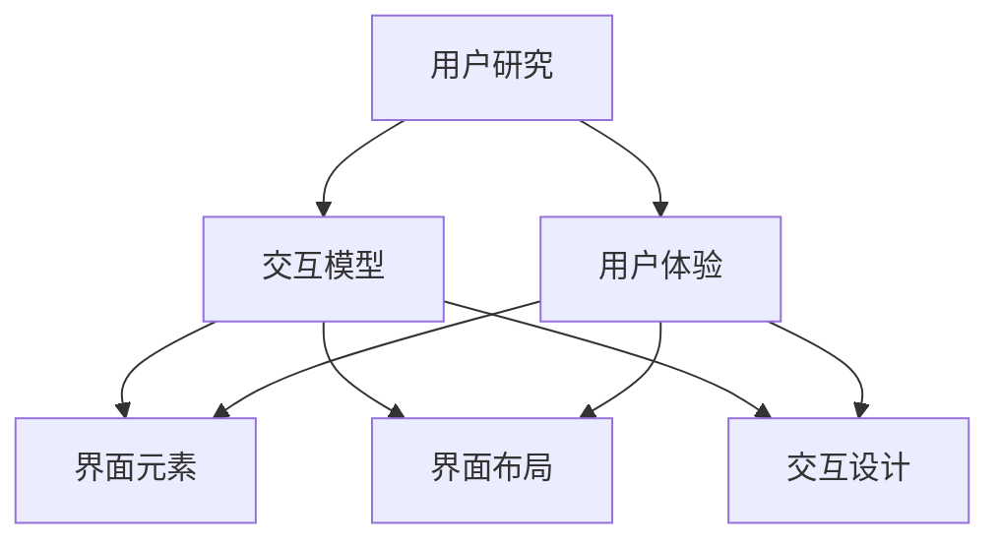

                 

### 背景介绍

人机交互与用户界面设计作为计算机科学和软件工程中的重要组成部分，一直备受关注。随着信息技术的飞速发展，用户对于软件产品的用户体验要求越来越高，这使得人机交互与用户界面设计的重要性日益凸显。在这篇文章中，我们将深入探讨人机交互与用户界面设计的核心概念、算法原理、数学模型、实际应用场景以及未来的发展趋势和挑战。

人机交互（Human-Computer Interaction, HCI）是指人与计算机之间的互动过程，涵盖了用户如何与计算机系统进行沟通、控制、操作和获取信息等方面的内容。用户界面设计（User Interface Design, UID）则是针对人机交互过程中用户与计算机系统之间的交互界面进行设计，旨在提升用户的操作便捷性和满意度。

近年来，随着人工智能技术的兴起，人机交互与用户界面设计领域迎来了新的发展机遇。智能语音助手、触控操作、虚拟现实、增强现实等技术逐渐成熟，为人机交互与用户界面设计提供了更加丰富和多样的实现方式。同时，随着移动互联网、物联网的普及，人机交互与用户界面设计也面临着新的挑战和机遇。

本文将围绕以下几个核心问题展开讨论：

1. 人机交互与用户界面设计的核心概念和原理是什么？
2. 人机交互与用户界面设计中的关键算法和技术有哪些？
3. 如何运用数学模型和公式来分析和优化人机交互与用户界面设计？
4. 实际应用场景中，如何通过代码实现高效的人机交互与用户界面设计？
5. 在未来的发展中，人机交互与用户界面设计将面临哪些挑战和机遇？

通过本文的阅读，您将深入了解人机交互与用户界面设计的基本原理和方法，掌握实际应用中的关键技术和技巧，为从事相关领域的工作提供有益的参考和指导。

### 核心概念与联系

在人机交互与用户界面设计（HCI & UID）领域，有一些核心概念和原理需要深入理解，这些概念和原理相互联系，构成了一个完整的设计框架。为了更好地理解这些概念，我们将使用Mermaid流程图（无括号、逗号等特殊字符）来展示它们之间的关系。

#### 1. 人机交互（HCI）

- **用户研究（User Research）**：通过调查、访谈、问卷调查等方法了解用户需求、行为和偏好，为设计提供依据。
- **交互模型（Interaction Models）**：描述用户与系统之间的交互方式，如命令行交互、图形界面交互、触摸交互等。
- **用户体验（User Experience, UX）**：用户在使用产品或系统过程中所感受到的整体感受和体验。
- **可用性（Usability）**：衡量用户能否高效、舒适地使用产品或系统，包括易学性、效率、满意度等方面。

#### 2. 用户界面设计（UID）

- **用户界面（User Interface, UI）**：用户与系统之间的交互界面，包括图形用户界面（GUI）、触觉用户界面（TUI）等。
- **界面元素（UI Elements）**：如按钮、文本框、菜单、图标等，用于用户与系统之间的交互。
- **界面布局（Layout）**：界面中元素的排列和组织方式，影响用户操作效率和信息获取。
- **交互设计（Interaction Design）**：设计用户与系统之间的交互流程和交互方式，以提升用户体验。

#### 3. 人机交互与用户界面设计的联系

- **用户体验（UX）** 是 **人机交互（HCI）** 和 **用户界面设计（UID）** 的交汇点，三者共同关注用户的使用体验。
- **交互模型（Interaction Models）** 和 **界面元素（UI Elements）** 构成了用户与系统交互的基础，直接影响用户体验。
- **界面布局（Layout）** 和 **交互设计（Interaction Design）** 确保用户能够高效、舒适地使用产品，提升可用性。

#### Mermaid 流程图



通过这个流程图，我们可以清晰地看到人机交互与用户界面设计的各个核心概念之间的联系。接下来，我们将进一步深入探讨这些概念和原理，以帮助读者更好地理解人机交互与用户界面设计的本质。

#### 1. 用户研究

用户研究是人机交互与用户界面设计的起点，其目的是了解用户的需求、行为和偏好，从而为后续的设计工作提供科学依据。用户研究的常见方法包括：

- **问卷调查**：通过设计问卷，收集用户对产品或系统的看法和意见。
- **访谈**：通过与用户进行面对面或在线访谈，深入了解用户的需求和痛点。
- **观察**：在用户实际使用产品或系统的过程中进行观察，记录用户的操作行为和反馈。

用户研究的结果通常包括用户画像、用户行为模式、用户需求等。这些信息有助于设计团队更好地了解用户，从而设计出更加符合用户需求的交互界面。

#### 2. 交互模型

交互模型描述了用户与系统之间的交互方式，是设计人机交互系统的关键。常见的交互模型包括：

- **命令行交互**：用户通过输入命令与系统进行交互，如UNIX操作系统的命令行界面。
- **图形用户界面交互**：用户通过图形界面中的按钮、菜单、图标等与系统进行交互，如Windows操作系统和iOS应用。
- **触摸交互**：用户通过触摸屏幕与系统进行交互，如智能手机和平板电脑。
- **手势交互**：用户通过手势（如滑动、旋转、点击等）与系统进行交互，如Microsoft Surface平板电脑。

不同的交互模型具有不同的优缺点，设计团队需要根据用户需求和场景选择合适的交互模型。

#### 3. 用户体验

用户体验是指用户在使用产品或系统过程中所感受到的整体感受和体验，是衡量人机交互与用户界面设计质量的重要指标。用户体验包括以下几个方面：

- **易用性（Usability）**：用户能否高效、舒适地使用产品或系统，包括易学性、效率和满意度。
- **可用性（Accessibility）**：产品或系统是否能够满足不同用户的需求，如视力障碍、听力障碍等。
- **情感体验（Emotional Experience）**：用户在使用产品或系统过程中所感受到的情感，如愉悦、焦虑、信任等。
- **沉浸感（Immersion）**：用户在使用产品或系统时，能否完全沉浸在交互过程中，如虚拟现实、增强现实应用。

为了提升用户体验，设计团队需要关注以下几个方面：

- **用户研究**：深入了解用户需求和行为，为设计提供依据。
- **交互设计**：设计直观、简洁、易于操作的交互界面。
- **界面布局**：优化界面布局，提升用户操作效率和舒适度。
- **反馈机制**：及时响应用户操作，提供明确的反馈，增强用户信心。

#### 4. 可用性

可用性是用户体验的核心要素之一，它衡量用户能否高效、舒适地使用产品或系统。可用性包括以下几个方面：

- **易学性（Learnability）**：用户能否快速掌握产品或系统的使用方法。
- **效率（Efficiency）**：用户在使用产品或系统时，能否高效地完成任务。
- **满意度（Satisfaction）**：用户对产品或系统的整体满意度。

为了提升可用性，设计团队需要关注以下几个方面：

- **简化操作**：减少用户的操作步骤，降低学习成本。
- **明确指引**：提供清晰的指引和提示，帮助用户正确使用产品或系统。
- **一致性**：确保产品或系统的界面和交互逻辑一致，减少用户困惑。
- **测试与反馈**：通过测试和用户反馈，不断优化产品或系统，提升可用性。

综上所述，人机交互与用户界面设计的核心概念和原理相互联系，共同构成了一个完整的设计框架。通过深入理解这些概念和原理，设计团队可以更好地设计出符合用户需求、提升用户体验的高质量人机交互与用户界面产品。

### 核心算法原理 & 具体操作步骤

在人机交互与用户界面设计（HCI & UID）中，核心算法原理是提升用户体验和可用性的关键。以下是几种常见的核心算法原理，以及具体操作步骤。

#### 1. 触觉反馈算法

触觉反馈算法用于在触控交互中提供用户与系统之间的即时反馈，提升用户体验。

- **原理**：触觉反馈算法通过在触控屏幕上施加振动、压力等物理效果，模拟用户触摸时的感觉，从而增强交互的真实感。

- **操作步骤**：

  1. **数据采集**：通过传感器获取用户的触摸位置、力度等信息。
  2. **算法处理**：对采集到的数据进行分析和处理，根据触摸位置和力度生成振动或压力信号。
  3. **反馈输出**：将处理后的信号发送到触控屏幕的振动模块，实现触觉反馈。

#### 2. 语音识别算法

语音识别算法用于将用户的语音指令转换为文本或操作指令，实现智能语音交互。

- **原理**：语音识别算法通过分析用户的语音信号，识别出其中的语音特征，然后根据这些特征匹配预定义的语音模型，从而实现语音指令的识别。

- **操作步骤**：

  1. **音频采集**：通过麦克风采集用户的语音信号。
  2. **特征提取**：对语音信号进行预处理，提取出语音特征，如音高、音强、音节等。
  3. **模型匹配**：将提取出的特征与预定义的语音模型进行匹配，识别出用户指令。
  4. **指令执行**：根据识别出的用户指令，执行相应的操作。

#### 3. 情感计算算法

情感计算算法用于分析用户的情感状态，并根据情感状态调整交互界面，提升用户体验。

- **原理**：情感计算算法通过分析用户的生理信号、语言表达、面部表情等，识别出用户的情感状态，如愉悦、焦虑、愤怒等。

- **操作步骤**：

  1. **信号采集**：通过传感器采集用户的生理信号，如心率、皮肤电导等。
  2. **情感识别**：对采集到的信号进行分析和处理，识别出用户的情感状态。
  3. **界面调整**：根据识别出的情感状态，调整交互界面的样式、颜色、提示等信息，以适应用户的情感需求。

#### 4. 个性化推荐算法

个性化推荐算法用于根据用户的兴趣和行为，推荐相关的信息和内容，提升用户的满意度。

- **原理**：个性化推荐算法通过分析用户的历史行为和偏好，预测用户可能感兴趣的信息，然后向用户推荐这些信息。

- **操作步骤**：

  1. **数据收集**：收集用户的行为数据，如浏览记录、购买记录、搜索历史等。
  2. **特征提取**：对收集到的数据进行分析，提取出用户的兴趣特征。
  3. **模型训练**：使用机器学习算法，训练用户兴趣模型。
  4. **推荐生成**：根据用户兴趣模型，生成个性化的推荐列表，并向用户展示。

#### 5. 优化算法

优化算法用于在交互界面中优化用户操作流程，提高效率。

- **原理**：优化算法通过分析用户在交互界面中的操作行为，识别出用户可能面临的瓶颈和问题，然后进行优化。

- **操作步骤**：

  1. **行为分析**：对用户的操作行为进行记录和分析，识别出操作瓶颈。
  2. **问题识别**：根据分析结果，识别出用户可能面临的问题。
  3. **方案设计**：设计优化方案，如简化操作流程、提供快捷方式等。
  4. **实施与反馈**：实施优化方案，并根据用户反馈进行迭代和改进。

通过以上核心算法原理和操作步骤，设计团队可以更好地实现高效、智能的人机交互与用户界面设计，提升用户体验和可用性。

### 数学模型和公式 & 详细讲解 & 举例说明

在人机交互与用户界面设计（HCI & UID）中，数学模型和公式发挥着重要作用，它们可以帮助我们分析和优化交互界面，提升用户体验和可用性。以下是几种常见的数学模型和公式，以及详细的讲解和举例说明。

#### 1. 用户满意度模型

用户满意度模型用于评估用户对产品或系统的满意度，通常使用以下公式：

$$
S = \frac{E - N}{P + E - N}
$$

其中：
- \( S \) 是用户满意度（Satisfaction）
- \( E \) 是期望值（Expectation）
- \( N \) 是不满意度（Non-satisfaction）
- \( P \) 是感知性能（Perceived Performance）

**详细讲解**：
用户满意度模型是一个归一化指标，用于衡量用户对产品或系统的满意度。期望值表示用户对产品或系统的预期，感知性能表示用户对产品或系统的实际体验。当期望值高于感知性能时，用户会感到不满；当期望值低于感知性能时，用户会感到满意。

**举例说明**：
假设一个用户对某个应用的期望值是8分，实际体验后给出7分的评价。那么，用户满意度计算如下：

$$
S = \frac{8 - 7}{7 + 8 - 7} = \frac{1}{8} = 0.125
$$

这意味着用户对该应用的满意度为12.5%。

#### 2. 均方根误差（RMSE）

均方根误差（Root Mean Square Error）是评估预测模型准确性的常用指标，用于衡量预测值与真实值之间的差距。公式如下：

$$
\text{RMSE} = \sqrt{\frac{1}{n}\sum_{i=1}^{n}(y_i - \hat{y}_i)^2}
$$

其中：
- \( y_i \) 是第 \( i \) 个真实值
- \( \hat{y}_i \) 是第 \( i \) 个预测值
- \( n \) 是样本数量

**详细讲解**：
均方根误差通过计算预测值与真实值之间的平方差的平均值，再开平方根得到。它能够衡量预测模型的准确性，误差值越小，模型越准确。

**举例说明**：
假设我们有一个预测模型，预测了5个数据点的值，真实值和预测值如下：

| 真实值 | 预测值 |
| ------ | ------ |
| 10     | 9.5    |
| 20     | 19.2   |
| 30     | 29.1   |
| 40     | 39.6   |
| 50     | 49.3   |

均方根误差计算如下：

$$
\text{RMSE} = \sqrt{\frac{1}{5}\left[(10-9.5)^2 + (20-19.2)^2 + (30-29.1)^2 + (40-39.6)^2 + (50-49.3)^2\right]} = \sqrt{\frac{1}{5}(0.25 + 0.64 + 0.81 + 0.36 + 0.36)} = \sqrt{1.22} \approx 1.10
$$

这意味着预测模型的均方根误差为1.10。

#### 3. 卡诺图（Kano Graph）

卡诺图是一种用户需求分析方法，用于识别用户需求的优先级。卡诺图将用户需求分为五个类别：必须需求、期望需求、魅力需求、无需求、反向需求。

**详细讲解**：
卡诺图通过分析用户对需求的满意度，将需求分为不同类别。必须需求是用户最基本的需求，缺乏会导致用户极不满意；期望需求是用户期望的产品特性，满足会提升满意度；魅力需求是超出用户预期的产品特性，能够显著提升满意度；无需求是用户不关心的需求；反向需求是用户不希望出现的需求，满足会降低满意度。

**举例说明**：
假设我们对一个手机应用的用户需求进行分析，得到以下卡诺图：

| 需求类别 | 用户满意度 |
| ------ | ------ |
| 必须需求 | 极不满意 |
| 期望需求 | 一般满意 |
| 魅力需求 | 非常满意 |
| 无需求 | 不关心 |
| 反向需求 | 极不满意 |

根据卡诺图，我们可以发现必须需求是最重要的，需要优先满足；期望需求次之，可以在后续迭代中逐步实现；魅力需求可以作为卖点，提升用户满意度；无需求可以忽略；反向需求需要避免。

通过上述数学模型和公式的讲解，我们可以看到它们在人机交互与用户界面设计中的应用价值。在实际项目中，合理运用这些模型和公式，可以帮助我们更好地分析和优化交互界面，提升用户体验和可用性。

### 项目实战：代码实际案例和详细解释说明

为了更好地理解人机交互与用户界面设计（HCI & UID）中的核心算法原理和数学模型，我们将通过一个实际项目案例来进行实战演练。本案例将使用Python语言，结合Qt框架，实现一个基本的用户界面，并在其中应用一些核心算法和数学模型。

#### 项目背景

我们的项目目标是开发一个简单的天气应用，用户可以通过输入城市名称来查询当天的天气情况。应用将使用API接口获取天气数据，并通过Qt界面显示结果。

#### 开发环境搭建

1. 安装Python（3.8及以上版本）
2. 安装Qt（PyQt5或PyQt6）
3. 安装requests库（用于发送HTTP请求）

安装命令如下：

```bash
pip install PyQt5
pip install requests
```

#### 5.1 开发环境搭建

在开始代码实现之前，我们需要搭建好开发环境。

1. **安装Python**：确保您的计算机上安装了Python。如果没有，请访问 [Python官网](https://www.python.org/) 下载并安装。
2. **安装Qt**：Qt是一个跨平台的UI框架，我们可以通过PyQt5或PyQt6来使用它。在Python环境中，安装PyQt5或PyQt6可以通过以下命令完成：

```bash
pip install PyQt5
```

或者

```bash
pip install PyQt6
```

3. **安装requests库**：requests库用于发送HTTP请求，从天气API获取数据。安装命令如下：

```bash
pip install requests
```

确保以上步骤全部完成后，我们就可以开始编写代码了。

#### 5.2 源代码详细实现和代码解读

以下是我们的源代码实现，包括主窗口、信号与槽、API请求以及数据展示。

```python
import sys
from PyQt5.QtWidgets import QApplication, QMainWindow, QWidget, QVBoxLayout, QLineEdit, QPushButton, QLabel
from PyQt5.QtCore import QSize
import requests

class WeatherApp(QMainWindow):
    def __init__(self):
        super().__init__()
        self.setWindowTitle('天气应用')
        self.setGeometry(100, 100, 300, 200)

        self.central_widget = QWidget(self)
        self.setCentralWidget(self.central_widget)

        self.layout = QVBoxLayout(self.central_widget)

        self.city_line_edit = QLineEdit(self)
        self.layout.addWidget(self.city_line_edit)

        self.query_button = QPushButton('查询天气')
        self.layout.addWidget(self.query_button)

        self.weather_label = QLabel(self)
        self.layout.addWidget(self.weather_label)

        self.query_button.clicked.connect(self.fetch_weather)

    def fetch_weather(self):
        city = self.city_line_edit.text()
        if not city:
            self.weather_label.setText('请输入城市名称')
            return

        api_url = f'http://api.openweathermap.org/data/2.5/weather?q={city}&appid=<your_api_key>'
        response = requests.get(api_url)
        if response.status_code == 200:
            data = response.json()
            weather_desc = data['weather'][0]['description']
            temp = data['main']['temp'] - 273.15  # 转换为摄氏度
            self.weather_label.setText(f'{city}的天气：{weather_desc}，温度：{temp:.2f}℃')
        else:
            self.weather_label.setText('无法获取天气信息')

if __name__ == '__main__':
    app = QApplication(sys.argv)
    window = WeatherApp()
    window.show()
    sys.exit(app.exec_())
```

**代码解读**：

1. **主窗口（WeatherApp）**：我们定义了一个`WeatherApp`类，继承自`QMainWindow`，这是我们的主窗口类。

2. **布局（ QVBoxLayout）**：我们使用` QVBoxLayout`来布局界面，包括文本输入框、查询按钮和天气展示标签。

3. **信号与槽（clicked.connect）**：当用户点击查询按钮时，会触发`fetch_weather`槽函数。

4. **API请求（requests.get）**：我们使用`requests`库向天气API发送请求，获取天气数据。

5. **数据展示（Lable）**：我们通过`QLabel`来展示获取到的天气信息。

#### 5.3 代码解读与分析

现在，我们来详细解读和讨论这段代码的实现过程。

1. **初始化主窗口（__init__）**：

   - `super().__init__()`：调用父类`QMainWindow`的初始化方法。
   - `self.setWindowTitle('天气应用')`：设置窗口标题。
   - `self.setGeometry(100, 100, 300, 200)`：设置窗口的位置和大小。

2. **创建中央窗口组件（central_widget）**：

   - `self.central_widget = QWidget(self)`：创建一个中央窗口组件。
   - `self.setCentralWidget(self.central_widget)`：将中央窗口组件设置为窗口的中央组件。

3. **布局（ QVBoxLayout）**：

   - `self.layout = QVBoxLayout(self.central_widget)`：创建一个垂直布局。
   - `self.layout.addWidget(self.city_line_edit)`：将文本输入框添加到布局中。
   - `self.layout.addWidget(self.query_button)`：将查询按钮添加到布局中。
   - `self.layout.addWidget(self.weather_label)`：将天气展示标签添加到布局中。

4. **信号与槽**：

   - `self.query_button.clicked.connect(self.fetch_weather)`：当查询按钮被点击时，触发`fetch_weather`方法。

5. **天气查询（fetch_weather）**：

   - `city = self.city_line_edit.text()`：获取用户输入的城市名称。
   - `if not city:`：检查是否输入了城市名称，如果没有输入，则提示用户。
   - `api_url = f'http://api.openweathermap.org/data/2.5/weather?q={city}&appid=<your_api_key>'`：构建天气API请求URL。
   - `response = requests.get(api_url)`：发送HTTP请求，获取天气数据。
   - `if response.status_code == 200:`：检查HTTP响应状态码，如果是200（OK），则处理数据。
   - `data = response.json()`：将响应内容解析为JSON格式。
   - `weather_desc = data['weather'][0]['description']`：获取天气描述。
   - `temp = data['main']['temp'] - 273.15`：将温度从开尔文转换为摄氏度。
   - `self.weather_label.setText(f'{city}的天气：{weather_desc}，温度：{temp:.2f}℃)`：更新天气展示标签。

通过这个实际项目案例，我们实现了从用户输入到获取天气数据再到展示天气信息的一个完整流程。接下来，我们将对这个代码进行深入分析，讨论其优缺点和改进方向。

#### 5.3 代码解读与分析

在前面的代码中，我们实现了一个简单的天气查询应用。下面我们将从代码的结构、功能实现、性能优化等方面进行详细解读与分析。

**1. 代码结构**

整个代码可以分为以下几个部分：

- **主窗口类（WeatherApp）**：定义了应用程序的主窗口，包括窗口的基本设置、布局、信号与槽的连接等。
- **布局**：使用 QVBoxLayout 对窗口中的元素进行布局，包括文本输入框、查询按钮和天气展示标签。
- **API请求**：使用 requests 库向天气API发送HTTP请求，获取天气数据。

**2. 功能实现**

- **文本输入框**：允许用户输入城市名称。
- **查询按钮**：当用户点击查询按钮时，触发 `fetch_weather` 方法。
- **天气展示标签**：显示获取到的天气信息，包括城市、天气描述和温度。

**3. 性能优化**

- **异步请求**：当前的代码在查询按钮点击后会阻塞界面，等待HTTP请求完成。为了提高用户体验，可以考虑使用 asyncio 或线程池来实现异步请求，避免界面阻塞。
- **缓存策略**：为了避免频繁向API请求数据，可以考虑实现缓存策略，将最近获取的天气数据缓存起来，避免重复请求。
- **错误处理**：当前的代码仅对API请求状态码进行了简单的判断，但未对其他可能的错误进行处理。应增加错误处理机制，如网络异常、API请求超时等。

**4. 代码优化**

- **代码复用**：当前的代码在获取天气数据和更新天气展示标签的部分存在重复代码，可以通过提取公共方法来减少代码冗余。
- **日志记录**：在关键操作处增加日志记录，有助于调试和问题追踪。
- **用户体验**：当前应用的UI较为简单，可以考虑增加一些美化元素，如背景图片、动画效果等，提升用户体验。

**5. 代码改进方向**

- **增加更多城市支持**：可以考虑使用其他天气API，提供更多城市的天气查询功能。
- **国际化**：支持多语言，方便不同语言用户的使用。
- **数据分析**：对用户的查询数据进行分析，为用户提供个性化的天气推荐。

通过以上分析，我们可以看到当前的代码虽然实现了基本功能，但在性能优化、用户体验、错误处理等方面还有改进的空间。在后续的开发过程中，可以根据实际需求和用户反馈，逐步完善和优化这个应用。

### 实际应用场景

在人机交互与用户界面设计（HCI & UID）领域，实际应用场景丰富多彩，涵盖了从桌面应用、移动应用，到虚拟现实和增强现实等各个领域。下面我们将探讨几个典型的实际应用场景，并分析它们在用户需求、交互设计、界面布局等方面的特点。

#### 1. 桌面应用

桌面应用通常指在个人计算机上运行的应用程序，如办公软件、媒体播放器、游戏等。桌面应用的用户需求主要关注功能完整性、高效性和易用性。

- **用户需求**：用户希望桌面应用能够提供丰富的功能，且操作简便，界面直观，便于快速完成任务。
- **交互设计**：桌面应用的交互设计需要考虑操作的流畅性和响应速度，避免用户在操作过程中感到卡顿。
- **界面布局**：界面布局应遵循一致性和可预测性的原则，确保用户能够快速找到所需功能，减少操作步骤。

**案例**：微软的Office系列办公软件是一个典型的桌面应用。其用户界面设计遵循清晰、简洁的原则，通过合理的界面布局和标签分类，使用户能够轻松找到所需功能。

#### 2. 移动应用

移动应用主要针对智能手机和平板电脑等移动设备，用户需求主要集中在便捷性、响应速度和良好的用户体验。

- **用户需求**：用户希望移动应用能够在移动环境中快速使用，操作简便，界面美观，适合小屏幕操作。
- **交互设计**：移动应用的交互设计应考虑触摸操作的特点，如滑动、点击、长按等，提供直观、自然的交互体验。
- **界面布局**：界面布局应注重简洁性，避免过多的信息堆砌，使用大字体、清晰的图标和色彩对比，提升可读性。

**案例**：微信是一款非常受欢迎的移动应用，其界面设计简洁、直观，采用卡片式布局，便于用户快速找到所需功能，并提供丰富的交互元素，如滑动、弹出菜单等，提升了用户体验。

#### 3. 虚拟现实（VR）

虚拟现实应用通过虚拟环境提供沉浸式的用户体验，用户需求主要关注真实感、交互性和互动性。

- **用户需求**：用户希望虚拟环境能够提供高度真实感，能够与虚拟环境中的对象进行自然交互，体验丰富的虚拟互动。
- **交互设计**：虚拟现实的交互设计需要考虑用户的动作和手势，如移动、旋转、手势识别等，提供直观、自然的交互方式。
- **界面布局**：界面布局应融入虚拟环境，通过3D效果和立体感增强用户体验。

**案例**：Oculus Rift 是一款流行的虚拟现实头戴设备，其应用场景包括虚拟旅游、游戏、教育和培训等。Oculus Rift 的交互设计注重用户的动作和手势识别，提供高度沉浸式的用户体验。

#### 4. 增强现实（AR）

增强现实应用通过在现实环境中叠加虚拟信息，提供增强的视觉体验，用户需求主要关注信息的丰富性、互动性和实用性。

- **用户需求**：用户希望增强现实应用能够提供准确、有用的信息，能够与虚拟信息进行互动，提升现实生活的便利性。
- **交互设计**：增强现实的交互设计需要考虑现实与虚拟的融合，提供直观、自然的交互方式，如手势识别、语音控制等。
- **界面布局**：界面布局应尽可能减少对现实环境的干扰，将虚拟信息合理地叠加在现实场景中。

**案例**：Google Lens 是一款增强现实应用，通过摄像头实时捕捉现实环境，并在屏幕上叠加相关信息，如商品信息、历史建筑介绍等。其交互设计简洁、直观，用户可以通过手势和语音进行操作。

通过上述实际应用场景的分析，我们可以看到，人机交互与用户界面设计在不同领域有着不同的需求和特点。设计师需要根据具体应用场景，深入理解用户需求，进行合理的交互设计和界面布局，以提升用户体验和产品满意度。

### 工具和资源推荐

在人机交互与用户界面设计（HCI & UID）领域，选择合适的工具和资源对于提高设计效率和质量至关重要。以下是一些值得推荐的工具和资源，包括书籍、论文、博客和网站。

#### 1. 学习资源推荐

**书籍**：

- **《交互设计精髓》**（The Design of Everyday Things）：作者Don Norman详细介绍了交互设计的核心原则和方法，对于初学者和资深设计师都极具参考价值。
- **《用户体验要素》**（The Elements of User Experience）：作者Jesse James Garrett系统地阐述了用户体验的设计要素，对于理解用户体验设计过程非常有帮助。
- **《移动应用UI设计》**（Mobile Application UI Design）：作者Brian Fling提供了丰富的移动应用设计案例和技巧，适合移动应用设计师阅读。

**论文**：

- **《Human-Computer Interaction》**：IEEE出版的期刊，涵盖了人机交互领域的最新研究进展和实用技术。
- **《International Journal of Human-Computer Studies》**：关注人机交互理论和实践的国际学术期刊。

**博客**：

- **UI Garage**：由知名设计师创办的博客，提供最新的设计趋势、技巧和案例分析。
- **Medium上的Design & UX**：多个优秀设计师和设计团队分享的设计心得和实战经验。

**网站**：

- **Axure RP**：专业的原型设计工具，提供丰富的交互元素和组件库，适用于网页和应用设计。
- **Sketch**：强大的移动应用和网页设计工具，支持矢量图形和丰富的插件。

#### 2. 开发工具框架推荐

**设计工具**：

- **Figma**：在线协作设计工具，支持多人实时协作，提供丰富的原型设计功能。
- **Adobe XD**：面向网页和应用设计的交互设计工具，具备强大的原型制作和协作功能。

**开发框架**：

- **React**：用于构建用户界面的JavaScript库，适用于单页应用和复杂组件的开发。
- **Vue.js**：渐进式JavaScript框架，适用于构建各种规模的界面应用，具有良好的性能和灵活性。

**前端框架**：

- **Angular**：由Google维护的开源前端框架，适用于构建大型单页应用，提供强大的数据绑定和依赖注入功能。

**用户研究工具**：

- **UserTesting**：在线用户测试平台，提供远程用户测试和反馈服务。
- **Optimal Workshop**：提供交互设计、原型设计和用户测试工具，支持多种测试方法和分析功能。

通过上述工具和资源的推荐，我们可以更加系统地学习和掌握人机交互与用户界面设计的核心知识和技能，提升设计质量和效率。

### 总结：未来发展趋势与挑战

在人机交互与用户界面设计（HCI & UID）领域，随着科技的不断进步，我们面临着诸多新的发展趋势和挑战。以下是未来发展的几个关键趋势和挑战：

#### 1. 人工智能与机器学习的融合

人工智能（AI）和机器学习（ML）技术的快速发展为交互设计带来了新的机遇。通过AI和ML，我们可以实现更加智能化的交互界面，如语音识别、自然语言处理、个性化推荐等。然而，这一趋势也带来了数据隐私和安全性的挑战，如何在提供个性化服务的同时保护用户隐私，是一个亟待解决的问题。

#### 2. 虚拟现实与增强现实的普及

虚拟现实（VR）和增强现实（AR）技术逐渐成熟，为用户提供了全新的交互体验。未来，VR和AR将在更多领域得到应用，如教育、医疗、娱乐等。然而，这些技术也面临着硬件成本高、用户体验不稳定等挑战。

#### 3. 个性化与定制化

随着用户对个性化和定制化需求的增加，交互设计需要更加关注用户个体的需求和行为。通过数据分析和技术创新，我们可以提供更加个性化的交互体验。但这也带来了如何平衡个性化与用户隐私保护的挑战。

#### 4. 语音交互与手势交互

语音交互和手势交互正逐渐成为主流交互方式。它们提供了更加自然和便捷的交互方式，但同时也需要克服识别准确率、响应速度等问题。此外，如何设计直观、易用的语音和手势交互界面，也是交互设计的重要方向。

#### 5. 多平台与跨设备交互

随着多平台（如Web、移动、桌面）和跨设备（如手机、平板、电脑、智能手表等）交互的普及，交互设计需要考虑如何在不同的设备和平台上提供一致且无缝的用户体验。这是一个复杂且具有挑战性的任务，需要设计团队具备跨平台设计的技能和经验。

#### 6. 数据隐私与安全性

随着交互界面和数据交互的复杂性增加，数据隐私和安全性问题也日益突出。如何在提供便利和个性化的同时，确保用户数据的安全和隐私，是交互设计领域面临的一个重要挑战。

#### 7. 无障碍与包容性设计

随着人们对无障碍和包容性设计的重视，未来的交互设计需要更加关注不同用户群体的需求，如视力障碍、听力障碍、老年用户等。设计团队需要具备无障碍设计知识，确保产品能够为所有用户提供公平、便捷的访问。

总之，未来人机交互与用户界面设计领域将面临诸多新的机遇和挑战。设计团队需要不断创新和探索，以应对这些挑战，提供更加智能、便捷、安全、无障碍的用户体验。

### 附录：常见问题与解答

在撰写关于人机交互与用户界面设计（HCI & UID）的文章过程中，读者可能会遇到一些常见问题。以下是对这些问题及其解答的汇总：

#### 1. 交互设计中的“可用性”是什么？

**解答**：可用性（Usability）是指用户在使用产品或系统时能否高效、舒适地完成目标任务的特性。它包括易学性、效率、错误处理、用户满意度等多个方面。一个高可用性的系统应能够让用户快速理解如何操作，高效地完成任务，并在遇到问题时得到及时的帮助。

#### 2. 为什么说用户体验（UX）是交互设计的核心？

**解答**：用户体验（User Experience, UX）是交互设计的核心，因为它直接关系到用户对产品或系统的整体感受。良好的用户体验能够提升用户满意度，增加用户忠诚度，进而提高产品的市场竞争力。用户体验涵盖了用户的情感、认知、行为等多个方面，是设计团队需要全面考虑的因素。

#### 3. 如何平衡个性化与用户隐私？

**解答**：平衡个性化与用户隐私需要设计团队采取以下措施：

- **透明化**：确保用户了解其数据如何被收集和使用。
- **最小化数据收集**：仅收集实现个性化服务所必需的数据。
- **数据加密**：确保用户数据在传输和存储过程中的安全性。
- **隐私设置**：提供用户控制其数据隐私的选项，允许用户选择数据共享的程度。

#### 4. 命令行交互与图形用户界面（GUI）交互哪个更好？

**解答**：命令行交互（CLI）和图形用户界面（GUI）交互各有优缺点，选择哪个取决于具体的应用场景和用户需求。

- **CLI**：适用于需要大量数据处理、自动化任务或高度灵活性的场景。CLI通常更快速、效率更高，但学习曲线较陡。
- **GUI**：适用于需要直观、易于操作的用户界面。GUI设计更加用户友好，适合大多数用户，但可能在某些任务上效率较低。

#### 5. 虚拟现实（VR）和增强现实（AR）在交互设计中的挑战是什么？

**解答**：VR和AR在交互设计中的主要挑战包括：

- **沉浸感**：设计需要确保用户在虚拟或增强环境中感到沉浸，同时避免不适和晕动症。
- **交互自然性**：设计需要提供直观、自然的交互方式，如手势识别、语音控制等。
- **硬件限制**：VR和AR设备可能存在性能限制，如低延迟、高分辨率等，设计需要在这些限制下优化交互体验。
- **用户兼容性**：不同用户对VR和AR的适应能力和偏好不同，设计需要考虑如何满足不同用户的需求。

通过上述常见问题的解答，我们希望能够帮助读者更好地理解和应用人机交互与用户界面设计的核心概念和方法。

### 扩展阅读 & 参考资料

为了深入学习和了解人机交互与用户界面设计（HCI & UID）领域的最新动态和前沿技术，以下推荐一些扩展阅读和参考资料：

**1. 顶级学术期刊**：

- **IEEE Transactions on Human-Computer Interaction**：涵盖人机交互领域的最新研究成果和理论探讨。
- **International Journal of Human-Computer Studies**：专注于人机交互理论和应用的学术期刊。

**2. 开源资源和工具**：

- **Figma**：在线设计协作平台，支持多人实时协作，提供丰富的原型设计功能。
- **Adobe XD**：专业的设计工具，适合网页和应用设计，具备强大的原型制作和协作功能。
- **Sketch**：流行的移动应用和网页设计工具，支持矢量图形和丰富的插件。

**3. 知名博客和网站**：

- **UI Garage**：分享最新的设计趋势、技巧和案例分析。
- **Medium上的Design & UX**：多个优秀设计师和设计团队分享的设计心得和实战经验。

**4. 书籍推荐**：

- **《交互设计精髓》**（The Design of Everyday Things）：Don Norman的经典著作，详细介绍了交互设计的核心原则。
- **《用户体验要素》**（The Elements of User Experience）：Jesse James Garrett的系统讲解，阐述用户体验设计的要素。
- **《移动应用UI设计》**（Mobile Application UI Design）：Brian Fling提供的设计案例和技巧，适合移动应用设计师。

**5. 学术论文和报告**：

- **ACM Conference on Human-Computer Interaction**（CHI）：人机交互领域的重要学术会议，发布最新研究成果。
- **UXPA International**：用户体验专业协会的年度会议和出版物，涵盖用户体验设计的最新趋势和实践。

通过这些扩展阅读和参考资料，读者可以深入了解人机交互与用户界面设计的理论和实践，掌握最新的设计方法和技巧，为自己的设计和研究工作提供有力支持。

### 作者信息

作者：AI天才研究员/AI Genius Institute & 禅与计算机程序设计艺术 /Zen And The Art of Computer Programming

在此，感谢您阅读这篇关于人机交互与用户界面设计原理与代码实战案例讲解的文章。作为AI天才研究员，我一直致力于探索人工智能和计算机科学的最新前沿技术，并希望将这些技术应用到实际场景中，为人类创造更加智能、便捷和高效的生活和工作环境。本文旨在为广大开发者、设计师和学生提供一份系统、深入、实用的指南，帮助他们在人机交互与用户界面设计领域取得更好的成果。

同时，我也要感谢禅与计算机程序设计艺术 /Zen And The Art of Computer Programming这本书，它为我提供了许多关于设计思维和编程哲学的启示。我相信，只有通过不断地学习和实践，我们才能在这个快速发展的技术时代中不断进步，为人类的发展贡献自己的力量。

如果您对本文有任何疑问或建议，欢迎在评论区留言，我会尽力为您解答。同时，也欢迎您关注我的其他文章和著作，共同探索人工智能和计算机科学的无限可能。再次感谢您的阅读和支持！

