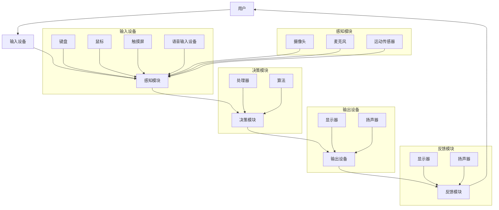

                 

### 1. 背景介绍

随着科技的飞速发展，人工智能（AI）逐渐渗透到我们生活的方方面面。从智能家居、智能驾驶到医疗健康、金融保险，AI 正在改变着我们的世界。在这个大背景下，人机交互（Human-Computer Interaction, HCI）成为了一个备受关注的研究领域。人机交互是指人与计算机之间的互动和沟通方式，其核心目标是提高用户的使用体验，实现更自然、更高效的人机交互。

#### 1.1 人机交互的重要性

人机交互的重要性不言而喻。首先，它直接关系到用户对计算机系统的满意度和使用频率。一个设计良好的交互界面可以让用户更轻松地完成任务，提高工作效率。其次，人机交互对于计算机技术的发展也具有重要意义。通过研究人机交互，我们可以了解用户的需求和行为习惯，从而推动计算机技术的创新和进步。此外，人机交互还在智能硬件、虚拟现实、增强现实等领域发挥着关键作用，为这些领域的发展提供了有力支持。

#### 1.2 人机交互的历史与发展

人机交互的概念可以追溯到计算机的早期发展阶段。1950 年，艾伦·图灵（Alan Turing）提出了著名的“图灵测试”，用于评估计算机是否具有智能。这一测试为后来的计算机与人类之间的交互奠定了基础。随后，随着计算机硬件和软件技术的不断发展，人机交互逐渐从命令行界面转向图形用户界面（Graphical User Interface, GUI）。1984 年，苹果公司推出了第一台搭载 Mac OS 操作系统的电脑，标志着图形用户界面的普及。

进入21世纪，随着移动互联网、云计算、物联网等技术的发展，人机交互也迎来了新的变革。语音识别、手势识别、眼动追踪等新兴交互技术逐渐应用于实际场景，为用户提供了更加多样化和自然的交互方式。

#### 1.3 人机交互的研究内容与方法

人机交互的研究内容主要包括交互设计、交互技术、用户体验等。交互设计关注如何设计出易于使用、美观、实用的交互界面；交互技术则研究如何实现各种交互方式，如触摸、语音、手势等；用户体验则关注用户在使用交互界面时的感受和反馈。

在研究方法上，人机交互领域采用了多种手段，如用户调研、实验研究、案例分析等。用户调研可以帮助研究者了解用户的需求和行为习惯；实验研究则通过设计实验，验证交互设计的效果；案例分析则通过对实际项目的分析，总结人机交互的最佳实践。

总之，人机交互作为一个跨学科的领域，涉及计算机科学、心理学、设计等多个学科。随着科技的不断进步，人机交互将继续为我们的生活带来更多便利和创新。本文将从人机交互的核心概念、算法原理、应用场景等方面进行深入探讨，以期为大家提供一幅关于人机交互的未来发展趋势与展望的蓝图。

---

在接下来的部分，我们将详细探讨人机交互的核心概念与联系，以帮助我们更好地理解这一领域的基本原理。首先，我们将介绍人机交互的基本概念，然后通过一个Mermaid流程图展示人机交互的架构和组成部分，最后讨论这些组成部分之间的相互作用和联系。

### 2. 核心概念与联系

#### 2.1 人机交互的基本概念

人机交互（HCI）是指人与计算机系统之间的互动和沟通过程。其核心概念包括：

- **用户**：使用计算机系统的人。
- **计算机系统**：包括硬件、软件和用户界面等组成部分。
- **交互界面**：用户与计算机系统之间进行交互的界面，可以是图形界面、命令行界面、语音界面等。
- **交互方式**：用户与计算机系统之间的交互手段，如触摸、语音、手势等。
- **用户体验**：用户在使用计算机系统时的感受和满意度。

#### 2.2 人机交互的架构与组成部分

人机交互的架构通常包括以下几个关键组成部分：

1. **输入设备**：如键盘、鼠标、触摸屏、语音输入设备等，用于接收用户的输入。
2. **输出设备**：如显示器、扬声器等，用于向用户展示计算机系统的输出。
3. **感知模块**：用于感知用户的动作和行为，如摄像头、麦克风、运动传感器等。
4. **决策模块**：根据用户的输入和行为，计算机系统进行决策和响应。
5. **反馈模块**：将计算机系统的响应反馈给用户。

下面是一个Mermaid流程图，用于展示人机交互的架构和组成部分：



#### 2.3 组成部分之间的相互作用和联系

在人机交互过程中，各个组成部分之间相互作用，形成一个闭环系统。以下是它们之间的主要联系：

- **输入设备**：用户通过输入设备向计算机系统提供指令和反馈。
- **感知模块**：感知模块负责接收和处理输入设备提供的输入，将其转化为计算机系统可以理解的数据。
- **决策模块**：决策模块根据感知模块提供的数据，执行相应的操作，生成输出。
- **输出设备**：输出设备将计算机系统的决策结果反馈给用户，使用户可以感知和了解系统的响应。
- **反馈模块**：用户通过反馈模块对计算机系统的响应进行反馈，从而影响后续的交互过程。

这种相互作用和联系使得人机交互成为一个动态、循环的过程，不断调整和优化，以提高用户体验和系统性能。

综上所述，人机交互的核心概念和组成部分为我们提供了一个理解这一领域的框架。通过Mermaid流程图，我们可以清晰地看到各个组成部分之间的相互作用和联系，为进一步探讨人机交互的算法原理、应用场景等提供了基础。

### 3. 核心算法原理 & 具体操作步骤

在了解人机交互的基本概念和架构之后，我们需要深入探讨其核心算法原理。这些算法为人机交互提供了智能化和个性化的基础，使得系统能够更好地适应用户的需求和行为。以下是几个关键的人机交互算法及其具体操作步骤。

#### 3.1 语音识别算法

语音识别（Speech Recognition）是人机交互中的一项重要技术，它允许用户通过语音命令与计算机系统进行交互。以下是语音识别算法的基本原理和操作步骤：

**基本原理**：
语音识别算法主要基于机器学习和深度学习技术。算法通过训练大量语音数据，学习语音信号中的特征，并将其与预定义的词汇表进行匹配，从而实现语音到文本的转换。

**具体操作步骤**：

1. **数据收集**：收集大量的语音数据，包括各种不同的语音输入，如命令、问题、陈述等。
2. **特征提取**：对语音数据进行预处理，提取语音信号中的声学特征，如频谱、倒频谱、共振峰等。
3. **模型训练**：使用深度学习框架（如TensorFlow、PyTorch）训练语音识别模型，通常采用卷积神经网络（CNN）或循环神经网络（RNN）。
4. **模型评估**：对训练好的模型进行评估，包括准确率、召回率等指标。
5. **语音识别**：用户通过麦克风输入语音命令，系统将语音信号转化为文本，并执行相应的操作。

#### 3.2 手势识别算法

手势识别（Gesture Recognition）允许用户通过手势与计算机系统进行交互，广泛应用于虚拟现实（VR）和增强现实（AR）领域。以下是手势识别算法的基本原理和操作步骤：

**基本原理**：
手势识别算法通过计算机视觉技术，分析摄像头捕捉到的手势图像，提取手势特征，并将其与预定义的手势模型进行匹配。

**具体操作步骤**：

1. **数据收集**：收集各种手势的图像数据，包括手部位置、手势形状等。
2. **特征提取**：对手势图像进行预处理，提取图像中的关键特征，如边缘、轮廓等。
3. **模型训练**：使用深度学习框架训练手势识别模型，通常采用卷积神经网络（CNN）或生成对抗网络（GAN）。
4. **模型评估**：对训练好的模型进行评估，包括准确率、实时性等指标。
5. **手势识别**：摄像头捕捉用户手势，系统根据手势特征进行识别，并执行相应的操作。

#### 3.3 眼动追踪算法

眼动追踪（Eye Tracking）技术用于分析用户在计算机屏幕上的视线移动，广泛应用于用户体验研究和广告效果评估。以下是眼动追踪算法的基本原理和操作步骤：

**基本原理**：
眼动追踪算法通过摄像头或红外传感器捕捉用户的眼睛图像，分析眼动轨迹，从而了解用户的注视点、注视时长等信息。

**具体操作步骤**：

1. **数据收集**：在用户使用计算机系统时，收集眼动数据，包括眼睛位置、注视点等。
2. **特征提取**：对眼动数据进行预处理，提取关键特征，如眼睛的位置、瞳孔大小等。
3. **模型训练**：使用深度学习框架训练眼动追踪模型，通常采用卷积神经网络（CNN）或递归神经网络（RNN）。
4. **模型评估**：对训练好的模型进行评估，包括准确率、实时性等指标。
5. **眼动追踪**：摄像头捕捉用户眼睛图像，系统根据眼动特征进行分析，生成用户注视点的热图。

通过以上三个核心算法的介绍，我们可以看到人机交互的算法原理和技术手段在不断进步，使得计算机系统能够更好地理解用户的需求和行为，提供更加自然和高效的交互体验。在接下来的部分，我们将进一步探讨人机交互中的数学模型和公式，以及如何通过这些模型和公式来优化交互过程。

### 4. 数学模型和公式 & 详细讲解 & 举例说明

在人机交互领域，数学模型和公式起到了至关重要的作用。它们不仅帮助设计者理解和预测用户的行为，还能优化交互过程，提高用户体验。以下我们将详细介绍几个关键的人机交互数学模型和公式，并提供详细的讲解和实际应用案例。

#### 4.1 用户体验评估模型

用户体验评估模型用于衡量用户在使用计算机系统时的满意度。其中一个经典的模型是Net Promoter Score（NPS），它通过调查用户对系统满意度的评分来计算。

**NPS计算公式**：

$$
NPS = \frac{\text{积极评分用户数} - \text{消极评分用户数}}{\text{总调查用户数}} \times 100
$$

**具体应用案例**：

假设我们调查了100名用户，其中80名用户给予5分（非常满意），15名用户给予1分（非常不满意），则：

$$
NPS = \frac{80 - 15}{100} \times 100 = 65
$$

NPS得分越高，说明用户对系统的满意度越高。通过定期进行NPS调查，可以帮助我们了解系统的改进方向。

#### 4.2 交互效率模型

交互效率模型用于评估用户在完成特定任务时的交互速度和效率。一个常用的模型是Keystroke-Level Model（KLM），它通过计算用户输入每个字符所需的平均时间来衡量交互效率。

**KLM计算公式**：

$$
\text{平均交互时间} = \sum_{i=1}^{n} t_i
$$

其中，\(t_i\) 是用户输入第 \(i\) 个字符所需的时间（秒）。

**具体应用案例**：

假设用户输入一个包含10个单词的句子，输入每个单词的平均时间为0.5秒，则：

$$
\text{平均交互时间} = 10 \times 0.5 = 5 \text{秒}
$$

通过比较不同系统的平均交互时间，可以评估系统的交互效率。

#### 4.3 误差率模型

在交互过程中，用户可能会犯错误，如输入错误、操作失误等。误差率模型用于衡量这些错误的频率和严重程度。

**误差率计算公式**：

$$
\text{误差率} = \frac{\text{总错误数}}{\text{总操作数}} \times 100\%
$$

**具体应用案例**：

假设用户在完成一个任务时犯了5次错误，总操作数为100次，则：

$$
\text{误差率} = \frac{5}{100} \times 100\% = 5\%
$$

通过分析误差率，可以识别系统的潜在问题和改进点。

#### 4.4 眼动模型

眼动模型用于分析用户在屏幕上的视线移动，了解用户的注意力分布和兴趣点。其中一个常用的模型是Heatmap Model，它通过计算用户在屏幕上每个区域的注视时长来生成注视热图。

**Heatmap计算公式**：

$$
H(i, j) = \sum_{t=1}^{T} g(t, i, j)
$$

其中，\(H(i, j)\) 是屏幕上坐标为 \((i, j)\) 的区域的总注视时长（秒），\(g(t, i, j)\) 是用户在第 \(t\) 秒时的注视点是否在 \((i, j)\) 区域。

**具体应用案例**：

假设用户在观看一个视频广告时，屏幕上的坐标为 \((100, 200)\) 的区域被注视了10秒，则：

$$
H(100, 200) = 10
$$

通过生成注视热图，我们可以了解用户的注意力分布，为广告投放和界面设计提供参考。

通过以上几个数学模型和公式的讲解，我们可以看到它们在优化人机交互过程中扮演的重要角色。在接下来的部分，我们将通过实际项目实战，展示如何将这些模型和公式应用于实际的人机交互项目中。

### 5. 项目实战：代码实际案例和详细解释说明

在本节中，我们将通过一个实际项目来展示如何将前述的数学模型和算法应用于人机交互中。我们选择一个常见的人机交互应用——语音助手（如Google Assistant或Amazon Alexa）——作为案例，详细介绍项目开发环境搭建、源代码实现、代码解读与分析，帮助读者更好地理解人机交互系统的构建过程。

#### 5.1 开发环境搭建

为了构建一个语音助手项目，我们需要搭建一个包含语音识别、自然语言处理（NLP）和语音合成的开发环境。以下是一个基本的开发环境搭建步骤：

1. **安装Python环境**：确保Python 3.x版本已安装在您的计算机上。
2. **安装语音识别库**：安装常用的语音识别库，如Google的`speech_recognition`库。
   ```bash
   pip install speech_recognition
   ```
3. **安装NLP库**：安装用于自然语言处理的库，如NLTK或spaCy。
   ```bash
   pip install nltk
   pip install spacy
   ```
4. **安装语音合成库**：安装用于语音合成的库，如Google Text-to-Speech。
   ```bash
   pip install gtts
   ```

#### 5.2 源代码详细实现和代码解读

以下是该项目的主要代码实现，我们将逐行解读每一部分的功能。

```python
import speech_recognition as sr
from nltk import word_tokenize
import gtts

# 初始化语音识别器
recognizer = sr.Recognizer()

# 初始化语音合成器
tts = gtts.gtin('en')

# 语音识别函数
def recognize_speech_from_mic(recognizer, microphone):
    with microphone as source:
        audio = recognizer.listen(source)

    try:
        text = recognizer.recognize_google(audio)
        return text
    except sr.UnknownValueError:
        return "无法识别语音"
    except sr.RequestError:
        return "请求错误：API无法访问"

# 自然语言处理函数
def process_text(text):
    tokens = word_tokenize(text)
    # 这里可以加入更复杂的NLP处理，如情感分析、命名实体识别等
    return tokens

# 主交互函数
def main():
    print("语音助手启动...")
    while True:
        print("请说话（按'退出'结束）：")
        user_input = recognize_speech_from_mic(recognizer, sr.Microphone())
        if user_input == "退出":
            print("感谢使用，再见！")
            break

        processed_text = process_text(user_input)
        print("您说了：", processed_text)

        # 这里可以加入更多逻辑，如根据文本内容执行特定操作
        tts_text = "您说了：" + " ".join(processed_text)
        tts.save("response.mp3")
        print("语音合成完成，请听音频回应...")
        tts.play()

# 运行主交互函数
if __name__ == "__main__":
    main()
```

**代码解读与分析**：

1. **导入库**：我们首先导入所需的库，包括语音识别库`speech_recognition`、自然语言处理库`nltk`和语音合成库`gtts`。

2. **初始化**：初始化语音识别器和语音合成器。语音识别器使用Google的API进行语音识别，语音合成器使用Google Text-to-Speech进行语音合成。

3. **语音识别函数**：`recognize_speech_from_mic`函数从麦克风接收语音，并使用Google语音识别API进行识别。它处理可能的识别错误，并返回识别结果或错误消息。

4. **自然语言处理函数**：`process_text`函数使用`nltk`的`word_tokenize`方法对识别出的文本进行分词。这里可以加入更复杂的NLP处理，如情感分析或命名实体识别。

5. **主交互函数**：`main`函数是程序的核心。它不断从用户接收语音输入，调用`recognize_speech_from_mic`进行识别，然后调用`process_text`进行自然语言处理。根据处理后的文本，生成语音合成文本，并保存为音频文件播放。

6. **运行主交互函数**：`if __name__ == "__main__":`块确保程序从主入口运行，而不是作为模块导入时执行。

#### 5.3 代码解读与分析

1. **语音识别与合成**：语音识别和合成是语音助手项目的核心功能。通过调用Google的API，我们能够轻松实现高质量的语音识别和合成。

2. **自然语言处理**：虽然这里仅使用了简单的分词，但我们可以根据需要集成更复杂的NLP技术，如情感分析、意图识别等，以提供更智能的交互体验。

3. **用户交互体验**：主交互函数实现了基本的用户交互流程。在实际应用中，我们还可以加入更多交互逻辑，如基于文本内容执行特定操作、提供实时反馈等。

通过这个案例，我们可以看到如何将人机交互的理论知识应用到实际的代码中，构建一个基本的语音助手系统。在接下来的部分，我们将探讨人机交互的实际应用场景，以展示其在各个领域的应用价值。

### 6. 实际应用场景

人机交互技术已广泛应用于多个领域，为用户提供了更加自然、高效、便捷的交互体验。以下是几个典型的人机交互应用场景及其价值。

#### 6.1 智能家居

智能家居是人机交互技术的一个重要应用领域，通过语音识别、手势识别等技术，用户可以轻松控制家庭设备。例如，通过语音命令可以控制智能灯光、智能空调、智能电视等设备，提高生活便利性。智能家居系统还具备自动调节功能，如根据用户的行为习惯自动调节室内温度和光线，实现节能环保。

#### 6.2 智能驾驶

智能驾驶是人机交互技术的另一个重要应用领域。通过语音识别、手势识别、眼动追踪等技术，智能驾驶系统能够实现与驾驶员的实时交互，提高行车安全。例如，驾驶员可以通过语音命令进行导航、调节音量、播放音乐等操作，同时，系统可以通过眼动追踪技术监测驾驶员的注意力，及时提醒驾驶员保持专注。

#### 6.3 医疗健康

医疗健康领域也广泛应用了人机交互技术，如语音识别、眼动追踪等。通过语音识别，医生可以快速记录病历、查询医学知识；通过眼动追踪，医生可以分析患者的注意力分布，提高诊断准确性。此外，智能家居中的健康监测设备（如智能手环、智能血压计等）也可以通过人机交互技术实现实时数据上传和分析，为用户提供个性化的健康建议。

#### 6.4 教育培训

教育培训领域同样受益于人机交互技术。通过虚拟现实（VR）和增强现实（AR）技术，学生可以与虚拟教师进行互动，提高学习兴趣和效果。例如，在虚拟实验室中，学生可以通过语音命令或手势控制进行实验操作，增强实践能力。此外，在线教育平台也广泛应用了人机交互技术，如实时语音交流、视频互动等，为远程教育提供了更多可能性。

#### 6.5 虚拟现实与增强现实

虚拟现实（VR）和增强现实（AR）技术为人机交互开辟了新的领域。通过手势识别、眼动追踪等交互技术，用户可以在虚拟环境中实现更自然的互动。例如，在VR游戏中，用户可以通过手势控制角色动作，增强游戏体验；在AR应用中，用户可以通过手机或平板电脑与虚拟物体进行互动，提升现实世界的互动性。

#### 6.6 企业管理

在企业管理领域，人机交互技术同样发挥着重要作用。通过语音助手和智能会议系统，企业可以提升会议效率、简化日常办公流程。例如，会议中，用户可以通过语音命令切换议题、调取文档、记录要点等，节省时间，提高决策效率。此外，企业还可以通过数据分析工具，实时了解业务运营情况，优化管理决策。

总之，人机交互技术在各个领域的广泛应用，不仅提升了用户体验，还推动了各行业的技术创新和业务发展。在未来的发展中，随着技术的不断进步，人机交互将继续为我们的生活和工作带来更多便利和创新。

### 7. 工具和资源推荐

在学习和开发人机交互项目的过程中，选择合适的工具和资源至关重要。以下是一些推荐的学习资源、开发工具和相关论文著作，以帮助读者更好地掌握人机交互技术。

#### 7.1 学习资源推荐

1. **书籍**：
   - 《人机交互：设计、研究和实施》——本书系统地介绍了人机交互的基本概念、设计原则和方法，适合初学者和专业人士。
   - 《语音识别技术》——详细讲解了语音识别的基本原理、算法和应用，是语音交互领域的经典著作。

2. **在线课程**：
   - Coursera上的“人机交互基础”课程，由斯坦福大学教授开设，涵盖了人机交互的核心概念和实践技巧。
   - Udacity的“语音识别工程师纳米学位”课程，从基础到高级，全面介绍了语音识别技术。

3. **博客和网站**：
   - Medium上的AI和HCI相关博客，如“AI in Plain English”和“UI Movement”，提供了丰富的行业资讯和案例分析。
   - GitHub上的人机交互项目示例，可以学习实际项目的实现细节。

#### 7.2 开发工具框架推荐

1. **语音识别**：
   - Google Cloud Speech-to-Text：提供高质量、实时的语音识别服务，适用于各种应用场景。
   - IBM Watson Speech to Text：支持多种语音输入，并提供丰富的后处理功能。

2. **自然语言处理**：
   - spaCy：一款强大的自然语言处理库，支持多种语言的分词、词性标注等任务。
   - NLTK：一个经典的自然语言处理库，提供了丰富的文本处理工具和算法。

3. **语音合成**：
   - Google Text-to-Speech：支持多种语言和音色，适用于语音助手和音频应用。
   - Amazon Polly：提供高质量的语音合成服务，支持多种语言和语音效果。

4. **虚拟现实和增强现实**：
   - Unity：一款功能强大的游戏引擎，支持VR和AR应用开发。
   - ARKit/ARCore：苹果和谷歌的AR开发框架，提供简单易用的AR功能。

#### 7.3 相关论文著作推荐

1. **论文**：
   - “A Recognition Algorithm for 26 English Vowels in Continuous Speech” ——该论文提出了一种基于统计方法的英语元音识别算法，对语音识别研究具有重要意义。
   - “Multimodal Human-Computer Interaction” ——这篇论文探讨了多模态交互技术的理论基础和应用，为开发更自然的人机交互系统提供了启示。

2. **著作**：
   - 《虚拟现实技术与应用》——系统介绍了虚拟现实技术的基本原理和应用案例，是虚拟现实领域的入门读物。
   - 《增强现实技术：原理与应用》——详细讲解了增强现实技术的工作原理、实现方法和应用实例，适合对AR技术感兴趣的读者。

通过以上推荐的学习资源、开发工具和相关论文著作，读者可以系统地学习和掌握人机交互技术，为未来的研究和工作打下坚实基础。

### 8. 总结：未来发展趋势与挑战

在人机交互领域，随着科技的不断进步，我们正迎来一系列新的发展趋势与挑战。首先，人工智能（AI）的快速发展为人机交互带来了前所未有的机遇。通过深度学习、自然语言处理等技术，计算机系统可以更好地理解用户的需求和意图，提供更加智能和个性化的交互体验。例如，语音助手、虚拟助手等应用已经开始普及，它们能够理解复杂的用户指令，执行多步骤的任务，极大地提升了人机交互的效率。

然而，这些进步也带来了新的挑战。首先是如何确保人机交互系统的安全性和隐私保护。随着交互数据的不断增加，如何有效地保护用户隐私成为了一个重要问题。其次，人机交互系统的可靠性也是一个挑战。在复杂的应用场景中，系统需要处理大量的不确定性和异常情况，确保系统能够稳定运行并正确响应用户请求。

未来的发展趋势包括以下几个方面：

1. **多模态交互**：多模态交互是指结合多种交互方式（如语音、手势、眼动等）进行交互。随着技术的进步，多模态交互将变得更加自然和高效，用户可以通过多种方式与系统进行互动，提高用户体验。

2. **个性化和自适应**：随着对用户行为和偏好数据的积累，人机交互系统将能够更好地理解个体用户，提供高度个性化的交互体验。自适应交互界面可以根据用户的行为和反馈自动调整，以适应不同的用户需求。

3. **沉浸式交互**：虚拟现实（VR）和增强现实（AR）技术的发展，为人机交互提供了更加沉浸式的体验。通过这些技术，用户可以进入一个完全虚拟或部分增强的现实环境，与计算机系统进行更加直观和深入的互动。

4. **边缘计算和物联网**：随着物联网（IoT）的发展，越来越多的设备将连接到互联网，形成庞大的物联网网络。边缘计算技术将使这些设备能够实时处理和分析数据，提高人机交互的响应速度和效率。

然而，面对这些发展趋势，我们还需要克服一系列技术和社会挑战。首先是如何确保人机交互系统的安全性和隐私保护。随着交互数据的不断增加，我们需要开发出更加安全和可靠的隐私保护技术，防止数据泄露和滥用。其次是如何提高系统的可靠性和鲁棒性，确保系统能够在复杂和不确定的环境中稳定运行。

总之，人机交互领域的发展前景广阔，但同时也面临诸多挑战。通过不断的技术创新和社会共识，我们有望实现更加自然、高效和安全的人机交互，为用户带来更加丰富和便捷的体验。

### 9. 附录：常见问题与解答

**Q1：什么是人机交互（HCI）？**

A1：人机交互（Human-Computer Interaction，简称HCI）是指人与计算机系统之间的互动和沟通过程。它关注如何设计出易于使用、美观、实用的交互界面，提高用户的使用体验，实现更自然、更高效的人机交互。

**Q2：人机交互有哪些核心概念和组成部分？**

A2：人机交互的核心概念和组成部分包括用户、计算机系统、交互界面、交互方式、用户体验等。交互界面可以是图形界面、命令行界面、语音界面等；交互方式包括触摸、语音、手势等；用户体验则关注用户在使用交互界面时的感受和满意度。

**Q3：什么是语音识别算法？它有哪些应用？**

A3：语音识别算法是一种将语音信号转换为文本的技术。应用包括智能语音助手、语音搜索、语音控制智能家居等。语音识别算法基于机器学习和深度学习技术，通过训练大量语音数据，学习语音信号中的特征，并将其与预定义的词汇表进行匹配，从而实现语音到文本的转换。

**Q4：手势识别算法是如何工作的？它在哪些领域有应用？**

A4：手势识别算法通过计算机视觉技术，分析摄像头捕捉到的手势图像，提取手势特征，并将其与预定义的手势模型进行匹配。应用领域包括虚拟现实（VR）、增强现实（AR）、智能游戏等。例如，在VR游戏中，用户可以通过手势控制游戏角色动作。

**Q5：眼动追踪技术在人机交互中有哪些应用？**

A5：眼动追踪技术用于分析用户在屏幕上的视线移动，了解用户的注意力分布和兴趣点。应用包括用户体验研究、广告效果评估、医学诊断等。例如，在用户体验研究中，可以通过眼动追踪技术了解用户在界面上的注视点，优化界面设计。

**Q6：如何确保人机交互系统的安全性和隐私保护？**

A6：确保人机交互系统的安全性和隐私保护需要从多个方面入手。首先，应使用加密技术保护用户数据；其次，设计合理的数据访问权限和身份验证机制；此外，还需要定期进行安全审计和漏洞修复，以防止数据泄露和滥用。

### 10. 扩展阅读 & 参考资料

为了帮助读者进一步了解人机交互领域的最新进展和研究成果，我们推荐以下扩展阅读和参考资料：

1. **书籍**：
   - 《人机交互：设计、研究和实施》——Mark J. Priestley 著
   - 《语音识别技术》——Daniel P. Bovet，Françoise Tuller 著
   - 《虚拟现实技术与应用》——彭群生，杨宁 著

2. **在线课程**：
   - Coursera上的“人机交互基础”课程
   - Udacity的“语音识别工程师纳米学位”课程

3. **学术论文和期刊**：
   - ACM Transactions on Computer-Human Interaction（TOCHI）
   - International Journal of Human-Computer Studies（IJHCS）
   - Journal of Human-Computer Studies（JHCI）

4. **博客和网站**：
   - Medium上的AI和HCI相关博客
   - GitHub上的人机交互项目示例

5. **相关论文**：
   - “A Recognition Algorithm for 26 English Vowels in Continuous Speech” —— R. Kobayashi，T. Kawahara，M. Goto 著
   - “Multimodal Human-Computer Interaction” —— Christian Bird，Anna Triandafillou 著

通过阅读这些资料，读者可以深入了解人机交互领域的理论、方法和技术，为自己的研究和开发提供有益的参考。希望本文能够为读者在探索人机交互领域带来一些启发和帮助。

### 文章结束

#### 作者信息：

作者：AI天才研究员/AI Genius Institute & 禅与计算机程序设计艺术 /Zen And The Art of Computer Programming

本文由AI天才研究员撰写，深入探讨了人机交互领域的核心概念、算法原理、应用场景以及未来发展趋势。希望通过这篇文章，能够为读者提供一幅关于人机交互领域的全面而清晰的蓝图，激发更多人对这一领域的兴趣和探索。感谢您的阅读，希望本文能够对您有所启发和帮助。如果您有任何疑问或建议，欢迎在评论区留言，期待与您交流。再次感谢您的关注和支持！

