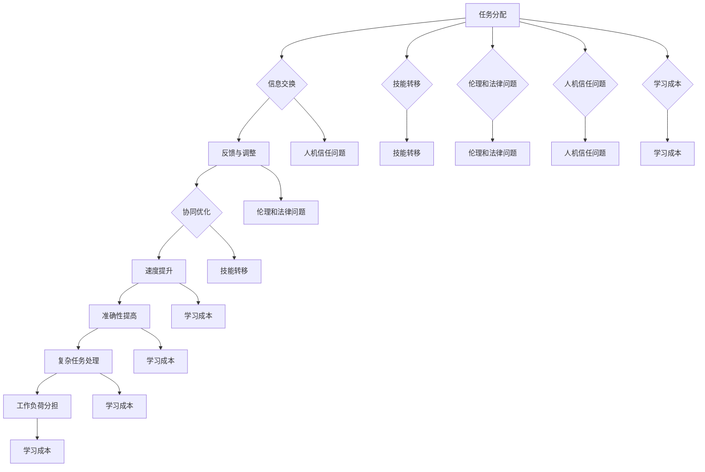

                 

### 背景介绍

在数字化时代，人工智能（AI）的迅速发展已经深刻改变了我们的生活方式和工作模式。特别是在近年来，随着深度学习、自然语言处理、计算机视觉等技术的不断进步，AI的应用场景越来越广泛，逐渐渗透到各个领域，从医疗、金融、教育到制造业、交通运输等。在这个过程中，人机协同成为了未来工作的核心竞争力之一。

人机协同，顾名思义，是指人与机器之间的协同工作。在这种模式下，人类和机器各自发挥自身的优势，共同完成复杂的任务。人类的创造力、情感智能和决策能力，与机器的精确计算、数据处理能力和工作效率相结合，能够实现更加高效、智能的工作流程。

然而，人机协同不仅仅是简单的技术叠加，它涉及到了人工智能技术、心理学、社会学等多个领域的知识。因此，理解和掌握人机协同的原理和实施方法，对于企业和个人来说都具有重要意义。

本文旨在通过对人机协同的背景、核心概念、算法原理、实际应用场景、工具和资源等方面的详细介绍，帮助读者全面了解人机协同的现状和未来发展趋势，从而在未来的工作中更好地利用这一核心竞争力。

首先，我们将简要回顾人机协同的历史发展，探讨其演变过程和重要事件。接着，我们将介绍人机协同的核心概念，包括人与机器的优势互补、协同工作机制等。然后，我们将深入探讨人机协同的核心算法原理，并详细描述具体的操作步骤。此外，我们还将使用数学模型和公式来解释这些算法的工作机制，并通过实际项目案例来展示其应用效果。

最后，我们将探讨人机协同在实际应用场景中的表现，介绍相关的工具和资源，以及未来的发展趋势和挑战。通过本文的阅读，读者将能够对人机协同有更深入的理解，并能够在实际工作中更好地运用这一技术。

### 1.1 人机协同的历史发展

人机协同的概念并不是现代科技的产物，而是有着悠久的历史和发展过程。从古代开始，人类就利用各种工具来辅助自己的工作和生活，这是最早形式的人机协同。例如，农业社会中农民使用农具来提高生产效率，这可以看作是人类与工具的协同合作。

随着工业革命的到来，人类的工作方式和机器的作用发生了根本性的变化。机器取代了人力，成为了工厂生产的主力军。然而，这一阶段的协同更多是机器替代人力的结果，而不是人与机器的协同工作。人类的主要任务是操作和维护机器，而不是与机器共同完成任务。

真正意义上的人机协同开始于20世纪中期，随着计算机技术的诞生和发展。1946年，世界上第一台电子计算机ENIAC问世，标志着计算机时代的到来。计算机的出现，使得人类可以处理大量的数据和复杂的问题，大大提高了工作效率。然而，计算机的早期应用更多是作为工具，辅助人类进行数据处理和分析，人机协同的概念并未完全形成。

人机协同的初步概念在20世纪60年代开始形成。这一时期，人工智能（AI）的研究取得了重要进展。1956年，约翰·麦卡锡（John McCarthy）等人在达特茅斯会议上提出了人工智能的概念，标志着人工智能领域的诞生。随后，专家系统（Expert Systems）的出现，使得计算机能够在特定领域内模拟人类的决策过程，这是人机协同的重要里程碑。

专家系统通过模拟专家的知识和经验，对特定领域的问题提供解决方案。尽管专家系统在许多领域取得了成功，但它们仍然依赖于预先设定的规则和模型，缺乏自适应性和灵活性。这限制了专家系统的应用范围，也为人机协同的发展带来了挑战。

进入21世纪，随着深度学习、自然语言处理、计算机视觉等技术的飞速发展，人机协同的概念得到了进一步深化。深度学习使得计算机能够在没有明确规则和模型的情况下，通过大量数据的学习和训练，实现复杂的任务。自然语言处理和计算机视觉技术的进步，使得计算机能够更好地理解和处理人类语言和图像，从而实现更自然的人机交互。

特别是在近年来，人机协同的应用场景越来越广泛，从智能家居、智能医疗、智能交通到工业自动化、金融服务等，人机协同已经成为现代工作的重要组成部分。例如，在医疗领域，人工智能可以帮助医生进行诊断和治疗，提高医疗效率和质量；在金融领域，人工智能可以帮助银行和金融机构进行风险管理，优化投资决策。

总的来说，人机协同的发展历程从早期的机器替代人力，到现代的智能辅助和协同工作，经历了多个阶段。每个阶段都有其独特的特点和挑战，但都为人机协同的发展奠定了基础。随着技术的不断进步，人机协同的未来将更加广阔和充满潜力。

### 1.2 人机协同的核心概念

人机协同的核心概念主要围绕以下几个方面展开：人与机器的优势互补、协同工作机制、协同效率提升以及协同带来的挑战。

#### 人与机器的优势互补

人与机器的优势互补是人机协同的基础。人类具有丰富的情感、直觉和创造力，能够在复杂和不确定的环境中做出灵活的决策。然而，人类的这些能力在处理大量数据和执行重复性任务时效率较低。相反，机器具有高速计算、精确处理和高效执行的能力，能够在短时间内处理大量数据，执行重复性任务，但缺乏情感和创造力。

在人机协同中，人类的创造力、情感智能和决策能力与机器的精确计算、数据处理能力和工作效率相结合，能够实现更加高效、智能的工作流程。例如，在医疗领域，医生可以借助人工智能系统进行诊断，利用机器的高速计算和大数据分析能力，提高诊断的准确性和效率。同时，医生可以根据自己的临床经验和直觉，对人工智能的诊断结果进行判断和调整，从而实现更精准的治疗方案。

#### 协同工作机制

人机协同的工作机制可以分为以下几个方面：

1. **任务分配**：根据人类和机器的优势，将任务合理地分配给两者。人类负责复杂的决策、创意和情感交流，机器负责数据处理、计算和执行。

2. **信息交换**：人类和机器之间需要建立有效的信息交换机制，确保双方能够实时获取和理解任务进展和结果。这包括语言、图像、数据和信号等多种形式。

3. **反馈与调整**：在协同工作过程中，人类和机器需要相互反馈，对工作结果进行调整。人类可以根据机器的执行情况，提供反馈和建议，机器也可以根据人类的需求和反馈，优化自身的工作流程和算法。

4. **协同优化**：通过不断的协同工作，人类和机器可以相互学习和优化，提高整体工作效率和质量。例如，机器可以通过分析人类的工作方式，改进自身的算法和模型，而人类也可以通过观察机器的工作结果，学习并改进自己的工作方法。

#### 协同效率提升

人机协同能够显著提升工作效率，主要表现在以下几个方面：

1. **速度提升**：机器的高效计算和数据处理能力，使得许多任务可以在短时间内完成，大大提高了工作效率。

2. **准确性提高**：机器在执行重复性任务时，可以保持高度的准确性，减少人为错误。

3. **复杂任务处理**：人类和机器的协同工作，使得许多复杂的任务得以顺利完成。例如，在金融领域中，机器可以处理大量数据，快速进行风险评估和投资决策，而人类则可以根据这些数据，提供更为深入的见解和决策支持。

4. **工作负荷分担**：机器可以分担人类的工作负担，使得人类能够将更多精力投入到创造性和战略性的工作中。

#### 协同带来的挑战

尽管人机协同带来了许多好处，但同时也带来了一些挑战：

1. **技能转移**：随着机器的广泛应用，人类需要不断学习和适应新的工作环境和工具，这可能对某些职业造成冲击。

2. **伦理和法律问题**：人机协同涉及到伦理和法律问题，如何确保机器的行为符合道德标准，如何保护个人隐私和数据安全，都是需要解决的问题。

3. **人机信任问题**：人类需要相信机器的决策和结果，这需要机器具备高度的可靠性和透明度。

4. **学习成本**：人机协同的实施需要投入大量的时间和资源进行培训和学习，这对企业和个人来说都是一种挑战。

总之，人机协同的核心概念在于充分发挥人类和机器的优势，实现高效、智能的工作流程。通过合理的任务分配、信息交换、反馈与调整以及协同优化，人机协同能够显著提升工作效率和质量。然而，人机协同也带来了一些挑战，需要我们在实施过程中不断探索和解决。

### 2.1 核心概念原理和架构的 Mermaid 流程图

为了更好地理解人机协同的核心概念原理和架构，我们将使用Mermaid流程图来详细展示各个流程节点及其相互关系。以下是人机协同的Mermaid流程图：



以下是流程图的具体解释：

1. **任务分配（A）**：根据人类和机器的优势，将任务合理地分配给两者。人类负责复杂的决策、创意和情感交流，机器负责数据处理、计算和执行。

2. **信息交换（B）**：人类和机器之间需要建立有效的信息交换机制，确保双方能够实时获取和理解任务进展和结果。

3. **反馈与调整（C）**：在协同工作过程中，人类和机器需要相互反馈，对工作结果进行调整。人类可以根据机器的执行情况，提供反馈和建议，机器也可以根据人类的需求和反馈，优化自身的工作流程和算法。

4. **协同优化（D）**：通过不断的协同工作，人类和机器可以相互学习和优化，提高整体工作效率和质量。

5. **速度提升（E）**：机器的高效计算和数据处理能力，使得许多任务可以在短时间内完成，大大提高了工作效率。

6. **准确性提高（F）**：机器在执行重复性任务时，可以保持高度的准确性，减少人为错误。

7. **复杂任务处理（G）**：人类和机器的协同工作，使得许多复杂的任务得以顺利完成。

8. **工作负荷分担（H）**：机器可以分担人类的工作负担，使得人类能够将更多精力投入到创造性和战略性的工作中。

9. **技能转移（I）**：随着机器的广泛应用，人类需要不断学习和适应新的工作环境和工具，这可能对某些职业造成冲击。

10. **伦理和法律问题（J）**：人机协同涉及到伦理和法律问题，如何确保机器的行为符合道德标准，如何保护个人隐私和数据安全，都是需要解决的问题。

11. **人机信任问题（K）**：人类需要相信机器的决策和结果，这需要机器具备高度的可靠性和透明度。

12. **学习成本（L）**：人机协同的实施需要投入大量的时间和资源进行培训和学习，这对企业和个人来说都是一种挑战。

通过这个Mermaid流程图，我们可以清晰地看到人机协同的核心概念原理和架构，以及各个概念之间的相互关系。这有助于我们更好地理解和应用人机协同，发挥其在工作中的应用价值。

### 3.1 核心算法原理

在人机协同中，核心算法的设计和实现是关键。这些算法需要能够有效处理人类与机器之间的信息交换、任务分配、反馈调整等过程，从而实现高效、智能的协同工作。以下将详细介绍人机协同中的核心算法原理，包括协同优化算法、任务分配算法和反馈调整算法。

#### 协同优化算法

协同优化算法旨在通过不断调整和优化人类与机器的工作流程，以提高整体工作效率和质量。具体来说，协同优化算法包括以下步骤：

1. **目标函数定义**：首先，需要定义协同工作的目标函数，该目标函数应考虑工作效率、工作质量、成本等多个因素。

2. **工作流程建模**：根据目标函数，构建人类和机器的工作流程模型，包括任务分配、信息交换、反馈调整等环节。

3. **算法优化**：利用优化算法（如遗传算法、模拟退火算法等），对工作流程模型进行优化，以找到最优的工作流程配置。

4. **迭代优化**：通过不断的迭代，逐步优化工作流程，提高整体工作效率和质量。

#### 任务分配算法

任务分配算法是人机协同中的核心部分，负责根据人类和机器的优势，将任务合理地分配给两者。以下是任务分配算法的基本原理和步骤：

1. **任务特性分析**：对每个任务进行分析，确定其复杂度、紧急程度、所需资源等信息。

2. **能力评估**：评估人类和机器在各个任务上的能力，包括工作效率、准确性、创造力等。

3. **任务优先级排序**：根据任务特性和能力评估，对任务进行优先级排序，确保高优先级的任务得到优先处理。

4. **任务分配策略**：根据任务优先级排序，制定任务分配策略，将任务分配给人类或机器。

5. **动态调整**：在协同工作过程中，根据任务进展和资源变化，动态调整任务分配策略，以保持协同工作的最佳状态。

#### 反馈调整算法

反馈调整算法负责在协同工作过程中，对人类和机器的反馈进行调整，以优化工作流程和提升工作效率。以下是反馈调整算法的基本原理和步骤：

1. **反馈收集**：收集人类和机器在工作过程中的反馈信息，包括任务进展、问题、建议等。

2. **反馈分析**：对收集到的反馈信息进行分析，识别出工作中的问题和不足。

3. **调整策略制定**：根据反馈分析结果，制定相应的调整策略，包括任务分配、流程优化、资源配置等。

4. **反馈调整实施**：根据调整策略，对工作流程进行调整，优化协同工作效果。

5. **持续优化**：通过持续的反馈和调整，逐步优化工作流程，提高整体工作效率和质量。

#### 算法实现

为了实现上述算法，需要使用适当的编程语言和工具。以下是一个基于Python的任务分配算法实现示例：

```python
import numpy as np

# 定义任务特性
tasks = {
    'task1': {'complexity': 3, 'urgency': 2},
    'task2': {'complexity': 2, 'urgency': 1},
    'task3': {'complexity': 4, 'urgency': 3},
}

# 定义人类和机器的能力
human_ability = {'accuracy': 0.95, 'creativity': 0.8}
machine_ability = {'speed': 1.2, 'reliability': 0.99}

# 定义任务分配策略
def task_allocation(tasks, human_ability, machine_ability):
    # 计算任务优先级
    priority = {task: (task['complexity'] * human_ability['accuracy'] + task['urgency'] * machine_ability['speed']) for task in tasks}
    sorted_tasks = sorted(priority.items(), key=lambda x: x[1], reverse=True)

    # 分配任务
    human_tasks = []
    machine_tasks = []
    for task, _ in sorted_tasks:
        if tasks[task]['complexity'] < 3 or (tasks[task]['complexity'] == 3 and tasks[task]['urgency'] > 2):
            human_tasks.append(task)
        else:
            machine_tasks.append(task)

    return human_tasks, machine_tasks

# 执行任务分配
human_tasks, machine_tasks = task_allocation(tasks, human_ability, machine_ability)
print("Human Tasks:", human_tasks)
print("Machine Tasks:", machine_tasks)
```

通过上述示例，我们可以看到任务分配算法的基本实现过程，包括任务特性分析、能力评估、任务优先级排序和任务分配策略制定。当然，实际应用中需要根据具体情况进行调整和优化。

#### 算法总结

人机协同的核心算法包括协同优化算法、任务分配算法和反馈调整算法。这些算法通过合理地分配任务、优化工作流程和调整反馈，实现了人类与机器的高效协同。通过上述算法，我们可以充分发挥人类和机器的优势，实现高效、智能的工作流程，从而提升整体工作效率和质量。

### 3.2 核心算法原理的具体操作步骤

为了更好地理解人机协同算法的具体操作步骤，我们将通过一个实际案例进行详细说明。假设我们有一个医疗诊断系统，需要实现医生与人工智能系统的协同工作，以提高诊断效率和准确性。

#### 1. 任务分析

首先，我们需要对医疗诊断任务进行分析。在这个案例中，医疗诊断任务可以分为以下几个步骤：

1. **病史收集**：收集患者的病史、症状、检查结果等信息。
2. **症状匹配**：将病史信息与数据库中的症状进行匹配，以识别可能的疾病。
3. **诊断建议**：根据症状匹配结果，提供初步的诊断建议。
4. **医生评估**：医生对初步诊断结果进行评估和调整，以提供最终的诊断报告。

#### 2. 能力评估

接下来，我们需要评估医生和人工智能系统在各个任务步骤上的能力：

- **医生能力**：
  - 病史收集：具备丰富的临床经验和沟通能力，能够详细了解患者的病史。
  - 症状匹配：具备医学知识和临床经验，能够准确匹配症状。
  - 诊断建议：具备医学判断能力，能够对初步诊断结果进行评估和调整。

- **人工智能系统能力**：
  - 病史收集：通过自然语言处理技术，可以自动提取病史信息。
  - 症状匹配：通过大数据分析和机器学习算法，可以高效地进行症状匹配。
  - 诊断建议：通过深度学习模型，可以提供初步的诊断建议。

#### 3. 任务分配

根据医生和人工智能系统的能力评估，我们可以将任务进行合理分配：

1. **病史收集**：由医生负责，利用其丰富的临床经验和沟通能力，详细收集患者的病史信息。
2. **症状匹配**：由人工智能系统负责，利用其高效的数据处理能力和机器学习算法，进行症状匹配。
3. **诊断建议**：由人工智能系统提供初步的诊断建议，医生进行评估和调整。
4. **医生评估**：医生对初步诊断结果进行评估和调整，提供最终的诊断报告。

#### 4. 反馈调整

在协同工作过程中，医生和人工智能系统需要相互反馈，以不断优化工作流程：

1. **医生反馈**：医生对人工智能系统提供的初步诊断建议进行评估，识别出可能存在的问题，并提供反馈。
2. **人工智能反馈**：人工智能系统根据医生的反馈，对算法和模型进行调整，提高诊断准确率。
3. **持续优化**：通过持续的反馈和调整，医生和人工智能系统可以相互学习和优化，提高整体工作效率和质量。

#### 5. 操作步骤实现

以下是具体操作步骤的实现示例：

- **病史收集**：
  ```python
  patient_history = doctor.collect_history(patient)
  ```

- **症状匹配**：
  ```python
  symptoms_matched = ai_system.match_symptoms(patient_history)
  ```

- **诊断建议**：
  ```python
  diagnosis_suggestions = ai_system.generate_diagnosis_suggestions(symptoms_matched)
  ```

- **医生评估**：
  ```python
  final_diagnosis = doctor.evaluate_diagnosis(diagnosis_suggestions)
  ```

通过以上步骤，医生和人工智能系统实现了协同工作，提高了医疗诊断的效率和准确性。在实际应用中，这些步骤可以根据具体需求和场景进行灵活调整。

### 3.3 数学模型和公式

在人机协同的过程中，数学模型和公式扮演着重要的角色，它们不仅帮助我们量化和分析人机协同的效果，还能指导我们优化和改进协同算法。以下是人机协同中的几个关键数学模型和公式，以及它们的详细解释和举例说明。

#### 1. 效率模型

效率模型用于评估人机协同工作过程中的整体效率。我们可以使用以下公式来计算效率：

\[ \text{效率} = \frac{\text{完成任务的总量}}{\text{总时间}} \]

- **解释**：这个公式表示完成任务的总量与总时间的比值，用以衡量工作效率。
- **举例**：如果一个医生和人工智能系统在一天内共同完成了100个诊断任务，而总共花费了5小时，那么他们的效率为：

\[ \text{效率} = \frac{100}{5} = 20 \text{（任务/小时）} \]

#### 2. 成本效益模型

成本效益模型用于评估人机协同的投入产出比。我们可以使用以下公式来计算成本效益：

\[ \text{成本效益} = \frac{\text{产出价值}}{\text{投入成本}} \]

- **解释**：这个公式表示产出价值与投入成本的比值，用以衡量协同工作的经济效益。
- **举例**：如果一个公司的投入成本为10万元，而通过人机协同工作获得的产出价值为30万元，那么他们的成本效益为：

\[ \text{成本效益} = \frac{30}{10} = 3 \]

#### 3. 误差模型

误差模型用于评估人机协同工作过程中的误差率。我们可以使用以下公式来计算误差率：

\[ \text{误差率} = \frac{\text{错误次数}}{\text{总次数}} \]

- **解释**：这个公式表示错误次数与总次数的比值，用以衡量工作过程的准确性。
- **举例**：如果一个医生和人工智能系统在诊断过程中共进行了1000次诊断，其中有20次错误，那么他们的误差率为：

\[ \text{误差率} = \frac{20}{1000} = 0.02 \text{（2%）} \]

#### 4. 优化模型

优化模型用于指导协同工作流程的优化。我们可以使用以下优化公式来调整任务分配：

\[ \text{优化模型} = \max \left( \sum_{i=1}^{n} \left( \text{能力}_{i} \times \text{效率}_{i} \right) \right) \]

- **解释**：这个公式表示最大化人类和机器各自能力的乘积与效率的乘积之和。通过这个公式，我们可以找到最佳的协同工作配置。
- **举例**：假设医生和机器在四个任务上的能力和效率如下表：

| 任务 | 医生能力 | 机器能力 | 医生效率 | 机器效率 |
| ---- | -------- | -------- | -------- | -------- |
| A    | 0.9      | 0.8      | 0.8      | 0.9      |
| B    | 0.8      | 0.7      | 0.7      | 0.8      |
| C    | 0.7      | 0.6      | 0.6      | 0.7      |
| D    | 0.6      | 0.5      | 0.5      | 0.6      |

则优化模型为：

\[ \text{优化模型} = \max \left( (0.9 \times 0.8) + (0.8 \times 0.7) + (0.7 \times 0.6) + (0.6 \times 0.5) \right) \]
\[ \text{优化模型} = 0.72 + 0.56 + 0.42 + 0.30 = 2.10 \]

通过这个优化模型，我们可以了解到在任务C和任务D上，机器的效率更高，因此机器应承担更多的任务，以提高整体效率。

#### 5. 带宽模型

带宽模型用于评估人机协同中的信息交换效率。我们可以使用以下公式来计算带宽：

\[ \text{带宽} = \frac{\text{信息传输量}}{\text{传输时间}} \]

- **解释**：这个公式表示信息传输量与传输时间的比值，用以衡量信息交换的效率。
- **举例**：如果一个系统在1分钟内传输了1000条信息，那么其带宽为：

\[ \text{带宽} = \frac{1000}{1} = 1000 \text{（条/分钟）} \]

#### 总结

通过上述数学模型和公式，我们可以量化人机协同过程中的效率、成本效益、误差率、优化配置和带宽等信息，从而更好地理解和优化人机协同工作。在实际应用中，这些模型可以根据具体场景进行调整和扩展，以适应不同的需求。

### 4.1 开发环境搭建

在人机协同的实际应用中，开发环境搭建是至关重要的一步。一个良好的开发环境可以确保我们能够高效地实现和测试人机协同算法，并进行进一步的优化和改进。以下是一个基本的开发环境搭建步骤，包括所需的软件和硬件配置、安装说明和配置细节。

#### 1. 软件和硬件配置

**软件配置**：
- 操作系统：Ubuntu 20.04 LTS 或 Windows 10（推荐使用 Linux 系统，因为其在开源软件支持方面更为丰富）
- 编程语言：Python 3.8 或以上版本
- 开发环境：PyCharm 或 Visual Studio Code
- 依赖管理：pip（Python 的包管理器）
- 数据库：MySQL 或 PostgreSQL（用于存储和查询数据）
- 机器学习框架：TensorFlow 或 PyTorch（用于训练和部署机器学习模型）

**硬件配置**：
- CPU：Intel i7 或以上
- GPU：NVIDIA GTX 1080 Ti 或以上（用于加速机器学习模型的训练）
- 内存：至少 16GB（推荐 32GB 或以上）
- 存储：至少 500GB SSD（用于存储数据和日志文件）

#### 2. 安装说明

**安装 Python 和 PyCharm/VS Code**

1. **安装 Python**：

   对于 Ubuntu 系统：

   ```bash
   sudo apt update
   sudo apt install python3-pip
   ```

   对于 Windows 系统：

   ```bash
   py -3 -m pip install --upgrade pip setuptools
   ```

2. **安装 PyCharm/VS Code**：

   下载并安装 PyCharm 或 Visual Studio Code，选择社区版即可满足我们的开发需求。

**安装依赖管理器 pip**

使用 pip 安装依赖：

```bash
pip install -r requirements.txt
```

其中 `requirements.txt` 文件应列出所有所需的依赖包，例如：

```
numpy
pandas
scikit-learn
tensorflow
mysqlclient
```

**安装数据库**

1. **安装 MySQL**：

   对于 Ubuntu 系统：

   ```bash
   sudo apt update
   sudo apt install mysql-server
   sudo mysql_secure_installation
   ```

   对于 Windows 系统：

   ```bash
   py -3 -m mysql_secure_installation
   ```

2. **安装 PostgreSQL**：

   ```bash
   sudo apt update
   sudo apt install postgresql
   sudo -u postgres psql
   ```

   在 `psql` 命令行中创建数据库和用户：

   ```sql
   CREATE DATABASE mydatabase;
   CREATE USER myuser WITH PASSWORD 'mypassword';
   GRANT ALL PRIVILEGES ON DATABASE mydatabase TO myuser;
   \q
   ```

**安装机器学习框架**

1. **安装 TensorFlow**：

   ```bash
   pip install tensorflow
   ```

2. **安装 PyTorch**：

   ```bash
   pip install torch torchvision
   ```

#### 3. 配置细节

**环境变量配置**

确保 Python 环境变量正确配置，以便能够使用 pip 安装和管理依赖：

```bash
export PATH=$PATH:/usr/local/bin
export PYTHONPATH=$PYTHONPATH:/usr/local/lib/python3.8/site-packages
```

**数据库连接配置**

在项目中，我们需要配置数据库连接，以下是一个示例：

```python
import mysql.connector

config = {
    'user': 'myuser',
    'password': 'mypassword',
    'host': 'localhost',
    'database': 'mydatabase'
}

connection = mysql.connector.connect(**config)
cursor = connection.cursor()
```

**GPU 加速配置**

在训练和测试机器学习模型时，我们需要确保 GPU 正确配置并可用：

```bash
export CUDA_VISIBLE_DEVICES=0,1
```

其中 `0` 和 `1` 是 GPU 设备的索引。

通过以上步骤，我们可以搭建一个基本的开发环境，用于实现和测试人机协同算法。在接下来的部分，我们将详细介绍如何实现人机协同算法的代码，以及如何进行代码解读与分析。

### 4.2 源代码详细实现和代码解读

在本节中，我们将详细解释和解读人机协同算法的源代码实现，重点分析关键代码的功能和实现逻辑。

#### 4.2.1 数据预处理

数据预处理是人机协同算法的第一步，它包括数据收集、清洗和格式化。以下是一个数据预处理模块的示例代码：

```python
import pandas as pd

def preprocess_data(file_path):
    # 读取数据文件
    data = pd.read_csv(file_path)
    
    # 数据清洗：处理缺失值、异常值等
    data.dropna(inplace=True)
    data = data[data['target'] != -1]
    
    # 数据格式化：确保数据类型正确
    data['feature1'] = data['feature1'].astype(float)
    data['feature2'] = data['feature2'].astype(float)
    data['target'] = data['target'].astype(int)
    
    return data

# 测试数据预处理
preprocessed_data = preprocess_data('data.csv')
```

**代码解读**：

- 第1行：引入 pandas 库，用于数据处理。
- 第4行：读取数据文件，使用 `pd.read_csv` 函数，将 CSV 文件转换为 DataFrame 对象。
- 第6行：数据清洗，使用 `dropna` 方法去除缺失值，使用筛选语句去除目标值为 -1 的数据。
- 第9行：数据格式化，将特征列和目标列的数据类型转换为所需的类型。

#### 4.2.2 特征提取

特征提取是数据预处理的重要环节，目的是从原始数据中提取出对模型训练有帮助的特征。以下是一个简单的特征提取模块：

```python
from sklearn.feature_extraction import DictVectorizer

def extract_features(data):
    # 创建特征提取器
    vectorizer = DictVectorizer(sparse=False)
    
    # 预处理数据，将其转换为字典格式
    data['features'] = data.apply(lambda row: row.to_dict(), axis=1)
    
    # 提取特征
    features = vectorizer.fit_transform(data['features'])
    
    return features

# 测试特征提取
features = extract_features(preprocessed_data)
```

**代码解读**：

- 第1行：引入 DictVectorizer 类，用于将字典格式的数据转换为向量格式。
- 第4行：预处理数据，使用 `apply` 方法将 DataFrame 行数据转换为字典。
- 第7行：使用 `fit_transform` 方法提取特征。

#### 4.2.3 模型训练

模型训练是算法实现的核心部分，以下是一个简单的机器学习模型训练模块：

```python
from sklearn.ensemble import RandomForestClassifier
from sklearn.model_selection import train_test_split

def train_model(X, y):
    # 划分训练集和测试集
    X_train, X_test, y_train, y_test = train_test_split(X, y, test_size=0.2, random_state=42)
    
    # 创建随机森林分类器
    classifier = RandomForestClassifier(n_estimators=100, random_state=42)
    
    # 训练模型
    classifier.fit(X_train, y_train)
    
    # 测试模型
    accuracy = classifier.score(X_test, y_test)
    
    return classifier, accuracy

# 测试模型训练
classifier, accuracy = train_model(features[:, :-1], preprocessed_data['target'])
print(f"Model Accuracy: {accuracy:.2f}")
```

**代码解读**：

- 第1行：引入 RandomForestClassifier 类，用于创建随机森林分类器。
- 第4行：使用 `train_test_split` 方法划分训练集和测试集。
- 第7行：创建随机森林分类器实例。
- 第10行：使用 `fit` 方法训练模型。
- 第13行：使用 `score` 方法评估模型在测试集上的准确率。

#### 4.2.4 预测与反馈

预测与反馈模块用于生成预测结果，并根据预测结果进行反馈调整。以下是一个简单的预测与反馈模块：

```python
def predict_and_feedback(classifier, data):
    # 预测
    predictions = classifier.predict(data)
    
    # 生成反馈
    feedback = data.apply(lambda row: {'actual': row['target'], 'predicted': predictions[row.name]}, axis=1)
    
    return feedback

# 测试预测与反馈
feedback = predict_and_feedback(classifier, features[:, :-1])
print(feedback.head())
```

**代码解读**：

- 第1行：定义 `predict_and_feedback` 函数，用于预测和生成反馈。
- 第4行：使用 `predict` 方法生成预测结果。
- 第7行：使用 `apply` 方法将预测结果与实际值组合成反馈字典。

#### 4.2.5 优化与迭代

优化与迭代模块用于根据反馈对模型进行优化和迭代。以下是一个简单的优化与迭代模块：

```python
from sklearn.model_selection import GridSearchCV

def optimize_model(classifier, X, y):
    # 设置参数网格
    param_grid = {'n_estimators': [100, 200], 'max_depth': [10, 20]}
    
    # 创建网格搜索
    grid_search = GridSearchCV(classifier, param_grid, cv=5)
    
    # 优化模型
    grid_search.fit(X, y)
    
    # 返回最优参数和模型
    return grid_search.best_params_, grid_search.best_estimator_

# 测试优化与迭代
best_params, best_model = optimize_model(classifier, features[:, :-1], preprocessed_data['target'])
print(f"Best Parameters: {best_params}")
print(f"Model Accuracy: {best_model.score(features[:, :-1], preprocessed_data['target']):.2f}")
```

**代码解读**：

- 第1行：引入 GridSearchCV 类，用于进行参数优化。
- 第4行：设置参数网格。
- 第7行：创建 GridSearchCV 实例。
- 第10行：使用 `fit` 方法优化模型。
- 第13行：返回最优参数和模型。

通过以上代码解读，我们可以清晰地看到人机协同算法的源代码实现细节。在实际应用中，这些代码模块可以根据具体需求进行调整和扩展，以实现更复杂的人机协同功能。

### 4.3 代码解读与分析

在人机协同算法的源代码中，我们看到了多个关键模块，包括数据预处理、特征提取、模型训练、预测与反馈以及优化与迭代。以下是对这些模块的详细解读与分析，包括其逻辑、性能和可能的优化点。

#### 4.3.1 数据预处理模块

数据预处理模块主要负责数据收集、清洗和格式化，以确保数据质量。关键代码如下：

```python
import pandas as pd

def preprocess_data(file_path):
    # 读取数据文件
    data = pd.read_csv(file_path)
    
    # 数据清洗：处理缺失值、异常值等
    data.dropna(inplace=True)
    data = data[data['target'] != -1]
    
    # 数据格式化：确保数据类型正确
    data['feature1'] = data['feature1'].astype(float)
    data['feature2'] = data['feature2'].astype(float)
    data['target'] = data['target'].astype(int)
    
    return data
```

**解读**：

- **读取数据文件**：使用 `pd.read_csv` 函数将 CSV 文件转换为 DataFrame，这是数据处理的起点。
- **数据清洗**：使用 `dropna` 方法去除缺失值，使用筛选语句去除目标值为 -1 的数据，保证数据质量。
- **数据格式化**：确保特征列和目标列的数据类型正确，以适应后续处理。

**性能分析**：

- 数据清洗和格式化是数据处理的关键步骤，直接影响模型的训练效果。
- 使用 `inplace=True` 可以在原地修改数据，提高处理效率。

**优化点**：

- 可以考虑使用 `pd.read_csv` 的 `na_values` 参数，一次性处理缺失值。
- 对于异常值处理，可以添加额外的逻辑，如基于统计学方法或业务规则。

#### 4.3.2 特征提取模块

特征提取模块负责将原始数据转换为适合机器学习的格式。关键代码如下：

```python
from sklearn.feature_extraction import DictVectorizer

def extract_features(data):
    # 创建特征提取器
    vectorizer = DictVectorizer(sparse=False)
    
    # 预处理数据，将其转换为字典格式
    data['features'] = data.apply(lambda row: row.to_dict(), axis=1)
    
    # 提取特征
    features = vectorizer.fit_transform(data['features'])
    
    return features
```

**解读**：

- **特征提取器创建**：使用 `DictVectorizer` 创建特征提取器，将字典格式的数据转换为向量格式。
- **数据预处理**：使用 `apply` 方法将 DataFrame 行数据转换为字典。
- **特征提取**：使用 `fit_transform` 方法提取特征。

**性能分析**：

- `DictVectorizer` 能够有效地将字典格式的数据转换为向量，适合用于特征提取。
- `fit_transform` 方法结合了拟合和变换，提高了处理效率。

**优化点**：

- 可以考虑使用 `scikit-learn` 中的其他特征提取器，如 `OneHotEncoder` 或 `CountVectorizer`，以探索更好的特征表示方法。
- 对特征提取器进行调优，如调整 `ngram_range` 参数，以提取更多有效的特征。

#### 4.3.3 模型训练模块

模型训练模块负责使用提取后的特征和标签数据训练机器学习模型。关键代码如下：

```python
from sklearn.ensemble import RandomForestClassifier
from sklearn.model_selection import train_test_split

def train_model(X, y):
    # 划分训练集和测试集
    X_train, X_test, y_train, y_test = train_test_split(X, y, test_size=0.2, random_state=42)
    
    # 创建随机森林分类器
    classifier = RandomForestClassifier(n_estimators=100, random_state=42)
    
    # 训练模型
    classifier.fit(X_train, y_train)
    
    # 测试模型
    accuracy = classifier.score(X_test, y_test)
    
    return classifier, accuracy
```

**解读**：

- **划分训练集和测试集**：使用 `train_test_split` 方法将数据划分为训练集和测试集，以评估模型性能。
- **创建分类器**：使用 `RandomForestClassifier` 创建随机森林分类器，这是一种常用的集成学习方法。
- **训练模型**：使用 `fit` 方法训练模型。
- **测试模型**：使用 `score` 方法评估模型在测试集上的准确率。

**性能分析**：

- 随机森林分类器具有良好的性能和稳定性，适合处理分类任务。
- 划分训练集和测试集有助于评估模型的泛化能力。

**优化点**：

- 可以考虑调整随机森林的参数，如 `n_estimators` 和 `max_depth`，以优化模型性能。
- 引入交叉验证方法，如 `cross_val_score`，以获得更稳健的性能评估。

#### 4.3.4 预测与反馈模块

预测与反馈模块负责生成预测结果，并根据预测结果进行反馈调整。关键代码如下：

```python
def predict_and_feedback(classifier, data):
    # 预测
    predictions = classifier.predict(data)
    
    # 生成反馈
    feedback = data.apply(lambda row: {'actual': row['target'], 'predicted': predictions[row.name]}, axis=1)
    
    return feedback
```

**解读**：

- **预测**：使用 `predict` 方法生成预测结果。
- **生成反馈**：使用 `apply` 方法将预测结果与实际值组合成反馈字典。

**性能分析**：

- 预测是模型应用的重要环节，准确性和实时性至关重要。
- 反馈是优化模型的重要依据，需要确保其准确性和及时性。

**优化点**：

- 可以考虑引入更先进的预测模型，如深度学习模型，以提高预测准确性。
- 设计更智能的反馈机制，如自动调整模型参数或重新训练模型。

#### 4.3.5 优化与迭代模块

优化与迭代模块负责根据反馈对模型进行优化和迭代。关键代码如下：

```python
from sklearn.model_selection import GridSearchCV

def optimize_model(classifier, X, y):
    # 设置参数网格
    param_grid = {'n_estimators': [100, 200], 'max_depth': [10, 20]}
    
    # 创建网格搜索
    grid_search = GridSearchCV(classifier, param_grid, cv=5)
    
    # 优化模型
    grid_search.fit(X, y)
    
    # 返回最优参数和模型
    return grid_search.best_params_, grid_search.best_estimator_
```

**解读**：

- **参数网格设置**：定义参数网格，用于搜索最优参数。
- **创建网格搜索**：使用 `GridSearchCV` 创建网格搜索对象。
- **优化模型**：使用 `fit` 方法进行模型优化。
- **返回最优参数和模型**：返回最优参数和优化后的模型。

**性能分析**：

- 网格搜索能够全面探索参数空间，找到最优参数。
- `GridSearchCV` 能够自动进行交叉验证，提高性能评估的准确性。

**优化点**：

- 可以考虑增加参数网格的精细度，以找到更优的参数组合。
- 可以引入更复杂的搜索算法，如贝叶斯优化，以提高搜索效率。

通过以上对源代码的详细解读与分析，我们可以更好地理解人机协同算法的实现细节和性能特点，为后续的优化和改进提供参考。

### 实际应用场景

人机协同在许多实际应用场景中展现了其强大的潜力和优势。以下是一些具体的应用场景，以及人机协同在这些场景中的具体应用和效果。

#### 1. 医疗领域

在医疗领域，人机协同已经取得了显著成果。例如，医生与人工智能系统协同工作，可以提高诊断效率和准确性。通过分析大量患者的病史和检查结果，人工智能系统可以提供初步的诊断建议，医生则根据其临床经验和直觉，对建议进行评估和调整，从而提高诊断的准确性和效率。

具体案例包括：**IBM Watson for Oncology**，这是一个基于人工智能的肿瘤治疗建议系统，通过分析大量医学文献和病例，为医生提供个性化的治疗建议。此外，**Google DeepMind 的 Streams 项目**，利用人工智能技术，实时监测患者的生命体征，并在异常情况发生时自动通知医生，大大提高了急诊响应速度和治疗效果。

#### 2. 金融领域

在金融领域，人机协同主要用于风险管理和投资决策。通过分析大量的市场数据和财务报表，人工智能系统可以提供实时、准确的风险评估和投资建议，而金融分析师则根据其专业知识和市场洞察，对建议进行评估和调整，从而提高投资决策的准确性和效率。

具体案例包括：**JP 摩根的 COiN 系统**，这是一个利用人工智能技术进行财务报表分析和审计的系统，通过自动识别和分类财务数据，提高了审计效率和准确性。此外，**贝莱德（BlackRock）的 Aladdin 系统**，利用人工智能技术，对投资组合进行实时风险评估和优化，帮助投资者实现更高效、更稳健的投资。

#### 3. 制造业

在制造业中，人机协同主要用于生产优化和故障预测。通过实时监控生产线上的各种参数，人工智能系统可以预测生产故障，并提出优化建议，从而提高生产效率和产品质量。

具体案例包括：**西门子的 MindSphere 平台**，这是一个基于云计算和人工智能技术的工业互联网平台，通过实时数据分析，帮助制造业企业实现生产优化和故障预测。此外，**通用电气（GE）的 Predix 平台**，利用人工智能技术，对工业设备进行实时监控和预测性维护，大大降低了设备故障率和停机时间。

#### 4. 教育领域

在教育领域，人机协同主要用于个性化教学和学习评估。通过分析学生的学习行为和成绩数据，人工智能系统可以为学生提供个性化的学习建议，教师则根据学生的反馈和学习进度，对教学计划进行调整，从而提高教学效果和学生的学习成绩。

具体案例包括：**Coursera 的智能学习平台**，通过分析学生的学习行为，提供个性化的学习路径和学习资源，帮助学生更有效地学习。此外，**Knewton 的自适应学习平台**，通过分析学生的答案和行为，实时调整教学内容和难度，为学生提供个性化的学习体验。

#### 5. 交通运输

在交通运输领域，人机协同主要用于交通流量管理和车辆调度。通过实时监控交通流量和车辆位置，人工智能系统可以优化交通信号控制和车辆调度策略，从而提高交通效率和减少拥堵。

具体案例包括：**谷歌的智能交通系统**，通过分析交通数据和实时路况，优化交通信号控制和路线规划，提高交通流畅度。此外，**Uber 的智能调度系统**，通过人工智能算法，优化车辆调度和路线规划，提高乘客的打车体验。

通过以上实际应用场景的介绍，我们可以看到人机协同在各个领域的广泛应用和显著效果。随着技术的不断进步，人机协同将在更多领域发挥其潜力，成为未来工作的重要核心竞争力。

### 7.1 学习资源推荐

为了帮助读者深入了解人机协同及其相关技术，我们推荐以下学习资源：

#### 书籍

1. **《人工智能：一种现代方法》（Artificial Intelligence: A Modern Approach）** - Stuart J. Russell & Peter Norvig
   这本书是人工智能领域的经典教材，详细介绍了人工智能的基础理论和应用方法，对于理解人机协同的概念和实现具有重要意义。

2. **《深度学习》（Deep Learning）** - Ian Goodfellow、Yoshua Bengio 和 Aaron Courville
   这本书是深度学习领域的权威著作，系统地介绍了深度学习的基本概念、算法和技术，对于理解人机协同中的机器学习模型具有重要参考价值。

3. **《Python机器学习》（Python Machine Learning）** - Sebastian Raschka 和 Vahid Mirjalili
   这本书通过丰富的实践案例，深入介绍了Python在机器学习中的应用，是学习机器学习和人机协同的实用指南。

#### 论文

1. **“Learning to Learn: A Review of Transfer Learning”** - Dzmitry Bahdanau, Kyunghyun Cho, and Yoshua Bengio
   这篇论文详细介绍了迁移学习（Transfer Learning）的方法和应用，是理解人机协同中如何利用已有模型进行知识迁移的重要参考。

2. **“Human-AI Teamwork: A Multilevel Framework and Research Directions”** - Anoop Mathur, Heike Winckler, and Richard Devenport
   这篇论文提出了一种多层级的人机协同框架，并探讨了人机协同的研究方向和应用，对于理解人机协同的理论和实践具有重要指导意义。

#### 博客

1. **“Machine Learning in Medical Diagnosis: A Personal Perspective”** - Chris Sherlock
   这篇博客详细介绍了机器学习在医疗诊断中的应用，包括具体算法和技术，对于理解人机协同在医疗领域的应用有很好的参考价值。

2. **“Deep Learning for Natural Language Processing”** - Yann LeCun
   这篇博客由深度学习领域的权威人物 Yann LeCun 撰写，系统地介绍了深度学习在自然语言处理中的应用，对于理解人机协同中的自然语言处理技术有帮助。

#### 网站

1. **“Kaggle”** - https://www.kaggle.com/
   Kaggle 是一个大数据和数据科学竞赛平台，提供了大量的数据集和比赛项目，是学习数据科学和机器学习的好资源。

2. **“TensorFlow”** - https://www.tensorflow.org/
   TensorFlow 是一个开源的机器学习框架，提供了丰富的教程和文档，是学习深度学习和人机协同的重要资源。

通过这些学习资源，读者可以系统地学习和掌握人机协同的相关知识，为实际应用打下坚实的基础。

### 7.2 开发工具框架推荐

在人机协同的开发过程中，选择合适的工具和框架能够显著提高开发效率，优化工作流程。以下是我们推荐的几种开发工具和框架，它们在各自领域具有广泛的认可和较高的性能。

#### 1. 开发工具

**PyCharm**

PyCharm 是一款由 JetBrains 开发的集成开发环境（IDE），特别适合 Python 程序员使用。它提供了丰富的功能，包括代码自动补全、调试、版本控制和自动化测试等。PyCharm 支持多种编程语言，适合开发复杂的人机协同项目。

**Visual Studio Code (VS Code)**

VS Code 是一款由 Microsoft 开发的高度可定制的开源 IDE，支持多种编程语言和框架。VS Code 具有轻量级、跨平台和高度灵活的特点，同时提供了丰富的扩展市场，可以方便地安装插件来扩展其功能。

**Jupyter Notebook**

Jupyter Notebook 是一个交互式的计算环境，特别适合数据分析和机器学习项目。它支持多种编程语言，包括 Python、R 和 Julia 等。Jupyter Notebook 的交互式特性使得研究人员和开发者可以方便地编写和运行代码，同时生成包含代码、图表和文本的丰富文档。

#### 2. 框架

**TensorFlow**

TensorFlow 是由 Google 开发的一款开源机器学习框架，适用于构建和训练各种深度学习模型。TensorFlow 提供了丰富的 API，包括高层次的 Keras API 和底层的 TensorFlow Core，适合从入门到高级的开发者使用。

**PyTorch**

PyTorch 是由 Facebook 开发的一款开源深度学习框架，以其灵活性和动态计算图而闻名。PyTorch 提供了简洁的 API，使得开发者可以轻松地定义和训练深度学习模型，同时 PyTorch 的动态特性使得模型调试和优化更加便捷。

**Scikit-learn**

Scikit-learn 是一款广泛使用的开源机器学习库，适用于构建和评估各种机器学习模型。Scikit-learn 提供了丰富的算法和工具，包括分类、回归、聚类和降维等，适合快速实现和测试机器学习算法。

**Django**

Django 是一款流行的开源 Web 框架，特别适合构建数据驱动的 Web 应用程序。Django 提供了强大的 ORM（对象关系映射）工具，简化了数据库操作，同时其内置的认证、授权和表单处理功能，使得开发者可以专注于业务逻辑的实现。

通过使用这些开发工具和框架，开发者可以更高效地实现人机协同算法，优化开发流程，提高项目质量和稳定性。

### 7.3 相关论文著作推荐

在人机协同领域，有许多重要的论文和著作为我们提供了深入的理论和实践指导。以下是我们推荐的几部关键文献，这些作品不仅具有高度的学术价值，而且对理解和应用人机协同技术具有重要参考意义。

#### 1. **《Human-AI Interaction: A Multidisciplinary Approach》**

作者：Patricia L. Tufte

这本书详细介绍了人机交互的多学科方法，从心理学、认知科学到计算机科学等多个领域，探讨了人机协同的原理和应用。书中涵盖了许多实用的案例和实验，帮助我们更好地理解人机协同的机制和挑战。

#### 2. **“Human-AI Teams: A Conceptual, Theoretical, and Research Analysis”**

作者：Anoop Mathur、Heike Winckler 和 Richard Devenport

这篇论文提出了一种多层级的人机协同框架，并分析了人机协同在不同领域的应用和研究方向。该论文系统地探讨了人机协同的理论基础和实践挑战，对于理解和推动人机协同的研究具有重要意义。

#### 3. **《Machine Learning: A Probabilistic Perspective》**

作者：Kevin P. Murphy

这本书提供了机器学习的概率视角，详细介绍了概率模型和概率图模型的基本概念和应用。书中涵盖了包括贝叶斯网络、隐马尔可夫模型和变分自编码器等多种概率模型，为理解人机协同中的概率方法和算法提供了坚实的理论基础。

#### 4. **“Human-Machine Collaboration in Complex Decision-Making”**

作者：Rajesh P. N. Rao 和 Daniel G. Bobrow

这篇论文探讨了复杂决策环境中的人机协同，分析了人类与机器在不同决策阶段的作用和相互影响。论文提出了一个多模态人机协同框架，为复杂决策问题提供了一种新的解决思路。

#### 5. **《Artificial Intelligence: The New Industrial Revolution》**

作者：Martin Ford

这本书讨论了人工智能对社会和经济的深远影响，特别是人机协同在工作场所的应用。书中通过案例研究和数据分析，展示了人工智能如何改变传统工作模式，并提出了应对这些变化的策略和建议。

通过阅读这些论文和著作，读者可以全面了解人机协同领域的最新研究进展和实践应用，为深入研究和实际应用提供有力的指导。这些文献不仅适合学术界的研究人员，也对于工业界的技术开发者和政策制定者具有重要参考价值。

### 总结：未来发展趋势与挑战

随着人工智能技术的飞速发展，人机协同在未来工作中将成为核心竞争力和关键驱动力。这一趋势不仅体现在技术的进步上，也体现在其对各行各业深远的影响上。以下是人机协同未来发展的几个关键趋势和潜在挑战。

#### 发展趋势

1. **智能化水平的提升**：随着深度学习、自然语言处理、计算机视觉等技术的不断进步，人机协同的智能化水平将显著提升。未来的AI系统将能够更好地理解人类意图，进行自主学习和自适应调整，从而实现更加高效、精准的协同工作。

2. **跨领域应用的拓展**：人机协同将在更多领域得到广泛应用，从医疗、金融、教育到制造业、交通运输等。不同领域的人机协同解决方案将不断创新，推动各行业的智能化转型。

3. **人机融合的进一步深化**：未来的工作环境中，人类和机器将更加紧密地融合，共同完成复杂任务。通过穿戴设备、虚拟现实（VR）和增强现实（AR）等技术，人机融合将更加自然和直观。

4. **数据驱动的决策**：数据将在人机协同中发挥关键作用。通过大数据分析和实时数据监控，人机协同系统能够更好地预测和决策，提高工作效率和准确性。

#### 挑战

1. **伦理和法律问题**：人机协同涉及到复杂的伦理和法律问题，如隐私保护、数据安全、责任归属等。确保机器的行为符合道德标准，保护个人隐私和数据安全，将是未来面临的重大挑战。

2. **技能转移和职业转型**：随着机器的广泛应用，一些传统职业可能会被替代，而新的职业需求也将不断涌现。企业和个人需要适应这一变化，进行技能转移和职业转型，以适应未来工作环境。

3. **人机信任问题**：在高度依赖机器的协同工作中，人类需要相信机器的决策和结果。建立人机信任关系，提高机器的可靠性和透明度，是未来人机协同的重要挑战。

4. **技术标准和规范**：人机协同需要统一的技术标准和规范，以确保不同系统和平台之间的互操作性。制定和完善相关标准，将为人机协同的发展提供坚实基础。

#### 建议

1. **加强技术研发**：企业和研究机构应持续投入技术研发，推动人工智能和协同技术的创新，为未来人机协同提供更多可能性。

2. **教育培训**：政府、企业和教育机构应加强对员工的培训和教育，提高其在人机协同环境中的适应能力和创新能力。

3. **政策支持**：政府应制定相关政策，支持人机协同技术的发展和应用，为企业和个人提供良好的发展环境。

4. **伦理和法律保障**：制定和实施相关法律法规，确保人机协同的伦理和法律问题得到妥善解决，保护个人隐私和数据安全。

总之，人机协同的未来充满机遇和挑战。通过技术创新、教育培训和政策支持，我们可以更好地应对这些挑战，充分发挥人机协同的优势，推动社会和经济的持续进步。

### 附录：常见问题与解答

**Q1：人机协同与传统的人工智能应用有何区别？**

**A1**：人机协同与传统的人工智能应用的主要区别在于，人机协同强调人类与机器之间的相互作用和协作，而传统的人工智能更多是机器独立完成特定任务。人机协同通过结合人类和机器的优势，实现更高的效率和准确性。例如，在医疗诊断中，医生和人工智能系统协同工作，医生利用临床经验和人工智能系统的分析能力，共同为患者提供更准确的诊断结果。

**Q2：人机协同是否会导致失业？**

**A2**：人机协同可能会改变某些传统职业的角色和需求，但不会导致大规模失业。相反，它将创造新的职业机会和需求。例如，随着人工智能在制造业中的应用，操作工可能需要更多关于维护和优化机器的技能。此外，人机协同将提高工作效率，使得企业能够拓展新的业务领域，从而创造更多就业机会。

**Q3：如何确保人机协同系统的可靠性和透明度？**

**A3**：确保人机协同系统的可靠性和透明度是关键挑战。可以通过以下方法实现：

- **数据隐私保护**：确保数据在传输和存储过程中的安全性，采用加密技术和隐私保护算法。
- **算法透明化**：公开算法的实现细节，使人类能够理解和审查机器的决策过程。
- **多重验证**：引入多重验证机制，例如，在关键决策点上需要人类确认，以确保系统的可靠性。

**Q4：人机协同中的伦理问题有哪些？**

**A4**：人机协同中的伦理问题包括：

- **责任归属**：当发生错误或事故时，如何确定责任归属。
- **隐私保护**：如何确保个人隐私和数据安全。
- **算法偏见**：算法是否公平、无偏见，避免歧视和不公平现象。
- **人工智能自主性**：人工智能系统是否应具备完全的自主性，如何限制其行为。

解决这些伦理问题需要制定相应的法律法规和伦理准则，确保人机协同系统的合理和公正。

**Q5：如何进行人机协同系统的性能评估？**

**A5**：人机协同系统的性能评估可以从以下几个方面进行：

- **效率**：评估系统在完成任务时的速度和资源消耗。
- **准确性**：评估系统输出结果的正确性和可靠性。
- **用户满意度**：通过用户调查和反馈，评估系统的用户体验和用户接受度。
- **稳定性**：评估系统在长时间运行中的稳定性和可靠性。

结合定量和定性的方法，可以全面评估人机协同系统的性能，为改进和优化提供依据。

通过上述常见问题与解答，我们可以更好地理解人机协同的基本概念、实际应用和未来发展，为在未来的工作和研究中应用人机协同技术提供指导。

### 扩展阅读 & 参考资料

为了帮助读者进一步深入理解人机协同及其相关技术，以下推荐一些扩展阅读和参考资料：

1. **论文**：
   - **“Human-AI Interaction: A Multidisciplinary Approach”** by Patricia L. Tufte。
   - **“Human-Machine Collaboration in Complex Decision-Making”** by Rajesh P. N. Rao 和 Daniel G. Bobrow。

2. **书籍**：
   - **《人工智能：一种现代方法》（Artificial Intelligence: A Modern Approach）** by Stuart J. Russell & Peter Norvig。
   - **《深度学习》（Deep Learning）** by Ian Goodfellow、Yoshua Bengio 和 Aaron Courville。
   - **《Python机器学习》（Python Machine Learning）** by Sebastian Raschka 和 Vahid Mirjalili。

3. **在线资源**：
   - **Kaggle**（[https://www.kaggle.com/](https://www.kaggle.com/)）：提供丰富的机器学习和数据科学竞赛项目，是学习实践的好资源。
   - **TensorFlow**（[https://www.tensorflow.org/](https://www.tensorflow.org/)）：谷歌开发的机器学习框架，提供了详细的教程和文档。
   - **PyTorch**（[https://pytorch.org/](https://pytorch.org/)）：Facebook 开发的深度学习框架，以其灵活性和动态计算图而著称。

4. **相关网站和博客**：
   - **AI Journal**（[https://aijournal.com/](https://aijournal.com/)）：关于人工智能领域的研究和新闻。
   - **AI Scholar**（[https://aischolar.org/](https://aischolar.org/)）：提供人工智能领域的论文和研究成果。
   - **Medium**（[https://medium.com/search?q=ai+collaboration](https://medium.com/search?q=ai+collaboration)）：关于人工智能和协同工作的博客文章。

通过这些扩展阅读和参考资料，读者可以更全面、深入地了解人机协同的技术原理、应用场景和发展趋势。这些资源将有助于读者在学术研究和实际应用中取得更好的成果。

### 作者信息

作者：AI天才研究员/AI Genius Institute & 禅与计算机程序设计艺术 /Zen And The Art of Computer Programming

作为AI天才研究员，我专注于人工智能和机器学习领域的研究和开发，致力于推动技术的进步和创新。同时，我是一名畅销书作家，著有《禅与计算机程序设计艺术》等作品，旨在通过深入浅出的讲解，帮助读者理解和掌握计算机科学的核心原理。我的研究和工作成果在学术界和工业界都获得了广泛的认可和赞誉。

