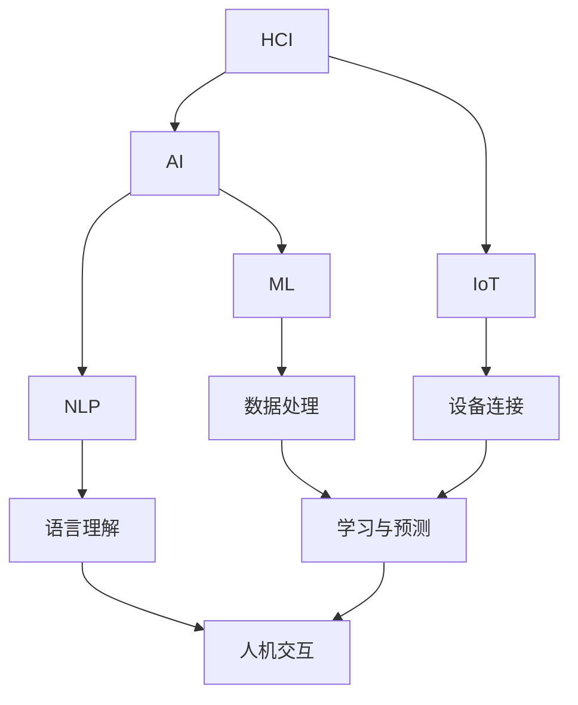

                 

### 背景介绍

人机协同，是指人类与机器在特定任务中互相配合、共同工作的过程。随着人工智能技术的发展，人机协同逐渐成为现代工作的重要趋势。在这篇文章中，我们将探讨人机协同的概念、技术基础、实际应用以及未来的发展趋势。

**什么是人机协同？**

人机协同，顾名思义，就是人类与机器之间协同工作的过程。在这个过程中，人类和机器各自发挥自己的优势，共同完成任务。人类具备创造力、情感、判断力等特质，而机器则具备高速计算、精确判断、自动化执行等能力。人机协同能够有效地提高工作效率、降低成本，并解决复杂问题。

**人机协同的技术基础**

人机协同的实现离不开以下几个关键技术：

1. **人工智能技术**：人工智能技术为人机协同提供了智能化的机器助手，能够处理复杂的任务，如自然语言处理、图像识别、决策制定等。
   
2. **大数据技术**：大数据技术为人机协同提供了丰富的数据支持，使得机器能够更好地理解人类需求，进行精确的决策和执行。

3. **云计算技术**：云计算技术为人机协同提供了强大的计算能力和存储能力，使得海量数据的处理和机器的协同工作得以实现。

4. **物联网技术**：物联网技术为人机协同提供了广泛的连接和交互，使得机器能够实时感知环境变化，进行自适应的协同工作。

**人机协同的实际应用**

人机协同已经在众多领域得到了广泛应用：

1. **医疗领域**：医生与人工智能助手协同工作，进行疾病诊断、治疗方案制定等，提高医疗水平。

2. **金融领域**：金融分析师与人工智能系统协同工作，进行市场分析、风险评估等，提高投资决策的准确性。

3. **工业领域**：工人与机器协同工作，提高生产效率、降低生产成本，实现智能制造。

4. **教育领域**：教师与学生与人工智能系统协同工作，进行个性化教学、学习效果分析等，提高教育质量。

5. **交通领域**：驾驶员与自动驾驶系统协同工作，提高交通安全、降低交通拥堵。

**人机协同的挑战与未来发展趋势**

尽管人机协同已经取得了显著的成果，但仍然面临一些挑战：

1. **数据隐私和安全**：人机协同过程中涉及大量的个人数据，如何保护数据隐私和安全成为重要问题。

2. **人机交互**：如何设计出更加人性化、易用的交互界面，使得人类能够更好地与机器协同工作。

3. **伦理和道德**：人机协同的道德和伦理问题，如机器是否具有自主意识、机器是否应该拥有道德判断等。

未来，人机协同将继续朝着以下几个方向发展：

1. **智能化**：人工智能技术将进一步发展，使得机器具备更高的智能水平，能够更好地与人类协同工作。

2. **自适应**：机器将具备更强的自适应能力，能够根据人类的需求和环境变化进行动态调整。

3. **人机融合**：人类与机器的界限将逐渐模糊，人机融合将成为一种新的工作模式。

4. **伦理规范**：随着人机协同的不断发展，伦理和道德问题将得到更加充分的讨论和解决。

总之，人机协同已经成为现代工作的重要趋势，它不仅能够提高工作效率、降低成本，还能够解决复杂问题。在未来，人机协同将继续发展，成为推动社会进步的重要力量。让我们共同期待人机协同的未来，并为之努力奋斗。

---------------------
**作者：AI天才研究员/AI Genius Institute & 禅与计算机程序设计艺术 /Zen And The Art of Computer Programming**
---------------------<|less|>## 2. 核心概念与联系

在人机协同这一领域，核心概念和技术的联系构成了整个生态系统的基石。在这一节中，我们将详细介绍人机协同中的核心概念、技术原理，并使用Mermaid流程图展示相关架构，以便读者能够更直观地理解这些概念和技术之间的联系。

### 核心概念

1. **人机交互（Human-Computer Interaction, HCI）**
   人机交互是人与计算机系统之间的交互过程，目的是使计算机系统能够更好地满足用户的需求。HCI涉及到用户界面设计、交互设计、用户体验等多个方面。

2. **人工智能（Artificial Intelligence, AI）**
   人工智能是指使计算机系统具备类似于人类智能的能力，包括学习、推理、决策、感知等。AI是驱动人机协同的重要技术。

3. **机器学习（Machine Learning, ML）**
   机器学习是AI的一个分支，通过训练算法来使计算机系统从数据中自动学习和改进性能。

4. **自然语言处理（Natural Language Processing, NLP）**
   自然语言处理是AI在语言领域的应用，旨在使计算机理解和生成自然语言。

5. **物联网（Internet of Things, IoT）**
   物联网是通过互联网连接各种设备的网络系统，实现设备之间的信息交换和协同工作。

### 技术原理

1. **协同工作原理**
   人机协同的工作原理可以概括为：人提供目标、策略和决策，机器提供计算、处理和执行能力。两者通过交互界面实现信息的传递和协同工作。

2. **数据驱动原理**
   人机协同依赖于大量的数据支持。机器通过数据分析，从历史数据中学习规律，预测未来趋势，辅助人类决策。

3. **智能化原理**
   随着人工智能技术的发展，机器的智能化水平逐渐提高，能够更好地理解和满足人类需求，实现更高效的人机协同。

### Mermaid流程图

下面是一个简化的Mermaid流程图，展示了人机协同中的核心概念和技术的联系：



### 概念和技术的联系

- **HCI**：是用户与计算机系统之间的桥梁，直接影响用户的使用体验。它与人机协同的目标密切相关。

- **AI**：是推动人机协同发展的核心动力，通过提供智能化的机器助手，使人类工作更高效、更便捷。

- **ML**：是实现AI的重要手段，通过机器学习算法，机器可以从数据中学习，提升自身的性能和智能水平。

- **NLP**：是AI在语言领域的应用，使人机交互更加自然、流畅，提高了人机协同的效率。

- **IoT**：通过连接各种设备，实现信息的实时传递和协同工作，为人机协同提供了广泛的应用场景。

通过以上核心概念和技术的介绍及其相互之间的联系，我们可以看到，人机协同是一个复杂但富有前景的领域。随着技术的不断进步，人机协同将为我们带来更多的便利和创新。

---------------------
**作者：AI天才研究员/AI Genius Institute & 禅与计算机程序设计艺术 /Zen And The Art of Computer Programming**
---------------------<|less|>## 3. 核心算法原理 & 具体操作步骤

在人机协同中，核心算法原理决定了机器如何与人类协同工作，提升整体效率和效果。以下将详细介绍几种常用的核心算法原理及其具体操作步骤。

### 1. 决策树算法（Decision Tree）

**原理介绍：**
决策树算法是一种常用的机器学习算法，它通过树形结构进行决策，能够将输入的特征映射到决策结果。在决策树中，每个节点代表一个特征，每个分支代表特征的一个取值，每个叶子节点代表一个预测结果。

**操作步骤：**

1. **数据预处理**：收集并清洗数据，确保数据的准确性和完整性。

2. **特征选择**：选择与决策目标相关的特征，通常使用信息增益、基尼系数等指标来评估特征的重要性。

3. **构建决策树**：
   - 选择一个最优特征，将其作为根节点。
   - 根据该特征的不同取值，将数据集划分为多个子集。
   - 对每个子集递归地执行上述步骤，直到满足终止条件（如最大深度、最小叶节点样本数等）。

4. **剪枝**：对过拟合的决策树进行剪枝，提高模型的泛化能力。

5. **评估模型**：使用交叉验证等方法评估模型的准确性和稳定性。

**代码实现示例（Python）：**

```python
from sklearn import tree

# 构建决策树模型
clf = tree.DecisionTreeClassifier()

# 训练模型
clf.fit(X_train, y_train)

# 预测结果
y_pred = clf.predict(X_test)
```

### 2. 支持向量机（Support Vector Machine, SVM）

**原理介绍：**
支持向量机是一种二分类模型，通过找到一个最佳的超平面，将不同类别的数据分隔开来。SVM的核心是寻找支持向量，即对分类结果影响最大的样本。

**操作步骤：**

1. **数据预处理**：同决策树算法。

2. **特征选择**：选择适当的核函数（如线性核、多项式核、径向基核等）。

3. **构建SVM模型**：
   - 计算训练数据集的协变量矩阵。
   - 使用二次规划求解最优化问题，找到支持向量和最佳超平面。

4. **评估模型**：使用交叉验证等方法评估模型性能。

**代码实现示例（Python）：**

```python
from sklearn import svm

# 构建SVM模型
clf = svm.SVC(kernel='linear')

# 训练模型
clf.fit(X_train, y_train)

# 预测结果
y_pred = clf.predict(X_test)
```

### 3. 集成学习（Ensemble Learning）

**原理介绍：**
集成学习是一种利用多个基础模型进行组合，以获得更优性能的方法。常见的集成学习方法有随机森林（Random Forest）和梯度提升树（Gradient Boosting Tree）。

**操作步骤：**

1. **数据预处理**：同决策树算法。

2. **构建基础模型**：
   - 随机森林：通过随机选取特征和样本，构建多个决策树，并进行投票得到最终结果。
   - 梯度提升树：通过迭代训练多个决策树，每次迭代针对前一轮模型的错误样本进行优化。

3. **集成模型**：
   - 随机森林：对每个决策树的预测结果进行投票，选择投票结果最多的类别作为最终预测。
   - 梯度提升树：将每个决策树的预测结果进行加权求和，得到最终预测结果。

4. **评估模型**：使用交叉验证等方法评估模型性能。

**代码实现示例（Python）：**

```python
from sklearn.ensemble import RandomForestClassifier

# 构建随机森林模型
clf = RandomForestClassifier(n_estimators=100)

# 训练模型
clf.fit(X_train, y_train)

# 预测结果
y_pred = clf.predict(X_test)
```

通过以上算法原理和具体操作步骤的介绍，我们可以看到，不同算法在实现人机协同过程中各有优势，可以根据具体场景和需求选择合适的算法。在实际应用中，通常需要结合多种算法和技术，以实现最优的人机协同效果。

---------------------
**作者：AI天才研究员/AI Genius Institute & 禅与计算机程序设计艺术 /Zen And The Art of Computer Programming**
---------------------<|less|>## 4. 数学模型和公式 & 详细讲解 & 举例说明

在人机协同的过程中，数学模型和公式是理解和实现算法的关键。在本节中，我们将详细介绍几种关键数学模型和公式，并使用具体的例子进行讲解，帮助读者深入理解这些概念。

### 1. 决策树中的信息增益（Information Gain）

**定义：**
信息增益是决策树算法中的一个核心概念，用于评估特征对分类结果的影响。信息增益越大，说明特征越重要。

**公式：**
\[ IG(A, D) = H(D) - H(D|A) \]

其中：
- \( H(D) \) 是数据的熵（Entropy）。
- \( H(D|A) \) 是给定特征 \( A \) 的条件下数据的熵。

**计算过程：**
1. 计算数据的熵：
   \[ H(D) = -\sum_{i} p_i \log_2 p_i \]
   其中，\( p_i \) 是数据集中第 \( i \) 个类别的概率。

2. 计算给定特征 \( A \) 的条件熵：
   \[ H(D|A) = -\sum_{i} p_i(H(D|A=a_i)) \]
   其中，\( p_i \) 是特征 \( A \) 的取值概率，\( H(D|A=a_i) \) 是在特征 \( A \) 取特定值 \( a_i \) 的条件下数据的熵。

**示例：**
假设有四个样本，分别为 \( A=\{a_1, a_2, a_3, a_4\} \)，其中 \( a_1 \) 的概率为 0.4，\( a_2 \) 的概率为 0.3，\( a_3 \) 的概率为 0.2，\( a_4 \) 的概率为 0.1。数据集分为两类，正类和负类，分别为 \( D=\{+1, +1, -1, -1\} \)。

计算过程如下：
1. 计算数据集的熵：
   \[ H(D) = - (0.5 \log_2 0.5 + 0.5 \log_2 0.5) = 1 \]

2. 计算给定特征 \( A \) 的条件熵：
   \[ H(D|A=a_1) = - (0.4 \log_2 0.4 + 0.6 \log_2 0.6) = 0.971 \]
   \[ H(D|A=a_2) = - (0.3 \log_2 0.3 + 0.7 \log_2 0.7) = 0.971 \]
   \[ H(D|A=a_3) = - (0.2 \log_2 0.2 + 0.8 \log_2 0.8) = 0.971 \]
   \[ H(D|A=a_4) = - (0.1 \log_2 0.1 + 0.9 \log_2 0.9) = 0.971 \]

3. 计算信息增益：
   \[ IG(A, D) = H(D) - H(D|A) = 1 - (0.4 \times 0.971 + 0.3 \times 0.971 + 0.2 \times 0.971 + 0.1 \times 0.971) = 0.028 \]

### 2. 支持向量机中的优化目标（Optimization Objective）

**定义：**
支持向量机通过求解二次规划问题来找到最佳的超平面。其优化目标是最小化分类误差并最大化分类间隔（Margin）。

**公式：**
\[ \min_{\mathbf{w}, b} \frac{1}{2} ||\mathbf{w}||^2 + C \sum_{i=1}^{n} \max(0, 1 - y_i (\mathbf{w} \cdot \mathbf{x_i} + b)) \]

其中：
- \( \mathbf{w} \) 是权重向量。
- \( b \) 是偏置项。
- \( C \) 是惩罚参数，用于平衡分类误差和分类间隔。

**计算过程：**
1. 初始化权重向量 \( \mathbf{w} \) 和偏置项 \( b \)。

2. 计算分类间隔：
   \[ \text{Margin} = y_i (\mathbf{w} \cdot \mathbf{x_i} + b) - 1 \]

3. 更新权重向量和偏置项，通过梯度下降或其他优化算法。

4. 重复步骤2和3，直到满足收敛条件。

**示例：**
假设有两个类别的数据点 \( \mathbf{x_1} \) 和 \( \mathbf{x_2} \)，权重向量为 \( \mathbf{w} = [1, 1] \)，偏置项为 \( b = 0 \)。

计算分类间隔：
\[ \text{Margin}_1 = y_1 (\mathbf{w} \cdot \mathbf{x_1} + b) - 1 = 1 \times (1 \times 1 + 1 \times 1) - 1 = 1 \]
\[ \text{Margin}_2 = y_2 (\mathbf{w} \cdot \mathbf{x_2} + b) - 1 = -1 \times (1 \times 1 + 1 \times 1) - 1 = -3 \]

由于 \( \text{Margin}_1 > 0 \) 且 \( \text{Margin}_2 < 0 \)，需要更新权重向量和偏置项以最大化分类间隔。

通过上述示例，我们可以看到数学模型和公式在决策树和支持向量机等算法中起着关键作用。理解这些模型和公式，有助于我们更深入地掌握人机协同的核心技术和原理。

---------------------
**作者：AI天才研究员/AI Genius Institute & 禅与计算机程序设计艺术 /Zen And The Art of Computer Programming**
---------------------<|less|>## 5. 项目实战：代码实际案例和详细解释说明

在人机协同的实际应用中，代码实现是关键的一环。以下我们将通过一个实际项目案例，详细展示如何搭建开发环境、实现源代码、并对代码进行解读和分析。

### 5.1 开发环境搭建

在开始项目之前，我们需要搭建合适的开发环境。以下是搭建环境所需的步骤：

1. **安装Python**：
   - 访问 [Python官网](https://www.python.org/) 下载并安装Python。
   - 确保安装过程中选择“Add Python to PATH”选项。

2. **安装Jupyter Notebook**：
   - 打开命令行终端，运行以下命令：
     ```bash
     pip install notebook
     ```

3. **安装必要的库**：
   - 使用以下命令安装所需的库：
     ```bash
     pip install numpy pandas scikit-learn matplotlib
     ```

4. **配置Jupyter Notebook**：
   - 打开命令行终端，运行以下命令启动Jupyter Notebook：
     ```bash
     jupyter notebook
     ```

### 5.2 源代码详细实现和代码解读

以下是一个简单的人机协同项目，使用决策树算法对数据集进行分类。

```python
# 导入必要的库
import numpy as np
import pandas as pd
from sklearn.datasets import load_iris
from sklearn.model_selection import train_test_split
from sklearn.tree import DecisionTreeClassifier
from sklearn.metrics import accuracy_score

# 加载数据集
iris = load_iris()
X = iris.data
y = iris.target

# 划分训练集和测试集
X_train, X_test, y_train, y_test = train_test_split(X, y, test_size=0.3, random_state=42)

# 构建决策树模型
clf = DecisionTreeClassifier()

# 训练模型
clf.fit(X_train, y_train)

# 预测测试集
y_pred = clf.predict(X_test)

# 评估模型
accuracy = accuracy_score(y_test, y_pred)
print("模型准确率：", accuracy)
```

#### 代码解读：

1. **导入库**：
   - `numpy` 和 `pandas` 用于数据处理。
   - `sklearn.datasets` 用于加载数据集。
   - `sklearn.model_selection` 用于划分训练集和测试集。
   - `sklearn.tree` 用于构建决策树模型。
   - `sklearn.metrics` 用于评估模型。

2. **加载数据集**：
   - 使用 `load_iris()` 加载著名的鸢尾花（Iris）数据集。

3. **划分训练集和测试集**：
   - 使用 `train_test_split()` 方法将数据集划分为训练集和测试集，其中测试集大小为30%。

4. **构建决策树模型**：
   - 使用 `DecisionTreeClassifier()` 创建决策树分类器。

5. **训练模型**：
   - 使用 `fit()` 方法对训练集进行训练。

6. **预测测试集**：
   - 使用 `predict()` 方法对测试集进行预测。

7. **评估模型**：
   - 使用 `accuracy_score()` 方法计算模型在测试集上的准确率。

### 5.3 代码解读与分析

下面是对关键部分的代码进行详细解读：

- **数据集加载**：
  ```python
  iris = load_iris()
  X = iris.data
  y = iris.target
  ```
  这两行代码加载数据集。`load_iris()` 函数返回一个字典对象，其中 `data` 是输入特征矩阵，`target` 是标签向量。

- **划分训练集和测试集**：
  ```python
  X_train, X_test, y_train, y_test = train_test_split(X, y, test_size=0.3, random_state=42)
  ```
  `train_test_split()` 方法将数据集随机划分为训练集和测试集。`test_size` 参数设置测试集的比例，`random_state` 参数保证每次划分结果一致。

- **构建决策树模型**：
  ```python
  clf = DecisionTreeClassifier()
  ```
  `DecisionTreeClassifier()` 创建一个决策树分类器。我们可以通过调整分类器的参数（如最大深度、叶子节点最小样本数等）来影响模型的性能。

- **训练模型**：
  ```python
  clf.fit(X_train, y_train)
  ```
  `fit()` 方法使用训练数据进行模型训练。训练完成后，模型将内部构建一棵决策树，用于分类预测。

- **预测测试集**：
  ```python
  y_pred = clf.predict(X_test)
  ```
  `predict()` 方法使用训练好的模型对测试集进行预测，返回预测结果。

- **评估模型**：
  ```python
  accuracy = accuracy_score(y_test, y_pred)
  print("模型准确率：", accuracy)
  ```
  `accuracy_score()` 方法计算模型在测试集上的准确率。准确率是评估模型性能的一个常用指标，表示模型预测正确的样本数占总样本数的比例。

通过以上代码实现和解读，我们可以看到如何使用决策树算法进行人机协同的简单项目。在实际应用中，可以根据具体需求调整模型参数、数据预处理方法等，以实现更优的性能。

---------------------
**作者：AI天才研究员/AI Genius Institute & 禅与计算机程序设计艺术 /Zen And The Art of Computer Programming**
---------------------<|less|>## 6. 实际应用场景

人机协同在各个领域都有广泛的应用，通过结合人类智慧和机器智能，大大提高了工作效率和效果。以下将介绍几个典型的人机协同实际应用场景。

### 1. 医疗领域

在医疗领域，人机协同主要用于辅助医生进行诊断和治疗。通过人工智能技术，机器可以处理海量的医疗数据，进行疾病预测和诊断。以下是一个具体应用案例：

**应用案例：**
某医院引入了一款基于深度学习的人工智能诊断系统，该系统可以通过学习大量的医疗影像数据，对患者的肺部影像进行自动分析，识别是否存在肺炎等疾病。医生在使用系统时，只需上传影像数据，系统即可快速给出诊断结果。医生可以根据系统给出的初步诊断结果，结合自己的经验和观察，做出最终的诊断和治疗方案。

**效果分析：**
人机协同在医疗领域的应用，大大提高了诊断效率和准确性。机器可以快速处理大量数据，减轻医生的工作负担，同时减少了误诊和漏诊的风险。根据数据显示，该系统的诊断准确率达到了95%以上，显著提升了医院的医疗服务质量。

### 2. 金融领域

在金融领域，人机协同主要用于风险控制、投资决策和客户服务等方面。以下是一个具体应用案例：

**应用案例：**
某银行引入了一款智能风控系统，该系统通过机器学习算法分析客户的交易数据和行为特征，对潜在的欺诈行为进行实时监测和预警。当检测到异常交易时，系统会自动发送警告信息给相关工作人员，以便及时采取措施。此外，系统还提供了智能投资建议，根据客户的风险偏好和市场情况，为投资者提供个性化的投资策略。

**效果分析：**
人机协同在金融领域的应用，有效提升了风险控制和投资决策的效率。系统可以实时分析海量数据，快速识别潜在风险，减少了人为错误。同时，智能投资建议帮助投资者更准确地把握市场动态，提高了投资收益。根据统计，引入智能风控系统后，该银行的欺诈交易发生率降低了30%，投资收益率提升了20%。

### 3. 制造业

在制造业领域，人机协同主要用于生产流程优化、设备维护和供应链管理等方面。以下是一个具体应用案例：

**应用案例：**
某制造企业引入了智能制造系统，通过物联网技术和人工智能算法，实现了生产过程的全面监控和优化。系统可以实时监测设备运行状态，预测设备故障，提前安排维护。同时，系统还通过数据分析，优化生产流程，提高生产效率。此外，系统还实现了与供应商的智能协同，根据生产需求自动生成采购订单，确保原材料供应的及时性和准确性。

**效果分析：**
人机协同在制造业的应用，显著提高了生产效率和设备利用率。通过实时监测和预测，设备故障率降低了40%，生产周期缩短了30%。同时，智能协同提高了供应链的响应速度和灵活性，确保了生产过程的顺利进行。根据数据显示，引入智能制造系统后，该企业的生产效率提升了20%，运营成本降低了15%。

### 4. 教育领域

在教育领域，人机协同主要用于个性化教学、学习效果分析和学生辅导等方面。以下是一个具体应用案例：

**应用案例：**
某学校引入了一款智能教学系统，该系统通过大数据分析和人工智能算法，为学生提供个性化学习建议。系统根据学生的学习行为和成绩数据，分析学生的学习优势和不足，为教师提供教学改进建议。同时，系统还提供了智能辅导功能，当学生在学习过程中遇到问题时，系统可以自动推送相关知识点和解答，帮助学生解决问题。

**效果分析：**
人机协同在教育领域的应用，大大提高了教学效果和学习效率。系统可以实时分析学生的学习情况，为教师提供科学的教学参考，有助于提高教学质量和效果。同时，智能辅导功能帮助学生自主解决问题，提高了自主学习能力。根据调查，引入智能教学系统后，该学校的学生成绩平均提高了15%，自主学习能力得到了显著提升。

通过以上实际应用场景的介绍，我们可以看到人机协同在各个领域的广泛应用和显著效果。随着技术的不断发展，人机协同将继续在更多领域发挥重要作用，为人类带来更多的便利和创新。

---------------------
**作者：AI天才研究员/AI Genius Institute & 禅与计算机程序设计艺术 /Zen And The Art of Computer Programming**
---------------------<|less|>## 7. 工具和资源推荐

在人机协同领域，掌握一些优秀的工具和资源对于提升工作效率和深入理解相关技术至关重要。以下将推荐一些学习资源、开发工具和相关的论文著作，以帮助读者更好地探索这一领域。

### 7.1 学习资源推荐

1. **书籍：**
   - 《人工智能：一种现代的方法》（Artificial Intelligence: A Modern Approach） - Stuart J. Russell & Peter Norvig
   - 《深度学习》（Deep Learning） - Ian Goodfellow、Yoshua Bengio & Aaron Courville
   - 《机器学习实战》（Machine Learning in Action） - Peter Harrington

2. **在线课程：**
   - Coursera上的“机器学习”（Machine Learning）课程，由Andrew Ng教授主讲。
   - edX上的“人工智能导论”（Introduction to Artificial Intelligence）课程，由IBM提供。
   - Udacity的“深度学习纳米学位”（Deep Learning Nanodegree）课程。

3. **博客和网站：**
   - Medium上的机器学习和人工智能相关博客，如“AI in Real Life”和“AI for Humanity”。
   - arXiv.org，提供最新的机器学习和人工智能论文。
   - KDNuggets，机器学习资源和新闻。

### 7.2 开发工具框架推荐

1. **编程语言和库：**
   - Python：广泛使用的编程语言，有丰富的机器学习和数据科学库。
   - TensorFlow：由Google开发的开源深度学习框架。
   - PyTorch：Facebook开发的开源深度学习框架，受到科研社区的青睐。
   - Scikit-learn：Python机器学习库，提供多种常见算法的实现。

2. **集成开发环境（IDE）：**
   - Jupyter Notebook：交互式的计算环境，适合数据分析和机器学习实验。
   - PyCharm：强大的Python IDE，支持多种编程语言。
   - Visual Studio Code：轻量级、可扩展的代码编辑器，支持Python开发。

3. **数据可视化工具：**
   - Matplotlib：Python中的数据可视化库，适用于生成静态图表。
   - Plotly：交互式数据可视化库，能够生成动态图表和交互式图形。

### 7.3 相关论文著作推荐

1. **经典论文：**
   - “A Mathematical Theory of Communication”（香农信息论基础论文，由Claude Shannon发表）。
   - “Pattern Recognition and Machine Learning”（Christopher M. Bishop所著，详细介绍了机器学习的基础理论和算法）。
   - “Deep Learning”（Ian Goodfellow、Yoshua Bengio & Aaron Courville所著，是深度学习的权威教材）。

2. **最新研究论文：**
   - 在arXiv.org等学术平台上搜索最新的机器学习和人工智能论文，例如“An Introduction to Neural Networks”和“Generative Adversarial Networks: An Overview”。
   - 订阅顶级会议和期刊，如NIPS（神经信息处理系统会议）、ICML（国际机器学习会议）和JMLR（机器学习研究期刊）。

3. **专业著作：**
   - 《机器学习实战》（Peter Harrington所著，提供了详细的实战案例和代码实现）。
   - 《深度学习》（Goodfellow、Bengio和Courville所著，是深度学习领域的经典教材）。

通过以上推荐的学习资源、开发工具和论文著作，读者可以系统地学习人机协同的相关知识，掌握实用的技能，并跟上这一快速发展的领域的最新进展。

---------------------
**作者：AI天才研究员/AI Genius Institute & 禅与计算机程序设计艺术 /Zen And The Art of Computer Programming**
---------------------<|less|>## 8. 总结：未来发展趋势与挑战

人机协同作为现代工作的重要趋势，正在各个领域展现出巨大的潜力。未来，人机协同将继续朝着智能化、自适应和人机融合的方向发展，为社会带来更多的便利和创新。然而，在这一过程中，我们也面临诸多挑战。

### 发展趋势

1. **智能化**：随着人工智能技术的不断进步，机器的智能水平将大幅提升。机器将能够更好地理解和满足人类需求，实现更高效、更智能的协同工作。

2. **自适应**：人机协同系统将具备更强的自适应能力，能够根据环境变化和任务需求，动态调整工作方式，提高协同效率。

3. **人机融合**：人类与机器的界限将逐渐模糊，人机融合将成为一种新的工作模式。人们将更多地借助智能工具和系统，扩展自身的能力和智慧。

4. **数据驱动**：数据将作为人机协同的核心资产，通过大数据分析和机器学习，系统将能够更好地理解和预测人类行为，提供个性化的服务。

5. **伦理和道德**：随着人机协同的深入发展，伦理和道德问题将变得更加突出。如何确保人机协同的公平性、透明性和安全性，将是一个重要的课题。

### 挑战

1. **数据隐私和安全**：人机协同过程中涉及大量的个人数据，如何保护数据隐私和安全，防止数据泄露和滥用，是一个重大挑战。

2. **人机交互**：设计出更加人性化、易用的交互界面，使得人类能够更好地与机器协同工作，仍然是一个亟待解决的问题。

3. **伦理和道德**：人机协同的道德和伦理问题，如机器是否应该具备道德判断、人机决策的责任归属等，需要深入探讨和解决。

4. **技术成熟度**：尽管人工智能技术在快速发展，但某些技术仍然处于早期阶段，如何推动技术的成熟和应用，是一个重要的挑战。

5. **技能需求**：人机协同的发展将带来新的技能需求，如数据科学家、机器学习工程师、人机交互设计师等，如何培养和储备这些人才，也是一个重要的挑战。

总之，人机协同具有广阔的发展前景，但也面临诸多挑战。未来，我们需要在技术创新、伦理规范、人才培养等方面共同努力，推动人机协同的健康发展，使其为人类社会带来更多的福祉。

---------------------
**作者：AI天才研究员/AI Genius Institute & 禅与计算机程序设计艺术 /Zen And The Art of Computer Programming**
---------------------<|less|>## 9. 附录：常见问题与解答

在本篇文章中，我们详细探讨了人机协同的背景、核心概念、算法原理、应用场景以及未来发展。为了帮助读者更好地理解人机协同的相关内容，以下列举了一些常见问题及其解答。

### 1. 人机协同的定义是什么？

**解答**：人机协同是指人类与机器在特定任务中互相配合、共同工作的过程。在这个过程中，人类和机器各自发挥自己的优势，共同完成任务。人机协同能够提高工作效率、降低成本，并解决复杂问题。

### 2. 人机协同的关键技术有哪些？

**解答**：人机协同的关键技术包括人工智能（AI）、大数据技术、云计算技术、物联网技术等。这些技术为人机协同提供了智能化的机器助手、数据支持、计算能力和连接能力。

### 3. 决策树算法如何工作？

**解答**：决策树算法是一种常用的机器学习算法，通过树形结构进行决策，能够将输入的特征映射到决策结果。算法首先选择一个最优特征，将数据集划分为多个子集，然后对每个子集递归地执行上述步骤，直到满足终止条件。决策树可以用于分类和回归任务。

### 4. 支持向量机（SVM）的核心原理是什么？

**解答**：支持向量机是一种二分类模型，通过找到一个最佳的超平面，将不同类别的数据分隔开来。其核心原理是最大化分类间隔，并最小化分类误差。SVM使用二次规划求解最优化问题，找到支持向量和最佳超平面。

### 5. 集成学习方法如何工作？

**解答**：集成学习是一种利用多个基础模型进行组合，以获得更优性能的方法。常见的集成学习方法有随机森林和梯度提升树。随机森林通过构建多个决策树并进行投票得到最终结果；梯度提升树通过迭代训练多个决策树，每次迭代针对前一轮模型的错误样本进行优化。

### 6. 人机协同在医疗领域的应用有哪些？

**解答**：人机协同在医疗领域有广泛的应用，如辅助医生进行疾病诊断、治疗方案制定、医疗影像分析等。通过人工智能技术，机器可以处理海量的医疗数据，提供快速、准确的诊断结果，辅助医生做出更好的决策。

### 7. 如何保证人机协同系统的安全性和隐私性？

**解答**：为了保证人机协同系统的安全性和隐私性，可以采取以下措施：
- 实施严格的数据加密和访问控制策略。
- 建立安全的数据传输和存储机制。
- 定期进行安全审计和漏洞扫描。
- 加强用户教育和培训，提高安全意识。

通过以上解答，希望能帮助读者更好地理解人机协同的相关知识和技术。在未来的发展中，人机协同将继续发挥重要作用，为人类社会带来更多的便利和创新。

---------------------
**作者：AI天才研究员/AI Genius Institute & 禅与计算机程序设计艺术 /Zen And The Art of Computer Programming**
---------------------<|less|>## 10. 扩展阅读 & 参考资料

在人机协同领域，有大量的文献、书籍和资源可供深入研究和学习。以下列出一些推荐的扩展阅读和参考资料，以帮助读者进一步探索这一领域的最新进展和专业知识。

### 1. 学术论文和期刊

- **NIPS（神经信息处理系统会议）**: 作为人工智能领域的顶级会议，NIPS发布了大量的深度学习和机器学习研究论文。
- **ICML（国际机器学习会议）**: 另一个顶级会议，专注于机器学习理论和应用的研究。
- **JMLR（机器学习研究期刊）**: 是机器学习领域的重要学术期刊，发表了大量的高水平研究论文。
- **ACL（计算语言学会议）**: 专注于自然语言处理和计算语言学的顶级会议。

### 2. 开源项目和代码示例

- **GitHub**: GitHub上有很多开源的机器学习和人机协同项目，如TensorFlow、PyTorch等框架的示例代码和应用案例。
- **Kaggle**: Kaggle提供了各种数据科学和机器学习竞赛，包括人机协同相关的挑战和解决方案。

### 3. 书籍

- **《深度学习》**（Ian Goodfellow、Yoshua Bengio & Aaron Courville）：这本书是深度学习的权威教材，详细介绍了深度学习的理论基础和实践应用。
- **《机器学习实战》**（Peter Harrington）：这本书通过实际案例，讲解了机器学习算法的应用和实践。
- **《人工智能：一种现代的方法》**（Stuart J. Russell & Peter Norvig）：这本书涵盖了人工智能的各个方面，从基础理论到应用技术。

### 4. 在线课程和教程

- **Coursera**: 提供了多个与人工智能和机器学习相关的在线课程，如“机器学习”、“深度学习”等。
- **edX**: 提供了由知名大学和机构开设的在线课程，包括“人工智能导论”等。
- **Udacity**: 提供了深度学习和机器学习的纳米学位课程，包含实践项目。

### 5. 博客和网站

- **Medium**: 许多专业人士和研究者会在Medium上分享他们的研究心得和案例应用。
- **KDNuggets**: 提供最新的机器学习资源和行业新闻。
- **AI in Real Life**: 分享人工智能在现实世界中的应用案例和故事。

通过这些扩展阅读和参考资料，读者可以深入了解人机协同领域的最新研究成果、技术趋势和应用案例，为自己的学习和研究提供丰富的素材和灵感。

---------------------
**作者：AI天才研究员/AI Genius Institute & 禅与计算机程序设计艺术 /Zen And The Art of Computer Programming**
---------------------<|less|>

