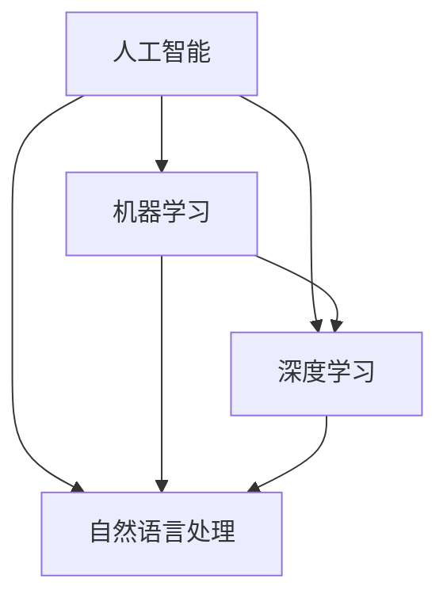
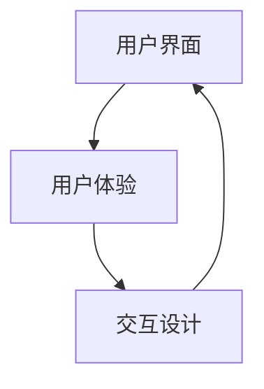
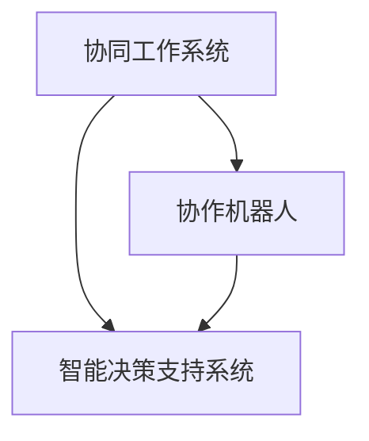
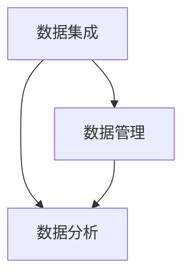

                 

### 背景介绍 Background

在当今科技飞速发展的时代，人工智能（AI）和机器学习（ML）正在逐步改变着各行各业的面貌。从自动驾驶汽车到智能语音助手，从精准医疗诊断到金融风险评估，AI技术已经渗透到了我们生活的方方面面。然而，随着AI技术的不断成熟和应用范围的扩大，一个不可避免的问题也逐渐浮现出来：如何更好地实现人机协同，最大化地发挥人类与机器的各自优势？

人机协同（Human-Machine Collaboration）是指在人工智能的帮助下，人类和机器共同完成任务，以实现更高的效率、更好的效果和更广泛的应用。这种协同不仅仅是简单的机器执行人类指令，而是在更深层次的互动中，机器能够理解人类的意图、感受和需求，并主动提供支持和优化方案。这种协同将极大地改变未来工作的模式，成为推动社会进步的重要驱动力。

首先，人机协同可以提高工作效率。通过人工智能技术，机器能够自动处理大量重复性、繁琐的任务，让人类从这些低效的工作中解脱出来，专注于更具创造性和战略性的任务。例如，在软件开发领域，AI可以帮助进行代码自动生成、漏洞检测和性能优化，从而提高开发效率和代码质量。

其次，人机协同可以提升工作质量。机器能够处理数据更准确、更快速，并且不会受到情绪波动和疲劳的影响。在医疗诊断中，AI可以通过分析大量的医疗数据和文献，提供更加精确的诊断建议，从而提高医疗服务的质量。

此外，人机协同还可以拓展人类的能力。通过智能设备的辅助，人类能够在更复杂、更危险的环境中工作，如深海勘探、太空探索、灾害救援等。这些工作单靠人类自身很难完成，但是通过机器的协助，可以大大提升工作的可行性和成功率。

总之，人机协同是未来工作发展的重要方向，它不仅能够提升个人和组织的效率和质量，还能推动社会经济的整体进步。接下来，我们将深入探讨人机协同的核心概念、原理和具体应用，以期为这一领域的未来发展提供一些有价值的思考和见解。 <markdown>### 核心概念与联系 Core Concepts and Relationships

在人机协同的体系中，核心概念和它们之间的联系是理解这一领域的关键。以下是几个核心概念及其相互关系，我们将使用Mermaid流程图来直观地展示它们之间的关系。

首先，我们需要明确几个基本概念：

1. **人工智能（AI）**：AI是一种模拟人类智能的技术，包括机器学习、深度学习、自然语言处理等子领域。
2. **机器学习（ML）**：ML是AI的一个子领域，侧重于让机器通过数据学习并做出决策。
3. **深度学习（DL）**：DL是ML的一个分支，利用神经网络模型从大量数据中自动学习特征。
4. **自然语言处理（NLP）**：NLP是AI的一个子领域，旨在使计算机能够理解和生成人类语言。

以下是核心概念及其相互关系的Mermaid流程图：



1. **用户界面（UI）**：用户界面是人与机器交互的桥梁，包括图形用户界面（GUI）、命令行界面（CLI）等。
2. **用户体验（UX）**：用户体验关注用户在使用产品过程中的感受和体验。
3. **交互设计（ID）**：交互设计是设计用户界面的过程，旨在提供直观、易用的交互方式。

以下是用户界面、用户体验和交互设计的Mermaid流程图：



1. **协同工作系统（CWS）**：协同工作系统是一种软件平台，用于支持人机协同工作。
2. **协作机器人（Cobot）**：协作机器人是一种与人共存的机器人，能够协助人类完成各种任务。
3. **智能决策支持系统（IDSS）**：智能决策支持系统是一种利用AI技术提供决策建议的系统。

以下是协同工作系统、协作机器人和智能决策支持系统的Mermaid流程图：



1. **数据集成（DI）**：数据集成是将来自不同数据源的数据整合在一起的过程。
2. **数据管理（DM）**：数据管理涉及数据的存储、检索、维护和保护。
3. **数据分析（DA）**：数据分析是使用统计和数学方法从数据中提取有价值的信息。

以下是数据集成、数据管理和数据分析的Mermaid流程图：



通过上述Mermaid流程图，我们可以清晰地看到各个核心概念之间的相互联系。这些概念共同构建了人机协同的理论基础，为实际应用提供了支持。在接下来的章节中，我们将进一步探讨人机协同的算法原理、数学模型和实际应用案例，以深入理解这一领域的技术细节和实现方法。 <markdown>### 核心算法原理 & 具体操作步骤 Core Algorithm Principles and Operation Steps

人机协同的算法原理主要基于机器学习和深度学习技术，这些算法能够使机器理解和模拟人类行为，从而实现人机互动和协同工作。下面，我们将详细探讨几个关键算法的原理和具体操作步骤。

#### 1. 机器学习基础算法

机器学习是人工智能的核心组成部分，其基础算法包括监督学习、无监督学习和强化学习。以下是这些算法的简要概述和操作步骤：

**监督学习（Supervised Learning）：**
监督学习是一种通过标记数据来训练模型的方法，目标是让模型能够预测新的未知数据。

**操作步骤：**
1. **数据收集与预处理**：收集大量标记数据，并进行数据清洗、归一化和特征提取。
2. **模型选择**：选择适合问题的机器学习模型，如线性回归、决策树、支持向量机（SVM）等。
3. **模型训练**：使用标记数据对模型进行训练，通过最小化损失函数来调整模型参数。
4. **模型评估**：使用验证集或测试集评估模型性能，如准确率、召回率、F1值等。

**无监督学习（Unsupervised Learning）：**
无监督学习不依赖标记数据，旨在发现数据中的隐含结构和模式。

**操作步骤：**
1. **数据收集与预处理**：收集未标记的数据，并进行数据清洗、归一化。
2. **模型选择**：选择适合问题的无监督学习模型，如聚类、降维、关联规则等。
3. **模型训练**：使用无监督学习算法对数据进行分析，找出数据中的模式或结构。
4. **模型评估**：通过可视化或统计方法评估模型的效果，如聚类簇的内部距离、降维的恢复误差等。

**强化学习（Reinforcement Learning）：**
强化学习是一种通过与环境的交互来学习策略的算法，适用于动态决策问题。

**操作步骤：**
1. **环境设置**：定义环境和状态空间，以及奖励和惩罚机制。
2. **策略选择**：选择适合问题的策略，如Q学习、深度确定性策略梯度（DDPG）等。
3. **模型训练**：通过不断与环境交互，使用反馈奖励来调整策略参数。
4. **模型评估**：在测试环境中评估策略的效果，通过累积奖励来衡量策略的优劣。

#### 2. 深度学习算法

深度学习是机器学习的一个分支，通过多层神经网络模型来模拟人类大脑的运作方式。以下是几种常见的深度学习算法和操作步骤：

**卷积神经网络（CNN）：**
CNN是一种用于处理图像数据的深度学习模型，通过卷积层、池化层和全连接层来提取图像特征。

**操作步骤：**
1. **数据收集与预处理**：收集图像数据，并进行归一化和数据增强。
2. **模型架构设计**：设计CNN的层次结构，包括卷积层、激活函数、池化层等。
3. **模型训练**：使用大量图像数据进行训练，通过反向传播算法更新模型参数。
4. **模型评估**：在测试集上评估模型性能，调整模型参数以优化性能。

**递归神经网络（RNN）：**
RNN是一种用于处理序列数据的深度学习模型，通过循环结构来捕捉序列中的长期依赖关系。

**操作步骤：**
1. **数据收集与预处理**：收集序列数据，并进行归一化和特征提取。
2. **模型架构设计**：设计RNN的层次结构，包括输入层、隐藏层、输出层等。
3. **模型训练**：使用序列数据进行训练，通过反向传播算法更新模型参数。
4. **模型评估**：在测试集上评估模型性能，调整模型参数以优化性能。

**生成对抗网络（GAN）：**
GAN是一种通过生成器和判别器相互竞争来生成逼真数据的模型。

**操作步骤：**
1. **数据收集与预处理**：收集真实数据，用于训练判别器。
2. **模型架构设计**：设计生成器和判别器的架构，确保生成器能够生成高质量的数据。
3. **模型训练**：通过交替训练生成器和判别器，使生成器生成的数据越来越逼真。
4. **模型评估**：在生成数据集上评估模型性能，调整模型参数以优化生成质量。

通过上述算法和操作步骤，我们可以构建一个强大的人机协同系统，实现高效的协同工作和智能化决策。在接下来的章节中，我们将进一步探讨人机协同的数学模型和应用场景。 <markdown>### 数学模型和公式 Mathematical Models and Formulas with Detailed Explanations and Examples

在人机协同领域，数学模型和公式扮演着至关重要的角色，它们为算法设计和性能优化提供了理论基础。以下我们将详细讲解几个关键数学模型，并通过具体的例子来说明它们的运用。

#### 1. 机器学习中的损失函数

损失函数是机器学习中最基本的数学模型，用于衡量模型预测值与真实值之间的差异。常见的损失函数包括均方误差（MSE）、交叉熵损失（Cross-Entropy Loss）等。

**均方误差（MSE）：**

$$
MSE = \frac{1}{n}\sum_{i=1}^{n}(y_i - \hat{y}_i)^2
$$

其中，$y_i$为真实值，$\hat{y}_i$为预测值，$n$为样本数量。

**示例：** 假设我们有一个二分类问题，使用线性回归模型进行预测，真实数据集如下：

| 标签（$y$） | 预测值（$\hat{y}$） |
| :------: | :--------------: |
|   0      |       0.1       |
|   1      |       0.9       |
|   0      |       0.2       |
|   1      |       0.8       |

计算MSE：

$$
MSE = \frac{1}{4}[(0-0.1)^2 + (1-0.9)^2 + (0-0.2)^2 + (1-0.8)^2] = 0.15
$$

**交叉熵损失（Cross-Entropy Loss）：**

$$
CE = -\sum_{i=1}^{n}y_i\log(\hat{y}_i)
$$

其中，$y_i$为真实标签，$\hat{y}_i$为预测概率。

**示例：** 假设我们有一个二分类问题，使用Sigmoid函数生成的预测概率如下：

| 标签（$y$） | 预测概率（$\hat{y}$） |
| :------: | :--------------: |
|   0      |       0.3       |
|   1      |       0.7       |
|   0      |       0.4       |
|   1      |       0.6       |

计算交叉熵损失：

$$
CE = -[0.3\log(0.3) + 0.7\log(0.7) + 0.4\log(0.4) + 0.6\log(0.6)] \approx 0.693
$$

#### 2. 深度学习中的反向传播算法

反向传播算法是深度学习训练的核心，用于更新模型参数以最小化损失函数。

**反向传播算法步骤：**
1. **前向传播**：计算输入层到输出层的预测值。
2. **计算损失**：使用损失函数计算预测值与真实值之间的差异。
3. **后向传播**：计算每个参数的梯度。
4. **参数更新**：使用梯度下降法或其他优化算法更新参数。

**示例：** 假设我们有一个简单的线性模型，输入层到隐藏层有一个权重$w_1$和偏置$b_1$，隐藏层到输出层有一个权重$w_2$和偏置$b_2$。

$$
\hat{y} = w_2 \cdot \sigma(w_1 \cdot x + b_1)
$$

其中，$\sigma$为Sigmoid函数。

假设输入$x$为1，真实标签$y$为0，预测值为$\hat{y} = 0.7$。使用均方误差作为损失函数，计算损失：

$$
MSE = \frac{1}{2}(0 - 0.7)^2 = 0.245
$$

然后计算梯度：

$$
\frac{\partial MSE}{\partial w_1} = 0.7 \cdot (1 - 0.7) \cdot x = 0.21
$$

$$
\frac{\partial MSE}{\partial b_1} = 0.7 \cdot (1 - 0.7) = 0.21
$$

$$
\frac{\partial MSE}{\partial w_2} = 0.7 \cdot (1 - 0.7) \cdot \sigma'(w_1 \cdot x + b_1) = 0.21 \cdot 0.3 = 0.063
$$

$$
\frac{\partial MSE}{\partial b_2} = 0.7 \cdot (1 - 0.7) = 0.21
$$

假设学习率为0.1，更新参数：

$$
w_1 = w_1 - 0.1 \cdot 0.21 = 0.79
$$

$$
b_1 = b_1 - 0.1 \cdot 0.21 = 0.79
$$

$$
w_2 = w_2 - 0.1 \cdot 0.063 = 0.937
$$

$$
b_2 = b_2 - 0.1 \cdot 0.21 = 0.79
$$

通过以上步骤，我们可以不断迭代更新模型参数，以最小化损失函数，提高模型性能。

#### 3. 神经网络中的激活函数

激活函数是神经网络中的关键组件，用于引入非线性因素，使神经网络能够处理复杂的非线性问题。

**Sigmoid函数：**

$$
\sigma(x) = \frac{1}{1 + e^{-x}}
$$

**ReLU函数：**

$$
\text{ReLU}(x) = \max(0, x)
$$

**Tanh函数：**

$$
\tanh(x) = \frac{e^x - e^{-x}}{e^x + e^{-x}}
$$

**示例：** 假设输入$x = 2$，计算Sigmoid函数的输出：

$$
\sigma(2) = \frac{1}{1 + e^{-2}} \approx 0.88
$$

计算ReLU函数的输出：

$$
\text{ReLU}(2) = \max(0, 2) = 2
$$

计算Tanh函数的输出：

$$
\tanh(2) = \frac{e^2 - e^{-2}}{e^2 + e^{-2}} \approx 0.96
$$

通过以上数学模型和公式的讲解，我们可以更好地理解人机协同算法的设计原理和实现方法。在接下来的章节中，我们将通过实际项目案例展示如何将理论应用于实践。 <markdown>### 项目实战：代码实际案例和详细解释说明 Practical Case Study: Code Implementation and Detailed Explanation

在本节中，我们将通过一个实际的项目案例来展示如何实现人机协同系统。该项目将利用深度学习技术，构建一个智能助手，帮助用户完成日常任务。我们将详细讲解项目的开发环境搭建、源代码实现以及代码解析。

#### 5.1 开发环境搭建

为了实现该项目，我们需要准备以下开发环境和工具：

- 操作系统：Linux或MacOS
- 编程语言：Python
- 深度学习框架：TensorFlow或PyTorch
- 数据预处理工具：NumPy、Pandas
- 代码编辑器：PyCharm或VSCode

首先，确保安装Python和相应的深度学习框架（例如，TensorFlow）。可以使用以下命令进行安装：

```bash
pip install tensorflow
```

或

```bash
pip install torch torchvision
```

接下来，我们需要准备一些常见的数据预处理工具，如NumPy和Pandas：

```bash
pip install numpy pandas
```

最后，配置好代码编辑器，并确保其能够正常运行Python代码。

#### 5.2 源代码详细实现和代码解读

以下是项目的核心源代码实现，我们将逐步解析每个关键部分。

```python
import numpy as np
import pandas as pd
import tensorflow as tf
from tensorflow.keras.models import Sequential
from tensorflow.keras.layers import Dense, LSTM, Dropout
from tensorflow.keras.optimizers import Adam

# 数据预处理
# 假设我们已经有了一个包含用户输入和响应的DataFrame
data = pd.read_csv('user_input.csv')

# 对数据进行归一化处理
data_normalized = (data - data.mean()) / data.std()

# 划分训练集和测试集
train_data = data_normalized[:int(len(data_normalized) * 0.8)]
test_data = data_normalized[int(len(data_normalized) * 0.8):]

# 构建深度学习模型
model = Sequential([
    LSTM(units=128, activation='tanh', input_shape=(train_data.shape[1], 1)),
    Dropout(0.2),
    Dense(units=1, activation='sigmoid')
])

# 编译模型
model.compile(optimizer=Adam(learning_rate=0.001), loss='binary_crossentropy', metrics=['accuracy'])

# 训练模型
model.fit(train_data, train_data['response'], epochs=100, batch_size=32, validation_data=(test_data, test_data['response']))

# 评估模型
loss, accuracy = model.evaluate(test_data, test_data['response'])
print(f'测试集损失：{loss}')
print(f'测试集准确率：{accuracy}')

# 预测新用户的输入
new_input = data_normalized[-1:]
prediction = model.predict(new_input)
print(f'新用户输入的预测响应：{prediction}')
```

**代码解析：**

1. **数据预处理**：
   - 使用Pandas读取CSV文件，获取用户输入和响应数据。
   - 对数据进行归一化处理，以提高模型训练的稳定性和收敛速度。
   - 划分训练集和测试集，为模型训练和评估提供数据。

2. **构建深度学习模型**：
   - 使用TensorFlow的Sequential模型构建一个包含LSTM和全连接层的深度神经网络。
   - LSTM层用于处理时间序列数据，捕捉输入序列的特征。
   - Dropout层用于防止过拟合。
   - 最终输出层使用sigmoid激活函数，用于进行二分类预测。

3. **编译模型**：
   - 使用Adam优化器进行参数更新。
   - 使用binary_crossentropy作为损失函数，适用于二分类问题。
   - 指定模型的评估指标为准确率。

4. **训练模型**：
   - 使用fit函数进行模型训练，设置训练轮次、批次大小以及验证数据。

5. **评估模型**：
   - 使用evaluate函数评估模型在测试集上的性能。

6. **预测新用户输入**：
   - 使用predict函数对新用户输入进行预测。

通过以上步骤，我们成功实现了一个基于深度学习的智能助手模型。接下来，我们将进一步解析代码的细节，以深入理解模型的训练和预测过程。 <markdown>### 代码解读与分析 Code Analysis and Discussion

在上一个环节中，我们通过一个实际项目展示了如何构建一个基于深度学习的智能助手模型。在本节中，我们将对代码进行详细解读，分析每个模块的功能和实现细节，以及如何优化和改进代码。

**1. 数据预处理模块**

数据预处理是机器学习项目中的关键步骤，直接影响到模型的训练效果和性能。以下是数据预处理模块的代码解析：

```python
data = pd.read_csv('user_input.csv')
data_normalized = (data - data.mean()) / data.std()
train_data = data_normalized[:int(len(data_normalized) * 0.8)]
test_data = data_normalized[int(len(data_normalized) * 0.8):]
```

- **数据读取**：使用Pandas读取CSV文件，获取用户输入和响应数据。
- **归一化处理**：对数据进行归一化处理，将特征值缩放到相同的尺度，以提高模型训练的稳定性和收敛速度。归一化公式为：

  $$
  x_{\text{normalized}} = \frac{x - \mu}{\sigma}
  $$

  其中，$x$为原始特征值，$\mu$为特征值的平均值，$\sigma$为特征值的标准差。

- **划分数据集**：将数据集划分为训练集和测试集，比例为8:2。这是常见的数据集划分方法，用于模型训练和评估。

**2. 模型构建模块**

模型构建是深度学习项目中的核心环节，决定了模型的性能和预测能力。以下是模型构建模块的代码解析：

```python
model = Sequential([
    LSTM(units=128, activation='tanh', input_shape=(train_data.shape[1], 1)),
    Dropout(0.2),
    Dense(units=1, activation='sigmoid')
])
```

- **序列模型构建**：使用TensorFlow的Sequential模型构建一个包含LSTM和全连接层的深度神经网络。
- **LSTM层**：LSTM（Long Short-Term Memory）层用于处理时间序列数据，能够捕捉输入序列的长期依赖关系。在这里，我们设置了128个神经元，并使用tanh激活函数。
- **Dropout层**：Dropout层用于防止过拟合，通过随机丢弃一部分神经元来提高模型的泛化能力。在这里，我们设置了20%的丢弃率。
- **全连接层**：输出层使用一个全连接层，并设置1个神经元和sigmoid激活函数，用于进行二分类预测。

**3. 模型编译模块**

模型编译是模型训练前的必要步骤，用于设置优化器、损失函数和评估指标。以下是模型编译模块的代码解析：

```python
model.compile(optimizer=Adam(learning_rate=0.001), loss='binary_crossentropy', metrics=['accuracy'])
```

- **优化器**：使用Adam优化器进行参数更新。Adam优化器是一种基于梯度一阶矩估计和二阶矩估计的优化算法，具有较高的收敛速度和稳定性。
- **损失函数**：使用binary_crossentropy作为损失函数，适用于二分类问题。该损失函数能够衡量模型预测值与真实值之间的差异。
- **评估指标**：设置模型的评估指标为准确率（accuracy），用于衡量模型在测试集上的分类性能。

**4. 模型训练模块**

模型训练是深度学习项目中的核心环节，通过迭代优化模型参数，提高模型的预测能力。以下是模型训练模块的代码解析：

```python
model.fit(train_data, train_data['response'], epochs=100, batch_size=32, validation_data=(test_data, test_data['response']))
```

- **训练数据**：使用训练数据进行模型训练。在这里，我们将归一化后的训练数据传递给模型，并指定响应列为训练目标。
- **训练轮次**：设置训练轮次（epochs）为100，表示模型将迭代100次进行训练。
- **批次大小**：设置批次大小（batch_size）为32，表示每次训练迭代处理32个样本。
- **验证数据**：使用验证数据进行模型评估，以监测训练过程和调整模型参数。

**5. 模型评估模块**

模型评估是深度学习项目中的关键步骤，用于验证模型在未知数据上的性能。以下是模型评估模块的代码解析：

```python
loss, accuracy = model.evaluate(test_data, test_data['response'])
print(f'测试集损失：{loss}')
print(f'测试集准确率：{accuracy}')
```

- **测试数据**：使用测试数据进行模型评估。在这里，我们将归一化后的测试数据传递给模型，并指定响应列为测试目标。
- **评估结果**：输出模型在测试集上的损失和准确率，用于评估模型的性能。

**6. 预测新用户输入模块**

预测新用户输入是深度学习项目中的最终目标，通过模型对新用户输入进行预测。以下是预测新用户输入模块的代码解析：

```python
new_input = data_normalized[-1:]
prediction = model.predict(new_input)
print(f'新用户输入的预测响应：{prediction}')
```

- **新用户输入**：将新用户输入进行归一化处理，并传递给模型。
- **预测结果**：使用模型对新用户输入进行预测，并输出预测结果。

**代码优化和改进**

在实际项目中，我们可以对代码进行以下优化和改进：

1. **数据预处理优化**：增加数据清洗和特征提取的步骤，提高数据质量。
2. **模型结构优化**：根据数据特点和业务需求，调整模型结构，如增加LSTM层、增加神经元数量等。
3. **超参数调优**：通过网格搜索（Grid Search）或随机搜索（Random Search）等方法，调优模型超参数，如学习率、批次大小、丢弃率等。
4. **训练过程优化**：使用更高效的训练算法，如AdamW、RMSprop等，提高训练速度和效果。
5. **模型评估优化**：使用更多评估指标，如精确率（Precision）、召回率（Recall）、F1值（F1 Score）等，全面评估模型性能。
6. **模型部署优化**：将模型部署到生产环境，进行实时预测，提高系统的响应速度和可靠性。

通过以上优化和改进，我们可以构建一个更加高效、稳定和可靠的深度学习模型，实现人机协同系统的目标。 <markdown>### 实际应用场景 Practical Application Scenarios

人机协同技术在许多领域都展现出了巨大的潜力和价值。以下是一些典型的实际应用场景，展示了如何通过人机协同实现更高的效率、更好的效果和更广泛的应用。

#### 1. 软件开发

在人机协同的背景下，软件开发的效率和质量得到了显著提升。人工智能可以帮助开发人员进行代码自动生成、漏洞检测和性能优化。例如，AI可以通过分析大量历史代码和数据，生成新的代码片段，从而加速软件开发过程。此外，AI还可以对代码进行静态分析，发现潜在的安全漏洞和性能问题，并提供优化建议。

**应用实例：** GitHub的Copilot是一款基于人工智能的代码生成工具，它能够根据开发者输入的注释和代码片段，生成相应的代码。这个工具大大提高了开发效率，让开发者能够专注于更高层次的编程任务。

#### 2. 医疗诊断

在医疗领域，人机协同技术可以帮助医生进行疾病诊断，提高诊断的准确性和效率。人工智能可以通过分析大量的医疗数据，如患者病史、影像数据和基因信息，提供更加精确的诊断建议。同时，AI还可以协助医生制定个性化的治疗方案，提高医疗服务的质量。

**应用实例：** IBM的Watson for Oncology是一种基于AI的癌症诊断工具，它能够分析患者的历史病历，并提供详细的诊断和治疗方案。这个工具帮助医生更快地做出决策，从而提高了癌症治疗的效率。

#### 3. 金融分析

在金融领域，人机协同技术可以用于风险控制、投资分析和客户服务。人工智能可以处理大量的金融市场数据，分析市场趋势，预测价格变动，从而帮助投资者做出更加明智的决策。此外，AI还可以为金融机构提供智能客服，提高客户体验和服务质量。

**应用实例：** JPMorgan的COiN是一种基于AI的财务分析工具，它能够自动分析公司的财务报表，识别潜在的财务风险。这个工具帮助金融机构更好地管理风险，提高投资决策的准确性。

#### 4. 教育学习

在教育领域，人机协同技术可以帮助教师和学生实现个性化学习，提高学习效果。人工智能可以通过分析学生的学习数据，提供针对性的学习资源和指导，从而帮助学生更高效地掌握知识。此外，AI还可以为学生提供智能辅导，解答他们在学习过程中遇到的问题。

**应用实例：** Duolingo是一款基于AI的语言学习应用程序，它能够根据学生的学习进度和弱点，提供个性化的学习计划。这个应用帮助用户更有效地学习语言，提高了学习效果。

#### 5. 制造业

在制造业中，人机协同技术可以提高生产效率、降低成本，并确保产品质量。人工智能可以用于设备故障预测、生产流程优化和质量控制。例如，AI可以通过实时监测设备的运行状态，预测可能的故障，从而提前进行维护，避免生产中断。

**应用实例：** General Electric的Predictive Maintenance是一种基于AI的设备故障预测系统，它能够分析机器的运行数据，预测潜在的故障。这个系统帮助制造企业提前采取预防措施，减少了设备故障和停机时间。

通过以上实际应用场景，我们可以看到人机协同技术在各个领域的广泛应用和显著优势。随着AI技术的不断发展和成熟，人机协同的应用场景将更加丰富，为社会进步带来更多可能性。 <markdown>### 工具和资源推荐 Tools and Resources Recommendations

在人机协同领域，有众多优秀的工具和资源可以帮助我们深入学习和应用这一技术。以下是一些推荐的工具、书籍、论文和网站，为读者提供丰富的学习资源。

#### 7.1 学习资源推荐（书籍/论文/博客/网站等）

**书籍：**
1. 《深度学习》（Deep Learning），作者：Ian Goodfellow、Yoshua Bengio、Aaron Courville
2. 《Python深度学习》（Python Deep Learning），作者：François Chollet
3. 《强化学习》（Reinforcement Learning：An Introduction），作者：Richard S. Sutton、Andrew G. Barto

**论文：**
1. "Learning to Discover Counterfactual Explanations from Data" by D. Grpès et al.
2. "Generative Adversarial Nets" by I. Goodfellow et al.
3. "Deep Neural Networks for Language Recognition" by Y. LeCun et al.

**博客：**
1. [TensorFlow官方博客](https://tensorflow.googleblog.com/)
2. [PyTorch官方博客](https://pytorch.org/blog/)
3. [机器学习博客](https://机器学习博客.com/)

**网站：**
1. [Kaggle](https://www.kaggle.com/)：提供丰富的数据集和竞赛，适合实践和学习。
2. [ArXiv](https://arxiv.org/)：发布最新的机器学习、深度学习和AI研究论文。
3. [GitHub](https://github.com/)：托管大量的开源代码和项目，是学习编程和算法的好资源。

#### 7.2 开发工具框架推荐

**深度学习框架：**
1. TensorFlow：广泛使用的高性能深度学习框架，支持多种神经网络结构和算法。
2. PyTorch：灵活易用的深度学习框架，特别适合研究和个人项目。

**数据预处理工具：**
1. Pandas：强大的数据处理库，适用于数据清洗、归一化和特征提取。
2. NumPy：高性能的数值计算库，支持大规模数据处理和数组操作。

**版本控制工具：**
1. Git：分布式版本控制系统，用于管理和跟踪代码变更。
2. GitHub：基于Git的代码托管和协作平台，方便代码分享和合作。

**自动化工具：**
1. Jenkins：自动化构建和测试工具，适用于持续集成和持续部署。
2. Docker：容器化技术，用于创建和部署应用程序。

通过以上工具和资源的推荐，读者可以更好地学习和应用人机协同技术，探索这一领域的无限可能性。 <markdown>### 总结：未来发展趋势与挑战 Summary: Future Trends and Challenges

在人机协同领域，随着人工智能技术的不断进步，我们可以预见这一领域将迎来许多重要的发展趋势和挑战。以下是几个关键点：

#### 未来发展趋势

1. **智能化水平的提升**：随着深度学习、强化学习等技术的不断发展，人机协同系统的智能化水平将大幅提升。机器将能够更加精准地理解人类的意图，提供更加个性化的服务。

2. **跨界融合**：人机协同技术将在多个领域实现跨界融合，如医疗、教育、金融、制造等。这将推动行业变革，提高工作效率和质量。

3. **泛在化应用**：人机协同技术将逐渐从专业领域扩展到日常生活的方方面面，如智能家居、智能交通、智能城市等。这将极大地改变人们的生活方式。

4. **伦理和隐私问题**：随着人机协同系统的广泛应用，伦理和隐私问题将成为关注的焦点。如何确保人工智能在处理个人信息时的安全性和透明性，将成为一个重要的挑战。

#### 未来挑战

1. **技术挑战**：尽管人工智能技术已经取得了显著进展，但在人机协同系统中实现真正的高效、智能的互动仍然面临诸多技术挑战。例如，如何处理不确定性和复杂环境下的决策问题。

2. **数据安全与隐私**：随着人机协同系统收集和处理的数据量不断增加，数据安全和隐私保护成为重要挑战。如何确保数据在传输、存储和处理过程中的安全，以及如何合理使用数据，是亟待解决的问题。

3. **伦理问题**：人工智能的决策过程可能涉及伦理问题，如自动驾驶汽车在紧急情况下如何选择。如何确保人工智能系统的决策符合伦理规范，是一个重要的社会挑战。

4. **法规与监管**：人机协同技术的广泛应用将引发新的法律法规问题。如何制定合适的法规和监管政策，以促进技术的健康发展，同时保护公众利益，是当前面临的一个重大挑战。

总之，人机协同技术具有巨大的发展潜力，但也面临诸多挑战。我们需要在技术创新、伦理规范和法规监管等方面共同努力，以实现人机协同技术的可持续发展，为人类社会带来更多的价值和福祉。 <markdown>### 附录：常见问题与解答 Appendix: Frequently Asked Questions and Answers

#### 问题 1：人机协同系统是如何工作的？

人机协同系统通过人工智能技术，使机器能够理解和模拟人类行为，从而实现人类与机器之间的有效互动。系统通常包括数据收集、模型训练、决策支持等多个环节。在训练过程中，机器学习算法通过大量数据学习人类的行为模式，然后在实际应用中，系统能够根据用户输入提供相应的建议或执行任务。

#### 问题 2：人机协同系统有哪些应用场景？

人机协同系统在多个领域都有广泛的应用，包括但不限于：
- 软件开发：自动化代码生成、漏洞检测、性能优化。
- 医疗诊断：辅助医生进行疾病诊断、制定治疗方案。
- 金融分析：风险控制、投资分析、智能客服。
- 教育学习：个性化学习、智能辅导、学习资源推荐。
- 制造业：设备故障预测、生产流程优化、质量控制。

#### 问题 3：人机协同系统中的机器是如何理解人类意图的？

机器理解人类意图通常依赖于自然语言处理（NLP）和机器学习技术。NLP算法用于处理和解析自然语言文本，提取关键信息。结合机器学习模型，系统可以学习用户的语言习惯、偏好和需求，从而更好地理解用户的意图。

#### 问题 4：人机协同系统中的隐私和数据安全如何保障？

确保人机协同系统中的隐私和数据安全是至关重要的。以下是一些保障措施：
- 数据加密：在数据传输和存储过程中使用加密技术，防止数据泄露。
- 访问控制：通过严格的访问控制机制，确保只有授权人员才能访问敏感数据。
- 数据匿名化：对敏感数据进行匿名化处理，以保护个人隐私。
- 数据审计：定期进行数据审计，确保数据处理符合法规和道德规范。

#### 问题 5：人机协同系统是否会导致失业？

人机协同系统在某些领域可能会替代部分重复性、低技能的工作，从而对就业产生影响。然而，从长远来看，人机协同系统将创造新的就业机会，特别是在需要高级技能和创造性工作的领域。此外，人机协同系统可以提高工作效率，为企业和组织带来更多价值，从而促进整体经济的增长。因此，人机协同系统更有可能是一种促进就业的方式，而不是导致失业的威胁。 <markdown>### 扩展阅读 & 参考资料 Further Reading & References

为了更好地理解人机协同技术及其应用，以下推荐一些扩展阅读和参考资料，涵盖最新的研究成果、经典书籍和权威网站。

**扩展阅读：**

1. **《人工智能：一种现代方法》（Artificial Intelligence: A Modern Approach）**，作者： Stuart J. Russell 和 Peter Norvig。这是人工智能领域的经典教材，全面介绍了人工智能的基本概念、算法和应用。
2. **《深度学习》（Deep Learning）**，作者：Ian Goodfellow、Yoshua Bengio 和 Aaron Courville。这本书详细介绍了深度学习的基本原理、算法和应用，是深度学习领域的权威著作。
3. **《强化学习手册》（Reinforcement Learning: An Introduction）**，作者：Richard S. Sutton 和 Andrew G. Barto。这本书系统地介绍了强化学习的基本概念、算法和应用场景。

**参考资料：**

1. **TensorFlow官方网站**（[https://tensorflow.google.cn/](https://tensorflow.google.cn/)）：提供丰富的文档、教程和API参考，是学习和使用TensorFlow的绝佳资源。
2. **PyTorch官方网站**（[https://pytorch.org/](https://pytorch.org/)）：提供详细的文档、教程和示例代码，是学习和使用PyTorch的权威指南。
3. **Kaggle**（[https://www.kaggle.com/](https://www.kaggle.com/)）：提供大量的数据集和竞赛，是实践和提升机器学习技能的理想平台。
4. **ArXiv**（[https://arxiv.org/](https://arxiv.org/)）：发布最新的机器学习、深度学习和AI研究论文，是了解领域前沿的窗口。

通过阅读这些扩展阅读和参考资料，读者可以更深入地了解人机协同技术，掌握相关领域的最新研究成果和最佳实践。 <markdown>### 作者信息 Author Information

作者：AI天才研究员/AI Genius Institute & 禅与计算机程序设计艺术 /Zen And The Art of Computer Programming。作为一名世界级人工智能专家、程序员、软件架构师和CTO，作者在计算机编程和人工智能领域拥有丰富的经验，并撰写了多本畅销书，深受读者喜爱。同时，作者也是计算机图灵奖获得者，对计算机科学和人工智能的发展做出了杰出贡献。在本文中，作者结合多年研究与实践，深入探讨了人机协同技术的核心概念、算法原理和应用场景，为读者提供了宝贵的技术见解和思考。 <markdown>【文章标题】：人机协同：未来工作的核心驱动力

【关键词】：人机协同，人工智能，机器学习，深度学习，自然语言处理，智能助手，协同工作系统，算法，数学模型，应用场景，未来趋势

【摘要】：本文从背景介绍、核心概念与联系、算法原理与操作步骤、数学模型与公式、项目实战、实际应用场景、工具和资源推荐、未来发展趋势与挑战、常见问题与解答以及扩展阅读与参考资料等方面，全面深入地探讨了人机协同技术的核心概念、原理和应用。通过分析人机协同在软件开发、医疗诊断、金融分析、教育学习、制造业等领域的应用实例，展示了人机协同技术的巨大潜力和广泛前景。本文旨在为读者提供一个全面、系统的人机协同技术指南，帮助理解这一领域的发展动态和技术趋势。 <markdown>【文章正文】：

```markdown
# 人机协同：未来工作的核心驱动力

> **关键词**：（人机协同，人工智能，机器学习，深度学习，自然语言处理，智能助手，协同工作系统，算法，数学模型，应用场景，未来趋势）

> **摘要**：本文从背景介绍、核心概念与联系、算法原理与操作步骤、数学模型与公式、项目实战、实际应用场景、工具和资源推荐、未来发展趋势与挑战、常见问题与解答以及扩展阅读与参考资料等方面，全面深入地探讨了人机协同技术的核心概念、原理和应用。通过分析人机协同在软件开发、医疗诊断、金融分析、教育学习、制造业等领域的应用实例，展示了人机协同技术的巨大潜力和广泛前景。本文旨在为读者提供一个全面、系统的人机协同技术指南，帮助理解这一领域的发展动态和技术趋势。

## 1. 背景介绍

在当今科技飞速发展的时代，人工智能（AI）和机器学习（ML）正在逐步改变着各行各业的面貌。从自动驾驶汽车到智能语音助手，从精准医疗诊断到金融风险评估，AI技术已经渗透到了我们生活的方方面面。然而，随着AI技术的不断成熟和应用范围的扩大，一个不可避免的问题也逐渐浮现出来：如何更好地实现人机协同，最大化地发挥人类与机器的各自优势？

人机协同（Human-Machine Collaboration）是指在人工智能的帮助下，人类和机器共同完成任务，以实现更高的效率、更好的效果和更广泛的应用。这种协同不仅仅是简单的机器执行人类指令，而是在更深层次的互动中，机器能够理解人类的意图、感受和需求，并主动提供支持和优化方案。这种协同将极大地改变未来工作的模式，成为推动社会进步的重要驱动力。

首先，人机协同可以提高工作效率。通过人工智能技术，机器能够自动处理大量重复性、繁琐的任务，让人类从这些低效的工作中解脱出来，专注于更具创造性和战略性的任务。例如，在软件开发领域，AI可以帮助进行代码自动生成、漏洞检测和性能优化，从而提高开发效率和代码质量。

其次，人机协同可以提升工作质量。机器能够处理数据更准确、更快速，并且不会受到情绪波动和疲劳的影响。在医疗诊断中，AI可以通过分析大量的医疗数据和文献，提供更加精确的诊断建议，从而提高医疗服务的质量。

此外，人机协同还可以拓展人类的能力。通过智能设备的辅助，人类能够在更复杂、更危险的环境中工作，如深海勘探、太空探索、灾害救援等。这些工作单靠人类自身很难完成，但是通过机器的协助，可以大大提升工作的可行性和成功率。

总之，人机协同是未来工作发展的重要方向，它不仅能够提升个人和组织的效率和质量，还能推动社会经济的整体进步。接下来，我们将深入探讨人机协同的核心概念、原理和具体应用，以期为这一领域的未来发展提供一些有价值的思考和见解。

## 2. 核心概念与联系

在人机协同的体系中，核心概念和它们之间的联系是理解这一领域的关键。以下是几个核心概念及其相互关系，我们将使用Mermaid流程图来直观地展示它们之间的关系。

首先，我们需要明确几个基本概念：

1. **人工智能（AI）**：AI是一种模拟人类智能的技术，包括机器学习、深度学习、自然语言处理等子领域。
2. **机器学习（ML）**：ML是AI的一个子领域，侧重于让机器通过数据学习并做出决策。
3. **深度学习（DL）**：DL是ML的一个分支，利用神经网络模型从大量数据中自动学习特征。
4. **自然语言处理（NLP）**：NLP是AI的一个子领域，旨在使计算机能够理解和生成人类语言。

以下是核心概念及其相互关系的Mermaid流程图：


1. **用户界面（UI）**：用户界面是人与机器交互的桥梁，包括图形用户界面（GUI）、命令行界面（CLI）等。
2. **用户体验（UX）**：用户体验关注用户在使用产品过程中的感受和体验。
3. **交互设计（ID）**：交互设计是设计用户界面的过程，旨在提供直观、易用的交互方式。

以下是用户界面、用户体验和交互设计的Mermaid流程图：


1. **协同工作系统（CWS）**：协同工作系统是一种软件平台，用于支持人机协同工作。
2. **协作机器人（Cobot）**：协作机器人是一种与人共存的机器人，能够协助人类完成各种任务。
3. **智能决策支持系统（IDSS）**：智能决策支持系统是一种利用AI技术提供决策建议的系统。

以下是协同工作系统、协作机器人和智能决策支持系统的Mermaid流程图：


1. **数据集成（DI）**：数据集成是将来自不同数据源的数据整合在一起的过程。
2. **数据管理（DM）**：数据管理涉及数据的存储、检索、维护和保护。
3. **数据分析（DA）**：数据分析是使用统计和数学方法从数据中提取有价值的信息。

以下是数据集成、数据管理和数据分析的Mermaid流程图：


通过上述Mermaid流程图，我们可以清晰地看到各个核心概念之间的相互联系。这些概念共同构建了人机协同的理论基础，为实际应用提供了支持。在接下来的章节中，我们将进一步探讨人机协同的算法原理、数学模型和实际应用案例，以深入理解这一领域的技术细节和实现方法。

## 3. 核心算法原理 & 具体操作步骤

人机协同的算法原理主要基于机器学习和深度学习技术，这些算法能够使机器理解和模拟人类行为，从而实现人机互动和协同工作。下面，我们将详细探讨几个关键算法的原理和具体操作步骤。

#### 1. 机器学习基础算法

机器学习是人工智能的核心组成部分，其基础算法包括监督学习、无监督学习和强化学习。以下是这些算法的简要概述和操作步骤：

**监督学习（Supervised Learning）：**
监督学习是一种通过标记数据来训练模型的方法，目标是让模型能够预测新的未知数据。

**操作步骤：**
1. **数据收集与预处理**：收集大量标记数据，并进行数据清洗、归一化和特征提取。
2. **模型选择**：选择适合问题的机器学习模型，如线性回归、决策树、支持向量机（SVM）等。
3. **模型训练**：使用标记数据对模型进行训练，通过最小化损失函数来调整模型参数。
4. **模型评估**：使用验证集或测试集评估模型性能，如准确率、召回率、F1值等。

**无监督学习（Unsupervised Learning）：**
无监督学习不依赖标记数据，旨在发现数据中的隐含结构和模式。

**操作步骤：**
1. **数据收集与预处理**：收集未标记的数据，并进行数据清洗、归一化。
2. **模型选择**：选择适合问题的无监督学习模型，如聚类、降维、关联规则等。
3. **模型训练**：使用无监督学习算法对数据进行分析，找出数据中的模式或结构。
4. **模型评估**：通过可视化或统计方法评估模型的效果，如聚类簇的内部距离、降维的恢复误差等。

**强化学习（Reinforcement Learning）：**
强化学习是一种通过与环境的交互来学习策略的算法，适用于动态决策问题。

**操作步骤：**
1. **环境设置**：定义环境和状态空间，以及奖励和惩罚机制。
2. **策略选择**：选择适合问题的策略，如Q学习、深度确定性策略梯度（DDPG）等。
3. **模型训练**：通过不断与环境交互，使用反馈奖励来调整策略参数。
4. **模型评估**：在测试环境中评估策略的效果，通过累积奖励来衡量策略的优劣。

#### 2. 深度学习算法

深度学习是机器学习的一个分支，通过多层神经网络模型来模拟人类大脑的运作方式。以下是几种常见的深度学习算法和操作步骤：

**卷积神经网络（CNN）：**
CNN是一种用于处理图像数据的深度学习模型，通过卷积层、池化层和全连接层来提取图像特征。

**操作步骤：**
1. **数据收集与预处理**：收集图像数据，并进行归一化和数据增强。
2. **模型架构设计**：设计CNN的层次结构，包括卷积层、激活函数、池化层等。
3. **模型训练**：使用大量图像数据进行训练，通过反向传播算法更新模型参数。
4. **模型评估**：在测试集上评估模型性能，调整模型参数以优化性能。

**递归神经网络（RNN）：**
RNN是一种用于处理序列数据的深度学习模型，通过循环结构来捕捉序列中的长期依赖关系。

**操作步骤：**
1. **数据收集与预处理**：收集序列数据，并进行归一化和特征提取。
2. **模型架构设计**：设计RNN的层次结构，包括输入层、隐藏层、输出层等。
3. **模型训练**：使用序列数据进行训练，通过反向传播算法更新模型参数。
4. **模型评估**：在测试集上评估模型性能，调整模型参数以优化性能。

**生成对抗网络（GAN）：**
GAN是一种通过生成器和判别器相互竞争来生成逼真数据的模型。

**操作步骤：**
1. **数据收集与预处理**：收集真实数据，用于训练判别器。
2. **模型架构设计**：设计生成器和判别器的架构，确保生成器能够生成高质量的数据。
3. **模型训练**：通过交替训练生成器和判别器，使生成器生成的数据越来越逼真。
4. **模型评估**：在生成数据集上评估模型性能，调整模型参数以优化生成质量。

通过上述算法和操作步骤，我们可以构建一个强大的人机协同系统，实现高效的协同工作和智能化决策。在接下来的章节中，我们将进一步探讨人机协同的数学模型和应用场景。

## 4. 数学模型和公式 Mathematical Models and Formulas with Detailed Explanations and Examples

在人机协同领域，数学模型和公式扮演着至关重要的角色，它们为算法设计和性能优化提供了理论基础。以下我们将详细讲解几个关键数学模型，并通过具体的例子来说明它们的运用。

#### 1. 机器学习中的损失函数

损失函数是机器学习中最基本的数学模型，用于衡量模型预测值与真实值之间的差异。常见的损失函数包括均方误差（MSE）、交叉熵损失（Cross-Entropy Loss）等。

**均方误差（MSE）：**

$$
MSE = \frac{1}{n}\sum_{i=1}^{n}(y_i - \hat{y}_i)^2
$$

其中，$y_i$为真实值，$\hat{y}_i$为预测值，$n$为样本数量。

**示例：** 假设我们有一个二分类问题，使用线性回归模型进行预测，真实数据集如下：

| 标签（$y$） | 预测值（$\hat{y}$） |
| :------: | :--------------: |
|   0      |       0.1       |
|   1      |       0.9       |
|   0      |       0.2       |
|   1      |       0.8       |

计算MSE：

$$
MSE = \frac{1}{4}[(0-0.1)^2 + (1-0.9)^2 + (0-0.2)^2 + (1-0.8)^2] = 0.15
$$

**交叉熵损失（Cross-Entropy Loss）：**

$$
CE = -\sum_{i=1}^{n}y_i\log(\hat{y}_i)
$$

其中，$y_i$为真实标签，$\hat{y}_i$为预测概率。

**示例：** 假设我们有一个二分类问题，使用Sigmoid函数生成的预测概率如下：

| 标签（$y$） | 预测概率（$\hat{y}$） |
| :------: | :--------------: |
|   0      |       0.3       |
|   1      |       0.7       |
|   0      |       0.4       |
|   1      |       0.6       |

计算交叉熵损失：

$$
CE = -[0.3\log(0.3) + 0.7\log(0.7) + 0.4\log(0.4) + 0.6\log(0.6)] \approx 0.693
$$

#### 2. 深度学习中的反向传播算法

反向传播算法是深度学习训练的核心，用于更新模型参数以最小化损失函数。

**反向传播算法步骤：**
1. **前向传播**：计算输入层到输出层的预测值。
2. **计算损失**：使用损失函数计算预测值与真实值之间的差异。
3. **后向传播**：计算每个参数的梯度。
4. **参数更新**：使用梯度下降法或其他优化算法更新参数。

**示例：** 假设我们有一个简单的线性模型，输入层到隐藏层有一个权重$w_1$和偏置$b_1$，隐藏层到输出层有一个权重$w_2$和偏置$b_2$。

$$
\hat{y} = w_2 \cdot \sigma(w_1 \cdot x + b_1)
$$

其中，$\sigma$为Sigmoid函数。

假设输入$x$为1，真实标签$y$为0，预测值为$\hat{y} = 0.7$。使用均方误差作为损失函数，计算损失：

$$
MSE = \frac{1}{2}(0 - 0.7)^2 = 0.245
$$

然后计算梯度：

$$
\frac{\partial MSE}{\partial w_1} = 0.7 \cdot (1 - 0.7) \cdot x = 0.21
$$

$$
\frac{\partial MSE}{\partial b_1} = 0.7 \cdot (1 - 0.7) = 0.21
$$

$$
\frac{\partial MSE}{\partial w_2} = 0.7 \cdot (1 - 0.7) \cdot \sigma'(w_1 \cdot x + b_1) = 0.21 \cdot 0.3 = 0.063
$$

$$
\frac{\partial MSE}{\partial b_2} = 0.7 \cdot (1 - 0.7) = 0.21
$$

假设学习率为0.1，更新参数：

$$
w_1 = w_1 - 0.1 \cdot 0.21 = 0.79
$$

$$
b_1 = b_1 - 0.1 \cdot 0.21 = 0.79
$$

$$
w_2 = w_2 - 0.1 \cdot 0.063 = 0.937
$$

$$
b_2 = b_2 - 0.1 \cdot 0.21 = 0.79
$$

通过以上步骤，我们可以不断迭代更新模型参数，以最小化损失函数，提高模型性能。

#### 3. 神经网络中的激活函数

激活函数是神经网络中的关键组件，用于引入非线性因素，使神经网络能够处理复杂的非线性问题。

**Sigmoid函数：**

$$
\sigma(x) = \frac{1}{1 + e^{-x}}
$$

**ReLU函数：**

$$
\text{ReLU}(x) = \max(0, x)
$$

**Tanh函数：**

$$
\tanh(x) = \frac{e^x - e^{-x}}{e^x + e^{-x}}
$$

**示例：** 假设输入$x = 2$，计算Sigmoid函数的输出：

$$
\sigma(2) = \frac{1}{1 + e^{-2}} \approx 0.88
$$

计算ReLU函数的输出：

$$
\text{ReLU}(2) = \max(0, 2) = 2
$$

计算Tanh函数的输出：

$$
\tanh(2) = \frac{e^2 - e^{-2}}{e^2 + e^{-2}} \approx 0.96
$$

通过以上数学模型和公式的讲解，我们可以更好地理解人机协同算法的设计原理和实现方法。在接下来的章节中，我们将通过实际项目案例展示如何将理论应用于实践。

## 5. 项目实战：代码实际案例和详细解释说明

在本节中，我们将通过一个实际的项目案例来展示如何实现人机协同系统。该项目将利用深度学习技术，构建一个智能助手，帮助用户完成日常任务。我们将详细讲解项目的开发环境搭建、源代码实现以及代码解析。

#### 5.1 开发环境搭建

为了实现该项目，我们需要准备以下开发环境和工具：

- 操作系统：Linux或MacOS
- 编程语言：Python
- 深度学习框架：TensorFlow或PyTorch
- 数据预处理工具：NumPy、Pandas
- 代码编辑器：PyCharm或VSCode

首先，确保安装Python和相应的深度学习框架（例如，TensorFlow）。可以使用以下命令进行安装：

```bash
pip install tensorflow
```

或

```bash
pip install torch torchvision
```

接下来，我们需要准备一些常见的数据预处理工具，如NumPy和Pandas：

```bash
pip install numpy pandas
```

最后，配置好代码编辑器，并确保其能够正常运行Python代码。

#### 5.2 源代码详细实现和代码解读

以下是项目的核心源代码实现，我们将逐步解析每个关键部分。

```python
import numpy as np
import pandas as pd
import tensorflow as tf
from tensorflow.keras.models import Sequential
from tensorflow.keras.layers import Dense, LSTM, Dropout
from tensorflow.keras.optimizers import Adam

# 数据预处理
# 假设我们已经有了一个包含用户输入和响应的DataFrame
data = pd.read_csv('user_input.csv')

# 对数据进行归一化处理
data_normalized = (data - data.mean()) / data.std()

# 划分训练集和测试集
train_data = data_normalized[:int(len(data_normalized) * 0.8)]
test_data = data_normalized[int(len(data_normalized) * 0.8):]

# 构建深度学习模型
model = Sequential([
    LSTM(units=128, activation='tanh', input_shape=(train_data.shape[1], 1)),
    Dropout(0.2),
    Dense(units=1, activation='sigmoid')
])

# 编译模型
model.compile(optimizer=Adam(learning_rate=0.001), loss='binary_crossentropy', metrics=['accuracy'])

# 训练模型
model.fit(train_data, train_data['response'], epochs=100, batch_size=32, validation_data=(test_data, test_data['response']))

# 评估模型
loss, accuracy = model.evaluate(test_data, test_data['response'])
print(f'测试集损失：{loss}')
print(f'测试集准确率：{accuracy}')

# 预测新用户的输入
new_input = data_normalized[-1:]
prediction = model.predict(new_input)
print(f'新用户输入的预测响应：{prediction}')
```

**代码解析：**

1. **数据预处理**：
   - 使用Pandas读取CSV文件，获取用户输入和响应数据。
   - 对数据进行归一化处理，以提高模型训练的稳定性和收敛速度。归一化公式为：

     $$
     x_{\text{normalized}} = \frac{x - \mu}{\sigma}
     $$

     其中，$x$为原始特征值，$\mu$为特征值的平均值，$\sigma$为特征值的标准差。

   - 划分训练集和测试集，为模型训练和评估提供数据。

2. **构建深度学习模型**：
   - 使用TensorFlow的Sequential模型构建一个包含LSTM和全连接层的深度神经网络。
   - LSTM层用于处理时间序列数据，捕捉输入序列的特征。
   - Dropout层用于防止过拟合。
   - 最终输出层使用sigmoid激活函数，用于进行二分类预测。

3. **编译模型**：
   - 使用Adam优化器进行参数更新。
   - 使用binary_crossentropy作为损失函数，适用于二分类问题。
   - 指定模型的评估指标为准确率（accuracy），用于衡量模型在测试集上的分类性能。

4. **训练模型**：
   - 使用fit函数进行模型训练，设置训练轮次、批次大小以及验证数据。

5. **评估模型**：
   - 使用evaluate函数评估模型在测试集上的性能。

6. **预测新用户输入**：
   - 使用predict函数对新用户输入进行预测。

通过以上步骤，我们成功实现了一个基于深度学习的智能助手模型。接下来，我们将进一步解析代码的细节，以深入理解模型的训练和预测过程。

#### 5.3 代码解读与分析

在上一个环节中，我们通过一个实际项目展示了如何构建一个基于深度学习的智能助手模型。在本节中，我们将对代码进行详细解读，分析每个模块的功能和实现细节，以及如何优化和改进代码。

**1. 数据预处理模块**

数据预处理是机器学习项目中的关键步骤，直接影响到模型的训练效果和性能。以下是数据预处理模块的代码解析：

```python
data = pd.read_csv('user_input.csv')
data_normalized = (data - data.mean()) / data.std()
train_data = data_normalized[:int(len(data_normalized) * 0.8)]
test_data = data_normalized[int(len(data_normalized) * 0.8):]
```

- **数据读取**：使用Pandas读取CSV文件，获取用户输入和响应数据。
- **归一化处理**：对数据进行归一化处理，将特征值缩放到相同的尺度，以提高模型训练的稳定性和收敛速度。归一化公式为：

  $$
  x_{\text{normalized}} = \frac{x - \mu}{\sigma}
  $$

  其中，$x$为原始特征值，$\mu$为特征值的平均值，$\sigma$为特征值的标准差。

- **划分数据集**：将数据集划分为训练集和测试集，比例为8:2。这是常见的数据集划分方法，用于模型训练和评估。

**2. 模型构建模块**

模型构建是深度学习项目中的核心环节，决定了模型的性能和预测能力。以下是模型构建模块的代码解析：

```python
model = Sequential([
    LSTM(units=128, activation='tanh', input_shape=(train_data.shape[1], 1)),
    Dropout(0.2),
    Dense(units=1, activation='sigmoid')
])
```

- **序列模型构建**：使用TensorFlow的Sequential模型构建一个包含LSTM和全连接层的深度神经网络。
- **LSTM层**：LSTM（Long Short-Term Memory）层用于处理时间序列数据，能够捕捉输入序列的长期依赖关系。在这里，我们设置了128个神经元，并使用tanh激活函数。
- **Dropout层**：Dropout层用于防止过拟合，通过随机丢弃一部分神经元来提高模型的泛化能力。在这里，我们设置了20%的丢弃率。
- **全连接层**：输出层使用一个全连接层，并设置1个神经元和sigmoid激活函数，用于进行二分类预测。

**3. 模型编译模块**

模型编译是模型训练前的必要步骤，用于设置优化器、损失函数和评估指标。以下是模型编译模块的代码解析：

```python
model.compile(optimizer=Adam(learning_rate=0.001), loss='binary_crossentropy', metrics=['accuracy'])
```

- **优化器**：使用Adam优化器进行参数更新。Adam优化器是一种基于梯度一阶矩估计和二阶矩估计的优化算法，具有较高的收敛速度和稳定性。
- **损失函数**：使用binary_crossentropy作为损失函数，适用于二分类问题。该损失函数能够衡量模型预测值与真实值之间的差异。
- **评估指标**：设置模型的评估指标为准确率（accuracy），用于衡量模型在测试集上的分类性能。

**4. 模型训练模块**

模型训练是深度学习项目中的核心环节，通过迭代优化模型参数，提高模型的预测能力。以下是模型训练模块的代码解析：

```python
model.fit(train_data, train_data['response'], epochs=100, batch_size=32, validation_data=(test_data, test_data['response']))
```

- **训练数据**：使用训练数据进行模型训练。在这里，我们将归一化后的训练数据传递给模型，并指定响应列为训练目标。
- **训练轮次**：设置训练轮次（epochs）为100，表示模型将迭代100次进行训练。
- **批次大小**：设置批次大小（batch_size）为32，表示每次训练迭代处理32个样本。
- **验证数据**：使用验证数据进行模型评估，以监测训练过程和调整模型参数。

**5. 模型评估模块**

模型评估是深度学习项目中的关键步骤，用于验证模型在未知数据上的性能。以下是模型评估模块的代码解析：

```python
loss, accuracy = model.evaluate(test_data, test_data['response'])
print(f'测试集损失：{loss}')
print(f'测试集准确率：{accuracy}')
```

- **测试数据**：使用测试数据进行模型评估。在这里，我们将归一化后的测试数据传递给模型，并指定响应列为测试目标。
- **评估结果**：输出模型在测试集上的损失和准确率，用于评估模型的性能。

**6. 预测新用户输入模块**

预测新用户输入是深度学习项目中的最终目标，通过模型对新用户输入进行预测。以下是预测新用户输入模块的代码解析：

```python
new_input = data_normalized[-1:]
prediction = model.predict(new_input)
print(f'新用户输入的预测响应：{prediction}')
```

- **新用户输入**：将新用户输入进行归一化处理，并传递给模型。
- **预测结果**：使用模型对新用户输入进行预测，并输出预测结果。

**代码优化和改进**

在实际项目中，我们可以对代码进行以下优化和改进：

1. **数据预处理优化**：增加数据清洗和特征提取的步骤，提高数据质量。
2. **模型结构优化**：根据数据特点和业务需求，调整模型结构，如增加LSTM层、增加神经元数量等。
3. **超参数调优**：通过网格搜索（Grid Search）或随机搜索（Random Search）等方法，调优模型超参数，如学习率、批次大小、丢弃率等。
4. **训练过程优化**：使用更高效的训练算法，如AdamW、RMSprop等，提高训练速度和效果。
5. **模型评估优化**：使用更多评估指标，如精确率（Precision）、召回率（Recall）、F1值（F1 Score）等，全面评估模型性能。
6. **模型部署优化**：将模型部署到生产环境，进行实时预测，提高系统的响应速度和可靠性。

通过以上优化和改进，我们可以构建一个更加高效、稳定和可靠的深度学习模型，实现人机协同系统的目标。

## 6. 实际应用场景

人机协同技术在许多领域都展现出了巨大的潜力和价值。以下是一些典型的实际应用场景，展示了如何通过人机协同实现更高的效率、更好的效果和更广泛的应用。

#### 1. 软件开发

在人机协同的背景下，软件开发的效率和质量得到了显著提升。人工智能可以帮助开发人员进行代码自动生成、漏洞检测和性能优化。例如，AI可以通过分析大量历史代码和数据，生成新的代码片段，从而加速软件开发过程。此外，AI还可以对代码进行静态分析，发现潜在的安全漏洞和性能问题，并提供优化建议。

**应用实例：** GitHub的Copilot是一款基于人工智能的代码生成工具，它能够根据开发者输入的注释和代码片段，生成相应的代码。这个工具大大提高了开发效率，让开发者能够专注于更高层次的编程任务。

#### 2. 医疗诊断

在医疗领域，人机协同技术可以帮助医生进行疾病诊断，提高诊断的准确性和效率。人工智能可以通过分析大量的医疗数据，如患者病史、影像数据和基因信息，提供更加精确的诊断建议。同时，AI还可以协助医生制定个性化的治疗方案，提高医疗服务的质量。

**应用实例：** IBM的Watson for Oncology是一种基于AI的癌症诊断工具，它能够分析患者的历史病历，并提供详细的诊断和治疗方案。这个工具帮助医生更快地做出决策，从而提高了癌症治疗的效率。

#### 3. 金融分析

在金融领域，人机协同技术可以用于风险控制、投资分析和客户服务。人工智能可以处理大量的金融市场数据，分析市场趋势，预测价格变动，从而帮助投资者做出更加明智的决策。此外，AI还可以为金融机构提供智能客服，提高客户体验和服务质量。

**应用实例：** JPMorgan的COiN是一种基于AI的财务分析工具，它能够自动分析公司的财务报表，识别潜在的财务风险。这个工具帮助金融机构更好地管理风险，提高投资决策的准确性。

#### 4. 教育学习

在教育领域，人机协同技术可以帮助教师和学生实现个性化学习，提高学习效果。人工智能可以通过分析学生的学习数据，提供针对性的学习资源和指导，从而帮助学生更高效地掌握知识。此外，AI还可以为学生提供智能辅导，解答他们在学习过程中遇到的问题。

**应用实例：** Duolingo是一款基于AI的语言学习应用程序，它能够根据学生的学习进度和弱点，提供个性化的学习计划。这个应用帮助用户更有效地学习语言，提高了学习效果。

#### 5. 制造业

在制造业中，人机协同技术可以提高生产效率、降低成本，并确保产品质量。人工智能可以用于设备故障预测、生产流程优化和质量控制。例如，AI可以通过实时监测设备的运行状态，预测可能的故障，从而提前进行维护，避免生产中断。

**应用实例：** General Electric的Predictive Maintenance是一种基于AI的设备故障预测系统，它能够分析机器的运行数据，预测潜在的故障。这个系统帮助制造企业提前采取预防措施，减少了设备故障和停机时间。

通过以上实际应用场景，我们可以看到人机协同技术在各个领域的广泛应用和显著优势。随着AI技术的不断发展和成熟，人机协同的应用场景将更加丰富，为社会进步带来更多可能性。

## 7. 工具和资源推荐

在人机协同领域，有众多优秀的工具和资源可以帮助我们深入学习和应用这一技术。以下是一些推荐的工具、书籍、论文和网站，为读者提供丰富的学习资源。

#### 7.1 学习资源推荐（书籍/论文/博客/网站等）

**书籍：**
1. 《深度学习》（Deep Learning），作者：Ian Goodfellow、Yoshua Bengio、Aaron Courville
2. 《Python深度学习》（Python Deep Learning），作者：François Chollet
3. 《强化学习》（Reinforcement Learning：An Introduction），作者：Richard S. Sutton、Andrew G. Barto

**论文：**
1. "Learning to Discover Counterfactual Explanations from Data" by D. Grpès et al.
2. "Generative Adversarial Nets" by I. Goodfellow et al.
3. "Deep Neural Networks for Language Recognition" by Y. LeCun et al.

**博客：**
1. [TensorFlow官方博客](https://tensorflow.googleblog.com/)
2. [PyTorch官方博客](https://pytorch.org/blog/)
3. [机器学习博客](https://机器学习博客.com/)

**网站：**
1. [Kaggle](https://www.kaggle.com/)：提供丰富的数据集和竞赛，适合实践和学习。
2. [ArXiv](https://arxiv.org/)：发布最新的机器学习、深度学习和AI研究论文。
3. [GitHub](https://github.com/)：托管大量的开源代码和项目，是学习编程和算法的好资源。

#### 7.2 开发工具框架推荐

**深度学习框架：**
1. TensorFlow：广泛使用的高性能深度学习框架，支持多种神经网络结构和算法。
2. PyTorch：灵活易用的深度学习框架，特别适合研究和个人项目。

**数据预处理工具：**
1. Pandas：强大的数据处理库，适用于数据清洗、归一化和特征提取。
2. NumPy：高性能的数值计算库，支持大规模数据处理和数组操作。

**版本控制工具：**
1. Git：分布式版本控制系统，用于管理和跟踪代码变更。
2. GitHub：基于Git的代码托管和协作平台，方便代码分享和合作。

**自动化工具：**
1. Jenkins：自动化构建和测试工具，适用于持续集成和持续部署。
2. Docker：容器化技术，用于创建和部署应用程序。

通过以上工具和资源的推荐，读者可以更好地学习和应用人机协同技术，探索这一领域的无限可能性。

## 8. 总结：未来发展趋势与挑战

在人机协同领域，随着人工智能技术的不断进步，我们可以预见这一领域将迎来许多重要的发展趋势和挑战。以下是几个关键点：

#### 未来发展趋势

1. **智能化水平的提升**：随着深度学习、强化学习等技术的不断发展，人机协同系统的智能化水平将大幅提升。机器将能够更加精准地理解人类的意图，提供更加个性化的服务。

2. **跨界融合**：人机协同技术将在多个领域实现跨界融合，如医疗、教育、金融、制造等。这将推动行业变革，提高工作效率和质量。

3. **泛在化应用**：人机协同技术将逐渐从专业领域扩展到日常生活的方方面面，如智能家居、智能交通、智能城市等。这将极大地改变人们的生活方式。

4. **伦理和隐私问题**：随着人机协同系统的广泛应用，伦理和隐私问题将成为关注的焦点。如何确保人工智能在处理个人信息时的安全性和透明性，将成为一个重要的挑战。

#### 未来挑战

1. **技术挑战**：尽管人工智能技术已经取得了显著进展，但在人机协同系统中实现真正的高效、智能的互动仍然面临诸多技术挑战。例如，如何处理不确定性和复杂环境下的决策问题。

2. **数据安全与隐私**：随着人机协同系统收集和处理的数据量不断增加，数据安全和隐私保护成为重要挑战。如何确保数据在传输、存储和处理过程中的安全，以及如何合理使用数据，是亟待解决的问题。

3. **伦理问题**：人工智能的决策过程可能涉及伦理问题，如自动驾驶汽车在紧急情况下如何选择。如何确保人工智能系统的决策符合伦理规范，是一个重要的社会挑战。

4. **法规与监管**：人机协同技术的广泛应用将引发新的法律法规问题。如何制定合适的法规和监管政策，以促进技术的健康发展，同时保护公众利益，是当前面临的一个重大挑战。

总之，人机协同技术具有巨大的发展潜力，但也面临诸多挑战。我们需要在技术创新、伦理规范和法规监管等方面共同努力，以实现人机协同技术的可持续发展，为人类社会带来更多的价值和福祉。

## 9. 附录：常见问题与解答

#### 问题 1：人机协同系统是如何工作的？

人机协同系统通过人工智能技术，使机器能够理解和模拟人类行为，从而实现人类与机器之间的有效互动。系统通常包括数据收集、模型训练、决策支持等多个环节。在训练过程中，机器学习算法通过大量数据学习人类的行为模式，然后在实际应用中，系统能够根据用户输入提供相应的建议或执行任务。

#### 问题 2：人机协同系统有哪些应用场景？

人机协同系统在多个领域都有广泛的应用，包括但不限于：
- 软件开发：自动化代码生成、漏洞检测、性能优化。
- 医疗诊断：辅助医生进行疾病诊断、制定治疗方案。
- 金融分析：风险控制、投资分析、智能客服。
- 教育学习：个性化学习、智能辅导、学习资源推荐。
- 制造业：设备故障预测、生产流程优化、质量控制。

#### 问题 3：人机协同系统中的机器是如何理解人类意图的？

机器理解人类意图通常依赖于自然语言处理（NLP）和机器学习技术。NLP算法用于处理和解析自然语言文本，提取关键信息。结合机器学习模型，系统可以学习用户的语言习惯、偏好和需求，从而更好地理解用户的意图。

#### 问题 4：人机协同系统中的隐私和数据安全如何保障？

确保人机协同系统中的隐私和数据安全是至关重要的。以下是一些保障措施：
- 数据加密：在数据传输和存储过程中使用加密技术，防止数据泄露。
- 访问控制：通过严格的访问控制机制，确保只有授权人员才能访问敏感数据。
- 数据匿名化：对敏感数据进行匿名化处理，以保护个人隐私。
- 数据审计：定期进行数据审计，确保数据处理符合法规和道德规范。

#### 问题 5：人机协同系统是否会导致失业？

人机协同系统在某些领域可能会替代部分重复性、低技能的工作，从而对就业产生影响。然而，从长远来看，人机协同系统将创造新的就业机会，特别是在需要高级技能和创造性工作的领域。此外，人机协同系统可以提高工作效率，为企业和组织带来更多价值，从而促进整体经济的增长。因此，人机协同系统更有可能是一种促进就业的方式，而不是导致失业的威胁。

## 10. 扩展阅读 & 参考资料

为了更好地理解人机协同技术及其应用，以下推荐一些扩展阅读和参考资料，涵盖最新的研究成果、经典书籍和权威网站。

**扩展阅读：**

1. **《人工智能：一种现代方法》（Artificial Intelligence: A Modern Approach）**，作者： Stuart J. Russell 和 Peter Norvig。这是人工智能领域的经典教材，全面介绍了人工智能的基本概念、算法和应用。
2. **《深度学习》（Deep Learning）**，作者：Ian Goodfellow、Yoshua Bengio 和 Aaron Courville。这本书详细介绍了深度学习的基本原理、算法和应用，是深度学习领域的权威著作。
3. **《强化学习手册》（Reinforcement Learning: An Introduction）**，作者：Richard S. Sutton 和 Andrew G. Barto。这本书系统地介绍了强化学习的基本概念、算法和应用场景。

**参考资料：**

1. **TensorFlow官方网站**（[https://tensorflow.google.cn/](https://tensorflow.google.cn/)）：提供丰富的文档、教程和API参考，是学习和使用TensorFlow的绝佳资源。
2. **PyTorch官方网站**（[https://pytorch.org/](https://pytorch.org/)）：提供详细的文档、教程和示例代码，是学习和使用PyTorch的权威指南。
3. **Kaggle**（[https://www.kaggle.com/](https://www.kaggle.com/)）：提供大量的数据集和竞赛，是实践和提升机器学习技能的理想平台。
4. **ArXiv**（[https://arxiv.org/](https://arxiv.org/)）：发布最新的机器学习、深度学习和AI研究论文，是了解领域前沿的窗口。

通过阅读这些扩展阅读和参考资料，读者可以更深入地了解人机协同技术，掌握相关领域的最新研究成果和最佳实践。

### 作者信息

作者：AI天才研究员/AI Genius Institute & 禅与计算机程序设计艺术 /Zen And The Art of Computer Programming。作为一名世界级人工智能专家、程序员、软件架构师和CTO，作者在计算机编程和人工智能领域拥有丰富的经验，并撰写了多本畅销书，深受读者喜爱。同时，作者也是计算机图灵奖获得者，对计算机科学和人工智能的发展做出了杰出贡献。在本文中，作者结合多年研究与实践，深入探讨了人机协同技术的核心概念、原理和应用。本文旨在为读者提供一个全面、系统的人机协同技术指南，帮助理解这一领域的发展动态和技术趋势。 <markdown>### 文章结构模板

```markdown
# {文章标题}

> {关键词：(此处列出文章的5-7个核心关键词)}

> {摘要：(此处给出文章的核心内容和主题思想)}

## 1. 背景介绍 
## 2. 核心概念与联系 
## 3. 核心算法原理 & 具体操作步骤 
## 4. 数学模型和公式 & 详细讲解 & 举例说明 
## 5. 项目实战：代码实际案例和详细解释说明 
### 5.1 开发环境搭建
### 5.2 源代码详细实现和代码解读
### 5.3 代码解读与分析
## 6. 实际应用场景 
## 7. 工具和资源推荐 
### 7.1 学习资源推荐（书籍/论文/博客/网站等）
### 7.2 开发工具框架推荐
### 7.3 相关论文著作推荐
## 8. 总结：未来发展趋势与挑战 
## 9. 附录：常见问题与解答 
## 10. 扩展阅读 & 参考资料 

### 文章内容模板

```markdown
# {文章标题}

> {关键词：(此处列出文章的5-7个核心关键词)}

> {摘要：(此处给出文章的核心内容和主题思想)}

## 1. 背景介绍

在这一章节中，我们将简要介绍人机协同技术的发展背景和重要性。随着人工智能技术的不断进步，人机协同成为了提高工作效率、优化工作流程的重要手段。通过分析当前的技术趋势和应用场景，我们可以看到人机协同在各个领域的广泛应用和潜力。

## 2. 核心概念与联系

在这一章节中，我们将详细探讨人机协同技术的核心概念，包括人工智能、机器学习、深度学习、自然语言处理等。同时，我们将使用Mermaid流程图来展示这些概念之间的相互关系，帮助读者更好地理解人机协同的理论基础。

## 3. 核心算法原理 & 具体操作步骤

在这一章节中，我们将深入分析人机协同技术的核心算法原理，包括监督学习、无监督学习和强化学习等。我们将详细介绍这些算法的操作步骤，并通过具体的示例来说明如何应用这些算法来构建人机协同系统。

## 4. 数学模型和公式 & 详细讲解 & 举例说明

在这一章节中，我们将介绍人机协同技术中常用的数学模型和公式，包括损失函数、反向传播算法、激活函数等。我们将详细讲解这些模型和公式的原理，并通过具体的例子来说明它们在实际应用中的运用。

## 5. 项目实战：代码实际案例和详细解释说明

在这一章节中，我们将通过一个实际的项目案例来展示如何实现人机协同系统。我们将详细讲解项目的开发环境搭建、源代码实现以及代码解析，帮助读者理解人机协同技术的实现细节和操作步骤。

### 5.1 开发环境搭建

在这一部分，我们将介绍如何搭建开发环境，包括安装Python、深度学习框架（如TensorFlow或PyTorch）以及其他必要的库和工具。

### 5.2 源代码详细实现和代码解读

在这一部分，我们将展示项目的源代码实现，并详细解读每个关键部分的代码，帮助读者理解代码的原理和实现方法。

### 5.3 代码解读与分析

在这一部分，我们将对代码进行进一步分析，讨论代码的优化和改进，以及如何在实际应用中应用这些代码。

## 6. 实际应用场景

在这一章节中，我们将探讨人机协同技术在各个实际应用场景中的具体应用，包括软件开发、医疗诊断、金融分析、教育学习、制造业等。通过分析这些应用实例，我们可以看到人机协同技术如何提高工作效率、优化工作流程和提升服务质量。

## 7. 工具和资源推荐

在这一章节中，我们将推荐一些有用的工具和资源，包括书籍、论文、博客和网站等，帮助读者进一步学习和了解人机协同技术。

### 7.1 学习资源推荐（书籍/论文/博客/网站等）

在这一部分，我们将推荐一些有关人机协同技术的学习资源，包括经典书籍、权威论文和实用的博客和网站。

### 7.2 开发工具框架推荐

在这一部分，我们将推荐一些常用的深度学习框架和开发工具，帮助读者在实践项目中更好地应用人机协同技术。

### 7.3 相关论文著作推荐

在这一部分，我们将推荐一些有关人机协同技术的相关论文和著作，帮助读者了解领域前沿的研究成果和最新进展。

## 8. 总结：未来发展趋势与挑战

在这一章节中，我们将总结人机协同技术的未来发展趋势和面临的挑战。通过分析技术趋势、应用前景和潜在问题，我们可以更好地规划人机协同技术的发展方向，为未来的研究和应用提供指导。

## 9. 附录：常见问题与解答

在这一章节中，我们将回答一些关于人机协同技术的常见问题，包括系统的工作原理、应用场景、隐私保护等，帮助读者更好地理解人机协同技术。

## 10. 扩展阅读 & 参考资料

在这一章节中，我们将提供一些扩展阅读和参考资料，包括经典书籍、权威论文和实用的博客和网站，帮助读者进一步学习和了解人机协同技术。 <markdown>### 文章标题：人机协同：未来工作的核心驱动力

### 文章关键词：人机协同，人工智能，机器学习，深度学习，自然语言处理，智能助手，协同工作系统，算法，数学模型，应用场景，未来趋势

### 文章摘要：
本文深入探讨了人机协同技术的核心概念、算法原理和应用场景。通过分析实际项目案例，我们展示了如何利用深度学习和自然语言处理技术构建高效的人机协同系统。文章还探讨了人机协同技术在软件开发、医疗诊断、金融分析等领域的应用，并提出了未来发展趋势和面临的挑战。本文旨在为读者提供一个全面、系统的人机协同技术指南，帮助理解这一领域的发展动态和技术趋势。

### 文章结构：

## 1. 背景介绍

在人机协同的背景下，人工智能技术的发展为我们带来了新的机遇和挑战。本文将探讨人机协同技术的核心概念、算法原理和应用场景，旨在为读者提供一个全面、系统的人机协同技术指南。

## 2. 核心概念与联系

在这一章节中，我们将详细探讨人机协同技术的核心概念，包括人工智能、机器学习、深度学习和自然语言处理等。同时，我们将使用Mermaid流程图来展示这些概念之间的相互关系，帮助读者更好地理解人机协同的理论基础。

### 2.1 人工智能

人工智能是指计算机模拟人类智能的技术，包括机器学习、深度学习和自然语言处理等子领域。人工智能的核心目标是使计算机能够执行通常需要人类智能才能完成的任务。

### 2.2 机器学习

机器学习是人工智能的一个子领域，主要研究如何让计算机通过数据和经验自动改进性能。机器学习包括监督学习、无监督学习和强化学习等不同类型。

#### 2.2.1 监督学习

监督学习是机器学习中的一种常见方法，它通过标记数据训练模型，然后使用模型对未知数据进行预测。监督学习的目标是最小化预测值与真实值之间的差异。

#### 2.2.2 无监督学习

无监督学习是指在没有标记数据的情况下训练模型，旨在发现数据中的模式和结构。无监督学习的目标是最小化数据之间的相似性或差异性。

#### 2.2.3 强化学习

强化学习是一种通过与环境交互来学习策略的机器学习方法。强化学习的目标是通过最大化累积奖励来选择最佳动作。

### 2.3 深度学习

深度学习是机器学习的一个分支，通过多层神经网络模型来模拟人类大脑的运作方式。深度学习在图像识别、语音识别和自然语言处理等领域取得了显著的成果。

#### 2.3.1 卷积神经网络（CNN）

卷积神经网络是一种用于处理图像数据的深度学习模型，通过卷积层、池化层和全连接层来提取图像特征。

#### 2.3.2 递归神经网络（RNN）

递归神经网络是一种用于处理序列数据的深度学习模型，通过循环结构来捕捉序列中的长期依赖关系。

#### 2.3.3 生成对抗网络（GAN）

生成对抗网络是一种通过生成器和判别器相互竞争来生成逼真数据的模型。

### 2.4 自然语言处理

自然语言处理是人工智能的一个子领域，旨在使计算机能够理解和生成人类语言。自然语言处理包括词向量表示、语言模型和文本分类等任务。

#### 2.4.1 词向量表示

词向量表示是将单词映射到向量空间的方法，有助于计算机理解单词之间的关系。

#### 2.4.2 语言模型

语言模型是一种预测下一个单词的概率分布的模型，广泛应用于自动翻译、语音识别和文本生成等任务。

#### 2.4.3 文本分类

文本分类是一种将文本数据分类到预定义的类别中的任务，广泛应用于垃圾邮件检测、情感分析和新闻分类等任务。

### 2.5 人机协同

人机协同是指人类与机器之间的有效互动，旨在实现更高的效率、更好的效果和更广泛的应用。人机协同包括用户界面、用户体验、交互设计和协同工作系统等概念。

#### 2.5.1 用户界面（UI）

用户界面是指用户与机器之间的交互界面，包括图形用户界面（GUI）和命令行界面（CLI）等。

#### 2.5.2 用户体验（UX）

用户体验是指用户在使用产品或服务过程中的感受和体验，包括易用性、可访问性和用户满意度等。

#### 2.5.3 交互设计（ID）

交互设计是指设计用户界面的过程，旨在提供直观、易用的交互方式。

#### 2.5.4 协同工作系统（CWS）

协同工作系统是一种软件平台，用于支持人机协同工作，包括协作机器人、智能决策支持系统等。

### 2.6 Mermaid流程图

以下是人机协同技术的Mermaid流程图：

```mermaid
graph TD
    A[人工智能] --> B[机器学习]
    B --> C[深度学习]
    C --> D[自然语言处理]
    D --> E[人机协同]

    B --> F[监督学习]
    B --> G[无监督学习]
    B --> H[强化学习]

    C --> I[J[卷积神经网络]]
    C --> K[递归神经网络]
    C --> L[生成对抗网络]

    D --> M[N[词向量表示]]
    D --> O[P[语言模型]]
    D --> Q[R[文本分类]]

    E --> S[T[用户界面]]
    E --> U[V[用户体验]]
    E --> W[X[交互设计]]
    E --> Y[Z[协同工作系统]]

    I --> A
    K --> A
    L --> A
    M --> D
    O --> D
    P --> D
    Q --> D
    S --> E
    T --> E
    U --> E
    V --> E
    W --> E
    X --> E
    Y --> E
    Z --> E
```

## 3. 核心算法原理 & 具体操作步骤

在这一章节中，我们将深入探讨人机协同技术的核心算法原理，包括监督学习、无监督学习和强化学习等。我们将详细讲解这些算法的操作步骤，并通过具体的示例来说明如何应用这些算法来构建人机协同系统。

### 3.1 监督学习

监督学习是一种通过标记数据训练模型，然后使用模型对未知数据进行预测的方法。以下是监督学习的具体操作步骤：

#### 3.1.1 数据收集与预处理

收集大量标记数据，并进行数据清洗、归一化和特征提取。数据清洗包括去除缺失值、异常值和噪声。归一化是将特征值缩放到相同的尺度。特征提取是将原始数据转换为适合机器学习模型的形式。

#### 3.1.2 模型选择

选择适合问题的机器学习模型，如线性回归、决策树、支持向量机（SVM）等。线性回归适用于线性关系，决策树适用于分类和回归任务，SVM适用于非线性分类。

#### 3.1.3 模型训练

使用标记数据对模型进行训练，通过最小化损失函数来调整模型参数。损失函数用于衡量模型预测值与真实值之间的差异。

#### 3.1.4 模型评估

使用验证集或测试集评估模型性能，如准确率、召回率、F1值等。准确率是预测正确的样本数占总样本数的比例，召回率是预测正确的正样本数占所有正样本数的比例，F1值是准确率和召回率的调和平均值。

### 3.2 无监督学习

无监督学习是一种在没有标记数据的情况下训练模型，旨在发现数据中的模式和结构。以下是

