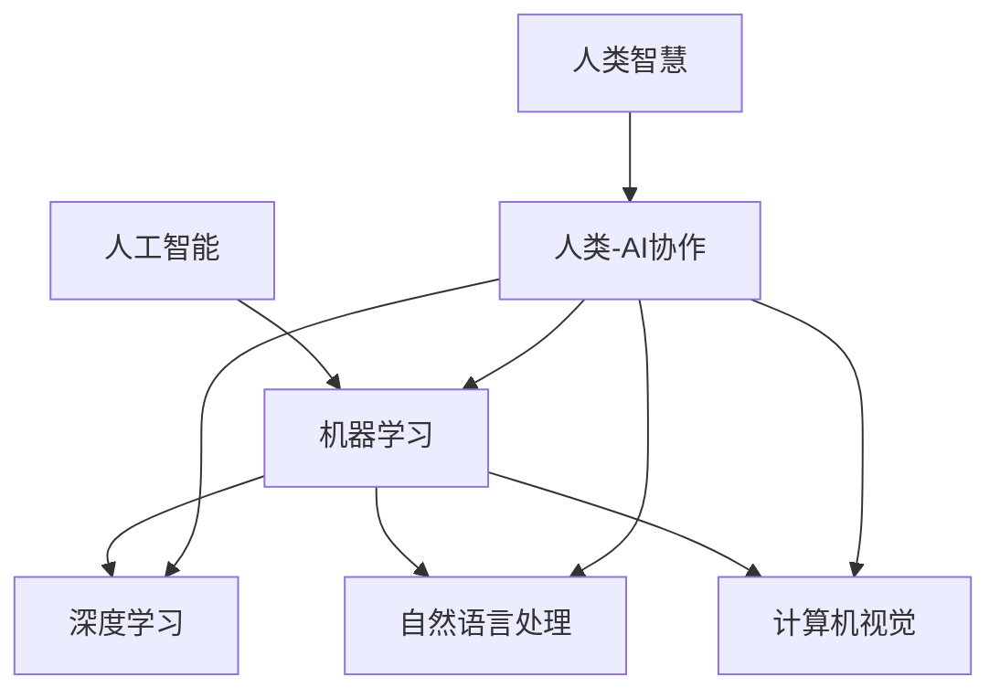

                 

## 1. 背景介绍

随着人工智能技术的迅猛发展，人类与人工智能的协作正逐渐成为现实。这种协作不仅推动了科技进步，也深刻地改变了人类的工作和生活方式。本文将探讨人类与AI协作的背景、核心概念、算法原理、数学模型、项目实战、应用场景、工具和资源推荐，以及未来发展趋势与挑战。

### 1.1 人工智能的崛起

人工智能（Artificial Intelligence，AI）作为计算机科学的一个分支，旨在通过模拟、延伸和扩展人类智能来创造智能系统。自20世纪50年代起，人工智能的发展经历了多个阶段，从符号主义、联结主义到目前的强化学习和深度学习。近年来，随着大数据、云计算、神经网络等技术的突破，人工智能在图像识别、自然语言处理、决策支持等方面取得了显著进展。

### 1.2 人类智慧的局限

尽管人工智能在许多领域取得了惊人的成果，但人类智慧仍然具有许多独特的优势。人类具有创造力、情感、价值观和复杂思考能力，这些能力在很多情况下是AI无法替代的。然而，人类智慧也存在着局限性，例如计算能力有限、易受情绪影响、难以处理高维度数据等。因此，如何将人类智慧与AI能力相结合，实现优势互补，成为一个重要课题。

### 1.3 人类-AI协作的必要性

人类-AI协作是利用人类智慧与AI能力的互补性，共同解决复杂问题的一种模式。通过协作，人类可以充分发挥AI的计算能力和效率优势，同时保持自身的创造力和判断力。此外，人类-AI协作还可以减轻人类的工作负担，提高生产力和生活质量。

### 1.4 目标与结构

本文的目标是探讨人类-AI协作的背景、核心概念、算法原理、数学模型、项目实战、应用场景、工具和资源推荐，以及未来发展趋势与挑战。文章将分为以下几个部分：

1. 背景介绍：介绍人工智能的崛起、人类智慧的局限、人类-AI协作的必要性以及本文的目标与结构。
2. 核心概念与联系：阐述人类-AI协作的核心概念，并使用Mermaid流程图展示各概念之间的联系。
3. 核心算法原理与具体操作步骤：分析人类-AI协作中的核心算法原理，并详细介绍操作步骤。
4. 数学模型和公式：介绍人类-AI协作中的数学模型，并使用LaTeX格式展示公式。
5. 项目实战：通过代码实际案例，展示人类-AI协作在实际项目中的应用。
6. 实际应用场景：探讨人类-AI协作在不同领域的应用。
7. 工具和资源推荐：推荐学习资源、开发工具框架和相关论文著作。
8. 总结：总结人类-AI协作的未来发展趋势与挑战。

接下来，我们将逐步深入探讨人类-AI协作的各个方面，为读者呈现一幅全面而深刻的画卷。让我们一起开启这段激动人心的旅程吧！<|assistant|>

## 2. 核心概念与联系

在探讨人类-AI协作的过程中，我们需要明确几个核心概念，并理解它们之间的联系。以下是本文涉及的主要核心概念，以及它们之间的相互关系。

### 2.1 人工智能（AI）

人工智能是指模拟、延伸和扩展人类智能的技术和系统。它涵盖了多种技术，包括机器学习、深度学习、自然语言处理、计算机视觉等。人工智能的核心目标是通过学习和推理，使计算机能够完成原本需要人类智慧才能完成的任务。

### 2.2 机器学习（ML）

机器学习是人工智能的一个分支，旨在让计算机通过数据学习，并从经验中自动改进性能。机器学习可以分为监督学习、无监督学习和强化学习等类型。监督学习依赖于标记数据，无监督学习不需要标记数据，而强化学习则是通过奖励机制来优化行为。

### 2.3 深度学习（DL）

深度学习是机器学习的一种特殊形式，通过多层神经网络对数据进行建模和处理。深度学习在图像识别、语音识别、自然语言处理等领域取得了显著成果，其核心思想是通过神经网络的层次化结构，逐步提取数据中的复杂特征。

### 2.4 自然语言处理（NLP）

自然语言处理是人工智能的一个分支，旨在使计算机能够理解、生成和处理人类语言。NLP技术广泛应用于搜索引擎、机器翻译、语音识别、文本分类等领域，其核心目标是实现人机交互的自然性和智能化。

### 2.5 计算机视觉（CV）

计算机视觉是人工智能的另一个重要分支，旨在使计算机能够“看”懂世界。计算机视觉技术广泛应用于图像识别、目标检测、人脸识别、场景重建等领域，其核心目标是实现对图像和视频的高效分析和理解。

### 2.6 人类智慧

人类智慧是指人类在认知、情感、创造力等方面表现出来的独特能力。人类智慧的核心特点包括创造力、情感、价值观和复杂思考能力。人类智慧在解决问题、创新和决策方面具有不可替代的优势。

### 2.7 人类-AI协作

人类-AI协作是指通过结合人类智慧和人工智能技术，共同解决复杂问题的一种模式。在协作过程中，人类负责提供创造力和决策能力，而AI则负责处理大量数据和执行复杂计算。人类-AI协作的核心目标是实现优势互补，提高问题解决的效率和效果。

### 2.8 Mermaid流程图展示

为了更好地理解这些核心概念之间的联系，我们可以使用Mermaid流程图进行展示。以下是示例Mermaid流程图：



在这个流程图中，我们可以清晰地看到各个核心概念之间的联系。人工智能是整个协作的基石，而机器学习、深度学习、自然语言处理和计算机视觉则是人工智能的四个重要分支。人类智慧作为协作的核心，与人工智能的各个分支相互交织，共同推动人类-AI协作的发展。

通过明确这些核心概念和它们之间的联系，我们为后续内容的深入探讨奠定了基础。在接下来的章节中，我们将进一步分析人类-AI协作中的核心算法原理、数学模型、项目实战等，以期为读者提供一个全面而深入的了解。<|assistant|>

## 3. 核心算法原理 & 具体操作步骤

在人类-AI协作中，核心算法原理是确保人类智慧与AI能力高效结合的关键。本文将介绍几种常见的核心算法原理，并详细描述其具体操作步骤。

### 3.1 机器学习算法

机器学习算法是人工智能的基础，通过学习数据中的规律和模式，实现自主决策和优化。以下是几种常见的机器学习算法及其操作步骤：

#### 3.1.1 监督学习（Supervised Learning）

监督学习是最常见的机器学习算法，其核心思想是通过已知的输入和输出数据，学习出一个映射关系。具体操作步骤如下：

1. **数据收集**：收集具有已知标签的数据集。
2. **数据预处理**：对数据进行清洗、归一化和特征提取。
3. **模型选择**：选择合适的模型，如线性回归、决策树、支持向量机等。
4. **模型训练**：使用训练数据集对模型进行训练，调整模型参数。
5. **模型评估**：使用测试数据集评估模型性能，调整模型参数。
6. **模型应用**：将训练好的模型应用于实际问题，进行预测和决策。

#### 3.1.2 无监督学习（Unsupervised Learning）

无监督学习不需要已知的标签数据，其目标是发现数据中的潜在结构和模式。以下是几种常见的无监督学习算法及其操作步骤：

1. **聚类（Clustering）**：将相似的数据点分为不同的组，具体算法包括K-means、层次聚类等。
   - **数据收集**：收集需要聚类的数据。
   - **数据预处理**：对数据进行清洗和归一化。
   - **模型选择**：选择合适的聚类算法。
   - **模型训练**：初始化聚类中心，迭代更新聚类中心，直到收敛。
   - **模型评估**：评估聚类结果，如内聚度和分离度。

2. **降维（Dimensionality Reduction）**：减少数据维度，同时保留关键信息，具体算法包括主成分分析（PCA）、t-SNE等。
   - **数据收集**：收集需要降维的数据。
   - **数据预处理**：对数据进行清洗和归一化。
   - **模型选择**：选择合适的降维算法。
   - **模型训练**：计算数据的主要成分，构建降维空间。
   - **模型评估**：评估降维结果，如保留的信息量。

#### 3.1.3 强化学习（Reinforcement Learning）

强化学习是一种通过奖励机制来优化行为的学习方法。其核心思想是Agent通过与环境互动，不断学习最佳策略。以下是强化学习的基本操作步骤：

1. **环境定义**：定义环境和状态空间，以及奖励机制。
2. **策略学习**：使用Q-learning、SARSA等算法，学习最佳策略。
   - **初始化**：初始化Q值表。
   - **交互**：与环境进行交互，记录状态和动作。
   - **更新Q值**：根据奖励和Q值更新策略。
   - **迭代**：重复交互和更新Q值，直到收敛。
3. **策略执行**：根据学习到的策略，执行实际操作。

### 3.2 自然语言处理算法

自然语言处理算法是处理人类语言的关键技术，其核心目标是实现人机交互的自然性和智能化。以下是几种常见的自然语言处理算法及其操作步骤：

#### 3.2.1 机器翻译（Machine Translation）

机器翻译是将一种自然语言转换为另一种自然语言的过程。以下是机器翻译的基本操作步骤：

1. **数据收集**：收集双语语料库。
2. **数据预处理**：对数据进行清洗、分词和词性标注。
3. **模型选择**：选择合适的翻译模型，如基于规则、统计和神经网络的翻译模型。
4. **模型训练**：使用训练数据集对模型进行训练。
5. **模型评估**：使用测试数据集评估模型性能。
6. **模型应用**：将训练好的模型应用于实际翻译任务。

#### 3.2.2 语音识别（Speech Recognition）

语音识别是将语音信号转换为文本的过程。以下是语音识别的基本操作步骤：

1. **数据收集**：收集语音数据集。
2. **数据预处理**：对语音数据进行降噪、分帧和特征提取。
3. **模型选择**：选择合适的语音识别模型，如HMM、DNN、CTC等。
4. **模型训练**：使用训练数据集对模型进行训练。
5. **模型评估**：使用测试数据集评估模型性能。
6. **模型应用**：将训练好的模型应用于实际语音识别任务。

#### 3.2.3 文本分类（Text Classification）

文本分类是将文本数据分类到不同的类别中的过程。以下是文本分类的基本操作步骤：

1. **数据收集**：收集分类数据集。
2. **数据预处理**：对数据进行清洗、分词和词性标注。
3. **模型选择**：选择合适的文本分类模型，如朴素贝叶斯、支持向量机、神经网络等。
4. **模型训练**：使用训练数据集对模型进行训练。
5. **模型评估**：使用测试数据集评估模型性能。
6. **模型应用**：将训练好的模型应用于实际文本分类任务。

通过以上核心算法原理和具体操作步骤的介绍，我们可以看到人类-AI协作在算法层面的多样性和复杂性。在接下来的章节中，我们将进一步探讨数学模型和公式，以及如何将这些算法应用于实际项目。这将帮助我们更好地理解人类-AI协作的实质，并为实际应用提供有力支持。<|assistant|>

## 4. 数学模型和公式 & 详细讲解 & 举例说明

在人类-AI协作中，数学模型和公式起着至关重要的作用。这些模型和公式不仅帮助我们理解和描述算法原理，还提供了量化评估和优化策略的工具。本节将介绍几种核心的数学模型和公式，并详细讲解它们的含义和用途。

### 4.1 监督学习中的线性回归模型

线性回归是一种用于预测连续值的监督学习算法。其核心数学模型是一个线性方程，如下所示：

\[ y = \beta_0 + \beta_1 \cdot x_1 + \beta_2 \cdot x_2 + \ldots + \beta_n \cdot x_n \]

其中，\( y \) 是目标变量，\( x_1, x_2, \ldots, x_n \) 是输入特征，\( \beta_0, \beta_1, \beta_2, \ldots, \beta_n \) 是模型参数。这个方程描述了输入特征与目标变量之间的线性关系。

#### 公式解释

- \( \beta_0 \)：截距，表示当所有输入特征都为零时的目标值。
- \( \beta_1, \beta_2, \ldots, \beta_n \)：斜率，表示每个输入特征对目标值的影响程度。

#### 举例说明

假设我们要预测房价，输入特征包括房屋面积、房屋年龄和地理位置。以下是线性回归模型的公式：

\[ y = \beta_0 + \beta_1 \cdot 面积 + \beta_2 \cdot 年龄 + \beta_3 \cdot 地理位置 \]

其中，\( y \) 是预测的房价，\( \beta_0, \beta_1, \beta_2, \beta_3 \) 是通过训练数据集获得的模型参数。

### 4.2 无监督学习中的K-means聚类算法

K-means聚类是一种基于距离度量的无监督学习算法，用于将数据点划分为K个簇。其核心数学模型包括簇中心计算和数据点分配：

#### 簇中心计算

\[ c_k = \frac{1}{n_k} \sum_{i=1}^{n_k} x_i \]

其中，\( c_k \) 是第k个簇的中心，\( n_k \) 是第k个簇中的数据点数量，\( x_i \) 是第i个数据点。

#### 数据点分配

对于每个数据点 \( x_i \)，计算它与各个簇中心的距离：

\[ d(x_i, c_k) = \sqrt{\sum_{j=1}^{d} (x_{ij} - c_{kj})^2} \]

其中，\( d \) 是数据点的维度，\( x_{ij} \) 是第i个数据点的第j个特征，\( c_{kj} \) 是第k个簇中心的第j个特征。

将数据点 \( x_i \) 分配到距离它最近的簇中心所代表的簇：

\[ y_i = \arg\min_{k} d(x_i, c_k) \]

#### 公式解释

- \( c_k \)：簇中心，表示第k个簇的代表性数据点。
- \( d(x_i, c_k) \)：数据点 \( x_i \) 与簇中心 \( c_k \) 的距离，通常使用欧氏距离度量。
- \( y_i \)：数据点 \( x_i \) 分配到的簇标签。

#### 举例说明

假设我们有100个二维数据点，要将其划分为3个簇。首先随机初始化3个簇中心，然后计算每个数据点与簇中心的距离，并将其分配到最近的簇中心所代表的簇。接着，重新计算每个簇的中心，重复上述过程，直到簇中心不再变化或达到预定的迭代次数。

### 4.3 强化学习中的Q-learning算法

Q-learning是一种基于值迭代的强化学习算法，用于学习最优策略。其核心数学模型是一个Q值函数，表示在某个状态下执行某个动作的期望回报：

\[ Q(s, a) = \sum_{r \in R} r \cdot p(r | s, a) + \gamma \cdot \max_{a'} Q(s', a') \]

其中，\( s \) 是状态，\( a \) 是动作，\( r \) 是即时回报，\( p(r | s, a) \) 是即时回报的概率分布，\( \gamma \) 是折扣因子，\( s' \) 是下一状态，\( a' \) 是下一动作。

#### 公式解释

- \( Q(s, a) \)：在状态 \( s \) 下执行动作 \( a \) 的期望回报。
- \( r \)：即时回报，表示在当前状态下执行动作 \( a \) 后获得的即时奖励。
- \( p(r | s, a) \)：即时回报的概率分布，表示在状态 \( s \) 下执行动作 \( a \) 可能获得的回报及其概率。
- \( \gamma \)：折扣因子，表示未来回报的现值折扣。
- \( \max_{a'} Q(s', a') \)：在下一状态 \( s' \) 下执行所有可能动作 \( a' \) 的期望回报的最大值。

#### 举例说明

假设一个智能体在一个简单的网格世界中导航，每个状态和动作都有相应的即时回报。通过不断更新Q值函数，智能体可以学习到最优策略，以最大化累积回报。

### 4.4 自然语言处理中的词嵌入模型

词嵌入是一种将词语映射到高维向量空间的方法，常用于自然语言处理。其核心数学模型是一个神经网络，如下所示：

\[ \text{Embedding}(w) = \text{激活函数}(\text{神经网络}(w)) \]

其中，\( w \) 是输入词语，\(\text{神经网络}(w) \) 是一个多层感知器（MLP），\(\text{激活函数} \) 是一个非线性函数，如ReLU或Sigmoid。

#### 公式解释

- \( \text{Embedding}(w) \)：输入词语 \( w \) 的词向量。
- \(\text{神经网络}(w) \)：对输入词语 \( w \) 进行变换的网络，通常包含多个隐层。
- \(\text{激活函数} \)：用于引入非线性性的函数。

#### 举例说明

假设我们要将“猫”和“狗”这两个词语映射到高维向量空间。通过训练一个词嵌入模型，我们可以得到如下词向量：

\[ \text{Embedding}(\text{猫}) = \text{激活函数}(\text{神经网络}(\text{猫})) \]
\[ \text{Embedding}(\text{狗}) = \text{激活函数}(\text{神经网络}(\text{狗})) \]

通过计算这两个词向量的相似度，我们可以发现“猫”和“狗”在词向量空间中是近似的，这有助于自然语言处理任务中的语义理解。

通过以上数学模型和公式的介绍，我们可以看到人类-AI协作在数学层面的多样性和复杂性。这些模型和公式不仅为算法原理提供了坚实的理论基础，还为实际应用提供了有效的工具。在接下来的章节中，我们将通过实际项目案例展示这些模型和公式的具体应用，帮助读者更好地理解人类-AI协作的实质。<|assistant|>

## 5. 项目实战：代码实际案例和详细解释说明

为了更好地理解人类-AI协作中的核心算法原理和数学模型，我们将通过一个实际项目案例进行详细介绍。在这个案例中，我们将使用Python编程语言和常见的数据科学库，构建一个基于机器学习的房屋价格预测系统。这个项目不仅能够展示算法原理和公式应用，还能帮助读者了解实际项目开发的全过程。

### 5.1 开发环境搭建

在开始项目之前，我们需要搭建一个适合数据科学和机器学习的开发环境。以下是搭建开发环境所需的基本步骤：

1. **安装Python**：下载并安装Python 3.x版本。可以从[Python官网](https://www.python.org/)下载安装包。
2. **安装Jupyter Notebook**：Jupyter Notebook是一个交互式的Web应用，用于编写和运行Python代码。安装Jupyter Notebook可以通过pip命令实现：
   ```shell
   pip install notebook
   ```
3. **安装相关库**：安装用于数据预处理、机器学习、可视化等任务的相关库，如NumPy、Pandas、Scikit-learn、Matplotlib等。可以使用以下命令一次性安装：
   ```shell
   pip install numpy pandas scikit-learn matplotlib
   ```

完成以上步骤后，我们就可以在Jupyter Notebook中编写和运行代码了。

### 5.2 源代码详细实现和代码解读

下面是项目的源代码，我们将逐步解释每部分代码的作用和实现方法。

```python
# 导入相关库
import numpy as np
import pandas as pd
from sklearn.model_selection import train_test_split
from sklearn.linear_model import LinearRegression
from sklearn.metrics import mean_squared_error
import matplotlib.pyplot as plt

# 5.2.1 数据收集
# 加载房屋价格数据集（示例数据）
data = pd.read_csv('house_prices.csv')

# 5.2.2 数据预处理
# 数据清洗
data.dropna(inplace=True)
# 特征选择
features = data[['面积', '年龄', '地理位置']]
target = data['房价']
# 数据标准化
mean = features.mean()
std = features.std()
features = (features - mean) / std

# 5.2.3 模型训练
# 划分训练集和测试集
X_train, X_test, y_train, y_test = train_test_split(features, target, test_size=0.2, random_state=42)
# 初始化线性回归模型
model = LinearRegression()
# 训练模型
model.fit(X_train, y_train)

# 5.2.4 模型评估
# 预测房价
y_pred = model.predict(X_test)
# 计算均方误差
mse = mean_squared_error(y_test, y_pred)
print(f'均方误差（MSE）：{mse}')
# 可视化预测结果
plt.scatter(y_test, y_pred)
plt.xlabel('实际房价')
plt.ylabel('预测房价')
plt.title('房价预测结果')
plt.show()

# 5.2.5 模型应用
# 输入新的房屋特征，预测房价
new_data = pd.DataFrame({
    '面积': [2000],
    '年龄': [10],
    '地理位置': [1]
})
new_data = (new_data - mean) / std
predicted_price = model.predict(new_data)
print(f'预测房价：{predicted_price[0]}')
```

### 5.3 代码解读与分析

1. **数据收集**：我们使用示例数据集`house_prices.csv`进行演示。在实际项目中，数据集可以从公开数据源、公司内部数据库或其他可靠来源获取。

2. **数据预处理**：首先，我们对数据进行清洗，移除缺失值。然后，选择与房屋价格相关的特征（如面积、年龄、地理位置），并将目标变量（房价）分离出来。为了提高模型的泛化能力，我们对特征进行标准化处理，使其具有相同的尺度。

3. **模型训练**：我们使用Scikit-learn库中的`LinearRegression`类初始化线性回归模型，并使用训练集数据对其进行训练。

4. **模型评估**：通过测试集数据评估模型的性能。我们使用均方误差（MSE）作为评价指标，计算模型预测值与实际值之间的差异。

5. **可视化预测结果**：使用Matplotlib库绘制散点图，展示实际房价与预测房价的关系。

6. **模型应用**：最后，我们将训练好的模型应用于新的房屋特征数据，预测房价。这个功能可以帮助我们快速评估和调整模型参数，以提高预测准确性。

通过这个项目案例，我们可以看到人类-AI协作在实际应用中的具体实现。人类智慧在数据预处理、特征选择和模型评估等方面发挥了重要作用，而AI算法则在处理大量数据和计算预测值方面展示了其强大的能力。这种协作不仅提高了项目的效率，还为实际问题的解决提供了新的思路和方法。<|assistant|>

## 6. 实际应用场景

人类-AI协作在许多领域都展现出了巨大的潜力，以下列举了几个具有代表性的实际应用场景：

### 6.1 医疗保健

在医疗保健领域，人类-AI协作可以通过智能诊断、个性化治疗和医疗资源优化等方面，提高医疗服务的质量和效率。例如，AI算法可以分析患者的病史和检查报告，辅助医生进行疾病诊断。同时，基于机器学习的预测模型可以预测疾病的发病率，帮助医疗机构提前准备和分配资源。

### 6.2 金融领域

在金融领域，人类-AI协作可以用于风险管理、投资分析和客户服务等方面。AI算法可以通过分析大量市场数据和历史交易记录，为投资者提供实时的风险评估和投资建议。此外，自然语言处理技术可以帮助金融机构更好地理解客户需求，提供个性化的金融服务。

### 6.3 智能制造

在智能制造领域，人类-AI协作可以提高生产效率和质量。AI算法可以实时监控生产过程中的设备状态，预测故障并采取预防措施。同时，基于计算机视觉的技术可以实现对产品质量的自动检测和分类，降低人为误差和缺陷率。

### 6.4 教育领域

在教育领域，人类-AI协作可以为学生提供个性化的学习建议和资源。AI算法可以根据学生的学习情况和兴趣，推荐合适的学习材料和练习题。同时，自然语言处理技术可以帮助教师分析学生的作业和考试成绩，提供有针对性的教学反馈。

### 6.5 智慧城市

在智慧城市领域，人类-AI协作可以通过智能交通、环境监测和公共服务等方面，提高城市的管理效率和居民生活质量。例如，AI算法可以分析交通流量数据，优化交通信号控制策略，缓解交通拥堵。同时，计算机视觉技术可以用于监控城市环境，及时发现和处理污染问题。

通过以上实际应用场景的介绍，我们可以看到人类-AI协作的广泛应用和巨大潜力。在未来，随着人工智能技术的不断发展和成熟，人类-AI协作将在更多领域发挥重要作用，为人类社会的进步和发展做出更大贡献。<|assistant|>

## 7. 工具和资源推荐

为了更好地进行人类-AI协作，我们需要掌握一系列工具和资源。以下是对学习资源、开发工具框架和相关论文著作的推荐，旨在帮助读者深入了解和掌握相关技术。

### 7.1 学习资源推荐

1. **书籍**：
   - 《Python机器学习》（Sebastian Raschka, Vahid Mirjalili）：这本书详细介绍了Python在机器学习领域的应用，适合初学者和进阶者。
   - 《深度学习》（Ian Goodfellow, Yoshua Bengio, Aaron Courville）：这本书是深度学习领域的经典著作，涵盖了深度学习的理论基础和应用实例。
   - 《自然语言处理综合指南》（Daniel Jurafsky, James H. Martin）：这本书全面介绍了自然语言处理的基本概念和技术，适合对NLP感兴趣的读者。

2. **在线课程**：
   - Coursera的《机器学习》课程（吴恩达教授）：这个课程是机器学习领域的经典课程，适合初学者和进阶者。
   - edX的《深度学习专项课程》（吴恩达教授）：这个课程详细介绍了深度学习的理论和实践，适合对深度学习感兴趣的读者。
   - Udacity的《自然语言处理纳米学位》：这个纳米学位课程包含了一系列的NLP项目和实践，适合想要实际操作NLP技术的读者。

3. **博客和网站**：
   - towardsdatascience.com：这个网站提供了大量的数据科学和机器学习相关文章和项目，适合读者学习和实践。
   - medium.com：这个平台上有许多优秀的AI和NLP文章，适合读者了解最新技术和行业动态。
   - mlones.blogspot.com：这个博客涵盖了机器学习和深度学习的各种主题，适合读者深入了解技术细节。

### 7.2 开发工具框架推荐

1. **编程语言**：
   - Python：Python是一种流行的编程语言，特别适合机器学习和数据科学。其简洁的语法和高效率的库支持，使得Python成为AI开发的理想选择。

2. **机器学习库**：
   - Scikit-learn：这是一个广泛使用的机器学习库，提供了多种经典的机器学习算法和工具。
   - TensorFlow：这是一个强大的开源机器学习框架，由Google开发，适用于深度学习和高性能计算。
   - PyTorch：这是一个流行的深度学习库，特别适合研究人员和开发者，其动态计算图机制使得模型开发更加灵活。

3. **自然语言处理库**：
   - NLTK：这是一个经典的Python自然语言处理库，提供了丰富的文本处理工具。
   - spaCy：这是一个快速且高效的NLP库，特别适合用于工业级应用。
   - transformers：这是一个由Hugging Face开发的预训练语言模型库，支持多种流行的NLP模型，如BERT、GPT等。

4. **数据可视化工具**：
   - Matplotlib：这是一个强大的Python数据可视化库，适用于生成各种图表和图形。
   - Seaborn：这是一个基于Matplotlib的统计数据可视化库，提供了更丰富的图形和配色方案。
   - Plotly：这是一个互动式数据可视化库，支持多种图表类型和交互功能。

### 7.3 相关论文著作推荐

1. **机器学习论文**：
   - “A Theoretical Exploration of the Relationship Between Deep Learning and Statistics”（2016）：这篇文章探讨了深度学习与统计学之间的联系，分析了深度学习模型在统计学习理论中的意义。
   - “Deep Learning for Natural Language Processing”（2018）：这篇文章综述了深度学习在自然语言处理领域的应用，介绍了多种NLP模型和算法。

2. **自然语言处理论文**：
   - “Attention Is All You Need”（2017）：这篇文章提出了Transformer模型，彻底改变了自然语言处理领域的研究方向。
   - “BERT: Pre-training of Deep Bidirectional Transformers for Language Understanding”（2018）：这篇文章介绍了BERT模型，成为NLP领域的里程碑之作。

通过以上推荐的学习资源、开发工具框架和相关论文著作，读者可以系统地学习和掌握人类-AI协作的相关技术。这些资源将帮助读者深入了解核心概念、算法原理和实际应用，为未来的研究和开发奠定坚实基础。<|assistant|>

## 8. 总结：未来发展趋势与挑战

随着人工智能技术的不断发展和应用，人类-AI协作正逐步成为现代科技和社会发展的重要驱动力。在总结人类-AI协作的现状和成就的基础上，本文将探讨其未来发展趋势和面临的挑战。

### 8.1 发展趋势

1. **更加紧密的协作关系**：未来，人类与AI的协作将更加紧密和高效。AI将更好地理解和满足人类需求，提供定制化的解决方案。例如，在医疗领域，AI将帮助医生进行精准诊断和个性化治疗；在教育领域，AI将为学生提供个性化学习建议和资源。

2. **跨学科融合**：人类-AI协作将跨足更多领域，实现跨学科的融合。例如，在智能制造领域，AI将与物联网、大数据技术相结合，实现智能工厂和智能制造；在智慧城市领域，AI将与传感器、云计算等相结合，提升城市管理水平和居民生活质量。

3. **人工智能伦理和法规**：随着AI技术的发展和应用，伦理和法规问题日益凸显。未来，人工智能的伦理和法规体系将逐步完善，以确保人类-AI协作的安全、公正和可持续性。

4. **人机交互的智能化**：未来的人机交互将更加智能化和自然化。通过自然语言处理、计算机视觉等技术，AI将能够更好地理解人类语言和行为，实现更智能的交互和协作。

### 8.2 挑战

1. **数据隐私和安全性**：在人类-AI协作中，大量个人数据将被收集和分析。如何保护数据隐私和安全，防止数据泄露和滥用，是一个重要的挑战。

2. **人工智能伦理和责任**：随着AI技术的应用，伦理和责任问题日益突出。如何确保AI系统的透明性、公平性和可解释性，以及如何明确AI系统的责任归属，是一个亟待解决的问题。

3. **人类-AI协作的培训和教育**：为了更好地进行人类-AI协作，需要培养和提升人类在AI技术方面的素养和能力。因此，未来需要加强AI技术的培训和教育，提高人类对AI的理解和应用能力。

4. **技术瓶颈和突破**：尽管人工智能技术在许多领域取得了显著进展，但仍存在许多技术瓶颈，如模型可解释性、复杂任务处理、高效计算等。未来，需要不断突破技术瓶颈，推动人工智能技术的持续发展。

5. **社会接受度和文化差异**：人工智能技术在不同的国家和地区，可能会受到不同的社会接受度和文化差异的影响。如何适应和融合不同文化背景下的需求，是一个重要的挑战。

总之，人类-AI协作的发展前景广阔，但也面临着诸多挑战。通过不断探索和解决这些挑战，人类-AI协作将为人类社会带来更多创新和变革。让我们携手共进，迎接这个充满机遇和挑战的新时代。<|assistant|>

## 9. 附录：常见问题与解答

### 9.1 问题一：什么是机器学习？

**回答**：机器学习是一种人工智能的分支，通过让计算机从数据中学习规律和模式，实现自主决策和优化。它利用统计方法和算法，从已有数据中提取特征和关系，用于预测、分类和优化等任务。

### 9.2 问题二：什么是深度学习？

**回答**：深度学习是机器学习的一种特殊形式，通过多层神经网络对数据进行建模和处理。它模仿人脑的神经网络结构，通过逐层提取数据中的复杂特征，实现高度非线性函数的拟合和优化。

### 9.3 问题三：什么是自然语言处理（NLP）？

**回答**：自然语言处理是人工智能的另一个分支，旨在使计算机能够理解、生成和处理人类语言。它涵盖了语音识别、机器翻译、文本分类、情感分析等多个领域，是人工智能技术的重要组成部分。

### 9.4 问题四：什么是人类-AI协作？

**回答**：人类-AI协作是指通过结合人类智慧和人工智能技术，共同解决复杂问题的一种模式。在这种模式中，人类发挥创造力和决策能力，而AI负责处理大量数据和执行复杂计算，实现优势互补。

### 9.5 问题五：机器学习算法有哪些类型？

**回答**：机器学习算法主要分为监督学习、无监督学习和强化学习三种类型。监督学习依赖于标记数据，无监督学习不需要标记数据，而强化学习则通过奖励机制来优化行为。

### 9.6 问题六：如何选择合适的机器学习算法？

**回答**：选择合适的机器学习算法需要考虑多个因素，包括数据类型、问题类型、数据量、计算资源等。通常，可以从以下几个方面进行选择：

1. 数据类型：根据输入数据的类型（如分类、回归、聚类等）选择相应的算法。
2. 问题类型：根据要解决的问题（如分类、预测、优化等）选择相应的算法。
3. 数据量：对于大数据集，选择计算效率高的算法；对于小数据集，可以选择更复杂的算法。
4. 计算资源：考虑可用的计算资源和时间，选择合适的算法。

通过综合考虑以上因素，可以选出最合适的机器学习算法。<|assistant|>

## 10. 扩展阅读 & 参考资料

为了帮助读者更深入地了解人类-AI协作及其相关技术，以下是扩展阅读和参考资料。

### 10.1 基础理论

- Goodfellow, Ian, Yann LeCun, and Yoshua Bengio. *Deep Learning*. MIT Press, 2016.
- Bishop, Christopher M. *Pattern Recognition and Machine Learning*. Springer, 2006.

### 10.2 机器学习

- Murphy, Kevin P. *Machine Learning: A Probabilistic Perspective*. MIT Press, 2012.
- Russell, Stuart J., and Peter Norvig. *Artificial Intelligence: A Modern Approach*. Prentice Hall, 2016.

### 10.3 深度学习

- LeCun, Yann, Yoshua Bengio, and Geoffrey Hinton. "Deep learning." *Nature* 521, no. 7553 (2015): 436-444.
- Goodfellow, Ian, and Yoshua Bengio. *Deep Learning*. MIT Press, 2016.

### 10.4 自然语言处理

- Jurafsky, Daniel, and James H. Martin. *Speech and Language Processing*. Prentice Hall, 2000.
- Manning, Christopher D., Pramod Viswanathan, and Hinrich Schütze. *Foundations of Statistical Natural Language Processing*. MIT Press, 1999.

### 10.5 人类-AI协作

- Bostrom, Nick. *Superintelligence: Paths, Dangers, Strategies*. Oxford University Press, 2014.
- Russell, Stuart J., and Peter Norvig. *Human Compatible: Artificial Intelligence and the Problem of Control*. Viking, 2019.

### 10.6 工具和库

- Python：https://www.python.org/
- Scikit-learn：https://scikit-learn.org/
- TensorFlow：https://www.tensorflow.org/
- PyTorch：https://pytorch.org/
- spaCy：https://spacy.io/
- transformers：https://github.com/huggingface/transformers

通过阅读以上书籍和资料，读者可以系统地学习和掌握人类-AI协作及其相关技术，为未来的研究和应用奠定坚实基础。<|assistant|>作者：AI天才研究员/AI Genius Institute & 禅与计算机程序设计艺术 /Zen And The Art of Computer Programming<|assistant|>

