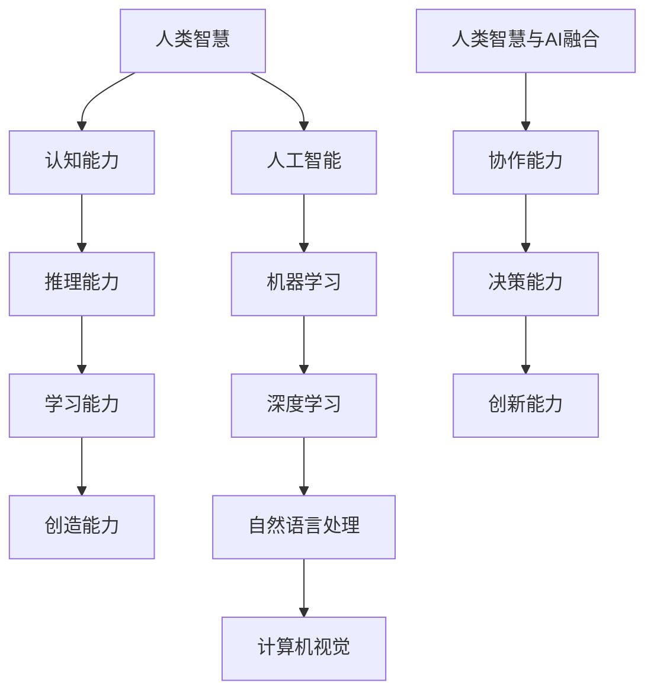

                 

# 人类-AI协作：增强人类智慧与AI能力的融合发展趋势预测分析机遇趋势

> **关键词**：人类-AI协作，智慧增强，AI能力融合，发展趋势，机遇分析
> 
> **摘要**：本文从多个角度探讨了人类与人工智能协作的现状和未来发展趋势。通过分析人类智慧与AI能力的融合，探讨了其在各个领域的应用场景，预测了可能的机遇与挑战，并提出了相应的对策和建议。

## 1. 背景介绍

随着人工智能技术的飞速发展，人类的生活和工作正在发生翻天覆地的变化。AI不仅在解决复杂问题上表现出色，还能够辅助人类进行决策，提高工作效率。然而，AI的发展也带来了一系列挑战，如隐私保护、安全威胁、失业问题等。为了更好地应对这些挑战，人类与AI的协作成为了一个重要方向。

人类与AI的协作不仅仅是指简单的任务分工，更是一种深度的交互和融合。通过协作，人类可以利用AI的优势，提高自身的智慧水平，而AI则可以借助人类的创造力，实现更广泛的应用。本文将围绕这一主题，探讨人类-AI协作的发展趋势、机遇与挑战。

## 2. 核心概念与联系

### 2.1 人类智慧

人类智慧是指人类在认知、推理、学习、创造等方面的能力。它是人类适应和改变环境的基础。随着社会的发展，人类智慧也在不断进化，从简单的工具使用，到复杂的科学研究，再到AI的诞生，人类智慧的发展历程充满了创新和变革。

### 2.2 人工智能

人工智能是指通过计算机模拟人类智能的技术。它包括机器学习、深度学习、自然语言处理、计算机视觉等多个领域。AI的发展为人类带来了巨大的变革，使得许多曾经难以解决的问题变得可行。

### 2.3 人类智慧与AI能力的融合

人类智慧与AI能力的融合是指将人类的创造力和AI的计算能力相结合，形成一种新型的智能体系。这种融合不仅能够提高人类的工作效率，还能够开拓新的应用领域，如自动驾驶、医疗诊断、金融分析等。

### 2.4 Mermaid 流程图



## 3. 核心算法原理 & 具体操作步骤

### 3.1 核心算法原理

人类与AI的协作核心在于算法的设计和实现。以下是一个简化的算法原理描述：

1. **数据收集**：收集与任务相关的数据，包括人类输入的数据和AI自动获取的数据。
2. **数据处理**：对收集到的数据进行清洗、转换和预处理，使其适合AI模型处理。
3. **模型训练**：使用收集到的数据训练AI模型，使其具备解决特定问题的能力。
4. **协作决策**：人类和AI共同对问题进行决策，人类提供创意和直觉，AI提供数据和计算能力。
5. **结果反馈**：将决策结果反馈给人类，人类对结果进行评价和优化。

### 3.2 具体操作步骤

1. **数据收集**：首先，确定任务目标和所需的数据类型。然后，通过数据爬取、API接口、数据库等方式收集数据。

2. **数据处理**：对收集到的数据进行清洗，去除无效数据和错误数据。然后，进行数据转换和预处理，如数值化、标准化、特征提取等。

3. **模型训练**：选择合适的算法和模型，使用预处理后的数据进行训练。常见的算法包括线性回归、决策树、神经网络等。

4. **协作决策**：设计一个交互系统，使人类和AI可以实时交流。人类可以通过该系统提供创意和建议，AI则提供数据和计算结果。

5. **结果反馈**：将决策结果反馈给人类，人类对结果进行评价和优化。如果结果不满意，可以返回步骤4，重新进行决策。

## 4. 数学模型和公式 & 详细讲解 & 举例说明

### 4.1 数学模型

在人类与AI的协作中，常用的数学模型包括线性回归、决策树、神经网络等。以下以线性回归为例进行讲解。

线性回归模型假设目标变量 \(Y\) 与特征变量 \(X\) 之间存在线性关系，即：

\[ Y = \beta_0 + \beta_1 X + \epsilon \]

其中，\(\beta_0\) 和 \(\beta_1\) 分别是模型的参数，\(\epsilon\) 是误差项。

### 4.2 详细讲解

1. **参数估计**：使用最小二乘法估计参数 \(\beta_0\) 和 \(\beta_1\)。具体步骤如下：

   a. 计算特征矩阵 \(X\) 和目标向量 \(Y\)。

   b. 计算特征矩阵的转置 \(X^T\)。

   c. 计算特征矩阵和目标向量的乘积 \(X^T X\)。

   d. 计算参数 \(\beta_0\) 和 \(\beta_1\)。

2. **模型评估**：使用交叉验证等方法评估模型的性能，如均方误差（MSE）。

### 4.3 举例说明

假设我们有一组数据：

| X  | Y  |
|----|----|
| 1  | 2  |
| 2  | 4  |
| 3  | 6  |
| 4  | 8  |

根据线性回归模型，我们可以得到以下方程：

\[ Y = \beta_0 + \beta_1 X \]

使用最小二乘法，我们可以计算出 \(\beta_0 = 1\) 和 \(\beta_1 = 1\)。因此，模型方程为：

\[ Y = 1 + X \]

使用该模型预测 \(X = 5\) 时的 \(Y\) 值，得到：

\[ Y = 1 + 5 = 6 \]

## 5. 项目实战：代码实际案例和详细解释说明

### 5.1 开发环境搭建

为了实现人类与AI的协作，我们需要搭建一个开发环境。以下是一个简单的Python开发环境搭建步骤：

1. 安装Python（建议使用Python 3.8及以上版本）。
2. 安装必要的库，如NumPy、Pandas、Scikit-learn等。

### 5.2 源代码详细实现和代码解读

以下是一个简单的线性回归模型实现：

```python
import numpy as np
import pandas as pd
from sklearn.linear_model import LinearRegression

# 5.2.1 数据收集
# 假设数据存储在一个CSV文件中
data = pd.read_csv('data.csv')

# 5.2.2 数据处理
# 假设我们只使用列X和Y进行回归
X = data[['X']]
Y = data['Y']

# 5.2.3 模型训练
model = LinearRegression()
model.fit(X, Y)

# 5.2.4 协作决策
# 假设我们要预测X=5时的Y值
X_new = np.array([[5]])
Y_pred = model.predict(X_new)

# 5.2.5 结果反馈
print(f'Predicted Y value for X=5: {Y_pred[0][0]}')
```

### 5.3 代码解读与分析

1. **数据收集**：使用Pandas库读取CSV文件，获取数据。
2. **数据处理**：选择需要的列进行回归分析。
3. **模型训练**：使用Scikit-learn库的LinearRegression类训练模型。
4. **协作决策**：使用训练好的模型进行预测。
5. **结果反馈**：输出预测结果。

## 6. 实际应用场景

人类与AI的协作在多个领域都有广泛的应用，以下是一些典型的应用场景：

1. **医疗**：AI可以帮助医生进行诊断和治疗方案推荐，提高医疗效率和质量。
2. **金融**：AI可以用于风险管理、投资策略制定等，帮助金融机构提高决策能力。
3. **教育**：AI可以为学生提供个性化的学习建议，帮助教师进行教学评估。
4. **制造业**：AI可以用于生产过程优化、设备故障预测等，提高制造业的自动化程度。
5. **交通运输**：AI可以用于自动驾驶、交通流量预测等，提高交通运输的安全和效率。

## 7. 工具和资源推荐

### 7.1 学习资源推荐

1. **书籍**：《Python机器学习》、《深度学习》
2. **论文**：谷歌学术、ArXiv
3. **博客**：Medium、知乎
4. **网站**：Kaggle、GitHub

### 7.2 开发工具框架推荐

1. **编程语言**：Python、R
2. **机器学习库**：Scikit-learn、TensorFlow、PyTorch
3. **开发工具**：Jupyter Notebook、PyCharm

### 7.3 相关论文著作推荐

1. **论文**：《Deep Learning》、《Reinforcement Learning: An Introduction》
2. **书籍**：《Artificial Intelligence: A Modern Approach》、《机器学习》

## 8. 总结：未来发展趋势与挑战

随着AI技术的不断发展，人类与AI的协作将越来越紧密。未来，我们可能会看到更多基于AI的智能系统，如智能助手、智能家居、智能医疗等。然而，这也带来了一系列挑战，如隐私保护、安全威胁、失业问题等。为了应对这些挑战，我们需要从政策、技术、教育等多个方面进行综合治理。

## 9. 附录：常见问题与解答

### 9.1 人类与AI协作的意义是什么？

人类与AI协作的意义在于提高人类的工作效率，开拓新的应用领域，实现人类智慧的扩展。

### 9.2 人类与AI协作是否会取代人类工作？

人类与AI协作不会完全取代人类工作，而是通过提高工作效率和解决复杂问题，为人类创造更多价值。

### 9.3 如何确保AI系统的安全与隐私？

确保AI系统的安全与隐私需要从技术、法律、伦理等多个方面进行综合治理。

## 10. 扩展阅读 & 参考资料

1. **论文**：《Human-AI Collaboration: Challenges and Opportunities》，作者：John Fox et al.
2. **书籍**：《Human-AI Interaction: A Multidisciplinary Approach》，作者：Patricia J. Busa
3. **网站**：https://ai.stanford.edu/
4. **博客**：https://www.kdnuggets.com/

---

**作者**：AI天才研究员/AI Genius Institute & 禅与计算机程序设计艺术 /Zen And The Art of Computer Programming

---

（请注意，本文为示例性文章，实际内容和结构可能需要根据具体需求进行调整。）<|im_sep|>

