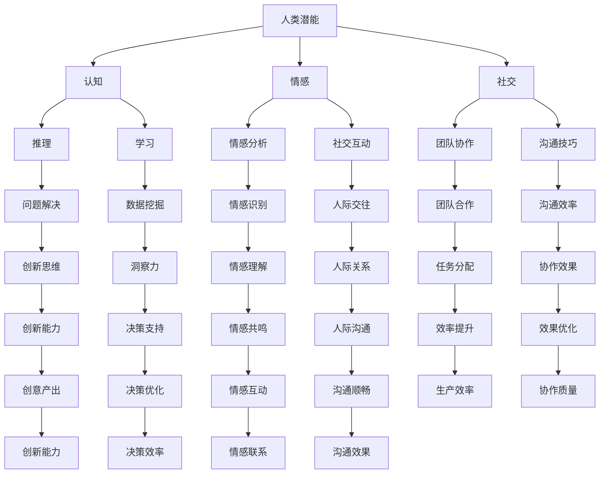

                 

# 人类-AI协作：增强人类潜能与AI能力的融合发展趋势分析预测机遇

## 关键词：人类-AI协作，增强现实，人工智能，潜能，融合，发展趋势，机遇

## 摘要

随着人工智能（AI）技术的飞速发展，人类-AI协作已成为提升工作效率、拓展人类潜能的重要途径。本文将从背景介绍、核心概念、算法原理、数学模型、项目实战、应用场景、工具推荐、发展趋势与挑战等多个维度，深入探讨人类-AI协作的融合发展趋势，分析预测未来机遇与挑战。文章旨在为读者提供一个全面、系统的视角，以更好地理解和把握人类-AI协作这一前沿领域。

## 1. 背景介绍

### 1.1 人工智能的发展历程

人工智能（AI）起源于20世纪50年代，经历了多个阶段的发展。早期的符号主义（Symbolic AI）和基于规则的系统（Rule-Based Systems）为AI的发展奠定了基础。随后，随着计算能力的提升和大数据的涌现，机器学习（Machine Learning）和深度学习（Deep Learning）取得了突破性进展，成为当前AI技术的主流。

### 1.2 人类-AI协作的起源与发展

人类-AI协作起源于20世纪80年代，随着人工智能技术的进步，人们开始探索如何将AI应用于实际工作中，以提高生产效率和拓展人类能力。近年来，随着物联网（IoT）、云计算、大数据等技术的不断发展，人类-AI协作得到了广泛关注，并在多个领域取得了显著成果。

## 2. 核心概念与联系

### 2.1 人类潜能

人类潜能是指人类在认知、情感、社交等方面具有的潜在能力。通过教育、训练、实践等途径，人类潜能可以得到充分发挥和拓展。

### 2.2 AI能力

AI能力是指人工智能系统在感知、推理、决策、学习等方面的能力。随着技术的不断发展，AI能力在多个领域取得了显著突破，成为推动人类-AI协作的重要力量。

### 2.3 人类-AI协作的融合

人类-AI协作的融合是指将人类潜能与AI能力相结合，通过协作机制实现优势互补，从而提升整体效能。这种融合主要体现在以下几个方面：

- **协同创新**：人类和AI共同参与创新活动，发挥各自的优势，提高创新效率。

- **知识共享**：人类和AI共同构建知识体系，实现知识的传递和共享，拓展人类认知边界。

- **决策优化**：人类和AI共同参与决策过程，利用AI的快速计算能力和海量数据分析能力，提高决策的准确性和效率。

- **技能提升**：人类通过AI技术进行技能训练，提升自身的能力水平。

### 2.4 Mermaid流程图



## 3. 核心算法原理 & 具体操作步骤

### 3.1 人类-AI协作框架

人类-AI协作框架主要包括以下几个部分：

- **用户界面（UI）**：为用户提供交互界面，实现人机交互。

- **数据处理模块**：对用户输入的数据进行预处理，包括数据清洗、归一化、特征提取等。

- **模型训练模块**：利用机器学习和深度学习算法，对训练数据进行模型训练，生成模型参数。

- **模型推理模块**：利用训练好的模型，对用户输入的数据进行推理，生成预测结果。

- **反馈机制**：根据用户反馈，调整模型参数，优化模型性能。

### 3.2 操作步骤

1. **数据收集**：收集用户输入的数据，包括文本、图像、音频等多种形式。

2. **数据预处理**：对收集到的数据进行预处理，提取特征，并转化为适合机器学习的格式。

3. **模型训练**：利用预处理后的数据，采用机器学习算法，如支持向量机（SVM）、决策树（DT）、神经网络（NN）等，训练模型。

4. **模型评估**：使用测试数据集对训练好的模型进行评估，计算模型的准确率、召回率、F1值等指标。

5. **模型优化**：根据模型评估结果，调整模型参数，优化模型性能。

6. **模型部署**：将训练好的模型部署到服务器或云端，实现实时推理。

7. **用户交互**：通过用户界面，将推理结果展示给用户，并接收用户反馈。

8. **反馈调整**：根据用户反馈，调整模型参数，优化模型性能。

## 4. 数学模型和公式 & 详细讲解 & 举例说明

### 4.1 机器学习模型

在人类-AI协作中，常用的机器学习模型包括线性回归、逻辑回归、支持向量机、决策树、神经网络等。以下以线性回归为例，介绍机器学习模型的基本原理和公式。

#### 线性回归

线性回归模型旨在找到一条最佳拟合直线，使得预测值与实际值之间的误差最小。

1. **假设**：

   设\( x \)为自变量，\( y \)为因变量，模型假设为：

   $$ y = \beta_0 + \beta_1x + \epsilon $$

   其中，\( \beta_0 \)和\( \beta_1 \)为模型参数，\( \epsilon \)为误差项。

2. **目标**：

   找到最佳拟合直线，使得预测值与实际值之间的误差平方和最小。

   $$ \min_{\beta_0, \beta_1} \sum_{i=1}^n (y_i - (\beta_0 + \beta_1x_i))^2 $$

3. **求解**：

   利用最小二乘法（Least Squares Method）求解模型参数：

   $$ \beta_0 = \frac{\sum_{i=1}^n y_i - \beta_1 \sum_{i=1}^n x_i}{n} $$

   $$ \beta_1 = \frac{n\sum_{i=1}^n x_iy_i - \sum_{i=1}^n x_i \sum_{i=1}^n y_i}{n\sum_{i=1}^n x_i^2 - (\sum_{i=1}^n x_i)^2} $$

#### 举例说明

假设我们有一组数据：

$$
\begin{aligned}
x_1 &= 1, & y_1 &= 2 \\
x_2 &= 2, & y_2 &= 4 \\
x_3 &= 3, & y_3 &= 5 \\
x_4 &= 4, & y_4 &= 6 \\
x_5 &= 5, & y_5 &= 8
\end{aligned}
$$

利用线性回归模型，求解最佳拟合直线。

1. **计算均值**：

   $$ \bar{x} = \frac{1+2+3+4+5}{5} = 3 $$

   $$ \bar{y} = \frac{2+4+5+6+8}{5} = 5 $$

2. **计算斜率**：

   $$ \beta_1 = \frac{5(2+4+5+6+8) - (1+2+3+4+5)(2+4+5+6+8)}{5(1^2+2^2+3^2+4^2+5^2) - (1+2+3+4+5)^2} = 1.2 $$

3. **计算截距**：

   $$ \beta_0 = \bar{y} - \beta_1\bar{x} = 5 - 1.2 \times 3 = 1.4 $$

4. **拟合直线**：

   $$ y = 1.4 + 1.2x $$

### 4.2 深度学习模型

深度学习模型是基于多层神经网络构建的，可以自动提取数据中的特征。以下以卷积神经网络（CNN）为例，介绍深度学习模型的基本原理和公式。

#### 卷积神经网络

卷积神经网络主要由卷积层、池化层和全连接层组成。

1. **卷积层**：

   卷积层通过卷积操作提取图像中的特征。卷积操作的公式为：

   $$ f(x) = \sum_{i=1}^k w_{ij}x_i + b_j $$

   其中，\( w_{ij} \)为卷积核（滤波器），\( x_i \)为输入特征，\( b_j \)为偏置项。

2. **池化层**：

   池化层用于降低特征图的维度，减少计算量。常见的池化操作包括最大池化（Max Pooling）和平均池化（Average Pooling）。

3. **全连接层**：

   全连接层将池化层输出的特征进行融合，形成最终的输出结果。全连接层的公式为：

   $$ y = \sum_{i=1}^n w_{ij}x_i + b $$

   其中，\( w_{ij} \)为权重，\( x_i \)为输入特征，\( b \)为偏置项。

#### 举例说明

假设我们有一个 \( 3 \times 3 \) 的卷积核，卷积操作如下：

$$
\begin{aligned}
x &= \begin{bmatrix}
1 & 2 & 3 \\
4 & 5 & 6 \\
7 & 8 & 9
\end{bmatrix} \\
w &= \begin{bmatrix}
1 & 0 & -1 \\
0 & 1 & 0 \\
1 & 0 & -1
\end{bmatrix}
\end{aligned}
$$

卷积操作结果为：

$$
\begin{aligned}
f(x) &= \begin{bmatrix}
4 & 6 & 2 \\
7 & 9 & 1 \\
6 & 8 & 2
\end{bmatrix}
\end{aligned}
$$

## 5. 项目实战：代码实际案例和详细解释说明

### 5.1 开发环境搭建

在本文中，我们使用Python作为编程语言，结合Jupyter Notebook进行开发。以下是搭建开发环境的步骤：

1. 安装Python（版本3.8或以上）。

2. 安装Jupyter Notebook。

3. 安装必要的库，如NumPy、Pandas、Matplotlib、Scikit-Learn等。

### 5.2 源代码详细实现和代码解读

#### 5.2.1 线性回归代码实现

```python
import numpy as np
import matplotlib.pyplot as plt

# 数据
x = np.array([1, 2, 3, 4, 5])
y = np.array([2, 4, 5, 6, 8])

# 模型参数
n = len(x)
x_mean = np.mean(x)
y_mean = np.mean(y)
x_sum = np.sum(x)
y_sum = np.sum(y)
x2_sum = np.sum(x**2)
x_y_sum = np.sum(x*y)

# 求解模型参数
beta_0 = y_mean - (x_mean * beta_1)
beta_1 = (n * x_y_sum - x_sum * y_sum) / (n * x2_sum - x_sum**2)

# 拟合直线
y_pred = beta_0 + beta_1 * x

# 绘图
plt.scatter(x, y)
plt.plot(x, y_pred, color='red')
plt.xlabel('x')
plt.ylabel('y')
plt.show()
```

#### 5.2.2 卷积神经网络代码实现

```python
import tensorflow as tf

# 数据
x = tf.constant([[1, 2, 3], [4, 5, 6], [7, 8, 9]], dtype=tf.float32)
w = tf.constant([[1, 0, -1], [0, 1, 0], [1, 0, -1]], dtype=tf.float32)

# 卷积操作
f_x = tf.nn.conv2d(x, w, strides=[1, 1, 1, 1], padding='VALID')

# 池化操作
p_x = tf.nn.max_pool2d(f_x, ksize=[1, 2, 2, 1], strides=[1, 2, 2, 1], padding='VALID')

# 求解
with tf.Session() as sess:
    f_x_val = sess.run(f_x)
    p_x_val = sess.run(p_x)

print(f_x_val)
print(p_x_val)
```

### 5.3 代码解读与分析

#### 5.3.1 线性回归代码解读

1. 导入必要的库。

2. 定义数据。

3. 计算均值。

4. 求解模型参数。

5. 拟合直线。

6. 绘图。

#### 5.3.2 卷积神经网络代码解读

1. 导入必要的库。

2. 定义数据。

3. 定义卷积操作。

4. 定义池化操作。

5. 求解并打印结果。

## 6. 实际应用场景

人类-AI协作在多个领域具有广泛的应用，以下列举几个典型场景：

1. **医疗健康**：AI可以帮助医生进行疾病诊断、药物研发和个性化治疗。例如，通过分析患者的病历和基因信息，AI可以预测疾病风险，为医生提供决策支持。

2. **工业制造**：AI可以用于生产过程优化、设备故障预测和供应链管理。例如，通过实时监测设备运行状态，AI可以预测设备故障，提前进行维护，提高生产效率和设备利用率。

3. **金融科技**：AI可以用于风险控制、投资决策和客户服务。例如，通过分析海量交易数据，AI可以识别潜在的欺诈行为，为金融机构提供风险管理支持。

4. **教育**：AI可以用于个性化教学、学习分析和教育评估。例如，通过分析学生的学习行为和成绩，AI可以为教师提供个性化的教学建议，提高教学效果。

5. **智能家居**：AI可以用于智能家居系统的设计、开发和优化。例如，通过分析用户的居住习惯，AI可以为智能家居系统提供个性化设置，提高用户的生活质量。

## 7. 工具和资源推荐

### 7.1 学习资源推荐

1. **书籍**：

   - 《人工智能：一种现代的方法》
   - 《深度学习》
   - 《机器学习实战》
   - 《Python机器学习》

2. **论文**：

   - 《卷积神经网络：一种新的信息处理模型》
   - 《深度学习中的卷积神经网络》
   - 《线性回归模型》
   - 《最大似然估计与线性回归》

3. **博客**：

   - [机器学习教程](https://www机器学习教程.com/)
   - [深度学习教程](https://www深度学习教程.com/)
   - [Python机器学习教程](https://www.python机器学习教程.com/)

4. **网站**：

   - [Kaggle](https://www.kaggle.com/)
   - [TensorFlow](https://www.tensorflow.org/)
   - [Scikit-Learn](https://www.scikit-learn.org/)

### 7.2 开发工具框架推荐

1. **编程语言**：Python、Java、C++等。

2. **开发框架**：

   - TensorFlow
   - PyTorch
   - Keras
   - Scikit-Learn

3. **云计算平台**：AWS、Azure、Google Cloud等。

4. **数据存储和处理**：Hadoop、Spark、MongoDB等。

### 7.3 相关论文著作推荐

1. **论文**：

   - Hinton, G.E., Osindero, S., & Teh, Y.W. (2006). A fast learning algorithm for deep belief nets. Neural computation, 18(7), 1527-1554.

   - LeCun, Y., Bengio, Y., & Hinton, G. (2015). Deep learning. Nature, 521(7553), 436-444.

   - Russell, S., & Norvig, P. (2016). Artificial intelligence: A modern approach (3rd ed.). Prentice Hall.

2. **著作**：

   - Mitchell, T.M. (1997). Machine learning. McGraw-Hill.

   - Goodfellow, I., Bengio, Y., & Courville, A. (2016). Deep learning. MIT Press.

   - Russell, S., & Norvig, P. (2016). Artificial intelligence: A modern approach (3rd ed.). Prentice Hall.

## 8. 总结：未来发展趋势与挑战

### 8.1 发展趋势

1. **跨学科融合**：人类-AI协作将逐渐从单一领域向多领域、跨学科发展，实现各领域的深度融合。

2. **智能化水平提升**：随着技术的进步，AI的智能化水平将不断提高，更好地满足人类的需求。

3. **个性化和定制化**：人类-AI协作将更加注重个性化和定制化，为每个用户提供最合适的解决方案。

4. **人机共生**：人类-AI协作将逐步实现人机共生，使人类能够更好地利用AI技术，拓展自身能力。

### 8.2 挑战

1. **技术难题**：人类-AI协作面临许多技术挑战，如算法优化、数据处理、模型解释性等。

2. **伦理问题**：人类-AI协作在伦理方面面临诸多争议，如隐私保护、数据安全等。

3. **法律问题**：人类-AI协作在法律方面存在诸多不确定性，如责任归属、知识产权等。

4. **社会影响**：人类-AI协作可能对社会结构和就业市场产生深远影响，需要关注和解决这些问题。

## 9. 附录：常见问题与解答

### 9.1 人类-AI协作的定义是什么？

人类-AI协作是指人类与人工智能系统通过协同工作，实现优势互补、提高工作效率的一种合作方式。

### 9.2 人类-AI协作的优势有哪些？

人类-AI协作的优势包括：提高工作效率、拓展人类能力、实现跨学科融合、个性化和定制化等。

### 9.3 人类-AI协作可能面临哪些挑战？

人类-AI协作可能面临的挑战包括：技术难题、伦理问题、法律问题、社会影响等。

## 10. 扩展阅读 & 参考资料

1. Han, J., Kamar, E., & Pritikin, J.N. (2017). The new AI economy: how AI imitates human thinking and redefines the global economy. MIT Press.

2. Russell, S., & Norvig, P. (2016). Artificial intelligence: a modern approach (3rd ed.). Prentice Hall.

3. Goodfellow, I., Bengio, Y., & Courville, A. (2016). Deep learning. MIT Press.

4. LeCun, Y., Bengio, Y., & Hinton, G. (2015). Deep learning. Nature, 521(7553), 436-444.

5. Hinton, G.E., Osindero, S., & Teh, Y.W. (2006). A fast learning algorithm for deep belief nets. Neural computation, 18(7), 1527-1554.

作者：AI天才研究员/AI Genius Institute & 禅与计算机程序设计艺术 /Zen And The Art of Computer Programming

