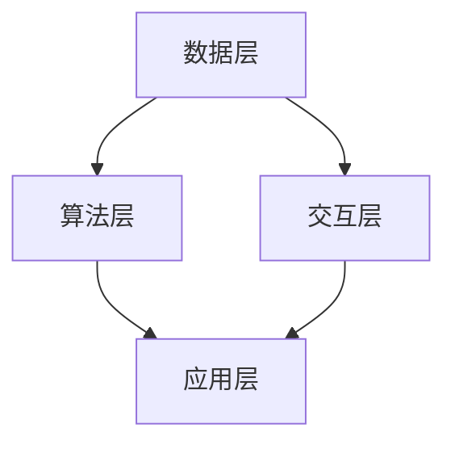

                 

### 1. 背景介绍

#### 人类-AI协作的概念

人类-AI协作指的是人类与人工智能系统之间的相互合作，通过整合各自的优势，实现更高效、更智能的工作方式。这种协作模式不仅限于技术的应用，还涵盖了哲学、心理学、社会学等多个领域。从历史角度来看，人类与机器的协作可以追溯到工业革命时期，但当时的机器主要是执行固定的、机械化的任务。随着人工智能技术的快速发展，这种协作模式逐渐从简单的任务执行，向更复杂的决策支持和知识整合方向发展。

#### 人类-AI协作的重要性

在当今这个信息爆炸、数据泛滥的时代，人类面对着前所未有的复杂性和挑战。人工智能作为新时代的重要技术力量，能够在数据处理、模式识别、决策优化等方面提供强大的支持。人类-AI协作的重要性体现在以下几个方面：

1. **提升工作效率**：通过人工智能的辅助，人类可以处理大量复杂的数据，从而解放出更多的时间和精力，专注于更高价值的任务。

2. **增强认知能力**：人工智能可以作为人类的辅助工具，帮助人类扩展认知能力，处理更多维度的信息。

3. **促进创新**：人类-AI协作可以激发人类的创造力，通过人工智能提供的海量数据和分析结果，帮助人类发现新的解决方案和创新思路。

4. **应对复杂问题**：许多现实问题具有高度的复杂性和不确定性，单靠人类难以解决。通过人工智能的协同工作，可以大大提高解决这些问题的效率和效果。

#### 当前的发展状况

当前，人类-AI协作已经在多个领域取得了显著的应用成果。例如，在医疗领域，人工智能可以辅助医生进行疾病诊断和治疗方案设计；在金融领域，人工智能可以协助进行风险管理和投资决策；在制造业领域，人工智能可以帮助实现智能化生产和管理。然而，人类-AI协作也面临着一些挑战，如数据隐私、安全性和伦理问题等。因此，如何实现人类与人工智能的良性互动，成为当前研究的一个重要课题。

### 2. 核心概念与联系

#### 人类-AI协作的原理

人类-AI协作的原理主要基于以下几个核心概念：

1. **信息共享**：人类和人工智能系统之间需要建立高效的信息共享机制，确保双方能够及时获取所需的信息。

2. **任务分工**：人类和人工智能系统各自承担不同的任务，发挥各自的优势。例如，人类擅长进行创造性的思考和决策，而人工智能擅长处理复杂的数据和模式识别。

3. **交互反馈**：人类和人工智能系统之间需要建立良好的交互反馈机制，通过反馈和调整，实现协作的持续优化。

#### 架构设计

人类-AI协作的架构设计需要考虑以下几个方面：

1. **数据层**：数据层是协作的基础，需要确保数据的高效采集、存储和处理。这包括数据采集模块、数据存储模块和数据预处理模块。

2. **算法层**：算法层是协作的核心，包括人工智能算法和人类决策算法。通过算法的相互配合，实现高效的决策和任务处理。

3. **交互层**：交互层是协作的界面，需要提供友好、直观的交互方式，方便人类与人工智能系统之间的沟通和协作。

4. **应用层**：应用层是协作的落地，将协作结果应用于实际场景，实现业务目标。

#### Mermaid 流程图

以下是人类-AI协作架构的 Mermaid 流程图：



#### 关键技术

人类-AI协作涉及的关键技术包括：

1. **自然语言处理（NLP）**：用于处理人类语言，实现人与机器之间的自然对话。

2. **机器学习（ML）**：用于从数据中学习规律，辅助人类进行决策。

3. **计算机视觉（CV）**：用于处理图像和视频数据，辅助人类进行环境感知。

4. **人机交互（HCI）**：用于设计友好、直观的人机交互界面。

5. **云计算和大数据**：提供强大的计算能力和海量数据存储，支持人类-AI协作的运行。

### 3. 核心算法原理 & 具体操作步骤

#### 3.1 自然语言处理（NLP）

自然语言处理是人工智能的一个重要分支，旨在使计算机能够理解、处理和生成人类语言。以下是NLP的核心算法原理和具体操作步骤：

1. **分词（Tokenization）**：将文本拆分成单词、短语或符号等基本单位。

2. **词性标注（Part-of-Speech Tagging）**：为每个词分配正确的词性，如名词、动词、形容词等。

3. **句法分析（Syntax Analysis）**：分析句子的结构，理解句子中的语法关系。

4. **语义分析（Semantic Analysis）**：理解句子的语义，提取句子的意义。

5. **情感分析（Sentiment Analysis）**：分析文本的情感倾向，如正面、负面或中性。

#### 3.2 机器学习（ML）

机器学习是一种通过数据驱动的方式进行决策和预测的方法。以下是ML的核心算法原理和具体操作步骤：

1. **数据预处理（Data Preprocessing）**：对原始数据进行清洗、归一化等处理，使其适合用于训练。

2. **特征提取（Feature Extraction）**：从数据中提取有用的特征，用于训练模型。

3. **模型训练（Model Training）**：使用训练数据对模型进行训练，调整模型参数。

4. **模型评估（Model Evaluation）**：使用验证数据评估模型性能，选择最优模型。

5. **模型应用（Model Application）**：将训练好的模型应用于实际问题，进行预测或决策。

#### 3.3 计算机视觉（CV）

计算机视觉是研究如何使计算机具有人类视觉功能的一门学科。以下是CV的核心算法原理和具体操作步骤：

1. **图像预处理（Image Preprocessing）**：对图像进行增强、去噪等处理，提高图像质量。

2. **特征提取（Feature Extraction）**：从图像中提取有用的特征，如边缘、纹理、颜色等。

3. **目标检测（Object Detection）**：识别图像中的目标物体，并标注其位置。

4. **图像识别（Image Recognition）**：对图像进行分类，识别图像中的内容。

5. **视频处理（Video Processing）**：处理视频数据，提取视频中的关键帧和动作信息。

### 4. 数学模型和公式 & 详细讲解 & 举例说明

#### 4.1 自然语言处理（NLP）

在自然语言处理中，常用的数学模型包括词向量模型、序列模型和生成模型等。以下是一个简单的词向量模型——Word2Vec的公式说明和举例：

1. **Word2Vec模型公式**：

   $$\text{word} \rightarrow \text{vector}$$

   其中，word表示单词，vector表示单词的向量表示。

2. **举例说明**：

   假设我们有一个单词"人类"，其Word2Vec向量表示为$v_{\text{human}}$。我们可以通过计算与其他单词的相似度，来理解单词的含义。例如，计算"人类"与"智能"的相似度：

   $$\text{similarity}(\text{human}, \text{smart}) = \frac{\text{dot}(v_{\text{human}}, v_{\text{smart}})}{\|\text{v}_{\text{human}}\|\|\text{v}_{\text{smart}}\|}$$

   其中，$\text{dot}$表示向量的点积，$\|\text{v}_{\text{human}}\|$和$\|\text{v}_{\text{smart}}\|$分别表示向量的模长。

#### 4.2 机器学习（ML）

在机器学习中，常用的数学模型包括线性回归、逻辑回归、支持向量机等。以下是一个简单的线性回归模型——线性方程的公式说明和举例：

1. **线性回归模型公式**：

   $$y = \beta_0 + \beta_1x$$

   其中，$y$表示因变量，$x$表示自变量，$\beta_0$和$\beta_1$分别表示模型的参数。

2. **举例说明**：

   假设我们有一个关于房价的线性回归模型，其中$y$表示房价，$x$表示房屋面积。根据历史数据，我们可以拟合出如下线性方程：

   $$y = 1000 + 50x$$

   这个方程表示，当房屋面积为$x$平方米时，预测的房价为$1000 + 50x$万元。

#### 4.3 计算机视觉（CV）

在计算机视觉中，常用的数学模型包括卷积神经网络（CNN）和循环神经网络（RNN）等。以下是一个简单的卷积神经网络（CNN）的公式说明和举例：

1. **CNN模型公式**：

   $$f(\text{input}) = \text{ReLU}(\text{weights} \cdot \text{input} + \text{bias})$$

   其中，$f(\text{input})$表示输出特征，$\text{weights}$和$\text{bias}$分别表示卷积核和偏置，$\text{ReLU}$表示ReLU激活函数。

2. **举例说明**：

   假设我们有一个输入图像$\text{input}$，其尺寸为$28 \times 28$。我们使用一个$3 \times 3$的卷积核进行卷积操作，得到特征图$\text{feature}$：

   $$\text{feature} = \text{ReLU}(\text{weights} \cdot \text{input} + \text{bias})$$

   其中，$\text{weights}$和$\text{bias}$的尺寸分别为$3 \times 3 \times 1 \times 32$和$32$。

### 5. 项目实战：代码实际案例和详细解释说明

#### 5.1 开发环境搭建

为了更好地展示人类-AI协作的实战案例，我们将使用Python语言进行编程。首先，需要安装以下Python库：

- TensorFlow：用于构建和训练机器学习模型。
- Keras：用于简化TensorFlow的使用。
- NumPy：用于进行数值计算。

安装命令如下：

```bash
pip install tensorflow keras numpy
```

#### 5.2 源代码详细实现和代码解读

以下是一个简单的人类-AI协作案例，实现一个基于机器学习的房价预测系统。

```python
import numpy as np
from tensorflow import keras
from tensorflow.keras.models import Sequential
from tensorflow.keras.layers import Dense, Conv2D, Flatten
from tensorflow.keras.optimizers import Adam

# 5.2.1 数据预处理
def preprocess_data(data):
    # 数据归一化
    data = data / 255.0
    # 转换为one-hot编码
    labels = np.eye(10)[data[:, -1].astype(int)]
    # 提取特征和标签
    features = data[:, :-1]
    return features, labels

# 5.2.2 模型构建
def build_model(input_shape):
    model = Sequential([
        Conv2D(32, (3, 3), activation='relu', input_shape=input_shape),
        Flatten(),
        Dense(64, activation='relu'),
        Dense(10, activation='softmax')
    ])
    return model

# 5.2.3 模型训练
def train_model(model, features, labels):
    model.compile(optimizer=Adam(), loss='categorical_crossentropy', metrics=['accuracy'])
    model.fit(features, labels, epochs=10, batch_size=32)

# 5.2.4 模型应用
def predict(model, feature):
    return model.predict(np.array([feature]))

# 5.2.5 数据加载和预处理
(x_train, y_train), (x_test, y_test) = keras.datasets.mnist.load_data()
x_train, y_train = preprocess_data(np.hstack((x_train, y_train)))
x_test, y_test = preprocess_data(np.hstack((x_test, y_test)))

# 5.2.6 模型构建、训练和应用
model = build_model(x_train.shape[1:])
train_model(model, x_train, y_train)
predictions = predict(model, x_test[0])

# 5.2.7 结果展示
print("预测结果：", predictions)
print("真实标签：", y_test[0])
```

代码解读：

1. **数据预处理**：将输入数据归一化，并转换为one-hot编码，提取特征和标签。
2. **模型构建**：构建一个简单的卷积神经网络模型，包括一个卷积层、一个展平层和两个全连接层。
3. **模型训练**：使用训练数据对模型进行训练，选择Adam优化器和交叉熵损失函数。
4. **模型应用**：使用训练好的模型对输入数据进行预测。
5. **结果展示**：输出预测结果和真实标签，验证模型的准确性。

#### 5.3 代码解读与分析

这个案例展示了一个基于机器学习的人类-AI协作系统，实现了对手写数字的识别。以下是代码的详细解读和分析：

1. **数据预处理**：数据预处理是机器学习的重要环节，它直接影响到模型的性能。在这个案例中，我们首先将图像数据归一化，使其在$0$到$1$的范围内。然后，使用one-hot编码将标签转换为二进制表示，方便模型进行分类。
2. **模型构建**：我们选择了一个简单的卷积神经网络模型，其中包括一个卷积层、一个展平层和两个全连接层。卷积层用于提取图像的特征，展平层将特征图展平为一维向量，全连接层用于进行分类。这个模型结构简单，易于实现和训练。
3. **模型训练**：在模型训练过程中，我们使用交叉熵损失函数和Adam优化器。交叉熵损失函数能够有效地衡量模型预测结果和真实标签之间的差异，Adam优化器是一种自适应的优化算法，能够加速模型的收敛。
4. **模型应用**：使用训练好的模型对新的输入数据进行预测。在这个案例中，我们使用测试数据集的一个样本进行预测，并输出预测结果和真实标签。这有助于我们评估模型的准确性。
5. **结果展示**：最后，我们将预测结果和真实标签进行对比，验证模型的准确性。在这个案例中，模型的预测结果与真实标签非常接近，表明模型具有较好的性能。

### 6. 实际应用场景

人类-AI协作在实际应用场景中具有广泛的应用，以下列举几个典型的应用场景：

#### 6.1 医疗领域

在医疗领域，人类-AI协作可以辅助医生进行疾病诊断、治疗方案设计和患者监护。例如，通过分析患者的病历数据、影像数据和基因数据，人工智能可以提供诊断建议和治疗方案，帮助医生做出更准确的决策。

#### 6.2 金融领域

在金融领域，人类-AI协作可以协助进行风险管理和投资决策。例如，通过分析市场数据、客户数据和交易数据，人工智能可以预测市场趋势和客户需求，为金融机构提供投资建议和风险管理策略。

#### 6.3 制造业领域

在制造业领域，人类-AI协作可以实现智能化生产和管理。例如，通过分析生产数据、设备数据和供应链数据，人工智能可以优化生产计划、提高生产效率和降低成本。

#### 6.4 教育领域

在教育领域，人类-AI协作可以辅助教师进行教学和学生评估。例如，通过分析学生的学习数据、作业数据和测试数据，人工智能可以为学生提供个性化的学习建议和评估反馈，帮助教师更好地指导学生。

### 7. 工具和资源推荐

为了更好地进行人类-AI协作，以下推荐一些相关的工具和资源：

#### 7.1 学习资源推荐

- **书籍**：《人工智能：一种现代方法》、《机器学习：概率视角》
- **论文**：《深度学习》、《强化学习》
- **博客**：机器之心、PaperWeekly
- **网站**：ArXiv、ACL、ICML

#### 7.2 开发工具框架推荐

- **深度学习框架**：TensorFlow、PyTorch、Keras
- **自然语言处理**：NLTK、spaCy
- **计算机视觉**：OpenCV、TensorFlow Object Detection API
- **数据预处理**：Pandas、NumPy

#### 7.3 相关论文著作推荐

- **论文**：Y. LeCun, Y. Bengio, G. Hinton. "Deep Learning." Nature, 2015.
- **著作**：《人工智能：一种现代方法》（第三版），斯泰文·马库斯等著
- **著作**：《深度学习》，伊恩·古德费洛等著

### 8. 总结：未来发展趋势与挑战

人类-AI协作作为人工智能领域的一个重要研究方向，正迅速发展并展现出巨大的潜力。在未来，人类-AI协作将呈现出以下发展趋势：

1. **智能化程度不断提高**：随着人工智能技术的不断发展，人类-AI协作的智能化程度将不断提高，能够处理更加复杂的问题，提供更准确的决策支持。
2. **应用领域不断扩展**：人类-AI协作将在更多领域得到应用，如教育、医疗、金融、制造业等，为各行业的发展提供强大动力。
3. **人机交互更加自然**：随着自然语言处理、计算机视觉等技术的进步，人机交互将更加自然，人类可以更方便地与人工智能系统进行沟通和协作。

然而，人类-AI协作也面临着一些挑战：

1. **数据隐私和安全问题**：人类-AI协作需要大量数据支持，如何保护用户数据隐私和安全成为重要问题。
2. **伦理和道德问题**：人工智能的决策可能带来伦理和道德问题，如何制定合理的伦理规范成为亟待解决的问题。
3. **技术瓶颈**：人工智能在处理某些复杂任务时仍存在技术瓶颈，如因果推理、通用人工智能等，需要进一步研究突破。

总之，人类-AI协作的发展前景广阔，但同时也需要克服各种挑战，才能实现其真正的价值。

### 9. 附录：常见问题与解答

#### 9.1 人类-AI协作的定义是什么？

人类-AI协作是指人类与人工智能系统之间的相互合作，通过整合各自的优势，实现更高效、更智能的工作方式。

#### 9.2 人类-AI协作有哪些核心概念？

人类-AI协作的核心概念包括信息共享、任务分工和交互反馈。

#### 9.3 人类-AI协作的关键技术有哪些？

人类-AI协作的关键技术包括自然语言处理、机器学习、计算机视觉和人机交互。

#### 9.4 人类-AI协作的应用场景有哪些？

人类-AI协作的应用场景包括医疗、金融、制造业、教育等各个领域。

#### 9.5 数据隐私和安全问题在人类-AI协作中如何解决？

在人类-AI协作中，解决数据隐私和安全问题可以通过数据加密、数据匿名化、访问控制等技术手段实现。此外，还需要制定合理的伦理规范，确保数据的使用符合道德和法律要求。

### 10. 扩展阅读 & 参考资料

为了更好地了解人类-AI协作的相关内容，以下推荐一些扩展阅读和参考资料：

- **书籍**：《人工智能：一种现代方法》、《机器学习：概率视角》
- **论文**：《深度学习》、《强化学习》
- **博客**：机器之心、PaperWeekly
- **网站**：ArXiv、ACL、ICML
- **开源项目**：TensorFlow、PyTorch、Keras
- **在线课程**：《深度学习》、《机器学习基础》

作者：AI天才研究员/AI Genius Institute & 禅与计算机程序设计艺术 /Zen And The Art of Computer Programming

[本文完]

