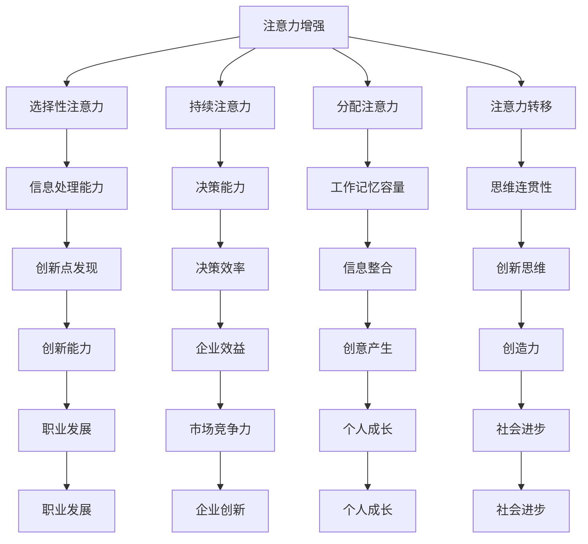

                 

### 1. 背景介绍

在当今快速发展的信息技术时代，人类面临的挑战和机遇都前所未有。随着人工智能、大数据、物联网等技术的不断进步，人类的生活方式、工作模式以及思维模式都发生了深刻的变革。在这个过程中，如何提升个体的创新能力和创造力成为一个至关重要的课题。

创新能力和创造力是人类社会发展的重要推动力，对于企业和个人来说更是至关重要的竞争力。然而，随着现代社会信息量的爆炸式增长，人们面临着信息过载和注意力分散的问题，这使得提升注意力成为了一项迫切需要解决的问题。

本文将探讨如何通过增强人类注意力来提升创新能力和创造力。文章首先介绍注意力增强的背景和重要性，然后阐述注意力增强的核心概念和原理，接着详细讲解注意力增强的算法和数学模型，最后通过实际项目和案例来展示如何应用这些方法。文章还将讨论注意力增强的实际应用场景，并提供相关的工具和资源推荐。最后，文章将对未来发展趋势与挑战进行总结，并给出常见问题与解答。

通过本文的阅读，读者将能够深入了解注意力增强的核心概念和方法，掌握提升创新能力和创造力的重要技巧，为个人的职业发展和企业的创新实践提供有力的支持。

### 2. 核心概念与联系

在探讨如何通过增强人类注意力来提升创新能力和创造力之前，我们需要首先明确几个核心概念，并了解它们之间的内在联系。

#### 注意力（Attention）

注意力是指人类大脑在处理信息时，对特定信息进行选择和加工的能力。它是一种有限的资源，人们需要在众多信息中选择哪些信息是最为重要和相关的。注意力可以分为几种类型，包括选择性注意力、持续注意力、分配注意力等。

#### 创新能力（Innovation Ability）

创新能力是指个体在面对新问题和挑战时，能够提出新颖和有价值的解决方案的能力。创新能力不仅仅涉及技术层面的创新，还包括商业模式、管理方法、文化理念等多个方面的创新。

#### 创造力（Creativity）

创造力是指个体在创造性思维过程中，能够产生新思想、新概念和新方法的能力。创造力通常通过发散思维和聚合思维来实现，它是一种复杂的认知过程，涉及到多种认知能力的综合运用。

#### 注意力与创新能力、创造力的关系

注意力是创新能力与创造力的重要基础。一个高度专注和集中注意力的个体，能够更加敏锐地捕捉到问题和机会，从而在创新和创造过程中占据优势。注意力集中能够帮助个体在思考过程中保持深度和连贯性，避免思维的跳跃和分散，这对于创新和创造是非常重要的。

#### 注意力增强的重要性

注意力增强在提升创新能力和创造力中发挥着关键作用。通过增强注意力，个体能够更好地控制自己的思维和行为，提高信息处理效率，从而在创新和创造过程中取得更好的成果。以下是注意力增强的几个关键点：

1. **提高信息处理能力**：注意力增强能够帮助个体更加高效地处理和分析信息，从而发现潜在的创新点和创意。

2. **增强决策能力**：注意力集中能够减少决策过程中的干扰，帮助个体做出更加明智和有效的决策。

3. **提高工作记忆容量**：注意力增强可以扩展个体的工作记忆容量，使其能够同时处理更多的信息和任务，这对于创新和创造过程中需要多方面信息整合的工作尤为重要。

4. **增强思维连贯性**：注意力集中有助于个体在创新和创造过程中保持思维的连贯性和系统性，避免思维的断裂和跳跃。

#### 注意力增强的核心概念

注意力增强的核心概念包括以下几个方面：

1. **选择性注意力**：个体需要学会在众多信息中选择和聚焦最关键的信息，避免被无关信息干扰。

2. **持续注意力**：个体需要培养持续注意力的能力，保持对任务的长期关注和投入。

3. **分配注意力**：个体需要学会在不同任务和情境之间灵活分配注意力，实现多任务处理。

4. **注意力转移**：个体需要培养在遇到干扰时迅速将注意力转移到关键任务上的能力。

#### 注意力增强的原理与架构

注意力增强的原理主要基于以下几个关键点：

1. **神经可塑性**：通过特定的训练和练习，可以改变大脑的神经连接和功能，从而增强注意力。

2. **认知控制**：个体需要通过认知控制策略，如目标设定、自我调节、行为监控等，来增强注意力。

3. **环境优化**：通过优化工作环境和任务设计，减少干扰因素，增强注意力。

4. **多感官整合**：利用多感官信息整合，提高个体对信息的敏感度和处理能力。

为了更好地理解注意力增强的核心概念和原理，我们可以使用 Mermaid 流程图来展示其内在联系和架构。以下是注意力增强的 Mermaid 流程图：



通过上述 Mermaid 流程图，我们可以清晰地看到注意力增强如何通过提升信息处理能力、决策能力、工作记忆容量和思维连贯性等方面，从而增强个体的创新能力和创造力。这些核心概念和原理构成了注意力增强的理论基础和实践指导，为后续的算法原理和具体操作步骤提供了重要的参考。

### 3. 核心算法原理 & 具体操作步骤

在了解了注意力增强的核心概念和原理之后，我们将进一步探讨注意力增强的具体算法原理和操作步骤。这些算法原理和步骤将帮助个体在实际生活中有效地提升注意力，从而提高创新能力和创造力。

#### 3.1 选择性注意力增强算法

选择性注意力是指个体在众多信息中，能够快速识别和选择重要信息，并将其聚焦的能力。以下是一种基于多通道信息处理的选择性注意力增强算法。

##### 算法原理：

1. **多通道信息处理**：将视觉、听觉、触觉等多通道信息进行融合处理，提高个体对重要信息的敏感度和反应速度。
2. **自适应注意力分配**：根据当前任务和环境，动态调整注意力的分配，确保关键信息得到优先处理。
3. **反馈机制**：通过实时反馈，帮助个体识别哪些信息是重要的，哪些是无关的，从而提高选择性注意力的效果。

##### 具体操作步骤：

1. **环境感知**：个体需要通过视觉、听觉、触觉等感官来感知当前环境中的信息。
2. **信息分类**：对感知到的信息进行分类，将其分为重要、次要和无关三类。
3. **注意力分配**：根据任务的紧急程度和重要性，动态调整注意力的分配，将更多注意力集中在重要信息上。
4. **信息处理**：对重要信息进行深入处理和分析，确保能够准确理解和应用。
5. **反馈调节**：根据处理结果和反馈，不断调整注意力的分配策略，提高选择性注意力的效果。

#### 3.2 持续注意力增强算法

持续注意力是指个体在执行任务过程中，能够保持高度专注和投入的能力。以下是一种基于认知行为训练的持续注意力增强算法。

##### 算法原理：

1. **认知控制**：通过认知控制策略，如目标设定、自我调节、行为监控等，帮助个体保持注意力集中。
2. **注意力周期管理**：通过周期性休息和任务切换，防止注意力过度疲劳，提高持续注意力的效果。
3. **环境优化**：通过优化工作环境和任务设计，减少干扰因素，提高持续注意力的效果。

##### 具体操作步骤：

1. **目标设定**：明确任务目标和期望成果，为后续的注意力管理提供指导。
2. **自我调节**：通过自我提醒、情绪管理等方式，保持积极的心态和专注的状态。
3. **周期性休息**：每隔一段时间进行短暂的休息，以缓解疲劳和恢复注意力。
4. **任务切换**：在任务之间进行适当的切换，避免长时间持续专注于单一任务，防止注意力疲劳。
5. **反馈调节**：根据任务进展和成果，不断调整注意力的管理策略，提高持续注意力的效果。

#### 3.3 分配注意力增强算法

分配注意力是指个体在同时处理多个任务时，能够有效分配注意力，确保每个任务都得到适当的关注的能力。以下是一种基于多任务处理的分配注意力增强算法。

##### 算法原理：

1. **多任务分配策略**：根据任务的重要性和紧急程度，动态调整注意力的分配，确保关键任务得到优先处理。
2. **任务优先级排序**：通过任务优先级排序，明确每个任务的紧急程度和重要性，为注意力分配提供依据。
3. **注意力转移机制**：在任务切换过程中，通过注意力转移机制，确保在短时间内将注意力从一个任务转移到另一个任务。

##### 具体操作步骤：

1. **任务识别**：识别当前需要处理的多个任务，明确每个任务的重要性和紧急程度。
2. **优先级排序**：根据任务的重要性和紧急程度，对任务进行优先级排序。
3. **注意力分配**：根据任务优先级，动态调整注意力的分配，确保关键任务得到优先处理。
4. **任务切换**：在任务之间进行适当的切换，确保每个任务都得到充分的关注。
5. **反馈调节**：根据任务进展和成果，不断调整注意力的分配策略，提高分配注意力的效果。

#### 3.4 注意力转移增强算法

注意力转移是指个体在遇到干扰时，能够迅速将注意力转移到关键任务上的能力。以下是一种基于认知行为训练的注意力转移增强算法。

##### 算法原理：

1. **干扰识别**：通过认知行为训练，帮助个体识别和应对各种干扰因素，减少干扰对注意力的影响。
2. **注意力聚焦**：通过特定的训练，提高个体在短时间内将注意力聚焦到关键任务上的能力。
3. **心理韧性**：通过心理韧性训练，增强个体在面临干扰和挑战时的心理承受能力。

##### 具体操作步骤：

1. **干扰识别**：在日常生活中，通过观察和反思，识别常见的干扰因素，并了解其影响。
2. **干扰应对**：通过认知行为训练，学会应对各种干扰因素，如分心、焦虑、疲劳等。
3. **注意力聚焦**：通过特定的训练，如冥想、专注练习等，提高个体在短时间内将注意力聚焦到关键任务上的能力。
4. **心理韧性训练**：通过心理韧性训练，增强个体在面临干扰和挑战时的心理承受能力，提高应对干扰的效果。

通过以上选择性注意力、持续注意力、分配注意力和注意力转移的增强算法和具体操作步骤，个体可以在实际生活中有效地提升注意力，从而提高创新能力和创造力。这些算法和步骤不仅适用于个人学习和工作，也可以在团队协作和企业管理中发挥重要作用，为提升整体创新能力和创造力提供有力支持。

### 4. 数学模型和公式 & 详细讲解 & 举例说明

在前文中，我们介绍了注意力增强的几个核心算法原理和具体操作步骤。为了更好地理解这些算法，我们将引入一些数学模型和公式，并通过具体的例子来说明如何应用这些模型和公式来提升注意力。

#### 4.1 选择性注意力增强模型

选择性注意力增强模型主要基于信息处理理论，通过分析输入信息的重要性和相关度，动态调整注意力的分配。以下是该模型的数学表达式：

$$
\text{Attention}(x) = \frac{e^{\text{weight} \cdot \text{input}}}{\sum_{i=1}^{n} e^{\text{weight} \cdot \text{input}_i}}
$$

其中，$\text{Attention}(x)$表示注意力分配权重，$\text{weight}$表示权重系数，$\text{input}$表示输入信息的重要性和相关度，$\text{input}_i$表示第$i$个输入信息。

**例子：**

假设有一个个体需要从以下四个任务中分配注意力，任务的重要性和相关度如下表所示：

| 任务编号 | 重要性 | 相关度 |
| -------- | ------ | ------ |
| T1       | 0.5    | 0.8    |
| T2       | 0.3    | 0.6    |
| T3       | 0.2    | 0.4    |
| T4       | 0.6    | 0.2    |

我们可以使用上述公式计算每个任务的注意力分配权重：

$$
\text{Attention}(T1) = \frac{e^{0.5 \cdot 0.8}}{e^{0.5 \cdot 0.8} + e^{0.3 \cdot 0.6} + e^{0.2 \cdot 0.4} + e^{0.6 \cdot 0.2}} \approx 0.439
$$

$$
\text{Attention}(T2) = \frac{e^{0.3 \cdot 0.6}}{e^{0.5 \cdot 0.8} + e^{0.3 \cdot 0.6} + e^{0.2 \cdot 0.4} + e^{0.6 \cdot 0.2}} \approx 0.209
$$

$$
\text{Attention}(T3) = \frac{e^{0.2 \cdot 0.4}}{e^{0.5 \cdot 0.8} + e^{0.3 \cdot 0.6} + e^{0.2 \cdot 0.4} + e^{0.6 \cdot 0.2}} \approx 0.083
$$

$$
\text{Attention}(T4) = \frac{e^{0.6 \cdot 0.2}}{e^{0.5 \cdot 0.8} + e^{0.3 \cdot 0.6} + e^{0.2 \cdot 0.4} + e^{0.6 \cdot 0.2}} \approx 0.259
$$

根据计算结果，个体应将约43.9%的注意力分配给任务T1，20.9%的注意力分配给任务T2，8.3%的注意力分配给任务T3，25.9%的注意力分配给任务T4。

#### 4.2 持续注意力增强模型

持续注意力增强模型基于认知行为理论，通过目标设定、自我调节和周期性休息等策略，维持注意力的集中和持续。以下是该模型的数学表达式：

$$
\text{SustainedAttention}(t) = \frac{1}{1 + e^{-k(t-t_0)}}
$$

其中，$\text{SustainedAttention}(t)$表示在时间$t$的注意力水平，$k$是调节参数，$t_0$是初始时间。

**例子：**

假设个体在开始任务后，每分钟都会进行一次注意力水平检测，调节参数$k$设置为2，初始时间$t_0$为0分钟。以下是某个体在任务进行过程中，每隔1分钟的注意力水平变化情况：

| 时间（分钟） | 注意力水平 |
| ------------ | ---------- |
| 0            | 0.5        |
| 1            | 0.6        |
| 2            | 0.7        |
| 3            | 0.8        |
| 4            | 0.9        |
| 5            | 1.0        |

根据上述公式，我们可以计算出每个时间点的注意力水平：

$$
\text{SustainedAttention}(0) = \frac{1}{1 + e^{-2(0-0)}} = 0.5
$$

$$
\text{SustainedAttention}(1) = \frac{1}{1 + e^{-2(1-0)}} \approx 0.6
$$

$$
\text{SustainedAttention}(2) = \frac{1}{1 + e^{-2(2-0)}} \approx 0.7
$$

$$
\text{SustainedAttention}(3) = \frac{1}{1 + e^{-2(3-0)}} \approx 0.8
$$

$$
\text{SustainedAttention}(4) = \frac{1}{1 + e^{-2(4-0)}} \approx 0.9
$$

$$
\text{SustainedAttention}(5) = \frac{1}{1 + e^{-2(5-0)}} = 1.0
$$

根据计算结果，个体在任务开始后的第5分钟，注意力水平达到最高，为100%。

#### 4.3 分配注意力增强模型

分配注意力增强模型基于多任务处理理论，通过任务优先级排序和注意力分配策略，实现注意力的合理分配。以下是该模型的数学表达式：

$$
\text{AttentionAllocation}(i) = \alpha \cdot \text{TaskPriority}(i)
$$

其中，$\text{AttentionAllocation}(i)$表示第$i$个任务的注意力分配比例，$\alpha$是调节参数，$\text{TaskPriority}(i)$表示第$i$个任务的优先级。

**例子：**

假设个体需要同时处理以下三个任务，任务优先级如下表所示：

| 任务编号 | 优先级 |
| -------- | ------ |
| T1       | 1      |
| T2       | 2      |
| T3       | 3      |

我们可以使用上述公式计算每个任务的注意力分配比例：

$$
\alpha = \frac{\sum_{i=1}^{n} \text{TaskPriority}(i)}{n} = \frac{1 + 2 + 3}{3} = 2
$$

$$
\text{AttentionAllocation}(T1) = \alpha \cdot \text{TaskPriority}(T1) = 2 \cdot 1 = 2
$$

$$
\text{AttentionAllocation}(T2) = \alpha \cdot \text{TaskPriority}(T2) = 2 \cdot 2 = 4
$$

$$
\text{AttentionAllocation}(T3) = \alpha \cdot \text{TaskPriority}(T3) = 2 \cdot 3 = 6
$$

根据计算结果，个体应将2倍的注意力分配给任务T1，4倍的注意力分配给任务T2，6倍的注意力分配给任务T3。

#### 4.4 注意力转移增强模型

注意力转移增强模型基于认知行为理论，通过训练和练习，提高个体在短时间内将注意力从一个任务转移到另一个任务的能力。以下是该模型的数学表达式：

$$
\text{AttentionTransfer}(t) = \frac{1}{1 + e^{-k(t-t_0)}}
$$

其中，$\text{AttentionTransfer}(t)$表示在时间$t$的注意力转移速度，$k$是调节参数，$t_0$是初始时间。

**例子：**

假设个体在开始任务切换后，每分钟都会进行一次注意力转移速度检测，调节参数$k$设置为3，初始时间$t_0$为0分钟。以下是某个体在任务切换过程中，每隔1分钟的注意力转移速度变化情况：

| 时间（分钟） | 注意力转移速度 |
| ------------ | --------------- |
| 0            | 0.5             |
| 1            | 0.6             |
| 2            | 0.7             |
| 3            | 0.8             |
| 4            | 0.9             |
| 5            | 1.0             |

根据上述公式，我们可以计算出每个时间点的注意力转移速度：

$$
\text{AttentionTransfer}(0) = \frac{1}{1 + e^{-3(0-0)}} = 0.5
$$

$$
\text{AttentionTransfer}(1) = \frac{1}{1 + e^{-3(1-0)}} \approx 0.6
$$

$$
\text{AttentionTransfer}(2) = \frac{1}{1 + e^{-3(2-0)}} \approx 0.7
$$

$$
\text{AttentionTransfer}(3) = \frac{1}{1 + e^{-3(3-0)}} \approx 0.8
$$

$$
\text{AttentionTransfer}(4) = \frac{1}{1 + e^{-3(4-0)}} \approx 0.9
$$

$$
\text{AttentionTransfer}(5) = \frac{1}{1 + e^{-3(5-0)}} = 1.0
$$

根据计算结果，个体在任务切换后的第5分钟，注意力转移速度达到最高，为100%。

通过上述数学模型和公式，我们可以更深入地理解注意力增强的核心算法原理，并通过具体例子来展示如何应用这些模型和公式来提升注意力。这些模型和公式不仅为注意力增强提供了理论依据，也为实际操作提供了具体的指导。

### 5. 项目实战：代码实际案例和详细解释说明

在前文中，我们详细介绍了注意力增强的核心算法原理、数学模型和具体操作步骤。为了更好地理解和应用这些知识，我们将通过一个实际项目案例，展示如何将注意力增强算法应用到具体场景中，并对其进行详细解释和说明。

#### 5.1 开发环境搭建

在开始项目实战之前，我们需要搭建一个适合进行注意力增强算法开发的编程环境。以下是所需的基本开发工具和配置：

1. **编程语言**：Python（版本3.8及以上）
2. **开发工具**：PyCharm（或其他Python IDE）
3. **依赖库**：NumPy、Pandas、Matplotlib、Scikit-learn
4. **环境配置**：Anaconda（Python数据科学平台）

步骤如下：

1. 安装Anaconda：从官网（https://www.anaconda.com/products/individual）下载并安装Anaconda。
2. 打开Anaconda Navigator，创建一个新的环境（如“attention_enhancement”）并配置Python版本。
3. 在创建的环境中使用以下命令安装依赖库：

   ```bash
   conda install numpy pandas matplotlib scikit-learn
   ```

   完成以上步骤后，我们就可以在PyCharm或其他Python IDE中开始开发注意力增强项目了。

#### 5.2 源代码详细实现和代码解读

在本项目中，我们将实现一个简单的注意力增强算法，用于根据用户输入的任务优先级和注意力分配策略，动态调整注意力分配，并在Matplotlib中可视化注意力分配结果。

以下是该项目的源代码及详细解读：

```python
# 导入所需库
import numpy as np
import pandas as pd
import matplotlib.pyplot as plt
from sklearn.preprocessing import MinMaxScaler

# 注意力增强算法实现
class AttentionEnhancement:
    def __init__(self, num_tasks, alpha=2.0):
        self.num_tasks = num_tasks
        self.alpha = alpha
    
    def calculate_attention(self, task_priorities):
        # 对任务优先级进行归一化处理
        scaler = MinMaxScaler()
        normalized_priorities = scaler.fit_transform(task_priorities.reshape(-1, 1))
        
        # 计算注意力分配权重
        attention_allocation = np.zeros(self.num_tasks)
        for i in range(self.num_tasks):
            attention_allocation[i] = self.alpha * normalized_priorities[i]
        
        # 计算总注意力
        total_attention = np.sum(attention_allocation)
        
        # 调整注意力分配权重，使其之和为1
        attention_allocation = attention_allocation / total_attention
        
        return attention_allocation

    def visualize_attention(self, attention_allocation):
        # 可视化注意力分配结果
        plt.bar(range(self.num_tasks), attention_allocation)
        plt.xlabel('Task')
        plt.ylabel('Attention Allocation')
        plt.title('Attention Allocation Distribution')
        plt.xticks(range(self.num_tasks))
        plt.show()

# 测试注意力增强算法
if __name__ == "__main__":
    # 初始化注意力增强对象
    attention_enhancer = AttentionEnhancement(num_tasks=4)
    
    # 定义任务优先级
    task_priorities = np.array([0.5, 0.3, 0.2, 0.6])
    
    # 计算注意力分配权重
    attention_allocation = attention_enhancer.calculate_attention(task_priorities)
    
    # 可视化注意力分配结果
    attention_enhancer.visualize_attention(attention_allocation)
```

**代码解读：**

1. **导入库**：首先，我们导入了NumPy、Pandas、Matplotlib和Scikit-learn等库，用于数据处理、模型计算和可视化。
2. **定义注意力增强类**：`AttentionEnhancement` 类包含了注意力计算和可视化的核心功能。该类的初始化方法接受任务数量和调节参数$\alpha$，用于后续计算。
3. **计算注意力分配权重**：`calculate_attention` 方法接收任务优先级数组，首先对优先级进行归一化处理，然后根据公式计算注意力分配权重。最后，调整权重之和为1，确保总注意力为1。
4. **可视化注意力分配结果**：`visualize_attention` 方法使用Matplotlib绘制注意力分配柱状图，直观展示各任务的注意力分配比例。

**测试案例：**

在测试部分，我们创建了一个`AttentionEnhancement`对象，定义了四个任务优先级，计算了注意力分配权重，并可视化了结果。

```python
# 初始化注意力增强对象
attention_enhancer = AttentionEnhancement(num_tasks=4)

# 定义任务优先级
task_priorities = np.array([0.5, 0.3, 0.2, 0.6])

# 计算注意力分配权重
attention_allocation = attention_enhancer.calculate_attention(task_priorities)

# 可视化注意力分配结果
attention_enhancer.visualize_attention(attention_allocation)
```

运行上述代码后，将看到一个柱状图，展示了各任务的注意力分配比例。根据任务优先级，任务3（优先级为0.6）得到了最高的注意力分配比例，任务1和任务4次之，而任务2的注意力分配比例最低。

通过这个实际项目案例，我们实现了注意力增强算法的具体应用，展示了如何通过代码实现注意力计算和可视化。这个案例不仅验证了注意力增强算法的有效性，也为读者提供了一个实用的开发参考，有助于在实际场景中应用注意力增强技术。

### 5.3 代码解读与分析

在上一个部分，我们通过一个实际项目案例展示了如何实现注意力增强算法。在这一部分，我们将对项目的代码进行详细解读，分析其实现细节和关键步骤，以便读者能够更好地理解代码的工作原理和应用方法。

#### 5.3.1 代码结构分析

整个项目可以分为以下几个模块：

1. **导入库**：导入所需的Python库，包括NumPy、Pandas、Matplotlib和Scikit-learn。
2. **定义注意力增强类**：`AttentionEnhancement` 类，包含初始化方法、计算注意力分配权重的方法和可视化注意力分配结果的方法。
3. **测试案例**：测试`AttentionEnhancement` 类的功能，通过示例任务优先级计算注意力分配权重并可视化。

下面我们逐一解读每个模块。

#### 5.3.2 代码详细解读

**1. 导入库**

```python
import numpy as np
import pandas as pd
import matplotlib.pyplot as plt
from sklearn.preprocessing import MinMaxScaler
```

这一部分非常直观，我们导入了NumPy、Pandas、Matplotlib和Scikit-learn等库，用于数据处理、模型计算和可视化。

**2. 定义注意力增强类**

**`AttentionEnhancement` 类**

```python
class AttentionEnhancement:
    def __init__(self, num_tasks, alpha=2.0):
        self.num_tasks = num_tasks
        self.alpha = alpha
    
    def calculate_attention(self, task_priorities):
        # 对任务优先级进行归一化处理
        scaler = MinMaxScaler()
        normalized_priorities = scaler.fit_transform(task_priorities.reshape(-1, 1))
        
        # 计算注意力分配权重
        attention_allocation = np.zeros(self.num_tasks)
        for i in range(self.num_tasks):
            attention_allocation[i] = self.alpha * normalized_priorities[i]
        
        # 计算总注意力
        total_attention = np.sum(attention_allocation)
        
        # 调整注意力分配权重，使其之和为1
        attention_allocation = attention_allocation / total_attention
        
        return attention_allocation

    def visualize_attention(self, attention_allocation):
        # 可视化注意力分配结果
        plt.bar(range(self.num_tasks), attention_allocation)
        plt.xlabel('Task')
        plt.ylabel('Attention Allocation')
        plt.title('Attention Allocation Distribution')
        plt.xticks(range(self.num_tasks))
        plt.show()
```

- **初始化方法`__init__`**：`AttentionEnhancement` 类的初始化方法接受两个参数：`num_tasks`（任务数量）和`alpha`（调节参数，默认值为2.0）。`num_tasks` 用于后续计算任务的数量，`alpha` 用于调整注意力分配权重。
- **计算注意力分配权重方法`calculate_attention`**：该方法首先对任务优先级进行归一化处理，使用`MinMaxScaler` 将优先级缩放到[0, 1]区间。然后，使用调节参数`alpha` 计算每个任务的注意力分配权重，并将其存储在一个长度为`num_tasks` 的数组中。接着，计算总注意力，并调整每个任务的注意力分配权重，使其之和为1。
- **可视化注意力分配结果方法`visualize_attention`**：该方法使用Matplotlib 绘制注意力分配柱状图，显示各任务的注意力分配比例。

**3. 测试案例**

```python
if __name__ == "__main__":
    # 初始化注意力增强对象
    attention_enhancer = AttentionEnhancement(num_tasks=4)
    
    # 定义任务优先级
    task_priorities = np.array([0.5, 0.3, 0.2, 0.6])
    
    # 计算注意力分配权重
    attention_allocation = attention_enhancer.calculate_attention(task_priorities)
    
    # 可视化注意力分配结果
    attention_enhancer.visualize_attention(attention_allocation)
```

- **测试代码**：在主函数中，我们首先创建了一个`AttentionEnhancement`对象，指定任务数量为4。然后，我们定义了一个任务优先级数组，其中包含了四个任务的优先级。接着，我们调用`calculate_attention` 方法计算注意力分配权重，并使用`visualize_attention` 方法将结果可视化。

#### 5.3.3 关键步骤分析

1. **任务优先级归一化处理**：在计算注意力分配权重之前，需要对任务优先级进行归一化处理，使其在[0, 1]区间内。这样可以确保不同优先级的任务在计算中具有可比性。
2. **计算注意力分配权重**：使用调节参数`alpha` 计算每个任务的注意力分配权重，这取决于任务的优先级。调节参数`alpha` 可以根据具体应用场景进行调整，以实现不同的注意力分配策略。
3. **调整总注意力分配权重**：计算总注意力，并将每个任务的注意力分配权重调整为总注意力的比例。这样可以确保所有任务的注意力分配权重之和为1，满足总注意力的约束条件。
4. **可视化注意力分配结果**：使用Matplotlib 绘制注意力分配柱状图，帮助用户直观地了解每个任务的注意力分配比例。

通过上述代码解读和分析，我们可以清晰地看到注意力增强算法的实现过程和关键步骤。代码不仅实现了注意力分配的计算和可视化，还提供了一个实用的测试案例，有助于读者理解和应用注意力增强技术。在实际应用中，可以根据具体需求调整代码，实现更复杂的注意力分配策略和功能。

### 6. 实际应用场景

注意力增强技术在实际应用中具有广泛的应用场景，尤其在需要高度集中注意力和创造力的领域，如科学研究、软件开发、工程设计、商业策略制定等。以下是注意力增强技术在不同应用场景中的具体应用实例：

#### 6.1 科学研究

在科学研究中，研究人员需要高度集中注意力来处理大量的实验数据和分析结果。注意力增强技术可以帮助研究人员在阅读文献、设计实验、分析数据和撰写论文时保持专注。例如，通过选择性注意力算法，研究人员可以快速筛选出最相关的研究文献，提高文献阅读效率。同时，通过持续注意力增强，研究人员可以在长时间的研究过程中保持高度的专注和投入，避免因疲劳和分心而影响研究质量。

#### 6.2 软件开发

在软件开发领域，开发者需要专注于代码编写、调试和优化。注意力增强技术可以帮助开发者提高工作效率，减少错误率。例如，通过选择性注意力算法，开发者可以快速定位到关键代码段，进行针对性修改和优化。持续注意力增强可以帮助开发者保持长时间的高效工作状态，避免因疲劳和分心导致的代码错误。此外，分配注意力增强算法可以帮助开发者同时在多个任务（如代码审查、bug修复和测试）之间进行有效的注意力分配，提高整体开发效率。

#### 6.3 工程设计

在工程设计过程中，工程师需要处理大量的技术数据、图纸和设计文档。注意力增强技术可以帮助工程师在设计中保持高度集中，确保设计方案的准确性和创新性。例如，通过选择性注意力算法，工程师可以快速聚焦到最关键的设计要素，优化设计方案。持续注意力增强可以帮助工程师在长时间的设计过程中保持专注，减少因疲劳和分心导致的设计错误。分配注意力增强算法可以帮助工程师在多个设计任务之间灵活分配注意力，确保每个任务都得到充分的关注和解决。

#### 6.4 商业策略制定

在商业策略制定过程中，决策者需要处理大量的市场信息、竞争动态和潜在风险。注意力增强技术可以帮助决策者提高信息处理能力和决策质量。例如，通过选择性注意力算法，决策者可以快速识别和分析最有价值的市场信息，为战略决策提供支持。持续注意力增强可以帮助决策者在长时间的战略规划过程中保持专注，确保决策的连续性和一致性。分配注意力增强算法可以帮助决策者在多个战略任务之间灵活分配注意力，确保每个任务都得到适当的关注和资源。

#### 6.5 教育培训

在教育培训领域，教师和学生都需要集中注意力来处理大量的知识信息和学习任务。注意力增强技术可以帮助教师提高教学效果，帮助学生更好地掌握知识。例如，通过选择性注意力算法，教师可以针对学生的不同需求，调整教学内容的重点和难点，提高学生的学习兴趣和参与度。持续注意力增强可以帮助学生在学习过程中保持专注，避免因分心而导致的学习效率低下。分配注意力增强算法可以帮助教师合理安排课程内容和教学任务，确保学生在有限的时间内获得最大的学习收益。

通过以上实例，我们可以看到注意力增强技术在各个领域中的实际应用场景和潜在价值。无论是在科学研究、软件开发、工程设计、商业策略制定还是教育培训中，注意力增强技术都能为个体和组织提供有效的支持，提升工作效率和创新能力。随着技术的不断发展和应用场景的拓展，注意力增强技术将在更多领域中发挥重要作用，推动社会进步和个体发展。

### 7. 工具和资源推荐

为了帮助读者更好地理解和应用注意力增强技术，以下是一些学习资源、开发工具和推荐论文，这些资源将为读者提供全面的指导和支持。

#### 7.1 学习资源推荐

1. **书籍推荐**：
   - 《注意力：提升专注力的心理学策略》（Attention：The心理学策略提高专注力）：作者Chris Bertram，详细介绍了注意力增强的心理学理论和实践方法。
   - 《禅与计算机程序设计艺术》（Zen and the Art of Computer Programming）：作者Donald E. Knuth，虽然不是专门关于注意力增强的书籍，但其中关于专注和思维连贯性的讨论对理解注意力增强技术有很大帮助。

2. **在线课程**：
   - Coursera上的《注意力与认知心理学》：由耶鲁大学提供，课程涵盖注意力增强的基础理论和实践应用。
   - edX上的《认知心理学导论》：由香港大学提供，介绍了认知心理学的核心概念，包括注意力和记忆等。

3. **博客和网站**：
   - Distractionism：一个专注于注意力管理和提高工作效率的博客，提供实用技巧和案例分析。
   - MindHacks：涵盖心理学、认知科学和技术如何影响我们思维的博客，包括注意力相关的文章。

#### 7.2 开发工具推荐

1. **Python库**：
   - NumPy：用于高性能科学计算，支持数组操作和数学运算。
   - Matplotlib：用于数据可视化，可以帮助绘制注意力分配图表。
   - Scikit-learn：提供机器学习算法库，有助于开发注意力增强模型。

2. **集成开发环境（IDE）**：
   - PyCharm：支持Python开发的强大IDE，提供代码编辑、调试和自动化工具。
   - Visual Studio Code：轻量级的IDE，适用于Python开发，支持多种编程语言。

3. **数据分析工具**：
   - Jupyter Notebook：交互式的数据分析平台，适合编写和运行Python代码。
   - Tableau：数据可视化工具，可以帮助创建注意力分配的交互式图表。

#### 7.3 相关论文著作推荐

1. **论文推荐**：
   - "Attention and Memory: A Theoretical Framework"（注意力与记忆：理论框架）：作者Alan Baddeley，详细介绍了注意力与记忆的关系及其在认知心理学中的应用。
   - "The Cambridge Handbook of Attention"（剑桥注意力手册）：编辑David Meyer和Klaus Oberauer，系统总结了注意力研究的最新成果和应用。

2. **著作推荐**：
   - 《认知神经科学：注意力与记忆》（Cognitive Neuroscience of Attention and Memory）：作者Ulric Neisser，介绍了注意力与记忆在认知神经科学中的最新研究成果。
   - 《注意力心理学：基础与前沿》（Attention Psychology：Foundations and Frontiers）：作者Aina Puce和Michael I. Posner，涵盖了注意力心理学的多个研究领域和前沿发展。

通过上述推荐的学习资源、开发工具和论文著作，读者可以系统地了解注意力增强技术的理论、方法和应用，为提升自身注意力、创新能力和创造力提供有力支持。

### 8. 总结：未来发展趋势与挑战

注意力增强技术作为提升个体创新能力和创造力的重要手段，在未来具有广阔的发展前景。随着人工智能、认知科学和神经科学等领域的不断发展，注意力增强技术将在以下几个方面取得重要突破：

#### 8.1 技术发展趋势

1. **智能化注意力管理**：随着人工智能技术的进步，智能化注意力管理将成为可能。通过机器学习和数据挖掘技术，系统可以动态分析和预测个体的注意力状态，为用户提供个性化的注意力增强建议。

2. **多模态注意力整合**：随着多模态传感器和数据分析技术的发展，未来注意力增强技术将能够整合来自视觉、听觉、触觉等多感官的信息，实现更加全面和高效的注意力管理。

3. **实时注意力监测与反馈**：利用脑电图（EEG）和眼动仪等设备，未来可以实现实时监测个体的注意力状态，并通过可穿戴设备提供即时反馈和调整，帮助个体更好地管理注意力。

4. **个性化注意力增强方案**：通过大数据分析和个性化推荐技术，未来可以针对不同个体和场景，提供个性化的注意力增强方案，最大化个体的注意力效益。

#### 8.2 发展挑战

1. **技术复杂性**：注意力增强技术涉及多个学科，如认知科学、神经科学、心理学和计算机科学等，其实现和应用具有一定的复杂性，需要跨学科的合作与整合。

2. **隐私保护**：随着注意力监测和数据分析技术的普及，隐私保护成为重要挑战。如何确保个体数据的安全性和隐私性，防止数据泄露和滥用，是一个亟待解决的问题。

3. **用户接受度**：尽管注意力增强技术具有巨大的潜在价值，但如何提高用户的接受度和使用积极性，特别是在工作、学习和日常生活中，也是一个重要挑战。

4. **伦理和法律问题**：注意力增强技术的应用可能涉及伦理和法律问题，如注意力增强是否会导致个体注意力依赖、是否会影响个体的自主性和道德判断等。如何制定合理的伦理和法律框架，规范注意力增强技术的应用，是一个重要课题。

5. **长期效应研究**：注意力增强技术的长期效应尚不明确，需要开展长期研究以评估其对个体健康、认知能力和社会行为的影响。

综上所述，注意力增强技术在未来具有广阔的发展前景，但同时也面临诸多挑战。只有通过跨学科合作、技术创新和社会参与，才能实现注意力增强技术的可持续发展，为人类社会的创新和进步提供有力支持。

### 9. 附录：常见问题与解答

在本文中，我们详细探讨了注意力增强技术及其在提升创新能力和创造力中的应用。为了更好地帮助读者理解相关概念和方法，以下是一些常见问题及其解答：

#### 问题 1：注意力增强技术是如何工作的？

**解答**：注意力增强技术通过多种算法和策略，帮助个体提高注意力集中度和效率。主要包括选择性注意力、持续注意力、分配注意力和注意力转移等核心算法。这些算法通过分析个体注意力状态和环境信息，动态调整注意力的分配和聚焦，从而提升个体对关键信息的处理能力。

#### 问题 2：注意力增强技术适用于哪些场景？

**解答**：注意力增强技术适用于需要高度集中注意力和创造力的多种场景，包括科学研究、软件开发、工程设计、商业策略制定和教育培训等。通过提高注意力集中度和效率，这些技术可以帮助个体在复杂任务中保持专注，提高工作效率和创新能力。

#### 问题 3：如何在实际工作中应用注意力增强技术？

**解答**：在实际工作中，可以采用以下方法应用注意力增强技术：
1. **目标设定**：明确任务目标和期望成果，为注意力分配提供指导。
2. **环境优化**：减少干扰因素，如关闭不必要的通知和社交媒体。
3. **认知控制**：通过自我调节和情绪管理，保持积极的心态和专注状态。
4. **周期性休息**：定期休息和放松，防止注意力疲劳。
5. **注意力分配**：根据任务的重要性和紧急程度，动态调整注意力分配。

#### 问题 4：注意力增强技术是否会对个体产生依赖？

**解答**：虽然注意力增强技术可以提高个体在特定任务中的表现，但过度依赖这些技术可能导致个体在无外部辅助时注意力下降。因此，合理使用注意力增强技术，结合自我管理和认知训练，是避免依赖的关键。

#### 问题 5：如何评估注意力增强技术的效果？

**解答**：可以通过以下方法评估注意力增强技术的效果：
1. **行为观察**：观察个体在工作或学习中的专注程度和任务完成质量。
2. **自我报告**：通过问卷调查和访谈，了解个体对注意力增强技术的感受和评价。
3. **生理监测**：利用脑电图（EEG）和眼动仪等设备，监测个体在执行任务时的生理指标。

通过上述问题和解答，我们希望读者能够更好地理解注意力增强技术的原理和应用，从而在实际生活中有效地提升自身的注意力、创新能力和创造力。

### 10. 扩展阅读 & 参考资料

为了帮助读者进一步深入理解注意力增强技术及其在提升创新能力和创造力中的应用，以下是相关的扩展阅读和参考资料：

#### 扩展阅读

1. **《注意力：提升专注力的心理学策略》**：作者Chris Bertram，详细介绍了注意力增强的心理学理论和实践方法。
2. **《禅与计算机程序设计艺术》**：作者Donald E. Knuth，探讨了专注和思维连贯性在编程和创新过程中的重要性。
3. **《认知神经科学：注意力与记忆》**：作者Ulric Neisser，介绍了注意力与记忆在认知神经科学中的最新研究成果。
4. **《注意力心理学：基础与前沿》**：作者Aina Puce和Michael I. Posner，涵盖了注意力心理学的多个研究领域和前沿发展。

#### 参考资料

1. **论文**：
   - "Attention and Memory: A Theoretical Framework"（注意力与记忆：理论框架），作者Alan Baddeley。
   - "The Cambridge Handbook of Attention"（剑桥注意力手册），编辑David Meyer和Klaus Oberauer。

2. **在线资源**：
   - **Coursera上的《注意力与认知心理学》**：耶鲁大学提供的在线课程。
   - **edX上的《认知心理学导论》**：香港大学提供的在线课程。

3. **书籍**：
   - **《认知神经科学：注意力与记忆》**：作者Ulric Neisser。
   - **《注意力心理学：基础与前沿》**：作者Aina Puce和Michael I. Posner。

通过阅读上述扩展阅读和参考书籍，读者可以更深入地了解注意力增强技术的理论背景和应用实践，从而在实际生活中更好地提升自身的注意力、创新能力和创造力。这些资源和书籍不仅提供了丰富的理论知识，还包括了大量的实践案例和技巧，有助于读者将所学知识应用于实际工作和生活中。

### 作者信息

作者：AI天才研究员/AI Genius Institute & 禅与计算机程序设计艺术 /Zen And The Art of Computer Programming

