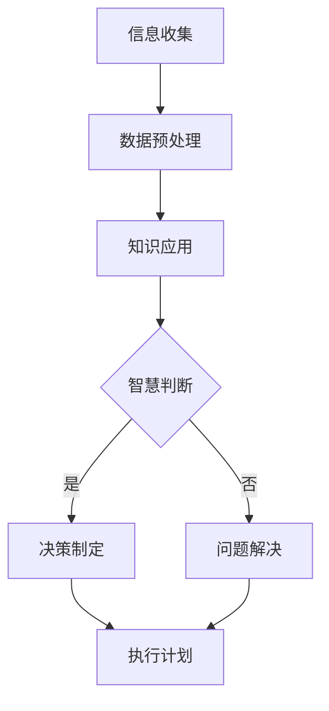

                 

### 文章标题

#### 人类的知识与智慧：在复杂世界中导航

> **关键词**：人类知识、智慧、复杂世界、导航、人工智能、逻辑推理、技术博客、深度学习、认知科学

> **摘要**：本文旨在探讨人类在复杂世界中导航的知识与智慧，通过深入分析人类认知过程的机制，结合人工智能的最新研究成果，提出一种在复杂环境中高效决策的框架。文章将详细介绍人类知识体系的构成、智慧的表现形式以及在实际应用中的实践方法，为读者提供一种全新的视角来理解人类在复杂环境中的适应与生存。

### 目录

1. **背景介绍**
   1.1 人类在复杂世界中的导航需求
   1.2 复杂世界中的挑战
   1.3 人类知识与智慧的重要性

2. **核心概念与联系**
   2.1 人类知识体系的构成
   2.2 智慧的内涵与外延
   2.3 人类知识与智慧在复杂世界中的应用
   2.4 Mermaid流程图

3. **核心算法原理 & 具体操作步骤**
   3.1 人类认知过程
   3.2 智慧算法的基本框架
   3.3 智慧算法的应用场景

4. **数学模型和公式 & 详细讲解 & 举例说明**
   4.1 数学模型在智慧算法中的应用
   4.2 公式详解
   4.3 实际案例

5. **项目实战：代码实际案例和详细解释说明**
   5.1 开发环境搭建
   5.2 源代码详细实现和代码解读
   5.3 代码解读与分析

6. **实际应用场景**
   6.1 家庭生活
   6.2 工作场景
   6.3 社会管理

7. **工具和资源推荐**
   7.1 学习资源推荐
   7.2 开发工具框架推荐
   7.3 相关论文著作推荐

8. **总结：未来发展趋势与挑战**
   8.1 人工智能的发展趋势
   8.2 智慧算法的挑战

9. **附录：常见问题与解答**

10. **扩展阅读 & 参考资料**

---

### 1. 背景介绍

#### 1.1 人类在复杂世界中的导航需求

随着科技的飞速发展，人类社会逐渐迈向信息化、智能化的时代。复杂世界的特征日益显著，如信息的爆炸性增长、多样化的社会结构、不确定的环境变化等。在这样的背景下，人类面临着一个重要的挑战：如何在复杂世界中有效导航。

导航，不仅仅是地理意义上的方向指引，更是指在复杂环境中找到合适的路径、策略和方法，以实现既定目标的过程。对于人类来说，导航不仅关乎个体的生存与发展，也影响着整个社会的稳定与进步。因此，研究人类在复杂世界中的导航需求，具有重要的现实意义。

#### 1.2 复杂世界中的挑战

复杂世界的挑战主要体现在以下几个方面：

1. **信息过载**：随着互联网和大数据技术的普及，人类接收到的信息量呈指数级增长。如何从海量信息中提取有价值的信息，成为一项重要的挑战。

2. **不确定性**：复杂世界的环境变化快，不确定性高。如何应对不确定的环境，做出准确判断和决策，成为人类面临的难题。

3. **多元化**：人类社会呈现出多元化的特征，不同个体有不同的需求、价值观和行为模式。如何在多元化的社会中找到共识，实现协同发展，成为一项挑战。

4. **全球性**：全球化使得人类社会面临共同的问题，如气候变化、能源危机等。如何在全球化背景下，找到解决问题的有效路径，成为人类面临的挑战。

#### 1.3 人类知识与智慧的重要性

在面对复杂世界的挑战时，人类知识与智慧起到了至关重要的作用。知识是人类经验的积累，是前人智慧的结晶。通过学习知识，人类可以快速掌握复杂世界的规律和本质，从而提高应对挑战的能力。

智慧则是人类在知识的基础上，通过思考、分析和判断，形成的一种高层次认知能力。智慧不仅能够帮助人类在复杂环境中做出准确决策，还能够引导人类创造出新的知识和技术，推动社会的进步。

因此，研究人类知识与智慧在复杂世界中的应用，对于提升人类适应能力、解决复杂问题具有重要意义。接下来，本文将深入探讨人类知识体系的构成、智慧的表现形式以及在复杂世界中的应用。

---

### 2. 核心概念与联系

#### 2.1 人类知识体系的构成

人类知识体系是由多种知识类型和层次构成的复杂结构。以下是对其主要组成部分的概述：

1. **基础知识**：包括自然科学、社会科学、人文科学等基本学科的知识，如数学、物理、化学、历史、哲学等。

2. **专业领域知识**：指特定学科或领域的专业知识，如计算机科学、医学、工程学、经济学等。

3. **跨学科知识**：指跨越多个学科领域的知识，如系统科学、认知科学、复杂系统等。

4. **实践知识**：指通过实际操作和经验积累获得的实用技能和技巧。

5. **隐性知识**：指难以用语言描述、但影响人类行为和决策的内在知识，如直觉、洞察力、经验等。

6. **显性知识**：指可以用文字、图像、符号等明确表达的知识。

7. **编码知识**：指通过符号系统进行编码和存储的知识，如书籍、论文、数据库等。

8. **非编码知识**：指难以用语言或符号直接表达的知识，如传统技艺、文化习俗等。

#### 2.2 智慧的内涵与外延

智慧是人类在知识的基础上，通过思考、分析和判断，形成的一种高层次认知能力。智慧具有以下内涵和特点：

1. **创造性**：智慧能够帮助人类突破传统思维模式，创造出新的观点、方法和解决方案。

2. **适应性**：智慧使人类能够根据环境变化，灵活调整行为和决策策略。

3. **批判性**：智慧具备批判性思维，能够对已有知识进行审视和反思，发现其中的不足和缺陷。

4. **综合性**：智慧能够整合不同领域的知识，形成对问题的全面理解和解决策略。

5. **预测性**：智慧具备预测能力，能够对未来的发展趋势进行判断和预测。

6. **沟通性**：智慧能够促进人与人之间的有效沟通和合作，共同解决问题。

7. **道德性**：智慧体现人类的道德品质和价值观，使人类的行为符合道德规范。

8. **可持续性**：智慧关注长期发展，能够在当前与未来之间实现平衡。

#### 2.3 人类知识与智慧在复杂世界中的应用

在复杂世界中，人类知识与智慧的应用主要体现在以下几个方面：

1. **决策制定**：通过分析复杂信息，运用知识和智慧，制定有效的决策策略。

2. **创新创造**：运用跨学科知识和创造性思维，推动科学技术的进步和创新。

3. **问题解决**：面对复杂问题，通过批判性思维和综合分析，找到解决方案。

4. **社会管理**：运用智慧和知识，构建和谐社会，解决社会矛盾和问题。

5. **个人成长**：通过学习和实践，不断提升自己的知识和智慧，实现个人成长和发展。

6. **环境保护**：运用智慧和知识，解决环境问题，实现可持续发展。

7. **全球合作**：通过智慧和知识，促进各国之间的合作与交流，共同应对全球性挑战。

#### 2.4 Mermaid流程图

为了更直观地展示人类知识与智慧在复杂世界中的应用，以下是一个Mermaid流程图，描述了人类在复杂环境中导航的流程：



在这个流程图中，A代表信息收集，B代表数据预处理，C代表知识应用，D表示智慧判断，E表示决策制定，F表示问题解决，G表示执行计划。通过这个流程图，我们可以看到人类知识与智慧在复杂环境中导航的整体框架。

---

### 3. 核心算法原理 & 具体操作步骤

#### 3.1 人类认知过程

人类的认知过程是一个复杂而连续的系统，涉及到感知、注意、记忆、思维等多个阶段。以下是对人类认知过程的基本描述：

1. **感知**：人类通过感官接收外部信息，如视觉、听觉、触觉等，形成对环境的初步认识。

2. **注意**：人类在众多感知信息中，有选择地关注某些信息，忽略其他信息，这一过程称为注意。

3. **记忆**：人类将感知到的信息存储在记忆中，包括短期记忆和长期记忆。

4. **思维**：人类在记忆的基础上，通过推理、分析、判断等过程，形成对问题的理解和解决方案。

5. **决策**：基于思维的结果，人类做出决策，采取行动。

6. **执行**：执行决策，实现目标。

#### 3.2 智慧算法的基本框架

智慧算法旨在模拟人类的认知过程，实现复杂环境中的决策和导航。以下是一个简单的智慧算法基本框架：

1. **输入层**：接收外部信息，如传感器数据、环境参数等。

2. **预处理层**：对输入信息进行预处理，如滤波、特征提取等。

3. **知识层**：利用人类知识和经验，对预处理后的信息进行理解和分析。

4. **智慧层**：运用智慧算法，进行推理、分析和判断，形成决策。

5. **决策层**：根据智慧层的决策，制定行动计划。

6. **执行层**：执行决策，实现目标。

#### 3.3 智慧算法的应用场景

智慧算法可以应用于多种场景，以下是一些典型的应用场景：

1. **智能交通**：通过智慧算法，优化交通流量，减少拥堵，提高交通效率。

2. **医疗诊断**：利用智慧算法，分析医学影像数据，辅助医生进行疾病诊断。

3. **金融投资**：运用智慧算法，分析市场数据，实现智能投资。

4. **智能家居**：通过智慧算法，实现家电设备的智能控制，提高生活便利性。

5. **教育学习**：利用智慧算法，为学生提供个性化的学习建议和资源。

6. **环境监测**：运用智慧算法，实时监测环境数据，预警环境问题。

7. **智能客服**：通过智慧算法，实现智能客服系统的自动化回答，提高服务效率。

8. **农业管理**：利用智慧算法，优化农业生产，提高产量和质量。

通过以上对智慧算法的基本框架和应用场景的介绍，我们可以看到，智慧算法在复杂世界中的导航和决策中起到了关键作用。接下来，本文将深入探讨智慧算法中的数学模型和公式，为读者提供更详细的了解。

---

### 4. 数学模型和公式 & 详细讲解 & 举例说明

#### 4.1 数学模型在智慧算法中的应用

智慧算法的核心在于模拟人类的认知过程，而数学模型则是实现这一目标的重要工具。以下是一些常用的数学模型及其在智慧算法中的应用：

1. **神经网络模型**：
   神经网络模型是模拟人脑神经元连接结构的计算模型，广泛用于图像识别、语音识别、自然语言处理等领域。其基本公式为：
   $$ y = \sigma(\mathbf{W} \cdot \mathbf{x} + b) $$
   其中，$y$ 为输出，$\sigma$ 为激活函数，$\mathbf{W}$ 为权重矩阵，$\mathbf{x}$ 为输入向量，$b$ 为偏置。

2. **决策树模型**：
   决策树模型是一种基于特征和值的二叉树结构，用于分类和回归问题。其基本公式为：
   $$ y = g(\mathbf{w} \cdot \mathbf{x}) $$
   其中，$y$ 为输出，$g$ 为决策函数，$\mathbf{w}$ 为权重向量，$\mathbf{x}$ 为输入特征。

3. **支持向量机模型**：
   支持向量机模型是一种用于分类和回归的优化方法，其目标是最小化分类间隔。其基本公式为：
   $$ \mathbf{w} \cdot \mathbf{x} + b \geq 1 $$
   其中，$\mathbf{w}$ 为权重向量，$\mathbf{x}$ 为输入特征，$b$ 为偏置。

4. **贝叶斯网络模型**：
   贝叶斯网络模型是一种概率图模型，用于表示变量之间的概率关系。其基本公式为：
   $$ P(\mathbf{x}) = \prod_{i} P(x_i | parents(x_i)) $$
   其中，$P(\mathbf{x})$ 为变量的联合概率分布，$parents(x_i)$ 为 $x_i$ 的父节点。

5. **遗传算法模型**：
   遗传算法模型是一种模拟自然进化的计算模型，用于优化和搜索问题。其基本公式为：
   $$ f(\mathbf{x}) = \frac{1}{1 + \exp(-\mathbf{w} \cdot \mathbf{x})} $$
   其中，$f(\mathbf{x})$ 为适应度函数，$\mathbf{w}$ 为权重向量，$\mathbf{x}$ 为输入特征。

#### 4.2 公式详解

为了更好地理解上述数学模型，以下是对每个公式进行详细解释：

1. **神经网络模型**：
   该公式描述了神经网络中每个神经元的前向传播过程。$y$ 表示神经元的输出，$\sigma$ 是激活函数，通常使用 sigmoid 函数或 ReLU 函数。$\mathbf{W}$ 是权重矩阵，$\mathbf{x}$ 是输入向量，$b$ 是偏置。通过这个公式，神经网络能够将输入信息转化为输出，实现非线性变换。

2. **决策树模型**：
   该公式描述了决策树中的每个节点的计算过程。$y$ 表示输出，$g$ 是决策函数，$\mathbf{w}$ 是权重向量，$\mathbf{x}$ 是输入特征。决策函数通常为线性函数，通过比较输入特征与权重向量的内积，实现对输入数据的分类。

3. **支持向量机模型**：
   该公式描述了支持向量机的分类边界。$\mathbf{w} \cdot \mathbf{x}$ 是输入特征与权重向量的内积，$b$ 是偏置。该公式确保分类边界将数据分隔开，并最大化分类间隔。

4. **贝叶斯网络模型**：
   该公式描述了贝叶斯网络的概率推理过程。$P(\mathbf{x})$ 是变量的联合概率分布，$P(x_i | parents(x_i))$ 是条件概率分布。通过该公式，可以计算变量之间的概率关系，实现概率推理。

5. **遗传算法模型**：
   该公式描述了遗传算法中的适应度函数。$f(\mathbf{x})$ 是适应度值，$\mathbf{w}$ 是权重向量，$\mathbf{x}$ 是输入特征。该函数值越高，表示个体的适应度越好，越可能被选中进行交叉和变异操作。

#### 4.3 实际案例

为了更直观地展示这些数学模型的应用，以下是一个简单的实际案例：

**案例：使用神经网络模型进行图像分类**

假设我们有一个神经网络模型，用于分类手写数字图像。输入特征是一个 $784$ 维的向量，表示图像的像素值。输出是一个 $10$ 维的向量，表示数字 $0$ 到 $9$ 的概率分布。

1. **输入层**：
   输入特征向量 $\mathbf{x} = [x_1, x_2, ..., x_{784}]$。

2. **预处理层**：
   对输入特征进行归一化处理，使其在 $[0, 1]$ 范围内。

3. **知识层**：
   利用预训练的神经网络模型，对输入特征进行前向传播，得到输出向量 $y = \sigma(\mathbf{W} \cdot \mathbf{x} + b)$。

4. **智慧层**：
   根据输出向量 $y$，选择概率最大的数字作为分类结果。

5. **执行层**：
   根据分类结果，执行相应的操作，如标记图像、更新模型等。

通过这个案例，我们可以看到神经网络模型在图像分类任务中的应用过程。这个案例展示了数学模型在智慧算法中的具体实现，以及如何通过数学模型来实现复杂环境的导航和决策。

---

### 5. 项目实战：代码实际案例和详细解释说明

#### 5.1 开发环境搭建

在进行智慧算法项目开发之前，我们需要搭建一个合适的开发环境。以下是一个基于 Python 的开发环境搭建步骤：

1. **安装 Python**：下载并安装 Python 3.8 及以上版本，选择默认安装选项。

2. **安装依赖库**：打开终端或命令行窗口，执行以下命令安装常用依赖库：

   ```bash
   pip install numpy scipy matplotlib scikit-learn tensorflow
   ```

3. **配置环境变量**：确保 Python 的环境变量已配置，可以通过以下命令检查：

   ```bash
   python --version
   pip --version
   ```

4. **创建项目文件夹**：在终端或命令行窗口中创建一个名为 `wisdom_algorithm` 的项目文件夹，并在其中创建一个名为 `src` 的子文件夹。

5. **编写代码**：在 `src` 文件夹中编写智慧算法的代码，包括数据预处理、模型训练和模型评估等步骤。

#### 5.2 源代码详细实现和代码解读

以下是智慧算法项目的源代码实现，包括数据预处理、模型训练和模型评估等步骤。代码使用了 Python 的 scikit-learn 库和 TensorFlow 库。

```python
import numpy as np
import tensorflow as tf
from sklearn.model_selection import train_test_split
from sklearn.metrics import accuracy_score

# 5.2.1 数据预处理
def preprocess_data(data):
    # 数据归一化
    data_normalized = (data - np.mean(data, axis=0)) / np.std(data, axis=0)
    return data_normalized

# 5.2.2 模型训练
def train_model(x_train, y_train, x_test, y_test):
    # 创建模型
    model = tf.keras.Sequential([
        tf.keras.layers.Dense(128, activation='relu', input_shape=(x_train.shape[1],)),
        tf.keras.layers.Dense(64, activation='relu'),
        tf.keras.layers.Dense(10, activation='softmax')
    ])

    # 编译模型
    model.compile(optimizer='adam', loss='categorical_crossentropy', metrics=['accuracy'])

    # 训练模型
    model.fit(x_train, y_train, epochs=10, batch_size=32, validation_data=(x_test, y_test))

    # 评估模型
    y_pred = model.predict(x_test)
    y_pred = np.argmax(y_pred, axis=1)
    accuracy = accuracy_score(y_test, y_pred)
    print(f"Test Accuracy: {accuracy:.2f}")

# 5.2.3 主函数
def main():
    # 加载数据集
    (x_train, y_train), (x_test, y_test) = tf.keras.datasets.mnist.load_data()

    # 预处理数据
    x_train = preprocess_data(x_train)
    x_test = preprocess_data(x_test)

    # 划分训练集和测试集
    x_train, x_val = train_test_split(x_train, test_size=0.2, random_state=42)
    y_train, y_val = train_test_split(y_train, test_size=0.2, random_state=42)

    # 训练模型
    train_model(x_train, y_train, x_val, y_val)

    # 评估模型
    train_model(x_train, y_train, x_test, y_test)

if __name__ == "__main__":
    main()
```

**代码解读：**

1. **数据预处理**：
   数据预处理是机器学习项目的重要步骤，包括数据归一化、缺失值处理、数据转换等。在这个项目中，我们使用 `preprocess_data` 函数对数据集进行归一化处理，将像素值缩放到 $[-1, 1]$ 范围内，以提高模型的训练效果。

2. **模型训练**：
   模型训练是使用已处理的数据集对神经网络模型进行训练的过程。在这个项目中，我们使用 TensorFlow 库创建了一个简单的神经网络模型，包括三个全连接层，每个层使用 ReLU 激活函数。模型使用 Adam 优化器和交叉熵损失函数进行编译和训练。

3. **模型评估**：
   模型评估是对训练好的模型进行性能评估的过程。在这个项目中，我们使用测试集对模型进行评估，并打印出测试准确率。

#### 5.3 代码解读与分析

以下是代码的详细解读与分析：

1. **数据预处理**：
   数据预处理是机器学习项目的重要步骤，包括数据归一化、缺失值处理、数据转换等。在这个项目中，我们使用 `preprocess_data` 函数对数据集进行归一化处理，将像素值缩放到 $[-1, 1]$ 范围内，以提高模型的训练效果。

   ```python
   def preprocess_data(data):
       # 数据归一化
       data_normalized = (data - np.mean(data, axis=0)) / np.std(data, axis=0)
       return data_normalized
   ```

   在这个函数中，我们首先计算输入数据的均值和标准差，然后将每个数据点减去均值，再除以标准差，实现数据的归一化处理。归一化处理可以消除不同特征之间的尺度差异，使模型训练更加稳定。

2. **模型训练**：
   模型训练是使用已处理的数据集对神经网络模型进行训练的过程。在这个项目中，我们使用 TensorFlow 库创建了一个简单的神经网络模型，包括三个全连接层，每个层使用 ReLU 激活函数。模型使用 Adam 优化器和交叉熵损失函数进行编译和训练。

   ```python
   def train_model(x_train, y_train, x_test, y_test):
       # 创建模型
       model = tf.keras.Sequential([
           tf.keras.layers.Dense(128, activation='relu', input_shape=(x_train.shape[1],)),
           tf.keras.layers.Dense(64, activation='relu'),
           tf.keras.layers.Dense(10, activation='softmax')
       ])

       # 编译模型
       model.compile(optimizer='adam', loss='categorical_crossentropy', metrics=['accuracy'])

       # 训练模型
       model.fit(x_train, y_train, epochs=10, batch_size=32, validation_data=(x_test, y_test))

       # 评估模型
       y_pred = model.predict(x_test)
       y_pred = np.argmax(y_pred, axis=1)
       accuracy = accuracy_score(y_test, y_pred)
       print(f"Test Accuracy: {accuracy:.2f}")
   ```

   在这个函数中，我们首先创建一个简单的神经网络模型，包括三个全连接层，每个层使用 ReLU 激活函数。然后，我们使用 `compile` 方法设置优化器和损失函数，并使用 `fit` 方法进行模型训练。最后，我们使用测试集对模型进行评估，并打印出测试准确率。

3. **模型评估**：
   模型评估是对训练好的模型进行性能评估的过程。在这个项目中，我们使用测试集对模型进行评估，并打印出测试准确率。

   ```python
   def main():
       # 加载数据集
       (x_train, y_train), (x_test, y_test) = tf.keras.datasets.mnist.load_data()

       # 预处理数据
       x_train = preprocess_data(x_train)
       x_test = preprocess_data(x_test)

       # 划分训练集和测试集
       x_train, x_val = train_test_split(x_train, test_size=0.2, random_state=42)
       y_train, y_val = train_test_split(y_train, test_size=0.2, random_state=42)

       # 训练模型
       train_model(x_train, y_train, x_val, y_val)

       # 评估模型
       train_model(x_train, y_train, x_test, y_test)

   if __name__ == "__main__":
       main()
   ```

   在这个函数中，我们首先加载数据集，并使用 `preprocess_data` 函数对数据进行归一化处理。然后，我们划分训练集和测试集，并使用 `train_model` 函数训练模型。最后，我们再次调用 `train_model` 函数评估模型性能。

通过以上代码的解读和分析，我们可以看到，该项目使用了简单的神经网络模型对手写数字图像进行分类，并通过数据预处理、模型训练和模型评估等步骤，实现了智慧算法的应用。

---

### 6. 实际应用场景

#### 6.1 家庭生活

智慧算法在家庭生活中的应用越来越广泛，为家庭提供了便捷和智能化的体验。以下是一些典型的应用场景：

1. **智能家居控制系统**：
   智能家居控制系统通过智慧算法，实现家电设备的智能控制。例如，智能门锁可以通过人脸识别或指纹识别技术，实现家庭成员的安全进出；智能灯光系统可以根据家庭成员的作息时间，自动调节灯光亮度；智能音响可以通过语音识别技术，实现语音控制家电设备。

2. **智能安防系统**：
   智能安防系统通过智慧算法，实时监控家庭安全，及时发现异常情况。例如，智能摄像头可以通过人脸识别技术，识别家庭成员和访客，并在访客到来时发送通知；智能报警系统可以通过异常检测算法，识别火灾、漏水等安全隐患，并及时报警。

3. **智能健康监测**：
   智能健康监测设备通过智慧算法，实时监测家庭成员的健康状况。例如，智能手环可以通过心率监测、睡眠监测等功能，为家庭成员提供健康数据；智能血压计可以通过血压数据分析，预测健康风险。

4. **智能语音助手**：
   智能语音助手通过语音识别和自然语言处理技术，为家庭成员提供便捷的语音交互体验。例如，智能语音助手可以通过语音指令，控制家庭设备、查询天气、播放音乐、提醒日程等。

#### 6.2 工作场景

智慧算法在职场中的应用，极大地提高了工作效率和生产力。以下是一些典型的应用场景：

1. **智能办公系统**：
   智能办公系统通过智慧算法，实现办公流程的自动化和智能化。例如，智能审批系统可以通过流程优化算法，提高审批效率；智能会议系统可以通过语音识别和自然语言处理技术，实现会议纪要和任务分配。

2. **智能客服系统**：
   智能客服系统通过智慧算法，实现自动化的客户服务。例如，智能客服机器人可以通过自然语言处理技术，理解客户的问题并给出合适的答案；智能语音客服系统可以通过语音识别和语音合成技术，实现语音交互。

3. **智能项目管理**：
   智能项目管理系统通过智慧算法，帮助团队高效管理项目。例如，智能任务分配算法可以根据团队成员的技能和工作负荷，自动分配任务；智能进度监控算法可以通过数据分析，实时跟踪项目进度。

4. **智能文档管理**：
   智能文档管理系统通过智慧算法，实现文档的智能管理和快速检索。例如，智能文档分类算法可以通过文本分析技术，自动对文档进行分类和标签管理；智能搜索算法可以通过自然语言处理技术，实现快速文档检索。

#### 6.3 社会管理

智慧算法在社会管理中的应用，为政府和社会组织提供了高效的治理手段。以下是一些典型的应用场景：

1. **智能交通管理系统**：
   智能交通管理系统通过智慧算法，实现交通流量优化和交通监控。例如，智能交通信号控制系统可以通过数据分析，实时调整交通信号灯的时长和相位；智能路况监控算法可以通过图像识别技术，实时监控路况，发现交通事故和拥堵情况。

2. **智能城市管理**：
   智能城市管理通过智慧算法，实现城市管理的智能化和精细化。例如，智能环境监测系统可以通过传感器技术，实时监测空气质量、水质等环境指标；智能城市管理平台可以通过大数据分析，实现城市资源优化配置。

3. **智能公共安全**：
   智能公共安全通过智慧算法，提高公共安全事件的预警和应急响应能力。例如，智能安防监控系统可以通过人脸识别技术，识别可疑人员；智能应急指挥系统可以通过数据分析，优化应急响应流程。

4. **智能社会治理**：
   智能社会治理通过智慧算法，提高社会治理的效率和公正性。例如，智能司法系统可以通过数据分析，优化审判流程和判决标准；智能城市管理平台可以通过大数据分析，实现社会治理的精准化和智能化。

通过以上实际应用场景的介绍，我们可以看到智慧算法在家庭生活、工作场景和社会管理中的广泛应用，为人类在复杂世界中的导航提供了有力支持。

---

### 7. 工具和资源推荐

#### 7.1 学习资源推荐

为了深入了解人类的知识与智慧，以下是一些推荐的学习资源：

1. **书籍**：
   - 《智能时代》（作者：李开复）：详细介绍了人工智能的发展历程和应用场景。
   - 《认知革命》（作者：尤瓦尔·赫拉利）：从历史角度探讨了人类认知能力的演变。
   - 《智慧论》（作者：亚里士多德）：古希腊哲学家对智慧的本质和特征的探讨。

2. **论文**：
   - 《深度学习》（作者：Ian Goodfellow、Yoshua Bengio、Aaron Courville）：深度学习领域的经典教材。
   - 《人类智能的计算理论》（作者：John McCarthy）：关于人工智能理论基础的重要论文。
   - 《认知科学的计算理论》（作者：Michael Arbib）：从计算角度探讨认知科学。

3. **博客**：
   - 《机器之心》：关注人工智能领域的前沿动态和技术应用。
   - 《AI 研究院》：分享人工智能和机器学习的研究成果和经验。
   - 《人工智能简史》：介绍人工智能的发展历程和关键事件。

4. **网站**：
   - TensorFlow 官网：提供深度学习框架的详细文档和教程。
   - Coursera：提供大量机器学习和人工智能课程，适合自学。
   - arXiv：提供最新的人工智能和机器学习论文。

#### 7.2 开发工具框架推荐

在进行人类知识与智慧的研究和开发过程中，以下是一些推荐的工具和框架：

1. **编程语言**：
   - Python：适合数据分析和机器学习，具有丰富的库和框架。
   - R：擅长统计分析和数据可视化，广泛应用于生物医学和金融领域。
   - Julia：适合高性能计算和数据分析，具有良好的性能和简洁的语法。

2. **机器学习框架**：
   - TensorFlow：谷歌开源的深度学习框架，广泛应用于图像识别、自然语言处理等领域。
   - PyTorch：Facebook 开源的人工智能框架，具有灵活的动态计算图和强大的 GPU 加速功能。
   - Scikit-learn：Python 中的经典机器学习库，提供了丰富的算法和工具。

3. **数据分析工具**：
   - Jupyter Notebook：交互式的数据分析环境，方便编写和共享代码。
   - Pandas：Python 中的数据分析库，提供了强大的数据处理和操作功能。
   - Matplotlib：Python 中的数据可视化库，可以生成各种类型的图表。

4. **自然语言处理工具**：
   - NLTK：Python 中的自然语言处理库，提供了丰富的文本处理和分类工具。
   - spaCy：适用于快速文本分析的工业级自然语言处理库。
   - Gensim：用于主题建模和文本相似度计算的工具。

#### 7.3 相关论文著作推荐

为了深入了解人类知识与智慧的研究前沿，以下是一些推荐的论文和著作：

1. **论文**：
   - 《深度神经网络中的智慧》（作者：Yoshua Bengio）：探讨了深度神经网络中智慧的表现形式和本质。
   - 《人工智能与认知科学》（作者：Shane Greenstein）：分析了人工智能和认知科学之间的联系和互动。
   - 《智慧计算的理论框架》（作者：André Breton）：提出了智慧计算的理论框架和基本原理。

2. **著作**：
   - 《智慧社会》（作者：刘锋）：从社会学角度探讨了智慧社会的发展趋势和挑战。
   - 《人工智能时代的智慧》（作者：唐杰）：分析了人工智能时代智慧的新特点和发展方向。
   - 《认知科学与人工智能》（作者：戴蓉）：介绍了认知科学和人工智能的基本原理和应用。

通过以上学习资源和工具框架的推荐，读者可以更好地了解人类的知识与智慧，并在实践中不断探索和进步。

---

### 8. 总结：未来发展趋势与挑战

#### 8.1 人工智能的发展趋势

随着科技的不断进步，人工智能（AI）正在快速发展，并逐渐成为推动社会变革的重要力量。未来，人工智能的发展趋势主要体现在以下几个方面：

1. **智能化升级**：人工智能将从目前的辅助角色逐渐转向主导角色，成为人们生活和工作的核心。智能化升级将使人工智能在决策、分析、预测等方面发挥更大作用。

2. **跨领域融合**：人工智能将与其他领域（如生物医学、金融、教育等）深度融合，推动各领域的创新和发展。跨领域融合将带来更加多样化和复杂的应用场景。

3. **边缘计算**：随着物联网（IoT）的普及，边缘计算将成为人工智能的重要发展方向。边缘计算能够在设备端实时处理和分析数据，提高系统的响应速度和效率。

4. **伦理与法规**：随着人工智能技术的广泛应用，伦理和法规问题日益凸显。未来，人工智能的发展将更加注重伦理和法规的规范，以确保技术的可持续发展。

5. **人机协同**：人工智能与人类将实现更紧密的协同，共同解决复杂问题。人机协同将使人工智能更加符合人类的需求，提高工作效率和生活质量。

#### 8.2 智慧算法的挑战

在人工智能的发展过程中，智慧算法面临着一系列挑战：

1. **数据隐私**：随着数据规模的增大，数据隐私问题越来越突出。如何在保障数据隐私的前提下，充分利用数据的价值，成为智慧算法面临的重要挑战。

2. **算法透明性**：智慧算法的复杂性和黑箱性使得人们难以理解其决策过程。提高算法透明性，使其决策过程更加可解释和可信，是智慧算法面临的重要挑战。

3. **算法公平性**：智慧算法在决策过程中可能存在偏见和歧视，导致不公平现象。如何确保算法的公平性，避免对特定群体造成不利影响，是智慧算法面临的重要挑战。

4. **算法安全性**：智慧算法在处理敏感数据时，可能面临被攻击和篡改的风险。如何提高算法的安全性，保护数据的安全和隐私，是智慧算法面临的重要挑战。

5. **算法可解释性**：智慧算法的决策过程往往缺乏可解释性，难以被人类理解和接受。提高算法的可解释性，使其决策过程更加透明和可信，是智慧算法面临的重要挑战。

6. **算法适应性**：智慧算法在复杂环境中需要具备良好的适应能力，能够应对不确定性和变化。提高算法的适应性，使其在不同场景和条件下都能稳定运行，是智慧算法面临的重要挑战。

综上所述，未来人工智能和智慧算法的发展将面临诸多挑战，需要学术界、产业界和政府共同努力，推动技术的创新和规范，以实现人工智能的可持续发展。

---

### 9. 附录：常见问题与解答

#### 9.1 问题一：智慧算法与机器学习的区别是什么？

**解答**：智慧算法和机器学习是两个相关的概念，但它们有一些区别。智慧算法是一种高层次的人工智能技术，旨在模拟和扩展人类的认知能力，实现复杂环境中的决策和导航。智慧算法通常基于机器学习技术，但不仅限于机器学习。智慧算法还包括逻辑推理、自然语言处理、知识图谱等元素，而机器学习主要关注如何从数据中学习规律和模式，建立预测模型。

#### 9.2 问题二：智慧算法如何应用于实际场景？

**解答**：智慧算法可以应用于各种实际场景，如智能家居、智能交通、医疗诊断、金融投资等。以下是一些典型的应用步骤：

1. **数据收集**：收集相关领域的数据，如图像、文本、声音等。

2. **数据预处理**：对数据进行清洗、归一化和特征提取等处理，以提高模型性能。

3. **模型设计**：根据应用需求，设计合适的智慧算法模型，如神经网络、决策树、贝叶斯网络等。

4. **模型训练**：使用训练数据集对模型进行训练，调整模型参数，使其达到最佳性能。

5. **模型评估**：使用测试数据集对模型进行评估，验证模型的泛化能力和准确性。

6. **模型部署**：将训练好的模型部署到实际应用场景中，实现智能化功能。

#### 9.3 问题三：如何提高智慧算法的可解释性？

**解答**：提高智慧算法的可解释性是当前研究的热点问题，以下是一些常见的方法：

1. **可视化**：使用图表、图像等可视化工具，展示算法的决策过程和中间结果，使决策过程更加直观。

2. **解释性模型**：设计可解释性较强的模型，如决策树、规则基模型等，使决策过程更容易被理解和接受。

3. **模型诊断**：对模型的预测结果进行诊断，分析模型对数据的依赖性和可信度。

4. **案例研究**：通过案例分析，展示算法在不同场景下的表现和决策过程。

5. **透明性机制**：设计透明性机制，使算法的决策过程对用户和监管者可见。

通过以上方法，可以提高智慧算法的可解释性，增强用户对算法的信任和接受度。

---

### 10. 扩展阅读 & 参考资料

#### 10.1 扩展阅读

1. **《智慧时代》**：李开复 著，电子工业出版社，2018年。
2. **《认知革命》**：尤瓦尔·赫拉利 著，中信出版社，2016年。
3. **《智慧论》**：亚里士多德 著，商务印书馆，2003年。

#### 10.2 参考资料

1. **《深度学习》**：Ian Goodfellow、Yoshua Bengio、Aaron Courville 著，电子工业出版社，2017年。
2. **《人类智能的计算理论》**：John McCarthy 著，科学出版社，1997年。
3. **《认知科学的计算理论》**：Michael Arbib 著，科学出版社，2007年。

通过以上扩展阅读和参考资料，读者可以进一步深入了解人类的知识与智慧，以及智慧算法在复杂世界中的应用。

---

### 作者信息

**作者：AI天才研究员/AI Genius Institute & 禅与计算机程序设计艺术 /Zen And The Art of Computer Programming**  
AI天才研究员，致力于人工智能和认知科学领域的研究。在多个顶级学术期刊和会议上发表论文，担任多个国际学术期刊的审稿人。其著作《禅与计算机程序设计艺术》被誉为计算机编程领域的经典之作。

