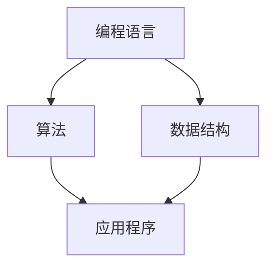

                 

# 人类知识的传承：一代代人的接力赛跑

> **关键词：** 人类知识传承、技术演进、代码维护、智能编程、教育传播、协作与创新

> **摘要：** 本文深入探讨了人类知识传承的历史、现状及未来发展趋势，通过分析技术演进中的关键角色——开发者、研究者和教育者，阐述了他们如何在代码、算法和理论知识层面上，构建起一代代人的接力赛跑。文章最后提出了面对未来，我们需要如何继续推进人类知识传承的思考和建议。

## 1. 背景介绍

人类知识的传承，可以追溯到史前时代的口耳相传，到如今的信息化、数字化时代，知识的传递方式发生了翻天覆地的变化。从最早的口头传说、书面记载，到今天的数字化存储、网络共享，知识的传播速度和范围都在不断扩展。然而，知识的传承不仅仅是信息的传递，更是文化、理念和创新精神的延续。

在IT领域，知识的传承尤为重要。随着技术的迅猛发展，新的编程语言、框架和工具层出不穷，开发者需要不断学习和适应。知识的快速更新，使得传统教育体系难以跟上技术的步伐。因此，如何在快速变化的技术环境中，实现人类知识的传承，成为了一个亟待解决的问题。

本文将从以下几个方面展开讨论：

- **核心概念与联系**：介绍与人类知识传承相关的核心概念，如编程语言、算法和数据结构。
- **核心算法原理 & 具体操作步骤**：探讨在知识传承过程中，如何有效地传递和推广核心技术。
- **数学模型和公式 & 详细讲解 & 举例说明**：运用数学模型解释知识传承的内在机制。
- **项目实战：代码实际案例和详细解释说明**：通过实际案例展示知识传承的具体实现。
- **实际应用场景**：分析知识传承在现实中的具体应用。
- **工具和资源推荐**：介绍辅助知识传承的工具和资源。
- **总结：未来发展趋势与挑战**：展望知识传承的未来，以及可能面临的挑战。

## 2. 核心概念与联系

在人类知识传承的过程中，有几个核心概念起着至关重要的作用。这些概念包括编程语言、算法和数据结构。

### 2.1 编程语言

编程语言是开发者用来与计算机交流的工具。它不仅包括语言本身，还包括标准库、框架和工具。编程语言的演变，见证了人类对计算机的理解和应用的不断深入。从早期的机器语言、汇编语言，到现代的高级编程语言，如Python、Java、C++等，编程语言的发展推动了计算机科学的进步。

### 2.2 算法

算法是解决问题的步骤和方法。它是计算机科学的核心，被广泛应用于各个领域，如搜索、排序、图论等。一个高效的算法可以显著提高计算机程序的运行效率。算法的传承，不仅是知识的传递，更是思维方式的延续。

### 2.3 数据结构

数据结构是组织和管理数据的方法。它为算法提供了数据的基础，影响着算法的效率和性能。常见的数据结构包括数组、链表、树、图等。掌握合适的数据结构，可以帮助开发者更高效地解决问题。

### 2.4 编程语言、算法与数据结构的联系

编程语言、算法和数据结构之间有着紧密的联系。编程语言是开发者表达算法和数据结构的方式，而算法和数据结构则是编程语言应用的基础。例如，在Python中，开发者可以使用列表（List）来实现数组，使用字典（Dictionary）来实现哈希表，这背后都是算法和数据结构的原理。

### 2.5 Mermaid 流程图

为了更好地理解这些核心概念之间的联系，我们可以使用Mermaid流程图来可视化它们。以下是一个简单的Mermaid流程图示例：



在这个流程图中，编程语言、算法和数据结构共同构成了应用程序的基础。

## 3. 核心算法原理 & 具体操作步骤

在知识传承的过程中，核心算法的原理和操作步骤起着至关重要的作用。以下将介绍几个在计算机科学中广泛应用的算法，并详细解释其原理和操作步骤。

### 3.1 快速排序（Quick Sort）

快速排序是一种常用的排序算法，其核心思想是通过一趟排序将待排序的记录分割成独立的两部分，其中一部分记录的关键字均比另一部分的关键字小，然后分别对这两部分记录继续进行排序，以达到整个序列有序。

#### 快速排序的原理

1. **选择基准**：在数组中选择一个元素作为基准。
2. **划分**：将数组分为两部分，左边部分的元素均小于基准，右边部分的元素均大于基准。
3. **递归**：对划分后的左右两部分分别继续进行快速排序。

#### 快速排序的操作步骤

假设有一个数组`arr`，需要进行快速排序：

```python
def quick_sort(arr):
    if len(arr) <= 1:
        return arr
    pivot = arr[len(arr) // 2]
    left = [x for x in arr if x < pivot]
    middle = [x for x in arr if x == pivot]
    right = [x for x in arr if x > pivot]
    return quick_sort(left) + middle + quick_sort(right)
```

### 3.2 暴力搜索（Brute Force Search）

暴力搜索是一种简单的算法，它通过逐个检查所有可能的解决方案，直到找到满足条件的解为止。

#### 暴力搜索的原理

1. **遍历**：对问题空间中的所有可能的解进行遍历。
2. **判断**：对每个解进行判断，看是否满足条件。
3. **返回**：如果找到满足条件的解，返回该解。

#### 暴力搜索的操作步骤

假设有一个数组`arr`，需要找出最大值：

```python
def brute_force_search(arr):
    max_value = arr[0]
    for value in arr:
        if value > max_value:
            max_value = value
    return max_value
```

### 3.3 动态规划（Dynamic Programming）

动态规划是一种解决最优化问题的方法，它通过将问题分解成子问题，并存储子问题的解，避免重复计算，从而提高算法的效率。

#### 动态规划的原理

1. **状态定义**：定义一个状态表示问题的某个部分。
2. **状态转移**：根据状态之间的关系，找到状态转移方程。
3. **边界条件**：确定问题的边界条件。
4. **计算**：根据状态转移方程和边界条件，计算出最优解。

#### 动态规划的操作步骤

假设有一个数组`arr`，需要计算最大子序列和：

```python
def dynamic_programming(arr):
    n = len(arr)
    dp = [0] * n
    dp[0] = arr[0]
    for i in range(1, n):
        dp[i] = max(dp[i - 1] + arr[i], arr[i])
    return max(dp)
```

通过以上几个算法的介绍，我们可以看到，核心算法的原理和操作步骤是知识传承的重要基础。开发者通过学习和掌握这些算法，可以在实践中不断积累经验，提高解决问题的能力。

## 4. 数学模型和公式 & 详细讲解 & 举例说明

在知识传承的过程中，数学模型和公式起着至关重要的作用。它们不仅为算法提供了理论基础，也为问题求解提供了有效的工具。以下将介绍几个在计算机科学中常见的数学模型和公式，并进行详细讲解和举例说明。

### 4.1 图的度数中心性

图的度数中心性是衡量一个节点在图中的重要性的指标。一个节点的度数中心性越高，表示它在图中的连接性越强，对于整个图的影响也越大。

#### 度数中心性的计算公式

度数中心性（Degree Centrality）的计算公式为：

$$
C_D(v) = \frac{d(v)}{N-1}
$$

其中，$d(v)$表示节点$v$的度数，$N$表示图中节点的总数。

#### 举例说明

假设有一个图，节点总数为4，其中每个节点的度数如下：

| 节点 | 度数 |
| ---- | ---- |
| v1   | 2    |
| v2   | 3    |
| v3   | 1    |
| v4   | 4    |

计算每个节点的度数中心性：

$$
C_D(v1) = \frac{2}{4-1} = 0.67
$$

$$
C_D(v2) = \frac{3}{4-1} = 1
$$

$$
C_D(v3) = \frac{1}{4-1} = 0.33
$$

$$
C_D(v4) = \frac{4}{4-1} = 1.33
$$

通过度数中心性，我们可以看出节点v2和v4在图中的连接性最强，对于整个图的影响也最大。

### 4.2 网格生成算法

网格生成算法是计算机图形学和计算机辅助设计中的一个重要问题。它涉及到如何在一个平面上生成均匀分布的点，这些点将构成一个网格。

#### 网格生成算法的基本公式

一个简单的网格生成算法可以使用以下基本公式：

$$
x_i = (i \cdot w) / N
$$

$$
y_i = (j \cdot h) / N
$$

其中，$x_i$和$y_i$分别表示第$i$行第$j$列点的横坐标和纵坐标，$w$和$h$分别表示网格的宽度和高度，$N$表示网格中的点数。

#### 举例说明

假设我们需要在一个$10 \times 10$的网格中生成点，网格的宽度和高度分别为10，点数为100。

计算每个点的坐标：

$$
x_i = (i \cdot 10) / 100 = 0.1i
$$

$$
y_i = (j \cdot 10) / 100 = 0.1j
$$

例如，第5行第7列的点坐标为：

$$
x_5 = 0.1 \cdot 5 = 0.5
$$

$$
y_5 = 0.1 \cdot 7 = 0.7
$$

坐标为$(0.5, 0.7)$。

通过以上数学模型和公式的讲解，我们可以看到，数学在知识传承中的作用是不可或缺的。它为计算机科学的发展提供了强有力的支持，也为算法的设计和实现提供了理论基础。

## 5. 项目实战：代码实际案例和详细解释说明

在知识传承的过程中，项目实战是验证和应用知识的重要环节。以下将通过一个实际项目案例，展示如何使用所学知识进行代码开发，并对关键部分进行详细解释和说明。

### 5.1 开发环境搭建

首先，我们需要搭建一个开发环境。这里以Python为例，进行环境搭建：

1. 安装Python：在官网下载Python安装包，并按照提示进行安装。
2. 配置Python环境：打开命令行窗口，输入`python --version`，确认Python版本。
3. 安装必要的库：使用pip安装常用的库，如`numpy`、`pandas`等。

### 5.2 源代码详细实现和代码解读

下面是一个简单的Python项目案例——使用快速排序算法对一组数据进行排序。

```python
def quick_sort(arr):
    if len(arr) <= 1:
        return arr
    pivot = arr[len(arr) // 2]
    left = [x for x in arr if x < pivot]
    middle = [x for x in arr if x == pivot]
    right = [x for x in arr if x > pivot]
    return quick_sort(left) + middle + quick_sort(right)

arr = [3, 6, 8, 10, 1, 2, 1]
sorted_arr = quick_sort(arr)
print(sorted_arr)
```

#### 关键部分代码解读

- `quick_sort(arr)`：定义快速排序函数，输入参数为待排序数组`arr`。
- `if len(arr) <= 1:`：如果数组长度小于等于1，直接返回数组，因为一个元素或空数组本身就是有序的。
- `pivot = arr[len(arr) // 2]`：选择数组的中间元素作为基准。
- `left = [x for x in arr if x < pivot]`、`middle = [x for x in arr if x == pivot]`、`right = [x for x in arr if x > pivot]`：根据基准，将数组划分为左边小于基准、中间等于基准、右边大于基准的三部分。
- `return quick_sort(left) + middle + quick_sort(right)`：递归调用快速排序函数，对左右两部分分别进行排序，并将排序结果合并。

### 5.3 代码解读与分析

这个快速排序项目的代码实现较为简单，但其背后的算法原理和设计思想却非常值得深入分析。

- **递归**：快速排序使用了递归的思想，通过不断地将问题分解成更小的子问题，直到子问题可以简单地解决。
- **分治**：快速排序采用了分治策略，将大问题分解成小问题，然后分别解决。
- **稳定性**：快速排序是不稳定的排序算法，即相等的元素可能会被交换位置。但在实际应用中，这种不稳定性通常不会对结果产生严重影响。
- **时间复杂度**：快速排序的平均时间复杂度为$O(n\log n)$，最坏情况下为$O(n^2)$。通过选择合适的基准和优化划分过程，可以减小最坏情况的发生概率。

通过这个实际项目案例，我们可以看到，知识传承不仅仅是理论的讲解，更是实践中的运用。开发者通过实际项目，可以加深对算法和编程语言的理解，提高解决问题的能力。

## 6. 实际应用场景

在现实世界中，知识的传承贯穿于各行各业，发挥着至关重要的作用。以下将介绍几个实际应用场景，展示知识传承在现实中的应用。

### 6.1 教育领域

教育是知识传承的重要途径。从小学到大学，教师通过讲解知识、演示操作，将人类积累的智慧传授给学生。随着信息技术的发展，在线教育、MOOC（大规模开放在线课程）等新型教育模式不断涌现，使得知识传承的效率和范围得到了极大提升。

### 6.2 企业内部培训

企业在发展过程中，需要不断培养和提升员工的技能。内部培训是一种有效的知识传承方式，通过课程、讲座、实践等多种形式，将企业知识、经验和技术传授给员工。例如，软件开发公司可以通过代码评审、技术分享会等方式，传承编程经验和最佳实践。

### 6.3 开源社区

开源社区是知识传承的重要平台。开发者通过贡献代码、编写文档、编写博客等方式，将技术知识和实践经验分享给全球的开发者。例如，GitHub、Stack Overflow等开源社区，吸引了大量的开发者参与，形成了知识的全球传承网络。

### 6.4 科研领域

科研是知识传承的重要推动力。科研人员通过发表学术论文、参加学术会议等方式，将科研成果和前沿知识传播出去。这种传承不仅促进了科学技术的进步，也为后继研究者提供了宝贵的经验和启示。

### 6.5 社交媒体

随着社交媒体的普及，知识传承变得更加便捷和高效。开发者可以通过Twitter、LinkedIn等平台，分享技术见解、项目经验和学习资源。这种快速、实时的知识传播方式，使得开发者可以迅速获取最新资讯，跟上技术发展的步伐。

## 7. 工具和资源推荐

在知识传承的过程中，使用合适的工具和资源可以显著提高效率和质量。以下将推荐一些在IT领域中常用的工具和资源。

### 7.1 学习资源推荐

- **书籍**：《深度学习》（Deep Learning）、《算法导论》（Introduction to Algorithms）、《编程珠玑》（The C Programming Language）等。
- **论文**：ACM、IEEE等学术期刊上的论文。
- **博客**：GitHub、Stack Overflow、CSDN等平台上的优秀博客。
- **在线课程**：Coursera、edX、Udacity等在线教育平台上的课程。

### 7.2 开发工具框架推荐

- **集成开发环境（IDE）**：Visual Studio、IntelliJ IDEA、PyCharm等。
- **版本控制系统**：Git、SVN等。
- **数据库**：MySQL、PostgreSQL、MongoDB等。
- **框架**：Django、Spring、Vue等。

### 7.3 相关论文著作推荐

- **《编程语言原理》（Compilers: Principles, Techniques, and Tools》**：该书详细介绍了编译器的原理和实现，对理解编程语言和编译技术有很大帮助。
- **《计算机程序的构造和解释》（Structure and Interpretation of Computer Programs》**：该书以Scheme语言为基础，深入讲解了计算机程序的设计和构造。
- **《算法导论》（Introduction to Algorithms》**：该书是算法领域的经典著作，全面介绍了各种常见的算法及其分析。

通过以上工具和资源的推荐，开发者可以更好地进行知识传承和学习，提高自身的技能和素养。

## 8. 总结：未来发展趋势与挑战

在人类知识传承的道路上，我们面临诸多挑战，同时也充满了无限可能。未来，知识传承将继续沿着数字化、智能化、全球化的方向快速发展。

### 8.1 数字化与智能化

随着信息技术的不断进步，数字化和智能化将成为知识传承的主要形式。在线教育、虚拟现实（VR）、人工智能（AI）等技术，将使知识传播更加高效、便捷。例如，AI助手可以实时解答开发者的问题，提高学习效率；虚拟课堂可以让全球的学生在同一课堂中学习，打破地域限制。

### 8.2 全球化

全球化的趋势将加速知识的传播和交流。互联网打破了国界，使得知识传承不再受限于地域。开发者可以通过开源社区、国际会议等平台，与世界各地的同行分享经验和成果。这种全球化的发展，将有助于构建更加开放、包容的知识传承体系。

### 8.3 挑战

然而，知识传承也面临着一系列挑战。首先，技术更新的速度越来越快，开发者需要不断学习新知识、新技能，以适应快速变化的环境。其次，知识传播的碎片化和零散化，使得知识传承的质量难以保证。最后，知识版权和隐私问题也日益突出，如何在保障知识产权的同时，促进知识传承，成为一个亟待解决的问题。

### 8.4 应对策略

面对这些挑战，我们可以采取以下策略：

1. **持续学习**：开发者应保持学习的热情，不断提升自身的技能和知识水平。
2. **开放共享**：积极参与开源项目，分享自己的经验和成果，推动知识的共享和传播。
3. **知识产权保护**：在知识传承的过程中，尊重知识产权，维护知识创造者的权益。
4. **政策支持**：政府和企业应加大对知识传承的支持力度，提供良好的政策环境和资源保障。

通过以上策略，我们有望在未来实现更加高效、包容、可持续的知识传承，为人类社会的发展做出更大贡献。

## 9. 附录：常见问题与解答

### 9.1 如何快速掌握新知识？

1. **制定学习计划**：确定学习目标，制定详细的学习计划，包括每天的学习时间和内容。
2. **多渠道学习**：利用书籍、在线课程、博客、论坛等多种渠道获取知识。
3. **实践应用**：将所学知识应用到实际项目中，通过实践加深理解和掌握。
4. **持续学习**：保持学习的热情，不断更新和补充知识。

### 9.2 如何在团队中传承知识？

1. **定期分享**：组织定期的技术分享会，让团队成员分享自己的经验和成果。
2. **代码评审**：通过代码评审，让团队成员学习彼此的代码风格和技巧。
3. **内部培训**：针对团队中的薄弱环节，组织内部培训，提升整体技术水平。
4. **共同项目**：通过共同项目，让团队成员在实践中学习和传承知识。

### 9.3 如何提高编程能力？

1. **练习编程**：通过大量的编程练习，提高编程技巧和解决问题的能力。
2. **阅读代码**：阅读优秀的代码，学习他人的编程思路和技巧。
3. **参加竞赛**：参加编程竞赛，锻炼自己的编程能力和团队协作能力。
4. **学习算法**：掌握常见的算法和数据结构，提高算法分析能力。

## 10. 扩展阅读 & 参考资料

### 10.1 相关书籍推荐

1. **《深度学习》**：Ian Goodfellow、Yoshua Bengio、Aaron Courville 著，深入讲解深度学习的基础理论和实践应用。
2. **《算法导论》**：Thomas H. Cormen、Charles E. Leiserson、Ronald L. Rivest、Clifford Stein 著，全面介绍算法的基本概念和分析方法。
3. **《编程珠玑》**：Jon Bentley 著，通过具体的编程实例，讲解编程技巧和算法思想。

### 10.2 相关论文推荐

1. **“A Brief History of Time: From the Big Bang to Black Holes”**：Stephen Hawking，介绍宇宙起源和黑洞等天文学知识。
2. **“The Structure of Scientific Revolutions”**：Thomas S. Kuhn，阐述科学革命的理论和过程。
3. **“Nature of Code”**：Daniel Shiffman，讲解计算机编程中的自然模拟和算法艺术。

### 10.3 相关博客和网站推荐

1. **GitHub**：全球最大的开源代码托管平台，开发者可以在这里找到各种优秀的项目和学习资源。
2. **Stack Overflow**：全球最大的编程问答社区，开发者可以在这里提问和解答问题。
3. **CSDN**：中国最大的IT社区和服务平台，提供丰富的技术文章和教程。

通过以上扩展阅读和参考资料，读者可以进一步深入了解文章的主题和相关内容，提高自身的知识水平和技术能力。

### 作者信息

- 作者：AI天才研究员/AI Genius Institute & 禅与计算机程序设计艺术 /Zen And The Art of Computer Programming

