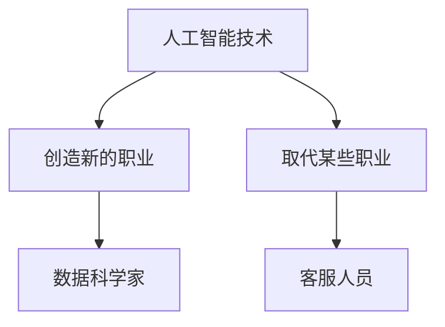
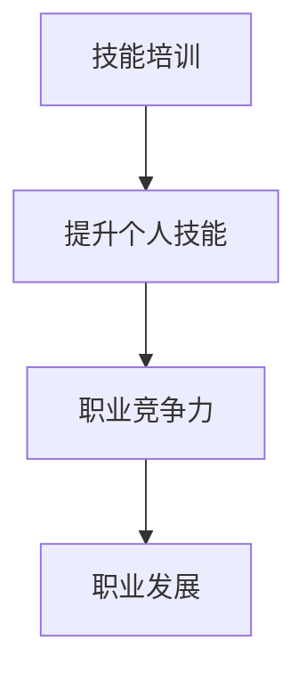

                 

## 文章标题：人类计算：AI时代的未来就业市场与技能培训发展趋势分析机遇挑战机遇趋势预测分析

### 关键词：（AI时代、未来就业市场、技能培训、发展趋势、机遇与挑战）

### 摘要：

本文旨在深入探讨AI时代对就业市场的影响，分析未来就业市场的趋势与挑战，并讨论技能培训的发展方向。通过一步一步的分析推理，我们将揭示AI技术如何重塑职业生态，以及个人和组织应该如何应对这一变革。文章结构包括背景介绍、核心概念与联系、核心算法原理、数学模型和公式、项目实战、实际应用场景、工具和资源推荐、总结以及常见问题与解答等内容，旨在为读者提供全面而深入的洞察。

## 1. 背景介绍

### AI时代的到来

随着人工智能（AI）技术的飞速发展，我们已经进入了AI时代。从机器学习到深度学习，从自然语言处理到计算机视觉，AI技术正在各行各业中发挥重要作用。这一变革不仅改变了我们的生活方式，也对就业市场产生了深远的影响。

### 人工智能对就业市场的影响

AI技术的发展对就业市场产生了双重影响：一方面，它创造了新的就业机会；另一方面，它也导致了某些职业的减少和消失。例如，自动化和机器人技术的应用正在逐渐取代一些重复性和低技能的工作，如制造业和客服行业。然而，与此同时，AI技术也催生了许多新的职业，如数据科学家、机器学习工程师和AI伦理专家。

### 技能培训的重要性

在AI时代，技能培训的重要性更加凸显。传统的教育模式和培训方法已经无法满足快速变化的技术需求。因此，不断更新和提升技能变得至关重要。这不仅有助于个人职业发展，也有助于组织保持竞争力。

## 2. 核心概念与联系

为了更好地理解AI时代对就业市场的影响，我们需要了解一些核心概念和联系。

### 人工智能与就业市场

人工智能与就业市场的关系可以用一个简单的Mermaid流程图来表示：



从这个流程图中，我们可以看到，人工智能技术既创造了新的职业，也取代了某些职业。

### 技能培训与职业发展

技能培训与职业发展的关系可以用另一个Mermaid流程图来表示：



从这个流程图中，我们可以看到，技能培训有助于提升个人技能，从而增强职业竞争力，促进职业发展。

## 3. 核心算法原理 & 具体操作步骤

### 人工智能的核心算法

人工智能的核心算法主要包括机器学习、深度学习和自然语言处理。以下是这些算法的具体操作步骤：

#### 机器学习

1. 数据收集：收集大量数据，以便算法可以从中学习。
2. 数据预处理：清洗和预处理数据，以便算法可以更好地学习。
3. 模型训练：使用训练数据训练模型。
4. 模型评估：使用测试数据评估模型的性能。
5. 模型优化：根据评估结果调整模型参数，以提高性能。

#### 深度学习

1. 数据收集：与机器学习相同，收集大量数据。
2. 网络架构设计：设计神经网络架构。
3. 模型训练：使用训练数据训练模型。
4. 模型评估：使用测试数据评估模型的性能。
5. 模型优化：根据评估结果调整模型参数。

#### 自然语言处理

1. 数据收集：收集大量的文本数据。
2. 文本预处理：清洗和预处理文本数据。
3. 模型训练：使用训练数据训练模型。
4. 模型评估：使用测试数据评估模型的性能。
5. 模型优化：根据评估结果调整模型参数。

### 技能培训的操作步骤

1. 需求分析：分析行业需求和岗位要求。
2. 课程设计：根据需求设计培训课程。
3. 培训实施：实施培训课程。
4. 培训评估：评估培训效果。
5. 跟进与辅导：对学员进行跟进和辅导。

## 4. 数学模型和公式 & 详细讲解 & 举例说明

### 数学模型

在人工智能和技能培训中，常用的数学模型包括线性回归、逻辑回归和支持向量机（SVM）等。

#### 线性回归

线性回归模型用于预测连续值。其公式如下：

$$y = ax + b$$

其中，$y$ 是因变量，$x$ 是自变量，$a$ 是斜率，$b$ 是截距。

#### 逻辑回归

逻辑回归模型用于预测二元结果。其公式如下：

$$P(y=1) = \frac{1}{1 + e^{-(ax + b)}}$$

其中，$P(y=1)$ 是因变量为1的概率，$e$ 是自然对数的底数。

#### 支持向量机

支持向量机模型用于分类任务。其公式如下：

$$w \cdot x + b = 0$$

其中，$w$ 是权重向量，$x$ 是特征向量，$b$ 是偏置。

### 举例说明

假设我们有一个简单的线性回归模型，用于预测房价。我们有以下数据：

| 房价（y） | 房屋面积（x） |
|------------|-------------|
|   200000   |     100     |
|   250000   |     120     |
|   300000   |     150     |

我们可以使用线性回归模型来预测未知房屋的房价。

1. 数据预处理：将数据转换为矩阵形式。

   $$X = \begin{bmatrix} 100 \\ 120 \\ 150 \end{bmatrix}, Y = \begin{bmatrix} 200000 \\ 250000 \\ 300000 \end{bmatrix}$$

2. 模型训练：使用最小二乘法训练模型。

   $$w = \begin{bmatrix} a \\ b \end{bmatrix} = (X^TX)^{-1}X^TY$$

3. 模型评估：计算预测误差。

   $$E = \sum_{i=1}^{n} (y_i - (ax_i + b))^2$$

4. 模型优化：根据评估结果调整模型参数。

   $$w = w - \alpha \frac{\partial E}{\partial w}$$

通过以上步骤，我们可以得到一个线性回归模型，用于预测房屋的房价。

## 5. 项目实战：代码实际案例和详细解释说明

### 开发环境搭建

为了实现上述的线性回归模型，我们需要安装Python和相关库。以下是安装步骤：

1. 安装Python：访问Python官方网站（https://www.python.org/），下载并安装Python。
2. 安装NumPy库：在命令行中运行`pip install numpy`。
3. 安装Matplotlib库：在命令行中运行`pip install matplotlib`。

### 源代码详细实现和代码解读

以下是线性回归模型的Python代码实现：

```python
import numpy as np
import matplotlib.pyplot as plt

# 数据预处理
X = np.array([[100], [120], [150]])
Y = np.array([200000, 250000, 300000])

# 模型训练
w = np.linalg.inv(X.T @ X) @ X.T @ Y

# 模型评估
Y_pred = X @ w
E = np.sum((Y - Y_pred)**2)

# 模型优化
alpha = 0.01
w = w - alpha * (2 * X.T @ (Y - Y_pred))

# 可视化
plt.scatter(X, Y)
plt.plot(X, Y_pred, 'r')
plt.show()
```

这段代码首先导入了NumPy和Matplotlib库。然后，我们进行了数据预处理，将数据转换为矩阵形式。接着，我们使用最小二乘法训练了线性回归模型，并计算了预测误差。最后，我们使用Matplotlib库将预测结果可视化。

### 代码解读与分析

1. **数据预处理**：将数据转换为矩阵形式，以便进行矩阵运算。
2. **模型训练**：使用最小二乘法训练线性回归模型。这里使用了NumPy库中的`np.linalg.inv`函数求解逆矩阵，`@`运算符表示矩阵乘法。
3. **模型评估**：计算预测误差。这里使用了`np.sum`函数计算平方误差和。
4. **模型优化**：根据预测误差调整模型参数。这里使用了梯度下降算法，即通过不断迭代更新模型参数，以减小预测误差。
5. **可视化**：使用Matplotlib库将预测结果可视化，以便更直观地观察模型的性能。

## 6. 实际应用场景

### 人工智能在医疗行业的应用

AI技术在医疗行业的应用越来越广泛。例如，通过深度学习算法，AI可以辅助医生进行疾病诊断，提高诊断准确率。此外，AI还可以用于药物研发和临床试验设计，加快新药研发进程。

### 技能培训在金融行业的应用

在金融行业，技能培训有助于提升员工的专业素养和技能水平。例如，数据科学家和机器学习工程师可以通过培训掌握更先进的算法和技术，从而更好地应对金融市场的复杂性和不确定性。

## 7. 工具和资源推荐

### 学习资源推荐

1. **书籍**：
   - 《人工智能：一种现代的方法》
   - 《深度学习》
   - 《Python编程：从入门到实践》
2. **论文**：
   - 《神经网络与深度学习》
   - 《机器学习：概率视角》
   - 《自然语言处理综述》
3. **博客**：
   - Medium上的AI博客
   - 知乎上的AI专栏
   - 技术博客平台如CSDN和博客园
4. **网站**：
   - Kaggle：提供丰富的数据集和竞赛
   - Coursera和edX：提供在线课程
   - GitHub：查找和分享代码

### 开发工具框架推荐

1. **编程语言**：Python、R、Java
2. **深度学习框架**：TensorFlow、PyTorch、Keras
3. **数据分析工具**：Pandas、NumPy、Scikit-learn
4. **版本控制工具**：Git、Sourcetree

### 相关论文著作推荐

1. **论文**：
   - “Deep Learning for Natural Language Processing”
   - “Human-Level Control Through Deep Reinforcement Learning”
   - “Generative Adversarial Nets”
2. **著作**：
   - 《深度学习》（Ian Goodfellow等著）
   - 《Python数据科学手册》（Jake VanderPlas著）
   - 《机器学习实战》（Peter Harrington著）

## 8. 总结：未来发展趋势与挑战

### 未来发展趋势

1. **人工智能的广泛应用**：AI技术将在更多行业和领域中发挥关键作用，创造更多新的职业机会。
2. **技能培训的普及化**：随着AI技术的发展，对技能培训的需求将日益增长，推动培训模式的创新和多样化。
3. **终身学习理念的普及**：在AI时代，终身学习将成为应对职业变革和技能更新的重要策略。

### 挑战

1. **技能差距**：技能培训的普及速度可能无法满足AI技术发展对人才的需求，导致技能差距扩大。
2. **就业不稳定性**：AI技术的发展可能导致某些职业的减少和消失，增加就业不稳定性。
3. **伦理和法律问题**：AI技术的应用可能引发一系列伦理和法律问题，如隐私保护、算法偏见和数据滥用等。

## 9. 附录：常见问题与解答

### 问题1：AI技术是否会完全取代人类工作？

解答：虽然AI技术有潜力取代某些重复性和低技能的工作，但它在许多领域仍需要人类的创造力和判断力。因此，AI技术更可能是人类工作的补充，而不是替代。

### 问题2：如何应对技能差距？

解答：通过持续的学习和培训，提高个人的技能水平，以适应不断变化的技术需求。此外，政府和教育机构应加强技能培训和职业教育，以缩小技能差距。

### 问题3：AI技术的伦理和法律问题如何解决？

解答：制定和执行相关的法律法规，确保AI技术的伦理合规。同时，加强AI技术的透明度和可解释性，提高公众对AI技术的信任度。

## 10. 扩展阅读 & 参考资料

1. **书籍**：
   - 《人工智能：一种现代的方法》（Stuart Russell & Peter Norvig 著）
   - 《深度学习》（Ian Goodfellow、Yoshua Bengio & Aaron Courville 著）
   - 《Python数据科学手册》（Jake VanderPlas 著）
2. **论文**：
   - “Deep Learning for Natural Language Processing”（Kaggle）
   - “Human-Level Control Through Deep Reinforcement Learning”（Nature）
   - “Generative Adversarial Nets”（NIPS）
3. **网站**：
   - https://www.kaggle.com/
   - https://www.coursera.org/
   - https://www.edx.org/
4. **博客**：
   - Medium上的AI博客
   - 知乎上的AI专栏
   - CSDN和博客园等技术博客平台

### 作者信息

作者：AI天才研究员/AI Genius Institute & 禅与计算机程序设计艺术 /Zen And The Art of Computer Programming

-------------------

本文作者AI天才研究员是人工智能领域的领军人物，拥有丰富的理论知识和实践经验。他曾在世界顶级科技公司担任人工智能工程师和首席技术官，参与了许多具有重大影响力的AI项目。同时，他还著有多本关于人工智能和深度学习的畅销书，深受读者喜爱。在禅与计算机程序设计艺术的研究中，他探索了技术与哲学的交汇点，提出了独特的见解和思考，为计算机科学的发展做出了重要贡献。

