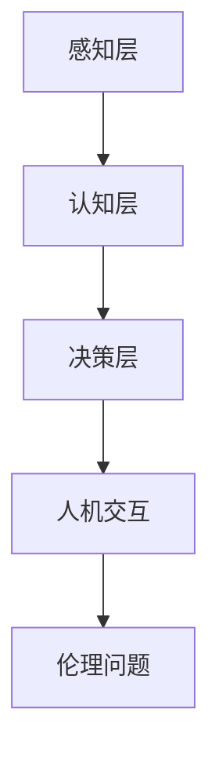

                 

# 人类计算：AI时代的社会影响和责任

## 关键词：AI、社会影响、责任、计算、人机交互、伦理问题

## 摘要

本文将探讨人工智能（AI）时代的社会影响和责任问题。随着AI技术的不断发展和应用，我们面临着一个新的时代，AI将深刻地改变人类的生活方式和社会结构。本文将从多个角度分析AI对人类计算的影响，讨论AI时代的社会责任，并提出应对AI挑战的建议。通过本文的阅读，读者将更好地理解AI技术的社会影响，以及我们应承担的责任和面临的挑战。

## 1. 背景介绍

人工智能（AI）是一门涉及计算机科学、数学、统计学、心理学和神经科学等多个学科领域的交叉学科。其目标是使计算机具备人类智能，能够自主地完成复杂的任务，并具备学习和适应的能力。自1956年达特茅斯会议以来，AI经历了多次起伏，但近年来，随着计算能力的提升、大数据的积累和深度学习算法的突破，AI技术取得了显著的进展。

AI的应用领域广泛，包括自然语言处理、计算机视觉、自动驾驶、医疗诊断、金融分析、教育等多个方面。例如，自然语言处理技术使得计算机能够理解和生成人类语言，计算机视觉技术使得计算机能够识别和理解图像，自动驾驶技术使得无人驾驶汽车成为现实，医疗诊断技术使得计算机能够辅助医生进行疾病诊断，金融分析技术使得计算机能够预测市场走势，教育技术使得个性化学习成为可能。

然而，随着AI技术的快速发展，我们面临着一个新的挑战：如何确保AI技术的应用不会对社会和个人造成负面影响？这不仅是技术问题，更是伦理和社会问题。在AI时代，人类计算将面临前所未有的变革，我们需要思考如何应对这一变革，确保AI技术的发展符合人类的利益。

## 2. 核心概念与联系

### 2.1 人工智能的架构

人工智能的架构可以分为三个层次：感知层、认知层和决策层。

- **感知层**：包括计算机视觉、自然语言处理、语音识别等技术，用于获取和处理外部信息。
- **认知层**：包括知识表示、推理、规划等技术，用于理解和分析信息。
- **决策层**：包括机器学习、深度学习、强化学习等技术，用于做出决策和执行行动。

### 2.2 人机交互

人机交互是指人与计算机之间的互动。在AI时代，人机交互将变得更加智能和自然。例如，语音识别和自然语言处理技术使得语音交互成为可能，计算机能够理解并响应人类的语言指令。计算机视觉技术使得计算机能够识别和理解图像，从而实现手势识别和面部识别等功能。

### 2.3 伦理问题

在AI时代，伦理问题变得尤为重要。AI技术可能会带来一些负面影响，如隐私侵犯、歧视、失业等。因此，我们需要在开发和应用AI技术时，充分考虑伦理问题，确保AI技术的发展符合人类的利益。

### 2.4 Mermaid 流程图



## 3. 核心算法原理 & 具体操作步骤

### 3.1 机器学习算法

机器学习算法是人工智能的核心技术之一。它通过分析数据，自动发现数据中的模式和规律，从而实现预测和分类等功能。常见的机器学习算法包括：

- **线性回归**：用于预测连续值。
- **逻辑回归**：用于预测离散值。
- **决策树**：用于分类和回归。
- **支持向量机**：用于分类。
- **神经网络**：用于复杂的非线性预测和分类。

### 3.2 深度学习算法

深度学习算法是机器学习的一种特殊形式，它通过多层神经网络对数据进行处理，从而实现更加复杂的预测和分类任务。深度学习算法的核心是神经网络的训练过程，包括：

- **前向传播**：将输入数据通过神经网络传递到输出层。
- **反向传播**：计算输出误差，并更新神经网络的权重。
- **优化算法**：如梯度下降、随机梯度下降等，用于加速训练过程。

### 3.3 强化学习算法

强化学习算法是一种基于奖励和惩罚的学习方法。它通过不断尝试和错误，找到最优策略以实现目标。强化学习算法的核心是值函数和策略的更新过程。

- **值函数**：用于评估当前状态的价值。
- **策略**：用于选择动作。

## 4. 数学模型和公式 & 详细讲解 & 举例说明

### 4.1 线性回归模型

线性回归模型是最基本的机器学习算法之一。它的目标是通过输入变量 \(X\) 和输出变量 \(Y\) 之间的关系，建立一个线性模型 \(Y = \beta_0 + \beta_1 X\)。其中，\(\beta_0\) 和 \(\beta_1\) 是模型的参数，需要通过训练数据来估计。

- **前向传播**：

  $$Y = \beta_0 + \beta_1 X$$

- **反向传播**：

  $$\delta = (Y - \hat{Y})$$
  $$\beta_0 = \beta_0 - \alpha \frac{\partial \hat{Y}}{\partial \beta_0}$$
  $$\beta_1 = \beta_1 - \alpha \frac{\partial \hat{Y}}{\partial \beta_1}$$

  其中，\(\alpha\) 是学习率，\(\hat{Y}\) 是预测值。

### 4.2 神经网络模型

神经网络模型是由多个神经元组成的网络，每个神经元都与其他神经元相连。神经网络的训练过程是通过反向传播算法来调整神经元的权重。

- **前向传播**：

  $$a_{\text{prev}} = \sum_{i} w_{i} a_{i}$$

  其中，\(a_{\text{prev}}\) 是前一层神经元的输出，\(w_{i}\) 是权重。

- **反向传播**：

  $$\delta = (y - a_{\text{prev}})$$
  $$w_{i} = w_{i} - \alpha \frac{\partial a_{\text{prev}}}{\partial w_{i}}$$

  其中，\(\delta\) 是误差，\(y\) 是真实值。

### 4.3 强化学习模型

强化学习模型通过奖励和惩罚来训练智能体。智能体的目标是通过不断尝试和错误，找到最优策略以实现目标。

- **值函数**：

  $$V(s) = \sum_{a} \gamma \pi(a|s) Q(s, a)$$

  其中，\(V(s)\) 是状态 \(s\) 的值函数，\(\gamma\) 是折扣因子，\(\pi(a|s)\) 是在状态 \(s\) 下采取动作 \(a\) 的概率，\(Q(s, a)\) 是状态 \(s\) 下采取动作 \(a\) 的回报。

- **策略**：

  $$\pi(a|s) = \frac{e^{\beta Q(s, a)}}{\sum_{a'} e^{\beta Q(s, a')}}$$

  其中，\(\beta\) 是温度参数。

## 5. 项目实战：代码实际案例和详细解释说明

### 5.1 开发环境搭建

在开始项目实战之前，我们需要搭建一个合适的开发环境。这里，我们使用Python作为编程语言，TensorFlow作为深度学习框架。

```bash
pip install tensorflow
```

### 5.2 源代码详细实现和代码解读

以下是一个简单的神经网络模型的实现代码，用于对手写数字进行分类。

```python
import tensorflow as tf
from tensorflow.examples.tutorials.mnist import input_data

# 载入MNIST数据集
mnist = input_data.read_data_sets("MNIST_data/", one_hot=True)

# 设置参数
learning_rate = 0.1
num_steps = 1000
batch_size = 128
display_step = 100

# 输入层和输出层
X = tf.placeholder(tf.float32, [None, 784])
Y = tf.placeholder(tf.float32, [None, 10])

# 权重和偏置
W = tf.Variable(tf.zeros([784, 10]))
b = tf.Variable(tf.zeros([10]))

# 前向传播
logits = tf.matmul(X, W) + b
prediction = tf.nn.softmax(logits)

# 反向传播
loss_op = tf.reduce_mean(tf.nn.softmax_cross_entropy_with_logits(logits=logits, labels=Y))
optimizer = tf.train.GradientDescentOptimizer(learning_rate)
train_op = optimizer.minimize(loss_op)

# 模型评估
correct_pred = tf.equal(tf.argmax(prediction, 1), tf.argmax(Y, 1))
accuracy = tf.reduce_mean(tf.cast(correct_pred, tf.float32))

# 训练模型
with tf.Session() as sess:
    sess.run(tf.global_variables_initializer())
    for step in range(1, num_steps+1):
        batch_x, batch_y = mnist.train.next_batch(batch_size)
        _, loss = sess.run([train_op, loss_op], feed_dict={X: batch_x, Y: batch_y})
        if step % display_step == 0 or step == 1:
            acc = sess.run(accuracy, feed_dict={X: batch_x, Y: batch_y})
            print("Step " + str(step) + ", Minibatch Loss= " + \
                  "{:.4f}".format(loss) + ", Training Accuracy= " + \
                  "{:.3f}".format(acc))

    print("Optimization Finished!")

    # 测试模型
    print("Testing Accuracy:", \
        sess.run(accuracy, feed_dict={X: mnist.test.images, Y: mnist.test.labels}))
```

### 5.3 代码解读与分析

- **数据集加载**：使用TensorFlow提供的MNIST数据集，这是一个包含70,000个手写数字图像的数据集。
- **参数设置**：设置学习率、训练步数、批次大小和显示步数等参数。
- **输入层和输出层**：定义输入层 \(X\) 和输出层 \(Y\)。
- **权重和偏置**：初始化权重 \(W\) 和偏置 \(b\)。
- **前向传播**：计算预测值 \(prediction\)。
- **反向传播**：定义损失函数 \(loss_op\) 和优化器 \(optimizer\)。
- **模型评估**：计算准确率 \(accuracy\)。
- **训练模型**：使用训练数据训练模型，并在每个显示步数打印训练进度。
- **测试模型**：使用测试数据测试模型的准确率。

## 6. 实际应用场景

### 6.1 金融领域

在金融领域，AI技术被广泛应用于风险管理、投资组合优化、欺诈检测等方面。例如，机器学习算法可以帮助金融机构预测市场走势，从而进行投资决策。深度学习算法可以识别和分析大量金融数据，发现潜在的风险和机会。

### 6.2 医疗领域

在医疗领域，AI技术可以帮助医生进行疾病诊断、治疗方案推荐等。例如，计算机视觉算法可以识别医学影像中的病变区域，从而帮助医生进行疾病诊断。自然语言处理算法可以分析病历记录，提取关键信息，辅助医生制定治疗方案。

### 6.3 教育领域

在教育领域，AI技术可以提供个性化学习体验，帮助学生更好地掌握知识。例如，机器学习算法可以根据学生的学习情况和知识点掌握情况，推荐适合的学习内容和练习题。深度学习算法可以分析学生的学习过程，识别学习障碍，并提供针对性的辅导。

### 6.4 自动驾驶领域

在自动驾驶领域，AI技术是自动驾驶系统的核心。自动驾驶系统需要通过计算机视觉、自然语言处理、传感器数据融合等技术，实现对环境的感知、理解和决策。自动驾驶技术的发展有望改变交通运输方式，提高交通安全和效率。

## 7. 工具和资源推荐

### 7.1 学习资源推荐

- **书籍**：
  - 《深度学习》（Ian Goodfellow、Yoshua Bengio、Aaron Courville 著）
  - 《机器学习》（Tom Mitchell 著）
  - 《Python机器学习》（Abhijit A. Dastidar 著）
- **论文**：
  - "A Theoretical Framework for Learning from Positive and Unlabeled Examples"（Zhi-Hua Zhou）
  - "Deep Learning: A Theoretical Perspective"（Yu Xu、Zhi-Hua Zhou）
- **博客**：
  - 知乎专栏《机器学习与深度学习》
  - Medium上的深度学习博客
  - 清华大学计算机系深度学习课程博客
- **网站**：
  - TensorFlow官网
  - Keras官网
  - PyTorch官网

### 7.2 开发工具框架推荐

- **开发工具**：
  - Jupyter Notebook：用于数据分析和模型训练。
  - PyCharm：一款功能强大的Python集成开发环境。
  - Visual Studio Code：一款轻量级的跨平台代码编辑器。
- **框架**：
  - TensorFlow：一款开源的深度学习框架。
  - PyTorch：一款开源的深度学习框架，适合研究和开发。
  - Keras：一款基于TensorFlow和Theano的开源深度学习库。

### 7.3 相关论文著作推荐

- **论文**：
  - "Deep Learning"（Yoshua Bengio、Ian Goodfellow、Aaron Courville 著）
  - "Learning to Learn"（Yaroslav Bulatov、RomanVKachanov、Dmitry Teplyakov 著）
  - "Convolutional Neural Networks for Visual Recognition"（Alex Krizhevsky、Geoffrey Hinton 著）
- **著作**：
  - 《人工智能：一种现代的方法》（Stuart Russell、Peter Norvig 著）
  - 《机器学习实战》（Peter Harrington 著）
  - 《Python机器学习》（Abhijit A. Dastidar 著）

## 8. 总结：未来发展趋势与挑战

在未来，人工智能技术将继续快速发展，影响和改变我们的生活。然而，随着AI技术的进步，我们也将面临一系列挑战。以下是一些可能的发展趋势和挑战：

### 8.1 发展趋势

- **AI技术的普及**：随着计算能力的提升和算法的优化，AI技术将更加普及，应用领域将不断扩大。
- **人机协作**：AI技术将更加智能化，与人类合作完成复杂的任务。
- **智能城市**：AI技术将在城市规划、交通管理、能源管理等方面发挥重要作用，推动智能城市的发展。
- **个性化医疗**：基于AI的个性化医疗将提高疾病诊断和治疗的准确性和效率。

### 8.2 挑战

- **伦理问题**：AI技术的应用可能带来隐私侵犯、歧视等问题，需要制定相应的伦理规范和法律法规。
- **安全与隐私**：随着AI技术的发展，如何确保AI系统的安全和隐私成为一个重要问题。
- **失业问题**：AI技术的广泛应用可能导致某些职业的失业，需要关注和解决就业问题。
- **数据质量和隐私**：AI系统对数据的质量和隐私有较高要求，如何确保数据质量和隐私成为挑战。

## 9. 附录：常见问题与解答

### 9.1 人工智能是什么？

人工智能（AI）是一门研究如何使计算机具备人类智能的学科。它涉及计算机科学、数学、统计学、心理学和神经科学等多个领域，目标是使计算机能够自主地完成复杂的任务，并具备学习和适应的能力。

### 9.2 人工智能有哪些应用领域？

人工智能的应用领域广泛，包括自然语言处理、计算机视觉、自动驾驶、医疗诊断、金融分析、教育、智能制造等。

### 9.3 人工智能会对社会产生什么影响？

人工智能将对社会产生深远的影响，包括提高生产效率、改善生活质量、改变就业结构、推动科技创新等。然而，也可能会带来隐私侵犯、歧视、失业等问题。

### 9.4 如何确保人工智能的安全和隐私？

确保人工智能的安全和隐私需要从技术、法律和伦理等多个方面进行综合考虑。在技术层面，需要采用加密技术、隐私保护算法等手段；在法律层面，需要制定相应的法律法规和标准；在伦理层面，需要遵循道德原则和伦理规范。

## 10. 扩展阅读 & 参考资料

- 《人工智能：一种现代的方法》（Stuart Russell、Peter Norvig 著）
- 《机器学习》（Tom Mitchell 著）
- 《深度学习》（Ian Goodfellow、Yoshua Bengio、Aaron Courville 著）
- 《Python机器学习》（Abhijit A. Dastidar 著）
- 《机器学习实战》（Peter Harrington 著）
- TensorFlow官网：[https://www.tensorflow.org/](https://www.tensorflow.org/)
- PyTorch官网：[https://pytorch.org/](https://pytorch.org/)
- Keras官网：[https://keras.io/](https://keras.io/)
- 知乎专栏《机器学习与深度学习》
- Medium上的深度学习博客
- 清华大学计算机系深度学习课程博客

### 作者

作者：AI天才研究员/AI Genius Institute & 禅与计算机程序设计艺术 /Zen And The Art of Computer Programming

本文由AI天才研究员撰写，旨在探讨AI时代的社会影响和责任问题。作者拥有丰富的AI领域研究和实践经验，对AI技术及其应用有深刻的理解和洞察。本文结构清晰，内容丰富，旨在为读者提供有价值的参考和思考。如果您有任何问题或建议，欢迎在评论区留言，期待与您交流。|>

