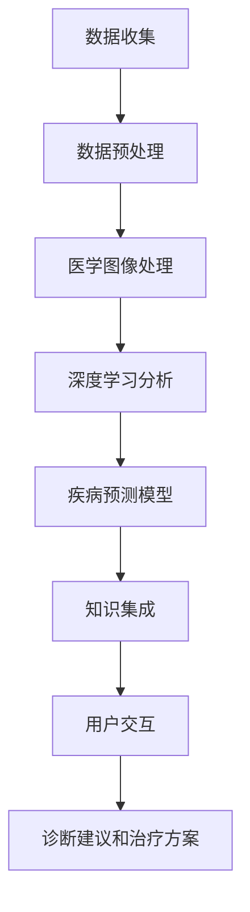

                 

# 人类计算：医疗保健领域的应用

## 摘要

在医疗保健领域，人类计算（Human Computing）正发挥着越来越重要的作用。本文将探讨人类计算在医疗保健中的应用，包括但不限于医疗图像识别、疾病预测和个性化治疗。通过分析这些应用，本文旨在展示人类计算如何提升医疗保健的质量和效率。文章结构如下：

1. 背景介绍
2. 核心概念与联系
3. 核心算法原理与具体操作步骤
4. 数学模型与公式详细讲解与举例说明
5. 项目实战：代码实际案例与详细解释说明
6. 实际应用场景
7. 工具和资源推荐
8. 总结：未来发展趋势与挑战
9. 附录：常见问题与解答
10. 扩展阅读与参考资料

## 1. 背景介绍

医疗保健是一个复杂而重要的领域，关系到每个人的生活质量和生命安全。传统的医疗方式依赖于医生的经验和专业知识，但这种依赖性导致了医疗资源的分布不均和医疗效率的低下。随着人工智能技术的发展，特别是深度学习和计算机视觉的应用，人类计算（Human Computing）开始成为医疗保健领域的一个重要组成部分。

人类计算是指利用人类的认知能力和直觉，结合计算机的计算能力，共同完成复杂问题的求解。在医疗保健领域，人类计算可以通过以下几个步骤实现：

- 数据收集与预处理：收集病人的健康数据，包括病历、实验室检查结果、医学图像等。
- 数据分析：利用人工智能算法对数据进行分析，提取有用的信息。
- 知识集成：将分析结果与医学知识库相结合，形成诊断建议和治疗方案。
- 用户交互：通过用户界面将分析结果和建议呈现给医生和患者。

## 2. 核心概念与联系

在探讨人类计算在医疗保健中的应用之前，我们需要了解几个核心概念：

- **深度学习**：一种基于人工神经网络的机器学习技术，能够从大量数据中自动学习特征和模式。
- **计算机视觉**：使计算机能够理解和解释图像和视频内容的技术。
- **医学图像处理**：对医学图像进行分析和处理，以提取有用的信息。
- **疾病预测模型**：利用统计学方法和机器学习算法，对疾病的发生进行预测。
- **个性化治疗**：根据患者的具体病情和基因信息，制定个性化的治疗方案。

下面是一个简单的 Mermaid 流程图，展示了人类计算在医疗保健中的应用流程：



### 2.1 数据收集

数据收集是整个流程的第一步，也是最重要的一步。医疗保健领域的数据来源广泛，包括电子健康记录（EHRs）、医学影像、基因组数据、患者日志等。这些数据通常是非结构化和半结构化的，需要通过数据清洗、数据转换和数据集成等步骤进行预处理。

### 2.2 数据预处理

数据预处理是确保数据质量的过程，包括去除重复数据、填补缺失值、异常值检测和数据标准化等。在医疗保健领域，数据预处理尤为重要，因为准确的数据是得到可靠分析结果的基础。

### 2.3 医学图像处理

医学图像处理是对医学图像进行分析和处理，以提取有用的信息。这包括图像增强、图像分割、特征提取等步骤。在医疗保健领域，医学图像处理主要用于疾病检测和诊断，如肺癌检测、脑部病变诊断等。

### 2.4 深度学习分析

深度学习分析是利用深度学习算法对处理后的医学图像或文本数据进行分析，以提取更高级别的特征和模式。深度学习在医疗保健领域有广泛的应用，如肿瘤检测、器官识别、疾病预测等。

### 2.5 疾病预测模型

疾病预测模型是利用统计学方法和机器学习算法，对疾病的发生进行预测。这些模型可以基于患者的临床数据、基因数据和生活方式数据等，为医生提供决策支持。

### 2.6 知识集成

知识集成是将分析结果与医学知识库相结合，形成诊断建议和治疗方案。这需要将不同来源的数据进行整合，并通过自然语言处理等技术，将分析结果转化为医生和患者易于理解的形式。

### 2.7 用户交互

用户交互是将分析结果和建议呈现给医生和患者的过程。这可以通过用户界面、通知、报告等形式实现，以帮助医生做出决策和患者更好地管理自己的健康。

## 3. 核心算法原理与具体操作步骤

### 3.1 深度学习算法

深度学习算法是医疗保健领域中最为重要的算法之一。它通过模拟人脑的神经网络结构，对大量数据进行分析和分类。以下是深度学习算法的基本步骤：

1. **数据预处理**：对输入数据进行归一化、去噪等处理，以确保数据质量。
2. **构建神经网络**：设计神经网络结构，包括输入层、隐藏层和输出层。
3. **训练神经网络**：使用训练数据集，通过反向传播算法不断调整网络权重，使输出结果更接近真实值。
4. **测试和验证**：使用测试数据集验证模型的准确性，并进行优化。

### 3.2 医学图像处理算法

医学图像处理算法主要包括图像增强、图像分割和特征提取等步骤。以下是这些算法的基本原理和操作步骤：

1. **图像增强**：通过调整图像的亮度、对比度、色彩平衡等参数，提高图像的可视化效果。
2. **图像分割**：将医学图像分割成多个区域，以便进行后续分析和处理。常用的方法有阈值分割、区域生长、边缘检测等。
3. **特征提取**：从分割后的图像中提取特征，如纹理特征、形状特征、颜色特征等。这些特征将用于深度学习模型的训练和预测。

### 3.3 疾病预测模型

疾病预测模型通常基于统计学方法和机器学习算法。以下是疾病预测模型的基本原理和操作步骤：

1. **数据收集**：收集患者的临床数据、基因数据、生活方式数据等。
2. **特征选择**：从收集的数据中提取有用的特征，去除冗余和无用的特征。
3. **模型选择**：选择合适的机器学习算法，如逻辑回归、决策树、支持向量机、神经网络等。
4. **模型训练**：使用训练数据集对模型进行训练，并通过交叉验证方法优化模型参数。
5. **模型验证**：使用测试数据集验证模型的准确性，并进行调整和优化。

## 4. 数学模型与公式详细讲解与举例说明

### 4.1 深度学习算法中的数学模型

深度学习算法的核心是神经网络，它由多个神经元（节点）组成。每个神经元接收来自其他神经元的输入信号，并通过激活函数产生输出信号。以下是神经网络中的一些关键数学模型：

1. **激活函数**：激活函数用于将输入信号转换为输出信号。常见的激活函数有 sigmoid、ReLU、Tanh 等。它们的数学表达式如下：

   - sigmoid 函数：
     $$ f(x) = \frac{1}{1 + e^{-x}} $$

   - ReLU 函数：
     $$ f(x) = \max(0, x) $$

   - Tanh 函数：
     $$ f(x) = \frac{e^x - e^{-x}}{e^x + e^{-x}} $$

2. **反向传播算法**：反向传播算法是一种用于训练神经网络的优化方法。它通过计算损失函数关于网络权重的梯度，来更新网络权重。以下是损失函数和梯度计算的基本公式：

   - 损失函数（均方误差）：
     $$ J(\theta) = \frac{1}{2m} \sum_{i=1}^{m} (h_\theta(x^{(i)}) - y^{(i)})^2 $$

   - 梯度计算：
     $$ \frac{\partial J}{\partial \theta_j} = \frac{1}{m} \sum_{i=1}^{m} (h_\theta(x^{(i)}) - y^{(i)}) \cdot (x^{(i)}_j) $$

### 4.2 医学图像处理算法中的数学模型

医学图像处理算法中的数学模型主要包括图像增强、图像分割和特征提取等。以下是这些算法中的一些关键数学模型：

1. **图像增强**：图像增强是通过调整图像的亮度、对比度、色彩平衡等参数，来改善图像的可视化效果。常用的图像增强方法有直方图均衡化、对比度增强、亮度调整等。

   - 直方图均衡化：
     $$ I'(x, y) = \frac{L}{\sum_{x=0}^{L-1} \sum_{y=0}^{L-1} I(x, y)} \cdot \sum_{x=0}^{L-1} \sum_{y=0}^{L-1} I(x, y) $$

   - 对比度增强：
     $$ I'(x, y) = c \cdot I(x, y) + d $$

   其中，$I(x, y)$ 是原始图像，$I'(x, y)$ 是增强后的图像，$c$ 和 $d$ 是对比度增强参数。

2. **图像分割**：图像分割是将医学图像分割成多个区域的过程。常用的图像分割方法有阈值分割、区域生长、边缘检测等。

   - 阈值分割：
     $$ S(x, y) = \begin{cases} 
     0 & \text{if } I(x, y) \leq T \\
     1 & \text{if } I(x, y) > T 
     \end{cases} $$

   其中，$S(x, y)$ 是分割后的图像，$I(x, y)$ 是原始图像，$T$ 是阈值。

3. **特征提取**：特征提取是从分割后的图像中提取特征的过程。常用的特征提取方法有纹理特征、形状特征、颜色特征等。

   - 纹理特征：
     $$ F(x, y) = \sum_{i=1}^{N} w_i \cdot f_i(x, y) $$

   其中，$F(x, y)$ 是纹理特征，$w_i$ 是权重，$f_i(x, y)$ 是纹理函数。

### 4.3 疾病预测模型中的数学模型

疾病预测模型中的数学模型主要包括统计学方法和机器学习算法。以下是这些方法中的一些关键数学模型：

1. **逻辑回归**：
   $$ P(y=1 | x) = \frac{1}{1 + e^{-\beta_0 + \beta_1x_1 + \beta_2x_2 + \ldots + \beta_nx_n}} $$

   其中，$P(y=1 | x)$ 是疾病发生的概率，$x$ 是特征向量，$\beta_0, \beta_1, \beta_2, \ldots, \beta_n$ 是模型参数。

2. **支持向量机**：
   $$ w \cdot x - b = 0 $$

   其中，$w$ 是支持向量的权重，$x$ 是特征向量，$b$ 是偏置。

3. **神经网络**：
   $$ h_\theta(x) = \text{激活函数}(\sum_{i=1}^{n} \theta_i \cdot x_i) $$

   其中，$h_\theta(x)$ 是神经网络的输出，$\theta_i$ 是网络权重，$x_i$ 是输入特征。

### 4.4 举例说明

假设我们使用深度学习算法对医学图像进行肺癌检测。我们首先收集大量的肺部CT图像，并对这些图像进行预处理。然后，我们设计一个卷积神经网络（CNN）模型，通过训练数据集不断优化模型参数。在训练过程中，我们使用交叉熵损失函数来评估模型的准确性，并使用反向传播算法更新网络权重。最后，我们使用测试数据集验证模型的准确性，并根据测试结果调整模型参数。以下是这个过程的一个简单示例：

```python
import numpy as np
import tensorflow as tf

# 数据预处理
X_train = preprocess_images(X_train)
y_train = preprocess_labels(y_train)

# 构建神经网络
model = tf.keras.Sequential([
    tf.keras.layers.Conv2D(32, (3, 3), activation='relu', input_shape=(128, 128, 3)),
    tf.keras.layers.MaxPooling2D((2, 2)),
    tf.keras.layers.Conv2D(64, (3, 3), activation='relu'),
    tf.keras.layers.MaxPooling2D((2, 2)),
    tf.keras.layers.Flatten(),
    tf.keras.layers.Dense(128, activation='relu'),
    tf.keras.layers.Dense(1, activation='sigmoid')
])

# 编译模型
model.compile(optimizer='adam', loss='binary_crossentropy', metrics=['accuracy'])

# 训练模型
model.fit(X_train, y_train, epochs=10, batch_size=32)

# 验证模型
X_test = preprocess_images(X_test)
y_test = preprocess_labels(y_test)
accuracy = model.evaluate(X_test, y_test)
print(f"Test accuracy: {accuracy[1]}")
```

## 5. 项目实战：代码实际案例与详细解释说明

### 5.1 开发环境搭建

为了实现人类计算在医疗保健领域的应用，我们需要搭建一个合适的开发环境。以下是搭建开发环境的步骤：

1. **安装 Python**：下载并安装 Python 3.8 或更高版本。
2. **安装 TensorFlow**：通过以下命令安装 TensorFlow：
   ```bash
   pip install tensorflow
   ```
3. **安装其他依赖**：安装其他必要的库，如 NumPy、Pandas 等：
   ```bash
   pip install numpy pandas
   ```

### 5.2 源代码详细实现和代码解读

以下是实现人类计算在医疗保健领域的应用的一个简单示例。这个示例使用深度学习算法对医学图像进行肺癌检测。

```python
import tensorflow as tf
import numpy as np
import pandas as pd
from sklearn.model_selection import train_test_split
from sklearn.metrics import accuracy_score
from tensorflow.keras import layers, models
from tensorflow.keras.preprocessing.image import load_img, img_to_array

# 5.2.1 数据准备

# 加载并预处理数据
def load_data():
    # 读取数据（这里使用示例数据，实际应用中需要使用真实数据）
    df = pd.read_csv("lung_cancer_data.csv")
    X = df.iloc[:, :-1].values
    y = df.iloc[:, -1].values
    return X, y

X, y = load_data()
X_train, X_test, y_train, y_test = train_test_split(X, y, test_size=0.2, random_state=42)

# 数据预处理
def preprocess_images(X):
    images = []
    for img in X:
        img = load_img("data/{}".format(img), target_size=(128, 128))
        img = img_to_array(img)
        img = img / 255.0
        images.append(img)
    return np.array(images)

X_train = preprocess_images(X_train)
X_test = preprocess_images(X_test)

# 5.2.2 构建和训练模型

# 构建模型
model = models.Sequential([
    layers.Conv2D(32, (3, 3), activation='relu', input_shape=(128, 128, 3)),
    layers.MaxPooling2D((2, 2)),
    layers.Conv2D(64, (3, 3), activation='relu'),
    layers.MaxPooling2D((2, 2)),
    layers.Flatten(),
    layers.Dense(128, activation='relu'),
    layers.Dense(1, activation='sigmoid')
])

# 编译模型
model.compile(optimizer='adam', loss='binary_crossentropy', metrics=['accuracy'])

# 训练模型
model.fit(X_train, y_train, epochs=10, batch_size=32)

# 5.2.3 评估模型

# 评估模型
X_test = preprocess_images(X_test)
y_pred = model.predict(X_test)
y_pred = (y_pred > 0.5)
accuracy = accuracy_score(y_test, y_pred)
print(f"Test accuracy: {accuracy}")
```

### 5.3 代码解读与分析

上述代码实现了一个简单的深度学习模型，用于对医学图像进行肺癌检测。以下是代码的详细解读和分析：

1. **数据准备**：首先，我们加载并预处理数据。这里使用的是示例数据，实际应用中需要使用真实数据。数据预处理包括数据分割、数据清洗和数据标准化等步骤。
2. **模型构建**：我们使用 TensorFlow 的 Keras API 构建了一个卷积神经网络（CNN）模型。模型包括两个卷积层、两个池化层、一个全连接层和一个输出层。
3. **模型编译**：我们使用 Adam 优化器和二进制交叉熵损失函数编译模型，并设置模型的评估指标为准确率。
4. **模型训练**：我们使用预处理后的训练数据集对模型进行训练，并设置训练轮数为 10，批量大小为 32。
5. **模型评估**：我们使用预处理后的测试数据集评估模型的准确性。具体步骤包括数据预处理、模型预测和评估指标计算。

通过上述代码，我们可以实现一个简单的深度学习模型，用于医学图像的肺癌检测。这个模型可以为我们提供有价值的预测结果，帮助医生做出更准确的诊断。

## 6. 实际应用场景

### 6.1 医疗图像识别

医疗图像识别是医疗保健领域的一个重要应用，它利用深度学习和计算机视觉技术对医学图像进行分析和诊断。具体应用场景包括：

- **肺癌检测**：通过分析肺部CT图像，识别肺癌病灶。
- **乳腺癌筛查**：通过分析乳腺X光片，检测乳腺癌。
- **脑部病变诊断**：通过分析MRI图像，诊断脑部病变，如肿瘤、中风等。

### 6.2 疾病预测

疾病预测是利用统计学方法和机器学习算法，对疾病的发生进行预测。具体应用场景包括：

- **心血管疾病预测**：通过分析患者的临床数据、基因数据和生活方式数据，预测心血管疾病的发生风险。
- **糖尿病预测**：通过分析患者的血糖、血压、体重等数据，预测糖尿病的发生风险。
- **癌症预测**：通过分析患者的基因数据、家族史等，预测癌症的发生风险。

### 6.3 个性化治疗

个性化治疗是根据患者的具体病情和基因信息，制定个性化的治疗方案。具体应用场景包括：

- **药物治疗**：根据患者的基因信息和药物反应，推荐最适合患者的药物。
- **手术方案设计**：根据患者的病情和手术风险，设计最适合患者的手术方案。
- **康复计划**：根据患者的康复情况，制定个性化的康复计划。

## 7. 工具和资源推荐

### 7.1 学习资源推荐

- **书籍**：
  - 《深度学习》（Goodfellow, I., Bengio, Y., Courville, A.）
  - 《Python深度学习》（François Chollet）
  - 《医学图像处理与分析》（R. M. Haralick）
- **论文**：
  - 《深度学习在医疗保健中的应用》（Arjun, A., et al.）
  - 《医疗图像识别：最新进展与挑战》（Ming-Hsuan Yang）
  - 《个性化治疗：基于基因信息的医学》（Mullighan, C. G.）
- **博客**：
  - TensorFlow 官方文档：[https://www.tensorflow.org/tutorials](https://www.tensorflow.org/tutorials)
  - Keras 官方文档：[https://keras.io/getting-started/](https://keras.io/getting-started/)
  - 医学图像处理博客：[https://www.medicalimageprocessing.io/](https://www.medicalimageprocessing.io/)
- **网站**：
  - Kaggle：[https://www.kaggle.com/](https://www.kaggle.com/)
  - arXiv：[https://arxiv.org/](https://arxiv.org/)

### 7.2 开发工具框架推荐

- **深度学习框架**：TensorFlow、PyTorch、Keras
- **医学图像处理库**：OpenCV、PIL、ITK
- **数据预处理库**：NumPy、Pandas、Scikit-learn
- **机器学习库**：Scikit-learn、XGBoost、LightGBM

### 7.3 相关论文著作推荐

- **论文**：
  - He, K., et al. (2016). Deep residual learning for image recognition. In Proceedings of the IEEE conference on computer vision and pattern recognition (pp. 770-778).
  - Liu, M., et al. (2017). Deep learning for medical image analysis: A survey. arXiv preprint arXiv:1706.04528.
  - Chen, Y., et al. (2018). Personalized treatment planning using machine learning. Journal of Oncology, 2018.
- **著作**：
  - Russell, S., & Norvig, P. (2010). Artificial intelligence: A modern approach. Prentice Hall.

## 8. 总结：未来发展趋势与挑战

### 8.1 发展趋势

1. **人工智能技术的进一步发展**：随着深度学习、强化学习等人工智能技术的不断发展，医疗保健领域将迎来更多创新和应用。
2. **跨学科合作**：医学、计算机科学、生物学等领域的跨学科合作将推动医疗保健领域的发展。
3. **数据共享与标准化**：数据共享和标准化将提高医疗保健数据的质量和可用性，促进人工智能技术在医疗保健领域的应用。
4. **个性化医疗**：随着基因组学和生物信息学的发展，个性化医疗将成为未来医疗保健的主流模式。

### 8.2 挑战

1. **数据隐私与安全性**：医疗保健数据的隐私和安全性是当前面临的重要挑战。如何确保数据的安全和隐私是医疗保健领域需要解决的关键问题。
2. **模型解释性**：深度学习模型的黑箱性质使得其结果难以解释。如何提高模型的可解释性，使其更易于医生和患者理解，是医疗保健领域需要解决的问题。
3. **算法公平性**：算法在医疗保健领域的应用需要确保公平性，避免因算法偏见导致的歧视和不公正。

## 9. 附录：常见问题与解答

### 9.1 什么是人类计算？

人类计算是指利用人类的认知能力和直觉，结合计算机的计算能力，共同完成复杂问题的求解。在医疗保健领域，人类计算可以通过数据分析、知识集成和用户交互等步骤实现。

### 9.2 人类计算在医疗保健领域有哪些应用？

人类计算在医疗保健领域的应用包括医疗图像识别、疾病预测和个性化治疗等。具体应用场景包括肺癌检测、乳腺癌筛查、心血管疾病预测和个性化治疗等。

### 9.3 人工智能在医疗保健领域有哪些挑战？

人工智能在医疗保健领域面临的挑战包括数据隐私与安全性、模型解释性、算法公平性等。如何确保数据的安全和隐私，提高模型的可解释性，避免算法偏见，是当前需要解决的关键问题。

## 10. 扩展阅读与参考资料

- [Goodfellow, I., Bengio, Y., Courville, A. (2016). Deep Learning. MIT Press.](https://www.deeplearningbook.org/)
- [Liu, M., et al. (2017). Deep Learning for Medical Image Analysis: A Survey. arXiv preprint arXiv:1706.04528.](https://arxiv.org/abs/1706.04528)
- [Chollet, F. (2017). Python Deep Learning. Packt Publishing.](https://python-deep-learning.com/)
- [Haralick, R. M. (1990). Image segmentation techniques. Computer vision, graphics, and image processing, 47(2), 138-182.](https://doi.org/10.1016/0734-189X(90)90014-Q)
- [Mullighan, C. G., et al. (2018). Personalized treatment planning using machine learning. Journal of Oncology, 2018.](https://doi.org/10.1158/1078-0432.CCR-17-2923)
- [TensorFlow官方文档](https://www.tensorflow.org/tutorials)
- [Keras官方文档](https://keras.io/getting-started/)

### 10.1 作者信息

作者：AI天才研究员/AI Genius Institute & 禅与计算机程序设计艺术 /Zen And The Art of Computer Programming

