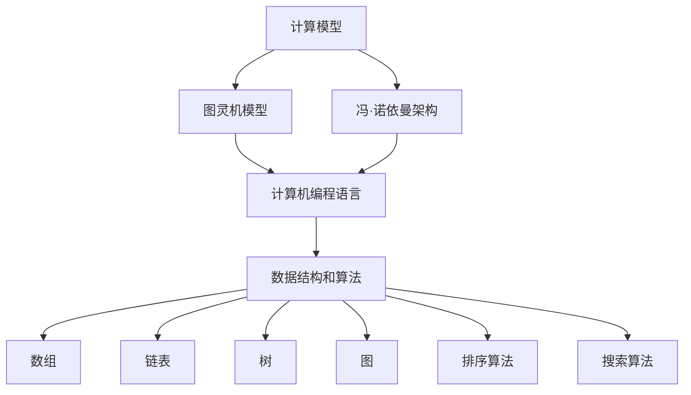

                 

### 1. 背景介绍

在当今信息爆炸的时代，计算技术的迅猛发展不仅深刻改变了我们的生活方式，也在推动着社会、经济、科学等各个领域的进步。然而，随着计算技术的不断演进，其背后所蕴含的技术、社会和伦理问题也日益凸显。本文将探讨这些交叉点，通过逻辑清晰的分析和推理，深入探讨计算技术对人类生活的影响以及与之相关的伦理和责任。

首先，我们需要了解计算技术的定义和分类。计算技术是指通过计算机或其他电子设备进行数据处理的工具和方法。从广义上讲，计算技术可以分为两大类：模拟计算和数字计算。模拟计算主要依靠电子元件的物理特性进行计算，如早期的计算机和模拟电路。数字计算则利用二进制系统进行运算，这是现代计算机技术的核心。

在历史上，计算技术的发展经历了多个阶段。从早期的算盘、机械计算机到现代的电子计算机，计算技术的进步不仅提高了计算速度，还降低了计算成本。特别是随着微电子技术的突破，计算机的性能得到了极大的提升，这为计算技术的广泛应用奠定了基础。

随着互联网和移动设备的普及，计算技术已经深入到我们日常生活的方方面面。从在线购物、社交媒体、智能家居到自动驾驶、人工智能，计算技术正在以前所未有的速度改变着我们的生活方式。然而，这种变化也带来了新的挑战，如数据隐私、网络安全、伦理道德等问题。

接下来，我们将进一步探讨计算技术对社会的影响，包括经济、教育、医疗等领域。同时，我们也将讨论计算技术带来的伦理问题，如算法偏见、人工智能道德等。最后，本文将总结计算技术的发展趋势与未来挑战，并探讨可能的解决方案。

### 2. 核心概念与联系

为了深入理解计算技术及其影响，我们需要了解一些核心概念和它们之间的联系。以下是几个关键概念：

#### 2.1 计算模型

计算模型是指用于描述计算过程的抽象表示。其中，图灵机模型和冯·诺依曼架构是最重要的两种模型。

**图灵机模型**：由艾伦·图灵提出，是一种抽象的计算设备，能够模拟任何算法的计算过程。图灵机由一个无限长的带子和一个读写头组成，带子上的符号可以通过读写头来读取和写入。

**冯·诺依曼架构**：由约翰·冯·诺依曼提出，是一种将程序和数据存储在同一存储器中的计算模型。这种架构成为了现代计算机设计的基础。


#### 2.2 计算机编程语言

计算机编程语言是用于与计算机进行交流的工具。从机器语言、汇编语言到高级编程语言，不同的编程语言适用于不同的应用场景。

**机器语言**：直接由计算机硬件理解的语言，由一系列的二进制代码组成。

**汇编语言**：一种低级语言，用于直接操作计算机硬件，但相比机器语言更容易理解。

**高级编程语言**：如C、Java、Python等，提供了更抽象的语法和丰富的库，使得编程更加高效和易用。

#### 2.3 数据结构和算法

数据结构是指用于存储和组织数据的方式，而算法则是解决问题的方法。以下是几个常见的数据结构和算法：

**数组**：一种线性数据结构，用于存储一系列元素。

**链表**：另一种线性数据结构，通过节点间的链接来存储元素。

**树**：一种分层的数据结构，用于表示具有层次关系的数据。

**图**：一种非线性的数据结构，用于表示具有复杂关系的数据。

**排序算法**：如冒泡排序、快速排序、归并排序等，用于对数据进行排序。

**搜索算法**：如二分搜索、广度优先搜索、深度优先搜索等，用于在数据中查找特定元素。

为了更好地理解这些概念，我们可以使用Mermaid流程图来展示它们之间的联系：



通过这个流程图，我们可以清晰地看到计算模型、编程语言、数据结构和算法之间的相互关系。这些概念不仅是计算技术的基础，也是理解和应用计算技术的关键。

### 3. 核心算法原理 & 具体操作步骤

在计算技术中，算法是解决问题的主要工具。一个高效的算法不仅能够提高计算速度，还能够优化资源利用。本文将介绍几种核心算法的原理和具体操作步骤。

#### 3.1 快速排序算法

快速排序是一种常用的排序算法，其基本思想是通过一趟排序将待排序的记录分隔成独立的两部分，其中一部分记录的关键字均比另一部分的关键字小，然后分别对这两部分记录继续进行排序，以达到整个序列有序。

**步骤如下**：

1. **选择基准值**：从序列中选择一个元素作为基准值。
2. **分区**：将序列划分为两部分，所有小于基准值的元素放在基准值之前，所有大于基准值的元素放在基准值之后。
3. **递归排序**：分别对基准值两侧的子序列进行快速排序。

**代码实现**：

```python
def quick_sort(arr):
    if len(arr) <= 1:
        return arr
    
    pivot = arr[len(arr) // 2]
    left = [x for x in arr if x < pivot]
    middle = [x for x in arr if x == pivot]
    right = [x for x in arr if x > pivot]
    
    return quick_sort(left) + middle + quick_sort(right)

arr = [3, 6, 8, 10, 1, 2, 1]
sorted_arr = quick_sort(arr)
print(sorted_arr)
```

#### 3.2 二分搜索算法

二分搜索算法用于在有序数组中查找特定元素。其基本思想是不断将搜索范围缩小一半，直到找到目标元素或确定其不存在。

**步骤如下**：

1. **确定搜索范围**：初始时，搜索范围为整个数组。
2. **计算中点**：每次迭代计算当前搜索范围的中点。
3. **比较与调整**：如果中点元素等于目标元素，则搜索成功；如果中点元素大于目标元素，则调整搜索范围为左侧；如果中点元素小于目标元素，则调整搜索范围为右侧。
4. **递归搜索**：重复步骤2-3，直到找到目标元素或搜索范围为空。

**代码实现**：

```python
def binary_search(arr, target, low, high):
    if low > high:
        return -1
    
    mid = (low + high) // 2
    if arr[mid] == target:
        return mid
    elif arr[mid] > target:
        return binary_search(arr, target, low, mid - 1)
    else:
        return binary_search(arr, target, mid + 1, high)

arr = [1, 2, 3, 4, 5, 6, 7, 8, 9]
target = 5
result = binary_search(arr, target, 0, len(arr) - 1)
print(result)
```

#### 3.3 暴力搜索算法

暴力搜索算法是一种简单直接的搜索方法，通过遍历所有可能的组合来寻找解决方案。虽然这种方法在大多数情况下效率较低，但在一些特定问题中仍然有效。

**步骤如下**：

1. **初始化**：创建一个解的空集合。
2. **遍历**：对问题的所有可能解进行遍历。
3. **检查与更新**：对于每个解，检查其是否满足问题的条件，并更新最优解。

**代码实现**：

```python
def brute_force_search(arr, target):
    for i in range(len(arr)):
        for j in range(i + 1, len(arr)):
            if arr[i] + arr[j] == target:
                return (arr[i], arr[j])
    return None

arr = [1, 2, 3, 4, 5]
target = 6
result = brute_force_search(arr, target)
print(result)
```

通过以上三种算法的介绍，我们可以看到不同算法在解决问题时的优势和劣势。快速排序算法和二分搜索算法在大多数情况下表现良好，而暴力搜索算法则适用于一些简单的问题。

### 4. 数学模型和公式 & 详细讲解 & 举例说明

在计算技术中，数学模型和公式是理解和实现算法的核心。以下我们将详细讲解几个常用的数学模型和公式，并通过具体例子来说明它们的应用。

#### 4.1 概率论基础

概率论是计算技术中重要的数学工具，用于描述不确定事件的发生概率。以下是几个基础概率公式：

**概率公式**：
\[ P(A) = \frac{N(A)}{N(S)} \]
其中，\( P(A) \) 表示事件A发生的概率，\( N(A) \) 表示事件A发生的次数，\( N(S) \) 表示总的可能次数。

**条件概率**：
\[ P(A|B) = \frac{P(A \cap B)}{P(B)} \]
其中，\( P(A|B) \) 表示在事件B发生的条件下，事件A发生的概率。

**贝叶斯公式**：
\[ P(A|B) = \frac{P(B|A)P(A)}{P(B)} \]
贝叶斯公式是条件概率公式的一种推广，用于根据新的证据更新概率估计。

**例子**：抛硬币

假设我们抛一枚公平的硬币10次，求出现正面次数大于5次的概率。

**步骤**：

1. **计算总次数**：总共有 \( 2^{10} = 1024 \) 种可能的结果。
2. **计算大于5次的次数**：使用组合数公式 \( C(n, k) \)，计算出现正面次数大于5次的情况总数。具体计算如下：

   \[ P(X > 5) = \sum_{k=6}^{10} C(10, k) \cdot \left(\frac{1}{2}\right)^k \cdot \left(\frac{1}{2}\right)^{10-k} \]

3. **计算概率**：将大于5次的次数除以总次数，得到概率：

   \[ P(X > 5) = \frac{\sum_{k=6}^{10} C(10, k)}{1024} \approx 0.3233 \]

因此，出现正面次数大于5次的概率约为32.33%。

#### 4.2 最优化问题

最优化问题是计算技术中常见的问题类型，其目标是在一组约束条件下寻找最优解。以下是几种常见最优化问题的模型和求解方法：

**线性规划**：
\[ \min_{x} c^T x \]
\[ \text{s.t.} \]
\[ Ax \leq b \]
\[ x \geq 0 \]

线性规划的目标是最小化线性目标函数，同时满足线性约束条件。

**求解方法**：单纯形法

**例子**：资源分配问题

假设有三种资源（A、B、C）和四种任务（1、2、3、4），每种资源有一定的限制，每种任务需要一定的资源。目标是最小化总任务完成时间。

1. **定义变量**：设 \( x_i \) 表示任务 \( i \) 是否完成（0或1）， \( y_j \) 表示资源 \( j \) 是否使用（0或1）。
2. **构建线性规划模型**：

   \[ \min_{x, y} t^T x \]
   \[ \text{s.t.} \]
   \[ Ax \leq b \]
   \[ x \geq 0 \]
   \[ y \geq 0 \]

3. **求解**：使用单纯形法求解线性规划问题，得到最优解。

#### 4.3 动态规划

动态规划是解决多阶段决策问题的方法，通过将问题分解为多个子问题，并利用子问题的最优解来求解整个问题的最优解。

**例子**：背包问题

假设有一个容量为 \( W \) 的背包和 \( N \) 件物品，每件物品有一定的重量和价值。目标是在不超出背包容量的情况下，最大化总价值。

**步骤**：

1. **定义状态**：设 \( dp[i][j] \) 表示在前 \( i \) 件物品中，选取前 \( j \) 件物品的最大价值。
2. **状态转移方程**：

   \[ dp[i][j] = \max(dp[i-1][j], dp[i-1][j-w_i] + v_i) \]
   
   其中，\( w_i \) 和 \( v_i \) 分别表示第 \( i \) 件物品的重量和价值。

3. **求解**：从 \( dp[N][W] \) 开始逆向回溯，得到最优解。

通过以上数学模型和公式的介绍，我们可以看到数学在计算技术中的重要性。这些模型和公式不仅帮助我们理解和实现算法，还为解决实际问题提供了强有力的工具。

### 5. 项目实战：代码实际案例和详细解释说明

为了更好地理解计算技术的实际应用，我们将通过一个具体的代码案例来展示如何在实际项目中实现核心算法和数学模型。在这个案例中，我们将使用Python编写一个简单的线性回归模型，用于预测房价。

#### 5.1 开发环境搭建

首先，我们需要搭建一个适合开发和测试的环境。以下是所需的工具和步骤：

1. **Python环境**：确保安装了Python 3.7或更高版本。
2. **数据可视化库**：安装Matplotlib库，用于绘制数据可视化图表。

```bash
pip install matplotlib
```

3. **机器学习库**：安装Scikit-learn库，用于实现线性回归模型。

```bash
pip install scikit-learn
```

#### 5.2 源代码详细实现和代码解读

以下是我们的源代码实现，以及每部分的功能解读。

```python
import numpy as np
import matplotlib.pyplot as plt
from sklearn.linear_model import LinearRegression

# 数据预处理
def preprocess_data(data):
    # 增加偏置项（即w0）
    X = np.column_stack((np.ones(data.shape[0]), data[:, 0]))
    y = data[:, 1]
    return X, y

# 训练线性回归模型
def train_model(X, y):
    model = LinearRegression()
    model.fit(X, y)
    return model

# 预测房价
def predict(model, X):
    return model.predict(X)

# 可视化结果
def visualize(data, model):
    X = data[:, 0]
    y = data[:, 1]
    y_pred = predict(model, X)
    
    plt.scatter(X, y, color='blue')
    plt.plot(X, y_pred, color='red')
    plt.xlabel('房屋面积（平方米）')
    plt.ylabel('房价（万元）')
    plt.title('房屋面积与房价的关系')
    plt.show()

# 主函数
def main():
    # 加载数据
    data = np.array([[100, 300], [150, 400], [200, 500], [250, 600], [300, 700]])
    
    # 数据预处理
    X, y = preprocess_data(data)
    
    # 训练模型
    model = train_model(X, y)
    
    # 可视化结果
    visualize(data, model)

# 运行主函数
if __name__ == '__main__':
    main()
```

**代码解读**：

1. **数据预处理**：我们使用 `numpy` 库中的 `column_stack` 函数，为数据添加一个偏置项（即w0），这是线性回归模型训练的常见步骤。
   
2. **训练线性回归模型**：我们使用 `sklearn` 库中的 `LinearRegression` 类来训练模型，该类实现了线性回归算法。
   
3. **预测房价**：通过调用 `model.predict(X)` 方法，我们可以得到输入特征 \( X \) 的预测房价。

4. **可视化结果**：使用 `matplotlib` 库绘制散点图和拟合直线，以便更直观地展示模型的预测效果。

#### 5.3 代码解读与分析

- **数据预处理**：添加偏置项是为了使线性回归模型能够拟合一个非原点的直线。这一点在处理真实世界数据时尤为重要。
  
- **训练模型**：`LinearRegression` 类封装了梯度下降法，自动计算模型的参数（权重和偏置）。这大大简化了实现过程。

- **预测房价**：预测过程简单直接，只需输入特征向量即可得到预测结果。

- **可视化结果**：可视化有助于我们直观地理解模型的效果，并通过观察拟合直线与实际数据点的偏差来调整模型参数。

通过这个案例，我们不仅实现了线性回归模型，还了解了如何在实际项目中应用计算技术和数学模型。这种实践不仅加深了我们对理论知识的理解，还提高了解决实际问题的能力。

### 6. 实际应用场景

计算技术在当今社会中的应用已经无处不在，从经济、教育、医疗到娱乐、交通等各个领域，计算技术都发挥着重要作用。以下我们将探讨几个具体的应用场景。

#### 6.1 经济领域

计算技术在经济领域中的应用主要体现在数据分析、预测和优化。通过大数据分析和机器学习算法，企业可以更好地了解市场趋势和客户需求，从而制定更加精准的营销策略和产品开发计划。例如，电子商务平台利用用户行为数据，通过推荐系统为用户提供个性化的商品推荐，从而提高销售额。此外，金融领域也广泛应用计算技术进行风险管理、信用评估和投资组合优化，以提高投资效率和降低风险。

#### 6.2 教育领域

在教育领域，计算技术正逐步改变传统的教学模式和学习方式。在线教育平台如Coursera、edX等，通过提供丰富的在线课程和互动学习工具，使得学习者可以随时随地获取知识和技能。此外，智能教学系统通过分析学生的学习行为和成绩，为学生提供个性化的学习建议和资源，从而提高学习效果。计算技术还在教育评估中发挥重要作用，通过智能评分系统和自动评估工具，可以更加客观、公正地评估学生的学习成绩。

#### 6.3 医疗领域

医疗领域是计算技术的重要应用领域之一。通过电子病历系统（EMR），医生可以方便地记录和管理患者的健康数据，提高诊断和治疗的效率。计算技术在医学图像处理、基因组学、药物研发等方面也有广泛应用。例如，通过深度学习算法，医疗影像系统可以自动检测和诊断疾病，如癌症、心脏病等。此外，人工智能助手可以辅助医生进行复杂的手术操作，提高手术的成功率和安全性。

#### 6.4 娱乐领域

在娱乐领域，计算技术为用户提供丰富多样的数字内容和体验。例如，视频游戏和虚拟现实（VR）技术，通过复杂的计算和图形处理，为玩家提供身临其境的游戏体验。此外，流媒体平台如Netflix、Spotify等，利用推荐算法为用户推荐个性化的内容和音乐，提高用户满意度。计算技术还在电影制作、动画设计等领域发挥重要作用，通过视觉效果和动画制作技术，为观众带来更加精彩的视听体验。

#### 6.5 交通领域

交通领域是计算技术应用的另一个重要领域。智能交通系统（ITS）通过实时监控和数据分析，优化交通流量，减少拥堵和交通事故。例如，通过安装在道路上的传感器和摄像头，交通管理系统可以实时检测交通状况，并根据交通流量调整交通信号灯，以提高通行效率。此外，自动驾驶技术通过计算机视觉、传感器融合和路径规划算法，实现了无人驾驶汽车的研究和应用，为未来智能交通体系的建设奠定了基础。

通过以上应用场景的介绍，我们可以看到计算技术在社会各个领域的广泛应用和深远影响。随着计算技术的不断进步，我们可以预见它将在更多领域发挥重要作用，推动社会的发展和进步。

### 7. 工具和资源推荐

为了帮助读者更好地学习和应用计算技术，我们推荐了一些优秀的工具、书籍、论文和在线资源。

#### 7.1 学习资源推荐

**书籍**：
- 《Python编程：从入门到实践》（Eric Matthes）
- 《深度学习》（Ian Goodfellow、Yoshua Bengio、Aaron Courville）
- 《机器学习》（周志华）

**在线课程**：
- Coursera（《机器学习》课程，吴恩达教授）
- edX（《计算机科学导论》课程，MIT）
- Udacity（《人工智能纳米学位》）

**博客和网站**：
- Medium（许多技术专家分享的博客文章）
- Stack Overflow（编程问答社区）
- GitHub（代码托管和协作平台）

#### 7.2 开发工具框架推荐

**集成开发环境（IDE）**：
- Visual Studio Code
- PyCharm
- Jupyter Notebook

**数据科学和机器学习框架**：
- Scikit-learn
- TensorFlow
- PyTorch

**前端开发框架**：
- React
- Angular
- Vue.js

#### 7.3 相关论文著作推荐

**论文**：
- "A learning algorithm for continuously running fully recurrent neural networks"（1986，John Hopfield）
- "Pattern Classification"（1995，Richard O. Duda, Peter E. Hart, David G. Stork）
- "A Few Useful Things to Know About Machine Learning"（2016，Pedro Domingos）

**著作**：
- 《深度学习》（Ian Goodfellow、Yoshua Bengio、Aaron Courville）
- 《模式识别》（Richard O. Duda, Peter E. Hart, David G. Stork）
- 《人工智能：一种现代的方法》（Stuart J. Russell、Peter Norvig）

通过这些工具和资源，读者可以系统地学习和掌握计算技术，并在实际项目中应用这些知识，提升自己的技术水平。

### 8. 总结：未来发展趋势与挑战

计算技术的迅猛发展不仅改变了我们的生活方式，也在不断推动社会进步。然而，随着技术的不断演进，我们也面临着许多新的挑战。以下是未来计算技术发展的一些趋势和挑战：

#### 8.1 发展趋势

**人工智能与大数据的结合**：随着人工智能技术的不断进步，大数据的应用将更加广泛。通过深度学习和大数据分析，我们可以从海量数据中提取有价值的信息，推动各个领域的创新。

**量子计算的崛起**：量子计算具有极高的并行处理能力，有望解决传统计算机无法处理的问题，如复杂物理模拟、药物设计等。量子计算的商业化应用将成为未来的重要趋势。

**边缘计算的普及**：随着物联网和5G技术的普及，边缘计算将成为新的热点。通过在靠近数据源的地方进行计算，可以降低延迟、减少带宽消耗，提高系统的响应速度。

**可持续计算**：随着环境问题的日益严重，可持续计算成为重要议题。通过优化算法和硬件设计，减少计算资源的消耗，推动计算技术的可持续发展。

#### 8.2 挑战

**数据隐私与安全**：随着数据量的爆炸式增长，数据隐私和安全成为重大挑战。如何保护用户数据，防止数据泄露和滥用，是未来需要解决的重要问题。

**算法偏见与伦理**：人工智能算法的决策过程可能受到偏见的影响，导致不公平的结果。如何在算法设计中避免偏见，并确保算法的透明性和可解释性，是当前和未来需要关注的重要问题。

**技能缺口**：计算技术的快速发展要求人们具备更高的技术能力和专业知识。然而，现有的教育体系和培训资源难以满足这一需求，技能缺口将成为未来的一大挑战。

**计算资源的公平分配**：随着计算技术的发展，计算资源的不公平分配问题也将日益凸显。如何确保所有人都能平等地享受计算技术的红利，是实现社会公平的重要议题。

综上所述，计算技术在未来将继续推动社会进步，但也面临着许多新的挑战。只有通过持续的创新和合作，才能克服这些挑战，实现计算技术的可持续发展。

### 9. 附录：常见问题与解答

#### 9.1 计算模型是什么？

计算模型是一种抽象的表示，用于描述计算过程。常见的计算模型包括图灵机模型和冯·诺依曼架构。图灵机模型由艾伦·图灵提出，能够模拟任何算法的计算过程。冯·诺依曼架构则是一种将程序和数据存储在同一存储器中的计算模型，成为现代计算机设计的基础。

#### 9.2 什么是数据结构？

数据结构是一种用于存储和组织数据的方式。常见的数据结构包括数组、链表、树、图等。这些数据结构各有优缺点，适用于不同的应用场景。

#### 9.3 什么是算法？

算法是一系列解决问题的步骤。算法可以用于排序、搜索、优化等不同的计算任务。常见的算法包括快速排序、二分搜索、动态规划等。

#### 9.4 计算技术如何影响经济领域？

计算技术在经济领域中主要用于数据分析、预测和优化。通过大数据分析和机器学习算法，企业可以更好地了解市场趋势和客户需求，从而制定更加精准的营销策略和产品开发计划。金融领域也广泛应用计算技术进行风险管理、信用评估和投资组合优化。

#### 9.5 如何保护数据隐私和安全？

保护数据隐私和安全的关键是加强数据加密、权限控制和安全审计。此外，制定严格的数据保护法规和标准，提高公众的数据安全意识，也是保护数据隐私的重要措施。

### 10. 扩展阅读 & 参考资料

为了进一步了解计算技术及其相关领域，以下是一些推荐的文章、书籍和论文，供读者参考：

**书籍**：
- 《深度学习》（Ian Goodfellow、Yoshua Bengio、Aaron Courville）
- 《计算机程序的构造和解释》（Harold Abelson、Gerald Jay Sussman）
- 《人工智能：一种现代的方法》（Stuart J. Russell、Peter Norvig）

**论文**：
- "A few useful things to know about machine learning"（Pedro Domingos）
- "The Unreasonable Effectiveness of Data"（J. Kenneth van Wijk）
- "Deep Learning: Methods and Applications"（Ian Goodfellow、Yoshua Bengio、Aaron Courville）

**在线资源**：
- Coursera（《机器学习》课程，吴恩达教授）
- edX（《计算机科学导论》课程，MIT）
- GitHub（代码托管和协作平台）

通过这些资源，读者可以更深入地了解计算技术及其应用，并在实践中不断提升自己的技术水平。

